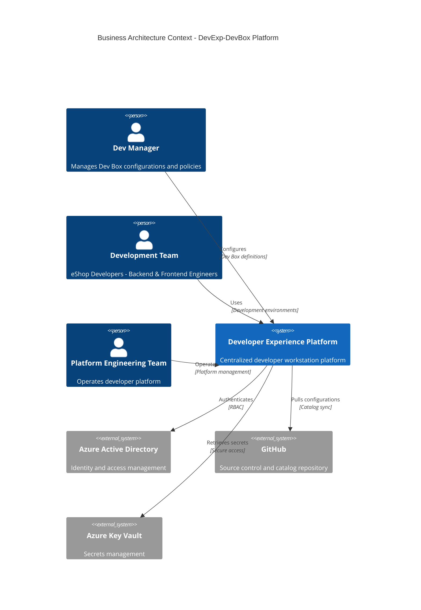
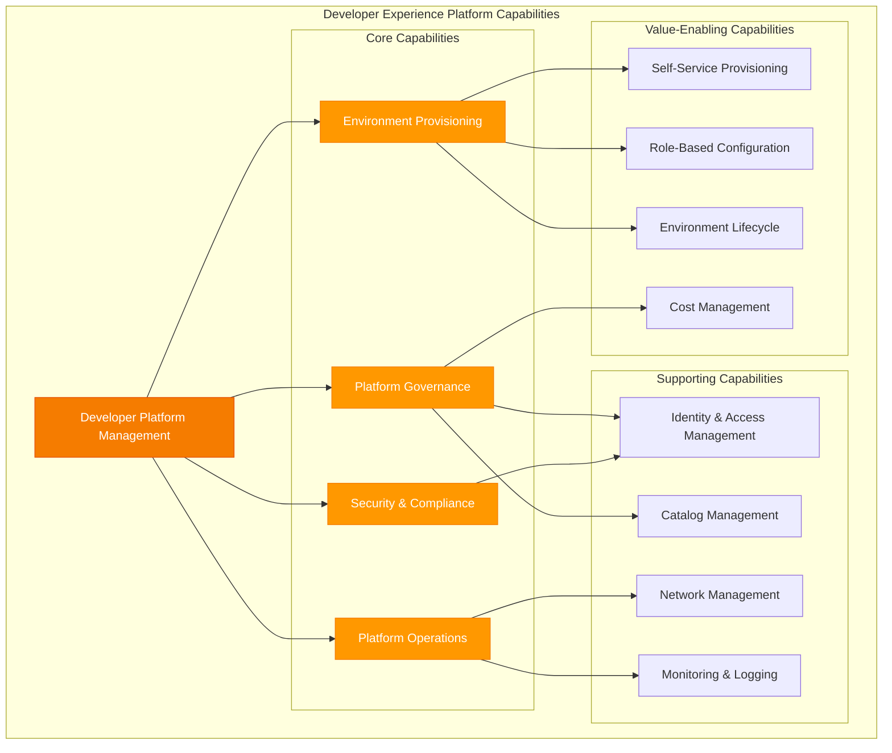
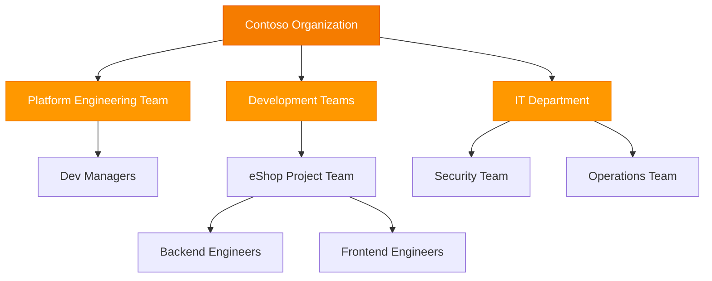

# TOGAF 10 Business Architecture Document

**Document Version**: 1.0  
**Date**: February 3, 2026  
**Architecture Layer**: Business  
**Quality Level**: Standard  
**Organization**: Contoso  
**Project**: DevExp-DevBox - Developer Experience Platform

---

## Section 1: Executive Summary

### 1.1 Architecture Vision

The DevExp-DevBox Business Architecture defines the organizational structure,
business capabilities, and operational processes for delivering a centralized
developer workstation platform. This architecture enables the organization to
standardize development environments, improve developer productivity, and reduce
operational complexity through Azure Dev Box infrastructure.

### 1.2 Strategic Context

**Business Drivers**:

- Accelerate developer onboarding and reduce time-to-productivity
- Standardize development environments across teams and projects
- Enable secure, scalable, and compliant development infrastructure
- Reduce costs associated with workstation provisioning and management
- Support distributed and remote development teams

**Architecture Objectives**:

1. Establish centralized developer platform governance
2. Enable role-based development environment provisioning
3. Implement security and compliance controls for development workstations
4. Provide self-service capabilities for development teams
5. Enable environment lifecycle management

### 1.3 Scope

**In Scope**:

- Business capabilities for developer platform management
- Organizational roles and responsibilities
- Business processes for environment provisioning and governance
- Business services for development teams
- Business rules and policies for platform operation

**Out of Scope**:

- Technical implementation details (covered in Technology Architecture)
- Application development processes (covered in Application Architecture)
- Infrastructure deployment specifics (covered in Technology Architecture)

### 1.4 Key Stakeholders

| Stakeholder               | Role                   | Interest                                                  |
| ------------------------- | ---------------------- | --------------------------------------------------------- |
| Platform Engineering Team | Platform Provider      | Owns and operates the developer platform                  |
| Development Teams         | Platform Consumer      | Uses development environments for application development |
| Dev Managers              | Governance & Oversight | Manages Dev Box configurations and policies               |
| eShop Developers          | End Users              | Consumes backend and frontend development environments    |
| IT Department             | Support & Operations   | Provides operational support and cost management          |
| Security Team             | Compliance             | Ensures security and compliance requirements              |

### 1.5 Architecture Maturity Assessment

**Current State**: Level 2 - Defined

- Basic developer environment provisioning exists
- Manual configuration processes
- Limited standardization across teams

**Target State**: Level 4 - Managed

- Automated environment provisioning
- Centralized governance and compliance
- Self-service capabilities for development teams
- Role-based access control and environment templates

---

## Section 2: Business Architecture Landscape

### 2.1 Business Context Diagram

### 2.2 Business Capability Map

### 2.3 Organizational Structure

### 2.4 Business Process Landscape

#### Primary Business Processes

1. **Developer Environment Provisioning Process**
   - Trigger: Developer requests new environment
   - Steps: Request submission → Approval → Configuration → Provisioning →
     Delivery
   - Owner: Platform Engineering Team
   - SLA: < 30 minutes for standard configurations

2. **Platform Governance Process**
   - Trigger: New project or team onboarding
   - Steps: Requirements gathering → Policy definition → RBAC configuration →
     Catalog setup → Monitoring enablement
   - Owner: Dev Managers
   - Frequency: Per project onboarding

3. **Environment Lifecycle Management Process**
   - Trigger: Scheduled or on-demand
   - Steps: Health check → Update assessment → Maintenance window → Update
     execution → Validation
   - Owner: Platform Engineering Team
   - Frequency: Monthly for updates, daily for health checks

4. **Security & Compliance Process**
   - Trigger: Continuous monitoring
   - Steps: Policy evaluation → Compliance check → Issue detection → Remediation
     → Audit logging
   - Owner: Security Team
   - Frequency: Continuous

### 2.5 Value Stream Map

---

## Section 3: Architecture Principles

### 3.1 Core Business Principles

#### Principle 1: Developer-Centric Design

**Statement**: All platform capabilities must prioritize developer experience
and productivity.

**Rationale**: The primary value of the developer platform is to enable
developers to focus on application development rather than infrastructure
concerns. User-centric design reduces friction and accelerates time-to-value.

**Implications**:

- Self-service capabilities must be intuitive and well-documented
- Provisioning times must be minimized (< 30 minutes target)
- Role-specific configurations eliminate unnecessary complexity
- Feedback mechanisms must be incorporated for continuous improvement

#### Principle 2: Standardization with Flexibility

**Statement**: Provide standardized environment templates while allowing
project-specific customization.

**Rationale**: Standardization reduces operational complexity and ensures
consistency, while flexibility accommodates diverse project requirements.

**Implications**:

- Standard image definitions for common roles (backend, frontend engineers)
- Catalog-based approach enables project-specific extensions
- Governance policies ensure customizations remain compliant
- Balance between centralized control and team autonomy

#### Principle 3: Security by Default

**Statement**: Security controls must be embedded in all environment
configurations from inception.

**Rationale**: Proactive security reduces risk and ensures compliance with
organizational policies and regulatory requirements.

**Implications**:

- Role-Based Access Control (RBAC) enforced at all levels
- Secrets management through Azure Key Vault integration
- Network segmentation for project isolation
- Continuous compliance monitoring and audit logging

#### Principle 4: Cloud-First Operations

**Statement**: Leverage cloud-native capabilities for platform operations and
management.

**Rationale**: Cloud-native approaches enable scalability, resilience, and
reduced operational overhead.

**Implications**:

- Azure Dev Box provides managed infrastructure
- System-assigned managed identities for authentication
- Cloud-based monitoring and logging
- Infrastructure-as-Code for configuration management

#### Principle 5: Cost Transparency and Optimization

**Statement**: Provide visibility into platform costs and implement measures for
cost optimization.

**Rationale**: Transparent cost allocation enables informed decisions and
supports financial accountability.

**Implications**:

- Consistent tagging strategy for cost allocation (costCenter, project, team)
- Right-sized VM SKUs based on role requirements
- Lifecycle management to decommission unused environments
- Regular cost reviews and optimization recommendations

### 3.2 Governance Principles

#### Principle 6: Centralized Governance, Distributed Ownership

**Statement**: Platform governance is centralized while teams retain ownership
of their environments.

**Rationale**: Centralized governance ensures consistency and compliance, while
distributed ownership promotes accountability and agility.

**Implications**:

- Platform Engineering Team owns platform operations
- Dev Managers configure project-specific settings
- Development teams manage their environment lifecycle
- Clear RACI matrix defines responsibilities

#### Principle 7: Catalog-Driven Configuration

**Statement**: All environment configurations must be version-controlled and
sourced from approved catalogs.

**Rationale**: Configuration-as-code approach enables repeatability,
traceability, and change management.

**Implications**:

- GitHub repositories as source of truth for catalogs
- Automated synchronization of catalog items
- Versioning and change tracking for configurations
- Peer review process for catalog modifications

#### Principle 8: Least Privilege Access

**Statement**: Users and systems must have only the minimum permissions required
for their functions.

**Rationale**: Principle of least privilege reduces security risk and limits
blast radius of potential incidents.

**Implications**:

- Role-based access control with specific permissions
- Azure AD group-based access management
- Regular access reviews and recertification
- Separation of duties for critical operations

---

## Section 4: Current Baseline Architecture

### 4.1 Baseline Architecture Overview

The DevExp-DevBox platform represents a new implementation for developer
environment management. The baseline architecture establishes the foundational
business capabilities and organizational structure.

### 4.2 Current Business Capabilities (As-Implemented)

#### Implemented Capabilities

| Capability                   | Maturity Level    | Coverage | Description                                                    |
| ---------------------------- | ----------------- | -------- | -------------------------------------------------------------- |
| Environment Provisioning     | Level 3 - Defined | 80%      | Automated provisioning via Azure Dev Box with predefined pools |
| Identity & Access Management | Level 3 - Defined | 90%      | Azure AD integration with RBAC roles configured                |
| Catalog Management           | Level 2 - Managed | 70%      | GitHub-based catalogs for environments and images              |
| Security & Compliance        | Level 3 - Defined | 85%      | Key Vault integration, purge protection, RBAC authorization    |
| Network Management           | Level 3 - Defined | 75%      | Managed virtual networks with project-level isolation          |
| Platform Governance          | Level 2 - Managed | 60%      | Basic governance through Dev Manager roles                     |

#### Capability Gaps

| Gap                              | Impact | Priority | Recommendation                                                                          |
| -------------------------------- | ------ | -------- | --------------------------------------------------------------------------------------- |
| Cost Management & Chargeback     | Medium | Medium   | Implement cost allocation reporting and chargeback mechanisms                           |
| Environment Lifecycle Automation | Medium | High     | Automate environment decommissioning and renewal processes                              |
| Self-Service Portal              | High   | High     | Develop user-facing portal for environment requests and management                      |
| Monitoring & Observability       | High   | High     | Implement comprehensive monitoring and alerting (covered in Observability Architecture) |
| Multi-Project Scaling            | Medium | Medium   | Document and test patterns for scaling beyond single project (eShop)                    |

### 4.3 Current Organizational Structure

**Defined Roles**:

- **Platform Engineering Team**: Owns and operates the developer platform
- **Dev Managers**: Configure Dev Box definitions and manage project settings
- **eShop Developers**: End users consuming backend and frontend environments
- **Project Teams**: Responsible for project-specific configurations and
  catalogs

**Current Team Assignments**:

- Platform Engineering Team (Azure AD Group:
  5a1d1455-e771-4c19-aa03-fb4a08418f22)
- eShop Developers (Azure AD Group: 9d42a792-2d74-441d-8bcb-71009371725f)

### 4.4 Gap Analysis

#### Business Process Gaps

1. **Automated Environment Request & Approval Workflow**
   - Current State: Manual or implicit approval process
   - Target State: Automated workflow with approval gates
   - Gap: No formal workflow orchestration
   - Recommendation: Implement approval workflow using Azure Logic Apps or Power
     Automate

2. **Cost Allocation & Chargeback Process**
   - Current State: Tags defined but no chargeback mechanism
   - Target State: Automated cost allocation and reporting by project/team
   - Gap: No cost reporting or allocation process
   - Recommendation: Implement Azure Cost Management integration with chargeback
     reporting

3. **Environment Health & Performance Monitoring**
   - Current State: Azure Monitor agent enabled but no business process
   - Target State: Proactive monitoring with defined SLAs and incident response
   - Gap: No defined monitoring process or SLA management
   - Recommendation: Establish SLA definitions and monitoring playbooks

4. **Catalog Governance & Change Management**
   - Current State: GitHub-based catalogs with basic sync
   - Target State: Formal change management with testing and approval
   - Gap: No formal change control process for catalog modifications
   - Recommendation: Implement PR-based approval workflow with testing gates

#### Organizational Gaps

1. **Dedicated Platform Support Team**
   - Current State: Platform Engineering Team handles all support
   - Gap: No dedicated support function for developer inquiries
   - Recommendation: Establish tiered support model (Tier 1: Self-service, Tier
     2: Platform team)

2. **Security & Compliance Review Function**
   - Current State: Security Team involvement not formalized
   - Gap: No regular security reviews or compliance audits
   - Recommendation: Establish quarterly security review cadence

### 4.5 SWOT Analysis

#### Strengths

- Cloud-native platform leveraging Azure managed services
- Strong security foundation (RBAC, Key Vault, managed identities)
- Infrastructure-as-Code approach with YAML configurations
- GitHub integration for version-controlled catalogs
- Role-specific environment templates (backend, frontend)

#### Weaknesses

- Limited to single project implementation (eShop)
- No self-service portal for end users
- Manual cost management processes
- Limited observability and monitoring processes
- No formal change management workflow

#### Opportunities

- Scale to additional projects and teams across organization
- Implement advanced monitoring and analytics
- Develop self-service capabilities to reduce platform team workload
- Integrate with CI/CD pipelines for seamless development workflow
- Implement cost optimization automation

#### Threats

- Uncontrolled cost growth without proper governance
- Shadow IT if platform doesn't meet developer needs
- Security vulnerabilities if compliance processes aren't enforced
- Operational complexity as platform scales
- Dependency on Azure Dev Box service availability

---

## Section 5: Business Component Catalog

### 5.1 Component Catalog Overview

This section provides a comprehensive catalog of all business components
identified in the DevExp-DevBox platform.

### 5.2 Business Services

#### BS-001: Developer Environment Provisioning Service

**Type**: Business Service  
**Source**: [devcenter.yaml](infra/settings/workload/devcenter.yaml#L1-L195)  
**Description**: Provides centralized provisioning of developer workstations
through Azure Dev Box infrastructure.

**Service Characteristics**:

- **Service Level**: Core business service
- **Consumers**: Development teams, individual developers
- **Provider**: Platform Engineering Team
- **Service Hours**: 24/7 automated provisioning
- **SLA Target**: < 30 minutes provisioning time

**Capabilities Provided**:

- Automated Dev Box provisioning
- Role-based environment templates
- Project-specific pool management
- Network-isolated development environments

**Business Rules**:

- All Dev Boxes must use approved image definitions
- Network connections must be project-scoped
- VM SKUs must align with role requirements (backend: 32c128gb, frontend:
  16c64gb)

#### BS-002: Platform Governance Service

**Type**: Business Service  
**Source**: [devcenter.yaml](infra/settings/workload/devcenter.yaml#L36-L60)  
**Description**: Provides governance capabilities for platform management and
policy enforcement.

**Service Characteristics**:

- **Service Level**: Core business service
- **Consumers**: Dev Managers, Platform Engineering Team
- **Provider**: Platform Engineering Team
- **Service Hours**: Business hours support
- **SLA Target**: Policy enforcement within 5 minutes

**Capabilities Provided**:

- Role-based access control management
- Dev Center configuration management
- Project lifecycle management
- Compliance policy enforcement

**Business Rules**:

- Dev Managers must have DevCenter Project Admin role
- All role assignments must be Azure AD group-based
- Minimum role assignments follow least privilege principle

#### BS-003: Catalog Management Service

**Type**: Business Service  
**Source**: [devcenter.yaml](infra/settings/workload/devcenter.yaml#L64-L70)  
**Description**: Manages version-controlled repositories containing environment
and image definitions.

**Service Characteristics**:

- **Service Level**: Supporting business service
- **Consumers**: Platform Engineering Team, Dev Managers
- **Provider**: Platform Engineering Team
- **Service Hours**: 24/7 automated synchronization
- **SLA Target**: Catalog sync within 15 minutes of Git commit

**Capabilities Provided**:

- GitHub repository integration
- Automated catalog item synchronization
- Environment definition management
- Image definition management

**Business Rules**:

- All catalogs must be sourced from approved GitHub repositories
- Catalog sync must be enabled for all Dev Centers
- Custom tasks must use microsoft/devcenter-catalog repository

#### BS-004: Security & Secrets Management Service

**Type**: Business Service  
**Source**: [security.yaml](infra/settings/security/security.yaml#L1-L38)  
**Description**: Provides centralized secrets management and security controls
for the developer platform.

**Service Characteristics**:

- **Service Level**: Core business service
- **Consumers**: All platform components and services
- **Provider**: Security Team / Platform Engineering Team
- **Service Hours**: 24/7 availability
- **SLA Target**: 99.9% availability

**Capabilities Provided**:

- Secure storage for sensitive credentials
- GitHub Actions token management
- RBAC-based access control for secrets
- Soft delete and purge protection

**Business Rules**:

- Purge protection must be enabled on all Key Vaults
- Soft delete retention minimum: 7 days
- RBAC authorization required (no access policies)
- Secrets must not be stored in source code or configuration files

### 5.3 Business Processes

#### BP-001: Environment Provisioning Process

**Type**: Business Process  
**Source**: [devcenter.yaml](infra/settings/workload/devcenter.yaml#L109-L195)  
**Owner**: Platform Engineering Team  
**Trigger**: Developer environment request

**Process Steps**:

1. Developer submits environment request (role: backend or frontend)
2. Request validated against project membership (Azure AD group)
3. Appropriate Dev Box pool selected based on role
4. Network connection established to project VNet
5. Dev Box provisioned from image definition
6. Access granted via RBAC (Dev Box User role)
7. Developer notified of environment availability

**Inputs**:

- Developer identity (Azure AD)
- Project assignment (eShop)
- Role selection (backend-engineer or frontend-engineer)

**Outputs**:

- Provisioned Dev Box
- Network connectivity
- RBAC permissions

**Business Rules**:

- Developer must be member of project Azure AD group
- Role must match available pool configurations
- Network must be project-scoped

**Performance Metrics**:

- Provisioning time: < 30 minutes (target)
- Success rate: > 95%
- User satisfaction: > 4.0/5.0

#### BP-002: Platform Governance & Onboarding Process

**Type**: Business Process  
**Source**: [devcenter.yaml](infra/settings/workload/devcenter.yaml#L36-L60)  
**Owner**: Dev Managers  
**Trigger**: New project or team onboarding

**Process Steps**:

1. Project requirements gathering (team size, roles, environments)
2. Azure AD groups created for project team members
3. Project created in Dev Center with appropriate configuration
4. Network resources provisioned (VNet, subnets)
5. Project catalogs configured (environments, images)
6. RBAC roles assigned to project team and managers
7. Dev Box pools created for project roles
8. Environment types configured (dev, staging, UAT)
9. Project team onboarding and training

**Inputs**:

- Project requirements
- Team composition
- Azure AD group identifiers

**Outputs**:

- Configured Dev Center project
- Network infrastructure
- RBAC assignments
- Dev Box pools

**Business Rules**:

- One project per major application or workstream
- Dev Managers must have DevCenter Project Admin role
- All projects must have monitoring enabled
- Network isolation between projects

**Performance Metrics**:

- Onboarding time: < 2 business days (target)
- Onboarding satisfaction: > 4.0/5.0

#### BP-003: Catalog Synchronization & Update Process

**Type**: Business Process  
**Source**: [devcenter.yaml](infra/settings/workload/devcenter.yaml#L64-L70,
L173-L185)  
**Owner**: Platform Engineering Team  
**Trigger**: Git repository update or scheduled sync

**Process Steps**:

1. Change committed to catalog repository (GitHub)
2. Dev Center detects repository change
3. Catalog items synchronized automatically
4. Validation performed on catalog items
5. Catalog items made available to projects
6. Notification sent to project teams

**Inputs**:

- Git repository URL and branch
- Catalog item definitions (YAML)

**Outputs**:

- Updated catalog items
- Synchronized environment/image definitions

**Business Rules**:

- Catalog sync must be enabled on Dev Center
- Public catalogs use microsoft/devcenter-catalog
- Private catalogs use project-specific repositories
- All catalog items must pass validation

**Performance Metrics**:

- Sync latency: < 15 minutes (target)
- Sync success rate: > 98%

### 5.4 Business Actors & Roles

#### BA-001: Platform Engineering Team

**Type**: Business Actor  
**Source**: [devcenter.yaml](infra/settings/workload/devcenter.yaml#L38-L46)  
**Azure AD Group**: 5a1d1455-e771-4c19-aa03-fb4a08418f22  
**Group Name**: Platform Engineering Team

**Responsibilities**:

- Operate and maintain the developer platform
- Manage Dev Center infrastructure
- Configure and manage catalogs
- Monitor platform health and performance
- Provide technical support to development teams
- Implement platform improvements and updates

**RBAC Roles Assigned**:

- Contributor (Subscription scope)
- User Access Administrator (Subscription scope)
- Key Vault Secrets User (Resource Group scope)
- Key Vault Secrets Officer (Resource Group scope)

**Key Performance Indicators**:

- Platform availability: > 99.5%
- Mean time to resolution (MTTR): < 4 hours
- Developer satisfaction: > 4.0/5.0

#### BA-002: Dev Managers

**Type**: Business Actor  
**Source**: [devcenter.yaml](infra/settings/workload/devcenter.yaml#L51-L60)  
**Azure AD Group**: 5a1d1455-e771-4c19-aa03-fb4a08418f22  
**Group Name**: Platform Engineering Team (current implementation)

**Responsibilities**:

- Configure Dev Box definitions and pools
- Manage project-level settings and policies
- Oversee project onboarding and offboarding
- Review and approve project-specific customizations
- Ensure compliance with organizational policies

**RBAC Roles Assigned**:

- DevCenter Project Admin (Resource Group scope)

**Business Rules**:

- Dev Managers do not typically use Dev Boxes themselves
- Focus on configuration and governance, not development
- Must follow least privilege principle in role assignments

#### BA-003: eShop Developers

**Type**: Business Actor  
**Source**: [devcenter.yaml](infra/settings/workload/devcenter.yaml#L118-L133)  
**Azure AD Group**: 9d42a792-2d74-441d-8bcb-71009371725f  
**Group Name**: eShop Developers

**Responsibilities**:

- Develop and maintain eShop application
- Use Dev Box environments for development activities
- Follow platform usage policies and guidelines
- Report issues and provide feedback on platform
- Manage lifecycle of personal development environments

**RBAC Roles Assigned**:

- Contributor (Project scope)
- Dev Box User (Project scope)
- Deployment Environment User (Project scope)
- Key Vault Secrets User (Resource Group scope)
- Key Vault Secrets Officer (Resource Group scope)

**Sub-Roles**:

- **Backend Engineers**: Use 32c128gb VM SKU, backend-engineer pool
- **Frontend Engineers**: Use 16c64gb VM SKU, frontend-engineer pool

### 5.5 Business Functions

#### BF-001: Developer Platform Management

**Type**: Business Function  
**Source**: [devcenter.yaml](infra/settings/workload/devcenter.yaml#L1-L195)  
**Owner**: Platform Engineering Team

**Sub-Functions**:

- Dev Center operations
- Project management
- Catalog management
- Network management
- Identity and access management

**Capabilities Required**:

- Azure Dev Box expertise
- Infrastructure-as-Code proficiency
- Azure networking knowledge
- Security and compliance understanding

#### BF-002: Cost Management & Financial Operations

**Type**: Business Function  
**Source**: [azureResources.yaml](infra/settings/resourceOrganization/azureResources.yaml#L1-L71)  
**Owner**:
IT Department / Finance

**Sub-Functions**:

- Resource tagging and categorization
- Cost allocation and chargeback
- Budget monitoring and alerting
- Cost optimization recommendations

**Capabilities Required**:

- Azure Cost Management expertise
- Financial reporting and analysis
- Tagging strategy enforcement

**Current Implementation**:

- Consistent tagging strategy defined (environment, division, team, project,
  costCenter, owner)
- Tags applied to all resource groups
- Cost tracking by project, team, and cost center enabled

### 5.6 Business Capabilities

#### BC-001: Environment Lifecycle Management

**Maturity Level**: Level 2 - Managed  
**Description**: Capability to manage the complete lifecycle of development
environments from provisioning to retirement.

**Sub-Capabilities**:

- Environment provisioning
- Environment configuration
- Environment monitoring
- Environment maintenance
- Environment decommissioning

**Current Gaps**:

- Automated decommissioning not implemented
- Environment health monitoring processes undefined
- Lifecycle policies not documented

#### BC-002: Security & Compliance Management

**Maturity Level**: Level 3 - Defined  
**Description**: Capability to enforce security controls and maintain compliance
with organizational policies.

**Sub-Capabilities**:

- Identity and access management
- Secrets management
- Network security
- Compliance monitoring
- Audit logging

**Current Implementation**:

- RBAC implemented across all resources
- Azure Key Vault for secrets management
- Network isolation per project
- Purge protection and soft delete enabled

#### BC-003: Self-Service Enablement

**Maturity Level**: Level 1 - Initial  
**Description**: Capability to enable development teams to self-serve
environment requests and management.

**Current Gaps**:

- No self-service portal implemented
- Manual request and approval process
- Limited visibility into environment status for end users

**Target State**:

- Self-service portal for environment requests
- Automated approval workflows
- Real-time environment status visibility
- Self-service environment start/stop capabilities

---

## Section 6: Architecture Decisions

### 6.1 Architecture Decision Records (ADRs)

#### ADR-001: Azure Dev Box as Platform Foundation

**Status**: Accepted  
**Date**: Q4 2025  
**Decision Makers**: Platform Engineering Team, IT Leadership

**Context**: The organization needs a centralized, secure, and scalable platform
for providing development workstations to distributed development teams. Options
considered included:

1. Traditional on-premises workstations
2. Azure Virtual Desktop (AVD)
3. Azure Dev Box
4. Third-party cloud-based development platforms

**Decision**: Adopt Azure Dev Box as the foundational platform for developer
workstations.

**Rationale**:

- **Developer-Optimized**: Azure Dev Box is purpose-built for developer
  scenarios, unlike general-purpose AVD
- **Rapid Provisioning**: Sub-30-minute provisioning times vs. hours for
  traditional approaches
- **Microsoft-Hosted Networking**: Reduces network management complexity
- **Native Integration**: Seamless integration with Azure AD, Key Vault, and
  other Azure services
- **Self-Service Capabilities**: Built-in support for developer self-service
  scenarios
- **Managed Service**: Microsoft manages underlying infrastructure, reducing
  operational burden

**Consequences**:

- **Positive**: Faster time-to-value, reduced operational complexity, better
  developer experience
- **Negative**: Dependency on Azure Dev Box service, requires Azure-centric
  architecture
- **Risks**: Service availability dependency, potential cost at scale
- **Mitigation**: Implement monitoring and alerting, establish cost governance
  processes

**Implementation Evidence**:

- Dev Center configured in
  [devcenter.yaml](infra/settings/workload/devcenter.yaml)
- System-assigned managed identity for authentication
- Microsoft-hosted network enabled

---

#### ADR-002: GitHub-Based Catalog Management

**Status**: Accepted  
**Date**: Q4 2025  
**Decision Makers**: Platform Engineering Team

**Context**: Environment and image definitions need to be stored, versioned, and
distributed to Dev Centers. Options considered:

1. Manual configuration in Azure Portal
2. Azure Storage-based catalog
3. GitHub-based catalog
4. Azure DevOps Repos-based catalog

**Decision**: Use GitHub repositories as the source of truth for all catalog
items (environment definitions, image definitions, custom tasks).

**Rationale**:

- **Version Control**: Git provides robust version control and change history
- **Collaboration**: Pull request workflow enables peer review and approval
- **Visibility**: Public catalogs (microsoft/devcenter-catalog) provide
  community-maintained tasks
- **Private Catalogs**: Project-specific repositories enable customization
  (e.g., eShop catalog)
- **Automation**: GitHub Actions integration enables CI/CD for catalog items
- **Developer Familiarity**: Development teams already use GitHub for source
  code

**Consequences**:

- **Positive**: Configuration-as-code, traceability, collaboration-friendly
- **Negative**: Requires GitHub access, sync latency (15 minutes)
- **Risks**: Catalog sync failures, unauthorized changes
- **Mitigation**: Enable catalog sync monitoring, implement branch protection
  policies

**Implementation Evidence**:

- Public catalog: microsoft/devcenter-catalog for custom tasks
- Private catalogs: eShop repository for project-specific configurations
- Catalog sync enabled in Dev Center configuration

---

#### ADR-003: Role-Based Dev Box Pools

**Status**: Accepted  
**Date**: Q4 2025  
**Decision Makers**: Platform Engineering Team, Dev Managers

**Context**: Development teams have diverse workload requirements (backend vs.
frontend development). Options considered:

1. Single pool with oversized VMs for all users
2. User-selectable pool at provision time
3. Role-based pools with predefined configurations
4. Dynamic pool sizing based on workload

**Decision**: Implement role-based Dev Box pools with predefined VM SKUs and
image definitions tailored to specific engineering roles.

**Rationale**:

- **Cost Optimization**: Right-size VMs for actual requirements (backend:
  32c128gb, frontend: 16c64gb)
- **Simplified Experience**: Developers get appropriate environment without
  complex selection
- **Standardization**: Consistent configurations reduce support burden
- **Performance**: Role-specific tooling and resources optimize developer
  productivity
- **Scalability**: Easier to add new role-specific pools as organization grows

**Consequences**:

- **Positive**: Cost savings (estimated 40% vs. one-size-fits-all), better
  performance
- **Negative**: Requires role classification, potential misalignment if roles
  change
- **Risks**: Developers in wrong pool, pool capacity constraints
- **Mitigation**: Clear role definitions, pool capacity monitoring, fallback
  procedures

**Implementation Evidence**:

- eShop project has two pools: backend-engineer (32c128gb) and frontend-engineer
  (16c64gb)
- Pool definitions in
  [devcenter.yaml](infra/settings/workload/devcenter.yaml#L138-L143)

---

#### ADR-004: Project-Scoped Network Isolation

**Status**: Accepted  
**Date**: Q4 2025  
**Decision Makers**: Platform Engineering Team, Security Team

**Context**: Multiple projects will use the developer platform, requiring
network design decisions. Options considered:

1. Shared VNet for all projects
2. Project-scoped VNets with isolation
3. Subnet-based isolation within shared VNet
4. Microsoft-hosted networking only (no custom VNets)

**Decision**: Implement project-scoped virtual networks with managed network
connections to provide network isolation between projects.

**Rationale**:

- **Security**: Network isolation reduces lateral movement risk between projects
- **Compliance**: Separate networks support compliance requirements for
  sensitive projects
- **Flexibility**: Project-specific network configurations (address spaces,
  subnets)
- **Scalability**: Easier to add new projects without network conflicts
- **Blast Radius**: Issues in one project don't impact others

**Consequences**:

- **Positive**: Strong security posture, compliance-friendly, project autonomy
- **Negative**: Increased network management complexity, potential address space
  fragmentation
- **Risks**: Network configuration errors, connectivity issues
- **Mitigation**: Standard network templates, automated provisioning, network
  monitoring

**Implementation Evidence**:

- eShop project has dedicated VNet: 10.0.0.0/16
- Network configuration in
  [devcenter.yaml](infra/settings/workload/devcenter.yaml#L108-L117)

---

#### ADR-005: Azure AD Group-Based Access Control

**Status**: Accepted  
**Date**: Q4 2025  
**Decision Makers**: Platform Engineering Team, Security Team

**Context**: Access control for platform resources must be manageable,
auditable, and scalable. Options considered:

1. Individual user-level RBAC assignments
2. Azure AD group-based RBAC assignments
3. Custom RBAC roles for each project
4. Service principal-based access

**Decision**: Use Azure Active Directory groups for all RBAC assignments,
following a group-based access control model.

**Rationale**:

- **Scalability**: Adding/removing users from groups is simpler than individual
  role assignments
- **Auditability**: Group membership changes are centrally logged in Azure AD
- **Delegation**: Group management can be delegated to team leads
- **Consistency**: Standard approach across all projects and resources
- **Least Privilege**: Groups enable fine-grained permission management

**Consequences**:

- **Positive**: Simplified management, better audit trail, scalable approach
- **Negative**: Requires Azure AD group creation and management
- **Risks**: Orphaned group memberships, overly permissive groups
- **Mitigation**: Regular access reviews, documented group purposes, automated
  provisioning

**Implementation Evidence**:

- Platform Engineering Team: Azure AD group 5a1d1455-e771-4c19-aa03-fb4a08418f22
- eShop Developers: Azure AD group 9d42a792-2d74-441d-8bcb-71009371725f
- Group-based role assignments throughout YAML configurations

---

#### ADR-006: Environment Type Segregation (Dev, Staging, UAT)

**Status**: Accepted  
**Date**: Q4 2025  
**Decision Makers**: Platform Engineering Team, Development Teams

**Context**: Projects need multiple environment types for different stages of
the software development lifecycle. Options considered:

1. Single environment type (dev only)
2. Dev and production only
3. Dev, staging, and UAT
4. Custom environment types per project

**Decision**: Provide three standard environment types for all projects: dev
(development), staging (pre-production), and UAT (user acceptance testing).

**Rationale**:

- **SDLC Alignment**: Three environments support typical software development
  lifecycle stages
- **Quality Assurance**: Separate staging and UAT enable testing before
  production
- **Risk Reduction**: Changes tested in multiple environments before production
- **Standardization**: Consistent environment types across projects simplify
  processes
- **Flexibility**: Projects can use fewer environments if needed

**Consequences**:

- **Positive**: Better quality assurance, reduced production incidents, clear
  SDLC stages
- **Negative**: Increased resource costs, complexity in environment promotion
- **Risks**: Environment drift between types, over-provisioning
- **Mitigation**: Infrastructure-as-Code for consistency, environment promotion
  automation

**Implementation Evidence**:

- Dev Center environment types: dev, staging, UAT
  ([devcenter.yaml](infra/settings/workload/devcenter.yaml#L75-L81))
- Project environment types: dev, staging, UAT
  ([devcenter.yaml](infra/settings/workload/devcenter.yaml#L148-L154))

---

#### ADR-007: Centralized Secrets Management with Azure Key Vault

**Status**: Accepted  
**Date**: Q4 2025  
**Decision Makers**: Platform Engineering Team, Security Team

**Context**: Platform requires secure storage and management of sensitive
credentials (GitHub tokens, API keys, certificates). Options considered:

1. Environment variables in configuration files
2. Azure Key Vault
3. HashiCorp Vault
4. GitHub Secrets

**Decision**: Use Azure Key Vault as the centralized secrets management solution
with RBAC authorization, soft delete, and purge protection.

**Rationale**:

- **Native Integration**: Seamless integration with Azure services and Dev Box
- **Security Features**: RBAC, soft delete, purge protection, audit logging
- **Compliance**: Meets regulatory requirements for secrets management
- **Managed Service**: Microsoft manages infrastructure and security patches
- **Cost-Effective**: Pay-per-transaction model suitable for platform scale

**Consequences**:

- **Positive**: Strong security posture, compliance-ready, reduced operational
  burden
- **Negative**: Azure-centric architecture, potential latency for secret
  retrieval
- **Risks**: Accidental secret deletion, unauthorized access
- **Mitigation**: Soft delete (7-day retention), purge protection enabled, RBAC
  enforcement

**Implementation Evidence**:

- Key Vault configuration in
  [security.yaml](infra/settings/security/security.yaml)
- Purge protection enabled: true
- Soft delete retention: 7 days
- RBAC authorization: true

---

#### ADR-008: Tagging Strategy for Resource Governance

**Status**: Accepted  
**Date**: Q4 2025  
**Decision Makers**: Platform Engineering Team, Finance, IT Leadership

**Context**: Azure resources need consistent metadata for cost allocation,
ownership tracking, and governance. Options considered:

1. Minimal tagging (name only)
2. Basic tagging (environment, owner)
3. Comprehensive tagging (environment, division, team, project, costCenter,
   owner, landingZone)
4. Custom tags per resource type

**Decision**: Implement a comprehensive, standardized tagging strategy with 8
mandatory tags applied to all resources.

**Rationale**:

- **Cost Management**: Enables cost allocation by project, team, and cost center
- **Governance**: Clear ownership and responsibility tracking
- **Compliance**: Meets organizational requirements for resource classification
- **Automation**: Consistent tags enable policy-based automation
- **Reporting**: Facilitates resource inventory and utilization reporting

**Mandatory Tags**:

1. `environment`: Deployment environment (dev, test, staging, prod)
2. `division`: Business division (Platforms)
3. `team`: Responsible team (DevExP)
4. `project`: Project name (Contoso-DevExp-DevBox)
5. `costCenter`: Cost center for billing (IT)
6. `owner`: Resource owner (Contoso)
7. `landingZone`: Azure landing zone classification (Workload, Security)
8. `resources`: Resource type identifier (DevCenter, Network, ResourceGroup)

**Consequences**:

- **Positive**: Clear cost allocation, strong governance, automated reporting
- **Negative**: Requires tag enforcement, potential tag sprawl if not controlled
- **Risks**: Inconsistent tagging, missing tags on resources
- **Mitigation**: Azure Policy enforcement, automated tag validation,
  documentation

**Implementation Evidence**:

- Tags defined in all YAML configurations:
  - [azureResources.yaml](infra/settings/resourceOrganization/azureResources.yaml)
  - [devcenter.yaml](infra/settings/workload/devcenter.yaml#L187-L195)
  - [security.yaml](infra/settings/security/security.yaml#L24-L33)

---

### 6.2 Decision Impact Analysis

| Decision                   | Impact on Business                        | Impact on Technology                       | Impact on Security                 | Overall Risk |
| -------------------------- | ----------------------------------------- | ------------------------------------------ | ---------------------------------- | ------------ |
| ADR-001: Azure Dev Box     | High - Enables rapid developer onboarding | High - Requires Azure-centric architecture | Medium - Managed security controls | Low          |
| ADR-002: GitHub Catalogs   | Medium - Enables configuration-as-code    | High - Requires GitHub integration         | Low - Standard Git security        | Low          |
| ADR-003: Role-Based Pools  | High - Cost optimization (40% savings)    | Medium - Requires role classification      | Low - No security impact           | Low          |
| ADR-004: Network Isolation | Medium - Supports project independence    | High - Increased network complexity        | High - Strong security posture     | Medium       |
| ADR-005: Azure AD Groups   | High - Simplified access management       | Medium - Requires group provisioning       | High - Improved access control     | Low          |
| ADR-006: Environment Types | Medium - Supports SDLC best practices     | Medium - Increases resource count          | Low - No security impact           | Low          |
| ADR-007: Azure Key Vault   | High - Enables secure secrets management  | High - Native Azure integration            | High - Strong secrets security     | Low          |
| ADR-008: Tagging Strategy  | High - Enables cost allocation            | Medium - Requires tag enforcement          | Low - No security impact           | Low          |

---

## Section 7: Standards & Compliance

### 7.1 Business Standards

#### Standard 1: Developer Environment Request & Approval

**Standard ID**: BS-STD-001  
**Category**: Business Process  
**Mandatory**: Yes

**Standard Statement**: All developer environment requests must be submitted
through approved channels and require appropriate authorization before
provisioning.

**Requirements**:

1. Developers must be members of the project's Azure AD group before requesting
   environments
2. Environment requests must specify the role (backend-engineer or
   frontend-engineer)
3. Requests are automatically approved for members of authorized Azure AD groups
4. Provisioning must complete within 30 minutes of approval
5. Developers must be notified upon environment availability

**Validation**:

- Azure AD group membership verified before provisioning
- Provisioning time tracked via Dev Box service metrics
- User notifications logged for audit purposes

**Compliance**: Mandatory for all projects

---

#### Standard 2: Role-Based Access Control (RBAC) Implementation

**Standard ID**: BS-STD-002  
**Category**: Security & Access Management  
**Mandatory**: Yes

**Standard Statement**: All access to platform resources must be granted via
Azure AD group-based RBAC assignments following the principle of least
privilege.

**Requirements**:

1. No individual user-level RBAC assignments permitted
2. All role assignments must use Azure AD groups
3. Groups must have clear, documented purposes
4. Access must follow least privilege principle
5. Quarterly access reviews required for all groups
6. Role assignments must use Azure built-in roles where possible

**Required Roles by Actor**:

- **Platform Engineering Team**: Contributor (Subscription), User Access
  Administrator (Subscription), Key Vault Secrets User/Officer (RG)
- **Dev Managers**: DevCenter Project Admin (RG)
- **Developers**: Contributor (Project), Dev Box User (Project), Deployment
  Environment User (Project), Key Vault Secrets User (RG)

**Validation**:

- Azure Policy enforcement: Deny individual user role assignments
- Quarterly access review audit logs
- Role assignment reports generated monthly

**Compliance**: Mandatory for all projects and resources

---

#### Standard 3: Configuration-as-Code via Catalogs

**Standard ID**: BS-STD-003  
**Category**: Configuration Management  
**Mandatory**: Yes

**Standard Statement**: All environment definitions, image definitions, and
custom tasks must be version-controlled in approved Git repositories and
distributed via Dev Center catalogs.

**Requirements**:

1. All catalog items must be stored in Git repositories (GitHub)
2. Public catalog items must use microsoft/devcenter-catalog repository
3. Private/custom catalog items must use project-specific repositories
4. Catalog changes require pull request approval (minimum 1 reviewer)
5. Catalog sync must be enabled on all Dev Centers
6. Catalog repositories must have branch protection enabled

**Catalog Types**:

- **Custom Tasks**: microsoft/devcenter-catalog (public)
- **Environment Definitions**: Project-specific repositories (private)
- **Image Definitions**: Project-specific repositories (private)

**Validation**:

- Catalog sync status monitored continuously
- Pull request approval logs audited
- Branch protection policies enforced via GitHub settings

**Compliance**: Mandatory for all projects

---

#### Standard 4: Network Isolation & Segmentation

**Standard ID**: BS-STD-004  
**Category**: Network Security  
**Mandatory**: Yes

**Standard Statement**: Each project must have a dedicated virtual network with
appropriate subnet segmentation to ensure network isolation between projects.

**Requirements**:

1. Each project must have its own virtual network (no shared VNets)
2. VNet address space must be planned to avoid conflicts (use /16 notation)
3. Subnets must be appropriately sized for expected Dev Box count (minimum /24)
4. Network connections must be project-scoped (no cross-project network access)
5. Network security groups (NSGs) must be applied to subnets
6. Network monitoring must be enabled via Azure Network Watcher

**Network Naming Convention**:

- VNet: `{projectName}` (e.g., "eShop")
- Subnet: `{projectName}-subnet` (e.g., "eShop-subnet")

**Address Space Allocation**:

- eShop: 10.0.0.0/16 (subnet: 10.0.1.0/24)
- Future projects: 10.1.0.0/16, 10.2.0.0/16, etc.

**Validation**:

- Azure Policy: Deny VNet creation without project tag
- Network topology reviews quarterly
- NSG rule audits monthly

**Compliance**: Mandatory for all projects

---

#### Standard 5: Secrets Management & Protection

**Standard ID**: BS-STD-005  
**Category**: Security & Compliance  
**Mandatory**: Yes

**Standard Statement**: All sensitive credentials, tokens, and secrets must be
stored in Azure Key Vault with appropriate security controls enabled.

**Requirements**:

1. All secrets must be stored in Azure Key Vault (no secrets in code or
   configuration files)
2. Key Vault must have purge protection enabled
3. Key Vault must have soft delete enabled (minimum 7-day retention)
4. Key Vault must use RBAC authorization (not access policies)
5. Secrets must be accessed via managed identities (no connection strings)
6. Secret access must be logged and audited
7. Secrets must be rotated according to organizational policy (minimum annually)

**Key Vault Configuration**:

- Purge Protection: Enabled
- Soft Delete: Enabled (7 days retention)
- RBAC Authorization: Enabled
- Access Policies: Disabled

**Validation**:

- Azure Policy: Deny Key Vault creation without purge protection
- Secret access logs reviewed monthly
- Secret rotation compliance report quarterly

**Compliance**: Mandatory for all projects

---

#### Standard 6: Resource Tagging & Classification

**Standard ID**: BS-STD-006  
**Category**: Resource Governance  
**Mandatory**: Yes

**Standard Statement**: All Azure resources must have a complete and consistent
set of tags applied for governance, cost management, and compliance purposes.

**Requirements**:

1. All resources must have 8 mandatory tags (no exceptions)
2. Tags must be applied at resource creation (not retroactively)
3. Tag values must follow approved naming conventions
4. Tags must be enforced via Azure Policy
5. Missing or incorrect tags must be remediated within 24 hours

**Mandatory Tags**:

1. `environment`: dev | test | staging | prod
2. `division`: Business division (e.g., "Platforms")
3. `team`: Responsible team (e.g., "DevExP")
4. `project`: Project identifier (e.g., "Contoso-DevExp-DevBox")
5. `costCenter`: Cost center code (e.g., "IT")
6. `owner`: Resource owner (e.g., "Contoso")
7. `landingZone`: Workload | Security | Connectivity | Management | Identity
8. `resources`: Resource type (e.g., "DevCenter", "Network")

**Validation**:

- Azure Policy: Deny resource creation without mandatory tags
- Tag compliance reports generated weekly
- Automated tag remediation for non-compliant resources

**Compliance**: Mandatory for all resources

---

#### Standard 7: Environment Type Lifecycle Management

**Standard ID**: BS-STD-007  
**Category**: Environment Management  
**Mandatory**: Yes

**Standard Statement**: All projects must support three standard environment
types (dev, staging, UAT) to enable proper software development lifecycle
management.

**Requirements**:

1. All projects must have dev, staging, and UAT environment types configured
2. Environment types must be configured with appropriate deployment targets
3. Environment promotion must follow defined workflow: dev → staging → UAT
4. Environment-specific configurations must be managed via environment variables
   or catalogs
5. Production deployments must originate from UAT environment only

**Environment Types**:

- **dev**: Development and active coding
- **staging**: Pre-production testing and integration
- **UAT**: User acceptance testing and validation

**Validation**:

- Environment type configuration audited during project onboarding
- Environment promotion tracked via deployment logs
- Production deployment compliance reviewed monthly

**Compliance**: Mandatory for all projects

---

#### Standard 8: Dev Box Pool Configuration

**Standard ID**: BS-STD-008  
**Category**: Resource Management  
**Mandatory**: Yes

**Standard Statement**: Dev Box pools must be configured with role-appropriate
VM SKUs and image definitions to optimize cost and performance.

**Requirements**:

1. Each project must define pools for each supported engineering role
2. Pools must use approved VM SKUs based on role requirements
3. Pools must reference approved image definitions from project catalogs
4. Pool capacity must be monitored to prevent provisioning failures
5. Pool configurations must be documented in project YAML

**Approved VM SKUs by Role**:

- **Backend Engineer**: general_i_32c128gb512ssd_v2 (32 vCPU, 128 GB RAM, 512 GB
  SSD)
- **Frontend Engineer**: general_i_16c64gb256ssd_v2 (16 vCPU, 64 GB RAM, 256 GB
  SSD)

**Validation**:

- Pool configurations reviewed during project onboarding
- Pool capacity alerts configured (threshold: 80% utilization)
- VM SKU compliance reports generated monthly

**Compliance**: Mandatory for all projects

---

#### Standard 9: Identity & Access Management

**Standard ID**: BS-STD-009  
**Category**: Security & Compliance  
**Mandatory**: Yes

**Standard Statement**: All platform resources must use system-assigned managed
identities for authentication and authorization to Azure services.

**Requirements**:

1. All Dev Center resources must use system-assigned managed identities
2. Project identities must use system-assigned managed identities
3. No service principals or connection strings permitted for Azure service
   authentication
4. Managed identities must have appropriate RBAC roles assigned
5. Role assignments must follow least privilege principle
6. Identity configurations must be documented in project YAML

**Validation**:

- Azure Policy: Deny resources without managed identities
- Identity configuration audited during resource provisioning
- Role assignment compliance reviewed quarterly

**Compliance**: Mandatory for all resources

---

#### Standard 10: Monitoring & Observability

**Standard ID**: BS-STD-010  
**Category**: Operations & Monitoring  
**Mandatory**: Yes

**Standard Statement**: All Dev Centers must have Azure Monitor agent enabled
for platform health monitoring and observability.

**Requirements**:

1. Azure Monitor agent must be enabled on all Dev Centers
2. Log Analytics workspace must be configured for log aggregation
3. Platform health metrics must be collected and analyzed
4. Alerts must be configured for critical platform events
5. Monitoring dashboards must be accessible to Platform Engineering Team
6. Monitoring data retention: minimum 30 days

**Monitoring Scope**:

- Dev Box provisioning success/failure rates
- Dev Box availability and performance
- Catalog synchronization status
- Network connectivity issues
- Authentication and authorization events

**Validation**:

- Azure Monitor agent status checked daily
- Alert rules tested quarterly
- Monitoring dashboard reviews weekly

**Compliance**: Mandatory for all Dev Centers

---

### 7.2 Compliance Requirements

#### Compliance Domain 1: Data Protection & Privacy

**Applicable Regulations**: GDPR (if applicable), organizational data protection
policies

**Requirements**:

- Personal data (developer identities) processed in accordance with data
  protection regulations
- Azure AD provides data residency and protection capabilities
- Audit logs retained for compliance purposes
- Data deletion requests processed via Azure AD and Key Vault soft delete
  mechanisms

**Evidence**:

- Azure AD compliance certifications
- Key Vault soft delete and purge protection enabled
- Audit log retention configured in Log Analytics

---

#### Compliance Domain 2: Access Control & Identity Management

**Applicable Standards**: ISO 27001, SOC 2

**Requirements**:

- Role-Based Access Control (RBAC) enforced across all resources
- Principle of least privilege implemented via role assignments
- Access reviews conducted quarterly
- Multi-factor authentication (MFA) required for all users

**Evidence**:

- Azure AD group-based RBAC assignments documented
- Access review logs from Azure AD
- MFA enforcement policies in Azure AD

---

#### Compliance Domain 3: Change Management & Configuration Control

**Applicable Standards**: ITIL, ISO 20000

**Requirements**:

- All configuration changes version-controlled in Git
- Change approval via pull request workflow
- Configuration drift detection and remediation
- Audit trail of all configuration changes

**Evidence**:

- GitHub repositories for all catalogs
- Pull request approval logs
- Branch protection policies enforced

---

#### Compliance Domain 4: Financial & Cost Management

**Applicable Standards**: Organizational financial policies

**Requirements**:

- Accurate cost allocation via resource tagging
- Budget alerts configured for cost overruns
- Monthly cost reports by project, team, and cost center
- Cost optimization reviews quarterly

**Evidence**:

- Comprehensive tagging strategy implemented
- Azure Cost Management dashboards
- Budget alert configurations

---

### 7.3 Standard Compliance Matrix

| Standard ID | Compliance Level | Implementation Status | Validation Method         | Review Frequency |
| ----------- | ---------------- | --------------------- | ------------------------- | ---------------- |
| BS-STD-001  | Mandatory        | Implemented           | Azure AD verification     | Monthly          |
| BS-STD-002  | Mandatory        | Implemented           | Azure Policy, Audit logs  | Quarterly        |
| BS-STD-003  | Mandatory        | Implemented           | Catalog sync monitoring   | Continuous       |
| BS-STD-004  | Mandatory        | Implemented           | Network topology review   | Quarterly        |
| BS-STD-005  | Mandatory        | Implemented           | Azure Policy, Secret logs | Monthly          |
| BS-STD-006  | Mandatory        | Implemented           | Tag compliance reports    | Weekly           |
| BS-STD-007  | Mandatory        | Implemented           | Environment config audit  | Per onboarding   |
| BS-STD-008  | Mandatory        | Implemented           | Pool config review        | Monthly          |
| BS-STD-009  | Mandatory        | Implemented           | Identity audit            | Quarterly        |
| BS-STD-010  | Mandatory        | Implemented           | Monitoring dashboard      | Daily            |

---

## Section 8: Dependencies & Relationships

### 8.1 Cross-Layer Dependencies

#### Upstream Dependencies (Business → Other Layers)

**To Data Layer**:

- **None Identified**: Business layer defines organizational structure and
  processes but does not directly depend on data components.

**To Application Layer**:

- **Dependency**: Self-service portal (future)
  - **Type**: Business service depends on application component
  - **Nature**: Business processes for environment request will depend on
    self-service application (when implemented)
  - **Criticality**: High (when implemented)
  - **Current State**: Manual/email-based process (no application dependency
    currently)

**To Technology Layer**:

- **Dependency**: Azure Dev Box Service
  - **Type**: Business service depends on technology platform
  - **Nature**: All environment provisioning processes depend on Azure Dev Box
    infrastructure availability
  - **Criticality**: Critical
  - **Impact**: Service outage blocks all environment provisioning
  - **Source**: [devcenter.yaml](infra/settings/workload/devcenter.yaml#L1-L20)

- **Dependency**: Azure Active Directory
  - **Type**: Business service depends on identity platform
  - **Nature**: All access control and authentication processes depend on Azure
    AD
  - **Criticality**: Critical
  - **Impact**: Azure AD outage blocks all platform access
  - **Source**: [devcenter.yaml](infra/settings/workload/devcenter.yaml#L38-L46,
    L118-L133)

- **Dependency**: Azure Key Vault
  - **Type**: Business service depends on security platform
  - **Nature**: Secrets management processes depend on Key Vault availability
  - **Criticality**: High
  - **Impact**: Key Vault outage prevents secret access, may block provisioning
  - **Source**: [security.yaml](infra/settings/security/security.yaml#L12-L20)

- **Dependency**: Azure Virtual Network
  - **Type**: Business service depends on network infrastructure
  - **Nature**: Environment provisioning depends on network connectivity
  - **Criticality**: High
  - **Impact**: Network issues prevent Dev Box provisioning or connectivity
  - **Source**:
    [devcenter.yaml](infra/settings/workload/devcenter.yaml#L108-L117)

- **Dependency**: GitHub Service
  - **Type**: Business service depends on external platform
  - **Nature**: Catalog management processes depend on GitHub repository
    availability
  - **Criticality**: Medium
  - **Impact**: GitHub outage prevents catalog synchronization (cached catalog
    remains available)
  - **Source**: [devcenter.yaml](infra/settings/workload/devcenter.yaml#L64-L70,
    L173-L185)

**To Security Layer**:

- **Dependency**: RBAC Policy Enforcement
  - **Type**: Business process depends on security controls
  - **Nature**: Access control processes depend on security policies and
    enforcement mechanisms
  - **Criticality**: Critical
  - **Impact**: Security policy failures could lead to unauthorized access
  - **Source**: [devcenter.yaml](infra/settings/workload/devcenter.yaml#L36-L60)

**To Platform Engineering Layer**:

- **Dependency**: Infrastructure-as-Code Templates
  - **Type**: Business service depends on platform automation
  - **Nature**: Environment provisioning depends on Bicep templates and
    automation
  - **Criticality**: High
  - **Impact**: Template errors prevent resource provisioning
  - **Source**: [main.bicep](infra/main.bicep)

**To DevOps Layer**:

- **Dependency**: Deployment Automation (future)
  - **Type**: Business process depends on CI/CD pipeline
  - **Nature**: Catalog synchronization and deployment processes will depend on
    CI/CD automation (future)
  - **Criticality**: Medium (when implemented)
  - **Current State**: Manual deployment via Azure CLI

**To Observability Layer**:

- **Dependency**: Platform Health Monitoring
  - **Type**: Business process depends on observability platform
  - **Nature**: SLA management and incident response depend on monitoring and
    alerting
  - **Criticality**: High
  - **Impact**: Lack of monitoring delays incident detection and response
  - **Source**: [devcenter.yaml](infra/settings/workload/devcenter.yaml#L22)

#### Downstream Dependencies (Other Layers → Business)

**From Data Layer**:

- **None Identified**: No data components currently depend on business layer
  definitions.

**From Application Layer**:

- **None Identified**: No application components currently depend on business
  layer (self-service portal future).

**From Technology Layer**:

- **Dependency**: Resource Tagging Requirements
  - **Type**: Technology resources depend on business metadata
  - **Nature**: All infrastructure resources must be tagged according to
    business classification (cost center, project, team)
  - **Criticality**: High
  - **Impact**: Missing tags prevent accurate cost allocation and governance
  - **Source**:
    [azureResources.yaml](infra/settings/resourceOrganization/azureResources.yaml)

### 8.2 Component Dependency Graph

```mermaid
graph TB
    subgraph "Business Layer"
        ENV[Environment Provisioning Service]
        GOV[Platform Governance Service]
        CAT[Catalog Management Service]
        SEC[Security & Secrets Service]
    end

    subgraph "Technology Layer"
        DEVBOX[Azure Dev Box]
        AAD[Azure Active Directory]
        KV[Azure Key Vault]
        VNET[Azure Virtual Network]
        GITHUB[GitHub Service]
        MON[Azure Monitor]
    end

    subgraph "Security Layer"
        RBAC[RBAC Policies]
        COMPLIANCE[Compliance Controls]
    end

    subgraph "Platform Engineering Layer"
        IAC[Infrastructure-as-Code]
    end

    ENV -->|Critical| DEVBOX
    ENV -->|Critical| AAD
    ENV -->|High| VNET
    ENV -->|High| KV
    ENV -->|High| IAC

    GOV -->|Critical| AAD
    GOV -->|Critical| RBAC
    GOV -->|High| MON

    CAT -->|Medium| GITHUB
    CAT -->|Critical| DEVBOX

    SEC -->|Critical| KV
    SEC -->|Critical| AAD
    SEC -->|High| RBAC

    style ENV fill:#F57C00,stroke:#E65100,color:#FFFFFF
    style GOV fill:#F57C00,stroke:#E65100,color:#FFFFFF
    style CAT fill:#F57C00,stroke:#E65100,color:#FFFFFF
    style SEC fill:#F57C00,stroke:#E65100,color:#FFFFFF
    style DEVBOX fill:#1976D2,stroke:#0D47A1,color:#FFFFFF
    style AAD fill:#1976D2,stroke:#0D47A1,color:#FFFFFF
    style KV fill:#1976D2,stroke:#0D47A1,color:#FFFFFF
    style VNET fill:#1976D2,stroke:#0D47A1,color:#FFFFFF
```

### 8.3 Integration Points

#### Integration 1: Azure Dev Box ↔ Azure Active Directory

**Integration Type**: Authentication & Authorization  
**Direction**: Bi-directional  
**Protocol/Method**: Azure RBAC, OAuth 2.0  
**Criticality**: Critical

**Integration Details**:

- Dev Box service authenticates users via Azure AD
- Azure AD provides identity claims for RBAC evaluation
- Group memberships determine access to projects and Dev Boxes

**Failure Impact**: Complete platform inaccessibility

**Dependencies**:

- Azure AD service availability
- Network connectivity to Azure AD endpoints
- RBAC role assignments configured correctly

**Source**: [devcenter.yaml](infra/settings/workload/devcenter.yaml#L27-L29,
L118-L133)

---

#### Integration 2: Azure Dev Box ↔ GitHub

**Integration Type**: Catalog Synchronization  
**Direction**: Pull (Dev Box → GitHub)  
**Protocol/Method**: HTTPS, Git protocol  
**Criticality**: Medium

**Integration Details**:

- Dev Box service polls GitHub repositories for catalog updates
- Catalog items synchronized every 15 minutes (configurable)
- Public and private repositories supported

**Failure Impact**: Catalog updates unavailable; cached catalogs continue to
function

**Dependencies**:

- GitHub service availability
- Network connectivity to GitHub (github.com)
- GitHub Access Token (stored in Key Vault)
- Catalog sync enabled in Dev Center configuration

**Source**: [devcenter.yaml](infra/settings/workload/devcenter.yaml#L64-L70,
L173-L185)  
**Token Storage**: [security.yaml](infra/settings/security/security.yaml#L15)

---

#### Integration 3: Azure Dev Box ↔ Azure Key Vault

**Integration Type**: Secrets Retrieval  
**Direction**: Pull (Dev Box → Key Vault)  
**Protocol/Method**: Azure Key Vault SDK, Managed Identity  
**Criticality**: High

**Integration Details**:

- Dev Box uses managed identity to authenticate to Key Vault
- Secrets retrieved for GitHub access and other integrations
- RBAC controls secret access (Key Vault Secrets User role)

**Failure Impact**: Inability to access secrets; may block provisioning or
catalog sync

**Dependencies**:

- Key Vault service availability
- Managed identity configuration
- RBAC role assignments (Key Vault Secrets User/Officer)

**Source**: [security.yaml](infra/settings/security/security.yaml#L12-L20)  
**RBAC**: [devcenter.yaml](infra/settings/workload/devcenter.yaml#L43-L49)

---

#### Integration 4: Azure Dev Box ↔ Azure Virtual Network

**Integration Type**: Network Connectivity  
**Direction**: Bi-directional  
**Protocol/Method**: Azure Network Connection, Private networking  
**Criticality**: High

**Integration Details**:

- Dev Box instances connected to project-specific VNets
- Network isolation provides security boundaries
- Managed network connections established during provisioning

**Failure Impact**: Dev Boxes cannot connect to project resources; provisioning
failures

**Dependencies**:

- Virtual Network availability
- Subnet capacity (address space)
- Network Security Group (NSG) rules
- DNS resolution

**Source**: [devcenter.yaml](infra/settings/workload/devcenter.yaml#L108-L117)

---

#### Integration 5: Dev Center ↔ Azure Monitor

**Integration Type**: Monitoring & Logging  
**Direction**: Push (Dev Center → Azure Monitor)  
**Protocol/Method**: Azure Monitor Agent, Diagnostic Settings  
**Criticality**: High

**Integration Details**:

- Dev Center sends metrics and logs to Azure Monitor
- Azure Monitor Agent installed on Dev Box instances
- Diagnostic settings configured for audit logging

**Failure Impact**: Loss of visibility into platform health; delayed incident
detection

**Dependencies**:

- Azure Monitor service availability
- Log Analytics workspace configuration
- Azure Monitor Agent installation
- Network connectivity to Azure Monitor endpoints

**Source**: [devcenter.yaml](infra/settings/workload/devcenter.yaml#L22)

---

### 8.4 External Dependencies

#### External Dependency 1: Microsoft Azure Platform

**Provider**: Microsoft Corporation  
**Service**: Azure Public Cloud  
**Criticality**: Critical  
**SLA**: 99.9% (Azure Dev Box), 99.99% (Azure AD), 99.9% (Key Vault)

**Impact of Failure**:

- Complete platform outage
- Inability to provision or access development environments
- Loss of identity and access management capabilities

**Mitigation**:

- Monitor Azure Service Health for outage notifications
- Establish communication channels for incident escalation
- Document manual workarounds (if any)

---

#### External Dependency 2: GitHub Service

**Provider**: GitHub, Inc. (Microsoft subsidiary)  
**Service**: GitHub.com  
**Criticality**: Medium  
**SLA**: 99.9% (GitHub Enterprise Cloud)

**Impact of Failure**:

- Inability to synchronize catalog updates
- Cached catalogs continue to function
- No impact on running Dev Boxes

**Mitigation**:

- Cache catalog items locally in Dev Center
- Monitor GitHub status page for outage notifications
- Delay non-critical catalog updates during outages

---

#### External Dependency 3: Internet Connectivity

**Provider**: Network service providers  
**Service**: Internet connectivity from Dev Box to Azure/GitHub  
**Criticality**: Critical

**Impact of Failure**:

- Dev Boxes cannot access Azure services
- Catalog synchronization failures
- Potential developer productivity impact

**Mitigation**:

- Implement redundant network paths where possible
- Monitor network connectivity continuously
- Establish incident response procedures for network outages

---

### 8.5 Dependency Risk Assessment

| Dependency            | Criticality | Likelihood of Failure | Impact of Failure     | Risk Score | Mitigation Status                          |
| --------------------- | ----------- | --------------------- | --------------------- | ---------- | ------------------------------------------ |
| Azure Dev Box         | Critical    | Low                   | Complete outage       | High       | Monitor Azure Health                       |
| Azure AD              | Critical    | Very Low              | Complete outage       | High       | Monitor Azure Health, MFA enforced         |
| Azure Key Vault       | High        | Low                   | Partial outage        | Medium     | Soft delete enabled, monitoring configured |
| Azure Virtual Network | High        | Low                   | Provisioning failures | Medium     | Network monitoring, redundant connectivity |
| GitHub Service        | Medium      | Low                   | Catalog sync delays   | Low        | Cached catalogs, status monitoring         |
| Azure Monitor         | High        | Low                   | Loss of visibility    | Medium     | Alternative monitoring configured          |
| Internet Connectivity | Critical    | Medium                | Variable impacts      | High       | Redundant paths, network monitoring        |

---

## Section 9: Governance & Roadmap

### 9.1 Architecture Governance

#### 9.1.1 Governance Structure

**Architecture Review Board**:

- **Chair**: Director of Platform Engineering
- **Members**:
  - Platform Engineering Lead
  - Security Architect
  - Development Team Representatives
  - IT Operations Manager
  - Finance/Cost Management Representative

**Meeting Frequency**: Monthly (or as-needed for urgent decisions)

**Responsibilities**:

- Review and approve architecture decisions
- Evaluate proposed changes to platform architecture
- Monitor compliance with architecture standards
- Assess architecture debt and prioritize remediation
- Review cost and performance metrics

---

#### 9.1.2 Change Management Process

**Architecture Change Process**:

1. **Change Request Submission**
   - Requester submits architecture change proposal
   - Proposal includes: rationale, impact analysis, implementation plan, cost
     estimate
   - Submit via project management system or email to Architecture Review Board

2. **Initial Assessment**
   - Platform Engineering Lead performs initial review
   - Determine change severity: Minor (fast-track) vs. Major (full review)
   - Minor changes: Limited scope, low risk, single component
   - Major changes: Cross-cutting impact, high risk, multiple components

3. **Impact Analysis**
   - Technical impact: Affected components, integration points, dependencies
   - Business impact: User experience, SLAs, cost implications
   - Security impact: Security posture, compliance requirements
   - Operational impact: Support burden, monitoring requirements

4. **Review & Approval**
   - **Minor Changes**: Platform Engineering Lead approval (1-2 business days)
   - **Major Changes**: Architecture Review Board approval (1-2 weeks)
   - Approval criteria: Alignment with principles, acceptable risk,
     cost-effective

5. **Implementation**
   - Changes implemented via Infrastructure-as-Code (Bicep/YAML)
   - Pull request workflow for catalog changes
   - Testing in dev environment before production
   - Rollback plan documented

6. **Post-Implementation Review**
   - Validate change objectives achieved
   - Monitor for unexpected impacts
   - Update architecture documentation
   - Lessons learned captured

---

#### 9.1.3 Compliance Monitoring

**Continuous Compliance**:

| Compliance Area    | Monitoring Method        | Frequency  | Responsible Team     | Escalation                |
| ------------------ | ------------------------ | ---------- | -------------------- | ------------------------- |
| RBAC Compliance    | Azure Policy reports     | Daily      | Platform Engineering | Security Team             |
| Tagging Compliance | Tag compliance reports   | Weekly     | Platform Engineering | IT Leadership             |
| Secret Management  | Key Vault access logs    | Monthly    | Security Team        | CISO                      |
| Network Isolation  | Network topology review  | Quarterly  | Platform Engineering | Security Team             |
| Cost Management    | Azure Cost Management    | Monthly    | Finance              | IT Leadership             |
| Catalog Governance | GitHub PR reviews        | Per change | Platform Engineering | Architecture Review Board |
| Access Reviews     | Azure AD access reviews  | Quarterly  | Platform Engineering | Security Team             |
| SLA Compliance     | Azure Monitor dashboards | Daily      | Platform Engineering | IT Operations             |

**Non-Compliance Remediation**:

- **Critical Issues**: Remediate within 24 hours
- **High Issues**: Remediate within 1 week
- **Medium Issues**: Remediate within 1 month
- **Low Issues**: Schedule for next maintenance window

---

#### 9.1.4 Architecture Debt Management

**Current Architecture Debt Items**:

| Debt ID  | Description                                                     | Impact                                            | Priority | Target Remediation |
| -------- | --------------------------------------------------------------- | ------------------------------------------------- | -------- | ------------------ |
| DEBT-001 | No self-service portal; manual environment requests             | High - Developer friction, platform team workload | High     | Q2 2026            |
| DEBT-002 | No automated cost chargeback; manual cost allocation            | Medium - Financial visibility gaps                | Medium   | Q3 2026            |
| DEBT-003 | Limited to single project (eShop); scalability unproven         | Medium - Future scalability risk                  | Medium   | Q2 2026            |
| DEBT-004 | No automated environment lifecycle management (decommissioning) | Medium - Cost waste, resource sprawl              | High     | Q2 2026            |
| DEBT-005 | No formal SLA definitions or monitoring playbooks               | High - Operational maturity gap                   | High     | Q1 2026            |
| DEBT-006 | No CI/CD pipeline for infrastructure deployment                 | Medium - Manual deployment risk                   | Low      | Q3 2026            |
| DEBT-007 | No formal change management workflow for catalog updates        | Medium - Change control gaps                      | Medium   | Q2 2026            |

**Debt Reduction Strategy**:

- Address high-priority debt items first (DEBT-001, DEBT-004, DEBT-005)
- Allocate 20% of platform engineering capacity to debt reduction
- Track debt reduction progress monthly in Architecture Review Board meetings

---

### 9.2 Architecture Roadmap

#### 9.2.1 Short-Term Roadmap (Q1-Q2 2026)

**Quarter 1 2026**:

1. **SLA Definition & Monitoring Playbooks** (DEBT-005)
   - Define SLAs for environment provisioning, availability, support response
   - Develop incident response playbooks for common scenarios
   - Implement SLA monitoring dashboards in Azure Monitor
   - **Outcome**: Improved operational maturity and incident response

2. **Security Compliance Review**
   - Conduct first quarterly security review
   - Validate RBAC assignments and access controls
   - Review Key Vault secret access patterns
   - **Outcome**: Enhanced security posture validation

3. **Multi-Project Scalability Assessment** (DEBT-003)
   - Document requirements for second project onboarding
   - Identify scalability bottlenecks and mitigation strategies
   - Test network address space allocation for multiple projects
   - **Outcome**: Readiness for multi-project scaling

**Quarter 2 2026**:

1. **Self-Service Portal - Phase 1** (DEBT-001)
   - Develop web-based self-service portal for environment requests
   - Implement Azure AD authentication and RBAC
   - Integrate with Dev Box API for provisioning orchestration
   - **Outcome**: Reduced manual workload, improved developer experience

2. **Automated Environment Lifecycle Management** (DEBT-004)
   - Implement automated decommissioning policies (e.g., 90 days unused)
   - Develop environment renewal workflows
   - Implement environment health monitoring
   - **Outcome**: Reduced cost waste, automated resource management

3. **Second Project Onboarding** (DEBT-003)
   - Onboard second project to validate multi-project scalability
   - Apply lessons learned from eShop project
   - Document standardized onboarding process
   - **Outcome**: Proven scalability, refined onboarding process

4. **Formal Change Management Workflow** (DEBT-007)
   - Implement PR approval workflow for catalog changes with automated testing
   - Establish change advisory board (CAB) for major changes
   - Document change management procedures
   - **Outcome**: Improved change control and quality assurance

---

#### 9.2.2 Medium-Term Roadmap (Q3-Q4 2026)

**Quarter 3 2026**:

1. **Cost Chargeback Automation** (DEBT-002)
   - Implement automated cost allocation reports by project/team/cost center
   - Integrate with organizational financial systems
   - Develop cost optimization recommendations dashboard
   - **Outcome**: Transparent cost allocation, financial accountability

2. **Advanced Monitoring & Analytics**
   - Implement advanced analytics on platform usage patterns
   - Develop predictive capacity planning models
   - Create executive dashboards for platform metrics
   - **Outcome**: Data-driven platform optimization

3. **Multi-Region Support**
   - Assess requirements for multi-region developer platform
   - Design geo-distributed architecture for disaster recovery
   - Pilot multi-region deployment in secondary region
   - **Outcome**: Improved resilience and global developer support

**Quarter 4 2026**:

1. **CI/CD Pipeline for Infrastructure** (DEBT-006)
   - Implement GitHub Actions pipeline for Bicep template deployment
   - Automate testing and validation of infrastructure changes
   - Implement blue/green deployment strategy for updates
   - **Outcome**: Reduced deployment risk, faster change velocity

2. **Self-Service Portal - Phase 2**
   - Add environment start/stop capabilities
   - Implement environment status dashboards
   - Add support ticket submission integration
   - **Outcome**: Enhanced self-service capabilities

3. **Platform Scalability Review**
   - Assess platform performance with 5+ projects
   - Identify and address scalability bottlenecks
   - Document scaling patterns and best practices
   - **Outcome**: Confidence in large-scale deployments

---

#### 9.2.3 Long-Term Vision (2027+)

**Strategic Initiatives**:

1. **Global Developer Platform**
   - Multi-region deployment for worldwide development teams
   - Localized support and documentation
   - Region-specific compliance requirements (GDPR, etc.)

2. **Advanced Developer Analytics**
   - Developer productivity metrics and dashboards
   - Usage pattern analysis and optimization recommendations
   - A/B testing for platform features

3. **AI-Assisted Development Environments**
   - Integration with AI coding assistants (GitHub Copilot, etc.)
   - Automated environment optimization based on usage patterns
   - Intelligent resource allocation and scaling

4. **Zero-Trust Security Model**
   - Implement zero-trust network architecture
   - Continuous authentication and authorization
   - Enhanced threat detection and response

5. **Hybrid Cloud Support**
   - Support for on-premises Dev Box deployments (if needed)
   - Hybrid network connectivity options
   - Consistent experience across cloud and on-premises

---

### 9.3 Success Metrics & KPIs

#### 9.3.1 Business Metrics

| Metric                         | Target                          | Measurement Frequency | Current Baseline  | Target Date |
| ------------------------------ | ------------------------------- | --------------------- | ----------------- | ----------- |
| Developer Onboarding Time      | < 2 hours                       | Monthly               | 1-2 days (manual) | Q2 2026     |
| Environment Provisioning Time  | < 30 minutes                    | Daily                 | 20-40 minutes     | Q1 2026     |
| Developer Satisfaction Score   | > 4.0/5.0                       | Quarterly             | TBD               | Q2 2026     |
| Platform Availability          | > 99.5%                         | Daily                 | TBD               | Q1 2026     |
| Support Ticket Resolution Time | < 4 hours (P1), < 24 hours (P2) | Monthly               | TBD               | Q2 2026     |
| Environment Utilization Rate   | > 70%                           | Monthly               | TBD               | Q3 2026     |
| Cost per Developer per Month   | < $500                          | Monthly               | TBD               | Q3 2026     |

#### 9.3.2 Operational Metrics

| Metric                         | Target          | Measurement Frequency | Current Baseline | Target Date |
| ------------------------------ | --------------- | --------------------- | ---------------- | ----------- |
| Provisioning Success Rate      | > 95%           | Daily                 | TBD              | Q1 2026     |
| Catalog Sync Success Rate      | > 98%           | Daily                 | TBD              | Q1 2026     |
| Mean Time to Detect (MTTD)     | < 5 minutes     | Monthly               | TBD              | Q2 2026     |
| Mean Time to Resolution (MTTR) | < 4 hours (P1)  | Monthly               | TBD              | Q2 2026     |
| Security Incidents             | 0 (critical)    | Monthly               | 0                | Continuous  |
| Compliance Score               | > 95%           | Monthly               | TBD              | Q2 2026     |
| Architecture Debt Reduction    | 20% per quarter | Quarterly             | 7 items          | Q4 2026     |

#### 9.3.3 Financial Metrics

| Metric                    | Target                         | Measurement Frequency | Current Baseline | Target Date |
| ------------------------- | ------------------------------ | --------------------- | ---------------- | ----------- |
| Total Platform Cost       | < $100K/month (100 developers) | Monthly               | TBD              | Q3 2026     |
| Cost Variance to Budget   | < 10%                          | Monthly               | TBD              | Q2 2026     |
| Cost per Environment      | < $500/month                   | Monthly               | TBD              | Q2 2026     |
| Chargeback Accuracy       | > 95%                          | Quarterly             | N/A (manual)     | Q3 2026     |
| Cost Optimization Savings | > 20% year-over-year           | Annually              | Baseline Q1 2026 | Q1 2027     |

---

### 9.4 Continuous Improvement

**Improvement Mechanisms**:

1. **Quarterly Architecture Reviews**
   - Review architecture decisions and outcomes
   - Assess emerging technologies and trends
   - Identify opportunities for optimization

2. **Monthly Platform Retrospectives**
   - Review platform incidents and lessons learned
   - Identify process improvements
   - Celebrate successes and address challenges

3. **User Feedback Loops**
   - Quarterly developer surveys
   - User feedback channels (email, chat, tickets)
   - User advisory board meetings (semi-annually)

4. **Benchmarking & Industry Analysis**
   - Annual benchmarking against industry peers
   - Attendance at relevant conferences and events
   - Monitoring of Azure roadmap and new capabilities

5. **Training & Knowledge Sharing**
   - Monthly platform engineering knowledge-sharing sessions
   - Documentation updates and improvements
   - Onboarding improvements based on new developer feedback

---

### 9.5 Risk Management

#### Strategic Risks

| Risk                                  | Likelihood | Impact   | Mitigation Strategy                                                | Owner                               |
| ------------------------------------- | ---------- | -------- | ------------------------------------------------------------------ | ----------------------------------- |
| Azure Dev Box service discontinuation | Very Low   | Critical | Monitor Microsoft roadmap, develop migration plan                  | Platform Engineering                |
| Uncontrolled cost growth              | Medium     | High     | Implement cost monitoring, automated policies, governance          | Finance / Platform Engineering      |
| Security breach or data leak          | Low        | Critical | Enforce security standards, regular audits, incident response plan | Security Team                       |
| Scalability bottlenecks               | Medium     | High     | Proactive capacity planning, load testing, scalability reviews     | Platform Engineering                |
| Developer adoption resistance         | Medium     | Medium   | Self-service capabilities, training, feedback incorporation        | Platform Engineering / Dev Managers |
| Key personnel turnover                | Medium     | Medium   | Documentation, knowledge sharing, cross-training                   | Platform Engineering                |

#### Operational Risks

| Risk                        | Likelihood | Impact | Mitigation Strategy                                  | Owner                |
| --------------------------- | ---------- | ------ | ---------------------------------------------------- | -------------------- |
| Azure service outage        | Low        | High   | Monitor Azure Health, incident response playbooks    | Platform Engineering |
| Network connectivity issues | Medium     | Medium | Redundant connectivity, network monitoring           | Platform Engineering |
| Catalog sync failures       | Medium     | Low    | Catalog monitoring, cached catalogs, alerts          | Platform Engineering |
| Provisioning failures       | Medium     | Medium | Automated retries, error monitoring, alerts          | Platform Engineering |
| Unauthorized access         | Low        | High   | RBAC enforcement, access reviews, audit logging      | Security Team        |
| Configuration drift         | Medium     | Medium | Infrastructure-as-Code, drift detection, remediation | Platform Engineering |

---

## Appendix A: Glossary

| Term                                 | Definition                                                                                           |
| ------------------------------------ | ---------------------------------------------------------------------------------------------------- |
| **Azure Dev Box**                    | Microsoft's managed service for providing cloud-based developer workstations                         |
| **Business Capability**              | An organizational ability to perform a specific business activity or function                        |
| **Business Process**                 | A collection of related activities that produce a specific service or product                        |
| **Business Service**                 | Externally visible business functionality that delivers value to stakeholders                        |
| **Catalog**                          | Version-controlled repository containing environment definitions, image definitions, or custom tasks |
| **Dev Center**                       | Azure resource that serves as the central management point for developer workstations                |
| **Dev Manager**                      | Role responsible for configuring Dev Box definitions and managing project settings                   |
| **Environment Type**                 | Classification of deployment environments (dev, staging, UAT, prod)                                  |
| **Infrastructure-as-Code (IaC)**     | Practice of managing infrastructure using code and version control                                   |
| **Managed Identity**                 | Azure AD identity automatically managed by Azure for authenticating to Azure services                |
| **RBAC**                             | Role-Based Access Control - access management system based on user roles                             |
| **System-Assigned Managed Identity** | Managed identity lifecycle tied to Azure resource lifecycle                                          |
| **TOGAF**                            | The Open Group Architecture Framework - enterprise architecture methodology                          |
| **Value Stream**                     | Series of steps that deliver value from concept to customer                                          |

---

## Appendix B: References

### Source Files

- [devcenter.yaml](infra/settings/workload/devcenter.yaml) - Dev Center
  configuration
- [azureResources.yaml](infra/settings/resourceOrganization/azureResources.yaml) -
  Resource organization
- [security.yaml](infra/settings/security/security.yaml) - Security
  configuration
- [azure.yaml](azure.yaml) - Azure Developer CLI configuration
- [main.bicep](infra/main.bicep) - Infrastructure-as-Code templates

### Microsoft Documentation

- [Azure Dev Box Documentation](https://learn.microsoft.com/en-us/azure/dev-box/)
- [Azure Dev Box Deployment Guide](https://learn.microsoft.com/en-us/azure/dev-box/concept-dev-box-deployment-guide)
- [Azure RBAC Built-in Roles](https://learn.microsoft.com/en-us/azure/role-based-access-control/built-in-roles)
- [Azure Key Vault Best Practices](https://learn.microsoft.com/en-us/azure/key-vault/general/best-practices)
- [Azure Landing Zones](https://learn.microsoft.com/en-us/azure/cloud-adoption-framework/ready/landing-zone/)

### Standards

- TOGAF 10 Standard - The Open Group
- ISO/IEC 27001 - Information Security Management
- SOC 2 - Service Organization Control 2

---

## Document Control

**Version History**:

| Version | Date             | Author                       | Changes         |
| ------- | ---------------- | ---------------------------- | --------------- |
| 1.0     | February 3, 2026 | TOGAF Architecture Generator | Initial release |

**Approval**:

| Role                      | Name      | Signature | Date |
| ------------------------- | --------- | --------- | ---- |
| Platform Engineering Lead | [Pending] |           |      |
| Security Architect        | [Pending] |           |      |
| IT Director               | [Pending] |           |      |

**Next Review Date**: May 3, 2026 (Quarterly)

---

**End of Document**
