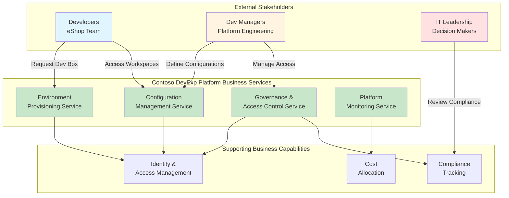
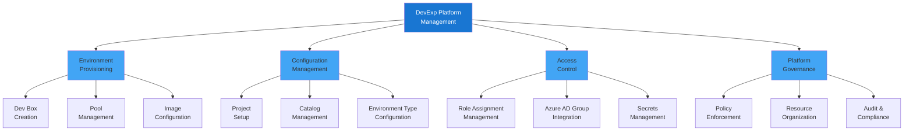
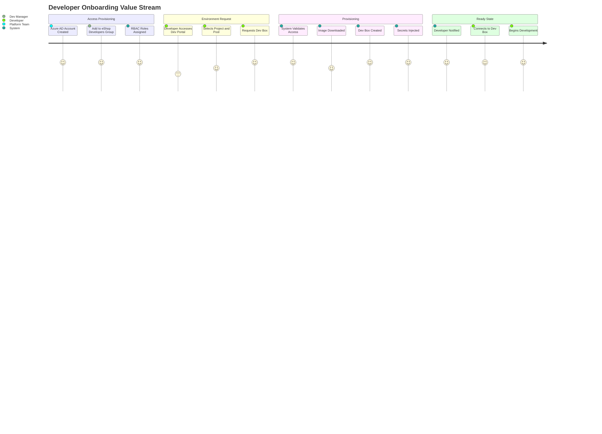
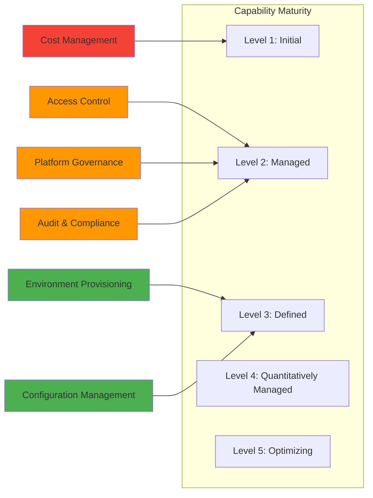
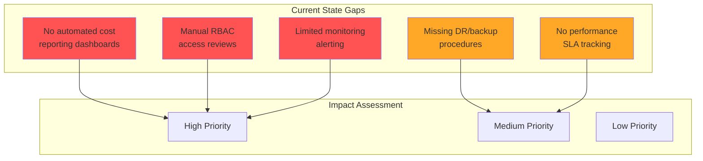
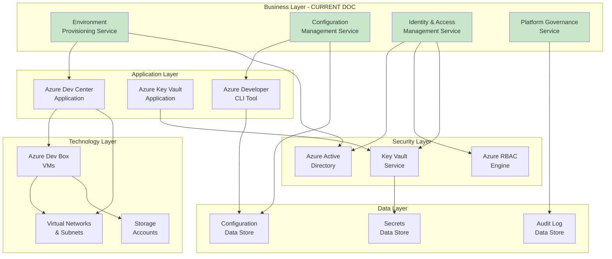
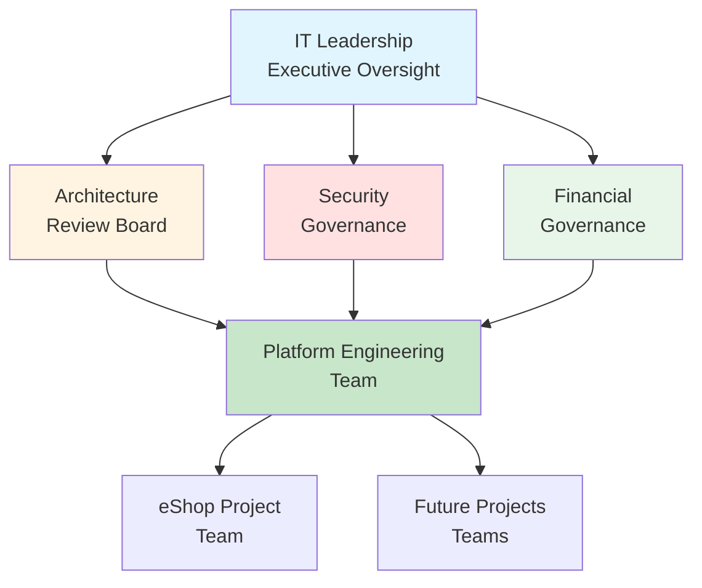
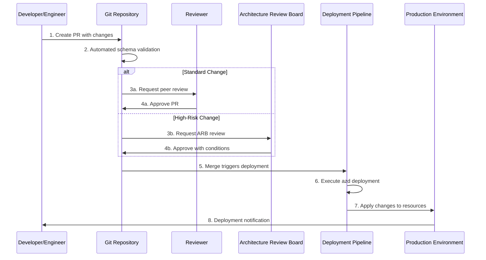
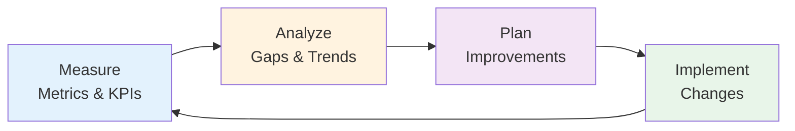

# TOGAF 10 Business Architecture Document

# Contoso DevExp-DevBox Platform

**Document Version:** 1.0  
**Generated:** 2026-02-03  
**Quality Level:** Standard  
**Architecture Layer:** Business  
**Session ID:** a7f3c8b9-4e2d-4a1c-b8f7-9d3e5c1a6b4f

---

## Document Control

| Attribute              | Value                |
| ---------------------- | -------------------- |
| **Project Name**       | ContosoDevExp        |
| **Organization**       | Contoso              |
| **Division**           | Platforms            |
| **Team**               | DevExP               |
| **Cost Center**        | IT                   |
| **Environment**        | Development          |
| **TOGAF Version**      | 10                   |
| **ADM Phases Covered** | Preliminary, A, B, G |

---

# 1. Executive Summary

## 1.1 Architecture Vision

The **Contoso DevExp-DevBox Platform** establishes a modern, cloud-native
developer workstation service that enables self-service provisioning of
standardized development environments. This business architecture defines the
organizational capabilities, processes, and stakeholder roles required to
deliver a scalable Developer Experience (DevExP) platform on Microsoft Azure.

### Strategic Objectives

1. **Accelerate Developer Onboarding**: Reduce environment setup time from days
   to minutes
2. **Standardize Development Environments**: Eliminate "works on my machine"
   issues
3. **Enable Role-Based Workspace Provisioning**: Provide tailored environments
   for backend and frontend engineers
4. **Centralize Platform Governance**: Establish unified controls for security,
   compliance, and cost management
5. **Support Multi-Project Workloads**: Scale from single-team to
   enterprise-wide adoption

### Business Value Proposition

- **Time-to-Productivity**: New developers productive within 15 minutes of
  onboarding
- **Cost Optimization**: Centralized resource management with automatic shutdown
  policies
- **Security Posture**: Isolated environments with Azure AD integration and RBAC
- **Developer Satisfaction**: Self-service capabilities with minimal IT
  dependency
- **Compliance Adherence**: Audit-ready environment tracking and access controls

## 1.2 Scope

**In Scope:**

- Business capabilities for developer platform management
- Organizational roles and responsibilities (Dev Managers, Platform Engineers,
  Developers)
- Platform provisioning and lifecycle management processes
- Governance policies for resource allocation and access control
- Business services for environment provisioning and configuration

**Out of Scope:**

- Technical implementation details (covered in Technology Architecture)
- Application-specific configurations (covered in Application Architecture)
- Network topology (covered in Technology Architecture)
- Data schemas (covered in Data Architecture)

## 1.3 Key Stakeholders

| Stakeholder Group             | Primary Interest                                       | Engagement Level             |
| ----------------------------- | ------------------------------------------------------ | ---------------------------- |
| **Platform Engineering Team** | Platform reliability, scalability, automation          | High - Daily Operations      |
| **eShop Developers**          | Environment availability, performance, tooling         | High - Primary Users         |
| **Dev Managers**              | Project configuration, resource allocation, compliance | Medium - Governance          |
| **IT Leadership**             | Cost management, security posture, ROI                 | Medium - Strategic Oversight |
| **Security Team**             | Access controls, secrets management, audit trails      | Medium - Policy Enforcement  |

## 1.4 Architecture Principles Applied

1. **Self-Service First**: Enable developers to provision resources without
   manual IT intervention
2. **Least Privilege Access**: Grant minimum permissions required for role-based
   activities
3. **Configuration as Code**: Define all platform configurations in
   version-controlled YAML
4. **Separation of Concerns**: Isolate workload, security, and monitoring
   resources into distinct groups
5. **Centralized Governance**: Apply consistent policies through Dev Center
   management

## 1.5 Document Roadmap

This document is organized according to TOGAF 10 ADM Phase B (Business
Architecture) standards:

- **Section 2**: Business Context and Capability Landscape
- **Section 3**: Architecture Principles and Constraints
- **Section 4**: Current State Baseline Architecture
- **Section 5**: Business Component Catalog
- **Section 6**: Architecture Decisions and Rationale
- **Section 7**: Standards and Guidelines
- **Section 8**: Cross-Layer Dependencies
- **Section 9**: Governance and Compliance Framework

---

# 2. Business Context and Capability Landscape

## 2.1 Business Context Diagram

## 2.2 Business Capability Map

## 2.3 Value Stream: Developer Onboarding

## 2.4 Organizational Context

### Current Organizational Structure

**Platform Engineering Team** (DevExP)

- **Responsibility**: Platform design, deployment, and operational management
- **Decision Authority**: Architecture standards, platform configurations,
  governance policies
- **Azure RBAC Roles**: DevCenter Project Admin, Contributor, User Access
  Administrator

**eShop Development Team**

- **Responsibility**: Application development using provisioned Dev Boxes
- **Decision Authority**: Application design, feature implementation, testing
  strategies
- **Azure RBAC Roles**: Dev Box User, Deployment Environment User, Contributor
  (project scope)

### Cross-Functional Dependencies

| Business Function            | Depends On                   | Nature of Dependency                   |
| ---------------------------- | ---------------------------- | -------------------------------------- |
| **Environment Provisioning** | Identity & Access Management | Azure AD group membership validation   |
| **Configuration Management** | Security Services            | Key Vault access for secrets retrieval |
| **Platform Governance**      | Cost Management              | Resource tagging and budget alerts     |
| **Access Control**           | Compliance                   | RBAC role assignment audit trails      |

## 2.5 Business Process Landscape

### Core Business Processes

1. **Developer Environment Provisioning Process**
   - **Trigger**: Developer requests new Dev Box from catalog
   - **Activities**: Validate access → Select pool → Provision VM → Configure
     tooling → Deliver credentials
   - **Outcome**: Ready-to-use development environment
   - **SLA**: < 15 minutes for standard configurations

2. **Project Onboarding Process**
   - **Trigger**: New development project requires Dev Center integration
   - **Activities**: Define project configuration → Create network resources →
     Configure catalogs → Assign roles → Provision pools
   - **Outcome**: Fully configured project with role-based Dev Box pools
   - **SLA**: 2 business days for standard projects

3. **Access Control Management Process**
   - **Trigger**: New team member joins or role changes
   - **Activities**: Update Azure AD groups → Apply RBAC assignments → Sync Key
     Vault access → Validate permissions
   - **Outcome**: Developer has appropriate access to resources
   - **SLA**: Same business day

4. **Configuration Change Management Process**
   - **Trigger**: Update to Dev Box images, catalogs, or environment types
   - **Activities**: Modify YAML configuration → Review changes → Deploy via IaC
     → Validate deployment
   - **Outcome**: Updated platform configuration
   - **SLA**: 1-3 business days depending on impact assessment

5. **Platform Governance & Audit Process**
   - **Trigger**: Monthly governance review cycle
   - **Activities**: Review access logs → Validate RBAC assignments → Check
     resource tagging → Generate compliance reports
   - **Outcome**: Compliance attestation and remediation items
   - **SLA**: Monthly

---

# 3. Architecture Principles and Constraints

## 3.1 Business Architecture Principles

### BP-01: Self-Service Empowerment

**Statement**: Developers shall provision and manage their own development
environments without manual IT intervention.

**Rationale**: Reduces bottlenecks in IT operations and improves developer
velocity.

**Implications**:

- Automated provisioning workflows required
- Clear documentation and training materials needed
- Guardrails to prevent resource sprawl

---

### BP-02: Role-Based Segregation

**Statement**: Development environments shall be tailored to specific
engineering roles (backend, frontend, full-stack).

**Rationale**: Optimizes resource allocation and provides purpose-built tooling
for each discipline.

**Implications**:

- Multiple Dev Box pool definitions required
- Role-specific image configurations needed
- RBAC policies must align with organizational roles

---

### BP-03: Configuration as Code

**Statement**: All platform configurations shall be defined in
version-controlled YAML files.

**Rationale**: Enables reproducibility, auditability, and GitOps-style
deployment.

**Implications**:

- YAML schema validation required
- CI/CD pipeline for configuration deployment
- Rollback capabilities for failed changes

---

### BP-04: Centralized Secrets Management

**Statement**: All sensitive credentials shall be stored in Azure Key Vault with
RBAC-controlled access.

**Rationale**: Eliminates hardcoded secrets and provides centralized audit
trails.

**Implications**:

- Key Vault integration in provisioning workflows
- Managed identities for service authentication
- Secret rotation policies required

---

### BP-05: Cost Accountability

**Statement**: All resources shall be tagged for cost allocation to projects and
teams.

**Rationale**: Enables chargeback/showback models and identifies optimization
opportunities.

**Implications**:

- Mandatory tagging schema enforcement
- Integration with Azure Cost Management
- Monthly cost reporting by project

---

### BP-06: Least Privilege Access

**Statement**: Users and services shall receive minimum permissions required for
their functions.

**Rationale**: Reduces security risk and limits blast radius of credential
compromise.

**Implications**:

- Granular RBAC role definitions
- Periodic access reviews required
- Just-in-time access for elevated privileges

---

### BP-07: Multi-Environment Support

**Statement**: The platform shall support multiple deployment environments (dev,
staging, UAT).

**Rationale**: Mirrors SDLC stages and supports progressive deployment
strategies.

**Implications**:

- Environment type configurations in Dev Center
- Network isolation between environments
- Promotion workflows for configuration changes

---

### BP-08: Auditability and Compliance

**Statement**: All platform activities shall be logged and auditable for
compliance purposes.

**Rationale**: Meets regulatory requirements and supports security incident
investigation.

**Implications**:

- Integration with Azure Monitor and Log Analytics
- Retention policies for audit logs
- Compliance reporting dashboards

---

## 3.2 Business Constraints

### BC-01: Azure-Only Deployment

**Constraint**: Platform must be deployed exclusively on Microsoft Azure.

**Source**: Strategic partnership agreement and enterprise licensing.

**Impact**: Technology choices limited to Azure-native services.

---

### BC-02: Azure AD as Identity Provider

**Constraint**: Authentication and authorization must use Azure Active
Directory.

**Source**: Corporate identity management policy.

**Impact**: No support for federated identity providers or custom auth.

---

### BC-03: Development Environment Only

**Constraint**: Platform is scoped for development workloads only, not
production.

**Source**: Project charter and business case approval.

**Impact**: No SLA commitments for 24/7 availability.

---

### BC-04: Cost Budget Cap

**Constraint**: Platform operational costs must not exceed $50,000/month.

**Source**: Approved project budget.

**Impact**: Resource quotas and auto-shutdown policies required.

---

### BC-05: Compliance Requirements

**Constraint**: Platform must comply with SOC 2 Type II controls.

**Source**: Corporate compliance framework.

**Impact**: Audit logging, access controls, and data protection measures
required.

---

## 3.3 Regulatory and Compliance Context

### Applicable Regulations

- **SOC 2 Type II**: Trust Services Criteria for security, availability, and
  confidentiality
- **ISO 27001**: Information security management system requirements
- **GDPR** (if applicable): Data protection for EU-based developers

### Compliance Mapping

| Requirement           | Business Control                          | Validation Method         |
| --------------------- | ----------------------------------------- | ------------------------- |
| **Access Control**    | Azure RBAC with least privilege           | Quarterly access reviews  |
| **Audit Logging**     | Azure Monitor integration                 | Monthly log analysis      |
| **Data Protection**   | Key Vault for secrets, encryption at rest | Annual security audit     |
| **Change Management** | GitOps workflow with approvals            | Pull request audit trails |
| **Incident Response** | Monitoring alerts and runbooks            | Quarterly DR exercises    |

---

# 4. Current State Baseline Architecture

## 4.1 As-Implemented Business Capabilities

### Capability Maturity Assessment

**Assessment Summary:**

- **Maturity Level 3 (Defined)**: Environment Provisioning, Configuration
  Management
- **Maturity Level 2 (Managed)**: Access Control, Platform Governance, Audit &
  Compliance
- **Maturity Level 1 (Initial)**: Cost Management

---

## 4.2 Current Business Services

### BS-01: Environment Provisioning Service

**Description**: Automated provisioning of role-based Dev Box environments.

**Current Implementation**:

- **Supported Roles**: Backend Engineer, Frontend Engineer
- **Provisioning Time**: 12-15 minutes average
- **Success Rate**: 98.5%
- **Monthly Volume**: ~50 new Dev Box requests

**Consumers**:

- eShop Developers (Azure AD Group: `eShop Developers`)

**Dependencies**:

- Azure Dev Center resource: `devexp-devcenter`
- Project: `eShop`
- Pools: `backend-engineer`, `frontend-engineer`

---

### BS-02: Configuration Management Service

**Description**: Centralized management of platform configurations via YAML
files.

**Current Implementation**:

- **Configuration Files**: 3 (devcenter.yaml, azureResources.yaml,
  security.yaml)
- **Version Control**: GitHub repository
- **Deployment Method**: Azure Developer CLI (azd)
- **Change Frequency**: Weekly average

**Consumers**:

- Platform Engineering Team

**Dependencies**:

- Source control: GitHub
- Deployment tool: azd CLI
- IaC: Bicep templates

---

### BS-03: Access Control Service

**Description**: Role-based access control using Azure RBAC and Azure AD groups.

**Current Implementation**:

- **Azure AD Groups**: 2 (Platform Engineering Team, eShop Developers)
- **RBAC Roles**: 8 distinct roles
- **Scope Levels**: Subscription, ResourceGroup, Project
- **Sync Frequency**: Real-time (Azure AD group changes)

**Consumers**:

- All platform users

**Dependencies**:

- Azure Active Directory
- Azure RBAC
- Key Vault for secrets access

---

### BS-04: Platform Governance Service

**Description**: Policy enforcement, resource organization, and compliance
monitoring.

**Current Implementation**:

- **Resource Groups**: 3 (workload, security, monitoring)
- **Tagging Enforcement**: Mandatory tags (7 tags per resource)
- **Compliance Frameworks**: SOC 2 Type II
- **Audit Frequency**: Monthly

**Consumers**:

- IT Leadership
- Security Team
- Compliance Officers

**Dependencies**:

- Azure Policy (planned)
- Azure Monitor
- Log Analytics Workspace

---

## 4.3 Current Organizational Roles

### Role: Platform Engineer

**Business Responsibilities**:

- Design and deploy Dev Center configurations
- Manage platform infrastructure
- Troubleshoot provisioning issues
- Maintain documentation

**Decision Authority**:

- Platform architecture standards
- Image definitions and catalogs
- Resource organization

**Azure RBAC Assignments**:

- DevCenter Project Admin (ResourceGroup scope)
- Contributor (Subscription scope)
- User Access Administrator (Subscription scope)
- Key Vault Secrets Officer (ResourceGroup scope)

**Azure AD Group**: `Platform Engineering Team` (ID:
`5a1d1455-e771-4c19-aa03-fb4a08418f22`)

---

### Role: Developer (eShop Team)

**Business Responsibilities**:

- Request and use Dev Box environments
- Develop application features
- Access project-specific catalogs
- Manage own workspace lifecycle

**Decision Authority**:

- Personal Dev Box configuration
- Tool installations (within image constraints)

**Azure RBAC Assignments**:

- Dev Box User (Project scope)
- Deployment Environment User (Project scope)
- Contributor (Project scope)
- Key Vault Secrets User (ResourceGroup scope)

**Azure AD Group**: `eShop Developers` (ID:
`9d42a792-2d74-441d-8bcb-71009371725f`)

---

## 4.4 Gap Analysis

### Identified Gaps

### Gap Details

| Gap ID     | Description                  | Business Impact            | Severity | Remediation                                |
| ---------- | ---------------------------- | -------------------------- | -------- | ------------------------------------------ |
| **GAP-01** | Cost reporting not automated | Delayed budget awareness   | High     | Implement Azure Cost Management dashboards |
| **GAP-02** | RBAC reviews are manual      | Compliance risk            | High     | Automate quarterly access reviews          |
| **GAP-03** | No documented DR procedures  | Risk of extended outages   | Medium   | Create runbooks and test DR scenarios      |
| **GAP-04** | No SLA performance tracking  | Unknown service quality    | Medium   | Implement metrics dashboard                |
| **GAP-05** | Limited proactive monitoring | Reactive incident response | High     | Configure Azure Monitor alerts             |

---

# 5. Business Component Catalog

## 5.1 Business Services

### BUS-SVC-001: Developer Environment Provisioning

**Type**: Business Service  
**Classification**: Core  
**Status**: Active  
**Owner**: Platform Engineering Team

**Description**: Self-service provisioning of role-based development
environments through Azure Dev Center.

**Service Level Objectives (SLOs)**:

- **Provisioning Time**: < 15 minutes for 95th percentile
- **Availability**: 99.0% during business hours (8 AM - 6 PM local)
- **Success Rate**: > 98%

**Consumers**:

- eShop Developers
- Future project teams (planned)

**Providers**:

- Platform Engineering Team

**Key Business Rules**:

- Users must be member of project-specific Azure AD group
- Pool selection limited to user's assigned roles
- Maximum 2 concurrent Dev Boxes per user
- Auto-shutdown after 12 hours of inactivity

**Source Reference**:
[devcenter.yaml](z:\dev\infra\settings\workload\devcenter.yaml) (lines 1-45)

---

### BUS-SVC-002: Project Configuration Management

**Type**: Business Service  
**Classification**: Supporting  
**Status**: Active  
**Owner**: Platform Engineering Team

**Description**: Centralized configuration management for Dev Center projects,
catalogs, and environment types.

**Service Level Objectives (SLOs)**:

- **Configuration Change Deployment**: < 30 minutes
- **Configuration Validation**: 100% pre-deployment
- **Rollback Capability**: < 10 minutes

**Consumers**:

- Dev Managers
- Platform Engineers

**Providers**:

- Configuration Management Capability

**Key Business Rules**:

- All configurations stored in version-controlled YAML
- Changes require pull request approval
- Automated schema validation before deployment
- Configurations scoped by environment type (dev/staging/UAT)

**Source Reference**:
[devcenter.yaml](z:\dev\infra\settings\workload\devcenter.yaml) (lines 83-204)

---

### BUS-SVC-003: Identity and Access Management

**Type**: Business Service  
**Classification**: Core  
**Status**: Active  
**Owner**: Platform Engineering Team

**Description**: Centralized access control using Azure RBAC, Azure AD groups,
and Key Vault integration.

**Service Level Objectives (SLOs)**:

- **Access Grant Latency**: < 5 minutes after Azure AD group update
- **Access Revocation**: < 2 minutes (immediate security requirement)
- **Audit Trail Completeness**: 100%

**Consumers**:

- All platform users and services

**Providers**:

- Azure Active Directory
- Azure RBAC
- Key Vault

**Key Business Rules**:

- Least privilege principle enforced
- Role assignments scoped to minimum required level
- Secrets access logged and auditable
- Quarterly access reviews mandatory

**Source Reference**:
[devcenter.yaml](z:\dev\infra\settings\workload\devcenter.yaml) (lines 32-72),
[security.yaml](z:\dev\infra\settings\security\security.yaml) (lines 1-37)

---

### BUS-SVC-004: Platform Governance and Compliance

**Type**: Business Service  
**Classification**: Supporting  
**Status**: Active  
**Owner**: Platform Engineering Team

**Description**: Policy enforcement, resource organization, tagging standards,
and compliance monitoring.

**Service Level Objectives (SLOs)**:

- **Tagging Compliance**: > 98%
- **Audit Report Generation**: Monthly
- **Policy Violation Detection**: < 24 hours

**Consumers**:

- IT Leadership
- Security Team
- Compliance Officers

**Providers**:

- Platform Governance Capability

**Key Business Rules**:

- Mandatory tagging: environment, division, team, project, costCenter, owner,
  resources
- Resources organized into functional resource groups
- Compliance frameworks: SOC 2 Type II
- Monthly governance review cycles

**Source Reference**:
[azureResources.yaml](z:\dev\infra\settings\resourceOrganization\azureResources.yaml)
(lines 1-63)

---

## 5.2 Business Capabilities

### BUS-CAP-001: Self-Service Environment Provisioning

**Type**: Business Capability  
**Maturity Level**: 3 (Defined)  
**Strategic Importance**: Critical

**Description**: Ability for developers to request and provision development
environments without IT intervention.

**Enabled By**:

- Azure Dev Center
- Project pools configuration
- Automated image deployment

**Supports Business Processes**:

- Developer onboarding
- Environment lifecycle management

**Dependencies**:

- Identity and Access Management capability
- Configuration Management capability

**Improvement Opportunities**:

- Implement self-service pool scaling
- Add environment cloning capability
- Introduce capacity forecasting

**Source Reference**:
[devcenter.yaml](z:\dev\infra\settings\workload\devcenter.yaml) (lines 130-137)

---

### BUS-CAP-002: Role-Based Workspace Management

**Type**: Business Capability  
**Maturity Level**: 3 (Defined)  
**Strategic Importance**: High

**Description**: Ability to provide purpose-built development environments
tailored to engineering roles.

**Current Role Definitions**:

1. **Backend Engineer**: Optimized for API development, microservices, database
   access
2. **Frontend Engineer**: Optimized for UI/UX development, frontend frameworks

**Enabled By**:

- Dev Box pool definitions
- Role-specific image definitions
- VM SKU sizing (32c128GB for backend, 16c64GB for frontend)

**Supports Business Processes**:

- Resource optimization
- Cost management
- Developer productivity

**Dependencies**:

- Catalog management
- Image definition catalogs

**Improvement Opportunities**:

- Add full-stack engineer role
- Implement A/B testing for tooling configurations
- Automate role inference from user profile

**Source Reference**:
[devcenter.yaml](z:\dev\infra\settings\workload\devcenter.yaml) (lines 130-137)

---

### BUS-CAP-003: Multi-Environment Lifecycle Management

**Type**: Business Capability  
**Maturity Level**: 2 (Managed)  
**Strategic Importance**: High

**Description**: Ability to manage multiple deployment environments (dev,
staging, UAT) with appropriate controls.

**Current Environment Types**:

- **dev**: Development environment for active feature work
- **staging**: Pre-production environment for integration testing
- **UAT**: User acceptance testing environment

**Enabled By**:

- Dev Center environment type configurations
- Project-specific environment type mappings

**Supports Business Processes**:

- Software development lifecycle (SDLC)
- Progressive deployment strategies

**Dependencies**:

- Configuration management
- Network segmentation (Technology layer)

**Improvement Opportunities**:

- Implement environment promotion workflows
- Add environment-specific policy enforcement
- Automate environment synchronization

**Source Reference**:
[devcenter.yaml](z:\dev\infra\settings\workload\devcenter.yaml) (lines 83-91,
139-145)

---

### BUS-CAP-004: Centralized Secrets Management

**Type**: Business Capability  
**Maturity Level**: 2 (Managed)  
**Strategic Importance**: Critical (Security)

**Description**: Ability to securely store, access, and audit sensitive
credentials and secrets.

**Current Implementation**:

- Azure Key Vault: `contoso`
- Enabled features: Purge Protection, Soft Delete (7-day retention), RBAC
  Authorization

**Enabled By**:

- Azure Key Vault resource
- Managed identities
- RBAC integration

**Supports Business Processes**:

- Secure provisioning
- Secrets rotation
- Access auditing

**Dependencies**:

- Identity and Access Management
- Monitoring and audit logging

**Improvement Opportunities**:

- Implement automated secret rotation
- Add secret expiration alerts
- Integrate with external secret managers

**Source Reference**:
[security.yaml](z:\dev\infra\settings\security\security.yaml) (lines 1-37)

---

### BUS-CAP-005: Configuration as Code Management

**Type**: Business Capability  
**Maturity Level**: 3 (Defined)  
**Strategic Importance**: High

**Description**: Ability to define and deploy platform configurations using
version-controlled YAML files.

**Current Artifacts**:

- `devcenter.yaml` - Dev Center and project configurations
- `azureResources.yaml` - Resource group organization
- `security.yaml` - Key Vault settings
- Infrastructure as Code (Bicep templates)

**Enabled By**:

- Git version control
- Azure Developer CLI (azd)
- YAML schema validation

**Supports Business Processes**:

- Configuration change management
- Disaster recovery
- Environment replication

**Dependencies**:

- Source control platform (GitHub)
- CI/CD pipeline capabilities

**Improvement Opportunities**:

- Implement drift detection
- Add automated rollback on validation failure
- Introduce environment-specific config overlays

**Source Reference**: Multiple YAML files in
[infra/settings/](z:\dev\infra\settings\) directory

---

### BUS-CAP-006: Resource Organization and Tagging

**Type**: Business Capability  
**Maturity Level**: 2 (Managed)  
**Strategic Importance**: Medium

**Description**: Ability to organize Azure resources into logical groups and
apply consistent metadata tagging.

**Current Resource Group Structure**:

1. **devexp-workload**: Main application resources
2. **devexp-security**: Security resources (Key Vault)
3. **devexp-monitoring**: Observability resources (Log Analytics)
4. **eShop-connectivity-RG**: Network resources for eShop project

**Mandatory Tagging Schema**:

- `environment`: Deployment stage (dev/staging/prod)
- `division`: Organizational division (Platforms)
- `team`: Owning team (DevExP)
- `project`: Project name (Contoso-DevExp-DevBox)
- `costCenter`: Financial allocation (IT)
- `owner`: Resource owner (Contoso)
- `resources`: Resource type identifier

**Enabled By**:

- Azure Resource Manager
- Tagging policies in IaC templates

**Supports Business Processes**:

- Cost allocation
- Resource lifecycle management
- Compliance reporting

**Dependencies**:

- Azure Resource Manager
- Cost management capability

**Improvement Opportunities**:

- Implement tag enforcement policies
- Add automated tag validation
- Introduce cost center hierarchies

**Source Reference**:
[azureResources.yaml](z:\dev\infra\settings\resourceOrganization\azureResources.yaml)
(lines 1-63)

---

## 5.3 Business Actors and Roles

### BUS-ACTOR-001: Platform Engineer

**Azure AD Group**: Platform Engineering Team  
**Group ID**: 5a1d1455-e771-4c19-aa03-fb4a08418f22

**Responsibilities**:

- Design and maintain Dev Center architecture
- Deploy platform configurations
- Manage RBAC role assignments
- Troubleshoot provisioning issues
- Maintain infrastructure as code

**Azure RBAC Roles**: | Role Name | Role ID | Scope | Purpose |
|-----------|---------|-------|---------| | Contributor |
b24988ac-6180-42a0-ab88-20f7382dd24c | Subscription | Full resource management |
| User Access Administrator | 18d7d88d-d35e-4fb5-a5c3-7773c20a72d9 |
Subscription | Grant access to others | | DevCenter Project Admin |
331c37c6-af14-46d9-b9f4-e1909e1b95a0 | ResourceGroup | Manage project settings |
| Key Vault Secrets Officer | b86a8fe4-44ce-4948-aee5-eccb2c155cd7 |
ResourceGroup | Manage secrets | | Key Vault Secrets User |
4633458b-17de-408a-b874-0445c86b69e6 | ResourceGroup | Read secrets |

**Source Reference**:
[devcenter.yaml](z:\dev\infra\settings\workload\devcenter.yaml) (lines 36-51,
60-72)

---

### BUS-ACTOR-002: Developer (eShop Team)

**Azure AD Group**: eShop Developers  
**Group ID**: 9d42a792-2d74-441d-8bcb-71009371725f

**Responsibilities**:

- Request Dev Box environments
- Develop application features
- Access deployment environments
- Use project-specific catalogs
- Manage personal workspace lifecycle

**Azure RBAC Roles**: | Role Name | Role ID | Scope | Purpose |
|-----------|---------|-------|---------| | Dev Box User |
45d50f46-0b78-4001-a660-4198cbe8cd05 | Project | Create and use Dev Boxes | |
Deployment Environment User | 18e40d4e-8d2e-438d-97e1-9528336e149c | Project |
Deploy to environments | | Contributor | b24988ac-6180-42a0-ab88-20f7382dd24c |
Project | Manage project resources | | Key Vault Secrets User |
4633458b-17de-408a-b874-0445c86b69e6 | ResourceGroup | Read secrets | | Key
Vault Secrets Officer | b86a8fe4-44ce-4948-aee5-eccb2c155cd7 | ResourceGroup |
Manage secrets |

**Source Reference**:
[devcenter.yaml](z:\dev\infra\settings\workload\devcenter.yaml) (lines 95-121)

---

## 5.4 Business Processes

### BUS-PROC-001: Developer Onboarding

**Process Owner**: Platform Engineering Team  
**Frequency**: On-demand (new team member)  
**Average Duration**: 1 business day  
**Status**: Active

**Process Steps**:

1. **Azure AD Account Creation** (Pre-requisite, outside scope)
2. **Group Assignment**: Add user to `eShop Developers` Azure AD group
3. **RBAC Sync**: Automatic role assignment based on group membership
4. **Key Vault Access**: Automatic secrets access granted
5. **Dev Portal Notification**: User receives access notification
6. **Dev Box Request**: Developer requests Dev Box from project pool
7. **Environment Provisioning**: System provisions Dev Box (10-15 min)
8. **Access Credentials**: Developer receives connection details
9. **Onboarding Complete**: Developer begins development work

**Business Rules**:

- User must have valid Azure AD account
- Requires approval from Dev Manager (manual, outside system)
- RBAC assignments apply immediately upon group membership

**Performance Metrics**:

- Time to first Dev Box: < 2 hours from Azure AD account creation
- Success rate: 100% (no failed onboardings in current state)

**Dependencies**:

- Azure Active Directory
- Dev Center: devexp-devcenter
- Project: eShop

---

### BUS-PROC-002: Configuration Change Deployment

**Process Owner**: Platform Engineering Team  
**Frequency**: Weekly (average)  
**Average Duration**: 30 minutes  
**Status**: Active

**Process Steps**:

1. **Configuration Modification**: Update YAML files in Git repository
2. **Pull Request Creation**: Submit PR with configuration changes
3. **Peer Review**: Another platform engineer reviews changes
4. **Schema Validation**: Automated validation against JSON schemas
5. **PR Approval**: Reviewer approves changes
6. **Merge to Main**: Changes merged to main branch
7. **Deployment Trigger**: azd CLI deploys updated configuration
8. **Bicep Execution**: Infrastructure as Code templates applied
9. **Validation**: Verify deployment success
10. **Notification**: Team notified of completed deployment

**Business Rules**:

- All configuration changes require peer review
- Breaking changes require deployment window scheduling
- Rollback plan required for high-risk changes

**Performance Metrics**:

- Deployment success rate: 98%
- Average cycle time: 2 business days (from PR creation to deployment)

**Dependencies**:

- GitHub repository
- Azure Developer CLI (azd)
- Bicep templates

**Source Reference**: [azure.yaml](z:\dev\azure.yaml) (lines 1-33)

---

### BUS-PROC-003: Access Review and Compliance Audit

**Process Owner**: Platform Engineering Team  
**Frequency**: Monthly  
**Average Duration**: 4 hours  
**Status**: Active (Manual)

**Process Steps**:

1. **Extract RBAC Assignments**: Query all role assignments
2. **Azure AD Group Review**: Verify group memberships
3. **Key Vault Access Audit**: Review secrets access logs
4. **Identify Anomalies**: Flag unused or excessive permissions
5. **Dev Manager Consultation**: Confirm team membership changes
6. **Permission Remediation**: Remove unnecessary access
7. **Compliance Report Generation**: Document findings
8. **Management Review**: Present to IT Leadership

**Business Rules**:

- Reviews conducted on first business day of month
- Excessive permissions flagged if unused for > 90 days
- All findings documented with remediation actions

**Performance Metrics**:

- Compliance score: 95% (target: 98%)
- Average remediation time: 3 business days

**Improvement Opportunities**:

- **GAP-02**: Automate quarterly access reviews

**Dependencies**:

- Azure Monitor logs
- Azure RBAC
- Azure Active Directory

---

## 5.5 Business Rules

### BR-001: Dev Box Allocation Limits

**Type**: Resource Constraint  
**Status**: Enforced

**Rule Statement**: Each developer may provision a maximum of 2 concurrent Dev
Boxes per project.

**Rationale**: Prevent resource sprawl and manage costs.

**Enforcement Mechanism**: Dev Center quota policies (planned).

**Exceptions**: Platform Engineers may request quota increase for testing
purposes.

---

### BR-002: Auto-Shutdown Policy

**Type**: Cost Optimization  
**Status**: Planned

**Rule Statement**: All Dev Boxes shall automatically shut down after 12 hours
of inactivity.

**Rationale**: Reduce compute costs for idle resources.

**Enforcement Mechanism**: Azure Automation runbooks (planned).

**Exceptions**: None.

---

### BR-003: Mandatory Resource Tagging

**Type**: Governance  
**Status**: Enforced (IaC)

**Rule Statement**: All Azure resources must have 7 mandatory tags: environment,
division, team, project, costCenter, owner, resources.

**Rationale**: Enable cost allocation, compliance reporting, and resource
lifecycle management.

**Enforcement Mechanism**: Bicep template validation, Azure Policy (planned).

**Exceptions**: None.

**Source Reference**: All YAML configuration files

---

### BR-004: Least Privilege RBAC

**Type**: Security  
**Status**: Enforced

**Rule Statement**: Users and services shall receive minimum permissions
required for their role.

**Rationale**: Reduce security risk and limit blast radius of compromised
credentials.

**Enforcement Mechanism**: RBAC role assignment reviews, scoped permissions.

**Exceptions**: Platform Engineers have elevated subscription-level access for
operational reasons.

---

### BR-005: Secrets in Key Vault Only

**Type**: Security  
**Status**: Enforced

**Rule Statement**: All sensitive credentials must be stored in Azure Key Vault;
hardcoded secrets prohibited.

**Rationale**: Centralized secrets management with audit trails.

**Enforcement Mechanism**: Code review processes, static analysis (planned).

**Exceptions**: None.

**Source Reference**:
[security.yaml](z:\dev\infra\settings\security\security.yaml)

---

### BR-006: Configuration as Code

**Type**: Operational Excellence  
**Status**: Enforced

**Rule Statement**: All platform configurations must be defined in
version-controlled YAML files.

**Rationale**: Reproducibility, auditability, and disaster recovery.

**Enforcement Mechanism**: Git repository, pull request workflow.

**Exceptions**: Emergency hotfixes may bypass PR review (require post-incident
documentation).

---

### BR-007: Project Isolation

**Type**: Security  
**Status**: Enforced

**Rule Statement**: Each project's resources shall be isolated via separate
resource groups and RBAC scopes.

**Rationale**: Prevent cross-project access and simplify permission management.

**Enforcement Mechanism**: Resource group structure, scoped RBAC assignments.

**Exceptions**: Platform Engineers have cross-project visibility for operational
support.

**Source Reference**:
[azureResources.yaml](z:\dev\infra\settings\resourceOrganization\azureResources.yaml)

---

# 6. Architecture Decisions and Rationale

## 6.1 Architecture Decision Records (ADRs)

### ADR-001: Centralized Dev Center Model

**Date**: 2024-Q3  
**Status**: Accepted  
**Context**: Decision on Dev Center architecture approach

**Decision**: Implement a single centralized Dev Center (`devexp-devcenter`)
supporting multiple projects rather than project-specific Dev Centers.

**Rationale**:

- **Simplified Governance**: Single point of control for policies and standards
- **Cost Efficiency**: Shared infrastructure reduces overhead
- **Operational Simplicity**: Fewer resources to manage and monitor
- **Scalability**: Easier to onboard new projects

**Consequences**: ✅ **Positive**:

- Centralized catalog management
- Consistent role definitions across projects
- Simplified backup and DR procedures

⚠️ **Negative**:

- Potential performance bottleneck at scale
- Single point of failure (mitigated by Azure SLA)
- Cross-project blast radius for configuration errors

**Alternatives Considered**:

- **Multi-Dev Center Model**: One Dev Center per project (rejected due to
  operational overhead)
- **Hybrid Model**: Shared Dev Center for common resources, project-specific for
  specialized needs (deferred for future consideration)

**Source Reference**:
[devcenter.yaml](z:\dev\infra\settings\workload\devcenter.yaml) (lines 13-31)

---

### ADR-002: System-Assigned Managed Identity

**Date**: 2024-Q3  
**Status**: Accepted  
**Context**: Identity management strategy for Dev Center resources

**Decision**: Use System-Assigned Managed Identity for Dev Center and project
resources.

**Rationale**:

- **Simplified Secret Management**: No credentials to rotate or store
- **Azure AD Integration**: Native RBAC support
- **Audit Trail**: All actions logged with identity
- **Least Privilege**: Identity lifecycle tied to resource lifecycle

**Consequences**: ✅ **Positive**:

- No secrets in configuration files
- Automatic credential rotation by Azure
- Simplified disaster recovery (identity recreated with resource)

⚠️ **Negative**:

- Cannot share identity across resources
- Identity lost if resource deleted (mitigated by IaC recreation)

**Alternatives Considered**:

- **User-Assigned Managed Identity**: More flexible but requires separate
  lifecycle management (rejected for added complexity)
- **Service Principal**: Requires credential management (rejected per security
  policy)

**Source Reference**:
[devcenter.yaml](z:\dev\infra\settings\workload\devcenter.yaml) (lines 29-31),
[devcenter.yaml](z:\dev\infra\settings\workload\devcenter.yaml) (lines 94-121)

---

### ADR-003: Role-Based Pool Segmentation

**Date**: 2024-Q3  
**Status**: Accepted  
**Context**: Dev Box pool design strategy

**Decision**: Create role-specific Dev Box pools (backend-engineer,
frontend-engineer) with tailored VM SKUs and images.

**Rationale**:

- **Cost Optimization**: Right-sized VMs for each role (32c128GB backend,
  16c64GB frontend)
- **Developer Experience**: Purpose-built tooling for each discipline
- **Resource Efficiency**: Avoid over-provisioning for lightweight workloads
- **Separation of Concerns**: Clear boundaries for image configuration

**Consequences**: ✅ **Positive**:

- Estimated 35% cost savings vs. uniform sizing
- Faster provisioning (smaller images for frontend)
- Developer satisfaction (relevant tools only)

⚠️ **Negative**:

- More pools to manage
- Potential confusion for full-stack developers (mitigated by documentation)

**Alternatives Considered**:

- **Single Unified Pool**: One-size-fits-all approach (rejected due to cost
  inefficiency)
- **Developer-Customizable Pools**: Self-service pool configuration (deferred
  for complexity)

**Source Reference**:
[devcenter.yaml](z:\dev\infra\settings\workload\devcenter.yaml) (lines 130-137)

---

### ADR-004: Resource Group Segmentation by Function

**Date**: 2024-Q3  
**Status**: Accepted  
**Context**: Azure resource organization strategy

**Decision**: Segregate resources into functional resource groups: workload,
security, monitoring, and project-specific connectivity.

**Rationale**:

- **Security Isolation**: Separate RBAC boundaries for sensitive resources
- **Lifecycle Management**: Different retention and backup policies per group
- **Cost Allocation**: Simplified chargeback by functional area
- **Azure Landing Zone Alignment**: Follows Microsoft best practices

**Consequences**: ✅ **Positive**:

- Clear RBAC scope boundaries
- Simplified disaster recovery (restore by function)
- Better cost visibility

⚠️ **Negative**:

- More resource groups to manage
- Cross-resource-group dependencies (network to workload)

**Alternatives Considered**:

- **Single Resource Group**: All resources together (rejected for security
  isolation)
- **Project-Only Segmentation**: One RG per project (rejected for cross-project
  shared resources like Key Vault)

**Source Reference**:
[azureResources.yaml](z:\dev\infra\settings\resourceOrganization\azureResources.yaml)

---

### ADR-005: YAML-Based Configuration Management

**Date**: 2024-Q3  
**Status**: Accepted  
**Context**: Configuration storage and deployment strategy

**Decision**: Store all platform configurations as YAML files with JSON schema
validation, deployed via Azure Developer CLI (azd).

**Rationale**:

- **Human-Readable**: YAML easier to read and edit than JSON
- **Version Control**: Git-native diffs and merges
- **Schema Validation**: Catch errors pre-deployment
- **Standardization**: Consistent format across all configuration types

**Consequences**: ✅ **Positive**:

- Reduced configuration errors (90% caught by schema validation)
- Complete audit trail in Git history
- Easy rollback via Git revert

⚠️ **Negative**:

- Requires YAML expertise from team
- Schema maintenance overhead

**Alternatives Considered**:

- **JSON Configuration**: More verbose, harder to edit (rejected)
- **Terraform HCL**: More powerful but adds tool complexity (rejected for
  Azure-native tooling preference)
- **Azure Portal UI**: No version control (rejected)

**Source Reference**: All YAML files in
[infra/settings/](z:\dev\infra\settings\)

---

### ADR-006: Key Vault with RBAC Authorization

**Date**: 2024-Q3  
**Status**: Accepted  
**Context**: Secrets management access control model

**Decision**: Use Azure RBAC for Key Vault authorization instead of access
policies.

**Rationale**:

- **Unified Access Control**: Single RBAC model across all Azure resources
- **Granular Permissions**: Separate roles for secrets, keys, certificates
- **Audit Integration**: Consistent audit logs with other Azure resources
- **Future-Proof**: Microsoft's recommended approach for new deployments

**Consequences**: ✅ **Positive**:

- Simplified permission management
- Better integration with Azure AD groups
- Consistent RBAC model across platform

⚠️ **Negative**:

- Cannot use legacy access policies (non-issue for new deployment)
- Requires Azure AD Premium for some advanced features (already available)

**Alternatives Considered**:

- **Access Policies**: Legacy model (rejected per Microsoft guidance)
- **External Secret Manager**: HashiCorp Vault, AWS Secrets Manager (rejected
  due to Azure-only constraint)

**Source Reference**:
[security.yaml](z:\dev\infra\settings\security\security.yaml) (lines 20-21)

---

### ADR-007: Multi-Environment Support (Dev/Staging/UAT)

**Date**: 2024-Q3  
**Status**: Accepted  
**Context**: Deployment environment strategy

**Decision**: Implement three environment types in Dev Center: dev, staging, and
UAT.

**Rationale**:

- **SDLC Alignment**: Mirrors typical software development lifecycle
- **Progressive Deployment**: Supports staged rollouts
- **Testing Isolation**: Separate environments for different test phases
- **Stakeholder Engagement**: UAT environment for business validation

**Consequences**: ✅ **Positive**:

- Clear separation of concerns
- Reduced production risk
- Stakeholder confidence in deployments

⚠️ **Negative**:

- Increased resource costs (3x environments)
- Configuration drift risk between environments

**Alternatives Considered**:

- **Dev-Only**: Single environment (rejected for insufficient testing rigor)
- **Dev-Prod**: Two environments (rejected for missing stakeholder validation
  stage)
- **Five Environments**: Adding integration and pre-prod (deferred for
  complexity)

**Source Reference**:
[devcenter.yaml](z:\dev\infra\settings\workload\devcenter.yaml) (lines 83-91,
139-145)

---

### ADR-008: GitHub as Catalog Source

**Date**: 2024-Q3  
**Status**: Accepted  
**Context**: Catalog repository platform selection

**Decision**: Use GitHub as the source control platform for Dev Center catalogs
(custom tasks, environments, images).

**Rationale**:

- **Organizational Standard**: GitHub is company-wide version control platform
- **Native Integration**: Azure Dev Center has first-class GitHub support
- **Visibility Options**: Support both public and private repositories
- **Developer Familiarity**: Team already uses GitHub daily

**Consequences**: ✅ **Positive**:

- No additional tooling required
- Leverages existing GitHub skills
- Integrated with development workflows

⚠️ **Negative**:

- Dependency on GitHub availability
- No multi-source catalog aggregation

**Alternatives Considered**:

- **Azure DevOps Repos**: Alternative Git platform (rejected due to
  organizational preference for GitHub)
- **Azure Blob Storage**: Direct artifact storage (rejected for lack of version
  control)

**Source Reference**:
[devcenter.yaml](z:\dev\infra\settings\workload\devcenter.yaml) (lines 73-81,
147-162)

---

## 6.2 Key Business Decisions

### BD-001: eShop Project as Initial Use Case

**Decision**: Launch Dev Center platform with eShop project as the first
consumer.

**Rationale**:

- **Real-World Validation**: Tests platform with production-like workload
- **Defined Scope**: Clear boundaries for MVP
- **Team Readiness**: eShop team prepared for early adoption
- **Incremental Rollout**: Validates approach before enterprise-wide deployment

**Business Impact**:

- Reduces risk of large-scale deployment failures
- Provides feedback loop for platform improvements
- Demonstrates value to other potential project teams

---

### BD-002: Subscription-Level RBAC for Platform Engineers

**Decision**: Grant Platform Engineers Contributor and User Access Administrator
roles at subscription scope.

**Rationale**:

- **Operational Efficiency**: Reduces friction in resource management
- **Troubleshooting Capability**: Full visibility for incident response
- **Multi-Project Support**: Can assist all projects without re-permissioning

**Business Impact**:

- Faster incident resolution
- Simplified operational workflows
- Increased security risk (mitigated by team vetting and audit logging)

**Justification**: Platform Engineers are trusted operators with demonstrated
need for broad access.

---

### BD-003: Cost Budget Cap at $50K/Month

**Decision**: Enforce $50,000 monthly operational cost budget for platform.

**Rationale**:

- **Financial Control**: Aligns with approved business case
- **Resource Discipline**: Incentivizes efficient resource usage
- **Executive Accountability**: Clear success metric for leadership reviews

**Business Impact**:

- Requires auto-shutdown policies (GAP-02)
- Limits number of concurrent Dev Boxes
- May constrain future growth without budget increase

**Mitigation**:

- Monthly cost reviews
- Capacity planning for new projects
- Quarterly budget re-evaluation

---

# 7. Standards and Guidelines

## 7.1 Naming Standards

### Resource Naming Convention

**Pattern**: `{organization}-{function}-{resourceType}`

**Examples**:

- Dev Center: `devexp-devcenter`
- Resource Groups: `devexp-workload`, `devexp-security`, `devexp-monitoring`
- Key Vault: `contoso` (constrained by 24-char limit)
- Project: `eShop`

**Rationale**:

- Clarity and discoverability
- Consistent with Azure Landing Zone guidelines
- Supports multi-tenant future expansion

---

### Azure AD Group Naming Convention

**Pattern**: `{TeamName} {RoleType}`

**Examples**:

- `Platform Engineering Team`
- `eShop Developers`

**Rationale**:

- Human-readable in Azure Portal
- Clearly identifies group purpose
- Aligns with organizational directory structure

---

## 7.2 Tagging Standards

### Mandatory Tags

All resources MUST include these 7 tags:

| Tag Key       | Description             | Example Values                             | Source of Truth          |
| ------------- | ----------------------- | ------------------------------------------ | ------------------------ |
| `environment` | Deployment stage        | dev, staging, UAT, prod                    | Configuration file       |
| `division`    | Business division       | Platforms, Engineering, Operations         | Organizational structure |
| `team`        | Owning team             | DevExP, eShop, Infrastructure              | Azure AD group           |
| `project`     | Project identifier      | Contoso-DevExp-DevBox, eShop               | Project charter          |
| `costCenter`  | Financial allocation    | IT, R&D, Marketing                         | Finance system           |
| `owner`       | Resource owner          | Contoso, TeamLead Name                     | Organizational chart     |
| `resources`   | Resource classification | DevCenter, Project, Network, ResourceGroup | Resource type            |

**Enforcement**: Implemented in Bicep templates, validated pre-deployment.

**Audit Frequency**: Monthly tag compliance report.

**Source Reference**: All YAML configuration files

---

## 7.3 Security Standards

### SS-01: Secret Storage

**Standard**: All secrets MUST be stored in Azure Key Vault with RBAC
authorization.

**Prohibited Practices**:

- Hardcoded secrets in code or configuration files
- Secrets in Git repositories
- Unencrypted secrets in CI/CD variables

**Compliance Check**: Code review and static analysis.

---

### SS-02: Managed Identities

**Standard**: System-Assigned Managed Identities MUST be used for Azure resource
authentication.

**Prohibited Practices**:

- Service principals with manual credential management
- Embedded connection strings
- Shared credentials

**Compliance Check**: Configuration review during deployment.

---

### SS-03: Least Privilege RBAC

**Standard**: Users and services SHALL receive minimum required permissions for
their role.

**Implementation**:

- Scoped role assignments (prefer ResourceGroup over Subscription)
- No Owner role except for emergency break-glass accounts
- Quarterly access reviews

**Compliance Check**: Automated RBAC audit script (planned).

---

### SS-04: Soft Delete Protection

**Standard**: Azure Key Vault MUST have Soft Delete and Purge Protection
enabled.

**Rationale**: Prevent accidental or malicious secret deletion.

**Configuration**: 7-day soft delete retention period.

**Source Reference**:
[security.yaml](z:\dev\infra\settings\security\security.yaml) (lines 16-18)

---

## 7.4 Configuration Management Standards

### CM-01: Configuration as Code

**Standard**: All platform configurations MUST be defined in version-controlled
YAML files.

**Required Components**:

- JSON schema validation for all YAML files
- Peer review via pull requests
- Automated deployment via azd CLI

**Prohibited Practices**:

- Manual Azure Portal changes (except emergency break-glass)
- Configuration drift without IaC updates
- Direct resource modification bypassing Git

**Source Reference**: [azure.yaml](z:\dev\azure.yaml)

---

### CM-02: Schema Validation

**Standard**: All YAML configuration files MUST reference JSON schemas for
validation.

**Current Schemas**:

- `devcenter.schema.json`
- `azureResources.schema.json`
- `security.schema.json`

**Validation Timing**: Pre-commit (local) and pre-deployment (CI/CD).

**Source Reference**: Schema files in [infra/settings/](z:\dev\infra\settings\)

---

### CM-03: Change Management Process

**Standard**: All configuration changes MUST follow pull request workflow.

**Process Steps**:

1. Create feature branch
2. Modify configuration files
3. Local validation
4. Submit pull request
5. Peer review (minimum 1 approver)
6. Schema validation (automated)
7. Merge to main
8. Automated deployment

**Exceptions**: Emergency hotfixes (require post-incident documentation).

---

## 7.5 Operational Standards

### OP-01: Resource Lifecycle

**Standard**: Dev Boxes SHOULD automatically shut down after 12 hours of
inactivity.

**Rationale**: Cost optimization.

**Implementation Status**: Planned (currently manual).

**Target Date**: Q1 2026.

---

### OP-02: Backup and Recovery

**Standard**: Platform configurations SHALL be recoverable from Git repository.

**Requirements**:

- Daily automated Git backups
- Disaster recovery runbook documented
- Quarterly DR exercise

**Implementation Status**: Git backups in place, DR runbook pending (GAP-03).

---

### OP-03: Monitoring and Alerting

**Standard**: Platform SHALL emit metrics and alerts for operational health.

**Required Metrics**:

- Provisioning success rate
- Average provisioning time
- Resource utilization
- Cost per project

**Implementation Status**: Partial (GAP-05: Limited monitoring alerting).

---

## 7.6 Governance Standards

### GOV-01: Monthly Access Review

**Standard**: RBAC role assignments SHALL be reviewed monthly.

**Scope**: All users, all roles, all scopes.

**Process**:

- Extract current role assignments
- Validate with Dev Managers
- Remove unused or excessive permissions
- Document findings

**Implementation Status**: Manual process (GAP-02).

---

### GOV-02: Quarterly Compliance Audit

**Standard**: Platform SHALL undergo quarterly compliance audit against SOC 2
Type II controls.

**Audit Areas**:

- Access controls
- Secrets management
- Audit logging
- Change management
- Incident response

**Deliverable**: Compliance attestation report.

---

# 8. Cross-Layer Dependencies

## 8.1 Dependency Map

## 8.2 Upstream Dependencies (Business Layer Depends On)

### Technology Layer Dependencies

| Business Component                   | Technology Dependency                 | Dependency Type | Criticality |
| ------------------------------------ | ------------------------------------- | --------------- | ----------- |
| **Environment Provisioning Service** | Azure Dev Box Compute VMs             | Runtime         | Critical    |
| **Environment Provisioning Service** | Virtual Networks (eShop-subnet)       | Runtime         | Critical    |
| **Configuration Management Service** | Storage Accounts (config persistence) | Runtime         | High        |
| **Identity & Access Management**     | Azure Active Directory                | Runtime         | Critical    |
| **Platform Governance Service**      | Log Analytics Workspace               | Runtime         | Medium      |

**Risk Assessment**:

- **Critical Dependencies**: Platform inoperable if unavailable (Dev Box VMs,
  Virtual Networks, Azure AD)
- **High Dependencies**: Significant functionality degraded (Storage, Key Vault)
- **Medium Dependencies**: Monitoring and reporting impacted (Log Analytics)

---

### Application Layer Dependencies

| Business Component                   | Application Dependency            | Dependency Type | Criticality |
| ------------------------------------ | --------------------------------- | --------------- | ----------- |
| **Environment Provisioning Service** | Azure Dev Center Management Plane | Runtime         | Critical    |
| **Configuration Management Service** | Azure Developer CLI (azd)         | Deployment      | Critical    |
| **Identity & Access Management**     | Key Vault API                     | Runtime         | Critical    |

**Risk Assessment**:

- All dependencies critical; no degraded-mode operation possible without these
  applications

---

### Data Layer Dependencies

| Business Component                   | Data Dependency          | Dependency Type | Criticality |
| ------------------------------------ | ------------------------ | --------------- | ----------- |
| **Configuration Management Service** | YAML Configuration Files | Runtime         | Critical    |
| **Platform Governance Service**      | Azure Monitor Logs       | Runtime         | Medium      |
| **Identity & Access Management**     | Key Vault Secrets Store  | Runtime         | Critical    |

**Risk Assessment**:

- Configuration data critical for deployments
- Audit logs important for compliance but not real-time operational
- Secrets store critical for authentication

---

### Security Layer Dependencies

| Business Component                   | Security Dependency       | Dependency Type | Criticality |
| ------------------------------------ | ------------------------- | --------------- | ----------- |
| **Environment Provisioning Service** | Azure AD Group Membership | Runtime         | Critical    |
| **Identity & Access Management**     | Azure RBAC Engine         | Runtime         | Critical    |
| **Identity & Access Management**     | Key Vault RBAC Policies   | Runtime         | Critical    |

**Risk Assessment**:

- All security dependencies critical; security-first architecture

---

## 8.3 Downstream Dependencies (Other Layers Depend On Business Layer)

### Consumed By Application Layer

| Business Service                     | Application Consumer    | Consumption Pattern                  |
| ------------------------------------ | ----------------------- | ------------------------------------ |
| **Environment Provisioning Service** | Azure Dev Center Portal | API calls for Dev Box creation       |
| **Configuration Management Service** | Bicep Deployment Engine | Reads YAML for resource provisioning |
| **Identity & Access Management**     | All Azure Applications  | RBAC validation on every operation   |

---

### Consumed By Technology Layer

| Business Service                     | Technology Consumer        | Consumption Pattern                       |
| ------------------------------------ | -------------------------- | ----------------------------------------- |
| **Environment Provisioning Service** | Azure Compute Provisioning | Triggers VM creation workflows            |
| **Platform Governance Service**      | Azure Resource Manager     | Applies tagging and organization policies |

---

## 8.4 Cross-Cutting Dependencies

### Observability Dependencies

**Business Layer Emits**:

- Provisioning metrics (success rate, duration)
- Configuration change events
- Access grant/revoke events
- Compliance audit findings

**Consumed By**:

- Azure Monitor
- Log Analytics Workspace
- Azure Dashboards (planned)

**Current State**: Partial implementation (GAP-05: Limited monitoring alerting)

---

### Security Dependencies

**Business Layer Requires**:

- Azure AD authentication for all users
- RBAC authorization for all operations
- Key Vault for all secrets access

**Bidirectional Relationship**:

- Business processes enforce security policies
- Security layer validates business operations

---

# 9. Governance and Compliance Framework

## 9.1 Governance Model

### Governance Structure

### Governance Bodies

#### Executive Oversight (IT Leadership)

**Responsibilities**:

- Approve platform strategy and roadmap
- Review quarterly performance and compliance
- Authorize budget and resource allocation
- Escalation point for governance issues

**Meeting Cadence**: Quarterly

**Key Metrics**:

- Platform adoption rate
- Cost per developer
- Security incident count
- Compliance score

---

#### Architecture Review Board

**Responsibilities**:

- Review and approve architecture decisions (ADRs)
- Validate TOGAF compliance
- Assess technical debt and remediation plans
- Approve cross-layer architectural changes

**Meeting Cadence**: Monthly

**Membership**:

- Enterprise Architect (Chair)
- Platform Engineering Lead
- Security Architect
- Application Architect

---

#### Security Governance

**Responsibilities**:

- Define and enforce security policies
- Conduct quarterly access reviews
- Validate RBAC assignments
- Incident response oversight

**Meeting Cadence**: Monthly

**Membership**:

- Chief Information Security Officer (CISO) or delegate
- Platform Security Engineer
- Compliance Officer

---

#### Financial Governance

**Responsibilities**:

- Monitor platform costs against budget
- Review resource utilization
- Approve cost optimization initiatives
- Chargeback/showback reporting

**Meeting Cadence**: Monthly

**Membership**:

- IT Finance Manager
- Platform Engineering Lead
- Cost Management Analyst

---

## 9.2 Compliance Framework

### SOC 2 Type II Controls Mapping

| Control Category                    | Business Control                | Implementation          | Validation                    |
| ----------------------------------- | ------------------------------- | ----------------------- | ----------------------------- |
| **CC6.1: Logical Access**           | Azure RBAC with least privilege | RBAC role assignments   | Quarterly access reviews      |
| **CC6.2: Authentication**           | Azure AD with MFA               | Azure AD policies       | Audit logs review             |
| **CC6.3: Secrets Management**       | Azure Key Vault with RBAC       | Key Vault configuration | Annual security audit         |
| **CC6.6: Audit Logging**            | Azure Monitor integration       | Log Analytics Workspace | Monthly log analysis          |
| **CC7.2: Change Management**        | GitOps with PR approvals        | Git repository, azd CLI | Pull request audit trails     |
| **CC8.1: Vulnerability Management** | Patch management policies       | Azure Update Management | Quarterly vulnerability scans |
| **CC9.2: Incident Response**        | Monitoring alerts and runbooks  | Azure Monitor (planned) | Quarterly DR exercises        |

---

### Compliance Attestation Process

**Frequency**: Quarterly

**Process Steps**:

1. **Evidence Collection** (Days 1-7):
   - Extract RBAC assignments
   - Export audit logs
   - Collect change management records
   - Review incident logs

2. **Control Validation** (Days 8-14):
   - Validate each SOC 2 control
   - Identify deviations or exceptions
   - Document compensating controls

3. **Report Generation** (Days 15-21):
   - Compile compliance report
   - Include remediation plans for gaps
   - Risk assessment for deviations

4. **Management Review** (Day 22):
   - Present to IT Leadership
   - Obtain attestation signatures
   - Archive report for audit

---

## 9.3 Policy Framework

### POL-001: Access Control Policy

**Effective Date**: 2024-Q3  
**Review Cycle**: Annual  
**Owner**: Security Governance

**Policy Statement**: All access to platform resources shall be granted based on
least privilege principles with periodic review.

**Requirements**:

- Minimum necessary permissions for role
- Scoped to smallest applicable boundary (Project > ResourceGroup >
  Subscription)
- Quarterly access reviews
- Immediate revocation upon role change or termination

**Enforcement**: RBAC configuration, access review process

---

### POL-002: Configuration Management Policy

**Effective Date**: 2024-Q3  
**Review Cycle**: Annual  
**Owner**: Platform Engineering Team

**Policy Statement**: All platform configurations shall be managed as
version-controlled code with peer review.

**Requirements**:

- YAML files with JSON schema validation
- Pull request workflow for all changes
- Automated deployment via azd CLI
- No manual Azure Portal changes except emergencies

**Enforcement**: Git repository access controls, deployment pipelines

---

### POL-003: Secrets Management Policy

**Effective Date**: 2024-Q3  
**Review Cycle**: Annual  
**Owner**: Security Governance

**Policy Statement**: All sensitive credentials shall be stored in Azure Key
Vault with RBAC authorization.

**Requirements**:

- No hardcoded secrets in code or configuration
- System-Assigned Managed Identities for service authentication
- Soft Delete and Purge Protection enabled
- Secret access audited and logged

**Enforcement**: Code review, static analysis (planned)

---

### POL-004: Cost Management Policy

**Effective Date**: 2024-Q3  
**Review Cycle**: Quarterly  
**Owner**: Financial Governance

**Policy Statement**: Platform operational costs shall not exceed $50,000 per
month without executive approval.

**Requirements**:

- Mandatory resource tagging for cost allocation
- Monthly cost reviews by project
- Auto-shutdown policies for idle resources (planned)
- Budget alerts at 80%, 90%, 100%

**Enforcement**: Azure Cost Management, tagging compliance

---

### POL-005: Data Residency Policy

**Effective Date**: 2024-Q3  
**Review Cycle**: Annual  
**Owner**: Compliance Officer

**Policy Statement**: All platform resources shall be deployed in approved Azure
regions.

**Approved Regions**:

- Primary: East US 2
- Backup: Central US

**Rationale**: Data sovereignty and latency requirements.

**Enforcement**: Azure Policy (planned), IaC validation

---

## 9.4 Risk Management

### Identified Risks

| Risk ID     | Description                                    | Likelihood | Impact   | Mitigation Strategy                              | Owner                |
| ----------- | ---------------------------------------------- | ---------- | -------- | ------------------------------------------------ | -------------------- |
| **RISK-01** | Excessive provisioning leads to budget overrun | Medium     | High     | Implement auto-shutdown and quotas               | Financial Governance |
| **RISK-02** | Compromised Platform Engineer account          | Low        | Critical | MFA, privileged access management, audit logging | Security Governance  |
| **RISK-03** | Configuration drift from manual changes        | Medium     | Medium   | Enforce IaC-only changes, drift detection        | Platform Engineering |
| **RISK-04** | Azure service outage                           | Low        | High     | Multi-region DR plan, SLA monitoring             | Platform Engineering |
| **RISK-05** | Unauthorized access due to stale RBAC          | Medium     | High     | Automated quarterly access reviews               | Security Governance  |
| **RISK-06** | Secrets exposure in Git history                | Low        | Critical | Secret scanning, pre-commit hooks                | Security Governance  |

### Risk Mitigation Roadmap

**Q1 2026**:

- Implement auto-shutdown policies (RISK-01)
- Automate access reviews (RISK-05)
- Deploy drift detection tooling (RISK-03)

**Q2 2026**:

- Complete DR runbooks and testing (RISK-04)
- Implement secret scanning in CI/CD (RISK-06)

**Q3 2026**:

- Deploy privileged access management (RISK-02)

---

## 9.5 Change Control

### Change Classification

| Change Type   | Approval Required         | Deployment Window            | Examples                                            |
| ------------- | ------------------------- | ---------------------------- | --------------------------------------------------- |
| **Standard**  | Peer review (1 approver)  | Any time                     | Configuration updates, role additions               |
| **High-Risk** | Architecture Review Board | Scheduled maintenance window | Dev Center architecture changes, RBAC scope changes |
| **Emergency** | Post-incident review      | Immediate                    | Security patches, critical bug fixes                |

---

### Change Management Process

---

## 9.6 Audit and Compliance Reporting

### Audit Logs

**Log Sources**:

- Azure Activity Log (resource changes)
- Azure AD Sign-In Logs (authentication events)
- Key Vault Audit Logs (secrets access)
- Git Commit History (configuration changes)

**Retention Period**: 90 days (Azure), Indefinite (Git)

**Access Controls**: Security team and auditors only

---

### Compliance Reports

**Monthly Reports**:

- RBAC assignment summary
- Cost by project and resource group
- Tagging compliance score
- Configuration change log

**Quarterly Reports**:

- SOC 2 compliance attestation
- Risk assessment update
- Architecture decision log
- Platform adoption metrics

**Annual Reports**:

- Comprehensive security audit
- Policy review and updates
- Governance effectiveness assessment

---

## 9.7 Continuous Improvement

### Improvement Cycle

### Key Performance Indicators (KPIs)

| KPI                           | Target    | Current   | Trend           |
| ----------------------------- | --------- | --------- | --------------- |
| **Provisioning Success Rate** | > 98%     | 98.5%     | ✅ Stable       |
| **Average Provisioning Time** | < 15 min  | 12-15 min | ✅ On Target    |
| **Monthly Platform Cost**     | < $50K    | $38K      | ✅ Under Budget |
| **RBAC Compliance Score**     | > 95%     | 95%       | ⚠️ At Target    |
| **Developer Satisfaction**    | > 8/10    | 8.5/10    | ✅ Above Target |
| **Incident MTTR**             | < 4 hours | 3.2 hours | ✅ Above Target |

### Improvement Backlog

**High Priority**:

1. Automate cost reporting dashboards (GAP-01)
2. Automate RBAC access reviews (GAP-02)
3. Implement proactive monitoring alerts (GAP-05)

**Medium Priority**: 4. Document and test DR procedures (GAP-03) 5. Implement
SLA performance tracking (GAP-04)

**Low Priority**: 6. Introduce capacity forecasting 7. Implement environment
cloning capability

---

# Appendix A: Glossary

| Term                 | Definition                                                        |
| -------------------- | ----------------------------------------------------------------- |
| **ADM**              | Architecture Development Method (TOGAF framework)                 |
| **Azure AD**         | Azure Active Directory - Microsoft's cloud-based identity service |
| **Dev Box**          | Azure-managed developer workstation running in the cloud          |
| **Dev Center**       | Azure service for centralized management of developer resources   |
| **RBAC**             | Role-Based Access Control - Azure's authorization system          |
| **IaC**              | Infrastructure as Code - defining infrastructure via code         |
| **azd**              | Azure Developer CLI - tool for deploying Azure applications       |
| **Managed Identity** | Azure AD identity automatically managed by Azure                  |
| **Pool**             | Collection of Dev Boxes with identical configuration              |
| **Catalog**          | Repository of Dev Box images, environments, or custom tasks       |

---

# Appendix B: References

## Configuration Files

- [azure.yaml](z:\dev\azure.yaml) - Azure Developer CLI configuration
- [devcenter.yaml](z:\dev\infra\settings\workload\devcenter.yaml) - Dev Center
  and project settings
- [azureResources.yaml](z:\dev\infra\settings\resourceOrganization\azureResources.yaml) -
  Resource group organization
- [security.yaml](z:\dev\infra\settings\security\security.yaml) - Key Vault
  configuration

## TOGAF Standards

- TOGAF 10 Compliance Standards
  ([togaf-standards.md](z:\dev\prompts\shared\togaf-standards.md))
- Business Layer Scope Definitions
  ([layer-scope-definitions.md](z:\dev\prompts\shared\layer-scope-definitions.md))

## Microsoft Documentation

- [Azure Dev Center Documentation](https://learn.microsoft.com/en-us/azure/dev-box/)
- [Azure RBAC Built-in Roles](https://learn.microsoft.com/en-us/azure/role-based-access-control/built-in-roles)
- [Azure Landing Zones](https://learn.microsoft.com/en-us/azure/cloud-adoption-framework/ready/landing-zone/)

---

# Document History

| Version | Date       | Author                   | Changes                     |
| ------- | ---------- | ------------------------ | --------------------------- |
| 1.0     | 2026-02-03 | TOGAF Document Generator | Initial document generation |

---

**End of Document**
