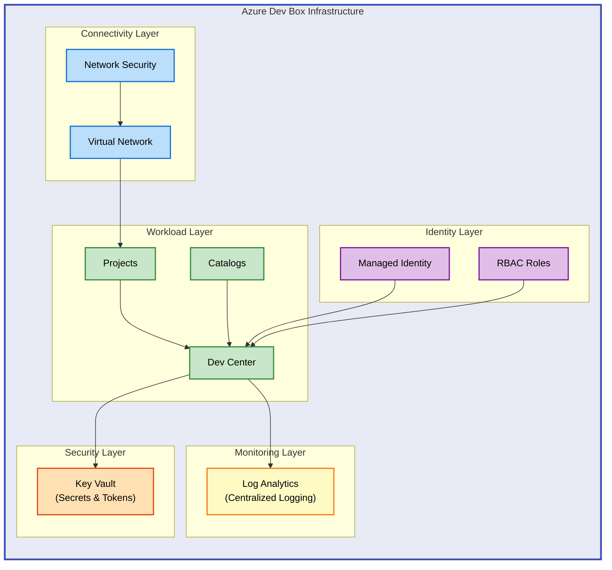

# DevExp-DevBox


Azure Dev Box infrastructure accelerator that automates deployment of Microsoft
Dev Center with integrated DevOps workflows.

**Overview**

DevExp-DevBox provides a production-ready Infrastructure-as-Code solution for
deploying Microsoft Dev Box environments at enterprise scale. Built on Azure
Bicep and modular design patterns, this accelerator eliminates weeks of manual
configuration by automating the provisioning of Dev Centers, projects, catalogs,
and role-based access controls across multiple landing zones.

Designed for platform engineers and DevOps teams, DevExp-DevBox supports both
GitHub and Azure DevOps integration through declarative YAML configuration,
enabling teams to establish standardized developer workstation infrastructure
with security, monitoring, and governance controls built in from day one. The
solution follows Azure Well-Architected Framework best practices and supports
multi-environment deployments through Azure Developer CLI (azd).

By abstracting complex Azure resources into reusable Bicep modules organized
across five architectural layers (security, monitoring, workload, identity,
connectivity), DevExp-DevBox accelerates time-to-value while maintaining
flexibility for customization through schema-validated YAML configuration files.

---

## 📋 Table of Contents

- [Architecture](#-architecture)
- [Quick Start](#-quick-start)
- [Deployment](#-deployment)
- [Usage](#-usage)
- [Features](#-features)
- [Requirements](#-requirements)
- [Configuration](#-configuration)
- [Contributing](#-contributing)
- [License](#-license)

---

## 🏗️ Architecture

**Overview**

DevExp-DevBox implements a five-layer Azure infrastructure architecture designed
for enterprise-scale developer environments. This modular design separates
concerns across security, monitoring, workload, identity, and connectivity
layers, enabling independent lifecycle management while maintaining cohesive
integration through Azure Resource Manager and Azure Bicep.

The architecture prioritizes security through Azure Key Vault integration,
observability through centralized Log Analytics, and scalability through
declarative configuration. Each layer deploys to dedicated resource groups
following landing zone patterns, with system-assigned managed identities and
least-privilege RBAC policies ensuring secure service-to-service communication
without credential management overhead.



---

## 🚀 Quick Start

Deploy a complete Dev Box environment in under 5 minutes:

```bash
# Clone repository
git clone https://github.com/Evilazaro/DevExp-DevBox.git
cd DevExp-DevBox

# Run setup (interactive)
./setUp.sh -e dev -s github
```

> 💡 **Tip**: Use `github` for GitHub integration or `adogit` for Azure DevOps.
> The script handles authentication automatically.

---

## 📦 Deployment

> ⚠️ **Prerequisites**: Ensure Azure CLI, Azure Developer CLI (azd), and GitHub
> CLI (gh) are installed before proceeding.

**Step 1: Authenticate to Azure**

```bash
az login
az account set --subscription "Your-Subscription-Name"
```

**Step 2: Configure Environment**

Edit
[`infra/settings/workload/devcenter.yaml`](infra/settings/workload/devcenter.yaml)
to customize your Dev Center configuration:

```yaml
name: 'devexp-devcenter'
catalogItemSyncEnableStatus: 'Enabled'
microsoftHostedNetworkEnableStatus: 'Enabled'
```

**Step 3: Deploy Infrastructure**

```bash
# Linux/macOS
./setUp.sh -e production -s github

# Windows (PowerShell)
.\setUp.ps1 -EnvName production -SourceControl github
```

**Step 4: Verify Deployment**

```bash
az devcenter admin dev-center show --name devexp-devcenter --resource-group <rg-name>
```

**Expected Output**: Dev Center provisioning state shows `Succeeded`.

---

## 💻 Usage

**Create a Dev Box Project**

```bash
az devcenter admin project create \
  --name "MyProject" \
  --dev-center-id "/subscriptions/{sub-id}/resourceGroups/{rg}/providers/Microsoft.DevCenter/devcenters/devexp-devcenter" \
  --resource-group <workload-rg>
```

**Assign User Access**

```bash
az role assignment create \
  --assignee user@domain.com \
  --role "DevCenter Dev Box User" \
  --scope "/subscriptions/{sub-id}/resourceGroups/{rg}/providers/Microsoft.DevCenter/projects/MyProject"
```

**Connect to Dev Box** (End Users)

Users access Dev Boxes through the Azure portal at
[https://devportal.microsoft.com](https://devportal.microsoft.com).

---

## ✨ Features

**Overview**

DevExp-DevBox's feature set addresses the complete lifecycle of developer
workstation infrastructure, from initial provisioning through ongoing governance
and operations. Each capability integrates with Azure's native services to
eliminate custom tooling while maintaining enterprise-grade security and
compliance.

The modular architecture enables selective adoption—teams can deploy only the
security and monitoring layers initially, then progressively add workload
components as organizational readiness matures. Configuration-driven deployment
through YAML schemas ensures consistent environments across development,
staging, and production without code duplication.

| Feature                               | Description                                                                                      | Benefits                                                                                   |
| ------------------------------------- | ------------------------------------------------------------------------------------------------ | ------------------------------------------------------------------------------------------ |
| **Modular Bicep Architecture**        | Five independent layers (security, monitoring, workload, identity, connectivity) with clear APIs | Enables team autonomy, simplifies testing, supports incremental rollouts                   |
| **Multi-Platform DevOps Integration** | Native support for GitHub and Azure DevOps through unified configuration                         | Reduces vendor lock-in, supports hybrid environments, simplifies migrations                |
| **Schema-Validated YAML Config**      | JSON Schema validation for all configuration files prevents deployment-time errors               | Catches misconfigurations in CI/CD, provides IntelliSense in IDEs, ensures consistency     |
| **Automated Secret Management**       | Key Vault integration with managed identities for GitHub tokens and service principals           | Eliminates credential sprawl, supports audit trails, enables automatic rotation            |
| **Centralized Observability**         | Log Analytics workspace collects telemetry from all Dev Center components                        | Accelerates troubleshooting, enables compliance reporting, supports proactive optimization |

---

## 📋 Requirements

**Overview**

The infrastructure deployment requires specific Azure services, CLI tooling, and
permissions to provision resources securely and reliably. These requirements
reflect Microsoft's recommended practices for production Azure environments and
ensure compatibility with enterprise identity and network architectures.

Runtime dependencies (Azure CLI, azd, gh/az devops CLI) enable the setup scripts
to authenticate, validate configurations, and orchestrate multi-resource
deployments atomically. Administrative access is necessary for creating resource
groups and assigning RBAC roles, though deployment can operate within a
pre-configured subscription with Contributor rights.

| Category               | Requirements                                                                           | More Information                                                                                                                        |
| ---------------------- | -------------------------------------------------------------------------------------- | --------------------------------------------------------------------------------------------------------------------------------------- |
| **Azure Subscription** | Active Azure subscription with available quota for Dev Box SKUs                        | [Pricing Calculator](https://azure.microsoft.com/en-us/pricing/calculator/)                                                             |
| **Azure Permissions**  | Subscription Contributor + User Access Administrator (for RBAC assignments)            | [Azure RBAC Documentation](https://learn.microsoft.com/en-us/azure/role-based-access-control/)                                          |
| **CLI Tools**          | Azure CLI 2.50+, Azure Developer CLI (azd) 1.5+, GitHub CLI 2.0+ (or Azure DevOps CLI) | [Install Azure CLI](https://learn.microsoft.com/en-us/cli/azure/install-azure-cli)                                                      |
| **Source Control**     | GitHub account with PAT (repo scope) or Azure DevOps organization with project access  | [GitHub PAT Guide](https://docs.github.com/en/authentication/keeping-your-account-and-data-secure/managing-your-personal-access-tokens) |
| **Operating System**   | Linux, macOS, Windows 10+ (with PowerShell 7+ or Bash via WSL)                         | [PowerShell Installation](https://learn.microsoft.com/en-us/powershell/scripting/install/installing-powershell)                         |
| **Network Access**     | Outbound HTTPS to Azure endpoints (management.azure.com, login.microsoftonline.com)    | [Azure IP Ranges](https://www.microsoft.com/en-us/download/details.aspx?id=56519)                                                       |

---

## 🔧 Configuration

**Overview**

Configuration flexibility in DevExp-DevBox stems from three primary mechanisms:
YAML-driven resource definitions, environment-specific parameters through Azure
Developer CLI, and runtime variables for sensitive values. This layered approach
separates infrastructure topology (YAML), deployment context (azd environment),
and secrets (Key Vault) to support GitOps workflows while protecting
credentials.

All YAML configuration files validate against JSON schemas located in
[`infra/settings/`](infra/settings/), ensuring correctness before deployment.
The schema-first design enables IDE auto-completion and prevents common
misconfiguration errors like invalid Azure regions or malformed role
assignments. Teams can version-control configurations safely while maintaining
secret isolation through Azure-managed identities.

**Primary Configuration Files**:

[`azure.yaml`](azure.yaml) - Azure Developer CLI project configuration with
deployment hooks

```yaml
name: ContosoDevExp

hooks:
  preprovision:
    shell: sh
    run: |
      ./setup.sh -e ${AZURE_ENV_NAME} -s ${SOURCE_CONTROL_PLATFORM}
```

[`infra/settings/workload/devcenter.yaml`](infra/settings/workload/devcenter.yaml) -
Dev Center, projects, catalogs, and RBAC

```yaml
name: 'devexp-devcenter'
catalogItemSyncEnableStatus: 'Enabled'
microsoftHostedNetworkEnableStatus: 'Enabled'

identity:
  type: 'SystemAssigned'
  roleAssignments:
    devCenter:
      - name: 'Contributor'
        scope: 'Subscription'
```

[`infra/settings/security/security.yaml`](infra/settings/security/security.yaml) -
Key Vault settings and secret management

```yaml
create: true
keyVault:
  name: 'devexp-kv'
  sku: 'standard'
  enableRbacAuthorization: true
```

**Environment Variables** (set via `azd env set` or shell export):

```bash
export AZURE_ENV_NAME="production"
export SOURCE_CONTROL_PLATFORM="github"  # or "adogit"
export AZURE_LOCATION="eastus"
```

> ⚠️ **Important**: Never commit secrets to version control. Use Azure Key Vault
> references or azd environment variables for sensitive values.

**Custom Regions and Tags**:

Edit [`infra/main.bicep`](infra/main.bicep) parameters to adjust allowed
regions:

```bicep
@allowed([
  'eastus'
  'westeurope'
  'australiaeast'
])
param location string
```

---

## 🤝 Contributing

**Overview**

Contributions to DevExp-DevBox strengthen Azure's Dev Box ecosystem by improving
automation quality, expanding configuration options, and sharing lessons from
real-world deployments. The project prioritizes contributions that enhance
modularity, maintain backward compatibility with existing configurations, and
align with Azure's evolving best practices.

We value bug reports, documentation improvements, and feature additions
equally—each improves the experience for teams adopting Dev Box infrastructure.
The modular Bicep architecture enables focused contributions without requiring
expertise across all five layers, making it accessible for contributors to add
value in their area of specialization.

Contributions undergo automated validation (Bicep linting, YAML schema checks,
link verification) and manual review to ensure quality and consistency. For
significant features, opening a GitHub Issue or Discussion before submitting a
pull request helps align implementation approach with project maintainers and
avoids duplicate effort.

**Contribution Guidelines**:

1. **Fork** the repository and create a feature branch from `main`
2. **Test** changes locally using `azd provision` against a non-production
   subscription
3. **Document** new configuration options in YAML schema files and README
4. **Validate** Bicep syntax with `az bicep build` and schema compliance with VS
   Code
5. **Submit** a pull request with clear description of changes and testing
   performed

> 📌 **Note**: See the
> [GitHub Issues](https://github.com/Evilazaro/DevExp-DevBox/issues) page for
> open tasks and feature requests.

---

## 📝 License

MIT License - see [LICENSE](LICENSE) file for details.

Copyright (c) 2025 Evilázaro Alves
