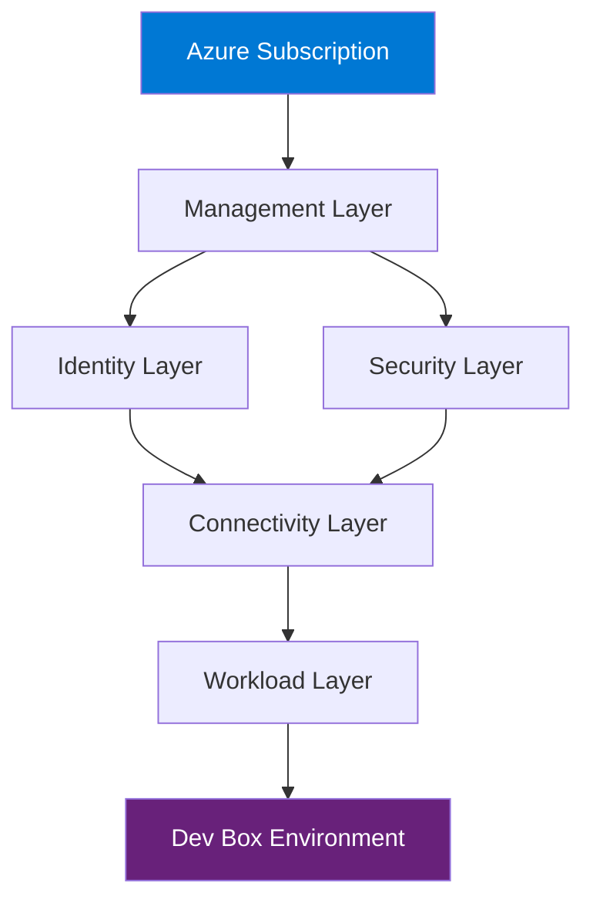

# DevExp-DevBox


A comprehensive **Developer Experience (DevExp) solution** for Azure Dev Box
that automates provisioning, configuration, and management of cloud-based
development environments using Infrastructure as Code (IaC).

---

## 🚀 Quick Start

Deploy a complete Azure Dev Box environment with a single command:

```powershell
# Clone the repository
git clone https://github.com/Evilazaro/DevExp-DevBox.git
cd DevExp-DevBox

# Run automated setup
./setUp.ps1
```

Your development environment will be ready in ~10 minutes.

---

## 📋 Table of Contents

- [Features](#-features)
- [Prerequisites](#-prerequisites)
- [Installation](#-installation)
- [Usage](#-usage)
- [Architecture](#️-architecture)
- [Configuration](#️-configuration)
- [Repository Structure](#-repository-structure)
- [Troubleshooting](#-troubleshooting)
- [Contributing](#-contributing)
- [License](#-license)

---

## ✨ Features

- **Automated Infrastructure Deployment**: Bicep templates for reproducible
  Azure environments
- **Multi-Layered Architecture**: Organized structure across connectivity,
  identity, management, security, and workload layers
- **CI/CD Integration**: GitHub Actions workflows for continuous deployment and
  testing
- **Cross-Platform Scripts**: PowerShell and Bash setup scripts for Windows,
  macOS, and Linux
- **Azure Developer CLI Ready**: Pre-configured `azure.yaml` for streamlined
  deployment
- **Environment Cleanup**: Automated teardown scripts to manage costs
- **Dev Center Workloads**: Pre-configured development workload templates

---

## 📦 Prerequisites

Before deploying, ensure you have:

- **Azure Subscription** with Owner or Contributor role
- **Azure CLI** (version 2.50.0 or higher)
  ```bash
  az --version
  ```
- **PowerShell 7+** or **Bash** (depending on your OS)
- **Git** for repository cloning
- **Visual Studio Code** (recommended for editing)

**Optional**:

- Azure Developer CLI (`azd`) for enhanced deployment features
- Bicep CLI for template validation

---

## 🔧 Installation

### Step 1: Clone the Repository

```bash
git clone https://github.com/Evilazaro/DevExp-DevBox.git
cd DevExp-DevBox
```

### Step 2: Authenticate with Azure

```bash
az login
az account set --subscription <your-subscription-id>
```

### Step 3: Run Setup Script

**Windows (PowerShell)**:

```powershell
./setUp.ps1
```

**Linux/macOS (Bash)**:

```bash
chmod +x setUp.sh
./setUp.sh
```

The script will:

1. Validate prerequisites
2. Deploy Azure infrastructure via Bicep
3. Configure development environment settings
4. Set up workload configurations

---

## 💻 Usage

### Deploy Infrastructure

Use Azure Developer CLI for streamlined deployment:

```bash
azd up
```

This command deploys all resources defined in
[infra/main.bicep](infra/main.bicep).

### Customize Configuration

Modify configuration files in [infra/settings/](infra/settings/) to customize:

- Resource naming conventions
  ([resourceOrganization/azureResources.yaml](infra/settings/resourceOrganization/azureResources.yaml))
- Security settings
  ([security/security.yaml](infra/settings/security/security.yaml))
- Dev Center workloads
  ([workload/devcenter.yaml](infra/settings/workload/devcenter.yaml))
- Azure regions and VM sizes

### Clean Up Resources

Remove all deployed resources to avoid ongoing costs:

```powershell
./cleanSetUp.ps1
```

---

## 🏗️ Architecture

The solution follows a **layered architecture** pattern for Azure
infrastructure:



### Layer Details

| Layer                                                       | Purpose                          | Key Components             |
| ----------------------------------------------------------- | -------------------------------- | -------------------------- |
| **Management** ([`src/management/`](src/management/))       | Governance and monitoring        | Resource policies, logging |
| **Identity** ([`src/identity/`](src/identity/))             | Authentication and authorization | Azure AD, RBAC             |
| **Security** ([`src/security/`](src/security/))             | Security controls and compliance | Key Vault, policies        |
| **Connectivity** ([`src/connectivity/`](src/connectivity/)) | Network infrastructure           | VNets, subnets, NSGs       |
| **Workload** ([`src/workload/`](src/workload/))             | Dev Box configurations           | VM templates, tools        |

---

## ⚙️ Configuration

### Environment Variables

The following environment variables can be set before deployment:

| Variable                | Description                | Default      |
| ----------------------- | -------------------------- | ------------ |
| `AZURE_LOCATION`        | Azure region for resources | `eastus`     |
| `AZURE_ENV_NAME`        | Environment identifier     | `dev`        |
| `AZURE_SUBSCRIPTION_ID` | Target Azure subscription  | _(required)_ |

Example:

```powershell
$env:AZURE_LOCATION = "westus2"
$env:AZURE_ENV_NAME = "production"
./setUp.ps1
```

### Infrastructure Settings

Modify configuration files in [infra/settings/](infra/settings/) for
environment-specific customizations:

- [resourceOrganization/azureResources.yaml](infra/settings/resourceOrganization/azureResources.yaml) -
  Resource naming, tagging, organization
- [security/security.yaml](infra/settings/security/security.yaml) - Security
  policies and Key Vault settings
- [workload/devcenter.yaml](infra/settings/workload/devcenter.yaml) - Dev Center
  and workload configurations

---

## 📁 Repository Structure

```
DevExp-DevBox/
├── infra/                  # Infrastructure as Code (Bicep)
│   ├── main.bicep          # Main deployment template
│   └── settings/           # Environment-specific configuration files
│       ├── resourceOrganization/
│       ├── security/
│       └── workload/
├── src/                    # Source code for each layer
│   ├── connectivity/       # Network infrastructure modules
│   ├── identity/           # Identity and access modules
│   ├── management/         # Management and governance
│   ├── security/           # Security controls
│   └── workload/           # Dev Box workload definitions
├── .configuration/         # Setup and configuration scripts
│   ├── devcenter/          # Dev Center workload templates
│   │   └── workloads/
│   ├── powershell/         # PowerShell automation scripts
│   │   └── cleanUp.ps1
│   └── setup/              # Setup utilities
├── .github/                # GitHub Actions workflows
│   ├── workflows/
│   │   ├── ci.yml          # Continuous integration
│   │   ├── deploy.yml      # Deployment automation
│   │   └── release.yml     # Release management
│   └── actions/            # Custom GitHub Actions
│       └── ci/
├── setUp.ps1               # Windows setup script
├── setUp.sh                # Linux/macOS setup script
├── cleanSetUp.ps1          # Resource cleanup script
├── azure.yaml              # Azure Developer CLI config
├── package.json            # Node.js dependencies (if applicable)
└── LICENSE                 # MIT License
```

---

## 🐛 Troubleshooting

### Common Issues

**Problem**: Setup script fails with "Subscription not found"

**Solution**: Verify you're logged in and have selected the correct
subscription:

```bash
az account show
az account set --subscription <subscription-id>
```

---

**Problem**: Bicep deployment fails with "Location not supported"

**Solution**: Check if your selected region supports all required resources.
Update the `AZURE_LOCATION` environment variable or modify the location in
[infra/settings/resourceOrganization/azureResources.yaml](infra/settings/resourceOrganization/azureResources.yaml).

---

**Problem**: PowerShell execution policy blocks scripts

**Solution**: Temporarily allow script execution:

```powershell
Set-ExecutionPolicy -ExecutionPolicy Bypass -Scope Process
./setUp.ps1
```

---

**Problem**: Resource group already exists error

**Solution**: Run cleanup script first:

```powershell
./cleanSetUp.ps1
```

---

## 🤝 Contributing

Contributions are welcome! To contribute:

1. Fork the repository
2. Create a feature branch (`git checkout -b feature/amazing-feature`)
3. Commit your changes (`git commit -m 'Add amazing feature'`)
4. Push to the branch (`git push origin feature/amazing-feature`)
5. Open a Pull Request

Please ensure:

- Bicep templates pass validation (`az bicep build`)
- Scripts are tested on both Windows and Linux
- Documentation is updated for new features

---

## 📝 License

This project is licensed under the **MIT License** - see the [LICENSE](LICENSE)
file for details.

---

## 🙏 Acknowledgments

- Built with
  [Azure Bicep](https://learn.microsoft.com/azure/azure-resource-manager/bicep/)
- CI/CD powered by [GitHub Actions](https://github.com/features/actions)
- Deployment streamlined with
  [Azure Developer CLI](https://learn.microsoft.com/azure/developer/azure-developer-cli/)

---

**Questions or feedback?** Open an
[issue](https://github.com/Evilazaro/DevExp-DevBox/issues) or start a
[discussion](https://github.com/Evilazaro/DevExp-DevBox/discussions).
