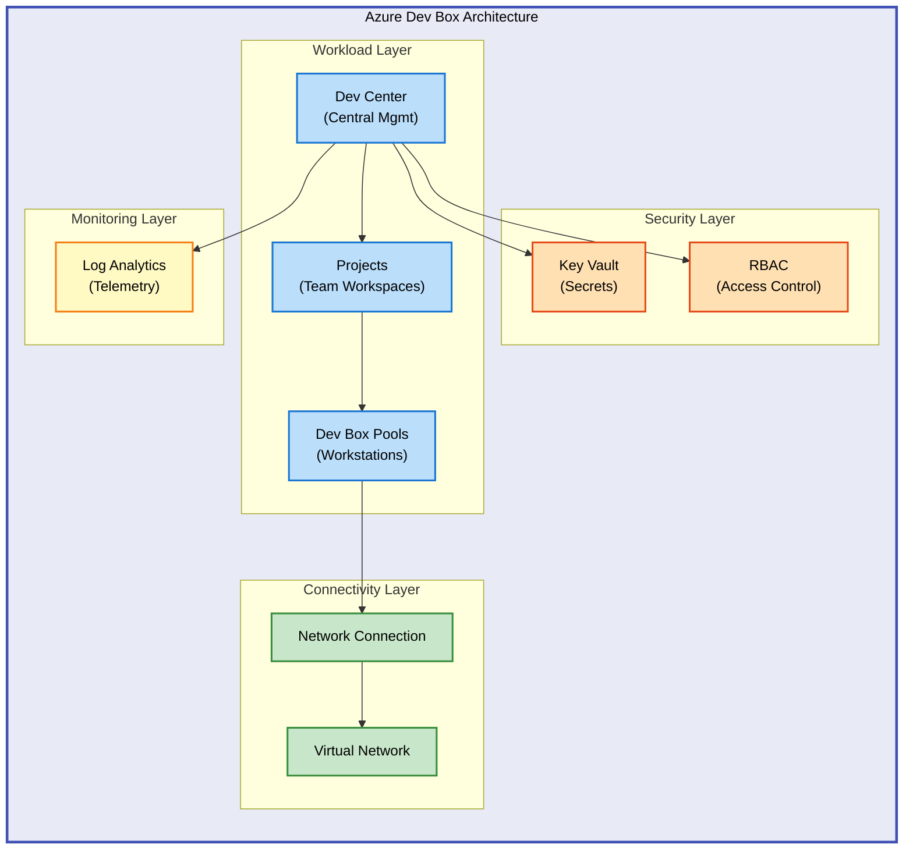

# DevExp-DevBox


An enterprise-grade Infrastructure-as-Code (IaC) solution for deploying Azure
Dev Box environments using Azure Developer CLI (azd) and Bicep templates. This
accelerator automates the provisioning of developer workstations, Dev Centers,
projects, and network connectivity with built-in security and monitoring.

**Overview**

DevExp-DevBox addresses the challenge of rapidly provisioning secure, compliant
developer environments at scale. Organizations struggle with inconsistent
development environments, lengthy setup times, and security compliance across
distributed teams. This solution provides a standardized, automated approach to
deploying Azure Dev Box infrastructure, ensuring developers can access
pre-configured, cloud-hosted workstations within minutes while maintaining
organizational security policies and governance standards.

The accelerator leverages Azure's native infrastructure services—Dev Center, Key
Vault, Virtual Networks, and Log Analytics—orchestrated through Bicep modules
that follow Azure landing zone best practices. By using declarative YAML
configuration files, infrastructure teams can customize deployments for
different environments (dev, test, prod) without modifying core templates,
enabling consistent infrastructure across the organization while maintaining
flexibility for team-specific requirements.

This solution streamlines the deployment workflow by integrating Azure Developer
CLI hooks that automatically handle prerequisites, configure source control
integration (GitHub or Azure DevOps), and provision resources in the correct
order with proper dependencies. The result is a repeatable, version-controlled
infrastructure deployment process that reduces manual errors and accelerates
time-to-productivity for development teams.

## 🏗️ Architecture

**Overview**

The architecture follows Azure Well-Architected Framework principles, organizing
resources into logical landing zones for security, monitoring, and workload
segregation. The Dev Center serves as the central orchestration point, managing
multiple projects that provision Dev Box pools. Each Dev Box connects through a
dedicated virtual network with security groups controlling access, while Key
Vault secures sensitive credentials and Log Analytics provides centralized
monitoring. This design separates concerns, allowing independent scaling and
management of security, networking, and compute resources while maintaining
clear data flow and access control boundaries.



## 🚀 Quick Start

Deploy your first Dev Box environment in under 10 minutes:

```bash
# Authenticate with Azure
az login

# Clone the repository
git clone https://github.com/Evilazaro/DevExp-DevBox.git
cd DevExp-DevBox

# Deploy using Azure Developer CLI
azd up
```

> ⚠️ **Prerequisites**: Ensure you have Azure CLI and azd CLI installed before
> running these commands.

## 📦 Deployment

**Step 1: Install Required Tools**

```bash
# Install Azure CLI
curl -sL https://aka.ms/InstallAzureCLIDeb | sudo bash

# Install Azure Developer CLI
curl -fsSL https://aka.ms/install-azd.sh | bash
```

**Step 2: Configure Environment**

```bash
# Create a new azd environment
azd env new prod

# Set required environment variables
azd env set SOURCE_CONTROL_PLATFORM github
```

**Step 3: Authenticate**

```bash
# Log in to Azure
az login

# Authenticate GitHub (if using GitHub source control)
gh auth login
```

**Step 4: Deploy Infrastructure**

```bash
# Run the setup script
./setUp.sh -e prod -s github

# Or use azd directly
azd up
```

> 💡 **Tip**: The setup script automatically handles GitHub token retrieval and
> Key Vault secret provisioning.

**Step 5: Verify Deployment**

```bash
# List deployed resources
az devcenter dev-box list --dev-center-name devexp-devcenter
```

## 💻 Usage

### Creating a Dev Box

After deployment, create a developer workstation:

```bash
# List available Dev Box pools
az devcenter dev-box list-pools --dev-center-name devexp-devcenter --project-name MyProject

# Create a Dev Box
az devcenter dev-box create \
  --dev-center-name devexp-devcenter \
  --project-name MyProject \
  --pool-name StandardPool \
  --name MyDevBox
```

### Customizing Dev Center Configuration

Edit
[`infra/settings/workload/devcenter.yaml`](infra/settings/workload/devcenter.yaml)
to customize projects, pools, and environment types:

```yaml
projects:
  - name: 'web-dev-project'
    description: 'Web development environment'
    pools:
      - name: 'frontend-pool'
        imageReference: 'windows-11-enterprise'
        compute: 'Standard_D4s_v3'
```

### Updating Bicep Modules

Modify infrastructure components in [`src/`](src/) directory:

- **Workload**: [`src/workload/workload.bicep`](src/workload/workload.bicep)
- **Security**: [`src/security/security.bicep`](src/security/security.bicep)
- **Connectivity**:
  [`src/connectivity/connectivity.bicep`](src/connectivity/connectivity.bicep)

Deploy changes:

```bash
azd deploy
```

## ✨ Features

**Overview**

The features below provide comprehensive control over developer workstation
provisioning, security, networking, and compliance. They address common
enterprise requirements: rapid onboarding of new developers, consistent
environments across teams, secure credential management, and centralized
monitoring. Each capability integrates with Azure's native services, leveraging
platform features like managed identities, role-based access control, and
diagnostic logging to minimize operational overhead while maximizing security
and observability.

The modular architecture allows organizations to enable or disable features
based on specific needs—for example, using Microsoft-hosted networks for simpler
deployments or custom VNets for organizations with strict network isolation
requirements. Configuration-driven design through YAML files enables
infrastructure teams to define environment-specific settings without modifying
Bicep templates, accelerating deployments across dev, test, and production
stages.

| Feature                        | Description                                                                                                        | Benefits                                                                                                              |
| ------------------------------ | ------------------------------------------------------------------------------------------------------------------ | --------------------------------------------------------------------------------------------------------------------- |
| **Automated Dev Center Setup** | Provisions Azure Dev Center with projects, catalogs, and Dev Box pools using Bicep templates                       | Eliminates manual portal configuration, ensures consistent deployments, accelerates time-to-production                |
| **GitHub/ADO Integration**     | Connects Dev Center catalogs to GitHub or Azure DevOps repositories for environment definitions                    | Enables version-controlled infrastructure templates, supports GitOps workflows, provides audit trail for changes      |
| **Security & Compliance**      | Implements Key Vault for secret management, RBAC for access control, and Azure Monitor for compliance logging      | Protects sensitive credentials, enforces least-privilege access, maintains audit logs for regulatory compliance       |
| **Network Connectivity**       | Configures virtual networks with network connections for Dev Box pools, supports custom DNS and security groups    | Enables secure connectivity to on-premises resources, isolates environments, supports hybrid cloud scenarios          |
| **Multi-Environment Support**  | Uses YAML configuration files to define dev, test, and prod environments with environment-specific resource naming | Simplifies promotion through environments, reduces configuration drift, accelerates infrastructure testing            |
| **Monitoring & Diagnostics**   | Integrates Log Analytics workspace to collect Dev Center diagnostics and Dev Box telemetry                         | Provides centralized visibility into resource health, supports troubleshooting, enables proactive capacity management |

## 📋 Requirements

**Overview**

The requirements below ensure successful deployment and operation of the Azure
Dev Box infrastructure. Azure CLI and azd CLI are essential for authenticating
with Azure, managing resources, and orchestrating deployments. The subscription
prerequisites—Owner or Contributor with User Access Administrator—enable the
solution to create resource groups, assign managed identities, and configure
RBAC policies. GitHub CLI is necessary only when integrating with GitHub for
catalog sources, while jq facilitates JSON processing in setup scripts.

Network connectivity requirements depend on whether you use Microsoft-hosted
networking (default) or custom virtual networks. For custom VNets, ensure your
subscription has sufficient address space and that network security groups allow
outbound connectivity to Azure services. The solution creates three resource
groups by default (security, monitoring, workload) but can integrate with
existing resource groups by modifying
[`infra/settings/resourceOrganization/azureResources.yaml`](infra/settings/resourceOrganization/azureResources.yaml).

| Category               | Requirements                                                                                  | More Information                                                                                         |
| ---------------------- | --------------------------------------------------------------------------------------------- | -------------------------------------------------------------------------------------------------------- |
| **Runtime**            | Azure CLI 2.50+, Azure Developer CLI 1.5+, Bash 4.0+ (Linux/macOS) or PowerShell 7+ (Windows) | [Azure CLI Docs](https://learn.microsoft.com/cli/azure/install-azure-cli)                                |
| **Azure Subscription** | Active Azure subscription with Owner or Contributor + User Access Administrator roles         | [Azure RBAC Roles](https://learn.microsoft.com/azure/role-based-access-control/)                         |
| **Source Control**     | GitHub CLI 2.0+ (if using GitHub) or Azure DevOps CLI (if using Azure Repos)                  | [GitHub CLI](https://cli.github.com/), [Azure DevOps CLI](https://learn.microsoft.com/azure/devops/cli/) |
| **System**             | Linux (Ubuntu 20.04+, RHEL 8+), macOS (11+), or Windows (10/11 with WSL2)                     | [WSL Installation](https://learn.microsoft.com/windows/wsl/install)                                      |
| **Dependencies**       | jq 1.6+ (JSON processor), curl 7.68+                                                          | [jq Download](https://stedolan.github.io/jq/download/)                                                   |
| **Network**            | Outbound internet access to Azure services, GitHub, or Azure DevOps                           | [Azure IP Ranges](https://www.microsoft.com/download/details.aspx?id=56519)                              |

> ℹ️ **Note**: The solution uses System-Assigned Managed Identity for Key Vault
> access, eliminating the need for service principal credentials.

## 🔧 Configuration

**Overview**

Configuration management in DevExp-DevBox follows a separation of concerns: YAML
files define logical infrastructure requirements (Dev Center projects, pools,
network settings), while Bicep modules handle Azure resource provisioning. This
approach allows non-developers to modify environment settings without touching
IaC code, reducing errors and accelerating configuration changes. The
configuration system supports environment-specific customization through the
`environmentName` parameter, enabling identical infrastructure definitions to
produce isolated dev, test, and production deployments.

The Key Vault integration demonstrates the security configuration philosophy:
sensitive values like GitHub tokens are never stored in YAML or Bicep files.
Instead, the setup script retrieves tokens from GitHub CLI and securely stores
them in Key Vault, while Bicep modules reference them using secure parameters.
This pattern extends to all credentials, ensuring secrets remain encrypted at
rest and in transit while maintaining usability for automated deployments.

### Environment Variables

Set in [`azure.yaml`](azure.yaml) or via `azd env set`:

```bash
# Source control platform (github or adogit)
SOURCE_CONTROL_PLATFORM=github

# Azure environment name (used for resource naming)
AZURE_ENV_NAME=prod

# Azure region for deployment
AZURE_LOCATION=eastus
```

### Dev Center Configuration

Edit
[`infra/settings/workload/devcenter.yaml`](infra/settings/workload/devcenter.yaml):

```yaml
name: 'devexp-devcenter'
catalogItemSyncEnableStatus: 'Enabled'
microsoftHostedNetworkEnableStatus: 'Enabled'

projects:
  - name: 'default-project'
    description: 'Default development project'
    maxDevBoxesPerUser: 3
    pools:
      - name: 'standard-pool'
        imageReference: 'windows-11-enterprise'
        compute: 'Standard_D4s_v3'
        networkConnectionName: 'default-connection'
```

### Resource Organization

Customize resource group names in
[`infra/settings/resourceOrganization/azureResources.yaml`](infra/settings/resourceOrganization/azureResources.yaml):

```yaml
security:
  name: 'security'
  create: true
  tags:
    environment: 'production'
    cost-center: 'IT'

workload:
  name: 'workload'
  create: true
  tags:
    environment: 'production'
    cost-center: 'Engineering'
```

## 🤝 Contributing

**Overview**

Contributions to DevExp-DevBox accelerate Azure Dev Box adoption for the entire
community. Whether you're fixing bugs, adding support for new Azure regions,
improving documentation, or enhancing Bicep modules, your work helps
organizations deploy secure developer environments faster. We value
contributions that maintain the project's focus on enterprise-grade IaC best
practices, including comprehensive error handling, clear documentation, and
adherence to Azure Well-Architected Framework principles.

The contribution process emphasizes code quality and security: all Bicep modules
must pass `az bicep build` validation, setup scripts require error handling with
`set -e`, and configuration changes must include corresponding schema updates.
By following these standards, contributors ensure the solution remains reliable
for production deployments across diverse Azure environments.

Contributions are welcome! Please follow these guidelines:

1. Fork the repository
2. Create a feature branch (`git checkout -b feature/amazing-feature`)
3. Commit your changes (`git commit -m 'Add amazing feature'`)
4. Push to the branch (`git push origin feature/amazing-feature`)
5. Open a Pull Request

Ensure your code follows:

- Bicep linting rules (`az bicep build` passes without errors)
- Bash scripting best practices (ShellCheck clean)
- YAML schema validation against provided JSON schemas

## 📝 License

This project is licensed under the MIT License - see the [LICENSE](LICENSE) file
for details.
