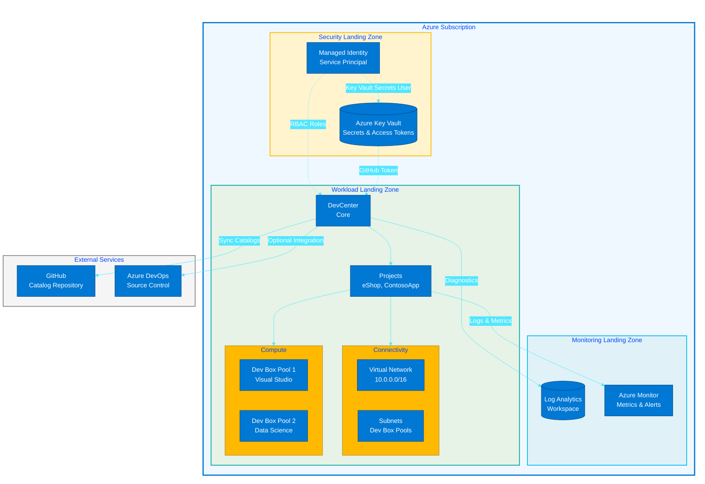
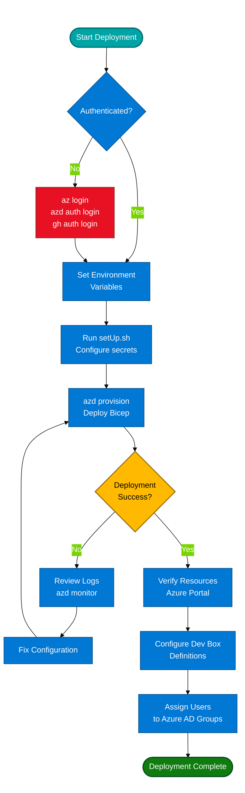

# Azure DevCenter Dev Box Accelerator

**Automated Azure DevCenter and Dev Box deployment using Infrastructure as Code
(Bicep) with YAML-driven configuration and multi-platform source control
integration.**

[](LICENSE)
[](https://azure.microsoft.com/en-us/products/dev-box)
[](https://learn.microsoft.com/azure/azure-resource-manager/bicep/)
[](https://learn.microsoft.com/azure/developer/azure-developer-cli/)

---

## Table of Contents

- [Overview](#overview)
- [Architecture](#architecture)
- [Features](#features)
- [Prerequisites](#prerequisites)
- [Quick Start](#quick-start)
- [Configuration](#configuration)
- [Installation](#installation)
- [Usage](#usage)
- [Deployment](#deployment)
- [Troubleshooting](#troubleshooting)
- [Requirements](#requirements)
- [Contributing](#contributing)
- [License](#license)
- [Additional Resources](#additional-resources)
- [Acknowledgments](#acknowledgments)

---

## Overview

This repository provides a production-ready **Dev Box Adoption & Deployment
Accelerator** that automates the provisioning of Azure DevCenter infrastructure
using declarative YAML configuration and modular Bicep templates. It implements
Azure landing zone best practices with built-in security, monitoring, and
identity management.

> 💡 **Why This Matters**: Reduces DevCenter deployment time from days to
> **under 30 minutes** while enforcing enterprise security standards, RBAC
> policies, and network isolation. Organizations can onboard development teams
> with consistent, auditable infrastructure without manual Azure Portal
> configuration.

> 📌 **How It Works**: The accelerator uses Azure Developer CLI (`azd`) to
> orchestrate Bicep deployments across three landing zones (Security,
> Monitoring, Workload). A YAML configuration file (`devcenter.yaml`) drives all
> resource settings, enabling configuration-as-code with Git-tracked changes.
> Setup scripts handle authentication, secret management, and idempotent
> provisioning.

**Quick Facts:**

- **Deployment Time**: 15-30 minutes (automated)
- **Supported Platforms**: GitHub, Azure DevOps
- **Architecture**: 3-tier landing zone (Security, Monitoring, Workload)
- **Configuration**: YAML-driven with JSON schema validation
- **Prerequisites**: Azure CLI, Azure Developer CLI, GitHub CLI (or ADO PAT)

---

## Architecture

**Overview**

The solution implements a multi-tier Azure landing zone architecture with clear
separation of concerns across security, monitoring, and workload layers. Each
layer operates in isolated resource groups with dedicated RBAC policies and
network boundaries.



**Component Roles:**

| Component                   | Purpose                                    | Key Resources                                        |
| --------------------------- | ------------------------------------------ | ---------------------------------------------------- |
| **Security Landing Zone**   | Centralized secret management and identity | Azure Key Vault, Managed Identity, RBAC policies     |
| **Monitoring Landing Zone** | Centralized logging and diagnostics        | Log Analytics Workspace, Azure Monitor               |
| **Workload Landing Zone**   | DevCenter resources and projects           | DevCenter, Projects, Dev Box Pools, Virtual Networks |
| **External Services**       | Source control and catalog repositories    | GitHub (catalog tasks), Azure DevOps (optional)      |

---

## Features

**Overview**

The accelerator provides six core capabilities designed to streamline DevCenter
deployments while maintaining enterprise governance and security standards.

> 💡 **Why This Matters**: Manual DevCenter configuration involves 50+ Azure
> Portal clicks, inconsistent naming, and undocumented settings. This
> accelerator codifies best practices into reusable templates, reducing errors
> and enabling rapid environment replication.

> 📌 **How It Works**: Each feature is implemented as a modular Bicep file under
> `src/` with corresponding YAML configuration in `infra/settings/`. The
> `setUp.sh` script orchestrates authentication and provisioning, while `azd`
> handles deployment lifecycle management.

| Feature                           | Description                                                                                                            | Status    | Configuration                                 |
| --------------------------------- | ---------------------------------------------------------------------------------------------------------------------- | --------- | --------------------------------------------- |
| **YAML-Driven Configuration**     | Define all DevCenter settings (projects, pools, networks) in version-controlled YAML files with JSON schema validation | ✅ Stable | `infra/settings/workload/devcenter.yaml`      |
| **Multi-Platform Source Control** | Seamless integration with GitHub or Azure DevOps for catalog synchronization                                           | ✅ Stable | `setUp.sh -s github` or `-s adogit`           |
| **3-Tier Landing Zone**           | Automated deployment of security, monitoring, and workload resource groups with RBAC                                   | ✅ Stable | `infra/main.bicep`                            |
| **Automated Secret Management**   | GitHub/ADO token storage in Key Vault with managed identity access                                                     | ✅ Stable | `infra/settings/security/security.yaml`       |
| **Role-Based Access Control**     | Pre-configured RBAC roles for Dev Managers, Project Admins, and Dev Box Users                                          | ✅ Stable | `devcenter.yaml` → `identity.roleAssignments` |
| **Network Isolation**             | Project-specific virtual networks with configurable address spaces and subnets                                         | ✅ Stable | `devcenter.yaml` → `projects[].network`       |

---

## Prerequisites

**Overview**

The following tools and permissions are required before running the deployment.
All CLI tools must be installed and authenticated.

> ⚠️ **Important**: Missing any prerequisite will cause deployment failures.
> Verify each tool is installed and accessible from your terminal before
> proceeding.

> 📌 **How to Verify**: Run the commands in the "Verification" column to confirm
> each tool is properly configured.

| Requirement                   | Minimum Version | Purpose                                                  | Verification Command |
| ----------------------------- | --------------- | -------------------------------------------------------- | -------------------- |
| **Azure CLI**                 | ≥2.50.0         | Azure authentication and resource management             | `az --version`       |
| **Azure Developer CLI (azd)** | ≥1.5.0          | Orchestrates Bicep deployment and environment management | `azd version`        |
| **GitHub CLI**                | ≥2.20.0         | GitHub authentication (if using GitHub)                  | `gh --version`       |
| **jq**                        | ≥1.6            | JSON processing in setup scripts                         | `jq --version`       |
| **Bash**                      | ≥4.0            | Setup script execution (Linux/macOS)                     | `bash --version`     |
| **PowerShell**                | ≥7.0            | Setup script execution (Windows)                         | `pwsh --version`     |

**Azure Permissions:**

| Resource           | Role                        | Scope                                            |
| ------------------ | --------------------------- | ------------------------------------------------ |
| Azure Subscription | `Contributor`               | Subscription-level (for resource group creation) |
| Azure Subscription | `User Access Administrator` | Subscription-level (for RBAC assignments)        |
| Azure AD Groups    | `Group Member`              | Azure AD (to assign users to Dev Manager roles)  |

**Source Control:**

- **GitHub**: Personal Access Token (PAT) with `repo` and `read:org` scopes
- **Azure DevOps**: Personal Access Token with `Code (Read)` and
  `Project and Team (Read)` scopes

---

## Quick Start

**Overview**

Deploy a complete DevCenter environment in under 10 minutes with this minimal
working example.

> 💡 **What This Does**: Creates three resource groups (security, monitoring,
> workload), provisions a DevCenter with one project (`eShop`), configures a Key
> Vault with your GitHub token, and establishes network connectivity.

> ⚠️ **Prerequisites**: Ensure all [prerequisites](#prerequisites) are installed
> and you are authenticated to Azure (`az login` and `azd auth login`).

```bash
# Clone the repository
git clone https://github.com/Evilazaro/DevExp-DevBox.git
cd DevExp-DevBox

# Authenticate to Azure
az login
azd auth login

# Set environment variables
export AZURE_ENV_NAME="dev"           # Environment name (dev/test/prod)
export SOURCE_CONTROL_PLATFORM="github"  # Source control platform
export AZURE_LOCATION="eastus"           # Azure region

# Run setup script (Linux/macOS)
./setUp.sh -e $AZURE_ENV_NAME -s $SOURCE_CONTROL_PLATFORM

# Or for Windows (PowerShell)
.\setUp.ps1 -EnvironmentName $env:AZURE_ENV_NAME -SourceControlPlatform $env:SOURCE_CONTROL_PLATFORM

# Provision infrastructure
azd provision
```

**Expected Output:**

```plaintext
✅ [2026-02-12 10:15:23] Environment 'dev' created
✅ [2026-02-12 10:16:45] GitHub token stored in Key Vault
✅ [2026-02-12 10:18:32] DevCenter 'devexp-devcenter' provisioned
✅ [2026-02-12 10:20:17] Project 'eShop' created with network connection
🎉 [2026-02-12 10:20:18] Deployment complete! Visit Azure Portal to configure Dev Box definitions.
```

**Next Steps:**

1. Navigate to the Azure Portal → DevCenter → `devexp-devcenter`
2. Create Dev Box definitions under **Dev box definitions**
3. Assign users to the `Platform Engineering Team` Azure AD group
4. Users can now create Dev Boxes from the Developer Portal

---

## Configuration

**Overview**

All infrastructure settings are defined in YAML configuration files under
`infra/settings/`. These files support JSON schema validation in VS Code for
IntelliSense and error checking.

> 💡 **Why This Matters**: Separating configuration from infrastructure code
> enables non-developers (e.g., IT admins) to modify settings without touching
> Bicep templates. Git-tracked YAML files provide full audit history of
> infrastructure changes.

> 📌 **How It Works**: Bicep templates load YAML files using `loadYamlContent()`
> function at deployment time. The `devcenter.schema.json` file enforces
> structure validation, preventing misconfigurations before deployment.

### Primary Configuration Files

| File                                                          | Purpose                                                           | Schema                       |
| ------------------------------------------------------------- | ----------------------------------------------------------------- | ---------------------------- |
| **`infra/settings/workload/devcenter.yaml`**                  | DevCenter projects, catalogs, environment types, role assignments | `devcenter.schema.json`      |
| **`infra/settings/security/security.yaml`**                   | Key Vault configuration, secret names, RBAC policies              | `security.schema.json`       |
| **`infra/settings/resourceOrganization/azureResources.yaml`** | Resource group naming, tags, creation flags                       | `azureResources.schema.json` |

### Example: Adding a New Project

Edit `infra/settings/workload/devcenter.yaml`:

```yaml
projects:
  - name: 'NewProject'
    description: 'Description of new project'

    # Network configuration
    network:
      name: NewProject
      create: true
      resourceGroupName: 'NewProject-connectivity-RG'
      virtualNetworkType: Managed
      addressPrefixes:
        - 10.1.0.0/16
      subnets:
        - name: default
          addressPrefix: 10.1.0.0/24

    # Dev Box pools
    pools:
      - name: 'vs2022-pool'
        devBoxDefinitionName: 'VisualStudio2022'
        networkConnectionName: 'NewProject'
        licenseType: 'Windows_Client'
        localAdministrator: 'Enabled'
```

Then redeploy:

```bash
azd provision
```

### Key Configuration Options

**DevCenter Identity and RBAC** (`devcenter.yaml` → `identity`):

```yaml
identity:
  type: 'SystemAssigned'
  roleAssignments:
    devCenter:
      - id: 'b24988ac-6180-42a0-ab88-20f7382dd24c'
        name: 'Contributor'
        scope: 'Subscription'
```

**Key Vault Settings** (`security.yaml` → `keyVault`):

```yaml
keyVault:
  name: contoso
  enablePurgeProtection: true
  enableSoftDelete: true
  softDeleteRetentionInDays: 7
  enableRbacAuthorization: true
```

**Environment Types** (`devcenter.yaml` → `environmentTypes`):

```yaml
environmentTypes:
  - name: 'dev'
    deploymentTargetId: '' # Empty = default subscription
  - name: 'staging'
    deploymentTargetId: ''
```

---

## Installation

**Overview**

This section covers the complete installation process from repository setup
through authentication configuration.

### Step 1: Clone Repository

```bash
git clone https://github.com/Evilazaro/DevExp-DevBox.git
cd DevExp-DevBox
```

### Step 2: Install Prerequisites

**Linux/macOS:**

```bash
# Install Azure CLI
curl -sL https://aka.ms/InstallAzureCLIDeb | sudo bash

# Install Azure Developer CLI
curl -fsSL https://aka.ms/install-azd.sh | bash

# Install GitHub CLI (if using GitHub)
brew install gh  # macOS with Homebrew
# Or for Linux:
type -p curl >/dev/null || (sudo apt update && sudo apt install curl -y)
curl -fsSL https://cli.github.com/packages/githubcli-archive-keyring.gpg | sudo dd of=/usr/share/keyrings/githubcli-archive-keyring.gpg
sudo chmod go+r /usr/share/keyrings/githubcli-archive-keyring.gpg
echo "deb [arch=$(dpkg --print-architecture) signed-by=/usr/share/keyrings/githubcli-archive-keyring.gpg] https://cli.github.com/packages stable main" | sudo tee /etc/apt/sources.list.d/github-cli.list > /dev/null
sudo apt update
sudo apt install gh -y

# Install jq
sudo apt install jq -y  # Linux
brew install jq         # macOS
```

**Windows (PowerShell):**

```powershell
# Install Azure CLI
Invoke-WebRequest -Uri https://aka.ms/installazurecliwindows -OutFile .\AzureCLI.msi
Start-Process msiexec.exe -Wait -ArgumentList '/I AzureCLI.msi /quiet'
Remove-Item .\AzureCLI.msi

# Install Azure Developer CLI
powershell -ex AllSigned -c "Invoke-RestMethod 'https://aka.ms/install-azd.ps1' | Invoke-Expression"

# Install GitHub CLI
winget install --id GitHub.cli

# Install jq (via Chocolatey)
choco install jq
```

### Step 3: Authenticate to Azure

```bash
# Azure CLI login
az login

# Azure Developer CLI login
azd auth login

# GitHub CLI login (if using GitHub)
gh auth login
```

Verify authentication:

```bash
az account show
azd auth login --check-status
gh auth status
```

### Step 4: Configure Environment

**Option A: Using Environment Variables (Linux/macOS)**

```bash
export AZURE_ENV_NAME="dev"
export SOURCE_CONTROL_PLATFORM="github"
export AZURE_LOCATION="eastus"
export AZURE_SUBSCRIPTION_ID="$(az account show --query id -o tsv)"
```

**Option B: Using `.env` File**

Create `d:\dev\.azure\dev\.env`:

```env
AZURE_ENV_NAME=dev
SOURCE_CONTROL_PLATFORM=github
AZURE_LOCATION=eastus
AZURE_SUBSCRIPTION_ID=<your-subscription-id>
```

Then load:

```bash
source .azure/dev/.env  # Linux/macOS
```

---

## Usage

**Overview**

This section demonstrates common workflows for deploying, updating, and managing
DevCenter infrastructure.

### Basic Deployment Workflow

```bash
# 1. Initialize environment (one-time setup)
azd init

# 2. Run setup script to configure authentication
./setUp.sh -e "dev" -s "github"

# 3. Provision infrastructure
azd provision

# 4. View deployment outputs
azd env get-values
```

**Output:**

```plaintext
SECURITY_AZURE_RESOURCE_GROUP_NAME=security-dev-eastus-RG
MONITORING_AZURE_RESOURCE_GROUP_NAME=monitoring-dev-eastus-RG
WORKLOAD_AZURE_RESOURCE_GROUP_NAME=workload-dev-eastus-RG
AZURE_KEY_VAULT_NAME=contoso-kv-dev
DEVCENTER_NAME=devexp-devcenter
```

### Update Configuration

**Scenario**: Adding a new Dev Box pool to existing project

1. Edit `infra/settings/workload/devcenter.yaml`:

```yaml
projects:
  - name: 'eShop'
    pools:
      - name: 'datascience-pool' # New pool
        devBoxDefinitionName: 'DataScience'
        networkConnectionName: 'eShop'
        licenseType: 'Windows_Client'
        localAdministrator: 'Enabled'
```

2. Redeploy:

```bash
azd provision
```

### Clean Up Resources

**Remove all resources:**

```bash
# Delete all Azure resources
azd down --purge

# Confirm deletion
# Type 'yes' when prompted
```

**Remove specific resource group:**

```bash
az group delete --name workload-dev-eastus-RG --yes --no-wait
```

### View Deployment Logs

```bash
# View azd logs
azd monitor

# View Azure activity log
az monitor activity-log list --resource-group workload-dev-eastus-RG

# Export logs to file
az monitor activity-log list --resource-group workload-dev-eastus-RG --output json > deployment-logs.json
```

### Common Operations

**List Dev Box Pools:**

```bash
az devcenter admin pool list \
  --project-name eShop \
  --dev-center-name devexp-devcenter \
  --resource-group workload-dev-eastus-RG
```

**Get Key Vault Secret:**

```bash
az keyvault secret show \
  --vault-name contoso-kv-dev \
  --name gha-token \
  --query value -o tsv
```

**Update DevCenter Catalog:**

```bash
az devcenter admin catalog sync \
  --dev-center-name devexp-devcenter \
  --catalog-name customTasks \
  --resource-group workload-dev-eastus-RG
```

---

## Deployment

**Overview**

This section provides detailed deployment workflows for different environments
and scenarios.



### Production Deployment

**Overview**

Production deployments require additional validation and failsafe mechanisms.

> ⚠️ **Critical**: Always test in a non-production environment first. Production
> deployments should use dedicated service principals with audited credentials.

**Step 1: Create Service Principal**

```bash
az ad sp create-for-rbac \
  --name "DevCenter-Prod-SP" \
  --role "Contributor" \
  --scopes /subscriptions/<subscription-id>
```

**Step 2: Configure Production Environment**

```bash
# Create production environment
azd env new prod

# Set production variables
azd env set AZURE_ENV_NAME prod
azd env set SOURCE_CONTROL_PLATFORM github
azd env set AZURE_LOCATION eastus2
```

**Step 3: Deploy with Verification**

```bash
# Dry-run (what-if analysis)
az deployment sub what-if \
  --location eastus2 \
  --template-file infra/main.bicep \
  --parameters infra/main.parameters.json

# Deploy with confirmation
./setUp.sh -e "prod" -s "github"
azd provision --confirm-prompts
```

### CI/CD Integration

**GitHub Actions Example** (`.github/workflows/deploy.yml`):

```yaml
name: Deploy DevCenter

on:
  push:
    branches: [main]
  workflow_dispatch:

permissions:
  id-token: write
  contents: read

jobs:
  deploy:
    runs-on: ubuntu-latest
    steps:
      - uses: actions/checkout@v4

      - name: Azure Login (OIDC)
        uses: azure/login@v2
        with:
          client-id: ${{ secrets.AZURE_CLIENT_ID }}
          tenant-id: ${{ secrets.AZURE_TENANT_ID }}
          subscription-id: ${{ secrets.AZURE_SUBSCRIPTION_ID }}

      - name: Install Azure Developer CLI
        run: curl -fsSL https://aka.ms/install-azd.sh | bash

      - name: Configure Environment
        run: |
          azd env new prod --location eastus2
          azd env set AZURE_ENV_NAME prod
          azd env set SOURCE_CONTROL_PLATFORM github

      - name: Provision Infrastructure
        run: azd provision --no-prompt
        env:
          AZURE_TOKEN: ${{ secrets.GITHUB_TOKEN }}
```

---

## Troubleshooting

**Overview**

Common issues and their resolutions.

| Issue                           | Symptom                                 | Solution                                                                                   |
| ------------------------------- | --------------------------------------- | ------------------------------------------------------------------------------------------ |
| **Authentication Failure**      | `ERROR: Please run 'az login'`          | Run `az login`, `azd auth login`, and verify with `az account show`                        |
| **Missing Prerequisites**       | `command not found: jq`                 | Install missing tool per [Installation](#installation) section                             |
| **RBAC Permission Error**       | `AuthorizationFailed` during deployment | Ensure account has `Contributor` + `User Access Administrator` roles at subscription level |
| **Key Vault Access Denied**     | `Forbidden` when reading secrets        | Assign `Key Vault Secrets User` role to deployment identity                                |
| **Dev Box Pool Creation Fails** | `NetworkConnectionNotFound`             | Verify network connection exists and is in `succeeded` state                               |
| **Catalog Sync Failure**        | `CatalogSyncFailed` in DevCenter        | Check GitHub PAT has `repo` scope and repository is accessible                             |

**Enable Debug Logging:**

```bash
# Azure CLI debug mode
az <command> --debug

# Azure Developer CLI debug mode
azd provision --debug
```

---

## Requirements

**Overview**

This section details all technical and organizational requirements for
successful deployment.

> 💡 **Why This Matters**: Missing any requirement will cause deployment
> failures or runtime issues. Review this section thoroughly before starting
> deployment.

> 📌 **How It Works**: Requirements are categorized into Technical
> (tools/services), Azure (permissions/quotas), and Organizational
> (processes/approvals) for clear accountability.

| Category           | Requirement                            | Details                                                  | Validation                          |
| ------------------ | -------------------------------------- | -------------------------------------------------------- | ----------------------------------- |
| **Technical**      | Azure CLI ≥2.50.0                      | Command-line tool for Azure management                   | `az --version`                      |
| **Technical**      | Azure Developer CLI ≥1.5.0             | Deployment orchestration tool                            | `azd version`                       |
| **Technical**      | Bicep CLI ≥0.20.0                      | Infrastructure-as-Code compiler (bundled with Azure CLI) | `az bicep version`                  |
| **Technical**      | Git ≥2.30.0                            | Version control for configuration files                  | `git --version`                     |
| **Technical**      | GitHub CLI ≥2.20.0 OR Azure DevOps PAT | Source control authentication                            | `gh --version`                      |
| **Technical**      | jq ≥1.6                                | JSON processor for setup scripts                         | `jq --version`                      |
| **Technical**      | Bash ≥4.0 OR PowerShell ≥7.0           | Shell for setup script execution                         | `bash --version` / `pwsh --version` |
| **Azure**          | Active Azure Subscription              | Valid subscription with sufficient quota                 | `az account show`                   |
| **Azure**          | Subscription Contributor Role          | Permission to create resource groups                     | `az role assignment list`           |
| **Azure**          | User Access Administrator Role         | Permission to assign RBAC roles                          | `az role assignment list`           |
| **Azure**          | Azure AD Group (Dev Managers)          | Pre-created Azure AD group for role assignments          | Azure Portal → Azure AD → Groups    |
| **Azure**          | DevCenter Resource Quota               | Minimum 1 DevCenter per subscription region              | Check Azure quota in Azure Portal   |
| **Azure**          | Virtual Network Address Space          | Non-overlapping CIDR blocks for each project             | Document IP allocation plan         |
| **Organizational** | GitHub PAT (if using GitHub)           | Personal Access Token with `repo` + `read:org` scopes    | Store securely in Key Vault         |
| **Organizational** | Azure DevOps PAT (if using ADO)        | Personal Access Token with `Code (Read)` scope           | Store securely in Key Vault         |
| **Organizational** | Change Management Approval             | Approval for infrastructure provisioning in production   | Follow organizational CAB process   |

---

## Contributing

**Overview**

Contributions are welcome! This project follows a product-oriented delivery
model with Epics, Features, and Tasks managed via GitHub Issues.

> 📖 **Full Guidelines**: See [`CONTRIBUTING.md`](CONTRIBUTING.md) for complete
> contribution workflow, branching strategy, and issue management.

### Quick Contribution Steps

1. **Fork the repository**

```bash
gh repo fork Evilazaro/DevExp-DevBox --clone
cd DevExp-DevBox
```

2. **Create a feature branch**

```bash
git checkout -b feature/add-new-project-template
```

3. **Make changes and test**

```bash
# Make changes to Bicep files or YAML configuration
# Test locally
azd provision --environment test
```

4. **Commit with conventional commits**

```bash
git add .
git commit -m "feat(workload): add support for custom Dev Box images"
```

5. **Push and create Pull Request**

```bash
git push origin feature/add-new-project-template
gh pr create --title "feat: Add custom Dev Box image support" --body "Adds support for custom Dev Box images in devcenter.yaml configuration"
```

### Issue Labels

| Label             | Purpose                                       |
| ----------------- | --------------------------------------------- |
| `type:epic`       | Large deliverable with measurable outcome     |
| `type:feature`    | Concrete, testable deliverable within an Epic |
| `type:task`       | Small unit of work (< 8 hours)                |
| `area:dev-box`    | Related to Dev Box configuration              |
| `area:automation` | Related to setup scripts or CI/CD             |
| `priority:p0`     | Critical/blocking issue                       |

### Code Review Checklist

- [ ] Bicep files pass `az bicep build` without errors
- [ ] YAML configuration validates against JSON schema
- [ ] Changes tested in non-production environment
- [ ] Documentation updated (README, inline comments)
- [ ] Commit messages follow conventional commits format

---

## License

This project is licensed under the **MIT License** - see the
[`LICENSE`](LICENSE) file for details.

```plaintext
MIT License

Copyright (c) 2025 Evilázaro Alves

Permission is hereby granted, free of charge, to any person obtaining a copy
of this software and associated documentation files (the "Software"), to deal
in the Software without restriction...
```

**Summary**: You are free to use, modify, and distribute this software for any
purpose, including commercial use, with no warranty or liability.

---

## Additional Resources

**Official Documentation:**

- [Azure DevCenter Documentation](https://learn.microsoft.com/azure/dev-box/)
- [Azure Bicep Documentation](https://learn.microsoft.com/azure/azure-resource-manager/bicep/)
- [Azure Developer CLI (azd) Documentation](https://learn.microsoft.com/azure/developer/azure-developer-cli/)
- [Dev Box Deployment Guide](https://learn.microsoft.com/azure/dev-box/concept-dev-box-deployment-guide)

**Project Resources:**

- [Project Documentation Site](https://evilazaro.github.io/DevExp-DevBox/)
- [GitHub Issues](https://github.com/Evilazaro/DevExp-DevBox/issues)
- [GitHub Discussions](https://github.com/Evilazaro/DevExp-DevBox/discussions)

**Community:**

- **Questions?** Open a
  [GitHub Discussion](https://github.com/Evilazaro/DevExp-DevBox/discussions)
- **Bug Reports?** File a
  [GitHub Issue](https://github.com/Evilazaro/DevExp-DevBox/issues/new?template=bug_report.yml)
- **Feature Requests?** Submit a
  [Feature Request](https://github.com/Evilazaro/DevExp-DevBox/issues/new?template=feature.yml)

---

## Acknowledgments

- **Microsoft DevCenter Team** for the
  [official catalog repository](https://github.com/microsoft/devcenter-catalog)
- **Azure Bicep Team** for infrastructure-as-code tooling
- **Contributors** listed in
  [`CONTRIBUTORS.md`](https://github.com/Evilazaro/DevExp-DevBox/graphs/contributors)

---

**Project Status**: ✅ Active  
**Last Updated**: February 12, 2026  
**Maintainer**: [@Evilazaro](https://github.com/Evilazaro)
