# Microsoft Dev Box Landing Zone Accelerator

[](https://portal.azure.com/#create/Microsoft.Template/uri/https%3A%2F%2Fraw.githubusercontent.com%2FEvilazaro%2FDevExp-DevBox%2Fmain%2Finfra%2Fmain.bicep)
[](https://github.com/Evilazaro/DevExp-DevBox/actions/workflows/ci.yml)
[](LICENSE)

## Project Overview

### Problem Statement

Organizations adopting Microsoft Dev Box face significant challenges when establishing secure, scalable, and compliant cloud development environments. Without a standardized approach, teams often struggle with inconsistent configurations, security vulnerabilities, resource sprawl, and difficulty maintaining governance across multiple development teams. The lack of a well-architected landing zone leads to increased operational overhead, longer time-to-value, and higher costs as organizations attempt to build Dev Box infrastructure from scratch.

The Microsoft Dev Box Landing Zone Accelerator addresses these challenges by providing an enterprise-ready, Infrastructure as Code (IaC) solution that implements best practices from the Azure Cloud Adoption Framework and Well-Architected Framework. This accelerator delivers a production-grade landing zone subscription optimized specifically for Microsoft Dev Box deployments, enabling organizations to rapidly provision secure, compliant development environments at scale.

By leveraging this accelerator, organizations can reduce deployment time from months to days, ensure consistent security and governance policies, maintain operational excellence through automation, and provide developers with self-service access to powerful cloud-based development workstations that integrate seamlessly with existing enterprise infrastructure.

### Key Features

| **Feature** | **Description** | **Implementation Details** |
|-------------|----------------|----------------------------|
| Infrastructure as Code | Complete Bicep-based infrastructure definitions for reproducible deployments | Modular Bicep templates in infra with parameterized configurations via main.parameters.json |
| Modular Architecture | Separated concerns across connectivity, identity, management, security, and workload domains | Organized source structure in connectivity, identity, management, security, and workload |
| Azure Developer CLI Integration | Simplified deployment and management using Azure Developer CLI | Configuration via azure.yaml and azure-pwh.yaml for streamlined operations |
| CI/CD Pipeline Support | Automated validation and deployment workflows | GitHub Actions workflows in workflows and Azure DevOps pipelines in pipelines |
| Security Best Practices | Built-in security controls, RBAC configurations, and compliance alignment | Security-focused resources and policies in security |
| Network Segmentation | Isolated network architecture with proper connectivity patterns | Network resources and configurations in connectivity |
| Automated Setup Scripts | PowerShell and Bash scripts for quick environment setup | Setup automation via setUp.ps1, setUp.sh, and cleanup via cleanSetUp.ps1 |

### Solution Components

| **Component** | **Purpose** | **Role in Solution** |
|---------------|-------------|----------------------|
| Infrastructure Layer | Defines Azure resources and dependencies | Provides declarative infrastructure definitions in main.bicep for consistent deployment |
| Connectivity Module | Establishes network connectivity and segmentation | Implements virtual networks, subnets, NSGs, and connectivity to on-premises resources in connectivity |
| Identity Module | Manages identity and access controls | Configures Azure AD integration, RBAC assignments, and identity governance in identity |
| Management Module | Provides operational management capabilities | Implements monitoring, logging, governance, and policy enforcement in management |
| Security Module | Enforces security controls and compliance | Deploys security baseline, Key Vault, encryption, and threat protection in security |
| Workload Module | Provisions Dev Box workload resources | Creates Dev Centers, projects, pools, and network connections in workload |
| CI/CD Pipelines | Automates testing and deployment | Validates infrastructure changes and orchestrates deployments via workflows and pipelines |

### Azure Components

| **Azure Service** | **Purpose** | **Role in Solution** |
|-------------------|-------------|----------------------|
| Microsoft Dev Box | Cloud-based developer workstations | Core service providing secure, ready-to-code development environments for developers |
| Azure Dev Center | Centralized governance for Dev Box | Manages projects, environments, and configurations with consistent policies across teams |
| Azure Virtual Network | Network isolation and connectivity | Provides secure network segmentation and connectivity for Dev Box resources |
| Azure Key Vault | Secrets and certificate management | Stores and manages sensitive configuration data, certificates, and secrets securely |
| Azure Monitor | Observability and diagnostics | Collects logs, metrics, and diagnostics for operational insights and troubleshooting |
| Azure Policy | Governance and compliance | Enforces organizational standards and compliance requirements across resources |
| Azure Resource Manager | Resource deployment and management | Orchestrates infrastructure deployment via Bicep templates |
| Azure Active Directory | Identity and access management | Provides authentication, authorization, and user/group management |
| Azure Network Security Groups | Network traffic filtering | Controls inbound and outbound traffic to Dev Box network connections |
| Azure Resource Groups | Resource organization | Logically groups related Azure resources for management and governance |

### Project Structure

```
DevExp-DevBox/
├── .azdo/
│   └── pipelines/
│       └── azure-dev.yml                    # Azure DevOps CI/CD pipeline
├── .configuration/
│   ├── readme.md                            # Configuration documentation
│   ├── devcenter/
│   │   └── workloads/                       # Dev Center workload definitions
│   ├── powershell/
│   │   ├── cleanUp.ps1                      # PowerShell cleanup utilities
│   │   └── readme.md
│   └── setup/
│       └── powershell/                      # PowerShell setup scripts
├── .github/
│   ├── actions/
│   │   └── ci/                              # Custom GitHub Actions
│   └── workflows/
│       ├── ci.yml                           # Continuous Integration workflow
│       ├── deploy.yml                       # Deployment workflow
│       └── ...                              # Additional workflows
├── infra/
│   ├── main.bicep                           # Main Bicep infrastructure template
│   ├── main.parameters.json                 # Infrastructure parameters
│   └── settings/                            # Infrastructure settings
├── src/
│   ├── connectivity/                        # Network connectivity resources
│   ├── identity/                            # Identity and access resources
│   ├── management/                          # Management and monitoring resources
│   ├── security/                            # Security and compliance resources
│   └── workload/                            # Dev Box workload resources
├── .gitignore                               # Git ignore rules
├── azure-pwh.yaml                           # Azure Developer CLI PowerShell config
├── azure.yaml                               # Azure Developer CLI configuration
├── cleanSetUp.ps1                           # Windows cleanup script
├── CODE_OF_CONDUCT.md                       # Community code of conduct
├── CONTRIBUTING.md                          # Contribution guidelines
├── LICENSE                                  # MIT License
├── package.json                             # Node.js dependencies
├── README.md                                # Project documentation
├── RELEASE_STRATEGY.md                      # Release management strategy
├── SECURITY.md                              # Security policy
├── setUp.ps1                                # Windows setup script
└── setUp.sh                                 # Linux/macOS setup script
```

## Target Audience

| **Role Name** | **Role Description** | **Key Responsibilities & Deliverables** | **How this solution helps** |
|---------------|----------------------|----------------------------------------|---------------------------|
| 👔 Solution Owner | Executive or business leader accountable for the Dev Box solution's success and ROI | Define business requirements, approve budget and resources, align solution with organizational objectives, measure business outcomes | Provides a proven, cost-effective landing zone that accelerates time-to-value and reduces implementation risk |
| 🏗️ Solution Architect | Designs the end-to-end architecture for Dev Box deployments across the enterprise | Define architectural standards, ensure scalability and reliability, integrate with existing systems, document architecture decisions | Delivers a reference architecture following Azure best practices with modular design for easy customization |
| ☁️ Cloud Architect | Responsible for cloud infrastructure design, governance, and alignment with Cloud Adoption Framework | Design cloud landing zones, implement governance policies, optimize resource utilization, ensure compliance with standards | Provides a CAF-aligned landing zone with pre-configured governance, policies, and resource organization |
| 🌐 Network Architect | Designs network topology, connectivity, and security for Dev Box environments | Plan network segmentation, establish connectivity patterns, design hub-spoke topology, implement network security controls | Includes network isolation, connectivity modules, and integration patterns for hybrid scenarios |
| 📊 Data Architect | Ensures data governance, security, and compliance for development environments | Define data access patterns, implement data protection controls, ensure data residency compliance, design data lifecycle policies | Provides secure data handling patterns, encryption at rest/transit, and compliance-ready configurations |
| 🔐 Security Architect | Responsible for security design, threat modeling, and compliance for Dev Box infrastructure | Implement Zero Trust principles, design security controls, conduct threat assessments, ensure compliance certifications | Implements security baseline with built-in controls, Key Vault integration, RBAC, and security policies |
| 🚀 DevOps / SRE Lead | Manages CI/CD pipelines, automation, and operational reliability of the Dev Box platform | Implement deployment automation, establish monitoring and alerting, optimize operational processes, manage incident response | Provides ready-to-use CI/CD pipelines, IaC templates, and operational playbooks for automated deployments |
| 👨‍💻 Developer | Uses Dev Box workstations for application development and testing | Provision development environments, write and test code, collaborate with team members, integrate with source control | Enables self-service provisioning of powerful, pre-configured development environments with instant access |
| ⚙️ System Engineer | Manages infrastructure, performs operational tasks, and troubleshoots Dev Box resources | Deploy and configure resources, perform maintenance, troubleshoot issues, implement monitoring, manage capacity | Offers standardized, repeatable deployments with comprehensive documentation and troubleshooting guides |
| 📋 Project Manager | Plans, coordinates, and tracks Dev Box deployment initiatives across teams | Define project scope, manage timelines and milestones, coordinate stakeholders, track progress, manage risks | Reduces project complexity with pre-built templates, clear documentation, and proven deployment patterns |

## Architecture

### Architecture Diagram

```mermaid
graph TB
    subgraph "Enterprise Landing Zone"
        subgraph "Identity"
            AAD[Azure Active Directory]
            RBAC[RBAC Assignments]
        end
        
        subgraph "Management & Governance"
            Policy[Azure Policy]
            Monitor[Azure Monitor]
            Log[Log Analytics]
            Gov[Management Groups]
        end
        
        subgraph "Connectivity"
            VNet[Virtual Network]
            NSG[Network Security Groups]
            Route[Route Tables]
            DNS[Private DNS Zones]
        end
        
        subgraph "Security"
            KV[Key Vault]
            Defender[Microsoft Defender]
            Sentinel[Azure Sentinel]
        end
        
        subgraph "Dev Box Workload"
            DC[Dev Center]
            Proj[Dev Box Projects]
            Pool[Dev Box Pools]
            NC[Network Connections]
            Def[Dev Box Definitions]
        end
    end
    
    subgraph "Developers"
        Dev1[Developer 1]
        Dev2[Developer 2]
        DevN[Developer N]
    end
    
    subgraph "On-Premises/Hybrid"
        OnPrem[On-Premises Network]
        VPN[VPN Gateway]
    end
    
    AAD -->|Authentication| DC
    RBAC -->|Authorization| DC
    Policy -->|Enforce Standards| DC
    Monitor -->|Telemetry| DC
    Log -->|Logs & Metrics| DC
    
    VNet -->|Connectivity| NC
    NSG -->|Traffic Control| NC
    Route -->|Routing| NC
    DNS -->|Name Resolution| NC
    
    KV -->|Secrets| DC
    Defender -->|Threat Protection| DC
    Sentinel -->|Security Monitoring| DC
    
    DC -->|Manages| Proj
    Proj -->|Contains| Pool
    Pool -->|Uses| Def
    Pool -->|Connected via| NC
    
    Dev1 -->|Access| Pool
    Dev2 -->|Access| Pool
    DevN -->|Access| Pool
    
    VPN -->|Hybrid Connectivity| VNet
    OnPrem -->|Secure Connection| VPN
    
    style DC fill:#0078d4,stroke:#333,stroke-width:2px,color:#fff
    style Proj fill:#0078d4,stroke:#333,stroke-width:2px,color:#fff
    style Pool fill:#0078d4,stroke:#333,stroke-width:2px,color:#fff
    style AAD fill:#00bcf2,stroke:#333,stroke-width:2px,color:#fff
    style KV fill:#f25022,stroke:#333,stroke-width:2px,color:#fff
    style VNet fill:#7fba00,stroke:#333,stroke-width:2px,color:#fff
```



### Dataflow Diagram

```mermaid
flowchart TD
    Start([Developer Requests Dev Box]) --> Auth{Authenticate via Azure AD}
    Auth -->|Success| CheckRBAC{Check RBAC Permissions}
    Auth -->|Failure| Denied([Access Denied])
    
    CheckRBAC -->|Authorized| CheckPolicy{Azure Policy Evaluation}
    CheckRBAC -->|Unauthorized| Denied
    
    CheckPolicy -->|Compliant| SelectProject[Select Dev Box Project]
    CheckPolicy -->|Non-Compliant| Denied
    
    SelectProject --> SelectPool[Choose Dev Box Pool]
    SelectPool --> GetDef[Retrieve Dev Box Definition]
    
    GetDef --> ProvisionVM[Provision Virtual Machine]
    ProvisionVM --> ConfigNetwork[Configure Network Connection]
    
    ConfigNetwork --> ApplyNSG[Apply Network Security Groups]
    ApplyNSG --> ConnectVNet[Connect to Virtual Network]
    
    ConnectVNet --> GetSecrets{Retrieve Secrets from Key Vault}
    GetSecrets --> ConfigVM[Configure VM Settings]
    
    ConfigVM --> InstallSoftware[Install Development Tools]
    InstallSoftware --> ApplyCompliance[Apply Compliance Policies]
    
    ApplyCompliance --> EnableMonitor[Enable Monitoring & Diagnostics]
    EnableMonitor --> SendLogs[Send Logs to Log Analytics]
    
    SendLogs --> Ready{Dev Box Ready?}
    Ready -->|Yes| NotifyUser[Notify Developer]
    Ready -->|No| Troubleshoot[Troubleshoot Issues]
    
    Troubleshoot --> CheckDiag[Check Diagnostics]
    CheckDiag --> ResolveIssue[Resolve Issue]
    ResolveIssue --> Ready
    
    NotifyUser --> DevAccess[Developer Accesses Dev Box]
    DevAccess --> WorkSession[Development Work Session]
    
    WorkSession --> Telemetry[Collect Usage Telemetry]
    Telemetry --> Monitor[Azure Monitor]
    Monitor --> Alerts{Anomaly Detected?}
    
    Alerts -->|Yes| SecurityAlert[Trigger Security Alert]
    Alerts -->|No| ContinueWork[Continue Development]
    
    SecurityAlert --> Investigate[Security Investigation]
    Investigate --> Remediate[Remediate if Needed]
    Remediate --> ContinueWork
    
    ContinueWork --> SessionEnd{Session Complete?}
    SessionEnd -->|No| WorkSession
    SessionEnd -->|Yes| Shutdown[Shutdown/Deallocate Dev Box]
    
    Shutdown --> AuditLog[Log Audit Trail]
    AuditLog --> End([End])
    
    style Start fill:#00bcf2,stroke:#333,stroke-width:2px,color:#fff
    style End fill:#00bcf2,stroke:#333,stroke-width:2px,color:#fff
    style Denied fill:#f25022,stroke:#333,stroke-width:2px,color:#fff
    style DevAccess fill:#7fba00,stroke:#333,stroke-width:2px,color:#fff
    style SecurityAlert fill:#ffb900,stroke:#333,stroke-width:2px,color:#000
```



## Installation & Configuration

### Prerequisites

Before deploying the Microsoft Dev Box Landing Zone Accelerator, ensure you have the following prerequisites:

#### Azure Subscription
- An active Azure subscription with sufficient permissions
- Subscription must have available quota for compute resources (vCPUs)

#### Required Tools

- **Azure CLI** (version 2.50.0 or later)
  - Install: https://learn.microsoft.com/cli/azure/install-azure-cli
  - Verify: `az --version`

- **Azure Developer CLI** (version 1.5.0 or later)
  - Install: https://learn.microsoft.com/azure/developer/azure-developer-cli/install-azd
  - Verify: `azd version`

- **Visual Studio Code** (latest version)
  - Install: https://code.visualstudio.com/download

#### Required VS Code Extensions

- **Azure Tools Extension Pack**
  - Install: https://marketplace.visualstudio.com/items?itemName=ms-vscode.vscode-node-azure-pack
  - Includes: Azure Account, Azure Resources, Azure CLI Tools

- **Bicep Extension**
  - Install: https://marketplace.visualstudio.com/items?itemName=ms-azuretools.vscode-bicep
  - Provides: Bicep language support, IntelliSense, validation

### Azure RBAC Roles

The following Azure RBAC roles are required for deploying and managing this solution. Ensure appropriate role assignments are in place before deployment:

| **Name** | **Description** | **Documentation Link** |
|----------|----------------|------------------------|
| Contributor | Grants full access to manage all resources, but does not allow you to assign roles in Azure RBAC, manage assignments in Azure Blueprints, or share image galleries | [Contributor Role](https://learn.microsoft.com/azure/role-based-access-control/built-in-roles#contributor) |
| User Access Administrator | Lets you manage user access to Azure resources, including the ability to assign roles | [User Access Administrator Role](https://learn.microsoft.com/azure/role-based-access-control/built-in-roles#user-access-administrator) |
| Dev Box User | Provides access to create, manage, and delete their own dev boxes in a project | [Dev Box User Role](https://learn.microsoft.com/azure/dev-box/how-to-dev-box-user) |
| DevCenter Project Admin | Grants administrative permissions to manage dev center projects, pools, and configurations | [DevCenter Project Admin Role](https://learn.microsoft.com/azure/dev-box/how-to-project-admin) |
| Deployment Environments Reader | Provides read-only access to deployment environments within a project | [Deployment Environments Reader Role](https://learn.microsoft.com/azure/deployment-environments/how-to-configure-deployment-environments-user) |
| Deployment Environments User | Enables users to create and manage deployment environments in a project | [Deployment Environments User Role](https://learn.microsoft.com/azure/deployment-environments/how-to-configure-deployment-environments-user) |
| Key Vault Secrets User | Read secret contents for applications and services to retrieve secrets from Key Vault | [Key Vault Secrets User Role](https://learn.microsoft.com/azure/role-based-access-control/built-in-roles#key-vault-secrets-user) |
| Key Vault Secrets Officer | Perform any action on the secrets of a key vault, except manage permissions | [Key Vault Secrets Officer Role](https://learn.microsoft.com/azure/role-based-access-control/built-in-roles#key-vault-secrets-officer) |

### Deployment Steps

1. **Clone the Repository**
   ```bash
   git clone https://github.com/Evilazaro/DevExp-DevBox.git
   cd DevExp-DevBox
   ```

2. **Authenticate to Azure**
   ```bash
   az login
   azd auth login
   ```

3. **Configure Parameters**
   
   Edit main.parameters.json to customize your deployment:
   ```json
   {
     "$schema": "https://schema.management.azure.com/schemas/2019-04-01/deploymentParameters.json#",
     "contentVersion": "1.0.0.0",
     "parameters": {
       "environmentName": {
         "value": "dev"
       },
       "location": {
         "value": "eastus"
       }
     }
   }
   ```

4. **Run Setup Script**
   
   **Windows (PowerShell):**
   ```powershell
   .\setUp.ps1
   ```
   
   **Linux/macOS (Bash):**
   ```bash
   chmod +x setUp.sh
   ./setUp.sh
   ```

5. **Deploy with Azure Developer CLI**
   ```bash
   azd up
   ```
   
   This command will:
   - Provision all Azure resources
   - Configure networking and security
   - Set up Dev Centers and projects
   - Apply governance policies

6. **Verify Deployment**
   ```bash
   azd show
   az devbox dev-center list --resource-group <your-rg-name>
   ```

### Post-Deployment Configuration

1. **Configure Dev Box Definitions**
   - Navigate to the Azure Portal
   - Open your Dev Center resource
   - Configure custom images or use marketplace images
   - Define compute and storage configurations

2. **Create Dev Box Pools**
   - Define pools for different teams or projects
   - Configure auto-stop schedules
   - Set network connections

3. **Assign User Permissions**
   - Assign `Dev Box User` role to developers
   - Assign `DevCenter Project Admin` role to administrators
   - Configure Azure AD group-based access

4. **Configure Monitoring**
   - Review Azure Monitor dashboards
   - Configure alert rules
   - Set up Log Analytics queries

### Cleanup

To remove all deployed resources:

**Windows (PowerShell):**
```powershell
.\cleanSetUp.ps1
```

**Azure Developer CLI:**
```bash
azd down
```

## Usage Examples

### Example 1: Provision a Dev Box for a Developer

A developer can provision their own Dev Box through the Azure Portal or Dev Box Developer Portal:

1. Navigate to the [Dev Box Developer Portal](https://devbox.microsoft.com)
2. Sign in with your Azure AD credentials
3. Select your project
4. Click **New Dev Box**
5. Choose a Dev Box pool and provide a name
6. Click **Create**

The Dev Box will be provisioned within minutes and accessible via Remote Desktop.

### Example 2: Deploy Custom Dev Box Definition

Platform administrators can create custom Dev Box definitions with specific tools and configurations:

```bash
# Create a custom image from an existing Dev Box
az devbox admin image create \
  --dev-center-name myDevCenter \
  --resource-group myResourceGroup \
  --name CustomDevImage \
  --source-dev-box-id /subscriptions/.../devboxes/myDevBox

# Create a Dev Box definition using the custom image
az devbox admin devbox-definition create \
  --dev-center-name myDevCenter \
  --resource-group myResourceGroup \
  --name CustomDefinition \
  --image-reference id="/subscriptions/.../images/CustomDevImage" \
  --sku-name general_a_8c32gb_v1 \
  --storage-type ssd_256gb
```

### Example 3: Configure Network Connection for On-Premises Access

Enable Dev Box connectivity to on-premises resources:

```bash
# Create a network connection
az devbox admin network-connection create \
  --name OnPremConnection \
  --resource-group myResourceGroup \
  --subnet-id /subscriptions/.../subnets/DevBoxSubnet \
  --domain-join-type AzureADJoin \
  --networking-resource-group-name NetworkRG

# Attach network connection to Dev Center
az devbox admin attached-network create \
  --dev-center-name myDevCenter \
  --resource-group myResourceGroup \
  --name OnPremConnection \
  --network-connection-id /subscriptions/.../networkConnections/OnPremConnection
```

### Example 4: Implement Auto-Stop Policy

Configure automatic shutdown schedules to optimize costs:

```bash
# Create a pool schedule
az devbox admin pool create \
  --dev-center-name myDevCenter \
  --project-name myProject \
  --name DevelopmentPool \
  --resource-group myResourceGroup \
  --devbox-definition-name StandardDefinition \
  --network-connection-name OnPremConnection \
  --license-type Windows_Client

# Configure auto-stop schedule
az devbox admin schedule create \
  --pool-name DevelopmentPool \
  --project-name myProject \
  --resource-group myResourceGroup \
  --name AutoStop \
  --time "18:00" \
  --time-zone "Pacific Standard Time" \
  --state Enabled
```

### Example 5: Monitor Dev Box Usage and Performance

Query Log Analytics for Dev Box usage insights:

```kusto
// Dev Box creation events
DevBoxOperations
| where OperationName == "DevBoxCreated"
| summarize Count=count() by bin(TimeGenerated, 1d), ProjectName
| render timechart

// Average Dev Box provisioning time
DevBoxOperations
| where OperationName in ("DevBoxCreationStarted", "DevBoxCreated")
| extend ProvisioningTime = datetime_diff('minute', TimeGenerated, PrevTimeGenerated)
| summarize AvgProvisioningTime=avg(ProvisioningTime) by ProjectName

// Dev Box usage by user
DevBoxOperations
| where OperationName == "DevBoxConnected"
| summarize ConnectionCount=count() by UserPrincipalName, DevBoxName
| order by ConnectionCount desc
```

### Example 6: Integrate with CI/CD Pipeline

Deploy infrastructure changes automatically using GitHub Actions:

```yaml
name: Deploy Dev Box Infrastructure

on:
  push:
    branches: [main]
    paths:
      - 'infra/**'
      - 'src/**'

jobs:
  deploy:
    runs-on: ubuntu-latest
    steps:
      - uses: actions/checkout@v3
      
      - name: Azure Login
        uses: azure/login@v1
        with:
          creds: ${{ secrets.AZURE_CREDENTIALS }}
      
      - name: Install Azure Developer CLI
        run: curl -fsSL https://aka.ms/install-azd.sh | bash
      
      - name: Deploy Infrastructure
        run: azd up --no-prompt
        env:
          AZURE_ENV_NAME: ${{ secrets.AZURE_ENV_NAME }}
          AZURE_LOCATION: ${{ secrets.AZURE_LOCATION }}
          AZURE_SUBSCRIPTION_ID: ${{ secrets.AZURE_SUBSCRIPTION_ID }}
```

---

## Additional Resources

- [Microsoft Dev Box Documentation](https://learn.microsoft.com/azure/dev-box/)
- [Azure Cloud Adoption Framework](https://learn.microsoft.com/azure/cloud-adoption-framework/)
- [Azure Well-Architected Framework](https://learn.microsoft.com/azure/well-architected/)
- [Microsoft Dev Box Best Practices](https://learn.microsoft.com/training/modules/explore-microsoft-dev-box-deployment-guidelines-best-practices/)

## Support

For issues, questions, or contributions, please refer to:
- [Issues](https://github.com/Evilazaro/DevExp-DevBox/issues)
- [Discussions](https://github.com/Evilazaro/DevExp-DevBox/discussions)

---

**Last Updated:** 2024