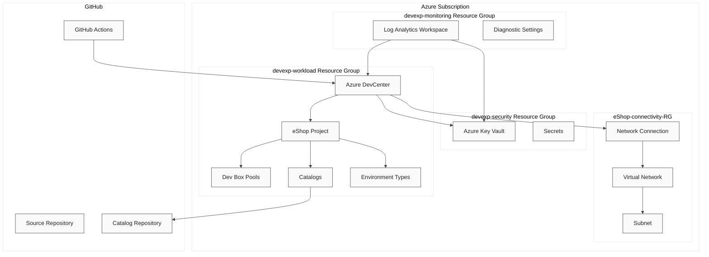

# ContosoDevExp - Dev Box Accelerator


---

## Table of Contents

- [Overview](#overview)
  - [Key Features](#key-features)
  - [Target Audience](#target-audience)
- [Architecture](#architecture)
  - [Architecture Best Practices](#architecture-best-practices)
    - [Azure Landing Zone](#azure-landing-zone)
      - [Best Practices Applied](#best-practices-applied)
    - [Azure Well-Architected Framework](#azure-well-architected-framework)
      - [Best Practices Applied](#best-practices-applied-1)
    - [Cloud-Native Applications](#cloud-native-applications)
      - [Best Practices Applied](#best-practices-applied-2)
- [Purpose](#purpose)
- [Project Type](#project-type)
- [Folder Structure](#folder-structure)
- [Getting Started](#getting-started)
  - [Prerequisites](#prerequisites)
  - [Installation](#installation)
  - [Configuration](#configuration)
- [Usage](#usage)
  - [Setup Environment](#setup-environment)
  - [Deploy to Azure](#deploy-to-azure)
  - [Cleanup](#cleanup)

---

## Overview

ContosoDevExp (Dev Box Accelerator) is a centralized developer workstation
platform that enables organizations to provision and manage cloud-based
development environments through Microsoft Dev Box. The solution establishes
infrastructure-as-code templates using Azure Bicep to deploy and configure Azure
DevCenter resources, providing role-specific workstation configurations for
different engineering personas.

This platform supports the complete developer experience lifecycle, including
workstation provisioning, environment management, catalog synchronization,
identity and access management, security management, and monitoring and
observability. The accelerator supports multiple Software Development Lifecycle
(SDLC) stages including `dev`, `staging`, and `UAT` environments.

The solution serves the Contoso organization's Platforms division, specifically
the DevExP team, with a focus on delivering standardized, secure, and efficient
development environments for development teams.

### Key Features

| Feature                          | Description                                                                                                    | Benefit                                                                         |
| -------------------------------- | -------------------------------------------------------------------------------------------------------------- | ------------------------------------------------------------------------------- |
| **Cloud-Based Dev Boxes**        | Provision on-demand developer workstations with pre-configured software, tools, and settings                   | Reduces environment setup time and ensures consistency across development teams |
| **Role-Specific Configurations** | Separate Dev Box pools for backend engineers (32 cores, 128GB RAM) and frontend engineers (16 cores, 64GB RAM) | Optimized resources tailored to specific development workloads                  |
| **Multi-Environment Support**    | Support for `dev`, `staging`, and `UAT` environment types                                                      | Enables proper SDLC stage separation and testing workflows                      |
| **Git-Based Catalog Management** | Version-controlled configuration through GitHub and Azure DevOps Git integration                               | Configuration-as-code approach with centralized, auditable changes              |
| **Centralized Security**         | Azure Key Vault integration with purge protection, soft delete, and RBAC authorization                         | Secure secrets management with recovery capabilities                            |
| **Identity Management**          | Azure AD integration with RBAC role assignments and managed identities                                         | Principle of least privilege access control                                     |
| **Monitoring & Observability**   | Log Analytics integration with diagnostic settings for all resources                                           | Centralized logging and operational visibility                                  |
| **Automated CI/CD**              | GitHub Actions workflows for continuous integration and Azure deployment                                       | Automated validation and deployment pipelines                                   |

### Target Audience

| Role                          | Use Case                                                                                                                               |
| ----------------------------- | -------------------------------------------------------------------------------------------------------------------------------------- |
| **Platform Engineering Team** | Manage DevCenter configuration, Dev Box deployments, and infrastructure maintenance                                                    |
| **Dev Managers**              | Configure Dev Box definitions and oversee project-level settings                                                                       |
| **Backend Engineers**         | Consume pre-configured Dev Box workstations optimized for backend development with Azure CLI, Azure Developer CLI, and local emulators |
| **Frontend Engineers**        | Consume pre-configured Dev Box workstations optimized for frontend development                                                         |
| **eShop Developers**          | Access Dev Box resources and deployment environments for the eShop project                                                             |

---

## Architecture

The following diagram illustrates the high-level architecture of the
ContosoDevExp platform, showing the relationships between resource groups, Azure
services, and deployment components.



### Architecture Best Practices

#### Azure Landing Zone

Azure Landing Zones provide a scalable and modular approach to deploying Azure
resources with proper governance, security, and networking configurations. The
ContosoDevExp accelerator implements Landing Zone principles through resource
group segregation by function and consistent tagging for governance.

The platform organizes resources into distinct landing zones following Azure
Cloud Adoption Framework guidance:

- **Workload Landing Zone**: Contains DevCenter and project resources
- **Security Landing Zone**: Houses Key Vault and security-related resources
- **Monitoring Landing Zone**: Contains Log Analytics and observability
  resources

##### Best Practices Applied

| Best Practice                     | Implementation                                                  | Description                                                                                                      |
| --------------------------------- | --------------------------------------------------------------- | ---------------------------------------------------------------------------------------------------------------- |
| **Resource Group Segregation**    | Separate resource groups for workload, security, and monitoring | Resources organized by function: `devexp-workload`, `devexp-security`, `devexp-monitoring`                       |
| **Consistent Tagging**            | Standardized tags across all resources                          | Tags include `environment`, `division`, `team`, `project`, `costCenter`, `owner`, `landingZone`, and `resources` |
| **Landing Zone Classification**   | Resources tagged with `landingZone` identifier                  | Enables governance and policy enforcement based on landing zone type                                             |
| **Subscription-Level Deployment** | Infrastructure deployed at subscription scope                   | Main Bicep template targets subscription scope for resource group creation                                       |

#### Azure Well-Architected Framework

The Azure Well-Architected Framework provides architectural best practices
across five pillars: Reliability, Security, Cost Optimization, Operational
Excellence, and Performance Efficiency. The ContosoDevExp accelerator implements
practices from multiple pillars.

##### Best Practices Applied

| Best Practice                                      | Implementation                                               | Description                                                                                                                                   |
| -------------------------------------------------- | ------------------------------------------------------------ | --------------------------------------------------------------------------------------------------------------------------------------------- |
| **Security: RBAC Authorization**                   | Role-based access control for all resources                  | Key Vault uses RBAC authorization; DevCenter roles assigned at appropriate scopes (Subscription, ResourceGroup, Project)                      |
| **Security: Managed Identities**                   | SystemAssigned managed identities for DevCenter and Projects | Eliminates need for credential management in application code                                                                                 |
| **Security: Secret Protection**                    | Key Vault with purge protection and soft delete              | 7-day retention for deleted secrets with protection against permanent deletion                                                                |
| **Reliability: Diagnostic Settings**               | Log Analytics integration for all resources                  | Centralized logging with `allLogs` and `AllMetrics` collection enabled                                                                        |
| **Cost Optimization: Resource Tagging**            | `costCenter` tag on all resources                            | Enables cost allocation and tracking by IT cost center                                                                                        |
| **Operational Excellence: Infrastructure as Code** | Bicep templates with YAML configuration                      | Version-controlled, repeatable deployments with parameterized configurations                                                                  |
| **Performance: Role-Specific SKUs**                | Differentiated VM SKUs for developer roles                   | Backend engineers: `general_i_32c128gb512ssd_v2` (32 cores, 128GB RAM); Frontend engineers: `general_i_16c64gb256ssd_v2` (16 cores, 64GB RAM) |

#### Cloud-Native Applications

Cloud-native principles emphasize automation, scalability, and modern DevOps
practices. The ContosoDevExp accelerator implements cloud-native patterns
through CI/CD pipelines, configuration-as-code, and managed services.

##### Best Practices Applied

| Best Practice                   | Implementation                             | Description                                                                                                               |
| ------------------------------- | ------------------------------------------ | ------------------------------------------------------------------------------------------------------------------------- |
| **GitOps Workflow**             | Git-based catalog synchronization          | Environment definitions and image definitions stored in Git repositories with automatic sync                              |
| **CI/CD Automation**            | GitHub Actions workflows                   | Continuous integration validates Bicep templates; deployment workflow provisions infrastructure using Azure Developer CLI |
| **OIDC Authentication**         | Federated credentials for GitHub Actions   | Secure authentication without storing secrets in GitHub using OpenID Connect                                              |
| **Configuration as Code**       | YAML configuration files with JSON schemas | DevCenter, security, and resource organization settings defined in version-controlled YAML files with schema validation   |
| **Desired State Configuration** | DSC configurations for Dev Box images      | WinGet-based package management for consistent tool installation across workstations                                      |
| **Managed Services**            | Azure DevCenter, Key Vault, Log Analytics  | Leverages fully managed Azure services to reduce operational overhead                                                     |

---

## Purpose

The ContosoDevExp Dev Box Accelerator establishes a centralized developer
workstation platform with the following objectives:

1. **Developer Productivity Enhancement**: Reduce environment setup time and
   provide consistent, pre-configured development environments through
   cloud-based Dev Boxes with role-specific configurations.

2. **Environment Standardization**: Provide standardized development
   environments through version-controlled configurations and catalog-based
   image definitions, ensuring consistency across development teams.

3. **Security and Compliance**: Implement security best practices including
   centralized secrets management, RBAC-based authorization, and principle of
   least privilege for access control.

4. **Operational Efficiency**: Enable automated provisioning and management of
   developer workstations through infrastructure-as-code and CI/CD pipelines.

---

## Project Type

This project is an **Infrastructure as Code (IaC) Accelerator** for Azure
DevCenter and Microsoft Dev Box. It provides:

- **Azure Bicep Templates**: Modular infrastructure definitions for deploying
  DevCenter, projects, pools, catalogs, environment types, networking, security,
  and monitoring resources
- **YAML Configuration Files**: Parameterized configuration with JSON schema
  validation for DevCenter settings, resource organization, and security
  settings
- **DSC Configurations**: Desired State Configuration files for Dev Box image
  customization including developer tools, runtimes, and Azure CLI tooling
- **GitHub Actions Workflows**: CI/CD pipelines for template validation and
  Azure deployment
- **PowerShell/Bash Scripts**: Setup and cleanup automation scripts for
  environment initialization

---

## Folder Structure

```
📁 ContosoDevExp/
├── 📁 .configuration/                    # Configuration files and scripts
│   ├── 📁 devcenter/                     # DevCenter-specific configurations
│   │   └── 📁 workloads/                 # DSC configurations for Dev Box images
│   │       ├── 📄 common-config.dsc.yaml           # Common tools (Git, VS Code, .NET, Node.js)
│   │       ├── 📄 common-backend-config.dsc.yaml   # Backend tools (Azure CLI, azd, Bicep, emulators)
│   │       ├── 📄 common-backend-usertasks-config.dsc.yaml
│   │       ├── 📄 common-frontend-usertasks-config.dsc.yaml
│   │       ├── 📄 winget-update.ps1
│   │       ├── 📄 winget-upgrade-packages.dsc.yaml
│   │       └── 📁 ADO/                   # Azure DevOps-specific configurations
│   ├── 📁 powershell/                    # PowerShell utility scripts
│   │   └── 📄 cleanUp.ps1
│   └── 📁 setup/                         # Setup and credential scripts
│       └── 📁 powershell/
│           ├── 📁 Azure/                 # Azure credential management
│           │   ├── 📄 createCustomRole.ps1
│           │   ├── 📄 createUsersAndAssignRole.ps1
│           │   ├── 📄 deleteDeploymentCredentials.ps1
│           │   ├── 📄 deleteUsersAndAssignedRoles.ps1
│           │   └── 📄 generateDeploymentCredentials.ps1
│           └── 📁 GitHub/                # GitHub secret management
│               ├── 📄 createGitHubSecretAzureCredentials.ps1
│               └── 📄 deleteGitHubSecretAzureCredentials.ps1
├── 📁 .github/                           # GitHub configurations
│   ├── 📁 actions/                       # Reusable GitHub Actions
│   │   └── 📁 ci/
│   │       ├── 📁 bicep-standard-ci/     # Bicep build action
│   │       └── 📁 generate-release/      # Release generation action
│   └── 📁 workflows/                     # GitHub Actions workflows
│       ├── 📄 ci.yml                     # Continuous integration workflow
│       ├── 📄 deploy.yml                 # Azure deployment workflow
│       └── 📄 release.yml                # Release workflow
├── 📁 docs/                              # Documentation
│   └── 📁 architecture/
│       └── 📄 Business.md                # Business architecture documentation
├── 📁 infra/                             # Infrastructure definitions
│   ├── 📄 main.bicep                     # Main deployment template (subscription scope)
│   ├── 📄 main.parameters.json           # Deployment parameters
│   └── 📁 settings/                      # Configuration settings
│       ├── 📁 resourceOrganization/
│       │   ├── 📄 azureResources.yaml    # Resource group definitions
│       │   └── 📄 azureResources.schema.json
│       ├── 📁 security/
│       │   ├── 📄 security.yaml          # Key Vault configuration
│       │   └── 📄 security.schema.json
│       └── 📁 workload/
│           ├── 📄 devcenter.yaml         # DevCenter configuration
│           └── 📄 devcenter.schema.json
├── 📁 src/                               # Bicep modules
│   ├── 📁 connectivity/                  # Network resources
│   │   ├── 📄 connectivity.bicep         # Network orchestration
│   │   ├── 📄 networkConnection.bicep    # DevCenter network connection
│   │   ├── 📄 resourceGroup.bicep        # Resource group creation
│   │   └── 📄 vnet.bicep                 # Virtual network
│   ├── 📁 identity/                      # Identity and RBAC
│   │   ├── 📄 devCenterRoleAssignment.bicep
│   │   ├── 📄 devCenterRoleAssignmentRG.bicep
│   │   ├── 📄 keyVaultAccess.bicep
│   │   ├── 📄 orgRoleAssignment.bicep
│   │   ├── 📄 projectIdentityRoleAssignment.bicep
│   │   └── 📄 projectIdentityRoleAssignmentRG.bicep
│   ├── 📁 management/                    # Monitoring resources
│   │   └── 📄 logAnalytics.bicep         # Log Analytics workspace
│   ├── 📁 security/                      # Security resources
│   │   ├── 📄 keyVault.bicep             # Key Vault resource
│   │   ├── 📄 secret.bicep               # Key Vault secret
│   │   └── 📄 security.bicep             # Security orchestration
│   └── 📁 workload/                      # DevCenter resources
│       ├── 📄 workload.bicep             # Workload orchestration
│       └── 📁 core/                      # Core DevCenter resources
│           ├── 📄 catalog.bicep          # Catalog resource
│           ├── 📄 devCenter.bicep        # DevCenter resource
│           └── 📄 environmentType.bicep  # Environment type resource
│       └── 📁 project/                   # Project resources
│           ├── 📄 project.bicep          # Project resource
│           ├── 📄 projectCatalog.bicep   # Project catalog
│           ├── 📄 projectEnvironmentType.bicep
│           └── 📄 projectPool.bicep      # Dev Box pool
├── 📄 azure.yaml                         # Azure Developer CLI config (Linux/macOS)
├── 📄 azure-pwh.yaml                     # Azure Developer CLI config (Windows PowerShell)
├── 📄 setUp.ps1                          # Windows setup script
├── 📄 setUp.sh                           # Linux/macOS setup script
├── 📄 cleanSetUp.ps1                     # Cleanup script
├── 📄 package.json                       # Node.js package configuration
└── 📄 LICENSE                            # MIT License
```

---

## Getting Started

### Prerequisites

The following tools are required to deploy and manage the ContosoDevExp
accelerator:

| Tool                          | Purpose                                                          | Installation                                                                                                     |
| ----------------------------- | ---------------------------------------------------------------- | ---------------------------------------------------------------------------------------------------------------- |
| **Azure CLI (az)**            | Azure resource management                                        | [Install Azure CLI](https://learn.microsoft.com/en-us/cli/azure/install-azure-cli)                               |
| **Azure Developer CLI (azd)** | Application deployment lifecycle                                 | [Install Azure Developer CLI](https://learn.microsoft.com/en-us/azure/developer/azure-developer-cli/install-azd) |
| **GitHub CLI (gh)**           | GitHub authentication and secret management (if using GitHub)    | [Install GitHub CLI](https://cli.github.com/)                                                                    |
| **Azure subscription**        | With Contributor access and ability to create service principals | -                                                                                                                |

### Installation

1. **Clone the repository**:

   ```bash
   git clone https://github.com/Evilazaro/DevExp-DevBox.git
   cd DevExp-DevBox
   ```

2. **Authenticate with Azure**:

   ```bash
   az login
   ```

3. **Authenticate with GitHub** (if using GitHub source control):
   ```bash
   gh auth login
   ```

### Configuration

Before deployment, configure the following files in `infra/settings/`:

1. **DevCenter Configuration**
   ([devcenter.yaml](infra/settings/workload/devcenter.yaml)):
   - Update `identity.roleAssignments.orgRoleTypes[].azureADGroupId` with your
     Azure AD group IDs
   - Update `projects[].identity.roleAssignments[].azureADGroupId` for
     project-level access
   - Modify `pools` VM SKUs and image definitions as needed
   - Configure `catalogs` with your repository URIs

2. **Resource Organization**
   ([azureResources.yaml](infra/settings/resourceOrganization/azureResources.yaml)):
   - Update `tags` with your organization's values for `division`, `team`,
     `project`, `costCenter`, and `owner`

3. **Security Settings**
   ([security.yaml](infra/settings/security/security.yaml)):
   - Update `keyVault.name` to a globally unique name
   - Configure `tags` to match your organization

---

## Usage

### Setup Environment

**Windows (PowerShell)**:

```powershell
.\setUp.ps1 -EnvName "dev" -SourceControl "github"
```

**Linux/macOS (Bash)**:

```bash
./setUp.sh -e "dev" -s "github"
```

The setup script performs the following:

1. Validates required command availability (`az`, `azd`, `gh`)
2. Tests Azure authentication status
3. Configures source control platform (GitHub or Azure DevOps)
4. Initializes `azd` environment with specified name
5. Provisions Azure infrastructure

### Deploy to Azure

**Using Azure Developer CLI**:

```bash
azd up
```

**Using GitHub Actions**:

1. Configure repository variables:
   - `AZURE_CLIENT_ID`: Service principal client ID
   - `AZURE_TENANT_ID`: Azure AD tenant ID
   - `AZURE_SUBSCRIPTION_ID`: Target subscription ID

2. Trigger the deployment workflow manually from the GitHub Actions tab with:
   - `AZURE_ENV_NAME`: Environment name (e.g., `dev`, `staging`, `prod`)
   - `AZURE_LOCATION`: Azure region (e.g., `eastus2`, `westus`)

### Cleanup

To remove all deployed resources and clean up the environment:

```powershell
.\cleanSetUp.ps1 -EnvName "dev" -Location "eastus2"
```

The cleanup script:

1. Deletes Azure subscription deployments
2. Removes user role assignments
3. Deletes deployment credentials (service principals and app registrations)
4. Removes GitHub secrets for Azure credentials
5. Cleans up Azure resource groups

> ⚠️ **Warning**: The cleanup process is destructive and cannot be undone.
> Ensure you have backups of any important data before running the cleanup
> script.

---

## License

This project is licensed under the MIT License - see the [LICENSE](LICENSE) file
for details.

Copyright (c) 2025 Evilázaro Alves
