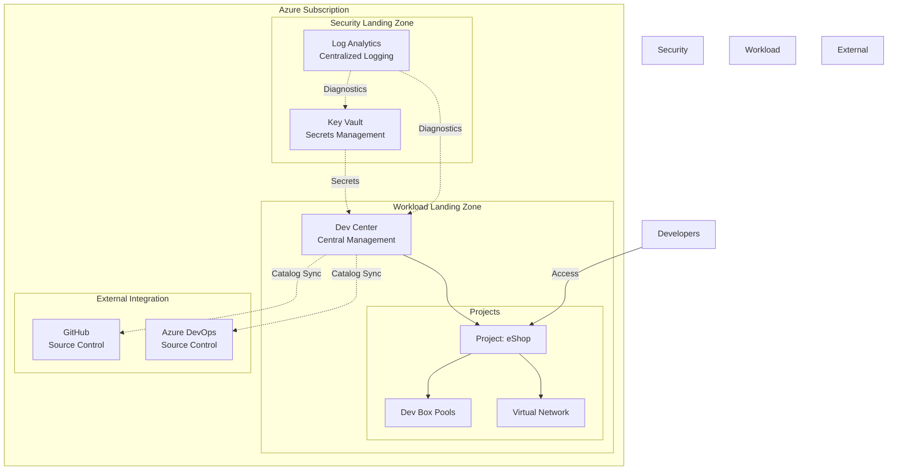

# Dev Box Adoption & Deployment Accelerator

[](LICENSE)
[](https://azure.microsoft.com/en-us/products/dev-box/)
[](https://learn.microsoft.com/azure/azure-resource-manager/bicep/)
[](https://learn.microsoft.com/cli/azure/)

> Enterprise-ready Infrastructure as Code accelerator for deploying and managing
> Microsoft Dev Box environments with best practices, automation, and
> comprehensive configuration management.

---

## 📋 Overview

The **DevExp-DevBox Accelerator** is a production-ready solution for rapidly
deploying
[Microsoft Dev Box](https://learn.microsoft.com/en-us/azure/dev-box/overview-what-is-microsoft-dev-box)
infrastructure using Infrastructure as Code (IaC) patterns. This accelerator
implements Azure Landing Zone principles with modular Bicep templates, automated
setup scripts, and YAML-based configuration for flexible, repeatable
deployments.

### Key Features

- ✅ **Modular Infrastructure**: Well-architected Bicep modules for DevCenter,
  projects, pools, and networking
- ✅ **Landing Zone Compliant**: Segregated resource groups for workload,
  security, and monitoring
- ✅ **Multi-Platform Support**: Automated setup for GitHub and Azure DevOps
  integration
- ✅ **Security First**: Azure Key Vault integration, managed identities, and
  RBAC best practices
- ✅ **Configuration-Driven**: YAML-based configuration with JSON schema
  validation
- ✅ **Cross-Platform Scripts**: PowerShell and Bash automation scripts
- ✅ **Monitoring Ready**: Built-in Log Analytics and Azure Monitor integration

---

## 🏗️ Architecture



### Component Overview

| Component      | Purpose                                           | Location                                         |
| -------------- | ------------------------------------------------- | ------------------------------------------------ |
| **DevCenter**  | Central management hub for Dev Box infrastructure | [`src/workload/core/`](src/workload/core/)       |
| **Projects**   | Developer workspaces with role-based access       | [`src/workload/project/`](src/workload/project/) |
| **Security**   | Key Vault for secrets and certificate management  | [`src/security/`](src/security/)                 |
| **Monitoring** | Log Analytics workspace for observability         | [`src/management/`](src/management/)             |
| **Networking** | Virtual networks and network connections          | [`src/connectivity/`](src/connectivity/)         |
| **Identity**   | RBAC and managed identity assignments             | [`src/identity/`](src/identity/)                 |

---

## 🚀 Quick Start

### Prerequisites

Before you begin, ensure you have:

- **Azure Subscription** with appropriate permissions (Contributor + User Access
  Administrator)
- **Azure CLI**
  [`v2.50.0+`](https://learn.microsoft.com/cli/azure/install-azure-cli)
- **Azure Developer CLI (azd)**
  [`v1.0.0+`](https://learn.microsoft.com/azure/developer/azure-developer-cli/install-azd)
- **GitHub CLI (gh)** [`v2.0.0+`](https://cli.github.com/) (if using GitHub
  integration)
- **PowerShell 7+** (Windows) or **Bash** (Linux/macOS)

### Installation

1. **Clone the repository**

   ```bash
   git clone https://github.com/Evilazaro/DevExp-DevBox.git
   cd DevExp-DevBox
   ```

2. **Authenticate with Azure**

   ```bash
   # Login to Azure
   az login

   # Set your subscription
   az account set --subscription "<your-subscription-id>"
   ```

3. **Run the setup script**

   **For Windows (PowerShell):**

   ```powershell
   .\setUp.ps1 -EnvName "dev" -SourceControl "github"
   ```

   **For Linux/macOS (Bash):**

   ```bash
   ./setUp.sh -e "dev" -s "github"
   ```

4. **Provision the infrastructure**

   ```bash
   # Initialize azd environment (if not done by setup script)
   azd init

   # Deploy infrastructure
   azd up
   ```

---

## 📚 Documentation

### Configuration

The accelerator uses YAML files for declarative configuration:

- **[`infra/settings/resourceOrganization/azureResources.yaml`](infra/settings/resourceOrganization/azureResources.yaml)** -
  Resource group organization and landing zone structure
- **[`infra/settings/workload/devcenter.yaml`](infra/settings/workload/devcenter.yaml)** -
  DevCenter configuration, projects, catalogs, and pools
- **[`infra/settings/security/security.yaml`](infra/settings/security/security.yaml)** -
  Security settings and Key Vault configuration

#### Example: DevCenter Configuration

```yaml
# devcenter.yaml snippet
name: 'devexp-devcenter'
catalogItemSyncEnableStatus: 'Enabled'
microsoftHostedNetworkEnableStatus: 'Enabled'

catalogs:
  - name: 'customTasks'
    type: gitHub
    visibility: public
    uri: 'https://github.com/microsoft/devcenter-catalog.git'
    branch: 'main'
    path: './Tasks'

projects:
  - name: 'eShop'
    description: 'eShop project.'
    network:
      name: eShop
      create: true
      addressPrefixes:
        - 10.0.0.0/16
```

### Setup Scripts

| Script                             | Platform    | Purpose                                                            |
| ---------------------------------- | ----------- | ------------------------------------------------------------------ |
| [`setUp.ps1`](setUp.ps1)           | Windows     | PowerShell automation for environment setup and GitHub integration |
| [`setUp.sh`](setUp.sh)             | Linux/macOS | Bash automation for environment setup and GitHub integration       |
| [`cleanSetUp.ps1`](cleanSetUp.ps1) | Windows     | Clean up and remove deployed resources                             |

### Infrastructure Modules

The Bicep infrastructure is organized into modular components:

```text
infra/
├── main.bicep                    # Entry point - subscription-level deployment
├── main.parameters.json          # Parameter file for deployment
└── settings/                     # Configuration files
    ├── resourceOrganization/
    ├── security/
    └── workload/

src/
├── workload/                     # DevCenter and projects
│   ├── workload.bicep
│   ├── core/                     # DevCenter core resources
│   └── project/                  # Project-level resources
├── security/                     # Key Vault and secrets
├── identity/                     # RBAC assignments
├── connectivity/                 # Networking components
└── management/                   # Monitoring and logging
```

---

## 🔧 Usage

### Deploy Dev Box Infrastructure

1. **Customize configuration** - Edit YAML files in
   [`infra/settings/`](infra/settings/) to match your requirements

2. **Set environment variables** (if not using setup script):

   ```bash
   # Set environment name
   azd env new <env-name>

   # Set location
   azd env set AZURE_LOCATION eastus
   ```

3. **Deploy with azd**:

   ```bash
   azd up
   ```

   This will:
   - Provision resource groups (workload, security, monitoring)
   - Deploy Key Vault and secrets
   - Create Log Analytics workspace
   - Deploy DevCenter with specified configuration
   - Create projects and dev box pools
   - Configure RBAC and managed identities

### Access Deployed Resources

After deployment, retrieve output values:

```bash
# Get DevCenter name
azd env get-values | grep AZURE_DEV_CENTER_NAME

# Get Key Vault name
azd env get-values | grep AZURE_KEY_VAULT_NAME

# Get resource group names
azd env get-values | grep AZURE_RESOURCE_GROUP_NAME
```

### Clean Up Resources

Remove all deployed resources:

**PowerShell:**

```powershell
.\cleanSetUp.ps1 -EnvName "dev"
```

**Or use azd:**

```bash
azd down
```

---

## 🏢 Enterprise Features

### Landing Zone Organization

The accelerator implements Azure Landing Zone principles with resource
segregation:

- **Workload Landing Zone** - DevCenter and project resources
- **Security Landing Zone** - Key Vault, secrets, and security policies
- **Monitoring Landing Zone** - Log Analytics and diagnostic settings

See
[`azureResources.yaml`](infra/settings/resourceOrganization/azureResources.yaml)
for configuration.

### Role-Based Access Control (RBAC)

Built-in support for enterprise RBAC patterns:

- **DevCenter Admins** - Full management of DevCenter resources
- **Project Admins** - Project-level configuration
- **Dev Box Users** - Access to provisioned Dev Boxes
- **DevOps Engineers** - CI/CD integration permissions

Configured via the `identity.roleAssignments` section in
[`devcenter.yaml`](infra/settings/workload/devcenter.yaml).

### Security Best Practices

- ✅ Secrets stored in Azure Key Vault (never in code)
- ✅ Managed identities for service-to-service authentication
- ✅ Network security with private endpoints support
- ✅ Diagnostic logging enabled on all resources
- ✅ Resource tagging for governance and cost management

---

## 🤝 Contributing

Contributions are welcome! This project follows a product-oriented delivery
model with structured issue management.

### Getting Started

1. Read the [CONTRIBUTING.md](CONTRIBUTING.md) guide
2. Review existing [Issues](https://github.com/Evilazaro/DevExp-DevBox/issues)
3. Follow the branching and PR workflow

### Issue Management

Use the GitHub Issue templates:

- **Epic** - High-level capabilities
- **Feature** - Concrete deliverables within an Epic
- **Task** - Small units of work within a Feature

### Engineering Standards

- **Infrastructure as Code**: Parameterized, idempotent, reusable Bicep modules
- **PowerShell**: PowerShell 7+ compatible with clear error handling
- **Documentation**: Keep docs updated with code changes

See [CONTRIBUTING.md](CONTRIBUTING.md) for complete guidelines.

---

## 📄 License

This project is licensed under the **Apache 2.0 License** - see the
[LICENSE](LICENSE) file for details.

---

## 🔗 Resources

### Microsoft Learn Documentation

- [Microsoft Dev Box Overview](https://learn.microsoft.com/en-us/azure/dev-box/overview-what-is-microsoft-dev-box)
- [Dev Box Deployment Guide](https://learn.microsoft.com/en-us/azure/dev-box/concept-dev-box-deployment-guide)
- [Azure DevCenter Documentation](https://learn.microsoft.com/en-us/azure/dev-center/)
- [Bicep Language Reference](https://learn.microsoft.com/en-us/azure/azure-resource-manager/bicep/)
- [Azure Developer CLI (azd)](https://learn.microsoft.com/azure/developer/azure-developer-cli/)

### Related Projects

- [Microsoft DevCenter Catalog](https://github.com/microsoft/devcenter-catalog) -
  Sample catalogs and templates
- [Azure Landing Zones](https://github.com/Azure/Enterprise-Scale) -
  Enterprise-scale architecture

---

## 📞 Support

For issues, questions, or contributions:

- 🐛 **Report bugs**:
  [GitHub Issues](https://github.com/Evilazaro/DevExp-DevBox/issues)
- 💡 **Feature requests**:
  [GitHub Discussions](https://github.com/Evilazaro/DevExp-DevBox/discussions)
- 📖 **Documentation**:
  [Project Wiki](https://evilazaro.github.io/DevExp-DevBox/)

---

## ⭐ Acknowledgments

Built with ❤️ by the DevExp Team, following Microsoft's best practices and Azure
Well-Architected Framework principles.

If this accelerator helps your organization, please consider giving it a ⭐ on
GitHub!
