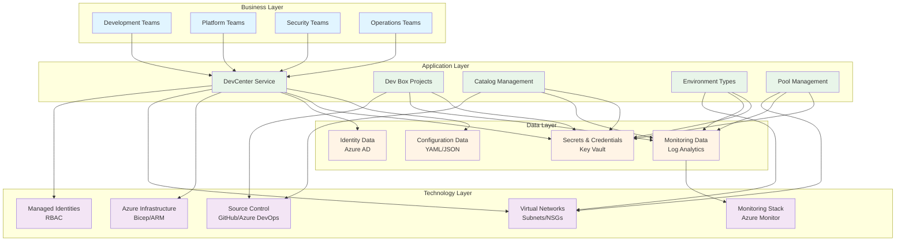
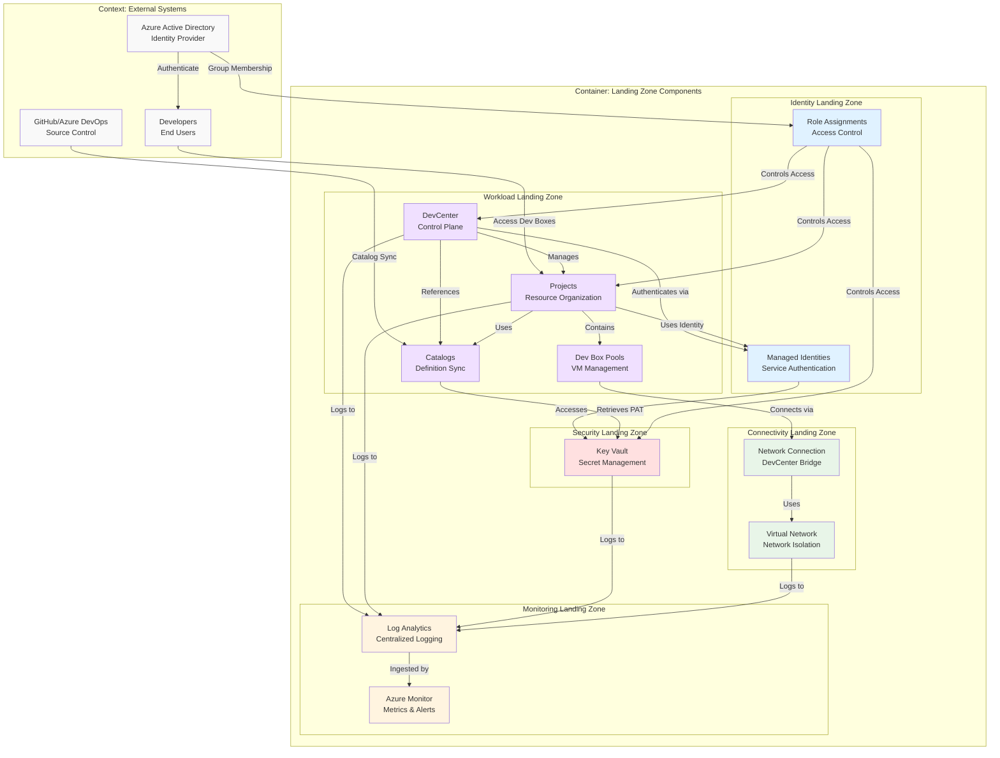
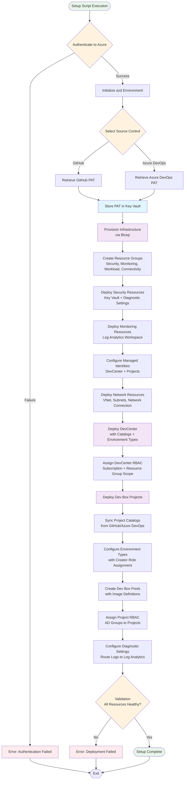

# Dev Box Landing Zone Accelerator

[](LICENSE)
[](https://azure.microsoft.com/en-us/products/dev-box/)
[](https://learn.microsoft.com/azure/azure-resource-manager/bicep/)

An enterprise-ready, open-source reference implementation for deploying Microsoft Dev Box at scale using Azure Cloud Adoption Framework principles.

---

## 📋 Table of Contents

- Project Overview
  - Problem Statement
  - Key Features
  - Solution Components
  - Azure Components
  - Project Structure
- Target Audience
- Architecture
  - Solution Architecture
  - System Architecture
  - Solution Dataflow
- Installation & Configuration
  - Prerequisites
  - Azure RBAC Roles
  - Setup Instructions
- Usage Examples

---

## 🎯 Project Overview

### Problem Statement

Organizations today face significant challenges in providing consistent, secure, and scalable development environments to their engineering teams. Traditional approaches to developer workstation management often result in configuration drift, security vulnerabilities, lengthy onboarding times, and inconsistent tooling across teams. As development teams grow and distributed work becomes the norm, IT departments struggle to maintain governance, ensure compliance, and provide developers with the powerful cloud-connected environments they need to be productive.

Microsoft Dev Box addresses these challenges by providing cloud-hosted, ready-to-code developer workstations that can be managed centrally while giving developers the flexibility they need. However, implementing Dev Box at enterprise scale requires careful planning around network architecture, identity management, security controls, catalog management, and resource organization. Organizations must consider landing zone design, subscription topology, RBAC assignments, network connectivity patterns, and integration with existing source control systems.

This Dev Box Landing Zone Accelerator provides a comprehensive, production-ready reference implementation that embodies Azure Cloud Adoption Framework best practices and Microsoft's Well-Architected Framework principles. It offers a repeatable, Infrastructure-as-Code approach to establishing a secure, scalable foundation for Dev Box deployments. The accelerator handles the complexity of resource organization, identity federation, network topology, security hardening, and operational monitoring, allowing organizations to focus on delivering value to their development teams rather than wrestling with infrastructure complexity.

The solution is designed to be modular and extensible, supporting both GitHub and Azure DevOps as catalog sources, accommodating various network topologies (managed and unmanaged), and providing flexible RBAC models that align with organizational structures. Whether you're deploying Dev Box for a small development team or rolling it out across a global enterprise with thousands of developers, this accelerator provides the architectural foundation and automation you need to succeed.

By leveraging this landing zone accelerator, organizations can reduce their time-to-value from months to days, ensure consistent security and compliance postures, and establish a sustainable operational model for managing developer environments at scale. The solution includes comprehensive monitoring and diagnostics integration, automated secret management, and support for multiple project topologies, making it suitable for diverse enterprise scenarios.

### Key Features

| **Feature** | **Description** | **Implementation Details** |
|-------------|----------------|---------------------------|
| **Multi-Source Control Integration** | Native support for both GitHub and Azure DevOps Git repositories | Automated PAT token management, secure Key Vault storage, catalog sync configuration via catalog.bicep |
| **Enterprise Landing Zone Pattern** | Azure Cloud Adoption Framework compliant resource organization | Separation of concerns across security, monitoring, workload, identity, and connectivity landing zones via main.bicep |
| **Automated Environment Provisioning** | One-command setup with Azure Developer CLI (azd) | Cross-platform setup scripts (setUp.ps1, setUp.sh) with validation and error handling |
| **Flexible Network Topology** | Support for both managed and unmanaged virtual networks | Configurable network connection types via networkConnection.bicep and vnet.bicep |
| **Comprehensive RBAC Management** | Automated role assignments across subscription and resource group scopes | Identity federation with Azure AD groups, project-level and organization-level assignments via orgRoleAssignment.bicep |
| **Secure Secret Management** | Centralized credential storage with audit logging | Azure Key Vault integration with diagnostic settings via keyVault.bicep |
| **Multi-Project Support** | Deploy and manage multiple Dev Box projects with isolation | Project-scoped catalogs, pools, and environment types via project.bicep |
| **Catalog Management** | Automated sync of environment definitions and custom images | Support for public and private repositories with scheduled sync via projectCatalog.bicep |
| **Environment Types Configuration** | Flexible environment type management with creator role assignments | System-assigned managed identities with RBAC via projectEnvironmentType.bicep |
| **Centralized Monitoring** | Log Analytics workspace integration with diagnostic settings | Comprehensive logging for Key Vault, Dev Center, and network resources via logAnalytics.bicep |
| **Infrastructure as Code** | Fully declarative Bicep templates with modular architecture | Type-safe parameters, consistent naming conventions, and reusable modules across src |
| **Azure Monitor Integration** | Automatic deployment of Azure Monitor Agent to Dev Boxes | Configurable installation status via DevCenter settings in devCenter.bicep |

### Solution Components

| **Component** | **Purpose** | **Role in Solution** |
|---------------|-------------|---------------------|
|  **Azure DevCenter** | Central hub for developer resources | Manages catalogs, environment types, and project definitions; serves as the control plane for Dev Box deployments |
|  **Dev Box Projects** | Logical grouping of development resources | Organizes Dev Box pools, catalogs, and environment types by team, application, or workload; enforces project-level RBAC |
|  **Virtual Network** | Network isolation and connectivity | Provides secure network isolation for Dev Boxes with configurable subnet topology and NSG rules |
|  **Azure Key Vault** | Secrets and credential management | Stores GitHub/Azure DevOps PAT tokens securely; accessed by DevCenter for catalog authentication |
|  **Log Analytics Workspace** | Centralized monitoring and diagnostics | Collects diagnostic logs from DevCenter, Key Vault, and network resources for operational insights |
|  **Managed Identities** | Passwordless authentication | System-assigned identities for DevCenter and projects enable secure Azure resource access without credential management |
|  **Azure RBAC** | Identity and access management | Enforces least-privilege access with role assignments at subscription, resource group, and project scopes |
| **Setup Scripts** | Automated deployment orchestration | PowerShell and Bash scripts automate azd environment initialization, token retrieval, and provisioning workflow |
| **Bicep Modules** | Infrastructure as Code templates | Modular, reusable IaC components for security, connectivity, identity, monitoring, and workload resources |

### Azure Components

| **Azure Service** | **Purpose** | **Role in Solution** |
|-------------------|-------------|---------------------|
| **Azure DevCenter** | Developer environment management platform | Provides the core service for managing Dev Box pools, catalogs, environment definitions, and project configurations |
| **Azure Key Vault** | Secret and key management service | Securely stores and manages PAT tokens for GitHub/Azure DevOps catalog integration with audit logging |
| **Azure Virtual Network** | Network isolation and connectivity | Establishes secure network boundaries for Dev Boxes with subnet segmentation and network security groups |
| **Azure Log Analytics** | Monitoring and diagnostics platform | Aggregates logs from all resources for centralized monitoring, alerting, and compliance reporting |
| **Azure Monitor** | Observability and telemetry collection | Collects metrics and logs from Dev Boxes and infrastructure components for operational insights |
| **Azure Active Directory** | Identity provider and access control | Manages user identities, group memberships, and RBAC role assignments across the solution |
| **Azure Resource Manager** | Resource deployment and management | Orchestrates infrastructure deployments via Bicep templates with dependency management |
| **Azure Managed Identities** | Credential-free authentication | Enables secure service-to-service authentication without managing credentials |
| **Azure Diagnostic Settings** | Log and metric routing | Routes diagnostic data from resources to Log Analytics workspace for analysis |

### Project Structure

```
DevExp-DevBox/
├── .azdo/                                # Azure DevOps CI/CD pipelines
│   └── pipelines/
│       └── azure-dev.yml
├── .configuration/                       # Setup and configuration utilities
│   ├── devcenter/
│   │   └── workloads/
│   ├── powershell/
│   │   └── cleanUp.ps1
│   └── setup/
│       └── powershell/
│           └── Azure/
│               ├── createCustomRole.ps1
│               ├── createUsersAndAssignRole.ps1
│               └── generateDeploymentCredentials.ps1
├── .github/                              # GitHub Actions workflows
│   ├── actions/
│   │   └── ci/
│   └── workflows/
│       ├── ci.yml
│       └── deploy.yml
├── infra/                                # Main infrastructure orchestration
│   ├── main.bicep                       # Entry point for deployment
│   ├── main.parameters.json             # Environment-specific parameters
│   └── settings/                        # YAML configuration files
│       ├── resourceOrganization/
│       │   └── azureResources.yaml     # Landing zone definitions
│       └── workload/
│           └── devcenter.yaml          # DevCenter configuration
├── src/                                 # Modular Bicep templates
│   ├── connectivity/                   # Network resources
│   │   ├── connectivity.bicep
│   │   ├── networkConnection.bicep
│   │   ├── resourceGroup.bicep
│   │   └── vnet.bicep
│   ├── identity/                       # RBAC and identity management
│   │   ├── devCenterRoleAssignment.bicep
│   │   ├── devCenterRoleAssignmentRG.bicep
│   │   ├── keyVaultAccess.bicep
│   │   ├── orgRoleAssignment.bicep
│   │   ├── projectIdentityRoleAssignment.bicep
│   │   └── projectIdentityRoleAssignmentRG.bicep
│   ├── management/                     # Monitoring resources
│   │   └── logAnalytics.bicep
│   ├── security/                       # Security resources
│   │   ├── keyVault.bicep
│   │   ├── secret.bicep
│   │   └── security.bicep
│   └── workload/                       # DevCenter resources
│       ├── workload.bicep
│       ├── core/
│       │   ├── catalog.bicep
│       │   ├── devCenter.bicep
│       │   └── environmentType.bicep
│       └── project/
│           ├── project.bicep
│           ├── projectCatalog.bicep
│           ├── projectEnvironmentType.bicep
│           └── projectPool.bicep
├── azure.yaml                          # Azure Developer CLI configuration
├── cleanSetUp.ps1                      # Cleanup script
├── setUp.ps1                           # Windows setup script
└── setUp.sh                            # Linux/macOS setup script
```

---

## 👥 Target Audience

| **Role Name** | **Role Description** | **Key Responsibilities & Deliverables** | **How this solution helps** |
|---------------|---------------------|----------------------------------------|----------------------------|
| 💼 **Solution Owner** | Business stakeholder accountable for the overall Dev Box implementation success and ROI | Define business requirements, approve budgets, ensure alignment with organizational strategy, manage stakeholder expectations, track adoption metrics | Provides a proven, enterprise-ready foundation that accelerates time-to-value, reduces implementation risk, and ensures compliance with organizational standards |
| 🏗️ **Solution Architect** | Technical leader responsible for end-to-end solution design and alignment with enterprise architecture | Define architecture patterns, ensure solution scalability and security, establish integration standards, create technical roadmaps, review design decisions | Offers a complete reference architecture following Azure Cloud Adoption Framework and Well-Architected Framework principles, eliminating architectural guesswork |
| ☁️ **Cloud Architect** | Azure platform expert responsible for cloud resource design and governance | Design landing zone topology, establish Azure governance policies, optimize resource organization, manage subscription architecture, ensure cost efficiency | Implements proven landing zone patterns with separation of concerns (security, monitoring, connectivity, identity, workload), ready for enterprise scale |
| 🌐 **Network Architect** | Specialist focused on network topology, connectivity, and security design | Design VNet architecture, configure NSG rules, plan subnet allocation, establish connectivity patterns (hub-spoke, peering), ensure network isolation | Provides flexible network topologies (managed/unmanaged VNets) with built-in network security groups and DevCenter integration patterns |
| 📊 **Data Architect** | Expert in data management, storage design, and information architecture | Define data governance policies, design storage solutions, establish data classification standards, ensure data residency compliance | Establishes secure secret management patterns with Key Vault, audit logging, and compliance-ready diagnostic settings for sensitive data handling |
| 🔐 **Security Architect** | Security specialist responsible for threat modeling, security controls, and compliance | Implement zero-trust principles, design RBAC models, establish security baselines, ensure compliance (SOC2, ISO27001, etc.), conduct threat assessments | Provides comprehensive RBAC with least-privilege access, secure secret storage, managed identity patterns, and integrated monitoring for security events |
| 🚀 **DevOps / SRE Lead** | Operations expert focused on automation, reliability, and operational excellence | Design CI/CD pipelines, establish IaC standards, implement monitoring and alerting, automate operational tasks, ensure system reliability | Delivers fully automated deployment via Bicep IaC, integrated Log Analytics, diagnostic settings, and repeatable deployment patterns using Azure Developer CLI |
| 👨‍💻 **Developer** | Software engineer who will consume Dev Box environments for application development | Write code, test applications, utilize development tools, provide feedback on developer experience, consume Dev Box resources | Enables rapid access to pre-configured, standardized Dev Box environments with custom catalogs, reducing onboarding time from days to minutes |
| 🔧 **System Engineer** | Infrastructure specialist responsible for provisioning, configuration, and maintenance of Dev Box infrastructure | Deploy infrastructure, configure Dev Box pools, manage catalogs, troubleshoot connectivity issues, maintain environment definitions | Provides ready-to-use IaC modules for all components, automated provisioning scripts, and comprehensive documentation reducing manual configuration effort |
| 📅 **Project Manager** | Coordinator responsible for planning, tracking, and delivering the Dev Box implementation project | Create project plans, track milestones, manage resources, coordinate across teams, report progress to stakeholders, manage risks and issues | Offers clear implementation path with documented prerequisites, setup instructions, and architecture diagrams that simplify project planning and risk assessment |

---

## 🏛️ Architecture

### Solution Architecture

The solution follows the TOGAF Business-Data-Application-Technology (BDAT) model, organized into four architectural layers:



### System Architecture

The system architecture follows C4 Model principles, showing Context, Container, and Component views:



### Solution Dataflow

This diagram illustrates the DevCenter provisioning and operational data flow:



---

## ⚙️ Installation & Configuration

### Prerequisites

Before deploying the Dev Box Landing Zone Accelerator, ensure you have the following tools and permissions:

#### Required Tools

- **Azure Subscription**: An active Azure subscription with appropriate permissions
- **Azure CLI**: Version 2.50.0 or higher
  ```bash
  az --version
  ```
- **Azure Developer CLI (azd)**: Version 1.5.0 or higher
  ```bash
  azd version
  ```
- **Visual Studio Code**: Latest stable version
  - **Required Extensions**:
    - [Azure Tools](https://marketplace.visualstudio.com/items?itemName=ms-vscode.vscode-node-azure-pack) - Complete Azure development toolkit
    - [Bicep](https://marketplace.visualstudio.com/items?itemName=ms-azuretools.vscode-bicep) - Bicep language support and IntelliSense

#### Source Control Tools (Choose One)

- **GitHub CLI (gh)**: Required if using GitHub as your catalog source
  ```bash
  gh --version
  ```
- **Azure CLI DevOps Extension**: Required if using Azure DevOps Git
  ```bash
  az extension add --name azure-devops
  ```

#### Additional Requirements

- **PowerShell 5.1+** (Windows) or **Bash** (Linux/macOS)
- **Git**: For cloning the repository
- **jq**: JSON processor for script automation (Linux/macOS)

### Azure RBAC Roles

The following Azure built-in roles are required or assigned during deployment:

| **Name** | **Description** | **Documentation Link** |
|----------|----------------|----------------------|
| **Contributor** | Grants full access to manage all Azure resources, but does not allow role assignments | [Documentation](https://learn.microsoft.com/azure/role-based-access-control/built-in-roles#contributor) |
| **User Access Administrator** | Grants permission to manage user access to Azure resources, including role assignments | [Documentation](https://learn.microsoft.com/azure/role-based-access-control/built-in-roles#user-access-administrator) |
| **DevCenter Dev Box User** | Allows users to create, manage, and connect to Dev Boxes within a project | [Documentation](https://learn.microsoft.com/azure/dev-box/how-to-dev-box-user) |
| **DevCenter Project Admin** | Grants full access to manage project resources including pools, catalogs, and environment types | [Documentation](https://learn.microsoft.com/azure/dev-box/how-to-project-admin) |
| **Deployment Environments Reader** | Provides read-only access to deployment environment definitions and configurations | [Documentation](https://learn.microsoft.com/azure/deployment-environments/how-to-configure-deployment-environments-user) |
| **Deployment Environments User** | Allows users to deploy and manage environments from approved environment definitions | [Documentation](https://learn.microsoft.com/azure/deployment-environments/how-to-configure-deployment-environments-user) |
| **Key Vault Secrets User** | Grants permission to read secret contents from Azure Key Vault | [Documentation](https://learn.microsoft.com/azure/role-based-access-control/built-in-roles#key-vault-secrets-user) |
| **Key Vault Secrets Officer** | Grants full access to manage secrets in Azure Key Vault, including create, update, and delete operations | [Documentation](https://learn.microsoft.com/azure/role-based-access-control/built-in-roles#key-vault-secrets-officer) |

### Setup Instructions

#### 1. Clone the Repository

```bash
git clone https://github.com/Evilazaro/DevExp-DevBox.git
cd DevExp-DevBox
```

#### 2. Authenticate to Azure

```bash
az login
az account set --subscription "<your-subscription-id>"
```

#### 3. Run the Setup Script

**For Windows (PowerShell):**

```powershell
.\setUp.ps1 -EnvName "dev" -SourceControl "github"
```

**For Linux/macOS (Bash):**

```bash
chmod +x setUp.sh
./setUp.sh --env-name "dev" --source-control "github"
```

**Parameters:**
- `-EnvName` / `--env-name`: Name of the Azure Developer CLI environment to create (e.g., dev, test, prod)
- `-SourceControl` / `--source-control`: Source control platform for catalogs (`github` or `adogit`)

#### 4. Provide Required Input

The setup script will:
1. Prompt for GitHub/Azure DevOps authentication
2. Retrieve or create a Personal Access Token (PAT)
3. Store the PAT securely in Azure Key Vault
4. Initialize the Azure Developer CLI environment
5. Deploy all infrastructure using Bicep templates

#### 5. Verify Deployment

After successful deployment, verify resources in the Azure Portal:

```bash
# List all resources in the deployment
az resource list --resource-group <workload-resource-group-name> --output table

# View DevCenter details
az devcenter admin show --name <devcenter-name> --resource-group <workload-resource-group-name>

# List deployed projects
az devcenter admin project list --resource-group <workload-resource-group-name> --output table
```

#### 6. Access Dev Box Portal

Users can access their Dev Boxes via:
- **Azure Portal**: Navigate to Azure DevCenter → Projects → Dev Boxes
- **Dev Box Portal**: https://devbox.microsoft.com

---

## 💡 Usage Examples

### Example 1: Deploy with GitHub Catalogs

Deploy a Dev Box environment using GitHub as the catalog source with a private repository:

```bash
# Set environment variables
export GITHUB_TOKEN="ghp_your_token_here"
export AZURE_SUBSCRIPTION_ID="your-subscription-id"

# Run setup
./setUp.sh --env-name "production" --source-control "github"

# Verify catalog sync status
az devcenter admin catalog show \
  --dev-center-name "dc-prod-001" \
  --name "main-catalog" \
  --resource-group "rg-workload-prod" \
  --query "{Name:name, SyncStatus:syncState, LastSyncTime:lastSyncTime}"
```

**Configuration in devcenter.yaml:**

```yaml
catalogs:
  - name: "production-environments"
    type: "gitHub"
    visibility: "private"
    uri: "https://github.com/your-org/dev-box-catalogs"
    branch: "main"
    path: "/environments"
```

### Example 2: Configure Multiple Projects

Deploy multiple Dev Box projects for different teams with isolated catalogs:

```powershell
# Deploy with multiple projects configuration
.\setUp.ps1 -EnvName "enterprise" -SourceControl "github"

# After deployment, list all projects
az devcenter admin project list `
  --resource-group "rg-workload-enterprise" `
  --query "[].{Name:name, Location:location, Status:provisioningState}" `
  --output table
```

**Configuration in devcenter.yaml:**

```yaml
projects:
  - name: "frontend-team"
    description: "Frontend development environments"
    catalogs:
      - name: "frontend-catalog"
        type: "gitHub"
        uri: "https://github.com/your-org/frontend-environments"
    identity:
      type: "SystemAssigned"
      roleAssignments:
        - azureADGroupId: "group-id-1"
          azureADGroupName: "Frontend Developers"
          azureRBACRoles:
            - id: "b24988ac-6180-42a0-ab88-20f7382dd24c"
              name: "DevCenter Dev Box User"
              scope: "Project"
  
  - name: "backend-team"
    description: "Backend development environments"
    catalogs:
      - name: "backend-catalog"
        type: "adoGit"
        uri: "https://dev.azure.com/your-org/backend-catalogs"
```

### Example 3: Custom Network Configuration

Deploy with a custom virtual network topology:

```bash
# Deploy with managed network configuration
./setUp.sh --env-name "secure-env" --source-control "github"
```

**Configuration in devcenter.yaml:**

```yaml
projects:
  - name: "secure-project"
    network:
      create: true
      virtualNetworkType: "Unmanaged"
      resourceGroupName: "rg-network-secure"
      name: "vnet-devbox-secure"
      addressPrefix: "10.100.0.0/16"
      subnets:
        - name: "snet-devbox"
          addressPrefix: "10.100.1.0/24"
          serviceEndpoints:
            - "Microsoft.KeyVault"
            - "Microsoft.Storage"
```

### Example 4: Azure DevOps Integration

Deploy using Azure DevOps Git as the catalog source:

```powershell
# Set Azure DevOps organization
$env:AZURE_DEVOPS_ORG = "https://dev.azure.com/contoso"
$env:AZURE_DEVOPS_PAT = "your-ado-pat-token"

# Deploy with Azure DevOps
.\setUp.ps1 -EnvName "ado-env" -SourceControl "adogit"

# Verify catalog sync
az devcenter admin catalog list `
  --dev-center-name "dc-ado-001" `
  --resource-group "rg-workload-ado" `
  --query "[].{Name:name, Type:adoGit.uri, Branch:adoGit.branch}" `
  --output table
```

### Example 5: Configure Custom Dev Box Pools

Create Dev Box pools with specific VM SKUs and custom images:

**Configuration in devcenter.yaml:**

```yaml
projects:
  - name: "high-performance"
    pools:
      - name: "gpu-pool"
        imageDefinitionName: "windows-11-enterprise-gpu"
        vmSku: "general_i_32c128gb2048ssd_v2"
      - name: "standard-pool"
        imageDefinitionName: "windows-11-enterprise"
        vmSku: "general_a_8c32gb_v1"
```

```bash
# Verify pool creation
az devcenter admin pool list \
  --project-name "high-performance" \
  --resource-group "rg-workload-enterprise" \
  --query "[].{Name:name, SKU:devBoxDefinition.sku.name, Status:provisioningState}" \
  --output table
```

### Example 6: Monitor Deployment with Diagnostics

Query Log Analytics for deployment diagnostics:

```bash
# Get Log Analytics Workspace ID
WORKSPACE_ID=$(az monitor log-analytics workspace show \
  --resource-group "rg-monitoring-prod" \
  --workspace-name "law-prod-001" \
  --query customerId --output tsv)

# Query DevCenter operations
az monitor log-analytics query \
  --workspace "$WORKSPACE_ID" \
  --analytics-query "AzureDiagnostics | where ResourceProvider == 'MICROSOFT.DEVCENTER' | where TimeGenerated > ago(1h) | project TimeGenerated, OperationName, ResultType, ResultDescription" \
  --output table
```

### Example 7: Cleanup and Teardown

Remove all deployed resources:

```powershell
# Run cleanup script
.\cleanSetUp.ps1 -EnvName "dev" -Location "eastus2"

# Or manually delete resource groups
az group delete --name "rg-security-dev" --yes --no-wait
az group delete --name "rg-monitoring-dev" --yes --no-wait
az group delete --name "rg-workload-dev" --yes --no-wait
az group delete --name "rg-connectivity-dev" --yes --no-wait
```

### Example 8: Update Catalog Definitions

Sync updated environment definitions from source control:

```bash
# Trigger manual catalog sync
az devcenter admin catalog sync \
  --dev-center-name "dc-prod-001" \
  --catalog-name "main-catalog" \
  --resource-group "rg-workload-prod"

# Monitor sync status
az devcenter admin catalog wait \
  --dev-center-name "dc-prod-001" \
  --catalog-name "main-catalog" \
  --resource-group "rg-workload-prod" \
  --created
```

---

## 📚 Additional Resources

- [Microsoft Dev Box Documentation](https://learn.microsoft.com/azure/dev-box/)
- [Azure Cloud Adoption Framework](https://learn.microsoft.com/azure/cloud-adoption-framework/)
- [Bicep Language Reference](https://learn.microsoft.com/azure/azure-resource-manager/bicep/)
- [Azure Developer CLI Documentation](https://learn.microsoft.com/azure/developer/azure-developer-cli/)

---

**Questions or Issues?** Please open an issue in the [GitHub repository](https://github.com/Evilazaro/DevExp-DevBox/issues).