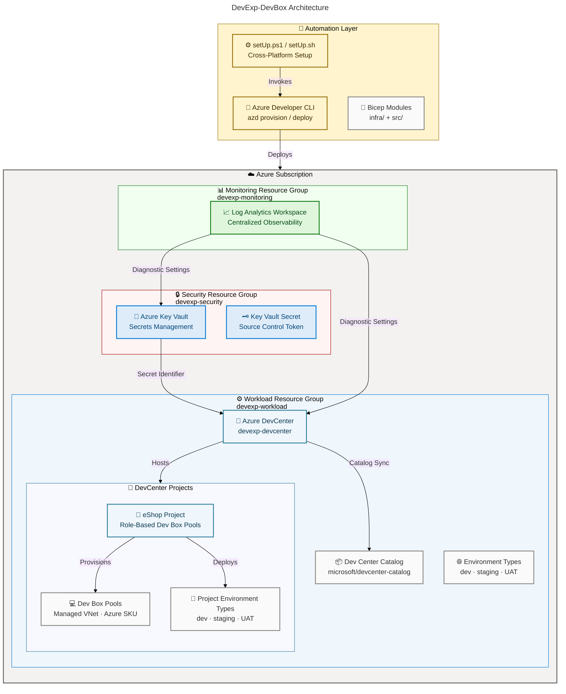

# DevExp-DevBox

[](./LICENSE)
[](https://learn.microsoft.com/en-us/azure/dev-box/overview-what-is-microsoft-dev-box)
[](https://learn.microsoft.com/en-us/azure/azure-resource-manager/bicep/overview)
[](https://learn.microsoft.com/en-us/azure/developer/azure-developer-cli/)
[](https://learn.microsoft.com/en-us/powershell/)

A production-ready Infrastructure as Code accelerator for deploying and managing
[Microsoft Dev Box](https://learn.microsoft.com/en-us/azure/dev-box/overview-what-is-microsoft-dev-box)
environments on Azure. Implements Azure Landing Zone principles with automated
provisioning of DevCenter, projects, security, networking, and monitoring
resources through reusable Bicep modules and cross-platform automation scripts.

## Overview

**Overview**

DevExp-DevBox is an Infrastructure as Code accelerator that enables platform
engineering teams to adopt Microsoft Dev Box rapidly and consistently. It
eliminates days of manual Azure configuration by codifying DevCenter, projects,
security, networking, and observability into reusable, parameterized Bicep
modules — deployed with a single command on Windows, Linux, or macOS.

The accelerator follows Azure Landing Zone principles to segregate workloads
into dedicated resource groups (Security, Monitoring, Workload), integrates
Azure Key Vault for secret management, and provides YAML-driven configuration so
teams can customize environments without touching any Bicep source files.
Whether onboarding a single team or scaling across an enterprise, this
accelerator provides a validated, production-ready foundation.

> 📌 **Documentation**: Full guides are available at
> [https://evilazaro.github.io/DevExp-DevBox/](https://evilazaro.github.io/DevExp-DevBox/).

> ⚠️ **Prerequisites**: An active Azure subscription with `Contributor` and
> `User Access Administrator` roles at subscription scope is required before
> deployment.

## Table of Contents

- [Overview](#overview)
- [Features](#features)
- [Architecture](#architecture)
- [Requirements](#requirements)
- [Configuration](#configuration)
- [Quick Start](#quick-start)
- [Security](#security)
- [Project Structure](#project-structure)
- [Contributing](#contributing)
- [Documentation](#documentation)
- [License](#license)

## Features

**Overview**

DevExp-DevBox accelerates the adoption of Microsoft Dev Box by providing
parameterized, idempotent Bicep modules organized around Azure Landing Zone
patterns. It provisions a complete developer experience platform — from
centralized DevCenter configuration to project-level Dev Box pools — with
integrated security, observability, and source control support out of the box.

| Feature                         | Description                                                                                                                    | Source                                   |
| ------------------------------- | ------------------------------------------------------------------------------------------------------------------------------ | ---------------------------------------- |
| 🏢 DevCenter Deployment         | Provisions Azure DevCenter with system-assigned identity, catalog sync, and Azure Monitor agent integration                    | `src/workload/core/devCenter.bicep`      |
| 📁 Project Management           | Deploys DevCenter projects with role-specific Dev Box pools, environment types, and network configurations                     | `src/workload/project/project.bicep`     |
| 🔐 Managed Identity & RBAC      | Configures Contributor, User Access Administrator, Key Vault Secrets User/Officer, and DevCenter Project Admin roles           | `infra/settings/workload/devcenter.yaml` |
| 🔑 Key Vault Integration        | Provisions Azure Key Vault for secure secret storage and injects secrets into DevCenter via Key Vault references               | `src/security/security.bicep`            |
| 📊 Log Analytics Monitoring     | Deploys centralized Log Analytics Workspace with diagnostic settings across all resources                                      | `src/management/logAnalytics.bicep`      |
| ☁️ Landing Zone Resource Groups | Creates isolated resource groups for Workload, Security, and Monitoring following Azure Landing Zone principles                | `infra/main.bicep`                       |
| ⚙️ Multi-Platform Automation    | Supports Windows (PowerShell 7+) and Linux/macOS (Bash) setup scripts with GitHub and Azure DevOps source control integration  | `setUp.ps1`, `setUp.sh`                  |
| 📝 YAML-Driven Configuration    | Centralizes all resource settings — DevCenter, projects, security, networking, tagging — in validated YAML configuration files | `infra/settings/`                        |
| 📦 Developer Catalogs           | Integrates the official Microsoft Dev Center catalog (`devcenter-catalog`) for custom task definitions                         | `infra/settings/workload/devcenter.yaml` |
| 🌐 Environment Type Management  | Provisions `dev`, `staging`, and `UAT` environment types per project for full SDLC lifecycle coverage                          | `infra/settings/workload/devcenter.yaml` |

## Architecture



## Requirements

**Overview**

DevExp-DevBox requires Azure CLI tooling for authentication and deployment,
source control credentials for DevCenter catalog integration, and appropriate
Azure RBAC permissions at the subscription level. All tools must be installed
and authenticated before running the setup scripts.

| Requirement                    | Version | Purpose                                               | Install                                                                                               |
| ------------------------------ | ------- | ----------------------------------------------------- | ----------------------------------------------------------------------------------------------------- |
| ☁️ Azure CLI (`az`)            | Latest  | Azure authentication and resource management          | [Install Guide](https://learn.microsoft.com/en-us/cli/azure/install-azure-cli)                        |
| 🚀 Azure Developer CLI (`azd`) | Latest  | Environment provisioning and deployment orchestration | [Install Guide](https://learn.microsoft.com/en-us/azure/developer/azure-developer-cli/install-azd)    |
| 🔗 GitHub CLI (`gh`)           | Latest  | GitHub authentication for source control integration  | [Install Guide](https://cli.github.com/)                                                              |
| 🛠️ PowerShell                  | 7+      | Windows setup script execution                        | [Install Guide](https://learn.microsoft.com/en-us/powershell/scripting/install/installing-powershell) |
| ⚡ Bash                        | 5+      | Linux/macOS setup script execution                    | Included in OS                                                                                        |
| 🔧 `jq`                        | 1.6+    | JSON processing in Bash scripts (`setUp.sh`)          | [Install Guide](https://jqlang.github.io/jq/download/)                                                |

**Azure Permissions Required**:

The deploying identity must have the following roles at subscription scope:

- `Contributor` — required to create resource groups and resources
- `User Access Administrator` — required to assign RBAC roles to the DevCenter
  managed identity

> 💡 **Tip**: Run
> `az role assignment list --assignee $(az ad signed-in-user show --query id -o tsv) --output table`
> to verify your current role assignments before deployment.

## Configuration

**Overview**

All resource settings are managed through YAML configuration files in
`infra/settings/`. These files are validated against JSON Schema definitions and
loaded at deployment time by the Bicep modules. There is no need to modify Bicep
source files for standard environment customization.

### Resource Organization (`infra/settings/resourceOrganization/azureResources.yaml`)

Defines the three Landing Zone resource groups — `devexp-workload`,
`devexp-security`, and `devexp-monitoring` — with tagging conventions:

```yaml
workload:
  create: true
  name: devexp-workload
  tags:
    environment: dev
    project: Contoso-DevExp-DevBox
    team: DevExP
    costCenter: IT

security:
  create: true
  name: devexp-security

monitoring:
  create: true
  name: devexp-monitoring
```

### DevCenter Configuration (`infra/settings/workload/devcenter.yaml`)

Controls the DevCenter instance, catalogs, environment types, and projects. Edit
this file to add projects, pools, or modify environment targets:

```yaml
name: 'devexp-devcenter'
catalogItemSyncEnableStatus: 'Enabled'
microsoftHostedNetworkEnableStatus: 'Enabled'
installAzureMonitorAgentEnableStatus: 'Enabled'

catalogs:
  - name: 'customTasks'
    type: gitHub
    uri: 'https://github.com/microsoft/devcenter-catalog.git'
    branch: 'main'
    path: './Tasks'

environmentTypes:
  - name: 'dev'
  - name: 'staging'
  - name: 'UAT'

projects:
  - name: 'eShop'
    description: 'eShop project.'
```

### Deployment Parameters (`infra/main.parameters.json`)

Environment-specific values are injected via `azd` environment variables:

| Parameter            | Environment Variable | Description                                              |
| -------------------- | -------------------- | -------------------------------------------------------- |
| 📍 `environmentName` | `AZURE_ENV_NAME`     | Short name for the deployment environment (2–10 chars)   |
| 🌍 `location`        | `AZURE_LOCATION`     | Azure region for resource deployment                     |
| 🔒 `secretValue`     | `KEY_VAULT_SECRET`   | Source control personal access token stored in Key Vault |

## Quick Start

**Prerequisites**: Ensure Azure CLI, Azure Developer CLI, GitHub CLI, and
PowerShell 7+ (Windows) or Bash 5+ (Linux/macOS) are installed and
authenticated.

### 1. Clone the Repository

```bash
git clone https://github.com/Evilazaro/DevExp-DevBox.git
cd DevExp-DevBox
```

### 2. Authenticate with Azure

```bash
az login
azd auth login
```

### 3. Run the Setup Script

**Windows (PowerShell)**:

```powershell
.\setUp.ps1 -EnvName "dev" -SourceControl "github"
```

**Linux / macOS (Bash)**:

```bash
chmod +x setUp.sh
./setUp.sh -e "dev" -s "github"
```

**Expected output**:

```text
✅ Azure CLI authenticated
✅ Azure Developer CLI authenticated
✅ GitHub CLI authenticated
✅ Environment 'dev' created
✅ azd provision completed
✅ DevCenter 'devexp-devcenter' deployed
✅ Project 'eShop' deployed
```

### 4. Provision Directly with azd (Optional)

For Linux/macOS:

```bash
azd provision --environment dev
```

For Windows, use `azure-pwh.yaml`:

```powershell
azd provision --environment dev
```

### 5. Verify the Deployment

After provisioning, the following outputs are available from `infra/main.bicep`:

```bash
azd env get-values
```

| Output Variable                         | Description                       |
| --------------------------------------- | --------------------------------- |
| 🏢 `AZURE_DEV_CENTER_NAME`              | Name of the deployed DevCenter    |
| 📁 `AZURE_DEV_CENTER_PROJECTS`          | Array of deployed project names   |
| 🔑 `AZURE_KEY_VAULT_NAME`               | Name of the provisioned Key Vault |
| 🔗 `AZURE_KEY_VAULT_ENDPOINT`           | Key Vault URI endpoint            |
| 📊 `AZURE_LOG_ANALYTICS_WORKSPACE_NAME` | Log Analytics Workspace name      |

## Security

**Overview**

DevExp-DevBox follows Azure security best practices. Secrets are never
hard-coded in Bicep templates or parameter files — all sensitive values are
stored in Azure Key Vault and referenced by identifier. The DevCenter managed
identity is granted only the permissions required to operate (principle of least
privilege).

| Control                         | Implementation                                                                                            | Source                                   |
| ------------------------------- | --------------------------------------------------------------------------------------------------------- | ---------------------------------------- |
| 🔑 Secret Storage               | GitHub / Azure DevOps access tokens stored exclusively in Azure Key Vault                                 | `src/security/secret.bicep`              |
| 🚫 No Hard-Coded Secrets        | `secretValue` parameter is marked `@secure()` and passed via environment variable `KEY_VAULT_SECRET`      | `infra/main.parameters.json`             |
| 🔐 Managed Identity             | DevCenter uses `SystemAssigned` identity — no service principals or client secrets                        | `infra/settings/workload/devcenter.yaml` |
| 🛡️ Principle of Least Privilege | DevCenter identity receives Contributor and UAA at subscription; Key Vault roles scoped to resource group | `infra/settings/workload/devcenter.yaml` |
| 📈 Diagnostic Logging           | All resources send diagnostic logs to the centralized Log Analytics Workspace                             | `src/management/logAnalytics.bicep`      |

**Reporting Security Issues**: Do not open public GitHub Issues for security
vulnerabilities. Follow the
[GitHub Security Advisory](https://github.com/Evilazaro/DevExp-DevBox/security/advisories/new)
process.

> ⚠️ **Security Notice**: Never commit values for `KEY_VAULT_SECRET`,
> `AZURE_ENV_NAME`, or personal access tokens to source control. Use
> `azd env set` to manage these values locally.

## Project Structure

```text
DevExp-DevBox/
├── azure.yaml                          # azd configuration (Linux/macOS hooks)
├── azure-pwh.yaml                      # azd configuration (Windows/PowerShell hooks)
├── setUp.ps1                           # Windows setup automation script
├── setUp.sh                            # Linux/macOS setup automation script
├── infra/
│   ├── main.bicep                      # Subscription-scoped main deployment template
│   ├── main.parameters.json            # Deployment parameter file (azd env vars)
│   └── settings/
│       ├── resourceOrganization/
│       │   └── azureResources.yaml     # Landing Zone resource group configuration
│       ├── security/
│       │   └── security.yaml          # Key Vault and secret configuration
│       └── workload/
│           └── devcenter.yaml         # DevCenter, projects, catalogs, environment types
└── src/
    ├── connectivity/                   # VNet and network connection Bicep modules
    ├── identity/                       # Role assignment Bicep modules
    ├── management/                     # Log Analytics Bicep module
    ├── security/                       # Key Vault and secret Bicep modules
    └── workload/
        ├── workload.bicep             # Workload orchestration module
        ├── core/                       # DevCenter, catalog, environment type modules
        └── project/                    # Project, pool, catalog, environment type modules
```

## Contributing

**Overview**

This project follows a product-oriented delivery model using Epics, Features,
and Tasks tracked as GitHub Issues. All contributions must reference a linked
issue, follow the branching conventions, and meet the engineering standards for
Bicep (parameterized, idempotent, reusable), PowerShell (PS 7+ compatible,
fail-fast, idempotent), and Markdown (docs-as-code, updated in the same PR as
changes).

### Branch Naming

| Type             | Convention             | Example                           |
| ---------------- | ---------------------- | --------------------------------- |
| 🚀 Feature       | `feature/<short-name>` | `feature/123-dev-center-baseline` |
| 🔧 Task          | `task/<short-name>`    | `task/456-add-pool-config`        |
| 🐛 Bug Fix       | `fix/<short-name>`     | `fix/789-keyvault-access`         |
| 📝 Documentation | `docs/<short-name>`    | `docs/update-readme`              |

### Pull Request Requirements

Every PR must:

- Reference the closing issue: `Closes #<issue-number>`
- Include a summary of changes, test/validation evidence, and documentation
  updates
- Pass all CI checks before requesting review

### Issue Labels

| Label Type  | Required Values                                                                                                                                                                               |
| ----------- | --------------------------------------------------------------------------------------------------------------------------------------------------------------------------------------------- |
| 🏷️ Type     | `type:epic`, `type:feature`, `type:task`                                                                                                                                                      |
| 🗂️ Area     | `area:dev-box`, `area:dev-center`, `area:networking`, `area:identity-access`, `area:governance`, `area:images`, `area:automation`, `area:monitoring`, `area:operations`, `area:documentation` |
| ⚡ Priority | `priority:p0`, `priority:p1`, `priority:p2`                                                                                                                                                   |
| 🔄 Status   | `status:triage`, `status:ready`, `status:in-progress`, `status:done`                                                                                                                          |

See [CONTRIBUTING.md](./CONTRIBUTING.md) for the full contribution guide.

## Documentation

Full documentation is available at
[https://evilazaro.github.io/DevExp-DevBox/](https://evilazaro.github.io/DevExp-DevBox/).

| Topic                            | Link                                                                                                                       |
| -------------------------------- | -------------------------------------------------------------------------------------------------------------------------- |
| 📋 Resource Organization         | [Configure Resource Organization](https://evilazaro.github.io/DevExp-DevBox/docs/configureresources/resourceorganization/) |
| ⚙️ Workload Configuration        | [Configure Workload](https://evilazaro.github.io/DevExp-DevBox/docs/configureresources/workload/)                          |
| ☁️ Azure Landing Zones Reference | [Microsoft CAF — Landing Zone](https://learn.microsoft.com/en-us/azure/cloud-adoption-framework/ready/landing-zone/)       |
| 💻 Microsoft Dev Box             | [What is Microsoft Dev Box?](https://learn.microsoft.com/en-us/azure/dev-box/overview-what-is-microsoft-dev-box)           |
| 🏢 Azure DevCenter               | [DevCenter Documentation](https://learn.microsoft.com/en-us/azure/dev-box/)                                                |

## License

[MIT](./LICENSE) — Copyright (c) 2025 Evilázaro Alves
