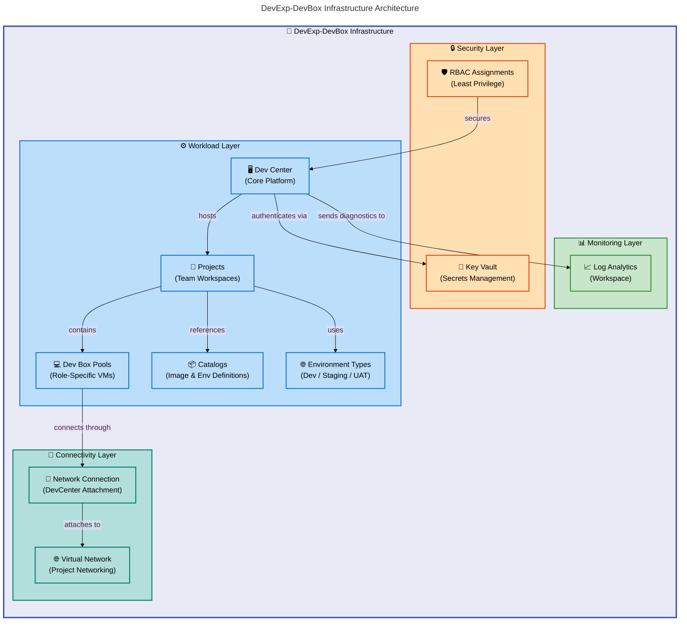

# DevExp-DevBox


DevExp-DevBox is an Azure accelerator that automates the provisioning and
configuration of
[Microsoft Dev Box](https://learn.microsoft.com/en-us/azure/dev-box/overview-what-is-microsoft-dev-box)
environments using Infrastructure as Code. It enables platform engineering teams
to deploy fully configured, role-specific developer workstations through the
[Azure Developer CLI (azd)](https://learn.microsoft.com/en-us/azure/developer/azure-developer-cli/overview).

**Overview**

Setting up consistent, secure developer environments across an organization is
time-consuming and error-prone when done manually. DevExp-DevBox solves this by
providing a production-ready accelerator built on
[Azure Landing Zone](https://learn.microsoft.com/en-us/azure/cloud-adoption-framework/ready/landing-zone/)
principles, giving teams a repeatable, governed approach to provisioning Dev Box
infrastructure with proper security, networking, and monitoring from day one.

The accelerator uses Bicep modules to deploy a multi-tier Azure architecture
comprising Dev Center, projects, Dev Box pools, Key Vault, Log Analytics, and
virtual networking. All resource configurations are driven by YAML files,
allowing teams to customize environments, role assignments, catalogs, and pool
definitions without modifying the underlying infrastructure code. The setup
scripts handle authentication with GitHub or Azure DevOps, configure the `azd`
environment, and orchestrate the entire provisioning workflow through a single
command.

DevExp-DevBox follows the
[Microsoft Dev Box deployment guide](https://learn.microsoft.com/en-us/azure/dev-box/concept-dev-box-deployment-guide)
for organizational roles and responsibilities, implementing least-privilege RBAC
assignments for Dev Center administrators, project administrators, and Dev Box
users across multiple projects and environment types.

## Table of Contents

- [Architecture](#-architecture)
- [Features](#-features)
- [Requirements](#-requirements)
- [Quick Start](#-quick-start)
- [Deployment](#-deployment)
- [Usage](#-usage)
- [Configuration](#-configuration)
- [Contributing](#-contributing)
- [License](#-license)

## 🏗️ Architecture

**Overview**

DevExp-DevBox implements a modular, layered architecture that separates concerns
across security, monitoring, connectivity, and workload domains. This separation
follows Azure Landing Zone principles, ensuring each resource group has a clear
responsibility boundary and can be governed independently through Azure Policy
and RBAC.

The infrastructure is orchestrated by a subscription-scoped Bicep entry point
(`infra/main.bicep`) that creates three resource groups and delegates
deployments to domain-specific modules under `src/`. Configuration is
externalized into YAML files under `infra/settings/`, which means teams can
adjust Dev Center settings, security policies, and resource organization without
touching the Bicep templates. This design enables multiple projects and pools to
be defined declaratively and deployed in a single provisioning pass.



## ✨ Features

**Overview**

DevExp-DevBox provides a comprehensive set of capabilities designed to reduce
the friction of setting up and governing developer environments at scale. Each
feature addresses a specific operational challenge that platform engineering
teams face when managing Dev Box infrastructure across multiple projects and
teams.

The features work together as a cohesive system: YAML-driven configuration feeds
into modular Bicep templates, which are deployed through automated setup scripts
with built-in authentication handling. This integrated approach means teams can
go from zero to a fully provisioned Dev Box environment with proper security,
networking, and monitoring in a single deployment pass.

| Feature                           | Description                                                                                                                   | Benefits                                                                                                                                                                          |
| --------------------------------- | ----------------------------------------------------------------------------------------------------------------------------- | --------------------------------------------------------------------------------------------------------------------------------------------------------------------------------- |
| ⚙️ **YAML-Driven Configuration**  | All Dev Center, security, and resource settings are defined in YAML files under `infra/settings/` with JSON schema validation | Customize environments without modifying Bicep code; schema validation catches errors before deployment                                                                           |
| 🏗️ **Modular Bicep Architecture** | Infrastructure is organized into domain-specific modules (security, monitoring, workload, connectivity) under `src/`          | Independent module updates, clear separation of concerns, and reusable components across projects                                                                                 |
| 🔒 **Integrated Security**        | Key Vault for secrets management, RBAC role assignments following least-privilege principles, and managed identities          | Secure credential storage, auditable access control aligned with [Microsoft's deployment guide](https://learn.microsoft.com/en-us/azure/dev-box/concept-dev-box-deployment-guide) |
| 🌐 **Multi-Project Support**      | Define multiple Dev Center projects with independent pools, catalogs, environment types, and network configurations           | Scale from a single team to an enterprise with per-project isolation and role-specific Dev Box pools                                                                              |
| 🚀 **Automated Provisioning**     | Cross-platform setup scripts (PowerShell and Bash) handle authentication, `azd` environment creation, and resource deployment | Single-command deployment with GitHub or Azure DevOps integration, reducing setup time from hours to minutes                                                                      |

## 📋 Requirements

**Overview**

DevExp-DevBox depends on several Azure and development tools that must be
installed and authenticated before deployment. These prerequisites ensure the
setup scripts can interact with Azure Resource Manager, configure the `azd`
environment, and authenticate with your source control platform.

Meeting these requirements upfront prevents deployment failures and ensures the
provisioning workflow completes successfully. The tools listed below are
actively verified by the setup scripts at runtime, and missing dependencies
produce clear error messages with guidance.

| Category   | Requirement                                                                                                    | More Information                                                        |
| ---------- | -------------------------------------------------------------------------------------------------------------- | ----------------------------------------------------------------------- |
| ☁️ Runtime | [Azure CLI](https://learn.microsoft.com/en-us/cli/azure/install-azure-cli) (az)                                | Required for Azure resource management and authentication               |
| ☁️ Runtime | [Azure Developer CLI](https://learn.microsoft.com/en-us/azure/developer/azure-developer-cli/install-azd) (azd) | Orchestrates environment creation and Bicep deployments                 |
| 🔧 Tooling | [GitHub CLI](https://cli.github.com/) (gh)                                                                     | Required when using GitHub as the source control platform               |
| 🔧 Tooling | [jq](https://jqlang.github.io/jq/download/)                                                                    | JSON processor used by the Bash setup script                            |
| 🖥️ System  | PowerShell 5.1+ or Bash                                                                                        | PowerShell for Windows (`setUp.ps1`), Bash for Linux/macOS (`setUp.sh`) |
| 🔑 Access  | Azure subscription with Contributor and User Access Administrator roles                                        | Needed to create resource groups, Key Vault, and RBAC assignments       |
| 🔑 Access  | GitHub personal access token (or Azure DevOps PAT)                                                             | Stored in Key Vault for catalog and repository authentication           |

> ⚠️ **Important**: You must have **Contributor** and **User Access
> Administrator** roles on your Azure subscription. The accelerator creates
> resource groups, role assignments, and managed identities that require these
> elevated permissions.

## 🚀 Quick Start

**Overview**

The fastest path to a running Dev Box environment uses the Azure Developer CLI
to provision all infrastructure in a single command. The setup script handles
authentication, environment configuration, and Bicep deployment automatically.

This workflow creates three resource groups (security, monitoring, workload),
deploys Key Vault, Log Analytics, and a Dev Center with projects and pools as
defined in the YAML configuration files.

```bash
# Clone the repository
git clone https://github.com/Evilazaro/DevExp-DevBox.git
cd DevExp-DevBox

# Log in to Azure and GitHub
az login
azd auth login
gh auth login

# Provision the environment (Linux/macOS)
azd up

# Expected output:
# SUCCESS: Your Azure Dev Box environment has been provisioned.
# Dev Center: devexp-devcenter
# Projects: eShop
# Resource Groups: devexp-workload-<env>-<region>-RG, devexp-security-<env>-<region>-RG, devexp-monitoring-<env>-<region>-RG
```

> 💡 **Tip**: On Windows, use `azure-pwh.yaml` by renaming it to `azure.yaml` to
> use the PowerShell-based provisioning hooks instead.

## 📦 Deployment

**Overview**

Deployment follows a structured workflow: authenticate with Azure and your
source control platform, configure environment-specific settings, then run the
provisioning scripts. The accelerator supports both an automated path through
`azd up` and a manual path using the setup scripts directly for greater control.

The deployment process creates Azure resources in three phases: security
resources (Key Vault), monitoring resources (Log Analytics), and workload
resources (Dev Center, projects, pools). Each phase depends on outputs from the
previous one, and the Bicep orchestration handles this dependency chain
automatically.

### Step 1: Authenticate

```bash
# Azure CLI authentication
az login

# Azure Developer CLI authentication
azd auth login

# GitHub CLI authentication (if using GitHub source control)
gh auth login
```

### Step 2: Configure Environment

```bash
# Create a new azd environment
azd env new <environment-name>

# Set the Azure region
azd env set AZURE_LOCATION <region>

# Set the GitHub token for Key Vault
azd env set KEY_VAULT_SECRET <your-github-pat>
```

### Step 3: Provision Resources

**Option A: Using `azd` (recommended)**

```bash
azd up
```

**Option B: Using setup scripts directly**

```powershell
# Windows (PowerShell)
.\setUp.ps1 -EnvName "dev" -SourceControl "github"
```

```bash
# Linux/macOS (Bash)
./setUp.sh -e "dev" -s "github"
```

### Step 4: Verify Deployment

```bash
# List deployed resource groups
az group list --query "[?contains(name, 'devexp')]" --output table

# Verify Dev Center creation
az devcenter admin devcenter list --output table
```

## 💻 Usage

**Overview**

Once deployed, the Dev Center provides developer workstations through Dev Box
pools configured for specific roles. Developers access their Dev Boxes through
the [Microsoft Dev Box portal](https://devbox.microsoft.com/) or the Azure CLI,
selecting from pools that match their role (for example, backend engineer or
frontend engineer).

Platform administrators manage the environment by updating YAML configuration
files and redeploying. Adding a new project, changing pool VM SKUs, or
introducing new environment types requires only a configuration change and a
redeployment pass.

### Accessing Dev Boxes

After deployment, developers can create and connect to Dev Boxes:

```bash
# List available pools for a project
az devcenter dev pool list --project-name "eShop" --dev-center-name "devexp-devcenter" --output table

# Create a Dev Box from a pool
az devcenter dev dev-box create \
  --name "my-devbox" \
  --pool-name "backend-engineer" \
  --project-name "eShop" \
  --dev-center-name "devexp-devcenter"

# Expected output:
# {
#   "name": "my-devbox",
#   "poolName": "backend-engineer",
#   "provisioningState": "Succeeded"
# }
```

### Adding a New Project

Define a new project entry in `infra/settings/workload/devcenter.yaml`:

```yaml
projects:
  - name: 'myNewProject'
    description: 'New team project'
    network:
      name: myNewProject
      create: true
      resourceGroupName: 'myNewProject-connectivity-RG'
      virtualNetworkType: Managed
      addressPrefixes:
        - 10.1.0.0/16
      subnets:
        - name: myNewProject-subnet
          properties:
            addressPrefix: 10.1.1.0/24
    pools:
      - name: 'developer'
        imageDefinitionName: 'myNewProject-developer'
        vmSku: general_i_16c64gb256ssd_v2
```

Then redeploy with `azd up` to provision the new project resources.

## 🔧 Configuration

**Overview**

DevExp-DevBox uses a layered YAML configuration approach where each aspect of
the infrastructure is defined in its own file under `infra/settings/`. JSON
schemas accompany each configuration file, providing validation and editor
autocompletion to catch errors before deployment. This design separates what you
deploy from how you deploy it—the Bicep templates define the resource structure
while YAML files control the values.

The three configuration domains (resource organization, security, and workload)
map directly to the architectural layers. Changes to any configuration file take
effect on the next `azd up` run, making iterative refinement straightforward
without risk of drift between documentation and deployed state.

### Resource Organization (`infra/settings/resourceOrganization/azureResources.yaml`)

Defines resource group naming and tagging strategy:

```yaml
workload:
  create: true
  name: devexp-workload
  tags:
    environment: dev
    division: Platforms
    team: DevExP
    project: Contoso-DevExp-DevBox
    costCenter: IT
    owner: Contoso

security:
  create: true
  name: devexp-security

monitoring:
  create: true
  name: devexp-monitoring
```

### Security (`infra/settings/security/security.yaml`)

Configures Key Vault settings and secret management:

```yaml
keyVault:
  name: contoso
  secretName: gha-token
  enablePurgeProtection: true
  enableSoftDelete: true
  softDeleteRetentionInDays: 7
  enableRbacAuthorization: true
```

### Dev Center (`infra/settings/workload/devcenter.yaml`)

Defines the Dev Center, projects, pools, catalogs, and environment types:

```yaml
name: 'devexp-devcenter'
catalogItemSyncEnableStatus: 'Enabled'
microsoftHostedNetworkEnableStatus: 'Enabled'

catalogs:
  - name: 'customTasks'
    type: gitHub
    uri: 'https://github.com/microsoft/devcenter-catalog.git'
    branch: 'main'
    path: './Tasks'

environmentTypes:
  - name: 'dev'
  - name: 'staging'
  - name: 'UAT'
```

### Deployment Parameters (`infra/main.parameters.json`)

Environment-specific values injected by `azd`:

```json
{
  "parameters": {
    "environmentName": { "value": "${AZURE_ENV_NAME}" },
    "location": { "value": "${AZURE_LOCATION}" },
    "secretValue": { "value": "${KEY_VAULT_SECRET}" }
  }
}
```

### Cleanup

To tear down all provisioned resources:

```powershell
.\cleanSetUp.ps1 -EnvName "dev" -Location "eastus2"
```

## 🤝 Contributing

**Overview**

Contributions to DevExp-DevBox help improve the developer experience for
platform engineering teams adopting Microsoft Dev Box. Whether you are fixing a
Bicep module, adding support for new VM SKUs, or improving the setup scripts,
every contribution strengthens the accelerator for the community.

The project follows standard GitHub workflows. Fork the repository, create a
feature branch, make your changes, and open a pull request. Bicep files should
include `@description` decorators on all parameters and outputs. YAML
configuration changes should validate against the accompanying JSON schema files
in the same directory.

1. Fork the repository
2. Create a feature branch: `git checkout -b feature/my-improvement`
3. Make your changes and test locally with `azd up`
4. Commit with descriptive messages:
   `git commit -m "feat: add pool auto-scaling configuration"`
5. Push and open a pull request: `git push origin feature/my-improvement`

> 💡 **Tip**: Run `az bicep build --file infra/main.bicep` to validate Bicep
> syntax before submitting your pull request.

## 📝 License

This project is licensed under the MIT License. See the [LICENSE](LICENSE) file
for details.
