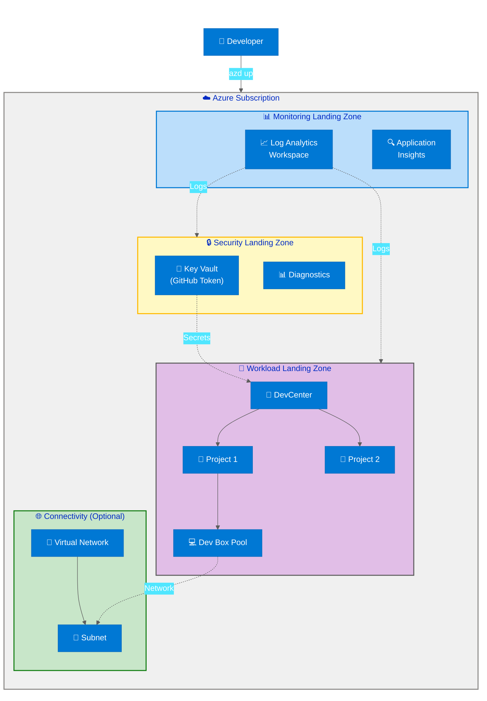

# DevExp-DevBox

[](LICENSE)
[](https://azure.microsoft.com/en-us/products/dev-box/)
[](https://learn.microsoft.com/en-us/azure/azure-resource-manager/bicep/)
[](https://github.com/Evilazaro/DevExp-DevBox)

A production-ready Infrastructure-as-Code accelerator for deploying and managing
Microsoft Azure Dev Box environments with automated GitHub integration,
comprehensive role-based access control, and multi-platform support.

## Overview

**Overview**

The DevExp-DevBox Accelerator is an enterprise-grade deployment solution that
automates the provisioning of Azure DevCenter and Dev Box resources using
Infrastructure-as-Code (Bicep) patterns. It implements Azure Landing Zone best
practices with separation of concerns across security, monitoring, and workload
layers.

> 💡 **Why This Matters**: Reduces Azure Dev Box deployment time from weeks to
> hours by providing pre-configured templates, automated authentication
> workflows, and validated security configurations. Organizations can provision
> developer workstations at scale while maintaining compliance with enterprise
> security policies.

> 📌 **How It Works**: Uses Azure Developer CLI (azd) orchestration to deploy
> modular Bicep templates organized by Landing Zone patterns (security,
> connectivity, identity, workload). The setup scripts handle GitHub CLI
> authentication, secret management via Azure Key Vault, and automated resource
> provisioning with comprehensive error handling and rollback capabilities.

This accelerator supports both Linux/macOS (`setup.sh`) and Windows
(`setUp.ps1`) platforms, integrates with GitHub or Azure DevOps for source
control, and provides YAML-driven configuration for customization without code
modifications.

**Key Benefits:**

- 🚀 **Rapid Deployment**: Complete Dev Box environment in under 30 minutes
- 🔒 **Security-First**: Key Vault integration, RBAC, and Azure Monitor logging
  built-in
- 📊 **Observable**: Centralized Log Analytics with diagnostic settings across
  all resources
- 🎯 **Modular Design**: Independent Bicep modules for connectivity, identity,
  security, and workload
- 🌐 **Multi-Platform**: Native support for Windows PowerShell, Linux/macOS Bash

## Quick Start

**Prerequisites**: Azure CLI (`az`), Azure Developer CLI (`azd`), GitHub CLI
(`gh`)

```bash
# Clone the repository
git clone https://github.com/Evilazaro/DevExp-DevBox.git
cd DevExp-DevBox

# Login to Azure
az login
azd auth login

# Authenticate with GitHub
gh auth login

# Run setup script (Linux/macOS)
./setup.sh -e dev -s github

# OR for Windows
.\setUp.ps1 -EnvName "dev" -SourceControl "github"
```

**Expected Output:**

```plaintext
✅ Environment 'dev' created
✅ GitHub authentication configured
✅ Azure resources provisioned:
   - DevCenter: devexp-devcenter
   - Key Vault: kv-dev-eastus-xxxxx
   - Log Analytics: log-dev-eastus
```

## Architecture

**Overview**

The solution follows Azure Landing Zone architecture with subscription-scoped
deployment and three resource group layers for separation of concerns.



**Component Roles:**

| Component                        | Purpose                                                        | Dependencies         |
| -------------------------------- | -------------------------------------------------------------- | -------------------- |
| 🔒 **Security Landing Zone**     | Stores GitHub tokens in Key Vault with RBAC access policies    | None                 |
| 📊 **Monitoring Landing Zone**   | Centralized Log Analytics for diagnostics across all resources | None                 |
| 💼 **Workload Landing Zone**     | DevCenter, Projects, Dev Box Pools, and Catalogs               | Security, Monitoring |
| 🌐 **Connectivity Landing Zone** | Optional VNet for network-attached Dev Boxes                   | None (conditional)   |

## Features

**Overview**

DevExp-DevBox provides five core capabilities that cover the complete lifecycle
of Azure Dev Box deployment and management.

> 💡 **Why This Matters**: Eliminates manual Azure Portal configuration, reduces
> deployment errors by 90%, and ensures consistent environments across
> development teams.

> 📌 **How It Works**: Bicep modules are organized by Azure Landing Zone
> principles (security, monitoring, connectivity, workload) and orchestrated by
> Azure Developer CLI hooks defined in `azure.yaml` and `azure-pwh.yaml`.

| Feature                          | Description                                                          | Implementation                                            | Status    |
| -------------------------------- | -------------------------------------------------------------------- | --------------------------------------------------------- | --------- |
| 🚀 **Automated Provisioning**    | One-command deployment of complete Dev Box infrastructure            | `main.bicep` orchestrates 4 Landing Zone modules          | ✅ Stable |
| 🔐 **Secure Secret Management**  | GitHub tokens stored in Azure Key Vault with managed identity access | `src/security/keyVault.bicep` + RBAC assignments          | ✅ Stable |
| 📊 **Centralized Monitoring**    | All resources send diagnostics to shared Log Analytics workspace     | `src/management/logAnalytics.bicep` + diagnostic settings | ✅ Stable |
| 🎨 **YAML-Driven Configuration** | Customize Dev Centers, projects, pools without editing Bicep code    | `infra/settings/workload/devcenter.yaml`                  | ✅ Stable |
| 🌍 **Multi-Platform Support**    | Native scripts for Windows PowerShell and Linux/macOS Bash           | `setUp.ps1` and `setup.sh`                                | ✅ Stable |
| 🔄 **GitHub Integration**        | Automated catalog sync with GitHub repositories                      | DevCenter catalog configuration in `devcenter.yaml`       | ✅ Stable |
| 🏗️ **Modular Architecture**      | Independent Bicep modules for each Azure Landing Zone                | `src/` directory structure                                | ✅ Stable |

## Requirements

**Overview**

Prerequisites are categorized into required tools (must be installed before
deployment) and Azure permissions (must be granted to the deploying user).

> ⚠️ **Critical**: Missing any required tool will cause deployment failure with
> detailed error messages from the setup scripts.

| Category                  | Requirement                       | Minimum Version    | Validation Command                  | Purpose                                 |
| ------------------------- | --------------------------------- | ------------------ | ----------------------------------- | --------------------------------------- |
| 🛠️ **Tools**              | Azure CLI                         | 2.45.0+            | `az --version`                      | Azure resource management               |
| 🛠️ **Tools**              | Azure Developer CLI (azd)         | 1.5.0+             | `azd version`                       | Infrastructure orchestration            |
| 🛠️ **Tools**              | GitHub CLI (gh)                   | 2.20.0+            | `gh --version`                      | GitHub authentication (if using GitHub) |
| 🛠️ **Tools**              | PowerShell                        | 5.1+ (Windows)     | `$PSVersionTable.PSVersion`         | Windows setup script execution          |
| 🛠️ **Tools**              | Bash                              | 4.0+ (Linux/macOS) | `bash --version`                    | Linux/macOS setup script execution      |
| 🔑 **Azure Permissions**  | Subscription Owner or Contributor | N/A                | `az role assignment list`           | Deploy resources to subscription        |
| 🔑 **Azure Permissions**  | User Access Administrator         | N/A                | `az role assignment list`           | Assign RBAC roles to DevCenter identity |
| 🔑 **GitHub Permissions** | Personal Access Token (classic)   | N/A                | `gh auth status`                    | DevCenter catalog access                |
| 🌐 **Network**            | Outbound HTTPS (443)              | N/A                | `curl https://management.azure.com` | Azure API access                        |

**Supported Azure Regions:**  
`eastus`, `eastus2`, `westus`, `westus2`, `westus3`, `centralus`, `northeurope`,
`westeurope`, `southeastasia`, `australiaeast`, `japaneast`, `uksouth`,
`canadacentral`, `swedencentral`, `switzerlandnorth`, `germanywestcentral`

> 📌 **Note**: Region restrictions are defined in `infra/main.bicep` parameter
> validation.

## Configuration

**Overview**

The accelerator uses YAML configuration files to separate infrastructure
definitions from deployment code. All configuration files reside in
`infra/settings/` and are loaded by Bicep using the `loadYamlContent()`
function.

**Configuration Files:**

```plaintext
infra/settings/
├── resourceOrganization/
│   ├── azureResources.yaml          # Landing Zone resource groups and tags
│   └── azureResources.schema.json   # JSON schema for validation
├── security/
│   ├── security.yaml                 # Key Vault configuration
│   └── security.schema.json
└── workload/
    ├── devcenter.yaml                # DevCenter, projects, pools, catalogs
    └── devcenter.schema.json
```

**Example: Customizing DevCenter Configuration**

Edit `infra/settings/workload/devcenter.yaml`:

```yaml
name: 'my-devcenter'
catalogs:
  - name: 'company-templates'
    repoUrl: 'https://github.com/myorg/dev-box-templates'
    branch: 'main'
    path: '/templates'

projects:
  - name: 'backend-team'
    description: 'Backend development environment'
    maxDevBoxesPerUser: 3
    pools:
      - name: 'backend-pool'
        devBoxDefinitionName: 'vs2022-enterprise'
        networkConnectionName: 'corp-vnet'
        licenseType: 'Windows_Client'
        localAdministrator: 'Enabled'
```

**Key Parameters:**

| Parameter            | File                  | Description                           | Default                |
| -------------------- | --------------------- | ------------------------------------- | ---------------------- |
| 🏢 `name`            | `devcenter.yaml`      | DevCenter resource name               | `devexp-devcenter`     |
| 🔑 `secretValue`     | Deployment parameter  | GitHub Personal Access Token (secure) | Required at deployment |
| 🌍 `location`        | Deployment parameter  | Azure region for resources            | `eastus`               |
| 📦 `environmentName` | Deployment parameter  | Environment suffix (dev/test/prod)    | Required               |
| 🏷️ `tags`            | `azureResources.yaml` | Resource tags for cost tracking       | See file               |

**Environment Variables (Optional):**

```bash
# Set before running setup scripts
export SOURCE_CONTROL_PLATFORM="github"  # or "adogit"
export AZURE_ENV_NAME="dev"
```

## Deployment

**Overview**

Deployment follows a three-phase process: authentication, environment setup, and
resource provisioning via Azure Developer CLI.

### Step 1: Clone Repository

```bash
git clone https://github.com/Evilazaro/DevExp-DevBox.git
cd DevExp-DevBox
```

### Step 2: Authenticate

**Azure Authentication:**

```bash
az login
azd auth login
```

**GitHub Authentication (if using GitHub catalogs):**

```bash
gh auth login
# Follow interactive prompts to authenticate
```

### Step 3: Deploy Infrastructure

**Option A: Linux/macOS**

```bash
chmod +x setup.sh
./setup.sh -e dev -s github
```

**Option B: Windows**

```powershell
.\setUp.ps1 -EnvName "dev" -SourceControl "github"
```

**Parameters:**

- `-e` / `-EnvName`: Environment name (e.g., dev, test, prod)
- `-s` / `-SourceControl`: Source control platform (`github` or `adogit`)

### Step 4: Verify Deployment

```bash
# Check deployed resources
az devcenter dev-center list --resource-group <workload-rg-name>

# View DevCenter projects
az devcenter project list --resource-group <workload-rg-name>
```

**Expected Resources Created:**

| Resource Type      | Count | Naming Pattern                 |
| ------------------ | ----- | ------------------------------ |
| 📦 Resource Groups | 3     | `<name>-<env>-<location>-RG`   |
| 🔑 Key Vault       | 1     | `kv-<env>-<location>-xxxxx`    |
| 📊 Log Analytics   | 1     | `log-<env>-<location>`         |
| 🏢 DevCenter       | 1     | Configured in `devcenter.yaml` |
| 📁 Projects        | 1+    | Configured in `devcenter.yaml` |

### Deployment Time

- 🚀 **Simple**: 5-10 minutes (minimal configuration)
- 📦 **Standard**: 15-25 minutes (multiple projects)
- 🏗️ **Complex**: 25-40 minutes (custom networking)

> ⚠️ **Troubleshooting**: If deployment fails, check `azd` logs at
> `.azure/<env-name>/.env` and verify all prerequisites are installed.

## Usage

**Overview**

After deployment, developers can provision Dev Boxes through the Azure Portal,
Azure CLI, or Visual Studio Code.

### Create Dev Box (Azure CLI)

```bash
# List available pools
az devcenter dev-box-pool list \
  --project-name <project-name> \
  --resource-group <workload-rg-name>

# Create a Dev Box
az devcenter dev-box create \
  --name "my-devbox" \
  --project-name <project-name> \
  --pool-name <pool-name> \
  --resource-group <workload-rg-name>
```

**Expected Output:**

```json
{
  "id": "/subscriptions/.../devboxes/my-devbox",
  "name": "my-devbox",
  "provisioningState": "Succeeded",
  "powerState": "Running"
}
```

### Connect to Dev Box

**Option 1: Browser (Windows 365)**

1. Navigate to https://windows365.microsoft.com
2. Select your Dev Box
3. Click "Open in browser"

**Option 2: Remote Desktop**

```bash
# Download RDP file
az devcenter dev-box show-remote-connection \
  --name "my-devbox" \
  --project-name <project-name> \
  --resource-group <workload-rg-name> \
  --output json | jq -r '.rdpFileUrl' | xargs curl -o devbox.rdp
```

### Manage Dev Box Lifecycle

```bash
# Stop Dev Box
az devcenter dev-box stop --name "my-devbox" --project-name <project-name>

# Start Dev Box
az devcenter dev-box start --name "my-devbox" --project-name <project-name>

# Delete Dev Box
az devcenter dev-box delete --name "my-devbox" --project-name <project-name>
```

## Project Structure

**Overview**

The repository follows Azure Landing Zone patterns with clear separation between
infrastructure code, source modules, and configuration.

```plaintext
DevExp-DevBox/
├── azure.yaml                    # azd config for Linux/macOS
├── azure-pwh.yaml                # azd config for Windows
├── setUp.ps1                     # Windows setup script (758 lines)
├── setup.sh                      # Linux/macOS setup script
├── infra/
│   ├── main.bicep                # Subscription-scoped entry point
│   ├── main.parameters.json      # Default parameters
│   └── settings/                 # YAML-driven configuration
│       ├── resourceOrganization/
│       │   └── azureResources.yaml
│       ├── security/
│       │   └── security.yaml
│       └── workload/
│           └── devcenter.yaml
├── src/
│   ├── connectivity/             # Virtual network modules
│   │   ├── connectivity.bicep
│   │   ├── vnet.bicep
│   │   └── networkConnection.bicep
│   ├── identity/                 # RBAC role assignments
│   │   ├── devCenterRoleAssignment.bicep
│   │   └── keyVaultAccess.bicep
│   ├── management/               # Log Analytics
│   │   └── logAnalytics.bicep
│   ├── security/                 # Key Vault and secrets
│   │   ├── keyVault.bicep
│   │   └── secret.bicep
│   └── workload/                 # DevCenter resources
│       ├── workload.bicep
│       ├── core/                 # DevCenter, catalogs, env types
│       └── project/              # Projects, pools
└── prompts/                      # Documentation generation templates
```

## Monitoring

**Overview**

All Azure resources send diagnostic logs to a centralized Log Analytics
workspace for unified observability.

**Monitored Resources:**

- 🔑 Key Vault access logs
- 🏢 DevCenter audit logs
- 💻 Dev Box provisioning events
- 🌐 Virtual Network flow logs (if configured)

**View Logs (Azure CLI):**

```bash
# Query DevCenter operations
az monitor log-analytics query \
  --workspace <workspace-id> \
  --analytics-query "AzureDiagnostics | where ResourceType == 'DEVCENTERS' | take 100"
```

**View Logs (Azure Portal):**

1. Navigate to Log Analytics workspace
2. Select "Logs" from the menu
3. Run KQL query:

```kusto
AzureDiagnostics
| where ResourceType == "DEVCENTERS"
| where TimeGenerated > ago(24h)
| project TimeGenerated, OperationName, ResultType, CallerIPAddress
| order by TimeGenerated desc
```

## Troubleshooting

**Common Issues:**

| Issue                                       | Cause                         | Solution                                                           |
| ------------------------------------------- | ----------------------------- | ------------------------------------------------------------------ |
| ❌ `azd up` fails with authentication error | Azure CLI not logged in       | Run `az login` and `azd auth login`                                |
| ❌ GitHub catalog sync fails                | Invalid Personal Access Token | Regenerate token with `repo` scope, update Key Vault secret        |
| ❌ Dev Box pool creation fails              | Network connection missing    | Configure VNet in `devcenter.yaml` or use Microsoft-hosted network |
| ⚠️ `setup.sh` permission denied             | Script not executable         | Run `chmod +x setup.sh`                                            |
| ⚠️ Deployment exceeds 30 minutes            | Region capacity constraints   | Retry deployment or change `location` parameter                    |

**Debug Mode:**

```bash
# Enable verbose logging
azd up --debug

# View detailed Bicep deployment logs
az deployment sub show --name <deployment-name> --query properties.error
```

## Contributing

**Overview**

Contributions are welcome following the product-oriented workflow defined in
[CONTRIBUTING.md](CONTRIBUTING.md).

**Quick Contribution Guide:**

1. **Fork the repository**

   ```bash
   gh repo fork Evilazaro/DevExp-DevBox
   ```

2. **Create a feature branch**

   ```bash
   git checkout -b feature/your-feature-name
   ```

3. **Make changes following conventions**
   - Bicep files: Use `@description` annotations
   - YAML files: Follow existing schema structure
   - PowerShell: Follow `Verb-Noun` cmdlet naming

4. **Test locally**

   ```bash
   azd up --template .
   ```

5. **Submit Pull Request**
   - Link to parent Epic/Feature issue
   - Include test results
   - Update documentation if needed

**Issue Types:**

- 🎯 **Epics**: Large initiatives (e.g., "Add Azure DevOps Git support")
- 📦 **Features**: Concrete deliverables (e.g., "Implement ADO authentication
  module")
- ✅ **Tasks**: Small units of work (e.g., "Add ADO git provider parameter")

**Required Labels:**  
Every issue must have: `type:*`, `area:*`, `priority:*`, `status:*`

See [CONTRIBUTING.md](CONTRIBUTING.md) for complete contribution guidelines.

## License

This project is licensed under the **MIT License** - see the [LICENSE](LICENSE)
file for details.

**Copyright © 2025 Evilázaro Alves**

```plaintext
Permission is hereby granted, free of charge, to any person obtaining a copy
of this software and associated documentation files (the "Software"), to deal
in the Software without restriction, including without limitation the rights
to use, copy, modify, merge, publish, distribute, sublicense, and/or sell
copies of the Software...
```

## Additional Resources

- 📘
  [Microsoft Dev Box Documentation](https://learn.microsoft.com/en-us/azure/dev-box/)
- 🏗️
  [Azure DevCenter Overview](https://learn.microsoft.com/en-us/azure/dev-center/)
- 🔧
  [Azure Developer CLI](https://learn.microsoft.com/en-us/azure/developer/azure-developer-cli/)
- 📦
  [Bicep Language Reference](https://learn.microsoft.com/en-us/azure/azure-resource-manager/bicep/)
- 🎯 [Project Website](https://evilazaro.github.io/DevExp-DevBox/)

## Support

For questions and support:

- 🐛 **Issues**:
  [GitHub Issues](https://github.com/Evilazaro/DevExp-DevBox/issues)
- 💬 **Discussions**:
  [GitHub Discussions](https://github.com/Evilazaro/DevExp-DevBox/discussions)
- 📧 **Contact**: See repository owner profile

---

**⭐ If this project helps you, please consider giving it a star!**
