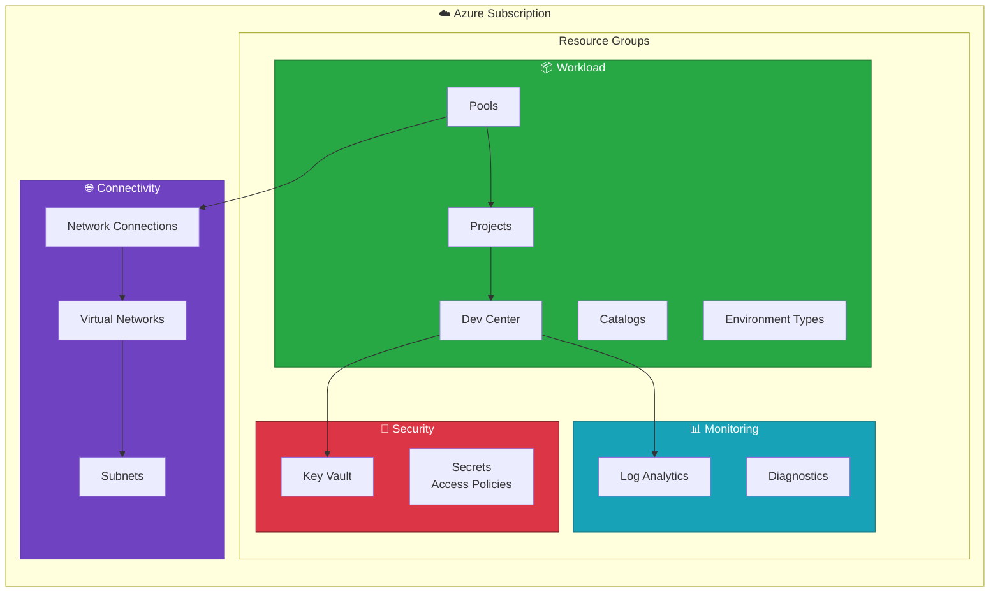

# DevExp-DevBox

[](https://github.com/Evilazaro/DevExp-DevBox/actions/workflows/ci.yml)
[](https://github.com/Evilazaro/DevExp-DevBox/actions/workflows/deploy.yml)
[](https://opensource.org/licenses/MIT)


An enterprise-grade Infrastructure-as-Code (IaC) solution built with **Azure Bicep** for deploying and managing **Microsoft Dev Box** environments at scale. This accelerator follows **Azure Landing Zone** principles with a modular architecture that separates concerns across security, monitoring, connectivity, and workload layers.

---

## 📑 Table of Contents

- [✨ Features](#-features)
- [🏗️ Architecture](#️-architecture)
- [📋 Prerequisites](#-prerequisites)
- [🚀 Quick Start](#-quick-start)
- [📁 Project Structure](#-project-structure)
- [⚙️ Configuration](#️-configuration)
- [🔄 CI/CD Pipelines](#-cicd-pipelines)
- [📦 Module Reference](#-module-reference)
- [🧹 Cleanup](#-cleanup)
- [🤝 Contributing](#-contributing)
- [📄 License](#-license)

---

## ✨ Features

- **Landing Zone Architecture** — Implements Azure best practices with segregated resource groups for Security, Monitoring, and Workload layers
- **Configuration-as-Code** — YAML-based configuration with JSON Schema validation for type safety and IDE intellisense
- **Modular Bicep Design** — Reusable, composable modules with clear input/output contracts
- **OIDC Authentication** — Passwordless GitHub Actions deployment using federated credentials
- **Multi-Project Support** — Deploy multiple Dev Box projects with distinct pools, catalogs, and access controls
- **Role-Based Access Control** — Hierarchical RBAC with Managed Identities following least-privilege principles
- **DSC Customization** — PowerShell Desired State Configuration (DSC) for Dev Box image customization
- **Automated Provisioning** — Azure Developer CLI (azd) integration for streamlined setup and deployment

---

## 🏗️ Architecture

DevExp-DevBox implements a **Landing Zone** pattern that organizes Azure resources by function:



### Azure Services Deployed

| Service | Purpose |
|---------|---------|
| **Azure DevCenter** | Central hub for developer workstation management |
| **Dev Box Projects** | Project-level organization with team-specific configurations |
| **Dev Box Pools** | VM allocation with role-specific SKUs and images |
| **Azure Key Vault** | Secure storage for secrets (e.g., GitHub PAT for catalogs) |
| **Log Analytics** | Centralized logging and monitoring for all resources |
| **Virtual Network** | Network isolation with managed or custom VNet options |

---

## 📋 Prerequisites

Ensure you have the following tools installed before proceeding:

| Tool | Version | Installation |
|------|---------|--------------|
| **Azure CLI** | 2.50+ | [Install Azure CLI](https://docs.microsoft.com/cli/azure/install-azure-cli) |
| **Azure Developer CLI (azd)** | Latest | [Install azd](https://learn.microsoft.com/azure/developer/azure-developer-cli/install-azd) |
| **GitHub CLI** | 2.0+ | [Install gh](https://cli.github.com/) |
| **Bicep CLI** | 0.20+ | Included with Azure CLI |
| **PowerShell** | 7.0+ | [Install PowerShell](https://docs.microsoft.com/powershell/scripting/install/installing-powershell) |

### Azure Requirements

- An active Azure subscription with **Owner** or **Contributor + User Access Administrator** permissions
- Azure AD permissions to create App Registrations (for OIDC setup)
- Registered resource providers: `Microsoft.DevCenter`, `Microsoft.KeyVault`, `Microsoft.Network`

---

## 🚀 Quick Start

Deploy your Dev Box environment in 4 steps:

### 1️⃣ Clone the Repository

```bash
git clone https://github.com/Evilazaro/DevExp-DevBox.git
cd DevExp-DevBox
```

### 2️⃣ Authenticate with Azure and GitHub

```bash
# Login to Azure
az login

# Login to GitHub (required for OIDC credential setup)
gh auth login
```

### 3️⃣ Run the Setup Script

The setup script initializes your Azure Developer CLI environment and configures OIDC authentication:

**Linux/macOS:**

```bash
./setUp.sh -e <environment-name> -s github
```

**Windows (PowerShell):**

```powershell
.\setUp.ps1 -EnvName <environment-name> -SourceControl github
```

Replace `<environment-name>` with your desired environment identifier (e.g., `dev`, `prod`).

### 4️⃣ Provision Infrastructure

```bash
azd provision
```

> 💡 **Tip:** For CI/CD deployments, use the GitHub Actions workflow instead. See [CI/CD Pipelines](#-cicd-pipelines).

---

## 📁 Project Structure

<details>
<summary>Click to expand full directory tree</summary>

```
DevExp-DevBox/
├── 📄 azure.yaml                    # azd configuration (Linux/macOS)
├── 📄 azure-pwh.yaml                # azd configuration (Windows PowerShell)
├── 📄 setUp.sh                      # Setup script (Bash)
├── 📄 setUp.ps1                     # Setup script (PowerShell)
├── 📄 cleanSetUp.ps1                # Cleanup script
├── 📄 package.json                  # Hugo documentation dependencies
│
├── 📁 .configuration/               # Runtime configurations
│   ├── 📁 devcenter/workloads/      # DSC configurations for Dev Box images
│   │   ├── common-config.dsc.yaml
│   │   ├── common-backend-config.dsc.yaml
│   │   └── ...
│   ├── 📁 powershell/               # PowerShell utility scripts
│   └── 📁 setup/                    # Setup helper scripts
│       ├── 📁 Azure/                # Azure credential management
│       └── 📁 GitHub/               # GitHub secret management
│
├── 📁 .github/                      # GitHub Actions configuration
│   ├── 📁 actions/ci/               # Reusable composite actions
│   │   ├── bicep-standard-ci/       # Bicep build action
│   │   └── generate-release/        # Semantic versioning action
│   └── 📁 workflows/
│       ├── ci.yml                   # Continuous Integration
│       ├── deploy.yml               # Azure deployment
│       └── release.yml              # Release management
│
├── 📁 docs/                         # TOGAF-aligned documentation
│   ├── 📁 architecture/             # Architecture decision records
│   ├── 📁 devops/                   # CI/CD documentation
│   └── 📁 scripts/                  # Script usage guides
│
├── 📁 infra/                        # Bicep orchestration layer
│   ├── 📄 main.bicep                # Entry point (subscription scope)
│   ├── 📄 main.parameters.json      # Parameter file
│   └── 📁 settings/                 # YAML configuration files
│       ├── 📁 resourceOrganization/ # Landing zone resource groups
│       ├── 📁 security/             # Key Vault settings
│       └── 📁 workload/             # DevCenter configuration
│
└── 📁 src/                          # Reusable Bicep modules
    ├── 📁 connectivity/             # Network resources
    │   ├── connectivity.bicep
    │   ├── vnet.bicep
    │   └── networkConnection.bicep
    ├── 📁 identity/                 # RBAC assignments
    │   ├── devCenterRoleAssignment.bicep
    │   └── projectIdentityRoleAssignment.bicep
    ├── 📁 management/               # Monitoring resources
    │   └── logAnalytics.bicep
    ├── 📁 security/                 # Security resources
    │   ├── keyVault.bicep
    │   ├── secret.bicep
    │   └── security.bicep
    └── 📁 workload/                 # DevCenter resources
        ├── workload.bicep
        ├── 📁 core/                 # DevCenter core modules
        │   ├── devCenter.bicep
        │   ├── catalog.bicep
        │   └── environmentType.bicep
        └── 📁 project/              # Project-level modules
            ├── project.bicep
            ├── projectPool.bicep
            ├── projectCatalog.bicep
            └── projectEnvironmentType.bicep
```

</details>

---

## ⚙️ Configuration

DevExp-DevBox uses **YAML configuration files** with JSON Schema validation for a type-safe, IDE-friendly experience.

### Configuration Files

| File | Purpose |
|------|---------|
| [infra/settings/resourceOrganization/azureResources.yaml](infra/settings/resourceOrganization/azureResources.yaml) | Resource group naming and tagging |
| [infra/settings/security/security.yaml](infra/settings/security/security.yaml) | Key Vault configuration |
| [infra/settings/workload/devcenter.yaml](infra/settings/workload/devcenter.yaml) | DevCenter, projects, pools, catalogs |

### Example: Adding a New Project

Edit `infra/settings/workload/devcenter.yaml` to add a project:

```yaml
projects:
  - name: "my-new-project"
    description: "My team's development environment"
    
    # Network configuration
    network:
      name: my-project-vnet
      create: true
      virtualNetworkType: Managed  # Or "Unmanaged" for custom VNets
      addressPrefixes:
        - 10.1.0.0/16
      subnets:
        - name: devbox-subnet
          properties:
            addressPrefix: 10.1.1.0/24
    
    # Identity and access control
    identity:
      type: SystemAssigned
      roleAssignments:
        - azureADGroupId: "<your-aad-group-id>"
          azureADGroupName: "My Team Developers"
          azureRBACRoles:
            - name: "Dev Box User"
              id: "45d50f46-0b78-4001-a660-4198cbe8cd05"
              scope: Project
    
    # Dev Box pools
    pools:
      - name: "standard-pool"
        imageDefinitionName: "my-image-definition"
        vmSku: general_i_16c64gb256ssd_v2
    
    # Environment types available to this project
    environmentTypes:
      - name: "dev"
        deploymentTargetId: ""
```

### VM SKU Options

| SKU | vCPUs | RAM | Storage | Use Case |
|-----|-------|-----|---------|----------|
| `general_i_8c32gb256ssd_v2` | 8 | 32 GB | 256 GB | Light development |
| `general_i_16c64gb256ssd_v2` | 16 | 64 GB | 256 GB | Standard development |
| `general_i_32c128gb512ssd_v2` | 32 | 128 GB | 512 GB | Heavy workloads, builds |

---

## 🔄 CI/CD Pipelines

### Workflows Overview

| Workflow | Trigger | Purpose |
|----------|---------|---------|
| **ci.yml** | Push to `feature/**`, `fix/**` branches; PRs to `main` | Build and validate Bicep templates |
| **deploy.yml** | Manual dispatch | Deploy infrastructure to Azure |
| **release.yml** | Manual dispatch | Generate semantic versions and GitHub releases |

### Deployment Workflow

The `deploy.yml` workflow uses **OIDC federation** for passwordless Azure authentication:

```yaml
# Required GitHub Repository Variables
AZURE_CLIENT_ID       # App registration client ID
AZURE_TENANT_ID       # Azure AD tenant ID
AZURE_SUBSCRIPTION_ID # Target subscription ID

# Required GitHub Repository Secrets
KEY_VAULT_SECRET      # GitHub PAT for private catalog access
```

#### Deploy via GitHub Actions

1. Navigate to **Actions** → **Deploy to Azure**
2. Click **Run workflow**
3. Enter:
   - `AZURE_ENV_NAME`: Environment name (e.g., `dev`, `prod`)
   - `AZURE_LOCATION`: Azure region (e.g., `eastus2`)
4. Click **Run workflow**

### Setting Up OIDC Authentication

Run the setup script to configure OIDC credentials automatically:

```powershell
# Creates App Registration and configures federated credentials
.\.configuration\setup\powershell\Azure\generateDeploymentCredentials.ps1
```

---

## 📦 Module Reference

<details>
<summary>Click to expand module catalog</summary>

### Core Modules

| Module | Path | Description |
|--------|------|-------------|
| `main.bicep` | `infra/main.bicep` | Orchestration entry point (subscription scope) |

### Security Layer

| Module | Path | Description |
|--------|------|-------------|
| `security.bicep` | `src/security/security.bicep` | Security landing zone orchestrator |
| `keyVault.bicep` | `src/security/keyVault.bicep` | Azure Key Vault with RBAC |
| `secret.bicep` | `src/security/secret.bicep` | Key Vault secret management |

### Management Layer

| Module | Path | Description |
|--------|------|-------------|
| `logAnalytics.bicep` | `src/management/logAnalytics.bicep` | Log Analytics workspace |

### Connectivity Layer

| Module | Path | Description |
|--------|------|-------------|
| `connectivity.bicep` | `src/connectivity/connectivity.bicep` | Connectivity orchestrator |
| `vnet.bicep` | `src/connectivity/vnet.bicep` | Virtual network with subnets |
| `networkConnection.bicep` | `src/connectivity/networkConnection.bicep` | DevCenter network connection |
| `resourceGroup.bicep` | `src/connectivity/resourceGroup.bicep` | Connectivity resource group |

### Workload Layer

| Module | Path | Description |
|--------|------|-------------|
| `workload.bicep` | `src/workload/workload.bicep` | Workload orchestrator |
| `devCenter.bicep` | `src/workload/core/devCenter.bicep` | DevCenter resource |
| `catalog.bicep` | `src/workload/core/catalog.bicep` | DevCenter catalog |
| `environmentType.bicep` | `src/workload/core/environmentType.bicep` | Environment type definition |
| `project.bicep` | `src/workload/project/project.bicep` | DevCenter project |
| `projectPool.bicep` | `src/workload/project/projectPool.bicep` | Dev Box pool |
| `projectCatalog.bicep` | `src/workload/project/projectCatalog.bicep` | Project-level catalog |
| `projectEnvironmentType.bicep` | `src/workload/project/projectEnvironmentType.bicep` | Project environment type |

### Identity Layer

| Module | Path | Description |
|--------|------|-------------|
| `devCenterRoleAssignment.bicep` | `src/identity/devCenterRoleAssignment.bicep` | DevCenter RBAC |
| `projectIdentityRoleAssignment.bicep` | `src/identity/projectIdentityRoleAssignment.bicep` | Project RBAC |
| `keyVaultAccess.bicep` | `src/identity/keyVaultAccess.bicep` | Key Vault access policies |
| `orgRoleAssignment.bicep` | `src/identity/orgRoleAssignment.bicep` | Organization-level RBAC |

</details>

---

## 🧹 Cleanup

Remove all deployed resources when no longer needed:

### Option 1: Azure Developer CLI

```bash
azd down --purge --force
```

### Option 2: Cleanup Script

```powershell
.\cleanSetUp.ps1 -EnvName <environment-name> -Location <azure-region>
```

This script:

- Deletes subscription-level deployments
- Removes user role assignments
- Deletes service principals and app registrations
- Removes GitHub secrets
- Cleans up resource groups

---

## 🤝 Contributing

Contributions are welcome! Please follow these guidelines:

1. **Fork** the repository
2. **Create** a feature branch (`git checkout -b feature/amazing-feature`)
3. **Commit** your changes (`git commit -m 'Add amazing feature'`)
4. **Push** to the branch (`git push origin feature/amazing-feature`)
5. **Open** a Pull Request

### Development Guidelines

- Follow [Bicep best practices](https://learn.microsoft.com/azure/azure-resource-manager/bicep/best-practices)
- Include descriptions for all parameters and variables
- Add appropriate tags to all resources
- Update documentation for configuration changes
- Test changes locally before submitting PRs

---

## 📄 License

This project is licensed under the **MIT License** — see the [LICENSE](LICENSE) file for details.

---

## 📚 Additional Resources

- [Microsoft Dev Box Documentation](https://learn.microsoft.com/azure/dev-box/overview-what-is-microsoft-dev-box)
- [Azure DevCenter Documentation](https://learn.microsoft.com/azure/deployment-environments/overview-what-is-azure-deployment-environments)
- [Azure Bicep Documentation](https://learn.microsoft.com/azure/azure-resource-manager/bicep/)
- [Azure Landing Zones](https://learn.microsoft.com/azure/cloud-adoption-framework/ready/landing-zone/)
- [Project Architecture Documentation](docs/architecture/)

---

<p align="center">
  Built with ❤️ by the <a href="https://github.com/Evilazaro">DevExp Team</a>
</p>
