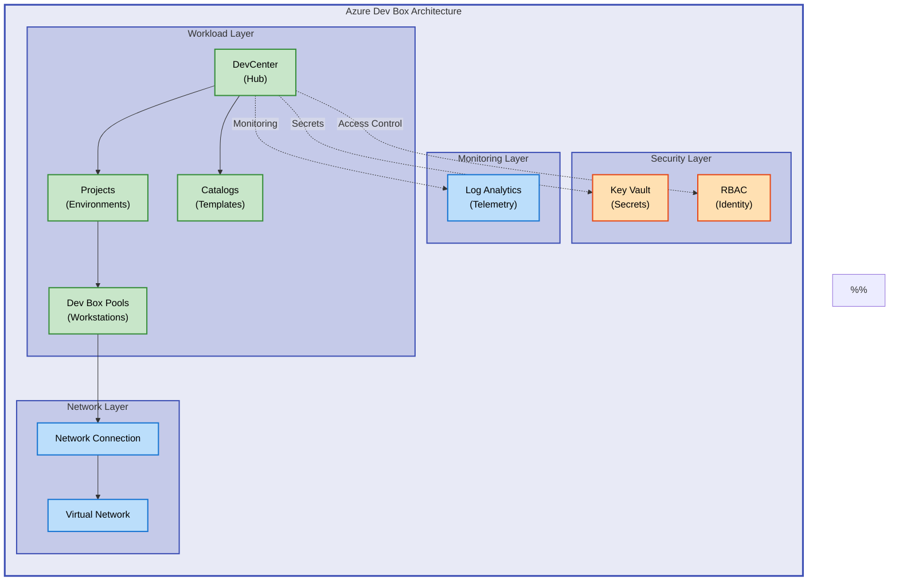

# DevExp-DevBox


Azure Dev Box accelerator for automated provisioning of cloud-based development
environments. Streamlines developer onboarding with infrastructure-as-code
templates and role-based configurations.

**Overview**

DevExp-DevBox provides enterprise teams with a turnkey solution for deploying
standardized development workstations in Azure. Built on Azure Dev Box and
DevCenter services, this accelerator eliminates the traditional complexity of
provisioning developer environments by automating infrastructure deployment,
identity management, and security configurations. Organizations can reduce
developer onboarding time from days to minutes while ensuring consistent
tooling, security policies, and access controls across all development teams.

This solution follows Azure Landing Zone principles, organizing resources into
security, monitoring, and workload resource groups. Configuration is driven by
YAML schemas, enabling teams to version-control their environment specifications
and customize settings without modifying infrastructure code. The modular Bicep
architecture supports multi-region deployments, integration with GitHub or Azure
DevOps, and extensibility for custom catalogs and environment types. Whether
deploying a single project or scaling across multiple divisions, DevExp-DevBox
provides the foundation for modern, cloud-native development practices.

---

## 📑 Table of Contents

- [Architecture](#-architecture)
- [Quick Start](#-quick-start)
- [Deployment](#-deployment)
- [Usage](#-usage)
- [Features](#-features)
- [Requirements](#-requirements)
- [Configuration](#-configuration)
- [Contributing](#-contributing)
- [License](#-license)

---

## 🏗️ Architecture

**Overview**

The architecture implements a hub-and-spoke model with separated concerns for
security, monitoring, and workload resources. The DevCenter acts as the central
hub, coordinating project-specific configurations, network connections, and
developer access policies. This separation ensures that security credentials
(Key Vault), operational telemetry (Log Analytics), and application workloads
(Dev Box pools) can be managed independently with appropriate RBAC controls.

Resource organization follows Azure Landing Zone best practices, with distinct
resource groups tagged by division, team, and cost center. The modular Bicep
design allows infrastructure components (connectivity, identity, security,
management, workload) to be deployed independently or as a cohesive system.
Configuration is externalized to YAML files, enabling infrastructure teams to
maintain environment-specific settings without altering deployment code.



## 🚀 Quick Start

> ⚠️ **Prerequisites**: Ensure Azure CLI, Azure Developer CLI (azd), and GitHub
> CLI (gh) are installed before proceeding.

```bash
# Clone repository
git clone https://github.com/Evilazaro/DevExp-DevBox.git
cd DevExp-DevBox

# Run automated setup (Windows)
.\setUp.ps1 -EnvName "dev" -SourceControl "github"

# Run automated setup (Linux/macOS)
./setUp.sh -e "dev" -s "github"
```

## 📦 Deployment

**Overview**

Deployment follows a three-stage process: authentication, configuration, and
provisioning. The setup scripts handle Azure CLI authentication, GitHub token
management, and environment variable configuration automatically. Infrastructure
deployment uses Azure Developer CLI (azd) to orchestrate Bicep template
provisioning, ensuring resources are created in the correct dependency order.

For production deployments, customize YAML configuration files before running
setup scripts. The
[`azureResources.yaml`](infra/settings/resourceOrganization/azureResources.yaml)
file controls resource group naming and tagging, while
[`devcenter.yaml`](infra/settings/workload/devcenter.yaml) defines project
structures, environment types, and developer access policies. All secrets
(GitHub tokens, service principals) are stored securely in Azure Key Vault and
never persisted to local configuration files.

### Step 1: Prerequisites

Verify required tools are installed:

```bash
# Check Azure CLI
az --version

# Check Azure Developer CLI
azd version

# Check GitHub CLI (if using GitHub)
gh --version
```

> 💡 **Tip**: Install missing tools using package managers (`winget`, `brew`,
> `apt`) or visit
> [Azure CLI docs](https://learn.microsoft.com/cli/azure/install-azure-cli).

### Step 2: Configure Environment

Edit configuration files to match your organization:

```yaml
# infra/settings/resourceOrganization/azureResources.yaml
workload:
  create: true
  name: your-org-workload
  tags:
    environment: prod
    division: Engineering
    team: Platform
```

### Step 3: Authenticate

```bash
# Login to Azure
az login

# Login to GitHub (if using GitHub)
gh auth login
```

### Step 4: Deploy Infrastructure

**Windows (PowerShell)**:

```powershell
.\setUp.ps1 -EnvName "prod" -SourceControl "github"
```

**Linux/macOS (Bash)**:

```bash
./setUp.sh -e "prod" -s "github"
```

### Step 5: Verify Deployment

```bash
# Check resource groups
az group list --query "[?tags.project=='Contoso-DevExp-DevBox'].name" -o table

# View DevCenter resources
az devcenter admin list -g <workload-resource-group>
```

## 💻 Usage

**Overview**

Once deployed, developers access Dev Box environments through the Azure portal
or Azure Developer CLI. Administrators manage projects, pools, and environment
types via Bicep templates or Azure CLI commands. The system supports role-based
access, allowing project-specific permissions and self-service provisioning for
authorized developers.

### Create a New Project

```bash
# Using Azure CLI
az devcenter admin project create \
  --name "MyProject" \
  --dev-center-id "/subscriptions/{sub-id}/resourceGroups/{rg}/providers/Microsoft.DevCenter/devcenters/{dc-name}" \
  --resource-group <workload-resource-group>
```

### Add Developer Access

```bash
# Assign Dev Box User role
az role assignment create \
  --assignee user@contoso.com \
  --role "DevCenter Dev Box User" \
  --scope "/subscriptions/{sub-id}/resourceGroups/{rg}/providers/Microsoft.DevCenter/projects/{project-name}"
```

### Provision a Dev Box

Developers provision workstations via the
[Azure portal](https://portal.azure.com):

1. Navigate to **Dev Box** service
2. Select project and pool
3. Click **Create Dev Box**
4. Choose environment type and configuration
5. Connect via Remote Desktop or browser

## ✨ Features

**Overview**

DevExp-DevBox delivers production-ready infrastructure with enterprise-grade
security, compliance, and operational excellence. Key capabilities address
common challenges in developer environment management: inconsistent tooling,
slow onboarding, and manual configuration drift. By codifying infrastructure,
the solution ensures repeatable deployments, auditability, and
version-controlled environment specifications.

The modular design supports hybrid scenarios, enabling teams to integrate
existing virtual networks, Key Vaults, or monitoring solutions. Automated setup
scripts reduce deployment complexity, while YAML-driven configuration empowers
non-developers to customize settings without modifying infrastructure code.
Role-based access controls and Azure AD integration ensure secure, compliant
access to development resources.

| Feature                        | Description                                                                                      | Benefits                                                                               |
| ------------------------------ | ------------------------------------------------------------------------------------------------ | -------------------------------------------------------------------------------------- |
| 🔧 Infrastructure as Code      | Bicep templates for all Azure resources with version control and drift detection                 | Ensures consistent, auditable, and repeatable deployments across environments          |
| 🔐 Integrated Security         | Azure Key Vault for secrets, system-assigned managed identities, and RBAC for access control     | Eliminates hardcoded credentials and enforces least-privilege access policies          |
| 📊 Centralized Monitoring      | Log Analytics workspace for telemetry, diagnostics, and compliance reporting                     | Provides unified operational insights and supports audit requirements                  |
| 🌐 Multi-Platform Support      | GitHub and Azure DevOps integration for catalog synchronization and source control               | Enables teams to use existing DevOps workflows and repository structures               |
| 🎯 Configuration-Driven Design | YAML schemas for resource organization, workload settings, and security policies                 | Separates infrastructure code from configuration, simplifying multi-environment setups |
| 🚀 Automated Setup Scripts     | PowerShell and Bash scripts for one-command deployment with validation and error handling        | Reduces deployment time from hours to minutes and minimizes human error                |
| 🏗️ Modular Architecture        | Reusable Bicep modules for connectivity, identity, security, management, and workload components | Supports incremental adoption and integration with existing Azure infrastructure       |

## 📋 Requirements

**Overview**

DevExp-DevBox requires Azure services (DevCenter, Key Vault, Virtual Networks)
and command-line tools for deployment automation. Azure DevCenter availability
is limited to specific regions; verify
[regional support](https://azure.microsoft.com/global-infrastructure/services/?products=devcenter)
before deployment. GitHub or Azure DevOps access is necessary for catalog
integration, enabling custom environment templates and task definitions.

All prerequisites use standard installation methods (package managers, official
installers). Service principal authentication is optional but recommended for
CI/CD pipelines. For production deployments, plan for network connectivity (VNet
peering, private endpoints) and identity integration (Azure AD groups,
conditional access policies).

| Category          | Requirements                                                | More Information                                                                                         |
| ----------------- | ----------------------------------------------------------- | -------------------------------------------------------------------------------------------------------- |
| 🔧 Runtime        | Azure CLI 2.50+, Azure Developer CLI (azd) 1.0+             | [Install Azure CLI](https://learn.microsoft.com/cli/azure/install-azure-cli)                             |
| 💻 System         | Windows 10+, macOS 11+, Linux (Ubuntu 20.04+)               | [OS Support](https://learn.microsoft.com/azure/dev-box/overview-what-is-microsoft-dev-box#requirements)  |
| ☁️ Azure Services | Azure subscription, Azure DevCenter (in supported regions)  | [DevCenter Availability](https://azure.microsoft.com/global-infrastructure/services/?products=devcenter) |
| 🔐 Access         | Contributor or Owner role on subscription                   | [Azure RBAC](https://learn.microsoft.com/azure/role-based-access-control/built-in-roles)                 |
| 🌐 Source Control | GitHub account (with Personal Access Token) or Azure DevOps | [GitHub CLI](https://cli.github.com/), [Azure DevOps](https://dev.azure.com/)                            |
| 🛠️ Optional       | PowerShell 7+ (Windows), Bash 4+ (Linux/macOS)              | [PowerShell Install](https://learn.microsoft.com/powershell/scripting/install/installing-powershell)     |
| 🔌 Network (Prod) | Virtual Network with subnets, Network Security Groups       | [VNet Planning](https://learn.microsoft.com/azure/virtual-network/virtual-networks-overview)             |

## 🔧 Configuration

**Overview**

Configuration follows a hierarchical model: subscription-level settings in
[`main.bicep`](infra/main.bicep), resource organization in
[`azureResources.yaml`](infra/settings/resourceOrganization/azureResources.yaml),
and workload-specific details in
[`devcenter.yaml`](infra/settings/workload/devcenter.yaml). This separation
enables teams to maintain environment-specific configurations (dev, test, prod)
without duplicating infrastructure code.

All configuration files use JSON schemas for validation, ensuring correctness
before deployment. Required parameters (location, environment name, secret
values) are set via environment variables or Azure Developer CLI prompts. For
multi-region deployments, customize the `location` parameter and update network
configurations to match regional resources.

### Environment Variables

Set these variables before running setup scripts:

```bash
# Required
export AZURE_ENV_NAME="prod"
export SOURCE_CONTROL_PLATFORM="github"

# Optional (defaults to interactive prompts)
export AZURE_SUBSCRIPTION_ID="<your-subscription-id>"
export AZURE_LOCATION="eastus"
```

### Resource Organization

Edit
[`infra/settings/resourceOrganization/azureResources.yaml`](infra/settings/resourceOrganization/azureResources.yaml):

```yaml
workload:
  create: true
  name: your-org-workload
  tags:
    environment: prod
    division: Engineering
    team: Platform
    costCenter: IT-001
```

### DevCenter Configuration

Edit
[`infra/settings/workload/devcenter.yaml`](infra/settings/workload/devcenter.yaml):

```yaml
name: 'your-devcenter'
catalogItemSyncEnableStatus: 'Enabled'
microsoftHostedNetworkEnableStatus: 'Enabled'
projects:
  - name: 'project-alpha'
    description: 'Frontend development project'
    catalogName: 'shared-catalog'
    environmentTypes:
      - name: 'Dev'
        status: 'Enabled'
```

### Security Settings

Configure Key Vault access and secrets in
[`infra/settings/security/security.yaml`](infra/settings/security/security.yaml):

```yaml
keyVault:
  enableSoftDelete: true
  enablePurgeProtection: true
  enableRbacAuthorization: true
secrets:
  - name: 'github-token'
    description: 'GitHub Personal Access Token'
```

> ⚠️ **Security**: Never commit secrets to version control. Use environment
> variables or Azure Key Vault references.

## 🤝 Contributing

**Overview**

Contributions improve the accelerator for the entire Azure community. We welcome
enhancements to Bicep modules, bug fixes, documentation improvements, and new
features. The project follows standard open-source practices: fork the
repository, create a feature branch, and submit a pull request with clear
descriptions and test evidence.

Before submitting large changes, open an issue to discuss the proposed approach.
This ensures alignment with project goals and avoids duplicate efforts. All
contributions must pass linting, validation, and maintain backward compatibility
with existing YAML configurations.

We value contributions including:

- 🐛 Bug reports with reproducible steps
- 📚 Documentation improvements and examples
- 🔧 New Bicep modules or enhancements
- ✨ Feature requests with use cases
- 🧪 Test coverage and validation scripts

To contribute:

1. Fork the repository
2. Create a feature branch (`git checkout -b feature/amazing-feature`)
3. Commit changes (`git commit -m 'Add amazing feature'`)
4. Push to branch (`git push origin feature/amazing-feature`)
5. Open a Pull Request with detailed description

## 📝 License

MIT License - see [LICENSE](LICENSE) file for details.

---

**Documentation**:
[https://evilazaro.github.io/DevExp-DevBox/](https://evilazaro.github.io/DevExp-DevBox/)  
**Issues**:
[https://github.com/Evilazaro/DevExp-DevBox/issues](https://github.com/Evilazaro/DevExp-DevBox/issues)  
**Maintainer**:
[@Evilazaro](https://github.com/Evilazaro)
