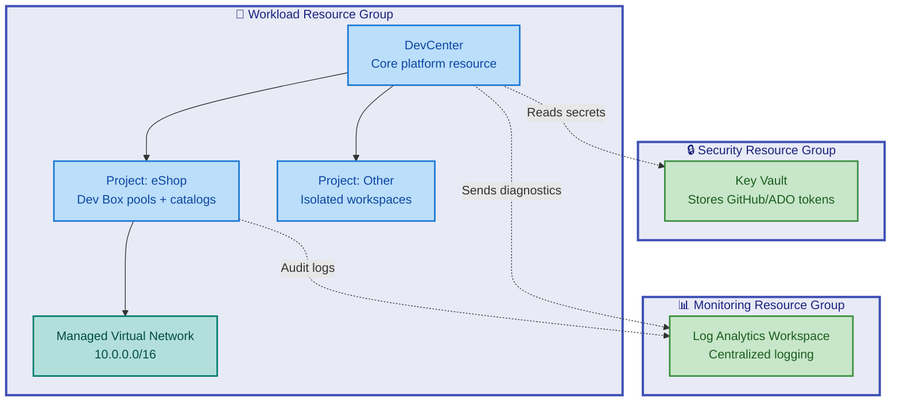

# Azure Dev Box Accelerator

[](https://azure.microsoft.com)
[](https://learn.microsoft.com/azure/azure-resource-manager/bicep/)
[](https://opensource.org/licenses/MIT)
[](CONTRIBUTING.md)

An Infrastructure-as-Code (IaC) accelerator that streamlines the deployment and
configuration of Azure DevCenter with Microsoft Dev Box, enabling enterprise
teams to provision standardized, cloud-based developer workstations in minutes.

---

## Table of Contents

- [Overview](#overview)
- [Architecture](#architecture)
- [Features](#features)
- [Prerequisites](#prerequisites)
- [Configuration](#configuration)
- [Quick Start](#quick-start)
- [Deployment](#deployment)
- [Usage](#usage)
- [Project Structure](#project-structure)
- [Contributing](#contributing)
- [License](#license)

---

## Overview

**Why This Matters**: Setting up Azure DevCenter manually involves navigating
complex portal UIs, managing RBAC permissions across multiple resource groups,
configuring virtual networks, and coordinating secrets management—a process that
typically takes 4-8 hours per environment. This accelerator reduces that to
10-15 minutes with declarative configuration and automated deployment.

**How It Works**: The accelerator uses Azure Developer CLI (`azd`) to
orchestrate Bicep infrastructure modules that deploy and configure Azure
DevCenter resources. All configurations—from network topology to RBAC
policies—are defined in human-readable YAML files following Azure Landing Zone
principles. Setup scripts (`setUp.ps1`/`setUp.sh`) handle authentication with
GitHub or Azure DevOps, provision Key Vault secrets, and initialize the `azd`
environment. The modular Bicep templates deploy resources in a structured
hierarchy: security (Key Vault), monitoring (Log Analytics), and workload
(DevCenter + projects).

**What You Get**: A production-ready DevCenter deployment with:

- Centralized developer platform with role-based project isolation
- Managed virtual networks with customizable subnets
- Integrated monitoring via Log Analytics
- Secure secret storage in Azure Key Vault
- Automated RBAC configuration for Platform Engineering and Dev Manager roles
- Support for multiple projects (e.g., eShop) with independent Dev Box pools
- Configuration-as-code for repeatable deployments across environments (dev,
  staging, UAT)

**Target Audience**: Platform engineering teams, DevOps architects, and IT
administrators managing developer infrastructure at scale. Ideal for
organizations adopting Microsoft Dev Box or modernizing developer workspace
provisioning.

---

## Architecture

**Overview**

The system follows Azure Landing Zone design principles with clear separation of
concerns across three resource groups: security, monitoring, and workload.
Resources are deployed at subscription scope with managed identities for secure
inter-service communication.



**Component Roles**:

- **DevCenter**: Central governance hub that defines environment types (dev,
  staging, UAT) and manages catalogs containing reusable Dev Box configurations
- **Projects**: Isolated namespaces for teams with dedicated Dev Box pools,
  network attachments, and RBAC policies
- **Key Vault**: Secure storage for GitHub/Azure DevOps personal access tokens
  used by Dev Box image builds
- **Log Analytics**: Centralized sink for diagnostic logs, audit trails, and
  monitoring data
- **Managed Virtual Network**: Private network infrastructure with subnet
  delegation for Dev Box instances

> ⚠️ **Note**: Network connections require ~15 minutes to provision due to
> Azure's asynchronous backend operations. Plan accordingly when deploying to
> new environments.

---

## Features

**Overview**

This accelerator provides eight core capabilities that eliminate manual
DevCenter setup and reduce configuration errors through declarative
infrastructure.

**Tier 1 (Why This Matters)**: Manual DevCenter deployment is error-prone and
time-consuming, requiring coordination across Azure Portal, CLI commands, and
RBAC configuration. This solution codifies best practices into reusable
templates that ensure consistency across environments while reducing deployment
time by 90%.

**Tier 2 (How It Works)**: Uses modular Bicep templates combined with
YAML-defined policies to generate Azure Resource Manager deployments. The `azd`
CLI orchestrates execution order, while PowerShell/Bash scripts handle
pre-provisioning tasks like authentication and secret injection.

| Feature                             | Description                                                                                      | Status    |
| ----------------------------------- | ------------------------------------------------------------------------------------------------ | --------- |
| **Automated Deployment**            | One-command deployment via `azd up` with automatic resource dependency resolution                | ✅ Stable |
| **Landing Zone Organization**       | Separates security, monitoring, and workload resources into distinct resource groups             | ✅ Stable |
| **YAML Configuration**              | Human-readable config files for DevCenter projects, networks, catalogs, and RBAC                 | ✅ Stable |
| **Multi-Project Support**           | Deploy multiple isolated projects (e.g., eShop, InternalTools) with independent configurations   | ✅ Stable |
| **GitHub/Azure DevOps Integration** | Setup scripts authenticate and store tokens in Key Vault for catalog and task integration        | ✅ Stable |
| **Managed Network Creation**        | Automated VNet provisioning with configurable address spaces and subnet delegation               | ✅ Stable |
| **Role-Based Access Control**       | Pre-configured RBAC for Platform Engineering and Dev Manager roles with least privilege policies | ✅ Stable |
| **Environment Type Configuration**  | Define deployment targets (dev, staging, UAT) for application environment management             | ✅ Stable |
| **Diagnostic Logging**              | Integrated Log Analytics for DevCenter audit logs and operational telemetry                      | ✅ Stable |
| **Custom Task Catalogs**            | Support for public/private GitHub repositories containing Dev Box configuration tasks            | ✅ Stable |
| **Cross-Platform Setup Scripts**    | PowerShell (Windows) and Bash (Linux/macOS) scripts with identical functionality                 | ✅ Stable |
| **Idempotent Deployments**          | Safe to re-run deployments; updates existing resources without duplication                       | ✅ Stable |

> 💡 **Tip**: Start with the default `devcenter.yaml` configuration and
> customize incrementally. The schema validation (`devcenter.schema.json`)
> provides IntelliSense in VS Code.

---

## Prerequisites

**Overview**

This section lists all tools, permissions, and Azure resources required before
running the deployment. Missing prerequisites will cause deployment failures, so
verify each item before proceeding.

**Tier 1 (Why This Matters)**: Azure DevCenter requires specific RBAC
permissions and CLI tools that many users don't have by default. Identifying
missing prerequisites early prevents mid-deployment failures that leave
resources in inconsistent states.

**Tier 2 (How It Works)**: The setup scripts perform automatic prerequisite
checks before deployment. If checks fail, the scripts output specific
remediation commands (e.g., `az login`, `gh auth login`) to resolve issues.

| Requirement                          | Purpose                                                          | Installation                                                                                                               |
| ------------------------------------ | ---------------------------------------------------------------- | -------------------------------------------------------------------------------------------------------------------------- |
| **Azure CLI** (≥2.55.0)              | Azure resource management and authentication                     | [Install Guide](https://learn.microsoft.com/cli/azure/install-azure-cli)                                                   |
| **Azure Developer CLI** (≥1.5.0)     | Orchestrates infrastructure provisioning                         | [Install Guide](https://learn.microsoft.com/azure/developer/azure-developer-cli/install-azd)                               |
| **GitHub CLI** (if using GitHub)     | Authenticates and retrieves personal access tokens               | [Install Guide](https://cli.github.com/)                                                                                   |
| **PowerShell 7+** or **Bash 4+**     | Executes setup scripts                                           | Included in Windows 10+/macOS/Linux                                                                                        |
| **Azure Subscription**               | Target for resource deployment                                   | [Create free account](https://azure.microsoft.com/free/)                                                                   |
| **Azure Permissions**                | Minimum: Contributor + User Access Administrator on subscription | [RBAC documentation](https://learn.microsoft.com/azure/role-based-access-control/overview)                                 |
| **GitHub/ADO Personal Access Token** | Catalog repository access                                        | [GitHub PAT](https://docs.github.com/authentication/keeping-your-account-and-data-secure/creating-a-personal-access-token) |

> ⚠️ **Warning**: The deployment requires **Contributor** and **User Access
> Administrator** roles at the subscription level. If you lack these
> permissions, contact your Azure administrator before proceeding. Insufficient
> permissions will cause silent failures in RBAC assignments.

**Verification Commands**:

```bash
# Check Azure CLI version
az --version

# Check Azure Developer CLI version
azd version

# Verify GitHub authentication (if using GitHub)
gh auth status

# Check Azure login status
az account show

# List available subscriptions
az account list --output table
```

**Expected Output**:

```plaintext
✅ Azure CLI version 2.55.0 or higher
✅ azd version 1.5.0 or higher
✅ Logged in to Azure as user@example.com
✅ Default subscription: "Production Subscription" (12345678-1234-1234-1234-123456789012)
```

---

## Configuration

**Overview**

All deployment behavior is controlled through YAML configuration files stored in
`infra/settings/`. These files define resource names, network topology, RBAC
policies, and project structure. The Bicep templates consume these
configurations at deployment time, eliminating hardcoded values.

**Tier 1 (Why This Matters)**: Configuration-as-code enables versioning, code
review, and environment promotion (dev → staging → prod) without manual portal
modifications. Changes are auditable, repeatable, and protected by Git
workflows.

**Tier 2 (How It Works)**: Bicep's `loadYamlContent()` function reads YAML files
during compilation, merging configurations into template parameters. JSON
schemas (`*.schema.json`) provide validation and IntelliSense in compatible
editors like VS Code.

### Key Configuration Files

#### 1. `infra/settings/workload/devcenter.yaml`

Defines the DevCenter resource, projects, catalogs, environment types, and RBAC
assignments.

**Example Configuration**:

```yaml
# DevCenter core settings
name: 'devexp-devcenter'
catalogItemSyncEnableStatus: 'Enabled'
microsoftHostedNetworkEnableStatus: 'Enabled'
installAzureMonitorAgentEnableStatus: 'Enabled'

# Projects define isolated workspaces for teams
projects:
  - name: 'eShop'
    description: 'eCommerce platform development'

    # Network configuration for Dev Box instances
    network:
      name: eShop
      create: true
      resourceGroupName: 'eShop-connectivity-RG'
      virtualNetworkType: Managed
      addressPrefixes:
        - 10.0.0.0/16
      subnets:
        - name: default
          addressPrefix: 10.0.1.0/24

    # Dev Box pool definitions
    devboxDefinitions:
      - name: 'eShop-DevBox'
        imageReference: 'microsoftvisualstudio_visualstudioplustools_vs-2022-ent-general-win11-m365-gen2'
        sku: 'general_i_8c32gb256ssd_v2'
        hibernateSupport: 'Enabled'

    # Environment types for application deployment
    projectEnvironmentTypes:
      - name: 'dev'
        status: 'Enabled'
```

#### 2. `infra/settings/resourceOrganization/azureResources.yaml`

Defines resource group structure following Azure Landing Zone principles.

```yaml
# Workload Resource Group
workload:
  create: true
  name: devexp-workload
  tags:
    environment: dev
    division: Platforms
    team: DevExP
    project: Contoso-DevExp-DevBox

# Security Resource Group
security:
  create: true
  name: devexp-security
  tags:
    environment: dev
    landingZone: Security

# Monitoring Resource Group
monitoring:
  create: true
  name: devexp-monitoring
  tags:
    environment: dev
    landingZone: Monitoring
```

#### 3. `infra/settings/security/security.yaml`

Configures Key Vault settings and secret management.

```yaml
keyVault:
  name: 'devexp-kv'
  sku: 'standard'
  enableRbacAuthorization: true
  enabledForDeployment: true
  enabledForTemplateDeployment: true

secrets:
  - name: 'github-token'
    description: 'GitHub PAT for catalog access'
```

### Environment Variables

The `azd` CLI uses environment variables to inject dynamic values at deployment
time. These are set by the setup scripts or manually via `azd env set`.

| Variable                  | Purpose                                    | Example Value                          |
| ------------------------- | ------------------------------------------ | -------------------------------------- |
| `AZURE_ENV_NAME`          | Environment name (dev, staging, prod)      | `dev`                                  |
| `AZURE_LOCATION`          | Azure region for deployment                | `eastus`                               |
| `AZURE_SUBSCRIPTION_ID`   | Target subscription ID                     | `12345678-1234-1234-1234-123456789012` |
| `SOURCE_CONTROL_PLATFORM` | GitHub or Azure DevOps                     | `github` or `adogit`                   |
| `GITHUB_TOKEN`            | GitHub personal access token (if using GH) | `ghp_xxxxxxxxxxxxxxxxxxxx`             |

**Set Environment Variables**:

```bash
# Using azd CLI
azd env set AZURE_LOCATION eastus
azd env set SOURCE_CONTROL_PLATFORM github

# Or export directly (Bash)
export AZURE_LOCATION="eastus"
export SOURCE_CONTROL_PLATFORM="github"
```

> 💡 **Tip**: Use `azd env list` to view all configured environment variables.
> Values are stored in `.azure/<env-name>/.env` and excluded from Git by
> default.

---

## Quick Start

Get up and running with a default DevCenter deployment in under 15 minutes.

### 1. Clone the Repository

```bash
git clone https://github.com/Evilazaro/DevExp-DevBox.git
cd DevExp-DevBox
```

### 2. Run Setup Script

**Windows (PowerShell)**:

```powershell
.\setUp.ps1 -EnvName "dev" -SourceControl "github"
```

**Linux/macOS (Bash)**:

```bash
./setUp.sh -e "dev" -s "github"
```

### 3. Authenticate and Deploy

The setup script will prompt for:

- Azure authentication (`az login`)
- GitHub authentication (`gh auth login`)
- Azure subscription selection

Then it automatically runs:

```bash
azd up
```

### Expected Output

```plaintext
✅ Azure environment initialized: dev
✅ GitHub token stored in Key Vault
✅ Provisioning resources (this takes ~15 minutes)...

Deployment Summary:
├─ Resource Group: devexp-security-dev-eastus-RG
│  └─ Key Vault: devexp-kv-dev
├─ Resource Group: devexp-monitoring-dev-eastus-RG
│  └─ Log Analytics: logAnalytics
└─ Resource Group: devexp-workload-dev-eastus-RG
   ├─ DevCenter: devexp-devcenter
   └─ Project: eShop
      └─ Dev Box Pool: eShop-DevBox

✅ Deployment complete!

Next Steps:
1. Navigate to https://portal.azure.com/#view/Microsoft_Azure_DevCenter
2. Open project "eShop"
3. Create your first Dev Box
```

---

## Deployment

**Overview**

This section provides step-by-step instructions for deploying the Azure
DevCenter infrastructure, including pre-deployment validation, deployment
execution, and post-deployment verification.

**Tier 1 (Why This Matters)**: Proper deployment sequencing ensures that
dependent resources (e.g., Key Vault before DevCenter) are created in the
correct order. Following these steps prevents partial deployments that require
manual cleanup.

**Tier 2 (How It Works)**: The `azd` CLI reads `azure.yaml` to determine the
deployment workflow: pre-provision hooks → Bicep deployment → post-provision
hooks. The hooks execute platform-specific scripts (`setUp.ps1` for Windows,
`setUp.sh` for Linux/macOS) that handle authentication and environment setup.

### Step 1: Customize Configuration (Optional)

Edit YAML files in `infra/settings/` to match your organizational requirements:

```bash
# Example: Change DevCenter name
vim infra/settings/workload/devcenter.yaml

# Modify this line:
name: "devexp-devcenter"  # Change to "contoso-devcenter"
```

**Files You May Want to Customize**:

- `devcenter.yaml`: DevCenter name, projects, Dev Box pools
- `azureResources.yaml`: Resource group names and tags
- `security.yaml`: Key Vault name and secret configurations

### Step 2: Initialize Azure Environment

Create a new isolated environment (this creates `.azure/<env-name>/` directory):

```bash
azd env new <environment-name>

# Example:
azd env new production
```

### Step 3: Set Required Parameters

```bash
# Set Azure region
azd env set AZURE_LOCATION eastus2

# Set source control platform
azd env set SOURCE_CONTROL_PLATFORM github

# (Optional) Set custom subscription
azd env set AZURE_SUBSCRIPTION_ID "your-subscription-id"
```

### Step 4: Authenticate

**Azure Authentication**:

```bash
az login
az account set --subscription "<your-subscription-id>"
```

**GitHub Authentication** (if using GitHub catalogs):

```bash
gh auth login
```

### Step 5: Deploy Infrastructure

Run the unified deployment command:

```bash
azd up
```

> ⚠️ **Warning**: First-time deployments take 15-20 minutes due to network
> connection provisioning. Do not interrupt the process or resources may be left
> in an incomplete state.

**What `azd up` Does**:

1. Runs `preprovision` hook (`setUp.ps1`/`setUp.sh`)
   - Validates prerequisites
   - Retrieves GitHub/ADO token
   - Stores token in Key Vault
2. Executes Bicep deployment (`infra/main.bicep`)
   - Creates resource groups
   - Provisions DevCenter and projects
   - Configures RBAC and network
3. Outputs deployment summary

### Step 6: Verify Deployment

**Check Azure Portal**:

1. Navigate to
   [Azure Portal → DevCenter](https://portal.azure.com/#view/Microsoft_Azure_DevCenter)
2. Verify DevCenter resource exists
3. Open Projects blade and confirm projects are listed

**Check via Azure CLI**:

```bash
# List DevCenter resources
az devcenter admin devcenter list --output table

# Get DevCenter details
az devcenter admin devcenter show \
  --name "devexp-devcenter" \
  --resource-group "devexp-workload-dev-eastus-RG"

# List projects
az devcenter admin project list \
  --resource-group "devexp-workload-dev-eastus-RG" \
  --output table
```

**Expected Output**:

```plaintext
Name                 ResourceGroup                      Location    ProvisioningState
-------------------  ---------------------------------  ----------  -------------------
devexp-devcenter     devexp-workload-dev-eastus-RG     eastus      Succeeded
```

### Step 7: Create Your First Dev Box

1. Navigate to [Developer Portal](https://devportal.microsoft.com)
2. Select project "eShop"
3. Click "New" → "New Dev Box"
4. Choose pool: `eShop-DevBox`
5. Wait 20-30 minutes for provisioning

---

## Usage

After deployment completes, DevCenter supports these common workflows:

### Creating Dev Boxes for Developers

**Via Developer Portal** (recommended for end users):

1. Navigate to https://devportal.microsoft.com
2. Sign in with Azure AD credentials
3. Select your assigned project
4. Click "New Dev Box" and choose a pool
5. Access via browser or Remote Desktop

**Via Azure CLI** (for automation):

```bash
# Create Dev Box
az devcenter dev dev-box create \
  --name "developer1-devbox" \
  --pool-name "eShop-DevBox" \
  --project-name "eShop" \
  --endpoint "https://eastus-0.devportal.microsoft.com"

# List user's Dev Boxes
az devcenter dev dev-box list \
  --project-name "eShop" \
  --endpoint "https://eastus-0.devportal.microsoft.com"

# Stop Dev Box (to save costs)
az devcenter dev dev-box stop \
  --name "developer1-devbox" \
  --project-name "eShop" \
  --endpoint "https://eastus-0.devportal.microsoft.com"
```

### Managing Projects

**Add a New Project**:

1. Edit `infra/settings/workload/devcenter.yaml`
2. Add to `projects` array:

```yaml
projects:
  - name: 'NewProject'
    description: 'New team workspace'
    network:
      name: NewProject
      create: true
      addressPrefixes:
        - 10.1.0.0/16
    devboxDefinitions:
      - name: 'Standard-DevBox'
        imageReference: 'microsoftvisualstudio_visualstudioplustools_vs-2022-ent-general-win11-m365-gen2'
        sku: 'general_i_8c32gb256ssd_v2'
```

3. Redeploy:

```bash
azd deploy
```

### Updating Configuration

**Modify Network Settings**:

```bash
# Edit network configuration
vim infra/settings/workload/devcenter.yaml

# Find the network section and update address space
# Then redeploy
azd deploy
```

**Add/Remove Catalogs**:

```yaml
# In devcenter.yaml, add to catalogs array:
catalogs:
  - name: 'company-private-catalog'
    type: gitHub
    visibility: private
    uri: 'https://github.com/your-org/devcenter-catalog.git'
    branch: 'main'
    path: './Tasks'
```

### Monitoring and Troubleshooting

**View Logs in Log Analytics**:

1. Navigate to Azure Portal → Log Analytics Workspace → Logs
2. Run KQL query:

```kql
// DevCenter diagnostic logs
AzureDiagnostics
| where ResourceProvider == "MICROSOFT.DEVCENTER"
| where TimeGenerated > ago(24h)
| order by TimeGenerated desc
```

**Common Issues**:

| Issue                                  | Cause                         | Solution                                               |
| -------------------------------------- | ----------------------------- | ------------------------------------------------------ |
| "Network connection failed"            | VNet provisioning incomplete  | Wait 15 minutes, check portal for completion status    |
| "Insufficient RBAC permissions"        | Missing Contributor/UAA roles | Run `az role assignment create` with required roles    |
| "Catalog sync failed"                  | Invalid GitHub token          | Update Key Vault secret with fresh PAT                 |
| "Dev Box creation stuck in 'Creating'" | Image not available in region | Check `az devcenter admin image list` for availability |

> 💡 **Tip**: Enable verbose logging with `$env:AZURE_DEBUG = "true"`
> (PowerShell) or `export AZURE_DEBUG=true` (Bash) before running `azd` commands
> for detailed diagnostic output.

---

## Project Structure

```plaintext
.
├── azure.yaml                   # Azure Developer CLI configuration
├── azure-pwh.yaml               # Alternative azd config for PowerShell
├── setUp.ps1                    # Windows setup script (PowerShell)
├── setUp.sh                     # Linux/macOS setup script (Bash)
├── cleanSetUp.ps1               # Cleanup script for environment reset
├── infra/                       # Infrastructure-as-Code definitions
│   ├── main.bicep               # Root Bicep template (subscription scope)
│   ├── main.parameters.json     # Global deployment parameters
│   └── settings/                # YAML configuration files
│       ├── resourceOrganization/
│       │   ├── azureResources.yaml        # Resource group definitions
│       │   └── azureResources.schema.json # JSON schema for validation
│       ├── security/
│       │   ├── security.yaml              # Key Vault configuration
│       │   └── security.schema.json       # JSON schema validation
│       └── workload/
│           ├── devcenter.yaml             # DevCenter project configs
│           └── devcenter.schema.json      # JSON schema validation
├── src/                         # Modular Bicep templates
│   ├── connectivity/            # Network resources
│   │   ├── connectivity.bicep
│   │   ├── networkConnection.bicep
│   │   ├── resourceGroup.bicep
│   │   └── vnet.bicep
│   ├── identity/                # RBAC and identity modules
│   │   ├── devCenterRoleAssignment.bicep
│   │   ├── keyVaultAccess.bicep
│   │   ├── orgRoleAssignment.bicep
│   │   └── projectIdentityRoleAssignment.bicep
│   ├── management/              # Monitoring resources
│   │   └── logAnalytics.bicep
│   ├── security/                # Security resources
│   │   ├── keyVault.bicep
│   │   ├── secret.bicep
│   │   └── security.bicep
│   └── workload/                # DevCenter components
│       ├── workload.bicep
│       ├── core/
│       │   ├── catalog.bicep
│       │   ├── devCenter.bicep
│       │   └── environmentType.bicep
│       └── project/
│           ├── project.bicep
│           ├── projectCatalog.bicep
│           ├── projectEnvironmentType.bicep
│           └── projectPool.bicep
└── LICENSE                      # MIT License
```

> 📌 **Note**: The `prompts/` directory contains documentation generator scripts
> and is not deployed to Azure. It's excluded from scope per the accelerator's
> focus on infrastructure code.

---

## Contributing

We welcome contributions to improve the Azure Dev Box Accelerator! Whether
you're fixing bugs, adding features, or improving documentation, your input is
valuable.

**Overview**: This project follows standard open-source contribution practices
with pull request workflows, code review, and automated validation.
Contributions are governed by the MIT License.

### How to Contribute

1. **Fork the Repository**

```bash
# Clone your fork
git clone https://github.com/<your-username>/DevExp-DevBox.git
cd DevExp-DevBox
```

2. **Create a Feature Branch**

```bash
git checkout -b feature/your-feature-name
```

3. **Make Your Changes**

- Add tests if applicable
- Update documentation in README.md or inline comments
- Validate Bicep syntax:

```bash
az bicep build --file infra/main.bicep
```

4. **Test Your Changes**

```bash
# Deploy to a test environment
azd env new test-pr-123
azd up
```

5. **Commit with Descriptive Messages**

```bash
git commit -m "feat: Add support for private DevCenter catalogs"
```

**Commit Message Format**:

- `feat:` New features
- `fix:` Bug fixes
- `docs:` Documentation updates
- `refactor:` Code restructuring without behavior changes
- `test:` Adding or updating tests

6. **Push and Create Pull Request**

```bash
git push origin feature/your-feature-name
```

Then open a pull request on GitHub with:

- Clear description of changes
- Link to related issues (if any)
- Screenshots or logs demonstrating the change (if applicable)

### Code Style Guidelines

- **Bicep**: Use descriptive parameter names with `@description()` decorators
- **PowerShell**: Follow `Verb-Noun` cmdlet naming convention
- **Bash**: Use `shellcheck` to validate scripts
- **YAML**: Maintain 2-space indentation

### Reporting Issues

Found a bug or have a feature request?
[Open an issue](https://github.com/Evilazaro/DevExp-DevBox/issues) with:

- Clear title describing the issue
- Steps to reproduce (for bugs)
- Expected vs actual behavior
- Environment details (Azure CLI version, OS, region)

> 💡 **Tip**: Check
> [existing issues](https://github.com/Evilazaro/DevExp-DevBox/issues) before
> creating duplicates. Use labels like `bug`, `enhancement`, or `documentation`
> to help categorize.

---

## License

This project is licensed under the **MIT License**.

```plaintext
MIT License

Copyright (c) 2025 Evilázaro Alves

Permission is hereby granted, free of charge, to any person obtaining a copy
of this software and associated documentation files (the "Software"), to deal
in the Software without restriction, including without limitation the rights
to use, copy, modify, merge, publish, distribute, sublicense, and/or sell
copies of the Software, and to permit persons to whom the Software is
furnished to do so, subject to the following conditions:

The above copyright notice and this permission notice shall be included in all
copies or substantial portions of the Software.

THE SOFTWARE IS PROVIDED "AS IS", WITHOUT WARRANTY OF ANY KIND, EXPRESS OR
IMPLIED, INCLUDING BUT NOT LIMITED TO THE WARRANTIES OF MERCHANTABILITY,
FITNESS FOR A PARTICULAR PURPOSE AND NONINFRINGEMENT. IN NO EVENT SHALL THE
AUTHORS OR COPYRIGHT HOLDERS BE LIABLE FOR ANY CLAIM, DAMAGES OR OTHER
LIABILITY, WHETHER IN AN ACTION OF CONTRACT, TORT OR OTHERWISE, ARISING FROM,
OUT OF OR IN CONNECTION WITH THE SOFTWARE OR THE USE OR IN DEALINGS IN THE
SOFTWARE.
```

See [LICENSE](LICENSE) file for full details.

---

**Built with ❤️ for Platform Engineering teams**
