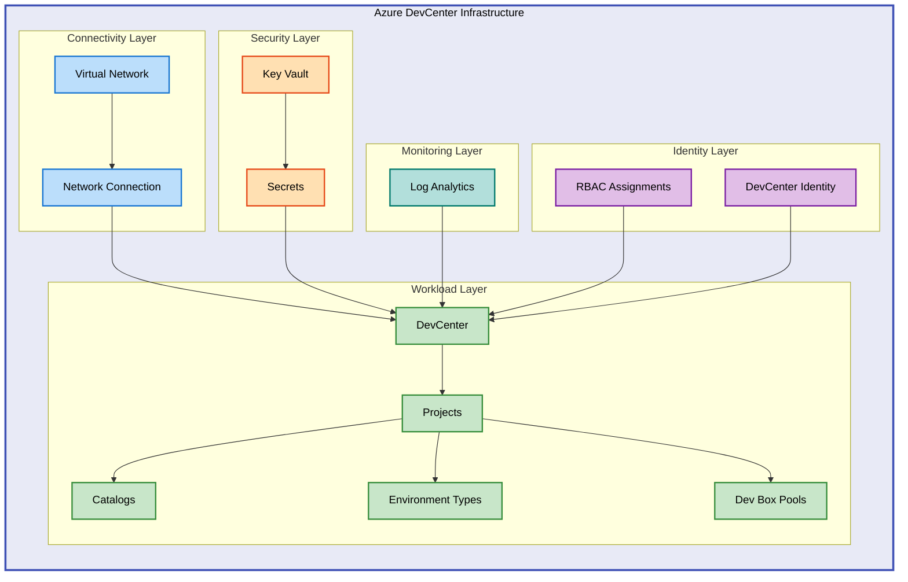

# DevExp-DevBox


Infrastructure as Code (IaC) solution for deploying Azure DevCenter with Dev Box
environments using Bicep templates and Azure Developer CLI.

## 📋 Table of Contents

- [Architecture](#-architecture)
- [Quick Start](#-quick-start)
- [Prerequisites](#-prerequisites)
- [Deployment](#-deployment)
- [Configuration](#-configuration)
- [Usage](#-usage)
- [Project Structure](#-project-structure)
- [Contributing](#-contributing)
- [License](#-license)

## 🏗 Architecture

The DevExp-DevBox solution deploys a complete Azure DevCenter infrastructure
with modular Bicep templates organized by Azure Landing Zone principles.



## 🚀 Quick Start

Deploy the DevCenter infrastructure using Azure Developer CLI:

```bash
azd init
azd auth login
azd up
```

> 💡 **Tip**: Use `azd up` for a complete deployment including provisioning and
> configuration in a single command.

## ⚙ Prerequisites

Before deploying, ensure you have the following installed and configured:

- **Azure CLI** (2.50.0+):
  [Installation guide](https://learn.microsoft.com/en-us/cli/azure/install-azure-cli)
- **Azure Developer CLI** (azd):
  [Installation guide](https://learn.microsoft.com/en-us/azure/developer/azure-developer-cli/install-azd)
- **GitHub CLI** (gh): Required for GitHub integration
- **jq**: JSON processor for bash scripts
- **Valid Azure subscription** with appropriate permissions

> ⚠️ **Prerequisites**: You must have Contributor and User Access Administrator
> roles at the subscription level to deploy this solution.

## 📦 Deployment

Follow these steps to deploy the Azure DevCenter infrastructure:

### 1. Clone the Repository

```bash
git clone https://github.com/Evilazaro/DevExp-DevBox.git
cd DevExp-DevBox
```

### 2. Initialize Azure Developer CLI

```bash
azd init
```

This command creates a new azd environment and prompts for:

- Environment name (e.g., `dev`, `test`, `prod`)
- Azure subscription
- Azure region

### 3. Authenticate with Azure

```bash
azd auth login
```

### 4. Configure Environment

Set required environment variables:

```bash
export SOURCE_CONTROL_PLATFORM="github"
export AZURE_ENV_NAME="dev"
```

> 💡 **Tip**: For Windows PowerShell, use
> `$env:SOURCE_CONTROL_PLATFORM="github"` instead of `export`.

### 5. Deploy Infrastructure

Execute the deployment:

```bash
azd up
```

This command:

- Runs pre-provisioning hooks ([`setUp.sh`](setUp.sh) or
  [`setUp.ps1`](setUp.ps1))
- Provisions Azure resources using Bicep templates
- Configures DevCenter projects and catalogs
- Sets up network connectivity and security

### 6. Verify Deployment

Check deployment outputs:

```bash
azd env get-values
```

Expected outputs include:

- `AZURE_DEV_CENTER_NAME`: Name of the deployed DevCenter
- `AZURE_KEY_VAULT_NAME`: Name of the Key Vault
- `AZURE_DEV_CENTER_PROJECTS`: Array of project names

## 🔧 Configuration

The solution uses YAML configuration files for declarative infrastructure
management.

### Resource Organization

Configure resource groups in
[`infra/settings/resourceOrganization/azureResources.yaml`](infra/settings/resourceOrganization/azureResources.yaml):

```yaml
workload:
  create: true
  name: devexp-workload
  tags:
    environment: dev
    division: Platforms
    team: DevExP
```

### DevCenter Settings

Configure DevCenter properties in
[`infra/settings/workload/devcenter.yaml`](infra/settings/workload/devcenter.yaml):

```yaml
name: 'devexp-devcenter'
catalogItemSyncEnableStatus: 'Enabled'
microsoftHostedNetworkEnableStatus: 'Enabled'
installAzureMonitorAgentEnableStatus: 'Enabled'
```

### Security Configuration

Configure security policies in
[`infra/settings/security/security.yaml`](infra/settings/security/security.yaml):

```yaml
keyVault:
  sku: standard
  enableRbacAuthorization: true
  enableSoftDelete: true
  softDeleteRetentionInDays: 90
```

> ℹ️ **Important Note**: All configuration files follow JSON schema validation.
> Refer to the corresponding `*.schema.json` files for valid property
> definitions.

## 💻 Usage

### Deploy to a New Environment

Create and deploy to a new environment (e.g., `prod`):

```bash
azd env new prod
azd env select prod
azd up
```

### Update Existing Deployment

Modify configuration files and redeploy:

```bash
azd deploy
```

### Clean Up Resources

Remove all deployed resources:

```bash
azd down
```

> ⚠️ **Warning**: The `azd down` command deletes all resources in the resource
> groups. This action cannot be undone. Ensure you have backups of any data
> before proceeding.

### Access DevCenter Portal

Navigate to the Azure Portal to access your DevCenter:

```bash
az devbox dev-center show \
  --name $(azd env get-values | grep AZURE_DEV_CENTER_NAME | cut -d '=' -f2) \
  --resource-group $(azd env get-values | grep WORKLOAD_AZURE_RESOURCE_GROUP_NAME | cut -d '=' -f2)
```

## 📂 Project Structure

The repository is organized using Azure Landing Zone principles:

```
DevExp-DevBox/
├── infra/                          # Infrastructure as Code
│   ├── main.bicep                  # Main deployment orchestrator
│   ├── main.parameters.json        # Parameter file template
│   └── settings/                   # Configuration files
│       ├── resourceOrganization/   # Resource group configs
│       ├── security/               # Security configs
│       └── workload/               # DevCenter configs
├── src/                            # Bicep modules
│   ├── connectivity/               # Network resources
│   ├── identity/                   # RBAC and identity
│   ├── management/                 # Monitoring resources
│   ├── security/                   # Key Vault resources
│   └── workload/                   # DevCenter resources
│       ├── core/                   # Core DevCenter modules
│       └── project/                # Project-specific modules
├── setUp.sh                        # Linux/macOS setup script
├── setUp.ps1                       # Windows PowerShell setup
├── azure.yaml                      # Azure Developer CLI config
└── package.json                    # Node.js dependencies
```

### Key Files

- [`infra/main.bicep`](infra/main.bicep): Main orchestrator deploying resource
  groups and modules
- [`src/workload/workload.bicep`](src/workload/workload.bicep): DevCenter
  workload deployment
- [`src/security/security.bicep`](src/security/security.bicep): Key Vault and
  secrets management
- [`setUp.sh`](setUp.sh) / [`setUp.ps1`](setUp.ps1): Pre-provisioning automation
  scripts

## 🤝 Contributing

Contributions are welcome! Please follow these guidelines:

1. **Fork the repository** and create a feature branch
2. **Follow Bicep best practices** and Azure naming conventions
3. **Update configuration schemas** when adding new properties
4. **Test deployments** in a non-production environment
5. **Submit a pull request** with a clear description

For detailed contribution guidelines, see the
[Microsoft Dev Box Accelerator documentation](https://evilazaro.github.io/DevExp-DevBox/).

## 📝 License

This project is licensed under the MIT License. See the [LICENSE](LICENSE) file
for details.

Copyright (c) 2025 Evilázaro Alves
