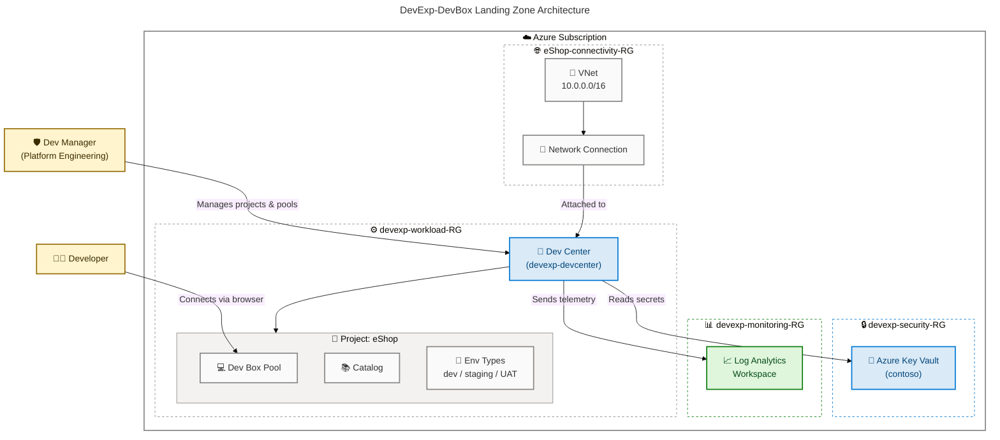

# DevExp-DevBox

[](./LICENSE)
[](https://azure.microsoft.com)
[](https://learn.microsoft.com/en-us/azure/azure-resource-manager/bicep/overview)
[](https://learn.microsoft.com/en-us/azure/developer/azure-developer-cli/overview)
[](https://learn.microsoft.com/en-us/powershell/)

**Dev Box Adoption & Deployment Accelerator** — an Infrastructure as Code solution built with Azure Bicep and the Azure Developer CLI (`azd`) that provisions a fully configured [Microsoft Dev Box](https://learn.microsoft.com/en-us/azure/dev-box/overview-what-is-microsoft-dev-box) landing zone, complete with Dev Centers, projects, network isolation, Key Vault secrets management, and centralized monitoring.

## Table of Contents

- [Overview](#overview)
- [Architecture](#️-architecture)
- [Features](#-features)
- [Requirements](#-requirements)
- [Quick Start](#-quick-start)
- [Deployment](#-deployment)
- [Usage](#-usage)
- [Configuration](#-configuration)
- [Project Structure](#project-structure)
- [Contributing](#-contributing)
- [License](#license)

## Overview

**Overview**

> 💡 **Why This Matters**: DevExp-DevBox eliminates weeks of manual Azure setup by providing a fully validated, production-ready Dev Box landing zone that teams can deploy in minutes. It enforces Azure Landing Zone best practices by default, so every environment is secure, observable, and consistently configured from day one.

> 📌 **How It Works**: The accelerator uses Azure Bicep modules driven by versioned YAML configuration files. The Azure Developer CLI (`azd`) orchestrates provisioning across three dedicated resource groups — workload, security, and monitoring — while setup scripts handle GitHub and Azure DevOps integration automatically.

DevExp-DevBox is an Infrastructure as Code accelerator purpose-built for teams adopting [Microsoft Dev Box](https://learn.microsoft.com/en-us/azure/dev-box/overview-what-is-microsoft-dev-box). It codifies the full Azure Dev Center topology — Dev Centers, projects, Dev Box pools, environment types, catalogs, and network connections — into reusable, parameterized Bicep modules with no hard-coded environment values.

The solution follows [Azure Landing Zone](https://learn.microsoft.com/en-us/azure/cloud-adoption-framework/ready/landing-zone/) principles to enforce separation of concerns across resource groups, apply least-privilege RBAC role assignments, and integrate centralized monitoring and secret management out of the box.

> 📖 Full documentation: [evilazaro.github.io/DevExp-DevBox](https://evilazaro.github.io/DevExp-DevBox)

## 🏗️ Architecture

**Overview**

> 💡 **Why This Matters**: Understanding the architecture helps teams plan their Azure subscription layout, network topology, and identity model before deploying. The landing zone design ensures that security resources are isolated from workload resources and that monitoring spans all components.

> 📌 **How It Works**: Resources are organized into four resource groups aligned to distinct concerns — workload, security, monitoring, and per-project connectivity. The Dev Center acts as the central control plane, consuming secrets from Key Vault, emitting telemetry to Log Analytics, and attaching to project-specific VNets via Network Connections.



### Resource Group Layout

| Resource Group | Purpose | Key Resources |
|---|---|---|
| `devexp-workload-<env>-<region>-RG` | Dev Center workloads | Dev Center, Projects, Pools, Catalogs |
| `devexp-security-<env>-<region>-RG` | Secrets & key management | Azure Key Vault |
| `devexp-monitoring-<env>-<region>-RG` | Observability | Log Analytics Workspace |
| `<project>-connectivity-RG` | Per-project networking | VNet, Network Connection |

## ✨ Features

**Overview**

> 💡 **Why This Matters**: Each feature directly reduces the time and risk of adopting Dev Box at scale. Rather than assembling individual Azure services by hand, teams get a pre-integrated, validated platform that covers identity, networking, observability, and secrets management in a single deployment.

> 📌 **How It Works**: Features are implemented as independent, composable Bicep modules under `src/`. Every module is parameterized via YAML configuration files, making it straightforward to enable, disable, or customize individual capabilities without touching Bicep source.

| Feature | Description | Benefits |
|---|---|---|
| 🏢 **Dev Center Provisioning** | Deploys a fully configured Azure Dev Center with system-assigned identity, catalog sync, and Azure Monitor agent | Single command stands up the entire Dev Center control plane |
| 📁 **Multi-Project Support** | Provisions independent Dev Box projects with per-project pools, catalogs, and environment types | Teams are fully isolated; each project has its own Dev Box definitions |
| 🌐 **Managed Network Isolation** | Creates dedicated VNets with configurable address spaces and network connections per project | Dev Boxes are connected to the right network without manual configuration |
| 🔑 **Azure Key Vault Integration** | Stores and manages sensitive secrets with RBAC authorization and soft-delete protection | Secrets never appear in plain text; access is audit-logged and role-scoped |
| 📈 **Centralized Monitoring** | Deploys a Log Analytics Workspace connected to all Dev Center resources | Unified telemetry for diagnostics, usage tracking, and cost analysis |
| 🛡️ **RBAC & Identity Management** | Applies least-privilege role assignments for Dev Managers, project identities, and the Dev Center system identity | Principle of least privilege enforced by default across all resources |
| ⚙️ **Multi-Environment Automation** | One-command setup via `setUp.ps1` / `setUp.sh` supporting `github` and `adogit` platforms | Works on Windows, Linux, and macOS with the same command surface |
| 📋 **YAML-Driven Configuration** | All resource names, tags, environments, and pool definitions driven from versioned YAML files | Configuration is code-reviewed, auditable, and environment-agnostic |
| 🏗️ **Azure Landing Zone Alignment** | Resources organized into dedicated resource groups for workload, security, and monitoring | Consistent with CAF guidance; ready for enterprise governance policies |

## 📋 Requirements

**Overview**

> 💡 **Why This Matters**: Installing the correct tool versions before deployment prevents the most common setup failures. Each tool plays a distinct role — `az` manages Azure authentication, `azd` orchestrates the full deployment lifecycle, and `gh` or Azure DevOps CLI enables source-control integration.

> 📌 **How It Works**: All tools are available via `winget` on Windows, `brew` on macOS, and package managers on Linux. The setup scripts validate tool availability at startup and emit clear error messages for anything missing.

| Category | Requirement | Install |
|---|---|---|
| ☁️ **Azure CLI** | Latest | `winget install Microsoft.AzureCLI` |
| 🚀 **Azure Developer CLI (azd)** | Latest | `winget install Microsoft.Azd` |
| 🖥️ **PowerShell** | 5.1+ | Built-in on Windows |
| 🐙 **GitHub CLI** | Latest _(GitHub integration only)_ | `winget install GitHub.cli` |
| 🔑 **Azure Subscription** | Contributor access | [Create a free account](https://azure.microsoft.com/free/) |

## 🚀 Quick Start

**Overview**

> 💡 **Why This Matters**: The accelerator is designed to go from zero to a fully deployed Dev Box environment in under 10 minutes. The setup scripts handle authentication, environment initialization, and Azure resource provisioning in a single interactive flow.

> 📌 **How It Works**: `setUp.ps1` (Windows) and `setUp.sh` (Linux/macOS) wrap the `azd` CLI with pre-checks for authentication, tool availability, and parameter validation. Alternatively, `azd up` runs the full provision-and-deploy cycle directly.

**Clone and enter the repository:**

```bash
git clone https://github.com/Evilazaro/DevExp-DevBox.git
cd DevExp-DevBox
```

**Run the setup script:**

```powershell
# Windows (PowerShell)
.\setUp.ps1 -EnvName "dev" -SourceControl "github"
```

```bash
# Linux / macOS
chmod +x setUp.sh
./setUp.sh -e dev -s github
```

## 📦 Deployment

**Overview**

> 💡 **Why This Matters**: The deployment is fully declarative and idempotent — running it multiple times produces the same result without duplicating resources. This makes it safe to re-run after configuration changes or failed deployments.

> 📌 **How It Works**: `azd up` reads `azure.yaml` to discover the Bicep entry point (`infra/main.bicep`), loads parameter values, calls the `preprovision` hook to set environment variables, and then deploys all resource groups and modules in dependency order.

**Deploy end-to-end with the Azure Developer CLI:**

```bash
azd up
```

> **Expected output**: `azd` provisions three resource groups (`devexp-workload-dev-<region>-RG`, `devexp-security-dev-<region>-RG`, `devexp-monitoring-dev-<region>-RG`) and outputs the deployed Dev Center name.

**Teardown the environment:**

```powershell
.\cleanSetUp.ps1
```

## 💻 Usage

**Overview**

> 💡 **Why This Matters**: Once deployed, teams can customize Dev Box projects, add new pools, and update environment configurations entirely through YAML — no Bicep changes required for day-two operations.

> 📌 **How It Works**: Edit the YAML files under `infra/settings/`, commit the changes, and re-run `azd up`. Bicep's `loadYamlContent()` picks up the new values and the deployment applies only the delta.

**Add a new Dev Box project** by extending `infra/settings/workload/devcenter.yaml`:

```yaml
projects:
  - name: "MyTeamProject"
    description: "My team's Dev Box project"
    network:
      name: myteam
      create: true
      resourceGroupName: "myteam-connectivity-RG"
      virtualNetworkType: Managed
      addressPrefixes:
        - 10.1.0.0/16
```

**Re-deploy to apply changes:**

```bash
azd up
```

> ⚠️ **Note**: Removing a project from the YAML does not automatically delete the Azure resources. Use `azd down` or the Azure portal to remove resources no longer needed.

## 🔧 Configuration

**Overview**

> 💡 **Why This Matters**: Centralizing all environment-specific settings in YAML files means Bicep templates stay environment-agnostic and can be safely re-used across dev, staging, and production without modification.

> 📌 **How It Works**: Bicep's `loadYamlContent()` function reads the YAML files at compile time and injects the values as variables. The schema files (`*.schema.json`) provide IDE validation and autocomplete for the YAML configuration.

| File | Purpose | Key Settings |
|---|---|---|
| 📁 `infra/settings/resourceOrganization/azureResources.yaml` | Resource group organization | Names, tags, landing zone classification |
| 🔒 `infra/settings/security/security.yaml` | Azure Key Vault configuration | Vault name, secret names, soft-delete settings |
| ⚙️ `infra/settings/workload/devcenter.yaml` | Dev Center, projects, pools | Dev Center name, project definitions, pool SKUs, catalogs |

### Resource Organization

```yaml
# infra/settings/resourceOrganization/azureResources.yaml
workload:
  create: true
  name: devexp-workload

security:
  create: true
  name: devexp-security

monitoring:
  create: true
  name: devexp-monitoring
```

### Dev Center

```yaml
# infra/settings/workload/devcenter.yaml
name: "devexp-devcenter"
catalogItemSyncEnableStatus: "Enabled"

catalogs:
  - name: "customTasks"
    type: gitHub
    uri: "https://github.com/microsoft/devcenter-catalog.git"
    branch: "main"
    path: "./Tasks"

environmentTypes:
  - name: "dev"
  - name: "staging"
  - name: "UAT"
```

### Security

```yaml
# infra/settings/security/security.yaml
keyVault:
  name: contoso
  secretName: gha-token
  enablePurgeProtection: true
  enableSoftDelete: true
  enableRbacAuthorization: true
```

### Deployment Parameters

| Parameter | Description | Example |
|---|---|---|
| `location` | Azure region for deployment | `eastus2` |
| `environmentName` | Short environment label (`dev`, `test`, `prod`) | `dev` |
| `secretValue` | GitHub Actions token stored in Key Vault | _(sensitive)_ |

## Project Structure

```text
DevExp-DevBox/
├── azure.yaml                     # Azure Developer CLI (azd) project definition
├── setUp.ps1                      # Windows/PowerShell setup automation
├── setUp.sh                       # Linux/macOS setup automation
├── cleanSetUp.ps1                 # Teardown/cleanup script
├── infra/
│   ├── main.bicep                 # Entry-point Bicep template (subscription scope)
│   ├── main.parameters.json       # azd parameter bindings
│   └── settings/
│       ├── resourceOrganization/
│       │   └── azureResources.yaml   # Resource group names, tags, landing zone config
│       ├── security/
│       │   └── security.yaml         # Key Vault configuration
│       └── workload/
│           └── devcenter.yaml        # Dev Center, projects, pools, catalogs
└── src/
    ├── connectivity/              # VNet, network connections, resource groups
    ├── identity/                  # Role assignments (Dev Center, projects, org)
    ├── management/                # Log Analytics workspace
    ├── security/                  # Key Vault, secrets
    └── workload/
        ├── workload.bicep         # Workload orchestration module
        ├── core/                  # Dev Center, catalog, environment type modules
        └── project/               # Project, pool, catalog, environment type modules
```

## 🤝 Contributing

**Overview**

> 💡 **Why This Matters**: This project follows a product-oriented delivery model so that every contribution is traceable to a business outcome. Epics deliver measurable capabilities, Features deliver testable deliverables, and Tasks are the smallest verifiable units of work — making it easy to review, prioritize, and track progress.

> 📌 **How It Works**: Work items are managed through GitHub Issues using structured templates. Every PR must reference a closing issue, include validation evidence, and pass the engineering standards checklist before merging. See [CONTRIBUTING.md](./CONTRIBUTING.md) for the full workflow.

### Issue Types

| Type | Label | Template |
|---|---|---|
| 🗺️ Epic | `type:epic` | `.github/ISSUE_TEMPLATE/epic.yml` |
| 🚀 Feature | `type:feature` | `.github/ISSUE_TEMPLATE/feature.yml` |
| ✅ Task | `type:task` | `.github/ISSUE_TEMPLATE/task.yml` |

### Branch Naming

```text
feature/<issue-number>-<short-name>
task/<issue-number>-<short-name>
fix/<issue-number>-<short-name>
docs/<issue-number>-<short-name>
```

### Pull Request Requirements

Every PR must:

- Reference its closing issue (e.g., `Closes #123`)
- Include a summary of changes, validation evidence, and docs updates

### Engineering Standards

- Bicep modules **must** be parameterized (no hard-coded environment values)
- Bicep modules **must** be idempotent
- All YAML configuration files **must** pass schema validation
- PowerShell scripts **must** follow the patterns in `setUp.ps1`

## License

This project is licensed under the [MIT License](./LICENSE).

> Built with ❤️ by the **DevExP Team** · [Report an issue](https://github.com/Evilazaro/DevExp-DevBox/issues)