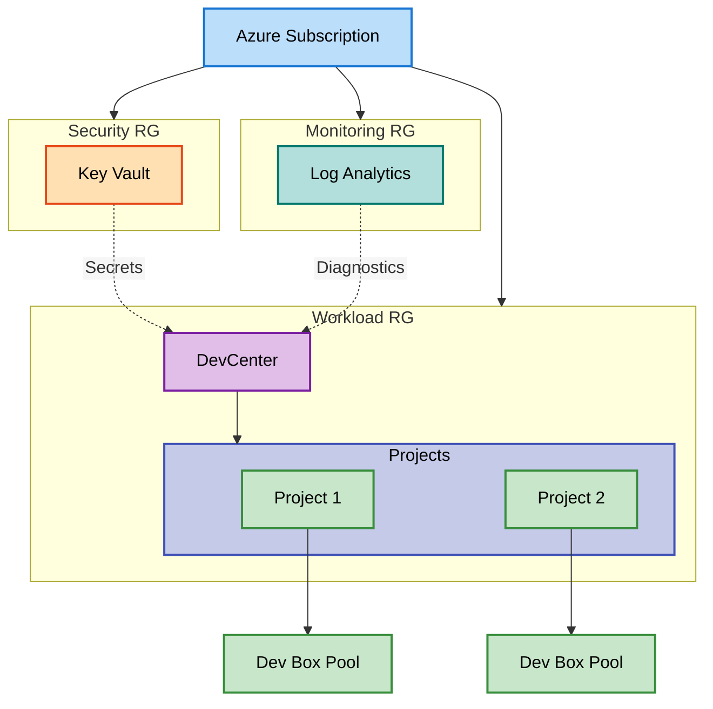

# DevExp-DevBox


Azure Dev Box infrastructure accelerator using Infrastructure as Code (Bicep)
for automated provisioning of centralized developer workstation environments
with role-based access controls.

## 🚀 Quick Start

Deploy a complete Azure DevCenter environment with projects and dev boxes:

```bash
azd auth login
azd env new prod
azd up
```

> 💡 **Tip**: The deployment takes approximately 10-15 minutes to complete all
> Azure resources.

## 📦 Installation

### Prerequisites

> ⚠️ **Prerequisites**: Ensure all tools are installed before proceeding with
> deployment.

- [Azure CLI](https://learn.microsoft.com/cli/azure/install-azure-cli) 2.50.0 or
  later
- [Azure Developer CLI (azd)](https://learn.microsoft.com/azure/developer/azure-developer-cli/install-azd)
  1.5.0 or later
- [GitHub CLI (gh)](https://cli.github.com/) for GitHub integration (optional)
- Active Azure subscription with Contributor and User Access Administrator
  permissions
- GitHub personal access token (PAT) if using GitHub catalogs

### Installation Steps

1. **Clone the repository**:

```bash
git clone https://github.com/Evilazaro/DevExp-DevBox.git
cd DevExp-DevBox
```

2. **Authenticate with Azure**:

```bash
az login
azd auth login
```

3. **Create a new environment**:

```bash
azd env new <environment-name>
```

4. **Set required configuration values**:

```bash
azd env set AZURE_LOCATION eastus
azd env set SOURCE_CONTROL_PLATFORM github
```

> ℹ️ **Note**: Replace `eastus` with your preferred Azure region. Supported
> regions are defined in [`infra/main.bicep`](infra/main.bicep).

## 💻 Usage

### Deploying the Infrastructure

Deploy all resources using Azure Developer CLI:

```bash
azd up
```

This command provisions:

- Resource groups for security, monitoring, and workload
- Azure Key Vault for secrets management
- Log Analytics workspace for monitoring
- Azure DevCenter with configured projects
- Network connections and dev box pools

**Expected Output**:

```
SUCCESS: Your application was provisioned in Azure in XX minutes XX seconds.
You can view the resources created under the resource group(s) in Azure Portal:
- DevExp-Security-prod-eastus-RG
- DevExp-Monitoring-prod-eastus-RG
- DevExp-Workload-prod-eastus-RG
```

### Configuring Dev Center Settings

Customize your DevCenter configuration by editing
[`infra/settings/workload/devcenter.yaml`](infra/settings/workload/devcenter.yaml):

```yaml
name: 'devexp-devcenter'
catalogItemSyncEnableStatus: 'Enabled'
microsoftHostedNetworkEnableStatus: 'Enabled'

projects:
  - name: 'eShop'
    description: 'eShop project for backend developers'
    maxDevBoxesPerUser: 5
```

After modifying settings, redeploy with `azd up`.

### Accessing Your Dev Box

1. Navigate to [Azure Portal](https://portal.azure.com)
2. Search for "DevCenter" and select your DevCenter resource
3. Go to "Projects" and select your assigned project
4. Click "Create dev box" to provision your developer workstation

## 🏗️ Architecture

The solution follows Azure landing zone best practices with separate resource
groups for security, monitoring, and workload isolation:



## 🔧 Configuration

### Resource Organization

Configure resource group settings in
[`infra/settings/resourceOrganization/azureResources.yaml`](infra/settings/resourceOrganization/azureResources.yaml):

```yaml
security:
  name: 'DevExp-Security'
  create: true
  tags:
    environment: 'production'
    cost-center: 'engineering'
```

### Security Settings

Manage Key Vault configuration in
[`infra/settings/security/security.yaml`](infra/settings/security/security.yaml)
for centralized secrets management.

### Environment Variables

Required environment variables for deployment:

| Variable                  | Description      | Example               |
| ------------------------- | ---------------- | --------------------- |
| `AZURE_ENV_NAME`          | Environment name | `prod`, `dev`, `test` |
| `AZURE_LOCATION`          | Azure region     | `eastus`, `westus2`   |
| `SOURCE_CONTROL_PLATFORM` | SCM platform     | `github`, `adogit`    |

## 🧪 Testing

Validate your Bicep templates before deployment:

```bash
az bicep build --file infra/main.bicep
az deployment sub validate --location eastus --template-file infra/main.bicep
```

## 🔍 Troubleshooting

### Common Issues

**Issue**: `azd up` fails with "Secret not found" error

**Solution**: Ensure you've created the required GitHub PAT secret:

```bash
az keyvault secret set --vault-name <vault-name> --name github-token --value <your-pat>
```

**Issue**: DevCenter deployment fails with permission errors

**Solution**: Verify your Azure account has both Contributor and User Access
Administrator roles at the subscription level.

## 🤝 Contributing

Contributions are welcome! Please follow these guidelines:

1. Fork the repository
2. Create a feature branch: `git checkout -b feature/your-feature`
3. Commit your changes: `git commit -m 'Add new feature'`
4. Push to the branch: `git push origin feature/your-feature`
5. Open a Pull Request

Ensure all Bicep files pass linting with `az bicep build` before submitting.

## 📚 Additional Resources

- [Microsoft Dev Box Documentation](https://learn.microsoft.com/azure/dev-box/overview-what-is-microsoft-dev-box)
- [Azure DevCenter Concepts](https://learn.microsoft.com/azure/deployment-environments/concept-environments-key-concepts)
- [Bicep Language Reference](https://learn.microsoft.com/azure/azure-resource-manager/bicep/file)
- [Azure Developer CLI Reference](https://learn.microsoft.com/azure/developer/azure-developer-cli/reference)

## 📝 License

This project is licensed under the MIT License. See the [LICENSE](LICENSE) file
for details.
