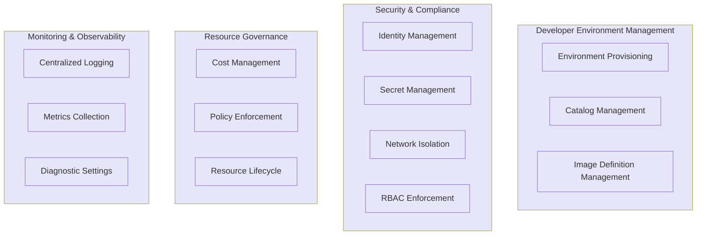
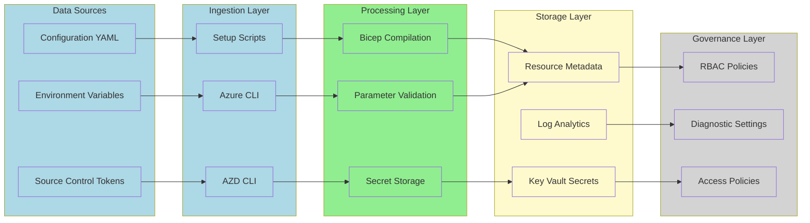
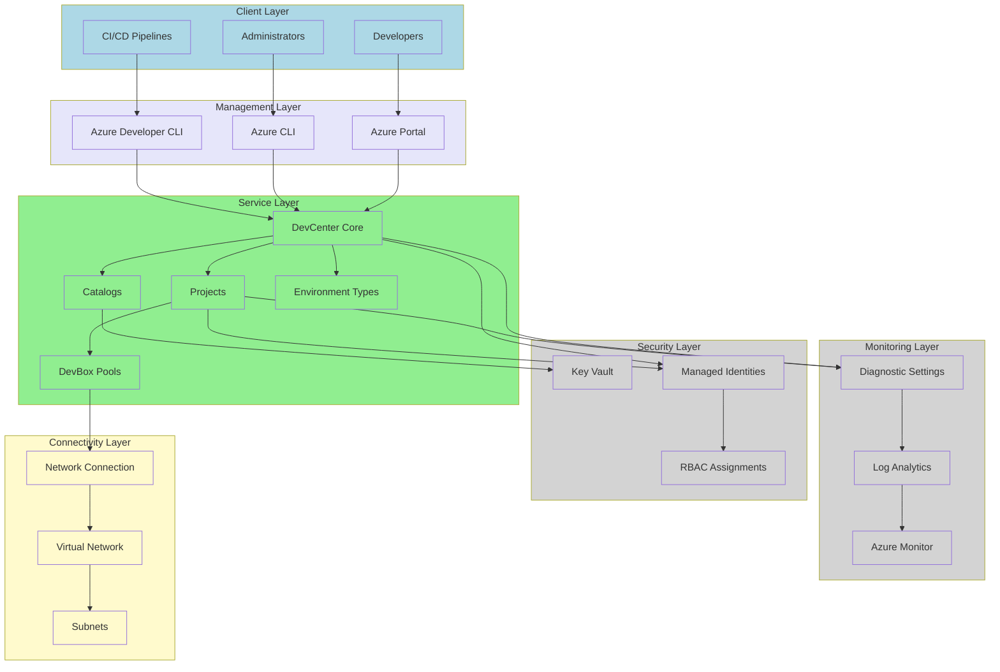
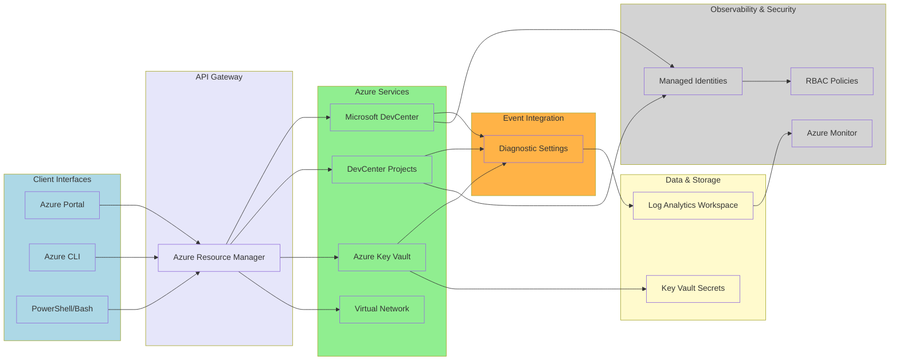
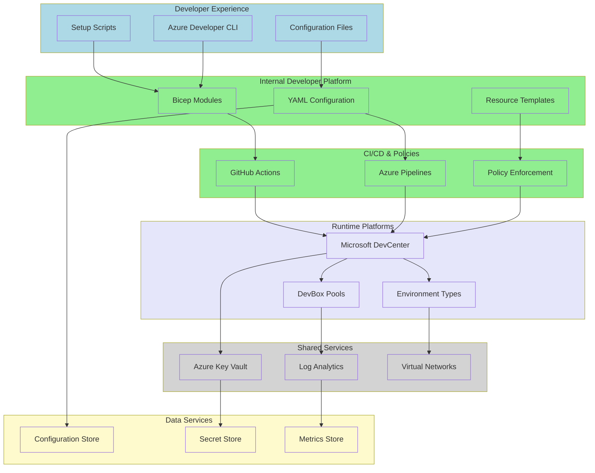

# Dev Box Landing Zone Accelerator

## Overview

Organizations adopting Microsoft Dev Box face significant challenges in establishing secure, scalable, and compliant cloud development environments. Traditional approaches often result in fragmented deployments, inconsistent security configurations, and lengthy setup times that hinder developer productivity. Development teams need standardized, pre-configured environments that align with enterprise governance policies while maintaining flexibility for different project requirements.

The Dev Box Landing Zone Accelerator addresses these challenges by providing an enterprise-ready, Infrastructure as Code (IaC) solution that automates the deployment of Microsoft Dev Box environments following Azure Cloud Adoption Framework best practices. This accelerator eliminates the complexity of manual configuration, ensures consistent security postures across all development environments, and significantly reduces the time-to-productivity for development teams.

Built on Azure Bicep and integrated with Azure Developer CLI (azd), this solution provides a repeatable, testable deployment pattern that scales from individual projects to enterprise-wide implementations. It incorporates identity management, network isolation, monitoring, and security controls out-of-the-box, enabling organizations to focus on building applications rather than managing infrastructure.

## Architecture Overview

The solution implements a multi-layered architecture aligned with TOGAF principles, organized into four primary landing zones: Security, Monitoring, Connectivity, and Workload. Each landing zone serves a distinct purpose in the overall architecture while maintaining clear separation of concerns and enabling independent scaling.

### Business Architecture

#### Purpose
The business architecture layer defines the organizational capabilities, value streams, and outcomes required for establishing enterprise-scale cloud development environments. It aligns technical implementation with business objectives such as developer productivity, security compliance, cost optimization, and operational efficiency.

#### Key Capabilities
- **Developer Environment Provisioning**: Automated creation and management of standardized development environments
- **Security and Compliance Management**: Enforcement of enterprise security policies and regulatory compliance
- **Resource Governance**: Centralized control of resource allocation, cost management, and policy enforcement
- **Identity and Access Management**: Role-based access control and authentication services
- **Monitoring and Observability**: Centralized logging, metrics, and operational insights

#### Value Stream Map

```mermaid
flowchart LR
    A[Developer Request] --> B[Environment Provisioning]
    B --> C[Identity Configuration]
    C --> D[Network Setup]
    D --> E[Security Policy Application]
    E --> F[Monitoring Integration]
    F --> G[Developer Access]
    
    style A fill:#E6E6FA
    style B fill:#E6E6FA
    style C fill:#E6E6FA
    style D fill:#E6E6FA
    style E fill:#E6E6FA
    style F fill:#E6E6FA
    style G fill:#E6E6FA
```



#### Business Capability Map



### Data Architecture

#### Purpose
The data architecture layer defines how configuration data, secrets, monitoring data, and operational metadata flow through the system. It ensures data security, integrity, and accessibility while maintaining compliance with enterprise data governance policies.

#### Key Capabilities
- **Configuration Management**: YAML-based declarative configuration for all resources
- **Secret Management**: Secure storage and retrieval of sensitive data via Azure Key Vault
- **Operational Data Collection**: Centralized logging and metrics via Log Analytics Workspace
- **Diagnostic Data**: Resource-level diagnostic settings for all Azure services

#### Master Data Management



### Application Architecture

#### Purpose
The application architecture layer defines the logical organization of infrastructure components, their relationships, and deployment patterns. It implements a modular, reusable design that supports enterprise-scale deployments while maintaining separation of concerns.

#### Key Capabilities
- **Modular Component Design**: Reusable Bicep modules for each landing zone
- **Identity-Based Security**: Managed identities for service-to-service authentication
- **Catalog Integration**: GitHub and Azure DevOps repository integration for environment definitions
- **Network Abstraction**: Support for both managed and unmanaged virtual networks
- **Project Isolation**: Independent project configurations with dedicated resource groups

#### Solution Architecture



### Technology Architecture

#### Purpose
The technology architecture layer defines the specific Azure services, deployment tools, and integration patterns used to implement the solution. It ensures the use of cloud-native services and platform engineering best practices.

#### Key Capabilities
- **Infrastructure as Code**: Azure Bicep for declarative infrastructure provisioning
- **Deployment Automation**: Azure Developer CLI for repeatable deployments
- **Source Control Integration**: GitHub and Azure DevOps for catalog management
- **Monitoring Integration**: Azure Monitor and Log Analytics for operational insights
- **Identity Integration**: Azure Active Directory for authentication and authorization

#### Cloud-Native Architecture



#### Platform Engineering Architecture



## Key Features and Benefits

### Enterprise-Scale Deployment
- **Multi-Project Support**: Deploy multiple DevCenter projects with independent configurations
- **Hierarchical Partition Keys**: Support for complex organizational structures
- **Resource Group Isolation**: Separate resource groups for security, monitoring, connectivity, and workload

### Security and Compliance
- **Managed Identity Integration**: System-assigned identities for secure service-to-service authentication
- **Azure Key Vault Integration**: Centralized secret management with automated rotation support
- **Role-Based Access Control**: Fine-grained permission management at subscription, resource group, and resource levels
- **Network Isolation**: Support for both Azure AD-joined and domain-joined scenarios

### Operational Excellence
- **Centralized Logging**: Log Analytics Workspace integration for all resources
- **Diagnostic Settings**: Automated configuration of diagnostic data collection
- **Azure Monitor Integration**: Built-in monitoring and alerting capabilities
- **Purge Protection**: Soft delete and purge protection for critical resources

### Developer Productivity
- **Automated Environment Provisioning**: One-command deployment of complete development environments
- **Catalog Integration**: Support for both GitHub and Azure DevOps repository catalogs
- **Image Definition Management**: Centralized management of DevBox images
- **Environment Templates**: Reusable environment definitions for consistent deployments

### Infrastructure as Code
- **Declarative Configuration**: YAML-based configuration for all resources
- **Modular Design**: Reusable Bicep modules for each component
- **Parameter Validation**: Built-in validation for deployment parameters
- **Idempotent Deployments**: Safe to run multiple times without side effects

## Prerequisites

### Required Tools

| Tool | Minimum Version | Purpose | Installation Link |
|------|----------------|---------|-------------------|
| Azure CLI | 2.50.0+ | Azure resource management | [Install Azure CLI](https://learn.microsoft.com/cli/azure/install-azure-cli) |
| Azure Developer CLI | 1.5.0+ | Deployment automation | [Install Azure Developer CLI](https://learn.microsoft.com/azure/developer/azure-developer-cli/install-azd) |
| PowerShell | 5.1+ (Windows) | Setup script execution | Built-in on Windows |
| Bash | 4.0+ (Linux/macOS) | Setup script execution | Built-in on Linux/macOS |
| GitHub CLI | 2.0+ (optional) | GitHub integration | [Install GitHub CLI](https://cli.github.com/) |
| Git | 2.30.0+ | Version control | [Install Git](https://git-scm.com/downloads) |

### Azure Subscription Requirements

- Active Azure subscription with sufficient quota for DevCenter resources
- Permissions to create service principals and role assignments
- No existing DevCenter resources with conflicting names

### Network Requirements

- Virtual network address space available (if using unmanaged networking)
- Subnet delegation permissions (if using unmanaged networking)
- Firewall rules configured for outbound connectivity (if using corporate proxies)

## Azure RBAC Roles

The following Azure built-in roles are required or assigned by this solution:

| Role Name | Description | Scope | Documentation Link |
|-----------|-------------|-------|-------------------|
| **Contributor** | Full access to manage all resources but cannot grant access to others | Subscription | [Contributor](https://learn.microsoft.com/azure/role-based-access-control/built-in-roles#contributor) |
| **User Access Administrator** | Manage user access to Azure resources, including role assignments | Subscription | [User Access Administrator](https://learn.microsoft.com/azure/role-based-access-control/built-in-roles#user-access-administrator) |
| **Managed Identity Contributor** | Create, read, update, and delete managed identities | Subscription | [Managed Identity Contributor](https://learn.microsoft.com/azure/role-based-access-control/built-in-roles#managed-identity-contributor) |
| **Key Vault Secrets User** | Read secret contents from Azure Key Vault | Resource Group | [Key Vault Secrets User](https://learn.microsoft.com/azure/role-based-access-control/built-in-roles#key-vault-secrets-user) |
| **DevCenter Dev Box User** | Provides access to create and manage Dev Boxes | Project | [DevCenter Dev Box User](https://learn.microsoft.com/azure/dev-box/how-to-dev-box-user) |
| **DevCenter Project Admin** | Provides full access to manage DevCenter projects | Project | [DevCenter Project Admin](https://learn.microsoft.com/azure/dev-box/how-to-project-admin) |
| **Network Contributor** | Manage networks, including virtual networks and subnets | Resource Group | [Network Contributor](https://learn.microsoft.com/azure/role-based-access-control/built-in-roles#network-contributor) |

### Role Assignment Strategy

The solution implements role assignments at multiple scopes:

1. **Subscription Level**: Service principal roles for deployment automation
2. **Resource Group Level**: Managed identity roles for service-to-service authentication
3. **Project Level**: User and group roles for developer access
4. **Resource Level**: Specific resource permissions (e.g., Key Vault access policies)

## Deployment Instructions

### Step 1: Clone the Repository

```bash
git clone https://github.com/Evilazaro/DevExp-DevBox.git
cd DevExp-DevBox
```

### Step 2: Configure Source Control Platform

The solution supports two source control platforms for catalog integration:

#### Option A: GitHub

1. Ensure GitHub CLI is installed and authenticated:
   ```bash
   gh auth login
   ```

2. Create a personal access token with `repo` scope:
   - Navigate to GitHub Settings → Developer settings → Personal access tokens
   - Create a classic token with `repo` permissions
   - Save the token securely

#### Option B: Azure DevOps

1. Create a Personal Access Token (PAT):
   - Navigate to Azure DevOps → User settings → Personal access tokens
   - Create a token with `Code (Read)` permissions
   - Save the token securely

2. Configure Azure DevOps defaults:
   ```bash
   az devops configure --defaults organization=https://dev.azure.com/YOUR_ORG project=YOUR_PROJECT
   ```

### Step 3: Run the Setup Script

#### Windows (PowerShell)

```powershell
.\setUp.ps1 -EnvName "prod" -SourceControl "github"
```

#### Linux/macOS (Bash)

```bash
chmod +x setUp.sh
./setUp.sh -e "prod" -s "github"
```

**Parameters:**
- `-EnvName` / `-e`: Name of the Azure environment (e.g., dev, test, prod)
- `-SourceControl` / `-s`: Source control platform (`github` or `adogit`)

The setup script will:
1. Validate required tools and authentication
2. Prompt for source control credentials (PAT)
3. Initialize Azure Developer CLI environment
4. Store secrets securely in Key Vault
5. Provision Azure resources using Bicep templates

### Step 4: Configure Environment Settings

The solution uses YAML configuration files located in settings:

#### Resource Organization (azureResources.yaml)

Configure landing zone resource groups:

```yaml
security:
  name: "security"
  create: true
  tags:
    component: "security"

monitoring:
  name: "monitoring"
  create: true
  tags:
    component: "monitoring"

workload:
  name: "workload"
  create: true
  tags:
    component: "workload"
```

#### Security Settings (security.yaml)

Configure Key Vault settings:

```yaml
create: true
keyVault:
  name: "keyvault"
  enablePurgeProtection: true
  enableSoftDelete: true
  softDeleteRetentionInDays: 90
  enableRbacAuthorization: true
  secretName: "GitHubPAT"
```

#### DevCenter Configuration (devcenter.yaml)

Configure DevCenter, catalogs, projects, and pools:

```yaml
name: "devcenter"
identity:
  type: "SystemAssigned"
  roleAssignments:
    devCenter:
      - id: "8e3af657-a8ff-443c-a75c-2fe8c4bcb635"
        name: "Owner"
        scope: "ResourceGroup"

catalogs:
  - name: "catalog-github"
    type: "gitHub"
    visibility: "private"
    uri: "https://github.com/YOUR_ORG/YOUR_REPO"
    branch: "main"
    path: "/environments"

projects:
  - name: "project-dev"
    description: "Development Project"
    catalogs:
      - name: "catalog-github"
        type: "imageDefinition"
    environmentTypes:
      - name: "dev"
        deploymentTargetId: "/subscriptions/YOUR_SUBSCRIPTION_ID"
    pools:
      - name: "pool-dev"
        imageDefinitionName: "windows-11-enterprise"
        vmSku: "general_i_8c32gb256ssd_v2"
```

### Step 5: Provision Resources

The setup script automatically provisions resources, but you can manually trigger provisioning:

```bash
azd provision -e prod
```

This command will:
1. Compile Bicep templates to ARM templates
2. Validate deployment parameters
3. Create resource groups
4. Deploy security resources (Key Vault)
5. Deploy monitoring resources (Log Analytics)
6. Deploy workload resources (DevCenter, projects, pools)
7. Configure role assignments and diagnostic settings

### Step 6: Verify Deployment

#### Verify Resource Groups

```bash
az group list --query "[?tags.component].{Name:name, Component:tags.component}" -o table
```

#### Verify DevCenter

```bash
az devcenter admin devcenter show --name YOUR_DEVCENTER_NAME --resource-group workload-ENV_NAME-LOCATION-RG
```

#### Verify Projects

```bash
az devcenter admin project list --resource-group workload-ENV_NAME-LOCATION-RG -o table
```

#### Verify Key Vault

```bash
az keyvault show --name YOUR_KEYVAULT_NAME --resource-group security-ENV_NAME-LOCATION-RG
```

### Step 7: Access DevCenter

1. Navigate to the [Azure Portal](https://portal.azure.com)
2. Search for "DevCenter" and select your deployed DevCenter
3. Navigate to "Projects" to view deployed projects
4. Users with appropriate RBAC roles can now create Dev Boxes

### Step 8: Monitor Deployment

View logs and metrics in Log Analytics Workspace:

```bash
az monitor log-analytics workspace show \
  --resource-group monitoring-ENV_NAME-LOCATION-RG \
  --workspace-name YOUR_WORKSPACE_NAME
```

Query deployment logs:

```bash
az monitor log-analytics query \
  --workspace YOUR_WORKSPACE_ID \
  --analytics-query "AzureActivity | where OperationNameValue contains 'MICROSOFT.DEVCENTER' | project TimeGenerated, OperationNameValue, ActivityStatusValue"
```

## Cleanup

To remove all deployed resources:

### Windows (PowerShell)

```powershell
.\cleanSetUp.ps1 -EnvName "prod" -Location "eastus2"
```

### Linux/macOS (Bash)

```bash
# Manual cleanup
azd down -e prod --purge --force
```

**Warning:** This operation is irreversible and will delete all resources, including Key Vault secrets with purge protection.

## Configuration Reference

### Landing Zone Configuration

The solution organizes resources into four landing zones:

| Landing Zone | Purpose | Resources | Configuration File |
|--------------|---------|-----------|-------------------|
| **Security** | Secret and key management | Key Vault, Secrets | security.yaml |
| **Monitoring** | Observability and logging | Log Analytics Workspace | N/A (auto-configured) |
| **Connectivity** | Network infrastructure | Virtual Network, Subnets, Network Connection | Defined per-project in devcenter.yaml |
| **Workload** | DevCenter resources | DevCenter, Projects, Pools, Catalogs | devcenter.yaml |

### Catalog Configuration

Catalogs provide environment definitions and image definitions for Dev Boxes:

```yaml
catalogs:
  - name: "catalog-name"
    type: "gitHub" | "adoGit"
    visibility: "public" | "private"
    uri: "https://github.com/org/repo"
    branch: "main"
    path: "/path/to/definitions"
```

**Supported Catalog Types:**
- `gitHub`: GitHub repositories
- `adoGit`: Azure DevOps Git repositories

**Visibility Options:**
- `public`: No authentication required
- `private`: Requires PAT stored in Key Vault

### Network Configuration

The solution supports two networking models:

#### Managed Networking (Microsoft-Hosted)

```yaml
network:
  virtualNetworkType: "Managed"
  microsoftHostedNetworkEnableStatus: "Enabled"
```

#### Unmanaged Networking (Customer-Managed)

```yaml
network:
  name: "vnet-devcenter"
  virtualNetworkType: "Unmanaged"
  create: true
  resourceGroupName: "connectivity-ENV_NAME-LOCATION-RG"
  addressPrefixes:
    - "10.0.0.0/16"
  subnets:
    - name: "subnet-devbox"
      addressPrefix: "10.0.0.0/24"
```

### Identity and RBAC Configuration

The solution supports multiple identity and RBAC patterns:

#### DevCenter Identity

```yaml
identity:
  type: "SystemAssigned"
  roleAssignments:
    devCenter:
      - id: "ROLE_DEFINITION_ID"
        name: "Role Name"
        scope: "Subscription" | "ResourceGroup"
```

#### Project Identity

```yaml
identity:
  type: "SystemAssigned"
  roleAssignments:
    - azureADGroupId: "GROUP_OBJECT_ID"
      azureADGroupName: "Group Name"
      azureRBACRoles:
        - id: "ROLE_DEFINITION_ID"
          name: "Role Name"
          scope: "Project" | "ResourceGroup"
```

#### Environment Type Identity

```yaml
environmentTypes:
  - name: "dev"
    deploymentTargetId: "/subscriptions/SUBSCRIPTION_ID"
    # System-assigned identity created automatically
```

## Troubleshooting

### Common Issues

#### Authentication Failures

**Symptom**: Setup script fails with authentication errors

**Resolution**:
1. Verify Azure CLI authentication: `az account show`
2. Verify GitHub CLI authentication: `gh auth status`
3. Ensure PAT has correct permissions
4. Re-run setup script

#### Quota Exceeded

**Symptom**: Deployment fails with quota error

**Resolution**:
1. Check DevCenter quota: `az devcenter admin usage list --location LOCATION`
2. Request quota increase via Azure Portal
3. Retry deployment

#### Network Connection Failures

**Symptom**: Network connection attachment fails

**Resolution**:
1. Verify subnet exists: `az network vnet subnet show`
2. Ensure subnet is not in use by other resources
3. Verify subnet delegation is not configured
4. Check NSG rules for outbound connectivity

#### Key Vault Access Denied

**Symptom**: Unable to retrieve secrets from Key Vault

**Resolution**:
1. Verify RBAC assignments: `az role assignment list --assignee YOUR_IDENTITY`
2. Check Key Vault access policies: `az keyvault show --name YOUR_KEYVAULT`
3. Ensure managed identity has Key Vault Secrets User role

### Diagnostic Commands

#### View Resource Deployment Status

```bash
az deployment sub show --name DEPLOYMENT_NAME
```

#### View Role Assignments

```bash
az role assignment list --scope /subscriptions/SUBSCRIPTION_ID --output table
```

#### View Diagnostic Settings

```bash
az monitor diagnostic-settings list --resource RESOURCE_ID
```

#### View Log Analytics Queries

```bash
az monitor log-analytics query \
  --workspace YOUR_WORKSPACE_ID \
  --analytics-query "AzureDiagnostics | where ResourceProvider == 'MICROSOFT.DEVCENTER' | limit 100"
```

## Release Strategy

The solution implements a branch-based semantic versioning strategy:

| Branch Pattern | Version Strategy | Release Publication |
|----------------|------------------|-------------------|
| `main` | Conditional major increment | ✅ Published |
| `feature/**` | Patch increment with overflow | ❌ Not published |
| `fix/**` | Minor increment with overflow | ❌ Not published |

For detailed release strategy documentation, see RELEASE_STRATEGY.md.

## Contributing

Contributions are welcome! Please read CONTRIBUTING.md for guidelines on:
- Code of conduct
- Development workflow
- Pull request process
- Coding standards

## Security

For reporting security vulnerabilities, please review SECURITY.md.

## License

This project is licensed under the MIT License. See LICENSE for details.

## Support

For issues, questions, or feature requests:
1. Check existing [GitHub Issues](https://github.com/Evilazaro/DevExp-DevBox/issues)
2. Create a new issue with detailed information
3. Use appropriate labels (bug, enhancement, question)

## Additional Resources

### Microsoft Documentation

- [Microsoft Dev Box Documentation](https://learn.microsoft.com/azure/dev-box/)
- [Azure DevCenter Documentation](https://learn.microsoft.com/azure/dev-center/)
- [Azure Bicep Documentation](https://learn.microsoft.com/azure/azure-resource-manager/bicep/)
- [Azure Developer CLI Documentation](https://learn.microsoft.com/azure/developer/azure-developer-cli/)

### Related Projects

- [Azure Landing Zones](https://github.com/Azure/Enterprise-Scale)
- [Azure Verified Modules](https://github.com/Azure/bicep-registry-modules)
- [Cloud Adoption Framework](https://learn.microsoft.com/azure/cloud-adoption-framework/)

---

**Maintained by**: DevExp Team  
**Last Updated**: 2024