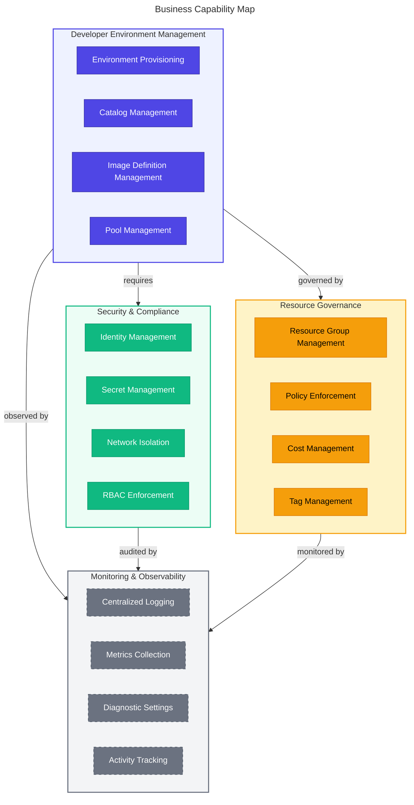
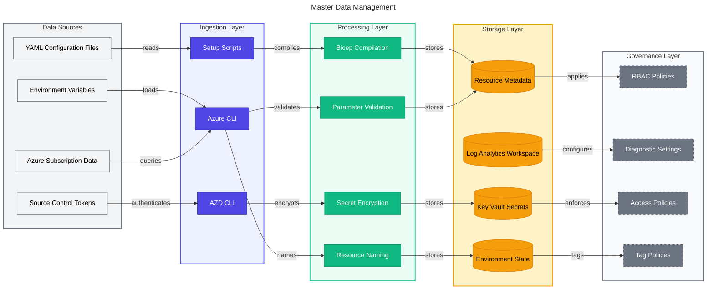
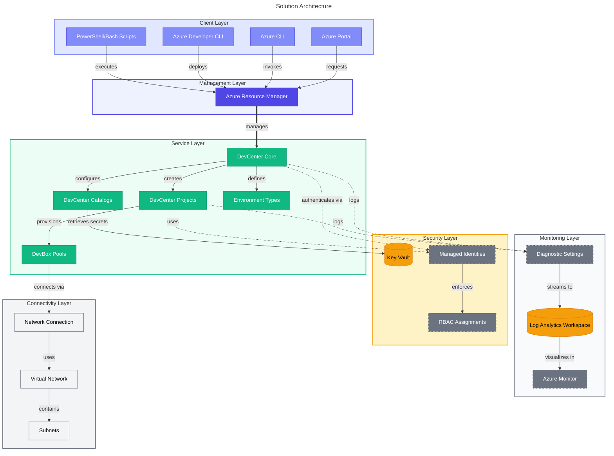
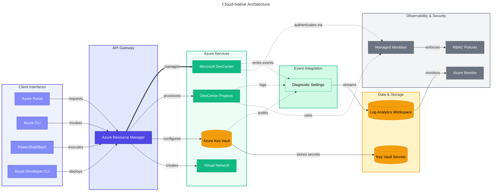
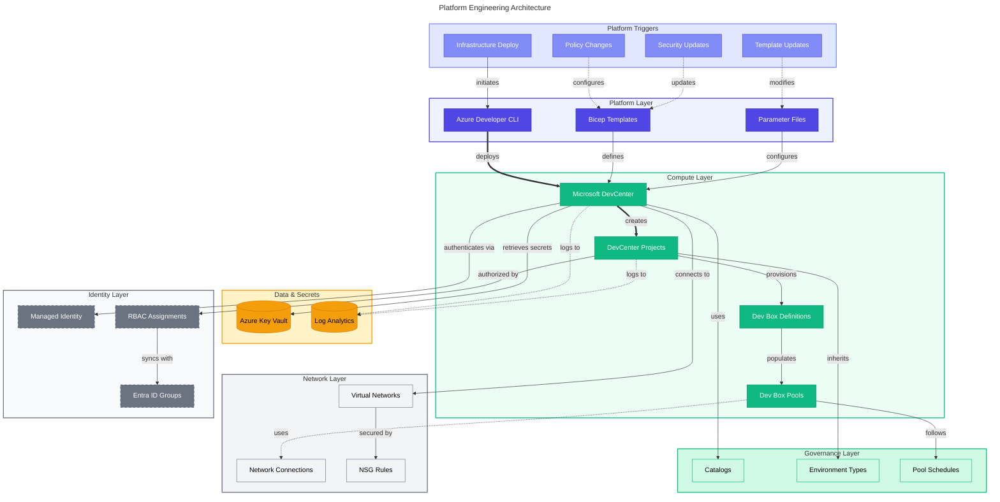

# 🚀 Dev Box Landing Zone Accelerator

[](LICENSE)
[](https://azure.microsoft.com/services/dev-box/)
[](https://learn.microsoft.com/azure/azure-resource-manager/bicep/)

> [!NOTE] **Target Audience:** Platform Engineers, Cloud Architects, and DevOps
> Teams<br> **Reading Time:** ~25 minutes

<details>
<summary>📍 Navigation</summary>

| Previous |   Index    |                                    Next |
| :------- | :--------: | --------------------------------------: |
| —        | **README** | [Release Strategy](RELEASE_STRATEGY.md) |

</details>

---

## 📖 Overview

Organizations adopting Microsoft Dev Box face significant challenges in
establishing secure, scalable, and compliant cloud development environments.
Traditional approaches often result in fragmented deployments, inconsistent
security configurations, and lengthy setup times that hinder developer
productivity. Development teams need standardized, pre-configured environments
that align with enterprise governance policies while maintaining flexibility for
different project requirements.

The Dev Box Landing Zone Accelerator addresses these challenges by providing an
enterprise-ready, Infrastructure as Code (IaC) solution that automates the
deployment of Microsoft Dev Box environments following Azure Cloud Adoption
Framework best practices. This accelerator eliminates the complexity of manual
configuration, ensures consistent security postures across all development
environments, and significantly reduces the time-to-productivity for development
teams.

Built on Azure Bicep and integrated with Azure Developer CLI (azd), this
solution provides a repeatable, testable deployment pattern that scales from
individual projects to enterprise-wide implementations. It incorporates identity
management, network isolation, monitoring, and security controls out-of-the-box,
enabling organizations to focus on building applications rather than managing
infrastructure.

> [!TIP] This accelerator is built on **Azure Bicep** and integrated with
> **Azure Developer CLI (azd)**, providing a repeatable, testable deployment
> pattern that scales from individual projects to enterprise-wide
> implementations.

---

<details>
<summary>📑 <strong>Table of Contents</strong></summary>

- [📖 Overview](#-overview)
- [🏗️ Architecture Overview](#️-architecture-overview)
  - [🏢 Business Architecture](#-business-architecture)
  - [💾 Data Architecture](#-data-architecture)
  - [📐 Application Architecture](#-application-architecture)
  - [☁️ Technology Architecture](#️-technology-architecture)
- [✨ Key Features and Benefits](#-key-features-and-benefits)
- [📋 Prerequisites](#-prerequisites)
- [🔐 Azure RBAC Roles](#-azure-rbac-roles)
- [🚀 Deployment Instructions](#-deployment-instructions)
- [⚙️ Configuration Reference](#️-configuration-reference)
- [📦 Release Strategy](#-release-strategy)
- [🔧 Troubleshooting](#-troubleshooting)
- [🧹 Cleanup](#-cleanup)
- [🤝 Contributing](#-contributing)
- [🔒 Security](#-security)
- [📄 License](#-license)
- [💬 Support](#-support)
- [📚 Additional Resources](#-additional-resources)
- [📎 Related Documents](#-related-documents)

</details>

---

## 🏗️ Architecture Overview

The Dev Box Landing Zone Accelerator implements a layered architecture aligned
with TOGAF principles, organizing resources into four distinct landing zones:
Security, Monitoring, Connectivity, and Workload. This design ensures separation
of concerns, independent scaling, and adherence to enterprise governance
requirements.

### 🏢 Business Architecture

#### Purpose

The business architecture layer defines the organizational capabilities, value
streams, and business processes required to establish and operate
enterprise-scale cloud development environments. It aligns technical
implementation with business objectives including developer productivity,
security compliance, cost optimization, and operational efficiency.

#### 🎯 Key Capabilities

- **Developer Environment Provisioning**: Automated creation and lifecycle
  management of standardized development environments
- **Security and Compliance Management**: Enforcement of enterprise security
  policies, role-based access control, and regulatory compliance
- **Resource Governance**: Centralized control of resource allocation, cost
  management, and policy enforcement
- **Identity and Access Management**: Integration with Azure Active Directory
  for authentication and authorization
- **Monitoring and Observability**: Centralized logging, metrics collection, and
  operational insights
- **Catalog Management**: Version-controlled environment definitions and image
  repositories

#### 🔄 High-Level Process

1. **Environment Request**: Developers or administrators initiate environment
   provisioning
2. **Authentication**: Identity verification through Azure AD integration
3. **Authorization**: RBAC policy evaluation and permission validation
4. **Resource Allocation**: DevCenter assigns resources based on project
   configuration
5. **Network Configuration**: Connectivity establishment (managed or unmanaged
   VNet)
6. **Security Policy Application**: Key Vault integration and secret management
7. **Monitoring Integration**: Log Analytics and diagnostic settings
   configuration
8. **Environment Delivery**: Developer access to provisioned Dev Box

#### 🗺️ Business Capability Map



#### 📊 Value Stream Map

```mermaid
---
title: Value Stream Map
---
flowchart LR
    %% ===== VALUE STREAM STAGES =====
    A["Developer Request"] -->|initiates| B["Identity Verification"]
    B -->|validates| C["Authorization Check"]
    C -->|approves| D["Resource Allocation"]
    D -->|configures| E["Network Configuration"]
    E -->|applies| F["Security Policy Application"]
    F -->|integrates| G["Monitoring Integration"]
    G -->|completes| H["Environment Ready"]
    H -->|grants| I["Developer Access"]

    %% ===== CLASS DEFINITIONS =====
    classDef trigger fill:#818CF8,stroke:#4F46E5,color:#FFFFFF
    classDef primary fill:#4F46E5,stroke:#3730A3,color:#FFFFFF
    classDef secondary fill:#10B981,stroke:#059669,color:#FFFFFF
    classDef datastore fill:#F59E0B,stroke:#D97706,color:#000000
    classDef external fill:#6B7280,stroke:#4B5563,color:#FFFFFF,stroke-dasharray:5 5
    classDef matrix fill:#D1FAE5,stroke:#10B981,color:#000000

    %% ===== NODE STYLING =====
    class A trigger
    class B,C primary
    class D,E secondary
    class F,G datastore
    class H matrix
    class I external
```



### 💾 Data Architecture

#### Purpose

The data architecture layer defines how configuration data, secrets, monitoring
data, and operational metadata flow through the system. It ensures data
security, integrity, and accessibility while maintaining compliance with
enterprise data governance policies.

#### 🎯 Key Capabilities

- **Configuration Management**: YAML-based declarative configuration for all
  infrastructure resources
- **Secret Management**: Secure storage and retrieval of sensitive data via
  Azure Key Vault
- **Operational Data Collection**: Centralized logging and metrics via Log
  Analytics Workspace
- **Diagnostic Data**: Resource-level diagnostic settings for all Azure services
- **Environment State Management**: Azure Developer CLI environment
  configuration and state tracking

#### 🔄 High-Level Process

1. **Configuration Ingestion**: YAML files define resource configurations
2. **Secret Storage**: Personal Access Tokens (PAT) stored securely in Key Vault
3. **Bicep Compilation**: Declarative templates compiled to ARM templates
4. **Resource Provisioning**: ARM templates deployed to Azure subscriptions
5. **Diagnostic Configuration**: Log Analytics workspace linked to all resources
6. **Metadata Tracking**: Resource tags and configuration metadata maintained

#### 📊 Master Data Management



### 📐 Application Architecture

#### Purpose

The application architecture layer defines the logical organization of
infrastructure components, their relationships, and deployment patterns. It
implements a modular, reusable design that supports enterprise-scale deployments
while maintaining separation of concerns through landing zone isolation.

#### 🎯 Key Capabilities

- **Modular Component Design**: Reusable Bicep modules for each landing zone and
  resource type
- **Identity-Based Security**: System-assigned managed identities for
  service-to-service authentication
- **Catalog Integration**: GitHub and Azure DevOps repository integration for
  environment definitions
- **Network Abstraction**: Support for both Microsoft-hosted (managed) and
  customer-managed (unmanaged) virtual networks
- **Project Isolation**: Independent project configurations with dedicated
  resource groups and RBAC
- **Diagnostic Integration**: Automated Log Analytics workspace linkage for all
  resources

#### 🔄 High-Level Process

1. **Landing Zone Creation**: Resource groups provisioned for Security,
   Monitoring, Connectivity, and Workload
2. **Security Provisioning**: Key Vault deployed with secrets and access
   policies
3. **Monitoring Provisioning**: Log Analytics Workspace and diagnostic settings
   configured
4. **DevCenter Provisioning**: Core DevCenter resource with catalogs and
   environment types
5. **Project Provisioning**: Multiple projects with pools, environment types,
   and network connections
6. **RBAC Configuration**: Role assignments at subscription, resource group, and
   resource scopes
7. **Catalog Synchronization**: Git repositories synced for environment and
   image definitions

#### 🏛️ Solution Architecture



### ☁️ Technology Architecture

#### Purpose

The technology architecture layer defines the specific Azure services,
deployment tools, integration patterns, and automation workflows used to
implement the solution. It ensures the use of cloud-native services,
infrastructure as code best practices, and platform engineering principles.

#### 🎯 Key Capabilities

- **Infrastructure as Code**: Azure Bicep for declarative infrastructure
  provisioning
- **Deployment Automation**: Azure Developer CLI (azd) for repeatable
  deployments
- **Source Control Integration**: GitHub and Azure DevOps for catalog and
  environment definition management
- **Monitoring Integration**: Azure Monitor and Log Analytics for operational
  insights
- **Identity Integration**: Azure Active Directory for authentication and
  authorization
- **Secret Management**: Azure Key Vault with RBAC authorization model
- **Network Services**: Azure Virtual Network with managed or unmanaged
  connectivity options

#### 🔄 High-Level Process

1. **Tool Validation**: Setup scripts verify Azure CLI, azd CLI, and source
   control tools
2. **Authentication**: Azure and source control platform authentication
   established
3. **Environment Initialization**: azd environment created with configuration
   files
4. **Secret Storage**: PATs stored in Key Vault with encryption
5. **Resource Provisioning**: Bicep templates deployed via azd provision
6. **Diagnostic Configuration**: Log Analytics workspace linked to all resources
7. **RBAC Application**: Role assignments created at appropriate scopes
8. **Catalog Synchronization**: Git repositories synchronized for definitions

#### ☁️ Cloud-Native Architecture



#### 🔧 Platform Engineering Architecture



---

## ✨ Key Features and Benefits

### 🏢 Enterprise-Scale Deployment

- **Multi-Project Support**: Deploy multiple DevCenter projects with independent
  configurations and resource isolation
- **Landing Zone Organization**: Separate resource groups for Security,
  Monitoring, Connectivity, and Workload components
- **Hierarchical Resource Naming**: Consistent naming conventions using
  environment name and location identifiers
- **Tag-Based Governance**: Automated tagging for cost allocation, compliance
  tracking, and resource organization

### 🔐 Security and Compliance

- **Managed Identity Integration**: System-assigned identities for secure
  service-to-service authentication without credential management
- **Azure Key Vault Integration**: Centralized secret management with purge
  protection and soft delete enabled
- **Role-Based Access Control**: Fine-grained permission management at
  subscription, resource group, and resource levels
- **Network Isolation**: Support for both Azure AD-joined (managed) and
  customer-managed (unmanaged) virtual network scenarios
- **Diagnostic Settings**: Automated configuration for security audit logging
  and compliance reporting

### 📊 Operational Excellence

- **Centralized Logging**: Log Analytics Workspace integration for all DevCenter
  and project resources
- **Diagnostic Settings Automation**: Automated configuration of diagnostic data
  collection for all resources
- **Azure Monitor Integration**: Built-in monitoring and alerting capabilities
  for operational insights
- **Purge Protection**: Soft delete and purge protection for Key Vault to
  prevent accidental data loss

### 👨‍💻 Developer Productivity

- **Automated Environment Provisioning**: One-command deployment of complete
  development environments
- **Catalog Integration**: Support for GitHub and Azure DevOps repository
  catalogs with private and public visibility
- **Image Definition Management**: Centralized management of DevBox images with
  versioning support
- **Environment Templates**: Reusable environment definitions for consistent,
  repeatable deployments
- **Multi-Platform Tooling**: Support for Windows (PowerShell) and Linux/macOS
  (Bash) deployment scripts

### 📜 Infrastructure as Code

- **Declarative Configuration**: YAML-based configuration for all infrastructure
  resources
- **Modular Design**: Reusable Bicep modules for each component with clear
  separation of concerns
- **Parameter Validation**: Built-in validation for deployment parameters to
  prevent misconfigurations
- **Idempotent Deployments**: Safe to run multiple times without unintended side
  effects
- **Type-Safe Templates**: Bicep type definitions ensure configuration
  correctness at compile time

---

## 📋 Prerequisites

> [!IMPORTANT] Ensure all prerequisites are met before proceeding with
> deployment to avoid configuration issues.

### 🛠️ Required Tools

| Tool                | Minimum Version    | Purpose                                          | Installation Link                                                                                          |
| ------------------- | ------------------ | ------------------------------------------------ | ---------------------------------------------------------------------------------------------------------- |
| Azure CLI           | 2.50.0+            | Azure resource management and authentication     | [Install Azure CLI](https://learn.microsoft.com/cli/azure/install-azure-cli)                               |
| Azure Developer CLI | 1.5.0+             | Deployment automation and environment management | [Install Azure Developer CLI](https://learn.microsoft.com/azure/developer/azure-developer-cli/install-azd) |
| PowerShell          | 5.1+ (Windows)     | Setup script execution on Windows                | Built-in on Windows                                                                                        |
| Bash                | 4.0+ (Linux/macOS) | Setup script execution on Linux/macOS            | Built-in on Linux/macOS                                                                                    |
| GitHub CLI          | 2.0+ (optional)    | GitHub authentication and integration            | [Install GitHub CLI](https://cli.github.com/)                                                              |
| Git                 | 2.30.0+            | Version control and repository operations        | [Install Git](https://git-scm.com/downloads)                                                               |

### ☁️ Azure Subscription Requirements

- Active Azure subscription with permissions to create resources
- Sufficient quota for Microsoft DevCenter resources in target region
- No existing DevCenter resources with conflicting names in target subscription
- Service principal creation permissions (if using CI/CD)

### 🌐 Network Requirements

- Virtual network address space available (if using unmanaged networking mode)
- Subnet delegation permissions (if using customer-managed virtual networks)
- Firewall rules configured for outbound connectivity to Azure services
- DNS resolution configured for Azure AD authentication

### 📂 Source Control Requirements

#### GitHub

- GitHub account with repository access
- Personal Access Token (PAT) with `repo` scope for private repositories
- GitHub CLI authenticated (if using interactive setup)

#### Azure DevOps

- Azure DevOps organization and project access
- Personal Access Token (PAT) with `Code (Read)` permissions
- Azure DevOps CLI extension configured with defaults

---

## 🔐 Azure RBAC Roles

The following Azure built-in roles are required or assigned by this solution:

| Role Name                        | Description                                                                                                | Scope          | Documentation Link                                                                                                                      |
| -------------------------------- | ---------------------------------------------------------------------------------------------------------- | -------------- | --------------------------------------------------------------------------------------------------------------------------------------- |
| **Contributor**                  | Full access to manage all resources but cannot grant access to others. Required for deployment.            | Subscription   | [Contributor](https://learn.microsoft.com/azure/role-based-access-control/built-in-roles#contributor)                                   |
| **User Access Administrator**    | Manage user access to Azure resources including role assignments. Required for RBAC configuration.         | Subscription   | [User Access Administrator](https://learn.microsoft.com/azure/role-based-access-control/built-in-roles#user-access-administrator)       |
| **Managed Identity Contributor** | Create, read, update, and delete managed identities. Assigned to service principals.                       | Subscription   | [Managed Identity Contributor](https://learn.microsoft.com/azure/role-based-access-control/built-in-roles#managed-identity-contributor) |
| **Key Vault Secrets User**       | Read secret contents from Azure Key Vault. Assigned to DevCenter managed identities.                       | Resource Group | [Key Vault Secrets User](https://learn.microsoft.com/azure/role-based-access-control/built-in-roles#key-vault-secrets-user)             |
| **DevCenter Dev Box User**       | Provides access to create and manage Dev Boxes within projects. Assigned to developer groups.              | Project        | [DevCenter Dev Box User](https://learn.microsoft.com/azure/dev-box/how-to-dev-box-user)                                                 |
| **DevCenter Project Admin**      | Provides full access to manage DevCenter projects including pools and environment types.                   | Project        | [DevCenter Project Admin](https://learn.microsoft.com/azure/dev-box/how-to-project-admin)                                               |
| **Network Contributor**          | Manage networks including virtual networks, subnets, and network connections.                              | Resource Group | [Network Contributor](https://learn.microsoft.com/azure/role-based-access-control/built-in-roles#network-contributor)                   |
| **Owner**                        | Full access to all resources and can grant access. Assigned to DevCenter identity for resource management. | Resource Group | [Owner](https://learn.microsoft.com/azure/role-based-access-control/built-in-roles#owner)                                               |

### 🎯 Role Assignment Strategy

The solution implements role assignments at multiple scopes following the
principle of least privilege:

1. **Subscription Level**:
   - Service principal roles for deployment automation
   - DevCenter managed identity roles for cross-resource-group operations

2. **Resource Group Level**:
   - Project managed identity roles for resource creation within security
     resource group
   - DevCenter managed identity roles for Key Vault access

3. **Project Level**:
   - User and Azure AD group roles for developer access to Dev Boxes
   - Administrator roles for project management and configuration

4. **Resource Level**:
   - Specific resource permissions via RBAC (Key Vault, Log Analytics)
   - Diagnostic settings permissions for monitoring integration

---

## 🚀 Deployment Instructions

> [!TIP] For best results, follow each step in order and verify successful
> completion before proceeding to the next step.

### 📌 Step 1: Clone the Repository

```bash
git clone https://github.com/Evilazaro/DevExp-DevBox.git
cd DevExp-DevBox
```

### 🔑 Step 2: Configure Source Control Platform

The solution supports two source control platforms for catalog integration.
Choose one based on your organization's requirements.

#### 🐙 Option A: GitHub

1. **Authenticate GitHub CLI** (if using interactive setup):

   ```bash
   gh auth login
   ```

2. **Create Personal Access Token**:
   - Navigate to GitHub Settings → Developer settings → Personal access tokens →
     Tokens (classic)
   - Click "Generate new token (classic)"
   - Select `repo` scope (Full control of private repositories)
   - Set appropriate expiration date
   - Click "Generate token" and copy the token securely

#### 🔵 Option B: Azure DevOps

1. **Create Personal Access Token**:
   - Navigate to Azure DevOps → User settings → Personal access tokens
   - Click "New Token"
   - Set name and expiration
   - Select `Code (Read)` scope
   - Click "Create" and copy the token securely

2. **Configure Azure DevOps CLI** (if using interactive setup):
   ```bash
   az devops configure --defaults organization=https://dev.azure.com/YOUR_ORG project=YOUR_PROJECT
   ```

### ▶️ Step 3: Run the Setup Script

#### 💻 Windows (PowerShell)

```powershell
# Basic deployment with GitHub
.\setUp.ps1 -EnvName "prod" -SourceControl "github"

# Basic deployment with Azure DevOps
.\setUp.ps1 -EnvName "prod" -SourceControl "adogit"

# Interactive mode (prompts for source control selection)
.\setUp.ps1 -EnvName "prod"

# Show help
.\setUp.ps1 -Help
```

#### 🐧 Linux/macOS (Bash)

```bash
# Make script executable
chmod +x setUp.sh

# Basic deployment with GitHub
./setUp.sh -e "prod" -s "github"

# Basic deployment with Azure DevOps
./setUp.sh -e "prod" -s "adogit"

# Interactive mode (prompts for source control selection)
./setUp.sh -e "prod"

# Show help
./setUp.sh -h
```

**📋 Script Parameters:**

| Parameter                      | Aliases | Required | Description                   | Valid Values                         |
| ------------------------------ | ------- | -------- | ----------------------------- | ------------------------------------ |
| EnvName / env-name             | -e      | Yes      | Name of the Azure environment | Any alphanumeric string (2-10 chars) |
| SourceControl / source-control | -s      | No\*     | Source control platform       | `github`, `adogit`                   |
| Help / help                    | -h      | No       | Display help message          | N/A                                  |

\*If not provided, the script will prompt for selection interactively.

> [!NOTE] The setup script performs multiple validations and configurations
> automatically. Review the actions below to understand what happens during
> execution.

**⚙️ Setup Script Actions:**

1. Validates required tools (az, azd, gh/Azure DevOps CLI)
2. Verifies Azure and source control authentication
3. Prompts for Personal Access Token (PAT) securely
4. Initializes Azure Developer CLI environment
5. Stores PAT securely in Key Vault
6. Configures environment variables in `.azure/{ENV_NAME}/.env`
7. Provisions Azure resources using Bicep templates
8. Configures role assignments and diagnostic settings

### ⚙️ Step 4: Configure Environment Settings

The solution uses YAML configuration files located in `settings/`. Customize
these files before deployment to match your organizational requirements.

#### 🏠 Resource Organization Configuration

**File**: `settings/resourceOrganization/azureResources.yaml`

This file defines the landing zone resource groups and their properties.

```yaml
security:
  name: 'security'
  create: true
  tags:
    component: 'security'
    environment: 'production'

monitoring:
  name: 'monitoring'
  create: true
  tags:
    component: 'monitoring'
    environment: 'production'

workload:
  name: 'workload'
  create: true
  tags:
    component: 'workload'
    environment: 'production'
```

**⚙️ Configuration Options:**

- `name`: Base name for the resource group (will be suffixed with environment
  and location)
- `create`: Boolean flag to create new resource group or use existing
- `tags`: Custom tags for cost allocation and governance

#### 🔐 Security Configuration

**File**: `settings/security/security.yaml`

This file configures Azure Key Vault settings and secret management.

```yaml
create: true
keyVault:
  name: 'keyvault'
  enablePurgeProtection: true
  enableSoftDelete: true
  softDeleteRetentionInDays: 90
  enableRbacAuthorization: true
  secretName: 'GitHubPAT'
```

**⚙️ Configuration Options:**

- `create`: Boolean flag to create new Key Vault or use existing
- `enablePurgeProtection`: Prevents permanent deletion during retention period
- `enableSoftDelete`: Enables soft delete with retention period
- `softDeleteRetentionInDays`: Number of days to retain soft-deleted items
  (7-90)
- `enableRbacAuthorization`: Use Azure RBAC instead of access policies
- `secretName`: Name of the secret to store the PAT

#### 🏭 DevCenter Configuration

**File**: `settings/workload/devcenter.yaml`

This file configures the DevCenter, catalogs, projects, pools, and network
settings.

```yaml
name: 'devcenter'
identity:
  type: 'SystemAssigned'
  roleAssignments:
    devCenter:
      - id: '8e3af657-a8ff-443c-a75c-2fe8c4bcb635'
        name: 'Owner'
        scope: 'ResourceGroup'
    orgRoleTypes:
      - type: 'Group'
        azureADGroupId: 'YOUR_AZURE_AD_GROUP_OBJECT_ID'
        azureADGroupName: 'DevBox Administrators'
        azureRBACRoles:
          - id: '8e3af657-a8ff-443c-a75c-2fe8c4bcb635'
            name: 'Owner'

catalogItemSyncEnableStatus: 'Enabled'
microsoftHostedNetworkEnableStatus: 'Enabled'
installAzureMonitorAgentEnableStatus: 'Enabled'

catalogs:
  - name: 'catalog-github'
    type: 'gitHub'
    visibility: 'private'
    uri: 'https://github.com/YOUR_ORG/YOUR_REPO'
    branch: 'main'
    path: '/environments'

environmentTypes:
  - name: 'dev'
  - name: 'test'
  - name: 'prod'

projects:
  - name: 'project-dev'
    description: 'Development Project'
    identity:
      type: 'SystemAssigned'
      roleAssignments:
        - azureADGroupId: 'YOUR_AZURE_AD_GROUP_OBJECT_ID'
          azureADGroupName: 'Developers'
          azureRBACRoles:
            - id: '45d50f46-0b78-4001-a660-4198cbe8cd05'
              name: 'DevCenter Dev Box User'
              scope: 'Project'
    catalogs:
      - name: 'catalog-github'
        type: 'imageDefinition'
        sourceControl: 'gitHub'
        visibility: 'private'
        uri: 'https://github.com/YOUR_ORG/YOUR_REPO'
        branch: 'main'
        path: '/images'
    environmentTypes:
      - name: 'dev'
        deploymentTargetId: '/subscriptions/YOUR_SUBSCRIPTION_ID'
    pools:
      - name: 'pool-dev'
        imageDefinitionName: 'windows-11-enterprise'
        vmSku: 'general_i_8c32gb256ssd_v2'
    network:
      name: 'vnet-devcenter'
      virtualNetworkType: 'Managed'
      microsoftHostedNetworkEnableStatus: 'Enabled'
      create: false
      resourceGroupName: 'connectivity-ENV_NAME-LOCATION-RG'
      addressPrefixes:
        - '10.0.0.0/16'
      subnets:
        - name: 'subnet-devbox'
          addressPrefix: '10.0.0.0/24'
      tags:
        component: 'connectivity'
```

**📝 Key Configuration Sections:**

1. **DevCenter Identity**: Configures system-assigned managed identity and role
   assignments
2. **Catalogs**: Defines Git repositories for environment and image definitions
3. **Environment Types**: Lists available environment types (dev, test, prod)
4. **Projects**: Configures individual projects with identity, catalogs, pools,
   and networking
5. **Network**: Defines network configuration (Managed or Unmanaged)

### 🔧 Step 5: Provision Resources

The setup script automatically provisions resources, but you can manually
trigger provisioning:

```bash
# Provision all resources
azd provision -e prod

# Deploy only (assumes infrastructure exists)
azd deploy -e prod

# Full deployment (provision + deploy)
azd up -e prod
```

**🔄 Provisioning Process:**

1. **Validation Phase**:
   - Validates Bicep templates
   - Checks parameter values
   - Verifies subscription access

2. **Security Landing Zone**:
   - Creates security resource group
   - Deploys Azure Key Vault
   - Stores PAT as secret
   - Configures access policies

3. **Monitoring Landing Zone**:
   - Creates monitoring resource group
   - Deploys Log Analytics Workspace
   - Configures workspace solutions

4. **Workload Landing Zone**:
   - Creates workload resource group
   - Deploys DevCenter core
   - Configures catalogs
   - Creates environment types

5. **Project Provisioning**:
   - Creates DevCenter projects
   - Configures project catalogs
   - Creates environment types
   - Deploys DevBox pools

6. **Connectivity Landing Zone** (if unmanaged networking):
   - Creates connectivity resource group
   - Deploys virtual network
   - Creates subnets
   - Configures network connections

7. **RBAC Configuration**:
   - Assigns managed identity roles
   - Configures Azure AD group roles
   - Applies Key Vault access policies

8. **Diagnostic Settings**:
   - Links all resources to Log Analytics
   - Enables AllLogs category
   - Enables AllMetrics

### ✅ Step 6: Verify Deployment

#### 📁 Verify Resource Groups

```bash
# List all resource groups with tags
az group list --query "[?tags.component].{Name:name, Component:tags.component, Location:location}" -o table
```

**📊 Expected Output:**

```
Name                              Component      Location
security-prod-eastus2-RG         security       eastus2
monitoring-prod-eastus2-RG       monitoring     eastus2
workload-prod-eastus2-RG         workload       eastus2
connectivity-prod-eastus2-RG     connectivity   eastus2
```

#### 🏭 Verify DevCenter

```bash
# Show DevCenter details
az devcenter admin devcenter show \
  --name YOUR_DEVCENTER_NAME \
  --resource-group workload-prod-eastus2-RG
```

#### 📂 Verify Projects

```bash
# List all projects
az devcenter admin project list \
  --resource-group workload-prod-eastus2-RG \
  -o table
```

#### 📖 Verify Catalogs

```bash
# List catalogs for DevCenter
az devcenter admin catalog list \
  --dev-center-name YOUR_DEVCENTER_NAME \
  --resource-group workload-prod-eastus2-RG \
  -o table
```

#### 🔐 Verify Key Vault

```bash
# Show Key Vault details
az keyvault show \
  --name YOUR_KEYVAULT_NAME \
  --resource-group security-prod-eastus2-RG

# Verify secret exists (requires permissions)
az keyvault secret show \
  --name GitHubPAT \
  --vault-name YOUR_KEYVAULT_NAME
```

### 🔗 Step 7: Access DevCenter

1. **Navigate to Azure Portal**:
   - Go to [https://portal.azure.com](https://portal.azure.com)
   - Search for "DevCenter" or navigate to your resource group

2. **View DevCenter Resources**:
   - Select your DevCenter instance
   - Navigate to "Projects" to view deployed projects
   - Navigate to "Catalogs" to view synced repositories

3. **Developer Access**:
   - Users with `DevCenter Dev Box User` role can create Dev Boxes
   - Navigate to [https://devbox.microsoft.com](https://devbox.microsoft.com)
   - Select project and pool
   - Create and connect to Dev Box

### 📊 Step 8: Monitor Deployment

#### 📊 View Logs in Log Analytics

```bash
# Show Log Analytics Workspace details
az monitor log-analytics workspace show \
  --resource-group monitoring-prod-eastus2-RG \
  --workspace-name YOUR_WORKSPACE_NAME
```

#### 🔍 Query Deployment Logs

```bash
# Query DevCenter activity logs
az monitor log-analytics query \
  --workspace YOUR_WORKSPACE_ID \
  --analytics-query "AzureActivity | where OperationNameValue contains 'MICROSOFT.DEVCENTER' | project TimeGenerated, OperationNameValue, ActivityStatusValue, Caller" \
  --timespan P1D
```

#### 📈 Monitor Resource Metrics

```bash
# View DevCenter metrics
az monitor metrics list \
  --resource /subscriptions/YOUR_SUBSCRIPTION_ID/resourceGroups/workload-prod-eastus2-RG/providers/Microsoft.DevCenter/devcenters/YOUR_DEVCENTER_NAME \
  --metric-names "AvailableDevBoxes"
```

## Configuration Reference

### 🏠 Landing Zone Configuration

The solution organizes resources into four landing zones, each with a specific
purpose:

| Landing Zone     | Purpose                   | Resources                                     | Resource Group Pattern                   |
| ---------------- | ------------------------- | --------------------------------------------- | ---------------------------------------- |
| **Security**     | Secret and key management | Azure Key Vault, Secrets                      | `{name}-{environmentName}-{location}-RG` |
| **Monitoring**   | Observability and logging | Log Analytics Workspace, Solutions            | `{name}-{environmentName}-{location}-RG` |
| **Connectivity** | Network infrastructure    | Virtual Network, Subnets, Network Connections | `{name}-{environmentName}-{location}-RG` |
| **Workload**     | DevCenter resources       | DevCenter, Projects, Pools, Catalogs          | `{name}-{environmentName}-{location}-RG` |

### 📖 Catalog Configuration

Catalogs provide environment definitions and image definitions for Dev Boxes.
The solution supports two catalog types:

#### 🐙 GitHub Catalog

```yaml
catalogs:
  - name: 'catalog-github'
    type: 'gitHub'
    visibility: 'private'
    uri: 'https://github.com/YOUR_ORG/YOUR_REPO'
    branch: 'main'
    path: '/environments'
```

#### 🔵 Azure DevOps Catalog

```yaml
catalogs:
  - name: 'catalog-ado'
    type: 'adoGit'
    visibility: 'private'
    uri: 'https://dev.azure.com/YOUR_ORG/YOUR_PROJECT/_git/YOUR_REPO'
    branch: 'main'
    path: '/environments'
```

**⚙️ Configuration Options:**

- `name`: Unique identifier for the catalog
- `type`: Source control platform (`gitHub` or `adoGit`)
- `visibility`: `public` (no authentication) or `private` (requires PAT)
- `uri`: Full URL to the Git repository
- `branch`: Branch to sync from
- `path`: Path within the repository containing definitions

### 🌐 Network Configuration

The solution supports two networking models:

#### ☁️ Managed Networking (Microsoft-Hosted)

```yaml
network:
  virtualNetworkType: 'Managed'
  microsoftHostedNetworkEnableStatus: 'Enabled'
  create: false
```

**✨ Characteristics:**

- No customer-managed virtual network required
- Microsoft manages network infrastructure
- Simplified deployment and management
- Automatic Azure AD join for Dev Boxes

#### 🏢 Unmanaged Networking (Customer-Managed)

```yaml
network:
  name: 'vnet-devcenter'
  virtualNetworkType: 'Unmanaged'
  create: true
  resourceGroupName: 'connectivity-prod-eastus2-RG'
  addressPrefixes:
    - '10.0.0.0/16'
  subnets:
    - name: 'subnet-devbox'
      addressPrefix: '10.0.0.0/24'
  tags:
    component: 'connectivity'
```

**✨ Characteristics:**

- Customer-managed virtual network in dedicated resource group
- Full control over network topology and security
- Support for hybrid connectivity scenarios
- Custom DNS and routing configurations

### 🔐 Identity and RBAC Configuration

The solution implements multiple identity patterns for secure access:

#### 🏭 DevCenter Managed Identity

```yaml
identity:
  type: 'SystemAssigned'
  roleAssignments:
    devCenter:
      - id: '8e3af657-a8ff-443c-a75c-2fe8c4bcb635'
        name: 'Owner'
        scope: 'ResourceGroup'
```

#### 📂 Project Managed Identity

```yaml
identity:
  type: 'SystemAssigned'
  roleAssignments:
    - azureADGroupId: 'YOUR_AZURE_AD_GROUP_OBJECT_ID'
      azureADGroupName: 'Developers'
      azureRBACRoles:
        - id: '45d50f46-0b78-4001-a660-4198cbe8cd05'
          name: 'DevCenter Dev Box User'
          scope: 'Project'
```

#### 🌍 Environment Type Identity

Each environment type automatically receives a system-assigned managed identity
with the following role:

- **Contributor** (`b24988ac-6180-42a0-ab88-20f7382dd24c`): Deployment target
  subscription access

### 💻 Pool Configuration

DevBox pools define the compute resources for development environments:

```yaml
pools:
  - name: 'pool-dev'
    imageDefinitionName: 'windows-11-enterprise'
    vmSku: 'general_i_8c32gb256ssd_v2'
```

**💻 Common VM SKUs:**

- `general_i_8c32gb256ssd_v2`: 8 vCPU, 32 GB RAM, 256 GB SSD
- `general_i_16c64gb512ssd_v2`: 16 vCPU, 64 GB RAM, 512 GB SSD
- `general_i_32c128gb1024ssd_v2`: 32 vCPU, 128 GB RAM, 1024 GB SSD

---

## 📦 Release Strategy

The Dev Box Landing Zone Accelerator uses a branch-based semantic release
strategy with intelligent version management. For complete details, see
[RELEASE_STRATEGY.md](RELEASE_STRATEGY.md).

### 📊 Version Strategy Summary

| Branch Pattern | Version Strategy              | Release Publication |
| -------------- | ----------------------------- | ------------------- |
| `main`         | Conditional major increment   | ✅ Published        |
| `feature/**`   | Patch increment with overflow | ❌ Not published    |
| `fix/**`       | Minor increment with overflow | ❌ Not published    |

### 🔢 Main Branch Versioning Logic

- **If `minor=0 AND patch=0`**: Increment major → `(major+1).0.0`
- **If `minor≠0 OR patch≠0`**: Increment patch → `major.minor.(patch+1)`
- **Overflow handling**: If `patch > 99` → `(minor+1).0`

---

## 🔧 Troubleshooting

> [!TIP] Most deployment issues can be resolved by verifying authentication and
> checking resource quotas. Review the common issues below for quick solutions.

### ⚠️ Common Issues

#### 🔑 Authentication Failures

**💥 Symptom**: Setup script fails with authentication errors

**✅ Resolution**:

1. Verify Azure CLI authentication:
   ```bash
   az account show
   az account list
   ```
2. Re-authenticate if necessary:
   ```bash
   az login
   az account set --subscription YOUR_SUBSCRIPTION_ID
   ```
3. For GitHub, verify GitHub CLI authentication:
   ```bash
   gh auth status
   gh auth login
   ```
4. For Azure DevOps, verify Azure DevOps CLI authentication and configuration

#### ⚠️ Quota Exceeded

**💥 Symptom**: Deployment fails with quota error

**✅ Resolution**:

1. Check DevCenter quota in target region:
   ```bash
   az devcenter admin usage list --location YOUR_LOCATION
   ```
2. Request quota increase via Azure Portal:
   - Navigate to Subscriptions → Usage + quotas
   - Search for "DevCenter"
   - Request increase for required resources

#### 🌐 Network Connection Failures

**💥 Symptom**: Network connection attachment fails during deployment

**✅ Resolution**:

1. Verify subnet exists and has available IP addresses:
   ```bash
   az network vnet subnet show \
     --resource-group connectivity-prod-eastus2-RG \
     --vnet-name YOUR_VNET_NAME \
     --name YOUR_SUBNET_NAME
   ```
2. Ensure subnet is not in use by other resources
3. Verify subnet delegation is not configured for other services
4. Check network security group rules for outbound connectivity

#### 🚫 Key Vault Access Denied

**💥 Symptom**: Unable to retrieve secrets from Key Vault

**✅ Resolution**:

1. Verify RBAC assignments:
   ```bash
   az role assignment list \
     --assignee YOUR_IDENTITY_OBJECT_ID \
     --scope /subscriptions/YOUR_SUBSCRIPTION_ID/resourceGroups/security-prod-eastus2-RG/providers/Microsoft.KeyVault/vaults/YOUR_KEYVAULT_NAME
   ```
2. Ensure managed identity has `Key Vault Secrets User` role
3. Verify Key Vault RBAC authorization is enabled:
   ```bash
   az keyvault show --name YOUR_KEYVAULT_NAME --query properties.enableRbacAuthorization
   ```

#### 🔄 Catalog Synchronization Failures

**💥 Symptom**: Catalog fails to sync or shows error status

**✅ Resolution**:

1. Verify PAT is valid and has correct permissions
2. Verify repository URL is correct and accessible
3. Verify branch and path exist in repository
4. Check catalog sync status:
   ```bash
   az devcenter admin catalog show \
     --dev-center-name YOUR_DEVCENTER_NAME \
     --resource-group workload-prod-eastus2-RG \
     --name YOUR_CATALOG_NAME
   ```
5. Trigger manual sync:
   ```bash
   az devcenter admin catalog sync \
     --dev-center-name YOUR_DEVCENTER_NAME \
     --resource-group workload-prod-eastus2-RG \
     --name YOUR_CATALOG_NAME
   ```

### 📝 Diagnostic Commands

#### 📜 View Deployment History

```bash
# List subscription-level deployments
az deployment sub list --query "[].{Name:name, State:properties.provisioningState, Timestamp:properties.timestamp}" -o table

# Show specific deployment details
az deployment sub show --name YOUR_DEPLOYMENT_NAME
```

#### 👤 View Role Assignments

```bash
# List all role assignments in subscription
az role assignment list \
  --scope /subscriptions/YOUR_SUBSCRIPTION_ID \
  --output table

# List role assignments for specific identity
az role assignment list \
  --assignee YOUR_IDENTITY_OBJECT_ID \
  --all
```

#### 🛠️ View Diagnostic Settings

```bash
# List diagnostic settings for a resource
az monitor diagnostic-settings list \
  --resource /subscriptions/YOUR_SUBSCRIPTION_ID/resourceGroups/workload-prod-eastus2-RG/providers/Microsoft.DevCenter/devcenters/YOUR_DEVCENTER_NAME
```

#### 📊 Query Log Analytics

```bash
# Query DevCenter activity logs
az monitor log-analytics query \
  --workspace YOUR_WORKSPACE_ID \
  --analytics-query "AzureDiagnostics | where ResourceProvider == 'MICROSOFT.DEVCENTER' | limit 100"

# Query diagnostic logs
az monitor log-analytics query \
  --workspace YOUR_WORKSPACE_ID \
  --analytics-query "AzureDiagnostics | where ResourceType == 'DEVCENTERS' | project TimeGenerated, OperationName, ResultType, Message"
```

---

## 🧹 Cleanup

To remove all deployed resources:

### Windows (PowerShell)

```powershell
.\cleanSetUp.ps1 -EnvName "prod" -Location "eastus2"
```

### Linux/macOS (Bash)

```bash
# Manual cleanup using azd
azd down -e prod --purge --force
```

> [!CAUTION] This operation is **irreversible** and will:
>
> - Delete all resource groups created by the deployment
> - Delete Key Vault secrets (with purge if purge protection is disabled)
> - Remove all RBAC role assignments
> - Delete diagnostic settings and monitoring data
> - Remove Azure Developer CLI environment configuration

---

## 🤝 Contributing

Contributions are welcome! Please read [CONTRIBUTING.md](CONTRIBUTING.md) for
guidelines on:

- Code of conduct
- Development workflow
- Pull request process
- Coding standards and best practices
- Testing requirements

---

## 🔒 Security

For reporting security vulnerabilities, please review
[SECURITY.md](SECURITY.md).

> [!WARNING] **Security Best Practices:**
>
> - Never commit Personal Access Tokens or secrets to source control
> - Use Azure Key Vault for all sensitive data
> - Enable purge protection and soft delete for Key Vault
> - Implement least privilege RBAC assignments
> - Regularly review and rotate access credentials
> - Enable diagnostic logging for all resources
> - Monitor Log Analytics for suspicious activity

---

## 📄 License

This project is licensed under the MIT License. See [LICENSE](LICENSE) for
details.

---

## 💬 Support

For issues, questions, or feature requests:

1. Check existing
   [GitHub Issues](https://github.com/Evilazaro/DevExp-DevBox/issues)
2. Search
   [closed issues](https://github.com/Evilazaro/DevExp-DevBox/issues?q=is%3Aissue+is%3Aclosed)
   for solutions
3. Create a new issue with detailed information:
   - Environment details (OS, tool versions)
   - Steps to reproduce
   - Error messages and logs
   - Expected vs actual behavior
4. Use appropriate labels:
   - `bug`: Something isn't working
   - `enhancement`: New feature or request
   - `question`: Further information requested
   - `documentation`: Documentation improvements

---

## 📚 Additional Resources

### 📘 Microsoft Documentation

- [Microsoft Dev Box Documentation](https://learn.microsoft.com/azure/dev-box/)
- [Azure DevCenter Documentation](https://learn.microsoft.com/azure/dev-center/)
- [Azure Bicep Documentation](https://learn.microsoft.com/azure/azure-resource-manager/bicep/)
- [Azure Developer CLI Documentation](https://learn.microsoft.com/azure/developer/azure-developer-cli/)
- [Azure Landing Zones](https://learn.microsoft.com/azure/cloud-adoption-framework/ready/landing-zone/)
- [Azure RBAC Documentation](https://learn.microsoft.com/azure/role-based-access-control/)
- [Azure Key Vault Documentation](https://learn.microsoft.com/azure/key-vault/)
- [Azure Monitor Documentation](https://learn.microsoft.com/azure/azure-monitor/)

### 🔗 Related Projects

- [Azure Landing Zones (Enterprise-Scale)](https://github.com/Azure/Enterprise-Scale)
- [Azure Verified Modules](https://github.com/Azure/bicep-registry-modules)
- [Cloud Adoption Framework](https://learn.microsoft.com/azure/cloud-adoption-framework/)

### 👥 Community Resources

- [Microsoft Dev Box Community](https://techcommunity.microsoft.com/t5/azure-dev-box/bd-p/AzureDevBox)
- [Azure DevCenter Community](https://techcommunity.microsoft.com/t5/azure-developer-community-blog/bg-p/AzureDevCommunityBlog)
- [Bicep Community](https://github.com/Azure/bicep/discussions)

---

## 📎 Related Documents

| Document                                   | Description                                      |
| :----------------------------------------- | :----------------------------------------------- |
| [RELEASE_STRATEGY.md](RELEASE_STRATEGY.md) | Branch-based versioning and release workflow     |
| [CONTRIBUTING.md](CONTRIBUTING.md)         | Contribution guidelines and development workflow |
| [SECURITY.md](SECURITY.md)                 | Security policies and vulnerability reporting    |
| [CODE_OF_CONDUCT.md](CODE_OF_CONDUCT.md)   | Community guidelines and standards               |
| [LICENSE](LICENSE)                         | MIT License details                              |

---

<div align="center">

**🚀 Dev Box Landing Zone Accelerator**

Maintained by: **DevExp Team**<br> Repository:
[Evilazaro/DevExp-DevBox](https://github.com/Evilazaro/DevExp-DevBox)<br> Last
Updated: 2024

[⬆️ Back to Top](#-dev-box-landing-zone-accelerator) ·
[📦 Release Strategy](RELEASE_STRATEGY.md) · [🤝 Contributing](CONTRIBUTING.md)

</div>
