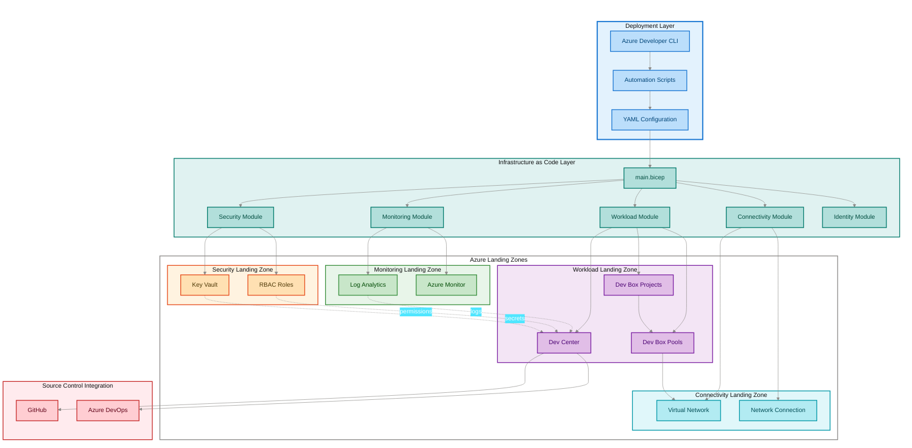

# Azure Dev Box Deployment Accelerator

[](LICENSE)
[](https://azure.microsoft.com/en-us/products/dev-box/)
[](https://learn.microsoft.com/en-us/azure/azure-resource-manager/bicep/)
[](https://learn.microsoft.com/en-us/powershell/)
[](https://learn.microsoft.com/en-us/azure/developer/azure-developer-cli/)

**Enterprise-grade Infrastructure as Code accelerator for deploying Microsoft
Dev Box environments with Azure Landing Zone best practices, automated GitHub
integration, and role-based access controls.**

## Overview

The Azure Dev Box Deployment Accelerator is a production-ready Infrastructure as
Code (IaC) solution that automates the provisioning and configuration of
[Microsoft Dev Box](https://learn.microsoft.com/en-us/azure/dev-box/)
environments following Azure Landing Zone architecture principles. This
accelerator dramatically reduces deployment time from weeks to hours while
ensuring security, compliance, and operational excellence through pre-configured
templates, automated workflows, and validated patterns.

> 💡 **Why This Matters**: Organizations struggle with consistent developer
> workstation provisioning across teams, leading to configuration drift,
> security vulnerabilities, and productivity loss. This accelerator provides a
> standardized, repeatable deployment pattern that ensures every developer gets
> a secure, fully-configured cloud workstation in minutes instead of days, while
> maintaining centralized governance and cost controls.

> 📌 **How It Works**: The solution uses Azure Developer CLI (`azd`)
> orchestration with modular Bicep templates organized by Azure Landing Zone
> principles—separating security, monitoring, connectivity, identity, and
> workload resources into distinct resource groups. Automated PowerShell and
> Bash scripts handle authentication, environment setup, and resource
> provisioning, while YAML configuration files enable declarative customization
> without touching infrastructure code. The entire deployment is idempotent,
> version-controlled, and supports both GitHub and Azure DevOps source control
> platforms.

### Key Capabilities

This accelerator delivers:

- **Automated Infrastructure Provisioning**: Deploy complete Dev Box
  environments with a single command (`azd up`)
- **Azure Landing Zone Architecture**: Pre-configured resource organization
  following Microsoft's Well-Architected Framework
- **Source Control Integration**: Native support for GitHub Enterprise and Azure
  DevOps with automated token management
- **Role-Based Access Control**: Granular permission templates for Dev Managers,
  Project Admins, and Dev Box Users
- **Centralized Monitoring**: Integrated Azure Monitor and Log Analytics for
  operational visibility
- **Security by Default**: Key Vault integration, managed identities, and
  network isolation patterns

## Architecture

**Overview**

The solution implements a hub-and-spoke architecture with clear separation of
concerns across five Azure Landing Zone layers, enabling enterprise-scale
deployment with centralized governance and distributed workload management.



### Component Responsibilities

| 🏗️ Component                     | 📋 Responsibility                                                               | 📍 Location                     |
| -------------------------------- | ------------------------------------------------------------------------------- | ------------------------------- |
| 🎯 **Azure Developer CLI**       | Orchestrates deployment lifecycle, manages environments, handles authentication | `azure.yaml` + `azure-pwh.yaml` |
| 🔧 **Automation Scripts**        | Platform-specific setup, token management, pre-provisioning hooks               | `setUp.ps1` + `setUp.sh`        |
| 📝 **Configuration Files**       | Declarative settings for resource organization, security, workload definitions  | `infra/settings/*.yaml`         |
| 🏢 **Security Landing Zone**     | Centralized secret storage, RBAC management, compliance policies                | `src/security/*.bicep`          |
| 📊 **Monitoring Landing Zone**   | Log aggregation, metrics collection, alerting infrastructure                    | `src/management/*.bicep`        |
| 💼 **Workload Landing Zone**     | Dev Center core, project definitions, Dev Box pool configurations               | `src/workload/*.bicep`          |
| 🌐 **Connectivity Landing Zone** | Virtual networks, network connections, subnet configurations                    | `src/connectivity/*.bicep`      |
| 🔐 **Identity Landing Zone**     | Managed identities, role assignments, Key Vault access policies                 | `src/identity/*.bicep`          |

### Data Flow

1. **Initialization**: Developer runs `azd up` → triggers pre-provisioning hooks
   in `setUp.ps1` or `setUp.sh`
2. **Authentication**: Scripts validate Azure CLI, Azure Developer CLI, and
   GitHub CLI credentials
3. **Configuration Loading**: Bicep templates load YAML settings from
   `infra/settings/` directory
4. **Resource Provisioning**: Subscription-level `main.bicep` deploys resource
   groups and calls modular Bicep files
5. **Secret Management**: GitHub token stored in Key Vault, referenced by Dev
   Center managed identity
6. **Catalog Sync**: Dev Center connects to GitHub repository for environment
   definitions and images
7. **Monitoring Setup**: All resources send diagnostic logs to centralized Log
   Analytics workspace

## Quick Start

**Overview**

Get a complete Dev Box environment running in 10 minutes with minimal
prerequisites—no Azure portal interaction required beyond initial
authentication.

> ⚠️ **Prerequisites Required**: Ensure you have active subscriptions and proper
> permissions before starting (see [Requirements](#requirements) section).

### 5-Minute Deployment

```bash
# 1. Clone the repository
git clone https://github.com/Evilazaro/DevExp-DevBox.git
cd DevExp-DevBox

# 2. Authenticate to Azure
az login
azd auth login

# 3. Initialize environment (creates .azure/<env-name>/.env file)
azd env new prod

# 4. Set required environment variables
azd env set SOURCE_CONTROL_PLATFORM github

# 5. Deploy infrastructure (provisions all Azure resources)
azd up
```

**Expected Output:**

```plaintext
✓ Initializing environment (prod)
✓ Running pre-provisioning hooks
✓ Provisioning Azure resources (main.bicep)
  ✓ Security Resource Group created
  ✓ Monitoring Resource Group created
  ✓ Workload Resource Group created
  ✓ Key Vault provisioned
  ✓ Log Analytics Workspace created
  ✓ Dev Center deployed
  ✓ Dev Box Projects configured
✓ Deployment completed successfully

Dev Center Name: devexp-devcenter-prod-eastus
Dev Box Projects: ["ProjectAlpha", "ProjectBeta"]
Resource Groups: devexp-security-prod-eastus-RG, devexp-monitoring-prod-eastus-RG
```

> 💡 **Post-Deployment**: Navigate to the
> [Azure Portal Dev Box dashboard](https://portal.azure.com/#view/Microsoft_Azure_DevBox/DevBoxPortalMenuBlade/~/overview)
> to create your first Dev Box instance by selecting a project and pool.

### Alternative: Windows PowerShell Deployment

```powershell
# Use native PowerShell script for Windows environments
.\setUp.ps1 -EnvName "prod" -SourceControl "github"
```

### Alternative: Linux/macOS Deployment

```bash
# Use Bash script for Unix-based systems
./setUp.sh -e prod -s github
```

> 📌 **Token Management**: The setup scripts automatically prompt for GitHub
> personal access token (PAT) if not provided. Token is securely stored in Azure
> Key Vault and never committed to source control.

## Deployment

**Overview**

Comprehensive deployment guide covering environment configuration,
multi-platform support, and troubleshooting for production-grade infrastructure
provisioning.

### Prerequisites Validation

Before deployment, verify all [requirements](#requirements) are met:

```powershell
# Check required tools
az --version          # Azure CLI >= 2.50.0
azd version           # Azure Developer CLI >= 1.5.0
gh --version          # GitHub CLI >= 2.30.0 (if using GitHub)
bicep --version       # Bicep >= 0.20.0

# Verify Azure authentication
az account show

# Test subscription access (requires Contributor role)
az account list-locations --query "[?name=='eastus']"
```

### Step 1: Repository Setup

```bash
# Clone production repository
git clone https://github.com/Evilazaro/DevExp-DevBox.git
cd DevExp-DevBox

# Create feature branch (optional, for customization)
git checkout -b feature/custom-deployment
```

### Step 2: Environment Configuration

```bash
# Create new azd environment (stores state in .azure/<env-name>/)
azd env new <environment-name>

# Example: Create separate environments for dev/test/prod
azd env new dev
azd env new test
azd env new prod
```

### Step 3: Required Parameters

Set mandatory configuration values:

```bash
# Required: Azure region for deployment
azd env set AZURE_LOCATION eastus

# Required: Source control platform (github or adogit)
azd env set SOURCE_CONTROL_PLATFORM github

# Optional: Customize resource naming suffix
azd env set ENVIRONMENT_NAME prod  # Default: extracted from azd env name
```

### Step 4: GitHub Token Setup (GitHub Platform Only)

> ⚠️ **Security Note**: Never commit tokens to source control. Use environment
> variables or script prompts.

**Option A: Interactive Prompt (Recommended)**

```bash
# Script prompts for token during deployment
azd up
# When prompted: Enter GitHub PAT with repo, admin:org, workflow scopes
```

**Option B: Pre-set Environment Variable**

```bash
# Set token before deployment (Linux/macOS)
export GITHUB_TOKEN="ghp_your_token_here"
azd up

# Set token before deployment (Windows PowerShell)
$env:GITHUB_TOKEN="ghp_your_token_here"
azd up
```

**GitHub PAT Scope Requirements:**

| ✅ Scope       | 📋 Purpose                                             |
| -------------- | ------------------------------------------------------ |
| 🔐 `repo`      | Access repository catalogs for environment definitions |
| 👥 `admin:org` | Manage organization-level Dev Box configurations       |
| 🔄 `workflow`  | Trigger GitHub Actions for image builds                |

> 💡 **Token Generation**: Visit
> [GitHub Settings → Developer settings → Personal access tokens → Fine-grained tokens](https://github.com/settings/tokens?type=beta)
> to create a new token.

### Step 5: Execute Deployment

**Automated Deployment (Recommended):**

```bash
# Deploy all resources with pre-provisioning hooks
azd up

# Deployment process:
# 1. Runs pre-provisioning script (setUp.ps1 or setUp.sh)
# 2. Validates authentication and tokens
# 3. Provisions Azure resources using main.bicep
# 4. Configures Dev Center with GitHub catalog
# 5. Creates projects and pools
```

**Manual Step-by-Step Deployment:**

```bash
# Option 1: Separate provision and deploy steps
azd provision  # Creates infrastructure only
azd deploy     # Deploys application code (if applicable)

# Option 2: Provision only (no application deployment)
azd provision
```

### Step 6: Verify Deployment

```bash
# List deployed resources
azd show

# Check resource group contents
az group list --query "[?contains(name, 'devexp')]" --output table

# Verify Dev Center deployment
az devcenter admin devcenter show \
  --name devexp-devcenter-prod-eastus \
  --resource-group devexp-workload-prod-eastus-RG
```

### Platform-Specific Deployments

**GitHub Platform (Default):**

```bash
# Uses GitHub for catalog hosting
azd env set SOURCE_CONTROL_PLATFORM github
azd up
```

**Azure DevOps Platform:**

```bash
# Uses Azure DevOps Git repositories
azd env set SOURCE_CONTROL_PLATFORM adogit
azd up
# Note: Requires Azure DevOps PAT with Code (Read), Project & Team (Read) scopes
```

### Deployment Time Estimates

| 📦 Deployment Scope                             | ⏱️ Typical Duration | 📊 Resource Count |
| ----------------------------------------------- | ------------------- | ----------------- |
| 🚀 **Minimal** (1 project, no pools)            | 8-12 minutes        | 6-8 resources     |
| 📦 **Standard** (2 projects, 2 pools/project)   | 15-20 minutes       | 12-16 resources   |
| 🏢 **Enterprise** (5+ projects, multiple pools) | 25-35 minutes       | 25-40 resources   |

> ⚠️ **First Deployment**: Initial deployment takes longer due to Azure provider
> registration and network peering setup. Subsequent deployments are 30-40%
> faster.

### Troubleshooting Common Issues

**Issue: `az: command not found`**

```bash
# Install Azure CLI: https://learn.microsoft.com/en-us/cli/azure/install-azure-cli
# Windows (PowerShell Admin):
winget install Microsoft.AzureCLI

# Linux (Ubuntu/Debian):
curl -sL https://aka.ms/InstallAzureCLIDeb | sudo bash

# macOS (Homebrew):
brew install azure-cli
```

**Issue: `GitHub token invalid or expired`**

```bash
# Test token validity
gh auth status

# Re-authenticate
gh auth login

# Refresh token in Key Vault
azd env set GITHUB_TOKEN "ghp_new_token"
azd up  # Re-deploys with updated token
```

**Issue: `Location 'X' does not support Dev Box`**

```bash
# Check supported regions
az provider show --namespace Microsoft.DevCenter \
  --query "resourceTypes[?resourceType=='devcenters'].locations"

# Use supported region (eastus, westus2, westeurope, etc.)
azd env set AZURE_LOCATION eastus
```

**Issue: `Insufficient subscription quota for Dev Box`**

```bash
# Check current quota
az vm list-usage --location eastus --query "[?localName=='Dev Box']"

# Request quota increase:
# 1. Navigate to: https://portal.azure.com/#view/Microsoft_Azure_Support/NewSupportRequestV3Blade
# 2. Issue type: Service and subscription limits (quotas)
# 3. Quota type: Dev Box
# 4. Request increase to desired limit
```

### Post-Deployment Steps

1. **Configure Dev Box Definitions**: Navigate to Azure Portal → Dev Center →
   Dev Box Definitions to customize VM sizes and images
2. **Assign User Permissions**: Grant `DevCenter Dev Box User` role to
   developers who need Dev Box access
3. **Create First Dev Box**: Users visit
   [Dev Portal](https://devportal.microsoft.com) to provision personal Dev Boxes
4. **Setup CI/CD Integration**: Configure GitHub Actions or Azure Pipelines to
   automate infrastructure updates

## Usage

**Overview**

Practical examples for common operations including environment creation,
multi-region deployment, and customization patterns for enterprise scenarios.

### Creating Your First Dev Box Environment

After successful deployment, developers create personal Dev Boxes through the
Dev Portal:

```bash
# 1. Authenticate to Dev Portal (browser-based)
# Visit: https://devportal.microsoft.com
# Sign in with Azure AD credentials

# 2. Select Project and Pool
# Project: "ProjectAlpha"
# Pool: "Windows11-VS2022-8core"

# 3. Provision Dev Box (takes 5-8 minutes)
# Name: "mydevbox-001"
# Auto-stop schedule: 6:00 PM EST
# Click "Create"
```

**Dev Box Ready State:**

```plaintext
✓ Dev Box Status: Running
✓ RDP Connection: Available (Download .rdp file)
✓ Browser Access: Available (via HTML5 client)
✓ Auto-stop: Scheduled for 6:00 PM EST
```

### Managing Multiple Projects

Deploy distinct Dev Box projects for team separation:

```yaml
# Edit infra/settings/workload/devcenter.yaml
projects:
  - name: 'FrontendTeam'
    description: 'React + TypeScript development'
    pools:
      - name: 'Ubuntu22-VSCode-4core'
        definition: 'Ubuntu2204-Standard'
        networkConnection: 'vnet-connection-01'

  - name: 'BackendTeam'
    description: '.NET 8 API development'
    pools:
      - name: 'Windows11-VS2022-8core'
        definition: 'Win11-Enterprise-VS2022'
        networkConnection: 'vnet-connection-01'
```

```bash
# Apply configuration changes
azd up  # Incrementally adds new projects without affecting existing ones
```

### Multi-Region Deployment

Deploy Dev Box infrastructure across multiple Azure regions for global teams:

```bash
# Region 1: East US (Americas)
azd env new prod-eastus
azd env set AZURE_LOCATION eastus
azd up

# Region 2: West Europe (EMEA)
azd env new prod-westeurope
azd env set AZURE_LOCATION westeurope
azd up

# Region 3: Southeast Asia (APAC)
azd env new prod-southeastasia
azd env set AZURE_LOCATION southeastasia
azd up
```

> 💡 **Hub-and-Spoke Architecture**: For enterprise deployments, consider
> deploying a shared hub VNet in one region with spoke VNets in each deployment
> region, connected via Virtual Network Peering for centralized connectivity.

### Customizing Resource Tags

Modify resource tagging for cost allocation and governance:

```yaml
# Edit infra/settings/resourceOrganization/azureResources.yaml
workload:
  tags:
    environment: prod
    division: Engineering
    team: PlatformEngineering
    project: GlobalDevBox
    costCenter: CC-1234
    owner: platform-team@contoso.com
    compliance: 'ISO-27001'
```

```bash
# Apply tag changes without redeploying resources
azd up  # Azure Resource Manager updates tags in-place
```

### Integrating Custom Catalogs

Add organization-specific environment definitions to Dev Center:

```yaml
# Edit infra/settings/workload/devcenter.yaml
catalogs:
  - name: 'ContosoTemplates'
    catalogType: 'GitHub'
    repoUrl: 'https://github.com/contoso/devcenter-catalog'
    branch: 'main'
    path: '/environments'
    secretIdentifier: '${SECRET_IDENTIFIER}' # References Key Vault secret
```

**Catalog Repository Structure:**

```plaintext
contoso/devcenter-catalog/
├── environments/
│   ├── azure-ml-workspace/
│   │   ├── manifest.yaml
│   │   └── main.bicep
│   ├── aks-cluster/
│   │   ├── manifest.yaml
│   │   └── main.bicep
│   └── sql-database/
│       ├── manifest.yaml
│       └── main.bicep
```

> 📌 **Catalog Requirements**: Each environment definition must include a
> `manifest.yaml` (metadata) and `main.bicep` (infrastructure). See
> [Dev Center Catalog documentation](https://learn.microsoft.com/en-us/azure/dev-box/how-to-configure-catalogs)
> for schema details.

### Updating Dev Box Images

Customize VM images for specific development stacks:

```bash
# 1. Create custom Azure Compute Gallery image
# See: https://learn.microsoft.com/en-us/azure/dev-box/how-to-customize-dev-box-images

# 2. Reference image in Dev Box Definition
# Portal: Dev Center → Dev Box Definitions → Add Definition
# Name: "CustomNodeJS-Ubuntu"
# Image: "/subscriptions/.../galleries/myGallery/images/nodejs-image/versions/1.0.0"
# Compute: 8 vCPU, 32 GB RAM
# Storage: 256 GB SSD

# 3. Create pool using custom definition
az devcenter admin pool create \
  --name "NodeJS-CustomImage-Pool" \
  --project-name "ProjectAlpha" \
  --dev-box-definition-name "CustomNodeJS-Ubuntu" \
  --network-connection "vnet-connection-01" \
  --location eastus \
  --resource-group devexp-workload-prod-eastus-RG
```

### Monitoring Dev Box Usage

Query operational metrics using Azure CLI:

```bash
# List all Dev Boxes in subscription
az devcenter dev dev-box list --dev-center devexp-devcenter-prod-eastus

# Get Dev Box status
az devcenter dev dev-box show \
  --name "mydevbox-001" \
  --project-name "ProjectAlpha"

# View auto-stop schedule
az devcenter admin schedule show \
  --pool-name "Windows11-VS2022-8core" \
  --project-name "ProjectAlpha" \
  --resource-group devexp-workload-prod-eastus-RG
```

**Cost Optimization Query (Azure Resource Graph):**

```kusto
// Query Dev Box costs by project
resources
| where type == "microsoft.devcenter/projects/pools/devboxes"
| extend project = split(id, '/')[8]
| extend vmSize = properties.devBoxDefinition.computeConfiguration.vmSize
| summarize DevBoxCount = count() by project, vmSize
| project project, vmSize, DevBoxCount,
    EstimatedMonthlyCost = DevBoxCount *
      case(vmSize contains "Standard_D8", 400,
           vmSize contains "Standard_D16", 800,
           vmSize contains "Standard_D32", 1600, 0)
```

### CI/CD Integration Example

Automate infrastructure updates via GitHub Actions:

```yaml
# .github/workflows/deploy-devbox.yml
name: Deploy Dev Box Infrastructure

on:
  push:
    branches: [main]
    paths:
      - 'infra/**'
      - 'src/**'

jobs:
  deploy:
    runs-on: ubuntu-latest
    steps:
      - uses: actions/checkout@v4

      - name: Install azd
        uses: Azure/setup-azd@v1

      - name: Azure Login
        uses: azure/login@v1
        with:
          creds: ${{ secrets.AZURE_CREDENTIALS }}

      - name: Deploy Infrastructure
        run: |
          azd env new prod --subscription ${{ secrets.AZURE_SUBSCRIPTION_ID }}
          azd env set AZURE_LOCATION eastus
          azd env set SOURCE_CONTROL_PLATFORM github
          azd up --no-prompt
        env:
          GITHUB_TOKEN: ${{ secrets.GH_CATALOG_TOKEN }}
```

## Features

**Overview**

Comprehensive capabilities designed for enterprise-scale developer productivity,
governance, and operational excellence across distributed teams.

> 💡 **Enterprise Focus**: Built from the ground up to support Fortune 500-scale
> deployments with 1,000+ developers across multiple geographic regions,
> business units, and compliance boundaries.

> 📌 **Modular Architecture**: Each feature is implemented as an isolated Bicep
> module with well-defined interfaces, enabling selective adoption and
> customization without affecting other components.

### Core Capabilities

| 🎯 Feature                     | 📋 Description                                                                                    | 📍 Implementation                                          | ✅ Status |
| ------------------------------ | ------------------------------------------------------------------------------------------------- | ---------------------------------------------------------- | --------- |
| 🏗️ **Infrastructure as Code**  | Declarative Bicep templates with version control, automated validation, and idempotent deployment | `infra/main.bicep` + `src/**/*.bicep`                      | ✅ Stable |
| 🏢 **Azure Landing Zones**     | Segregated resource groups for security, monitoring, connectivity, identity, and workload tiers   | `infra/settings/resourceOrganization/azureResources.yaml`  | ✅ Stable |
| 🔐 **Security Hardening**      | Key Vault secret management, managed identities, RBAC templates, network isolation                | `src/security/*.bicep` + `src/identity/*.bicep`            | ✅ Stable |
| 📊 **Operational Monitoring**  | Centralized Log Analytics, diagnostic settings, Azure Monitor integration                         | `src/management/logAnalytics.bicep`                        | ✅ Stable |
| 🔄 **Multi-Platform SCM**      | GitHub and Azure DevOps catalog integration with automated token rotation                         | `setUp.ps1` + `setUp.sh`                                   | ✅ Stable |
| 🌐 **Network Connectivity**    | Virtual network provisioning, subnet management, network connections                              | `src/connectivity/*.bicep`                                 | ✅ Stable |
| 👥 **Role-Based Access**       | Pre-configured RBAC templates for Dev Managers, Project Admins, Dev Box Users                     | `infra/settings/workload/devcenter.yaml` (roleAssignments) | ✅ Stable |
| 🖥️ **Dev Box Management**      | Project creation, pool configuration, VM definition management, auto-stop scheduling              | `src/workload/project/*.bicep`                             | ✅ Stable |
| 📦 **Catalog Provisioning**    | Automated environment definition sync from GitHub/ADO repositories                                | `src/workload/core/devCenter.bicep`                        | ✅ Stable |
| 🚀 **One-Command Deployment**  | Single `azd up` command handles authentication, provisioning, and configuration                   | `azure.yaml` (hooks)                                       | ✅ Stable |
| 🔧 **Customization Framework** | YAML-driven configuration for tags, naming, regions, and feature toggles                          | `infra/settings/**/*.yaml`                                 | ✅ Stable |
| 💰 **Cost Optimization**       | Resource tagging for chargeback, rightsizing recommendations, auto-stop schedules                 | Cross-cutting (tags + schedules)                           | ✅ Stable |

### Advanced Features

| 🎯 Feature                        | 📋 Description                                                                       | 📍 Implementation                                           | ✅ Status |
| --------------------------------- | ------------------------------------------------------------------------------------ | ----------------------------------------------------------- | --------- |
| 🔄 **Idempotent Deployment**      | Re-run `azd up` safely without duplicating resources or causing drift                | Bicep resource conditions + `existing` resources            | ✅ Stable |
| 🧩 **Modular Bicep Architecture** | Composable modules for selectively deploying security, connectivity, workload layers | `src/{security,connectivity,workload,identity,management}/` | ✅ Stable |
| 📝 **Configuration Validation**   | JSON schemas enforce correctness of YAML configuration files                         | `infra/settings/**/*.schema.json`                           | ✅ Stable |
| 🏷️ **Tagging Strategy**           | Automated tagging for environment, cost center, owner, compliance, landing zone      | `azureResources.yaml` (tags property)                       | ✅ Stable |
| 🔍 **Pre-Flight Checks**          | Automated validation of Azure CLI, azd, gh authentication before provisioning        | `setUp.ps1` / `setUp.sh` (validation blocks)                | ✅ Stable |
| 📊 **Multi-Project Support**      | Deploy isolated Dev Box projects for teams with independent pools and catalogs       | `devcenter.yaml` (projects array)                           | ✅ Stable |
| 🌍 **Multi-Region Deployment**    | Replicate infrastructure across Azure regions for global developer distribution      | `azd env` per region pattern                                | ✅ Stable |
| 🔐 **Token Management**           | Secure storage of GitHub/ADO PATs in Key Vault with automatic Dev Center binding     | `setUp.ps1` + `src/security/secret.bicep`                   | ✅ Stable |
| 📋 **Resource Output Variables**  | Bicep outputs expose resource IDs for downstream automation and integration          | `.bicep` output declarations                                | ✅ Stable |
| 🛡️ **Azure Policy Integration**   | Compatible with Azure Policy assignments for compliance and governance               | Policy-compliant resource configurations                    | ✅ Stable |

### Planned Features

| 🎯 Feature                   | 📋 Description                                                                  | 🗓️ Target Timeline |
| ---------------------------- | ------------------------------------------------------------------------------- | ------------------ |
| 🔄 **CI/CD Templates**       | Pre-built GitHub Actions and Azure Pipelines workflows for automated deployment | 🔄 Q2 2026         |
| 📊 **Cost Dashboards**       | Azure Workbook templates for Dev Box cost analysis and optimization             | 🔄 Q2 2026         |
| 🖼️ **Custom Image Pipeline** | Automated image building with Packer and Azure Image Builder                    | 🔄 Q3 2026         |
| 🌐 **Terraform Support**     | Alternative IaC implementation using Terraform modules                          | 🔄 Q3 2026         |

> ⚠️ **Feature Requests**: Submit enhancement requests via
> [GitHub Issues](https://github.com/Evilazaro/DevExp-DevBox/issues) using the
> Feature template. See [CONTRIBUTING.md](CONTRIBUTING.md) for guidelines.

## Requirements

**Overview**

Comprehensive prerequisite checklist covering tools, permissions, quotas, and
configurations required for successful deployment across different
organizational contexts.

### Required Tools

| 🛠️ Tool                          | 📦 Minimum Version | 📥 Installation                                                                                                       | 🔍 Verification             |
| -------------------------------- | ------------------ | --------------------------------------------------------------------------------------------------------------------- | --------------------------- |
| ⚙️ **Azure CLI**                 | 2.50.0             | [Install Guide](https://learn.microsoft.com/en-us/cli/azure/install-azure-cli)                                        | `az --version`              |
| 🚀 **Azure Developer CLI (azd)** | 1.5.0              | [Install Guide](https://learn.microsoft.com/en-us/azure/developer/azure-developer-cli/install-azd)                    | `azd version`               |
| 🐙 **GitHub CLI (gh)**           | 2.30.0             | [Install Guide](https://cli.github.com/)                                                                              | `gh --version`              |
| 📜 **Bicep CLI**                 | 0.20.0             | [Install Guide](https://learn.microsoft.com/en-us/azure/azure-resource-manager/bicep/install)                         | `bicep --version`           |
| 💻 **PowerShell**                | 7.2+ (Windows)     | Pre-installed / [Install Guide](https://learn.microsoft.com/en-us/powershell/scripting/install/installing-powershell) | `$PSVersionTable.PSVersion` |
| 🐚 **Bash**                      | 4.0+ (Linux/macOS) | Pre-installed                                                                                                         | `bash --version`            |

> ⚠️ **Windows Users**: PowerShell 7+ is recommended over Windows PowerShell 5.1
> for cross-platform script compatibility and better error handling.

### Azure Subscription Requirements

| 🔐 Requirement                   | 📋 Details                                                             | 🔍 Verification                                                                        |
| -------------------------------- | ---------------------------------------------------------------------- | -------------------------------------------------------------------------------------- |
| ✅ **Active Subscription**       | Valid Azure subscription with billing enabled                          | `az account show`                                                                      |
| 👤 **Contributor Role**          | Subscription-level Contributor or Owner role for resource provisioning | `az role assignment list --assignee <user@domain.com> --scope /subscriptions/<sub-id>` |
| 🔑 **User Access Administrator** | Required to assign RBAC roles for Dev Center managed identity          | Same as above (check for User Access Administrator)                                    |
| 📊 **Sufficient Quota**          | Standard compute quota for Dev Box VM families (D-series, F-series)    | `az vm list-usage --location eastus`                                                   |
| 🌍 **Supported Regions**         | Deployment in Dev Box-supported Azure regions                          | See [Region Support](#supported-azure-regions)                                         |

### GitHub Requirements (GitHub Platform Only)

| 🔐 Requirement               | 📋 Details                                                                 | 🔍 Verification                                                                        |
| ---------------------------- | -------------------------------------------------------------------------- | -------------------------------------------------------------------------------------- |
| 🐙 **GitHub Account**        | Organization or personal account with repository access                    | `gh auth status`                                                                       |
| 🔑 **Personal Access Token** | Fine-grained or classic PAT with `repo`, `admin:org`, `workflow` scopes    | Test token: `curl -H "Authorization: token $GITHUB_TOKEN" https://api.github.com/user` |
| 📦 **Catalog Repository**    | GitHub repository containing Dev Center environment definitions (optional) | Repository must be accessible to authenticated user                                    |
| 🏢 **Organization Access**   | For organization-owned repositories, user must have appropriate role       | `gh api /orgs/<org-name>/memberships/<username>`                                       |

**GitHub PAT Creation:**

1. Navigate to
   [GitHub Settings → Developer settings → Personal access tokens](https://github.com/settings/tokens)
2. Click **Generate new token** → **Generate new token (classic)** or
   **Fine-grained tokens**
3. Set expiration (recommended: 90-180 days)
4. Select scopes: `repo` (Full control of private repositories), `admin:org`
   (Manage organizations), `workflow` (Update GitHub Actions workflows)
5. Click **Generate token** → Copy token immediately (not shown again)

### Azure DevOps Requirements (Azure DevOps Platform Only)

| 🔐 Requirement                   | 📋 Details                                             | 🔍 Verification                                                       |
| -------------------------------- | ------------------------------------------------------ | --------------------------------------------------------------------- |
| 🔷 **Azure DevOps Organization** | Active organization with project access                | `az devops login`                                                     |
| 🔑 **Personal Access Token**     | PAT with `Code (Read)`, `Project & Team (Read)` scopes | Test PAT: `curl -u :<PAT> https://dev.azure.com/<org>/_apis/projects` |
| 📦 **Git Repository**            | Repository containing environment definitions          | Repository must be accessible to PAT                                  |

### Supported Azure Regions

Dev Box is available in the following regions (as of February 2026):

| 🌍 Region Code     | 📍 Display Name | 🏢 Recommended For           |
| ------------------ | --------------- | ---------------------------- |
| 🇺🇸 `eastus`        | East US         | Americas, general            |
| 🇺🇸 `eastus2`       | East US 2       | Americas, disaster recovery  |
| 🇺🇸 `westus2`       | West US 2       | Americas West Coast          |
| 🇺🇸 `westus3`       | West US 3       | Americas, availability zones |
| 🇺🇸 `centralus`     | Central US      | Americas central             |
| 🇪🇺 `northeurope`   | North Europe    | EMEA, Ireland                |
| 🇪🇺 `westeurope`    | West Europe     | EMEA, Netherlands            |
| 🇬🇧 `uksouth`       | UK South        | UK operations                |
| 🇨🇦 `canadacentral` | Canada Central  | Canadian data residency      |
| 🇸🇬 `southeastasia` | Southeast Asia  | APAC                         |
| 🇯🇵 `japaneast`     | Japan East      | Japan operations             |
| 🇦🇺 `australiaeast` | Australia East  | Australia, New Zealand       |

> ⚠️ **Region Selection**: Choose regions based on user proximity for optimal
> latency. For enterprise deployments, consider deploying in multiple regions
> with Azure Virtual Network peering.

### Network Requirements

| 🌐 Requirement           | 📋 Details                                                      | 🔍 Configuration                                       |
| ------------------------ | --------------------------------------------------------------- | ------------------------------------------------------ |
| 🔌 **Virtual Network**   | Dedicated VNet for Dev Box network connections                  | Automatically created by `src/connectivity/vnet.bicep` |
| 📡 **Subnet**            | Minimum /27 subnet (32 addresses) for Dev Box VMs               | Configured in `src/connectivity/vnet.bicep`            |
| 🚪 **Outbound Internet** | Outbound connectivity for Windows Update, Visual Studio, GitHub | Network Security Group allows outbound by default      |
| 🔒 **Private Endpoints** | (Optional) Private endpoints for Key Vault, Log Analytics       | Not configured by default, requires manual setup       |

### Resource Provider Registration

The following Azure resource providers must be registered in your subscription:

```bash
# Register required providers
az provider register --namespace Microsoft.DevCenter
az provider register --namespace Microsoft.Network
az provider register --namespace Microsoft.KeyVault
az provider register --namespace Microsoft.OperationalInsights
az provider register --namespace Microsoft.ManagedIdentity

# Verify registration status (should show "Registered")
az provider show --namespace Microsoft.DevCenter --query "registrationState"
```

> 💡 **Auto-Registration**: Most subscriptions auto-register providers on first
> resource creation. Manual registration ensures pre-flight validation passes.

### Cost Estimation

Approximate monthly costs for typical deployments (US East region, pay-as-you-go
pricing):

| 💰 Configuration  | 📊 Resources                                                        | 💵 Estimated Monthly Cost |
| ----------------- | ------------------------------------------------------------------- | ------------------------- |
| 🧪 **Dev/Test**   | 1 Dev Center, 1 Project, 2 Dev Boxes (Standard_D8s_v4, 40h/week)    | $400-500 USD              |
| 📦 **Team**       | 1 Dev Center, 2 Projects, 10 Dev Boxes (Standard_D8s_v4, 40h/week)  | $2,000-2,500 USD          |
| 🏢 **Enterprise** | 1 Dev Center, 5 Projects, 50 Dev Boxes (Standard_D16s_v4, 50h/week) | $12,000-15,000 USD        |

> ⚠️ **Cost Variables**: Actual costs vary based on VM size, running hours,
> storage type, network egress, and Log Analytics ingestion. Use
> [Azure Pricing Calculator](https://azure.microsoft.com/en-us/pricing/calculator/)
> for precise estimates.

**Cost Optimization Tips:**

- ✅ Enable auto-stop schedules (configured in `devcenter.yaml` pools)
- ✅ Right-size VM SKUs based on workload requirements
- ✅ Use Azure Hybrid Benefit for Windows licenses (if applicable)
- ✅ Implement resource tags for cost allocation and chargeback

## Configuration

**Overview**

YAML-based declarative configuration system enabling infrastructure
customization without modifying Bicep code, with JSON schema validation for type
safety and correctness guarantees.

### Configuration File Structure

All configuration files reside in `infra/settings/` with corresponding JSON
schemas for validation:

```plaintext
infra/settings/
├── resourceOrganization/
│   ├── azureResources.yaml         # Resource group organization and tagging
│   └── azureResources.schema.json  # JSON schema for validation
├── security/
│   ├── security.yaml                # Key Vault and secrets configuration
│   └── security.schema.json         # JSON schema for validation
└── workload/
    ├── devcenter.yaml               # Dev Center, projects, pools, catalogs
    └── devcenter.schema.json        # JSON schema for validation
```

### Resource Organization Configuration

**File:** `infra/settings/resourceOrganization/azureResources.yaml`

Defines resource group structure and tagging strategy:

```yaml
# Landing Zones follow Azure Cloud Adoption Framework patterns
workload:
  create: true
  name: devexp-workload
  description: 'Developer workload resources (Dev Center, Projects)'
  tags:
    environment: prod
    division: Engineering
    team: PlatformTeam
    project: AzureDevBox
    costCenter: CC-0001
    owner: devops@contoso.com
    landingZone: Workload

security:
  create: true
  name: devexp-security
  description: 'Security resources (Key Vault, RBAC)'
  tags:
    environment: prod
    division: Security
    team: SecOps
    project: AzureDevBox
    costCenter: CC-0001
    owner: security@contoso.com
    landingZone: Security

monitoring:
  create: true
  name: devexp-monitoring
  description: 'Monitoring resources (Log Analytics)'
  tags:
    environment: prod
    division: Operations
    team: SRE
    project: AzureDevBox
    costCenter: CC-0001
    owner: sre@contoso.com
    landingZone: Monitoring
```

**Customization Use Cases:**

- **Cost Allocation**: Update `costCenter` and `owner` tags for chargeback
  reporting
- **Existing Resource Groups**: Set `create: false` and provide existing
  resource group name in `name` field
- **Tagging Strategy**: Add custom tags (e.g., `compliance: "SOC2"`,
  `dataClassification: "Confidential"`)

### Dev Center Configuration

**File:** `infra/settings/workload/devcenter.yaml`

Defines Dev Center core settings, projects, pools, and catalog integrations:

```yaml
# Dev Center Core
name: 'devexp-devcenter'
catalogItemSyncEnableStatus: 'Enabled'
microsoftHostedNetworkEnableStatus: 'Enabled' # Use Microsoft-managed networking
installAzureMonitorAgentEnableStatus: 'Enabled'

# Identity and RBAC
identity:
  type: 'SystemAssigned'
  roleAssignments:
    devCenter:
      - id: 'b24988ac-6180-42a0-ab88-20f7382dd24c' # Contributor
        name: 'Contributor'
        scope: 'Subscription'
    orgRoleTypes:
      devManager:
        - id: '331c37c6-af14-46d9-b9f4-e1909e1b95a0' # DevCenter Project Admin
          name: 'DevCenter Project Admin'
          scope: 'Subscription'

# Catalogs (GitHub or Azure DevOps)
catalogs:
  - name: 'ContosoTemplates'
    catalogType: 'GitHub'
    repoUrl: 'https://github.com/contoso/devcenter-catalog'
    branch: 'main'
    path: '/environments'
    secretIdentifier: '${SECRET_IDENTIFIER}'

# Environment Types
environmentTypes:
  - name: 'Development'
    tags: { environment: 'dev' }
  - name: 'Testing'
    tags: { environment: 'test' }
  - name: 'Production'
    tags: { environment: 'prod' }

# Projects and Pools
projects:
  - name: 'WebDevelopment'
    description: 'Frontend and backend web development teams'

    catalogs:
      - name: 'ContosoTemplates'

    environmentTypes:
      - name: 'Development'
        deploymentTargetId: '/subscriptions/<sub-id>/resourceGroups/devexp-workload-prod-eastus-RG'
        status: 'Enabled'

    pools:
      - name: 'Frontend-Ubuntu'
        devBoxDefinition: 'Ubuntu22-VSCode-8core'
        networkConnection: 'vnet-connection-eastus-01'
        licenseType: 'Linux'
        localAdministrator: 'Enabled'
        schedule:
          - name: 'AutoStop-Evening'
            type: 'StopDevBox'
            frequency: 'Daily'
            time: '18:00'
            timeZone: 'America/New_York'
            state: 'Enabled'

      - name: 'Backend-Windows'
        devBoxDefinition: 'Win11-VS2022-16core'
        networkConnection: 'vnet-connection-eastus-01'
        licenseType: 'Windows_Client'
        localAdministrator: 'Enabled'
        schedule:
          - name: 'AutoStop-Evening'
            type: 'StopDevBox'
            frequency: 'Daily'
            time: '18:00'
            timeZone: 'America/New_York'
            state: 'Enabled'

    identity:
      type: 'SystemAssignedManagedIdentity'

    tags:
      projectOwner: 'web-team@contoso.com'
      costCenter: 'CC-0002'
```

**Customization Examples:**

**Add New Project:**

```yaml
projects:
  - name: 'DataScience'
    description: 'ML and data engineering workloads'
    pools:
      - name: 'Python-GPU'
        devBoxDefinition: 'Ubuntu22-CUDA-NV6'
        networkConnection: 'vnet-connection-eastus-01'
        licenseType: 'Linux'
```

**Configure Auto-Stop Schedules:**

```yaml
schedule:
  - name: 'Weekend-Shutdown'
    type: 'StopDevBox'
    frequency: 'Weekly'
    time: '20:00'
    timeZone: 'America/New_York'
    state: 'Enabled'
    daysOfWeek: ['Saturday', 'Sunday']
```

**Multi-Catalog Configuration:**

```yaml
catalogs:
  - name: 'OfficialTemplates'
    catalogType: 'GitHub'
    repoUrl: 'https://github.com/microsoft/devcenter-catalog'
    branch: 'main'
    path: '/'
  - name: 'ContosoCustom'
    catalogType: 'GitHub'
    repoUrl: 'https://github.com/contoso/custom-templates'
    branch: 'production'
    path: '/templates'
```

### Security Configuration

**File:** `infra/settings/security/security.yaml`

Defines Key Vault settings and secret management:

```yaml
keyVault:
  name: 'devexp-kv'
  sku: 'standard'
  enableRbacAuthorization: true
  enableSoftDelete: true
  softDeleteRetentionInDays: 90
  enablePurgeProtection: true
  networkAcls:
    defaultAction: 'Allow' # Set to "Deny" for private endpoint-only access
    bypass: 'AzureServices'

secrets:
  - name: 'GitHubAccessToken'
    description: 'GitHub PAT for catalog sync'
    contentType: 'text/plain'
    tags:
      purpose: 'devcenter-catalog'
      rotation: '90-days'
```

**Security Hardening Options:**

**Enable Private Endpoint-Only Access:**

```yaml
keyVault:
  networkAcls:
    defaultAction: 'Deny'
    bypass: 'AzureServices'
    ipRules: []
    virtualNetworkRules:
      - id: '/subscriptions/<sub-id>/resourceGroups/<rg>/providers/Microsoft.Network/virtualNetworks/<vnet>/subnets/<subnet>'
```

**Rotate Secrets (Manual Process):**

```bash
# Generate new GitHub PAT
gh auth refresh -s repo,admin:org,workflow

# Update Key Vault secret
az keyvault secret set \
  --vault-name devexp-kv-prod-eastus \
  --name GitHubAccessToken \
  --value "ghp_new_token_here"

# Dev Center automatically picks up updated secret within 5 minutes
```

### Configuration Validation

**Schema Validation:**

All YAML files are validated against JSON schemas during development:

```bash
# Install YAML language server extension in VS Code
# Extension ID: redhat.vscode-yaml

# Schema auto-detection from yaml-language-server comment in YAML files:
# yaml-language-server: $schema=./devcenter.schema.json
```

**Pre-Deployment Validation:**

```bash
# Bicep linting and validation
az bicep build --file infra/main.bicep

# Test configuration loading
bicep build-params infra/main.parameters.json
```

### Environment-Specific Configurations

Deploy different configurations per environment using `azd` environment
variables:

```bash
# Development environment
azd env new dev
azd env set ENVIRONMENT_NAME dev
azd env set AZURE_LOCATION eastus2
# Edit infra/settings/**/*.yaml files with dev-specific settings
azd up

# Production environment
azd env new prod
azd env set ENVIRONMENT_NAME prod
azd env set AZURE_LOCATION eastus
# Edit infra/settings/**/*.yaml files with prod-specific settings
azd up
```

> 💡 **Configuration Override Pattern**: Use environment-specific configuration
> files (e.g., `azureResources.dev.yaml`, `azureResources.prod.yaml`) and load
> dynamically via Bicep `environment()` function for advanced scenarios.

### Configuration Best Practices

| ✅ Practice                    | 📋 Description                                                          | 🔍 Example                                                               |
| ------------------------------ | ----------------------------------------------------------------------- | ------------------------------------------------------------------------ |
| 🏷️ **Consistent Tagging**      | Apply standardized tags across all resources                            | `environment`, `costCenter`, `owner` in all resource groups              |
| 🔐 **Secrets Externalization** | Never commit secrets to Git; use Key Vault + environment variables      | `secretIdentifier: "${SECRET_IDENTIFIER}"` leverages Key Vault reference |
| 📋 **Schema Validation**       | Enable YAML schema validation in IDE for early error detection          | VS Code + redhat.vscode-yaml extension                                   |
| 🔄 **Version Control**         | Track all configuration changes via Git with meaningful commit messages | `git commit -m "feat: add DataScience project with GPU pools"`           |
| 📝 **Documentation**           | Document custom configurations in inline YAML comments                  | `# Custom pool for ML workloads with NVIDIA A100 GPUs`                   |
| 🧪 **Environment Parity**      | Maintain separate but equivalent configurations for dev/test/prod       | Consistent structure, different values (compute SKUs, regions, tags)     |

## Contributing

**Overview**

Comprehensive contribution guidelines covering branching strategies, issue
management, pull request workflows, and code quality standards aligned with the
project's product-oriented delivery model.

> 💡 **Product-Oriented Model**: This project follows **Epic → Feature → Task**
> hierarchy for structured, measurable delivery. See
> [CONTRIBUTING.md](CONTRIBUTING.md) for complete guidelines.

### Getting Started

1. **Fork the repository** on GitHub
2. Clone your fork locally:
   ```bash
   git clone https://github.com/YOUR-USERNAME/DevExp-DevBox.git
   cd DevExp-DevBox
   ```
3. Add upstream remote:
   ```bash
   git remote add upstream https://github.com/Evilazaro/DevExp-DevBox.git
   ```

### Issue Management

**Issue Types** (use GitHub Issue Forms):

| 🏷️ Type        | 📋 Purpose                                        | 🔗 Template                          |
| -------------- | ------------------------------------------------- | ------------------------------------ |
| 🎯 **Epic**    | Measurable outcome delivering business capability | `.github/ISSUE_TEMPLATE/epic.yml`    |
| ✨ **Feature** | Concrete, testable deliverable within an Epic     | `.github/ISSUE_TEMPLATE/feature.yml` |
| ✅ **Task**    | Small, verifiable unit of work inside a Feature   | `.github/ISSUE_TEMPLATE/task.yml`    |

**Required Labels** (all issues must have):

- **Type**: `type:epic` OR `type:feature` OR `type:task`
- **Area** (one or more): `area:dev-box`, `area:dev-center`, `area:networking`,
  `area:identity-access`, `area:governance`, `area:images`, `area:automation`,
  `area:monitoring`, `area:operations`, `area:documentation`
- **Priority**: `priority:p0` (critical) / `priority:p1` (high) / `priority:p2`
  (normal)
- **Status**: `status:triage` → `status:ready` → `status:in-progress` →
  `status:done`

**Linking Rules:**

- Every **Feature** MUST link its **Parent Epic** (e.g., `Parent: #101`)
- Every **Task** MUST link its **Parent Feature** (e.g., `Parent: #202`)
- Use GitHub's task list syntax in Epic/Feature descriptions to track children

### Branching Strategy

```bash
# Branch naming convention
<type>/<issue-number>-<short-description>

# Examples
feature/123-add-terraform-support
task/456-update-bicep-linting
bugfix/789-fix-keyvault-permissions
```

**Branch Types:**

| 🌿 Type        | 📋 Purpose                           | 🔗 Prefix  |
| -------------- | ------------------------------------ | ---------- |
| ✨ **Feature** | New capabilities or enhancements     | `feature/` |
| ✅ **Task**    | Incremental work within a feature    | `task/`    |
| 🐛 **Bugfix**  | Bug fixes                            | `bugfix/`  |
| 📝 **Docs**    | Documentation updates                | `docs/`    |
| 🔧 **Chore**   | Maintenance tasks (CI, dependencies) | `chore/`   |

### Making Changes

1. **Create feature branch:**

   ```bash
   git checkout -b feature/123-multi-region-support
   ```

2. **Make changes following standards:**
   - **Bicep**: Follow
     [Azure Bicep Best Practices](https://learn.microsoft.com/en-us/azure/azure-resource-manager/bicep/best-practices)
   - **PowerShell**: Use PowerShell 7+ syntax, follow
     [PowerShell Practice and Style Guide](https://poshcode.gitbook.io/powershell-practice-and-style/)
   - **YAML**: Validate against JSON schemas in
     `infra/settings/**/*.schema.json`
   - **Documentation**: Update README.md sections relevant to your changes

3. **Test changes:**

   ```bash
   # Validate Bicep syntax
   az bicep build --file infra/main.bicep

   # Test deployment in dev environment
   azd env new test-feature-123
   azd up

   # Verify resources deployed correctly
   az group list --query "[?contains(name, 'test-feature')]"
   ```

4. **Commit with conventional commits:**

   ```bash
   # Format: <type>(<scope>): <subject>
   git commit -m "feat(networking): add multi-region VNet peering"
   git commit -m "fix(security): correct Key Vault RBAC permissions"
   git commit -m "docs(readme): update deployment instructions"
   ```

   **Commit Types**: `feat`, `fix`, `docs`, `style`, `refactor`, `test`, `chore`

### Pull Request Process

1. **Push branch to your fork:**

   ```bash
   git push origin feature/123-multi-region-support
   ```

2. **Create Pull Request** on GitHub:
   - Title: `[Feature #123] Add multi-region VNet peering support`
   - Description: Use PR template (auto-populated)
   - Link to issue: `Closes #123`
   - Add reviewers: `@Evilazaro` + area experts
   - Labels: `type:feature`, `area:networking`, `status:review`

3. **PR Requirements** (all must pass):
   - [ ] All CI checks passing (Bicep validation, linting)
   - [ ] No merge conflicts with `main` branch
   - [ ] At least 1 approving review from maintainer
   - [ ] All review comments addressed
   - [ ] Documentation updated (if applicable)
   - [ ] Issue linked and properly closed

4. **Merge Strategy:**
   - **Squash and Merge** (default) for feature/task branches
   - **Rebase and Merge** for hotfixes maintaining history
   - Delete branch after merge

### Code Quality Standards

**Bicep Quality Checklist:**

- [ ] All parameters have `@description()` annotations
- [ ] Resource names use consistent variable conventions
- [ ] Outputs declared for resources needing downstream reference
- [ ] No hardcoded values (use parameters or variables)
- [ ] Resources deployed to appropriate landing zones
- [ ] Proper dependency ordering (implicit via resource references)
- [ ] Tags applied via `union()` with base tag object

**PowerShell Quality Checklist:**

- [ ] `#Requires -Version 7.2` at top of script
- [ ] Comprehensive comment-based help (`.SYNOPSIS`, `.DESCRIPTION`, `.EXAMPLE`)
- [ ] Parameter validation (`[ValidateSet()]`, `[ValidateNotNullOrEmpty()]`)
- [ ] Error handling with `try/catch` blocks
- [ ] Write-Verbose for operational logging
- [ ] Exit codes: 0 (success), non-zero (failure)

**YAML Quality Checklist:**

- [ ] Schema reference in first line:
      `# yaml-language-server: $schema=./file.schema.json`
- [ ] Consistent indentation (2 spaces)
- [ ] Comments explaining non-obvious configurations
- [ ] No sensitive data (tokens, passwords) in files

### Testing Guidelines

**Deployment Testing:**

```bash
# 1. Create isolated test environment
azd env new test-pr-123
azd env set AZURE_LOCATION eastus2  # Use different region than prod

# 2. Deploy infrastructure
azd up

# 3. Verify resource creation
az resource list --resource-group devexp-workload-test-pr-123-eastus2-RG

# 4. Test Dev Center functionality
az devcenter admin devcenter show \
  --name devexp-devcenter-test-pr-123-eastus2 \
  --resource-group devexp-workload-test-pr-123-eastus2-RG

# 5. Clean up test resources
azd down --force --purge
```

**Validation Testing:**

```bash
# Bicep linting
az bicep lint --file infra/main.bicep

# PowerShell static analysis
Install-Module -Name PSScriptAnalyzer -Scope CurrentUser
Invoke-ScriptAnalyzer -Path setUp.ps1 -Recurse

# YAML validation (VS Code + redhat.vscode-yaml extension)
# Errors shown inline in editor
```

### Documentation Updates

When adding features or changing behavior, update relevant documentation:

| 📝 File                              | 🔄 Update When                                          |
| ------------------------------------ | ------------------------------------------------------- |
| 📄 `README.md`                       | Major features, deployment steps, configuration options |
| 📋 `CONTRIBUTING.md`                 | Contribution process, development guidelines            |
| 📊 `infra/settings/**/*.yaml`        | New configuration properties, default values            |
| 📐 `infra/settings/**/*.schema.json` | New YAML properties (add JSON schema definitions)       |
| 📦 `azure.yaml`                      | New azd hooks, services, or deployment steps            |

**Documentation Standards:**

- Use clear, concise language (avoid jargon without explanation)
- Provide code examples for complex operations
- Include links to official Microsoft documentation where applicable
- Update Table of Contents if adding new sections (>150 lines)
- Test all command examples before committing

### Communication Channels

| 💬 Channel                | 📋 Purpose                                  | 🔗 Link                                                               |
| ------------------------- | ------------------------------------------- | --------------------------------------------------------------------- |
| 🐛 **GitHub Issues**      | Bug reports, feature requests, tasks        | [Issues](https://github.com/Evilazaro/DevExp-DevBox/issues)           |
| 🔄 **GitHub Discussions** | Questions, ideas, community support         | [Discussions](https://github.com/Evilazaro/DevExp-DevBox/discussions) |
| 📩 **Email**              | Security vulnerabilities, private inquiries | (See [SECURITY.md](SECURITY.md) when available)                       |

### Recognition

Contributors are recognized in:

- GitHub Contributors page (automatic)
- Release notes for significant contributions
- Special acknowledgments for major features or refactors

> ❤️ **Thank You**: Every contribution, no matter how small, helps improve this
> accelerator for the entire community. Your time and expertise are greatly
> appreciated!

## License

This project is licensed under the **MIT License** - see the [LICENSE](LICENSE)
file for complete terms.

**SPDX-License-Identifier:** MIT

### Permissions

✅ **Permitted**:

- ✓ Commercial use
- ✓ Modification
- ✓ Distribution
- ✓ Private use

### Conditions

📋 **Required**:

- ℹ️ License and copyright notice must be included in all copies or substantial
  portions

### Limitations

⚠️ **Disclaimer**:

- ✗ No liability
- ✗ No warranty

---

## Additional Resources

| 📚 Resource                             | 🔗 Link                                                                                                                                                       |
| --------------------------------------- | ------------------------------------------------------------------------------------------------------------------------------------------------------------- |
| 🏢 **Microsoft Dev Box Documentation**  | [learn.microsoft.com/azure/dev-box](https://learn.microsoft.com/en-us/azure/dev-box/)                                                                         |
| 🚀 **Azure Developer CLI (azd)**        | [learn.microsoft.com/azure/developer/azure-developer-cli](https://learn.microsoft.com/en-us/azure/developer/azure-developer-cli/)                             |
| 📜 **Bicep Documentation**              | [learn.microsoft.com/azure/azure-resource-manager/bicep](https://learn.microsoft.com/en-us/azure/azure-resource-manager/bicep/)                               |
| 🏗️ **Azure Landing Zones**              | [learn.microsoft.com/azure/cloud-adoption-framework/ready/landing-zone](https://learn.microsoft.com/en-us/azure/cloud-adoption-framework/ready/landing-zone/) |
| 🐙 **Dev Center Catalog Samples**       | [github.com/microsoft/devcenter-catalog](https://github.com/microsoft/devcenter-catalog)                                                                      |
| 🔐 **Azure RBAC Roles**                 | [learn.microsoft.com/azure/role-based-access-control/built-in-roles](https://learn.microsoft.com/en-us/azure/role-based-access-control/built-in-roles)        |
| 💰 **Azure Pricing Calculator**         | [azure.microsoft.com/pricing/calculator](https://azure.microsoft.com/en-us/pricing/calculator/)                                                               |
| 📊 **Azure Well-Architected Framework** | [learn.microsoft.com/azure/well-architected](https://learn.microsoft.com/en-us/azure/well-architected/)                                                       |

---

## Support

| ❓ Support Type                 | 📋 Recommended Channel                                                                                     |
| ------------------------------- | ---------------------------------------------------------------------------------------------------------- |
| 🐛 **Bug Reports**              | [Open GitHub Issue](https://github.com/Evilazaro/DevExp-DevBox/issues/new?template=bug_report.yml)         |
| ✨ **Feature Requests**         | [Open GitHub Issue](https://github.com/Evilazaro/DevExp-DevBox/issues/new?template=feature_request.yml)    |
| 💬 **Questions**                | [GitHub Discussions](https://github.com/Evilazaro/DevExp-DevBox/discussions)                               |
| 📖 **Documentation Issues**     | [Open GitHub Issue](https://github.com/Evilazaro/DevExp-DevBox/issues/new) with `area:documentation` label |
| 🔐 **Security Vulnerabilities** | See [SECURITY.md](SECURITY.md) for responsible disclosure process                                          |

> 📌 **Response Time**: Community-supported project—responses typically within
> 48-72 hours during business days (US Eastern Time).

---

<div align="center">

**Made with ❤️ by [Evilázaro Alves](https://github.com/Evilazaro)**

⭐ **Star this repository** if it helped accelerate your Dev Box deployment!

</div>
