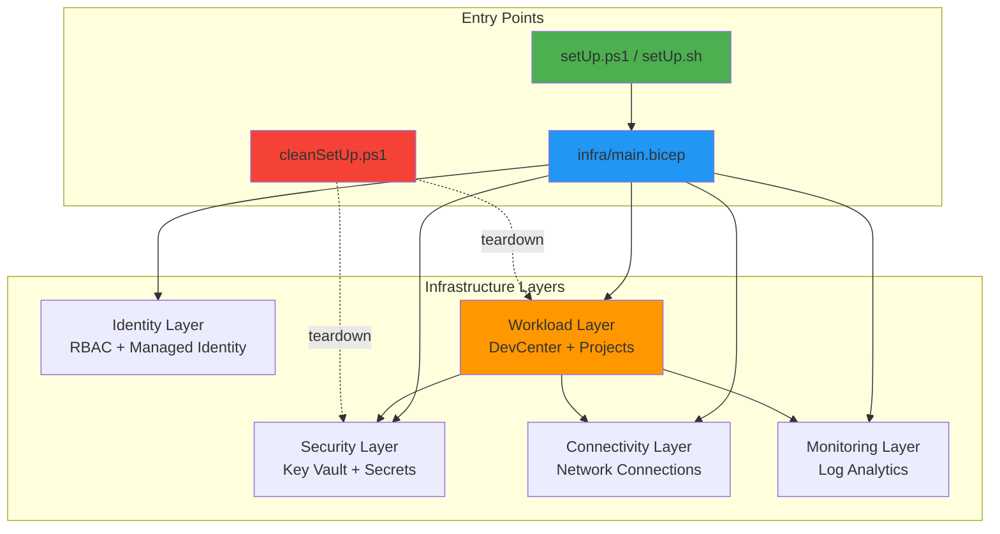

# DevExp-DevBox

> Azure DevCenter infrastructure automation platform for cloud-native
> development environments

[](LICENSE)
[](https://azure.microsoft.com/en-us/products/dev-box/)
[](https://learn.microsoft.com/en-us/azure/azure-resource-manager/bicep/)

---

## Description

**DevExp-DevBox** is an enterprise-grade Infrastructure as Code (IaC) solution
that automates the deployment and management of Azure DevCenter environments. It
provides a complete, production-ready framework for provisioning cloud-based
development workstations with integrated security, connectivity, monitoring, and
identity management.

The platform addresses the challenge of standardizing developer environments
across organizations while maintaining security compliance and operational
efficiency. By leveraging Azure DevCenter, teams can provision pre-configured
development environments on-demand, reducing setup time from hours to minutes.

What sets this solution apart is its comprehensive approach: it doesn't just
deploy DevCenter resources—it establishes the entire surrounding infrastructure
including network connectivity, security controls, monitoring solutions, and
identity management. The modular Bicep architecture ensures maintainability and
extensibility, while the dual PowerShell/Bash setup scripts provide
cross-platform deployment capabilities.

Target audience includes DevOps engineers, platform teams, and enterprise
architects responsible for developer experience infrastructure in Azure
environments.

---

## Features

- 🚀 **Automated Infrastructure Deployment** - Complete Azure DevCenter
  infrastructure provisioned via Azure Developer CLI with single-command
  execution
- 🔒 **Integrated Security Controls** - Azure Key Vault integration, managed
  identities, RBAC role assignments, and secure secret management
- 🌐 **Network Connectivity** - Configurable network connections with support
  for both Microsoft-hosted and customer-managed networking
- 📊 **Observability & Monitoring** - Log Analytics workspace integration with
  diagnostic settings for all resources
- 🎯 **Project & Pool Management** - Multi-project support with customizable
  DevBox pools, environment types, and catalog configurations
- 🔄 **Source Control Integration** - Dual support for GitHub and Azure DevOps
  Git repositories with automated authentication
- 🧹 **Lifecycle Management** - Complete cleanup automation for resource groups,
  deployments, credentials, and secrets
- 🛠️ **Cross-Platform Support** - Parallel PowerShell (Windows) and Bash
  (Linux/macOS) implementation for setup scripts
- 📦 **Catalog Management** - Support for both environment definition and image
  definition catalogs with branch/path configuration
- ⚙️ **Configuration-Driven** - YAML-based settings for devcenter, resource
  organization, and workload configuration



---

## Prerequisites

| Requirement               | Version | Purpose                                 |
| ------------------------- | ------- | --------------------------------------- |
| Azure CLI                 | Latest  | Azure resource management               |
| Azure Developer CLI (azd) | Latest  | Infrastructure provisioning             |
| PowerShell                | 5.1+    | Windows automation (Windows users)      |
| Bash                      | 4.0+    | Unix automation (Linux/macOS users)     |
| Azure Subscription        | Active  | Resource deployment target              |
| GitHub CLI                | Latest  | GitHub integration (if using GitHub)    |
| Azure DevOps CLI          | Latest  | ADO integration (if using Azure DevOps) |

**Required Azure Permissions:**

- Contributor role on target subscription
- User Access Administrator role (for RBAC assignments)
- Ability to create service principals and managed identities

---

## Installation

### 1. Clone the Repository

```bash
git clone https://github.com/Evilazaro/DevExp-DevBox.git
cd DevExp-DevBox
```

### 2. Authenticate with Azure

```bash
az login
az account set --subscription <subscription-id>
```

### 3. Authenticate with Source Control

**For GitHub:**

```bash
gh auth login
```

**For Azure DevOps:**

```bash
az extension add --name azure-devops
az devops configure --defaults organization=https://dev.azure.com/<your-org>
```

### 4. Configure Environment Settings

Review and customize the configuration files in
[`infra/settings/`](infra/settings/):

- [`workload/devcenter.yaml`](infra/settings/workload/devcenter.yaml) -
  DevCenter configuration
- [`resourceOrganization/resourceOrganization.yaml`](infra/settings/resourceOrganization/resourceOrganization.yaml) -
  Resource group naming
- [`security/security.yaml`](infra/settings/security/security.yaml) - Security
  settings

### 5. Run Setup Script

**Windows (PowerShell):**

```powershell
.\setUp.ps1 -EnvName "dev" -SourceControl "github"
```

**Linux/macOS (Bash):**

```bash
chmod +x setUp.sh
./setUp.sh -e "dev" -s "github"
```

### 6. Verify Deployment

```bash
azd env get-values
az devcenter admin show --name <devcenter-name> --resource-group <rg-name>
```

**Expected output:** DevCenter resource details with status "Succeeded"

---

## Usage

### Quick Start

Deploy a complete DevCenter environment with default settings:

```powershell
# Windows
.\setUp.ps1 -EnvName "production" -SourceControl "github"
```

```bash
# Linux/macOS
./setUp.sh -e "production" -s "adogit"
```

### Common Scenarios

#### Scenario 1: Multi-Project DevCenter with Custom Pools

1. Edit
   [`infra/settings/workload/devcenter.yaml`](infra/settings/workload/devcenter.yaml):

```yaml
projects:
  - name: 'frontend-team'
    description: 'Frontend development environment'
    pools:
      - name: 'react-pool'
        imageDefinitionName: 'WebDev'
        vmSku: 'general_i_8c32gb256ssd_v2'
```

2. Deploy:

```powershell
.\setUp.ps1 -EnvName "multi-project" -SourceControl "github"
```

#### Scenario 2: Environment with Azure DevOps Integration

```bash
./setUp.sh -e "devops-env" -s "adogit"
```

The script will:

- Prompt for Azure DevOps PAT (if not cached)
- Configure Azure DevOps defaults
- Store credentials securely in Key Vault
- Deploy DevCenter with ADO catalog integration

#### Scenario 3: Complete Environment Cleanup

```powershell
.\cleanSetUp.ps1 `
    -AppDisplayName "DevExp-ServicePrincipal" `
    -GhSecretName "AZURE_CREDENTIALS" `
    -EnvName "dev" `
    -Location "eastus2"
```

This removes:

- All resource groups (workload, security, connectivity, monitoring)
- Service principal and role assignments
- GitHub secrets
- Subscription-level deployments

### CLI Reference

#### setUp.ps1 / setUp.sh

Provisions Azure DevCenter environment with all supporting infrastructure.

**Parameters:**

| Parameter        | Alias | Required | Description                                   |
| ---------------- | ----- | -------- | --------------------------------------------- |
| `-EnvName`       | `-e`  | Yes      | Environment name (e.g., "dev", "prod")        |
| `-SourceControl` | `-s`  | Yes      | Source control platform: "github" or "adogit" |
| `-Help`          | `-h`  | No       | Display help message                          |

**Exit Codes:**

- `0` - Success
- `1` - General error (authentication, validation, or deployment failure)
- `130` - User interruption (Ctrl+C)

**Example:**

```powershell
.\setUp.ps1 -EnvName "staging" -SourceControl "github"
```

#### cleanSetUp.ps1

Orchestrates complete teardown of DevExp-DevBox infrastructure.

**Parameters:**

| Parameter         | Required | Description                  |
| ----------------- | -------- | ---------------------------- |
| `-AppDisplayName` | Yes      | Azure AD application name    |
| `-GhSecretName`   | Yes      | GitHub secret name to delete |
| `-EnvName`        | Yes      | Environment name             |
| `-Location`       | Yes      | Azure region                 |

**Example:**

```powershell
.\cleanSetUp.ps1 `
    -AppDisplayName "MyApp" `
    -GhSecretName "AZURE_CREDENTIALS" `
    -EnvName "dev" `
    -Location "eastus2"
```

### Configuration

#### Environment Variables

The setup scripts manage these environment variables automatically:

| Variable                       | Description                               | Set By                                                                                                         |
| ------------------------------ | ----------------------------------------- | -------------------------------------------------------------------------------------------------------------- |
| `AZURE_DEVOPS_EXT_PAT`         | Azure DevOps personal access token        | [`setUp.ps1`](setUp.ps1) / [`setUp.sh`](setUp.sh)                                                              |
| `KEY_VAULT_SECRET`             | Secret identifier for repo authentication | [`setUp.ps1`](setUp.ps1)                                                                                       |
| `SOURCE_CONTROL_PLATFORM`      | Selected platform (github/adogit)         | [`setUp.ps1`](setUp.ps1)                                                                                       |
| `WINGET_DISABLE_INTERACTIVITY` | Non-interactive winget mode               | [`.configuration/devcenter/workloads/winget-update.ps1`](.configuration/devcenter/workloads/winget-update.ps1) |

#### Configuration Files

**DevCenter Settings**
([`infra/settings/workload/devcenter.yaml`](infra/settings/workload/devcenter.yaml)):

```yaml
name: 'mydevcenter'
identity:
  type: 'SystemAssigned'
catalogs:
  - name: 'environment-catalog'
    type: 'environmentDefinition'
    sourceControl: 'gitHub'
    uri: 'https://github.com/user/repo'
    branch: 'main'
    path: '/environments'
projects:
  - name: 'project1'
    description: 'Development project'
    pools:
      - name: 'dev-pool'
        vmSku: 'general_i_8c32gb256ssd_v2'
```

**Resource Organization**
([`infra/settings/resourceOrganization/resourceOrganization.yaml`](infra/settings/resourceOrganization/resourceOrganization.yaml)):

```yaml
workloadName: 'devexp'
landingZones:
  - name: 'workload'
    create: true
  - name: 'security'
    create: true
  - name: 'connectivity'
    create: true
  - name: 'monitoring'
    create: true
```

---

## Project Structure

```
.
├── infra/                              # Infrastructure as Code
│   ├── main.bicep                      # Root deployment template
│   ├── main.parameters.json            # Deployment parameters
│   └── settings/                       # YAML configuration files
│       ├── resourceOrganization/       # Resource group definitions
│       ├── security/                   # Security policies
│       └── workload/                   # DevCenter configuration
├── src/                                # Bicep modules
│   ├── connectivity/                   # Network connection modules
│   ├── identity/                       # RBAC and identity modules
│   ├── management/                     # Log Analytics modules
│   ├── security/                       # Key Vault and secrets
│   └── workload/                       # DevCenter resources
│       ├── core/                       # Core DevCenter components
│       │   ├── devCenter.bicep         # DevCenter resource
│       │   ├── catalog.bicep           # Catalog configuration
│       │   └── environmentType.bicep   # Environment types
│       └── project/                    # Project resources
│           ├── project.bicep           # Project configuration
│           ├── projectPool.bicep       # DevBox pools
│           └── projectEnvironmentType.bicep  # Project env types
├── .configuration/                     # Setup and automation scripts
│   ├── devcenter/workloads/            # DevBox customization scripts
│   ├── powershell/                     # PowerShell utilities
│   └── setup/powershell/Azure/         # Azure setup helpers
├── .github/                            # GitHub Actions workflows
│   ├── workflows/
│   │   ├── ci.yml                      # Continuous integration
│   │   ├── deploy.yml                  # Deployment automation
│   │   └── release.yml                 # Release management
│   └── actions/ci/                     # Custom GitHub Actions
├── setUp.ps1                           # Windows setup script
├── setUp.sh                            # Linux/macOS setup script
├── cleanSetUp.ps1                      # Cleanup orchestration
├── azure.yaml                          # Azure Developer CLI config
├── package.json                        # Node.js dependencies (if applicable)
└── LICENSE                             # MIT License
```

**Key Directories:**

| Path                                       | Purpose                                   |
| ------------------------------------------ | ----------------------------------------- |
| [`infra/`](infra/)                         | Bicep templates and configuration files   |
| [`src/`](src/)                             | Reusable Bicep modules organized by layer |
| [`.configuration/`](.configuration/)       | Automation scripts and setup utilities    |
| [`.github/workflows/`](.github/workflows/) | CI/CD pipeline definitions                |

---

## Development

### Setting Up Development Environment

1. Install Bicep CLI:

```bash
az bicep install
az bicep upgrade
```

2. Install recommended VS Code extensions:
   - Azure Bicep (ms-azuretools.vscode-bicep)
   - PowerShell (ms-vscode.powershell)
   - YAML (redhat.vscode-yaml)

3. Validate Bicep templates locally:

```bash
az bicep build --file infra/main.bicep
```

### Testing

**Infrastructure Validation:**

```bash
# Validate Bicep syntax
az bicep build --file infra/main.bicep

# What-if deployment (no changes applied)
az deployment sub what-if \
    --location eastus2 \
    --template-file infra/main.bicep \
    --parameters infra/main.parameters.json
```

**Script Testing:**

```powershell
# PowerShell script analysis
Invoke-ScriptAnalyzer -Path setUp.ps1 -Severity Warning

# Bash script validation
shellcheck setUp.sh
```

### Building

The project uses Azure Bicep, which is compiled automatically during deployment.
No separate build step is required.

To manually compile Bicep to ARM JSON:

```bash
az bicep build --file infra/main.bicep --outfile dist/main.json
```

---

## Deployment

### Manual Deployment via Azure CLI

```bash
# Set variables
LOCATION="eastus2"
ENV_NAME="production"

# Deploy infrastructure
az deployment sub create \
    --location $LOCATION \
    --template-file infra/main.bicep \
    --parameters infra/main.parameters.json \
    --parameters envName=$ENV_NAME
```

### Deployment via Azure Developer CLI (Recommended)

```bash
azd auth login
azd env new production
azd up
```

### CI/CD Deployment

The repository includes GitHub Actions workflows:

- **CI Pipeline** ([`.github/workflows/ci.yml`](.github/workflows/ci.yml)) -
  Validates Bicep on pull requests
- **Deploy Pipeline**
  ([`.github/workflows/deploy.yml`](.github/workflows/deploy.yml)) - Deploys to
  Azure on merge to main
- **Release Pipeline**
  ([`.github/workflows/release.yml`](.github/workflows/release.yml)) - Creates
  versioned releases

**Required GitHub Secrets:**

| Secret                  | Description                          |
| ----------------------- | ------------------------------------ |
| `AZURE_CREDENTIALS`     | Service principal credentials (JSON) |
| `AZURE_SUBSCRIPTION_ID` | Target subscription ID               |

---

## Troubleshooting

### Common Issues

**Issue: "Not logged into Azure"**

**Solution:**

```bash
az login
az account show  # Verify active subscription
```

---

**Issue: "Failed to retrieve GitHub token"**

**Solution:**

```bash
gh auth login
gh auth status  # Verify authentication
```

---

**Issue: "Deployment failed with insufficient permissions"**

**Solution:** Ensure your account has:

- Contributor role on subscription
- User Access Administrator role (for RBAC)

```bash
az role assignment list --assignee <your-user-id> --subscription <sub-id>
```

---

**Issue: "Resource group already exists"**

**Solution:** Use the cleanup script first:

```powershell
.\cleanSetUp.ps1 -EnvName "dev" -Location "eastus2" -AppDisplayName "MyApp" -GhSecretName "AZURE_CREDENTIALS"
```

---

**Issue: "Bicep compilation errors"**

**Solution:**

```bash
# Update Bicep CLI
az bicep upgrade

# Validate specific file
az bicep build --file infra/main.bicep
```

---

## FAQ

**Q: Can I deploy to multiple regions simultaneously?**  
A: Yes. Edit
[`infra/settings/resourceOrganization/resourceOrganization.yaml`](infra/settings/resourceOrganization/resourceOrganization.yaml)
to specify multiple locations, or run the setup script multiple times with
different `-EnvName` values.

**Q: How do I add a new project to an existing DevCenter?**  
A: Edit
[`infra/settings/workload/devcenter.yaml`](infra/settings/workload/devcenter.yaml),
add your project definition to the `projects` array, then re-run `azd up`.

**Q: What's the difference between environment definitions and image
definitions?**  
A: Environment definitions create Azure resources (VMs, storage, etc.) via
Bicep/ARM templates. Image definitions define pre-configured VM images for
DevBox pools.

**Q: Can I use private GitHub repositories for catalogs?**  
A: Yes. The setup script stores GitHub PAT in Key Vault and configures the
catalog with authentication. Ensure the PAT has `repo` scope.

**Q: How do I update DevBox images?**  
A: Update the catalog repository (referenced in
[`devcenter.yaml`](infra/settings/workload/devcenter.yaml)), and the DevCenter
will sync automatically based on `catalogItemSyncEnableStatus` setting.

---

## License

This project is licensed under the **MIT License** - see the [LICENSE](LICENSE)
file for details.

---

## Authors

- **DevExp Team** - Initial development and maintenance

---

## Acknowledgments

- Azure DevCenter product team for platform capabilities
- Azure Bicep team for IaC tooling
- Contributors to the Azure Developer CLI (azd)
- Microsoft Learn documentation resources
