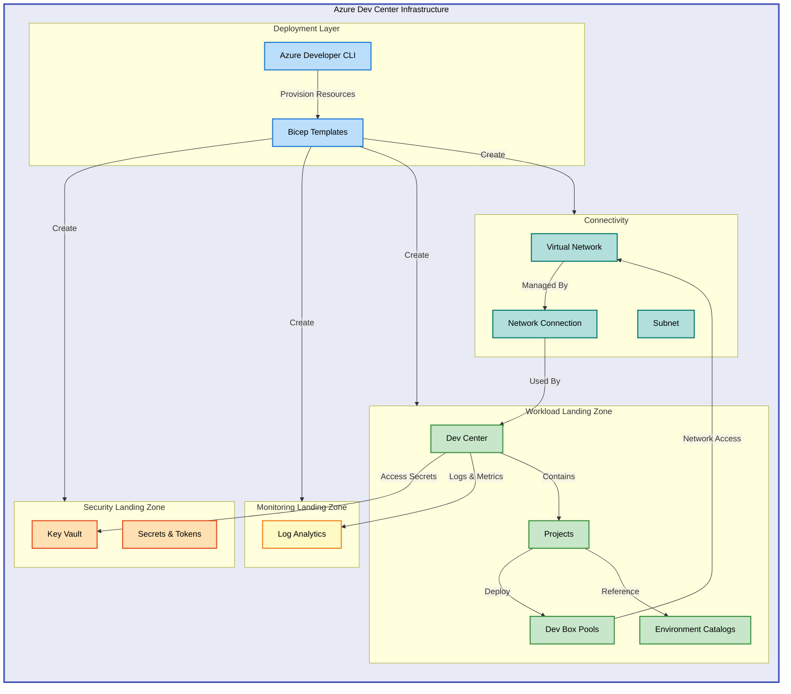

# Azure Dev Center Infrastructure


Enterprise-ready Infrastructure-as-Code for deploying Azure Dev Center with Dev
Box, enabling self-service developer workstations with role-based access control
and integrated security.

## 🚀 Quick Start

Deploy the infrastructure using Azure Developer CLI:

```bash
azd up
```

This provisions all resources including Dev Center, security controls,
monitoring, and networking.

## 📦 Installation

> ⚠️ **Prerequisites**: Ensure you have Azure CLI (2.50+), Azure Developer CLI
> (1.5+), and an active Azure subscription with Contributor access.

Clone the repository and authenticate:

```bash
git clone https://github.com/Evilazaro/DevExp-DevBox.git
cd DevExp-DevBox
az login
azd auth login
```

Configure your environment:

```bash
./setUp.sh -e "prod" -s "github"
```

This creates an Azure environment with GitHub integration for Dev Center
catalogs.

> 💡 **Tip**: Use `./setUp.ps1` on Windows or `./setUp.sh` on Linux/macOS for
> platform-specific setup scripts.

Deploy the infrastructure:

```bash
azd provision
```

Expected deployment time: 5-10 minutes for a complete environment.

## 💻 Usage

The infrastructure deploys a complete Azure Dev Center environment with three
landing zones:

**Security Landing Zone**: Key Vault stores GitHub tokens and secrets referenced
by Dev Center catalogs.

**Monitoring Landing Zone**: Log Analytics workspace collects diagnostics from
all Dev Center resources.

**Workload Landing Zone**: Dev Center manages projects, dev box pools, and
environment types.

Customize the deployment by editing configuration files in
[`infra/settings/`](infra/settings/):

```bash
# Edit Dev Center configuration
code infra/settings/workload/devcenter.yaml

# Modify resource organization
code infra/settings/resourceOrganization/azureResources.yaml

# Update security settings
code infra/settings/security/security.yaml
```

> ℹ️ **Important**: After modifying settings, run `azd provision` to apply
> changes to your Azure resources.

## 🏗️ Architecture

The infrastructure uses a modular Bicep architecture with separated concerns
across landing zones:



### Key Components

**Deployment Layer**: Azure Developer CLI orchestrates Bicep template deployment
across subscription scope.

**Security Layer**: Key Vault manages GitHub tokens for catalog synchronization
with RBAC controls.

**Monitoring Layer**: Centralized Log Analytics workspace tracks Dev Center
operations and compliance.

**Workload Layer**: Dev Center resources include projects, dev box pools, and
environment catalogs with role assignments.

**Connectivity Layer**: Virtual networks with network connections enable managed
dev box networking.

## 🤝 Contributing

Contributions are welcome. Please follow these guidelines:

- Submit pull requests against the `main` branch
- Include tests for infrastructure changes
- Update documentation for new features
- Follow Bicep best practices and linting rules

## 📝 License

This project is licensed under the MIT License. See [LICENSE](LICENSE) file for
details.
