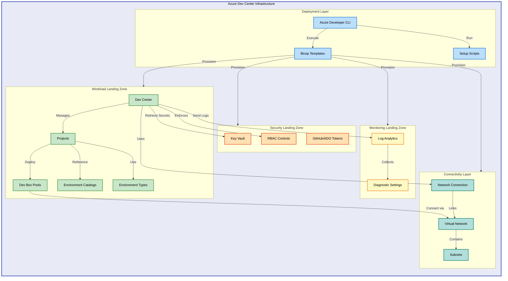

# Azure Dev Center Infrastructure


Enterprise-ready Infrastructure-as-Code for deploying Azure Dev Center with Dev
Box, enabling self-service developer workstations with role-based access control
and integrated security.

## ✨ Features

- **Automated Infrastructure Deployment** - Complete environment provisioned via
  single `azd up` command
- **Landing Zone Architecture** - Separated security, monitoring, and workload
  concerns with enterprise governance
- **Dev Box Self-Service** - Role-based project access with customizable dev box
  pools and definitions
- **Integrated Security** - Azure Key Vault for secrets management with
  system-assigned managed identities
- **Centralized Monitoring** - Log Analytics workspace with diagnostic settings
  across all resources
- **Network Isolation** - Virtual network integration with managed network
  connections for secure dev boxes
- **Environment Catalogs** - GitHub and Azure DevOps catalog integration for
  Infrastructure-as-Code templates
- **Multi-Project Support** - Deploy multiple projects with independent
  configurations and RBAC policies

## 🚀 Quick Start

Deploy the complete infrastructure using Azure Developer CLI:

```bash
azd up
```

This provisions all resources including Dev Center, security controls,
monitoring, and networking in minutes.

## 📦 Installation

> ⚠️ **Prerequisites**: Ensure you have Azure CLI (2.50+), Azure Developer CLI
> (1.5+), and an active Azure subscription with Contributor access before
> proceeding.

Clone the repository and authenticate:

```bash
git clone https://github.com/Evilazaro/DevExp-DevBox.git
cd DevExp-DevBox
az login
azd auth login
```

Configure your environment:

```bash
./setUp.sh -e "prod" -s "github"
```

This creates an Azure environment with GitHub integration for Dev Center
catalogs.

> 💡 **Tip**: Use [`setUp.ps1`](setUp.ps1) on Windows or [`setUp.sh`](setUp.sh)
> on Linux/macOS for platform-specific setup automation.

Deploy the infrastructure:

```bash
azd provision
```

Expected deployment time: 5-10 minutes for a complete environment with all
landing zones.

## 💻 Usage

The infrastructure deploys a complete Azure Dev Center environment with three
landing zones:

**Security Landing Zone**: Key Vault stores GitHub or Azure DevOps tokens
securely, referenced by Dev Center catalogs for infrastructure templates. RBAC
controls enforce least-privilege access across all resources.

**Monitoring Landing Zone**: Log Analytics workspace collects diagnostics from
all Dev Center resources, providing centralized logging and compliance tracking
for auditing purposes.

**Workload Landing Zone**: Dev Center manages projects, dev box pools,
environment types, and catalogs. Each project supports multiple dev box
definitions with customized compute and storage configurations.

Customize the deployment by editing configuration files in
[`infra/settings/`](infra/settings/):

```bash
# Edit Dev Center configuration (projects, pools, catalogs)
code infra/settings/workload/devcenter.yaml

# Modify resource organization (landing zones, naming conventions)
code infra/settings/resourceOrganization/azureResources.yaml

# Update security settings (Key Vault, RBAC roles)
code infra/settings/security/security.yaml
```

> ℹ️ **Important**: After modifying configuration files, run `azd provision` to
> apply changes to your Azure resources. Changes are deployed incrementally via
> Bicep.

## 🏗️ Architecture

The infrastructure uses a modular Bicep architecture with separated concerns
across landing zones:



### Key Components

**Deployment Layer**: Azure Developer CLI orchestrates Bicep template deployment
at subscription scope, executing setup scripts for GitHub or Azure DevOps
authentication and token management.

**Security Layer**: Key Vault manages platform tokens for catalog
synchronization with system-assigned managed identities. RBAC policies enforce
role-based access across Dev Center resources.

**Monitoring Layer**: Centralized Log Analytics workspace tracks Dev Center
operations, dev box provisioning events, and diagnostic metrics for compliance
and troubleshooting.

**Workload Layer**: Dev Center resources include projects, dev box pools,
environment catalogs, and environment types with granular role assignments for
developers and platform engineers.

**Connectivity Layer**: Virtual networks with network connections enable secure,
isolated dev box networking with customizable subnet configurations per project.

## 🤝 Contributing

Contributions are welcome. Please follow these guidelines:

- Submit pull requests against the `main` branch with clear descriptions
- Include validation tests for Bicep template changes
- Update YAML configuration schemas when adding new properties
- Follow Azure naming conventions and Bicep best practices
- Document breaking changes in pull request descriptions

## 📝 License

This project is licensed under the MIT License. See [`LICENSE`](LICENSE) file
for details.
