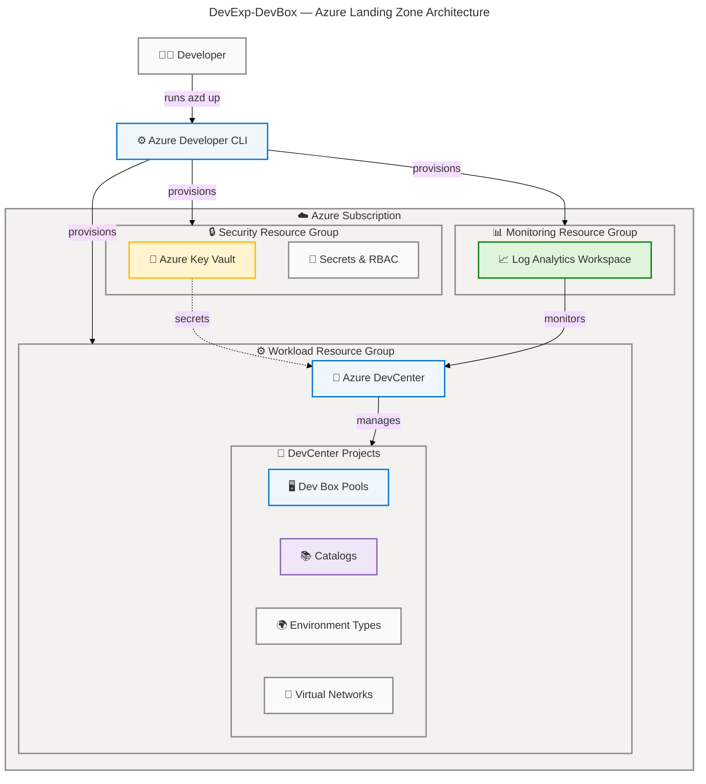

# DevExp-DevBox

[](https://opensource.org/licenses/MIT)
[](https://azure.microsoft.com)
[](https://learn.microsoft.com/en-us/azure/azure-resource-manager/bicep/overview)
[](https://learn.microsoft.com/en-us/azure/developer/azure-developer-cli/overview)
[](https://github.com/Evilazaro/DevExp-DevBox)

**DevExp-DevBox** is an Azure Dev Box Accelerator that automates the end-to-end
deployment of
[Microsoft Dev Box](https://learn.microsoft.com/en-us/azure/dev-box/overview-what-is-microsoft-dev-box)
infrastructure using Azure Developer CLI (`azd`) and Bicep IaC. It provisions
fully configured developer workstation environments — including centralized
DevCenters, role-specific Dev Box pools, Key Vault secrets, and monitoring —
from a single `azd up` command.

## Overview

**Overview**

DevExp-DevBox eliminates the manual, error-prone setup of Azure Dev Box
infrastructure by providing a production-ready, YAML-driven accelerator for
Platform Engineering teams. Whether you are onboarding backend engineers,
frontend engineers, or cross-functional teams, this accelerator provisions the
complete Azure landing zone in minutes — with zero hard-coded environment
configuration.

This accelerator follows Microsoft's
[Azure Landing Zone](https://learn.microsoft.com/en-us/azure/cloud-adoption-framework/ready/landing-zone/)
guidance by organizing resources into three dedicated resource groups —
Security, Monitoring, and Workload — enforcing clear ownership, cost
attribution, and governance boundaries. It integrates natively with both GitHub
and Azure DevOps, making it deployable across enterprise environments on
Windows, Linux, and macOS.

## Table of Contents

- [Architecture](#architecture)
- [Features](#features)
- [Requirements](#requirements)
- [Quick Start](#quick-start)
- [Configuration](#configuration)
- [Deployment](#deployment)
- [Usage](#usage)
- [Contributing](#contributing)
- [License](#license)

## Architecture

**Overview**

The DevExp-DevBox accelerator provisions a three-tier Azure landing zone
architecture. Resources are logically separated into dedicated resource groups
for Security, Monitoring, and Workload to enforce governance and ownership
boundaries. The Azure DevCenter serves as the platform hub for all developer
workstation resources, with projects, Dev Box pools, catalogs, and environment
types managed as children.

The deployment is orchestrated by Azure Developer CLI via pre-provision hooks
defined in `azure.yaml` (Linux/macOS) and `azure-pwh.yaml` (Windows). Bicep
modules at subscription scope create the resource groups and deploy each tier
independently with proper dependency ordering.


```mermaid
---
title: "DevExp-DevBox — Azure Landing Zone Architecture"
config:
  theme: base
  look: classic
  layout: dagre
  flowchart:
    htmlLabels: true
---
flowchart TB
    accTitle: DevExp-DevBox Azure Landing Zone Architecture
    accDescr: Three-tier Azure landing zone showing Security, Monitoring, and Workload resource groups provisioned by Azure Developer CLI with Bicep IaC

    %% ═══════════════════════════════════════════════════════════════════════════
    %% AZURE / FLUENT ARCHITECTURE PATTERN v1.1
    %% (Semantic + Structural + Font + Accessibility Governance)
    %% ═══════════════════════════════════════════════════════════════════════════
    %% PHASE 1 - FLUENT UI: All styling uses approved Fluent UI palette only
    %% PHASE 2 - GROUPS: Every subgraph has semantic color via style directive
    %% PHASE 3 - COMPONENTS: Every node has semantic classDef + icon prefix
    %% PHASE 4 - ACCESSIBILITY: accTitle/accDescr present, WCAG AA contrast
    %% PHASE 5 - STANDARD: Governance block present, classDefs centralized
    %% ═══════════════════════════════════════════════════════════════════════════

    dev["👨‍💻 Developer"]:::neutral
    azd["⚙️ Azure Developer CLI"]:::core

    subgraph azure["☁️ Azure Subscription"]
        direction TB

        subgraph secRG["🔒 Security Resource Group"]
            kv["🔑 Azure Key Vault"]:::warning
            sec["🔐 Secrets & RBAC"]:::neutral
        end

        subgraph monRG["📊 Monitoring Resource Group"]
            law["📈 Log Analytics Workspace"]:::success
        end

        subgraph workRG["⚙️ Workload Resource Group"]
            dc["🏢 Azure DevCenter"]:::core

            subgraph proj["📁 DevCenter Projects"]
                pool["🖥️ Dev Box Pools"]:::core
                cat["📚 Catalogs"]:::data
                env["🌍 Environment Types"]:::neutral
                net["🔗 Virtual Networks"]:::neutral
            end
        end
    end

    dev -->|"runs azd up"| azd
    azd -->|"provisions"| secRG
    azd -->|"provisions"| monRG
    azd -->|"provisions"| workRG
    kv -.->|"secrets"| dc
    law -->|"monitors"| dc
    dc -->|"manages"| proj

    style azure fill:#F3F2F1,stroke:#8A8886,stroke-width:2px,color:#323130
    style secRG fill:#F3F2F1,stroke:#8A8886,stroke-width:2px,color:#323130
    style monRG fill:#F3F2F1,stroke:#8A8886,stroke-width:2px,color:#323130
    style workRG fill:#F3F2F1,stroke:#8A8886,stroke-width:2px,color:#323130
    style proj fill:#F3F2F1,stroke:#8A8886,stroke-width:2px,color:#323130

    %% Centralized semantic classDefs
    classDef neutral fill:#FAFAFA,stroke:#8A8886,stroke-width:2px,color:#323130
    classDef core fill:#EFF6FC,stroke:#0078D4,stroke-width:2px,color:#323130
    classDef success fill:#DFF6DD,stroke:#107C10,stroke-width:2px,color:#323130
    classDef warning fill:#FFF4CE,stroke:#FFB900,stroke-width:2px,color:#323130
    classDef data fill:#F0E6FA,stroke:#8764B8,stroke-width:2px,color:#323130
```

### Component Roles

| Component                  | Role                                                                                                        | Resource Type                                     |
| -------------------------- | ----------------------------------------------------------------------------------------------------------- | ------------------------------------------------- |
| 🔑 Azure Key Vault         | Stores the GitHub Access Token and other secrets with RBAC authorization, purge protection, and soft delete | `Microsoft.KeyVault/vaults`                       |
| 📈 Log Analytics Workspace | Centralized monitoring and diagnostics for DevCenter and Dev Box resources                                  | `Microsoft.OperationalInsights/workspaces`        |
| 🏢 Azure DevCenter         | Platform hub managing projects, catalogs, environment types, and Dev Box definitions                        | `Microsoft.DevCenter/devcenters`                  |
| 🖥️ Dev Box Pools           | Role-specific collections of Dev Box virtual machines (e.g., `backend-engineer`, `frontend-engineer`)       | `Microsoft.DevCenter/projects/pools`              |
| 📚 Catalogs                | Git-backed repositories providing image definitions and environment definitions to projects                 | `Microsoft.DevCenter/devcenters/catalogs`         |
| 🌍 Environment Types       | Named deployment targets (`dev`, `staging`, `UAT`) available to project members                             | `Microsoft.DevCenter/devcenters/environmentTypes` |
| 🔗 Virtual Networks        | Optional per-project virtual networks with configurable address prefixes and subnets                        | `Microsoft.Network/virtualNetworks`               |

## Features

**Overview**

DevExp-DevBox delivers a complete Microsoft Dev Box infrastructure-as-code
foundation designed for enterprise Platform Engineering teams that need
repeatable, auditable, and role-aware developer environments. It abstracts
complex resource dependencies, RBAC role assignments, and multi-environment
configuration into a small set of YAML files, enabling teams to onboard new
projects reliably without touching Bicep code.

By aligning with Azure Landing Zone principles and supporting both GitHub and
Azure DevOps source control, this accelerator fits into existing enterprise
workflows and CI/CD pipelines. Every resource is tagged, every secret is managed
by Key Vault, and every deployment is idempotent across environments.

| Feature                         | Description                                                                                                  | Status    |
| ------------------------------- | ------------------------------------------------------------------------------------------------------------ | --------- |
| 🚀 One-command deployment       | Deploy all Azure resources with a single `azd up` invocation                                                 | ✅ Stable |
| 🔒 Key Vault integration        | Centralized secret management with RBAC authorization, soft delete (7-day retention), and purge protection   | ✅ Stable |
| 📊 Monitoring integration       | Log Analytics Workspace connected to DevCenter and Dev Box resources for centralized observability           | ✅ Stable |
| 🏢 Azure DevCenter              | Fully configured DevCenter with catalog item sync, Microsoft-hosted network support, and Azure Monitor agent | ✅ Stable |
| 🖥️ Role-specific Dev Box pools  | Separate pools per engineer role (e.g., `backend-engineer` with 32 vCPU / 128 GB RAM) per project            | ✅ Stable |
| 📚 Git catalog support          | GitHub-backed image definitions and environment definitions per DevCenter and per project                    | ✅ Stable |
| 🔗 Virtual network provisioning | Per-project Managed or Unmanaged VNet with configurable address prefixes and subnets                         | ✅ Stable |
| 🌍 Multi-environment support    | `dev`, `staging`, and `UAT` environment types provisioned per project                                        | ✅ Stable |
| 🧩 YAML-driven configuration    | Single `devcenter.yaml` file drives all DevCenter settings — no Bicep code changes required                  | ✅ Stable |
| 🔗 Dual source control support  | Native integration with both GitHub (`github`) and Azure DevOps (`adogit`) source control platforms          | ✅ Stable |

## Requirements

**Overview**

DevExp-DevBox requires a small set of cross-platform tools and Azure
permissions. All CLI tools are available for Windows, macOS, and Linux. Azure
prerequisites include an active subscription and sufficient RBAC permissions to
create resource groups and assign roles at the subscription scope.

Before deploying, ensure you have completed Azure authentication via `az login`
and `azd auth login`, and that your account holds at minimum **Contributor** and
**User Access Administrator** roles on the target subscription. Azure AD groups
for Dev Managers and project teams must be pre-created and their group IDs added
to `infra/settings/workload/devcenter.yaml` before provisioning.

> [!NOTE] The GitHub CLI (`gh`) is required only when
> `SOURCE_CONTROL_PLATFORM=github` (the default). For Azure DevOps deployments
> (`adogit`), `gh` is not required.

> [!IMPORTANT] The deploying identity requires **Contributor** and **User Access
> Administrator** roles on the Azure Subscription. These roles are necessary
> because the Bicep templates assign RBAC roles to the DevCenter managed
> identity and project identities during deployment.

| Requirement                    | Purpose                                                              | Minimum Version     |
| ------------------------------ | -------------------------------------------------------------------- | ------------------- |
| ☁️ Azure Subscription          | Target for all resource deployments                                  | Active subscription |
| 🔑 Azure CLI (`az`)            | Azure authentication and resource management                         | `2.60.0`            |
| ⚙️ Azure Developer CLI (`azd`) | Orchestrates provisioning via hooks and Bicep templates              | `1.9.0`             |
| 🛠️ GitHub CLI (`gh`)           | GitHub authentication for source control integration (GitHub only)   | `2.40.0`            |
| 📦 PowerShell                  | Windows automation and pre-provision hook execution                  | `5.1` or `7+`       |
| 🔐 Azure AD Groups             | Pre-created groups for Dev Manager and project team RBAC assignments | N/A                 |

### Supported Azure Regions

The following regions are supported and validated in `infra/main.bicep`:

| Region                  | Location Code        |
| ----------------------- | -------------------- |
| 🌎 East US              | `eastus`             |
| 🌎 East US 2            | `eastus2`            |
| 🌎 West US              | `westus`             |
| 🌎 West US 2            | `westus2`            |
| 🌎 West US 3            | `westus3`            |
| 🌎 Central US           | `centralus`          |
| 🌍 North Europe         | `northeurope`        |
| 🌍 West Europe          | `westeurope`         |
| 🌏 Southeast Asia       | `southeastasia`      |
| 🌏 Australia East       | `australiaeast`      |
| 🌏 Japan East           | `japaneast`          |
| 🌍 UK South             | `uksouth`            |
| 🌎 Canada Central       | `canadacentral`      |
| 🌍 Sweden Central       | `swedencentral`      |
| 🌍 Switzerland North    | `switzerlandnorth`   |
| 🌍 Germany West Central | `germanywestcentral` |

## Quick Start

Get a fully provisioned Azure Dev Box environment in three steps.

### 1. Clone the Repository

```bash
git clone https://github.com/Evilazaro/DevExp-DevBox.git
cd DevExp-DevBox
```

### 2. Authenticate

```bash
az login
azd auth login
gh auth login    # Required for GitHub source control (default)
```

### 3. Deploy Infrastructure

**Linux / macOS:**

```bash
azd up
```

**Windows (PowerShell):**

```powershell
azd up
```

> [!TIP] During deployment, `azd up` runs the pre-provision hook defined in
> `azure.yaml` (Linux/macOS) or `azure-pwh.yaml` (Windows), which prompts for
> environment name and source control platform before provisioning Bicep
> resources.

**Expected output:**

```text
SUCCESS: Your up workflow to provision and deploy to Azure completed in 12 minutes 43 seconds.

Outputs:
  AZURE_DEV_CENTER_NAME: devexp-devcenter
  AZURE_DEV_CENTER_PROJECTS: ["eShop"]
  AZURE_KEY_VAULT_NAME: contoso
  AZURE_KEY_VAULT_ENDPOINT: https://contoso.vault.azure.net/
  AZURE_LOG_ANALYTICS_WORKSPACE_NAME: logAnalytics
```

## Configuration

**Overview**

DevExp-DevBox uses YAML configuration files to define every aspect of the
infrastructure deployment. All resource names, tags, network settings, RBAC
assignments, and DevCenter settings are centrally managed under
`infra/settings/` — no Bicep code changes are required to customize your
environment.

YAML-driven configuration allows Platform Engineering teams to version-control
their entire Dev Box environment setup, review changes through pull requests,
and re-deploy consistently across environments. Three configuration domains —
resource organization, security, and workload — map directly to the three Azure
resource groups provisioned by the accelerator.

### Environment Variables

The following environment variables are consumed by `azd` and the Bicep
parameter file (`infra/main.parameters.json`):

| Variable                     | Description                                                   | Example            |
| ---------------------------- | ------------------------------------------------------------- | ------------------ |
| ⚙️ `AZURE_ENV_NAME`          | Environment name used as a suffix in resource group naming    | `dev`              |
| ☁️ `AZURE_LOCATION`          | Azure region for all resource deployments                     | `eastus2`          |
| 🔑 `KEY_VAULT_SECRET`        | GitHub Access Token or other secret value stored in Key Vault | `ghp_xxxxxxxxxxxx` |
| 🔗 `SOURCE_CONTROL_PLATFORM` | Source control integration platform (`github` or `adogit`)    | `github`           |

### Configuration Files

| File                                                         | Purpose                                                                                                                    |
| ------------------------------------------------------------ | -------------------------------------------------------------------------------------------------------------------------- |
| 📁 `infra/settings/resourceOrganization/azureResources.yaml` | Defines resource group names, creation flags, and governance tags for Security, Monitoring, and Workload landing zones     |
| 🔒 `infra/settings/security/security.yaml`                   | Configures Azure Key Vault name, secret name, soft delete retention, purge protection, and RBAC authorization              |
| ⚙️ `infra/settings/workload/devcenter.yaml`                  | Defines DevCenter name, identity, catalogs, environment types, and all project configurations including pools and networks |

### DevCenter Configuration Example

Customize `infra/settings/workload/devcenter.yaml` to define projects and Dev
Box pools:

```yaml
projects:
  - name: 'eShop'
    description: 'eShop project.'
    pools:
      - name: 'backend-engineer'
        imageDefinitionName: 'eShop-backend-engineer'
        vmSku: general_i_32c128gb512ssd_v2
      - name: 'frontend-engineer'
        imageDefinitionName: 'eShop-frontend-engineer'
        vmSku: general_i_16c64gb256ssd_v2
    environmentTypes:
      - name: 'dev'
        deploymentTargetId: ''
      - name: 'staging'
        deploymentTargetId: ''
      - name: 'UAT'
        deploymentTargetId: ''
```

### Key Vault Configuration Example

Customize `infra/settings/security/security.yaml` to adjust security settings:

```yaml
create: true
keyVault:
  name: contoso
  secretName: gha-token
  enablePurgeProtection: true
  enableSoftDelete: true
  softDeleteRetentionInDays: 7
  enableRbacAuthorization: true
```

### Resource Organization Configuration Example

Customize `infra/settings/resourceOrganization/azureResources.yaml` to define
landing zone resource groups:

```yaml
workload:
  create: true
  name: devexp-workload
  tags:
    environment: dev
    division: Platforms
    team: DevExP
    project: Contoso-DevExp-DevBox
    costCenter: IT
    owner: Contoso
    landingZone: Workload
```

## Deployment

This section covers the full deployment workflow from configuration through
provisioning.

### Pre-Deployment Checklist

Before running `azd up`, ensure the following steps are complete:

1. **Update Azure AD group IDs** — Replace placeholder group IDs in
   `infra/settings/workload/devcenter.yaml` with real Azure AD group object IDs
   for Dev Managers and project teams.
2. **Set the Key Vault secret name** — Update `secretName` in
   `infra/settings/security/security.yaml` to match your secret.
3. **Configure project pools** — Update pool `imageDefinitionName` and `vmSku`
   values in `devcenter.yaml` to match your image definitions.
4. **Verify resource group names** — Review
   `infra/settings/resourceOrganization/azureResources.yaml` and adjust names to
   avoid conflicts in the target subscription.

### Full Deployment

**Step 1: Initialize the azd environment**

```bash
azd env new <environment-name>
```

**Step 2: Set required environment variables**

```bash
azd env set AZURE_LOCATION eastus2
azd env set KEY_VAULT_SECRET <your-github-access-token>
azd env set SOURCE_CONTROL_PLATFORM github
```

**Step 3: Provision all infrastructure**

```bash
azd provision
```

**Step 4: Verify outputs**

```bash
azd env get-values
```

**Expected output:**

```text
AZURE_DEV_CENTER_NAME="devexp-devcenter"
AZURE_DEV_CENTER_PROJECTS=["eShop"]
AZURE_KEY_VAULT_NAME="contoso"
AZURE_KEY_VAULT_ENDPOINT="https://contoso.vault.azure.net/"
AZURE_LOG_ANALYTICS_WORKSPACE_ID="/subscriptions/.../workspaces/logAnalytics"
AZURE_LOG_ANALYTICS_WORKSPACE_NAME="logAnalytics"
SECURITY_AZURE_RESOURCE_GROUP_NAME="devexp-security-dev-eastus2-RG"
MONITORING_AZURE_RESOURCE_GROUP_NAME="devexp-monitoring-dev-eastus2-RG"
WORKLOAD_AZURE_RESOURCE_GROUP_NAME="devexp-workload-dev-eastus2-RG"
```

### Teardown

To remove all provisioned resources:

```bash
azd down --force --purge
```

> [!WARNING] Running `azd down --purge` permanently deletes the Azure Key Vault
> and all stored secrets. Ensure you have backed up any required secret values
> before running teardown.

## Usage

### Adding a New DevCenter Project

To add a new project with its own Dev Box pools, append an entry to the
`projects` array in `infra/settings/workload/devcenter.yaml`:

```yaml
- name: 'MyNewProject'
  description: 'My new project description.'
  network:
    name: MyNewProject
    create: true
    resourceGroupName: 'mynewproject-connectivity-RG'
    virtualNetworkType: Managed
    addressPrefixes:
      - 10.1.0.0/16
    subnets:
      - name: mynewproject-subnet
        properties:
          addressPrefix: 10.1.1.0/24
    tags:
      environment: dev
      project: MyNewProject
  identity:
    type: SystemAssigned
    roleAssignments:
      - azureADGroupId: '<your-azure-ad-group-id>'
        azureADGroupName: 'MyNewProject Developers'
        azureRBACRoles:
          - name: 'Dev Box User'
            id: '45d50f46-0b78-4001-a660-4198cbe8cd05'
            scope: Project
  pools:
    - name: 'developer'
      imageDefinitionName: 'MyNewProject-developer'
      vmSku: general_i_16c64gb256ssd_v2
  environmentTypes:
    - name: 'dev'
      deploymentTargetId: ''
  catalogs:
    - name: 'environments'
      type: environmentDefinition
      sourceControl: gitHub
      visibility: private
      uri: 'https://github.com/<org>/<repo>.git'
      branch: 'main'
      path: '/.devcenter/environments'
  tags:
    environment: dev
    project: MyNewProject
```

After updating the YAML, re-provision with:

```bash
azd provision
```

### Modifying Dev Box Pool VM SKUs

Dev Box pool VM SKUs are defined in the `vmSku` field of each pool entry in
`infra/settings/workload/devcenter.yaml`. Update the value:

```yaml
pools:
  - name: 'backend-engineer'
    imageDefinitionName: 'eShop-backend-engineer'
    vmSku: general_i_32c128gb512ssd_v2 # Adjust SKU here
```

Then re-provision to apply the change:

```bash
azd provision
```

### Using Azure DevOps as Source Control

Set the source control platform to `adogit` before provisioning:

```bash
azd env set SOURCE_CONTROL_PLATFORM adogit
```

Update catalog `sourceControl` fields in `devcenter.yaml` to `adoGit` for Azure
DevOps-hosted catalogs.

### Troubleshooting Common Issues

| Issue                          | Symptom                                         | Resolution                                                                                  |
| ------------------------------ | ----------------------------------------------- | ------------------------------------------------------------------------------------------- |
| ❌ Insufficient permissions    | `AuthorizationFailed` error during provisioning | Ensure deploying identity has `Contributor` and `User Access Administrator` on subscription |
| ⚠️ Key Vault name conflict     | `ConflictError: Key Vault already exists`       | Change `keyVault.name` in `security.yaml` to a globally unique value                        |
| ⚠️ Region not supported        | `InvalidLocation` error                         | Use one of the 16 supported regions listed in the Requirements section                      |
| 🔧 Group ID not found          | `PrincipalNotFound` during role assignment      | Verify Azure AD group IDs in `devcenter.yaml` match real group object IDs in your tenant    |
| 🔧 Source control hook failure | Pre-provision script exits with error           | Confirm `gh auth status` (GitHub) or Azure DevOps PAT is valid and scoped correctly         |

## Contributing

**Overview**

DevExp-DevBox follows a product-oriented delivery model with clear hierarchies:
Epics deliver measurable capabilities, Features deliver concrete testable
deliverables, and Tasks are small verifiable units of work. All contributions
are made through GitHub Issues using the provided forms, and all changes flow
through pull requests linked to their parent issues.

Contributing to this accelerator means improving the Bicep modules, YAML
configurations, PowerShell automation scripts, or documentation. All
infrastructure modules must be parameterized, idempotent, and reusable. Scripts
must support safe re-runs and provide actionable error messages. Documentation
must be updated in the same pull request as any code change.

### Issue Types

Use the GitHub Issue forms to create work items:

| Type       | Form                                 | Description                                    |
| ---------- | ------------------------------------ | ---------------------------------------------- |
| 📋 Epic    | `.github/ISSUE_TEMPLATE/epic.yml`    | Deliverable outcome spanning multiple features |
| 📦 Feature | `.github/ISSUE_TEMPLATE/feature.yml` | Concrete testable deliverable within an Epic   |
| ✅ Task    | `.github/ISSUE_TEMPLATE/task.yml`    | Small verifiable unit of work within a Feature |

### Branch Naming

| Branch Type | Pattern                               | Example                           |
| ----------- | ------------------------------------- | --------------------------------- |
| 🧩 Feature  | `feature/<issue-number>-<short-name>` | `feature/123-dev-center-baseline` |
| ✅ Task     | `task/<short-name>`                   | `task/add-pool-config`            |
| 🔧 Fix      | `fix/<short-name>`                    | `fix/keyvault-soft-delete`        |
| 📄 Docs     | `docs/<short-name>`                   | `docs/update-readme`              |

### Pull Request Requirements

Every pull request **must**:

- Reference the issue it closes (e.g., `Closes #123`)
- Include a summary of changes
- Provide test or validation evidence
- Include documentation updates in the same PR as code changes

### Engineering Standards

| Standard         | Requirement                                                                                      |
| ---------------- | ------------------------------------------------------------------------------------------------ |
| 🧩 Bicep modules | Parameterized, idempotent, and reusable across environments — no hard-coded values               |
| 🔑 Secrets       | Never embedded in code or parameter files — always sourced from Key Vault                        |
| 📦 PowerShell    | PowerShell 7+ compatible; clear error handling; safe re-runs (idempotent)                        |
| 📄 Documentation | Every module and script must document its purpose, inputs/outputs, examples, and troubleshooting |

> [!NOTE] Every **Feature** issue must link its **Parent Epic** and every
> **Task** must link its **Parent Feature**. See `CONTRIBUTING.md` for the full
> issue linking rules and label requirements.

## License

This project is licensed under the **MIT License**. See the
[`LICENSE`](./LICENSE) file for the full license text.

Copyright © 2025 Evilázaro Alves
