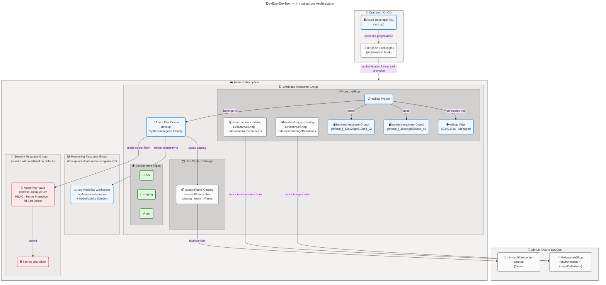

# DevExp-DevBox

[](./LICENSE)
[](https://learn.microsoft.com/en-us/azure/azure-resource-manager/bicep/overview)
[](https://learn.microsoft.com/en-us/azure/developer/azure-developer-cli/)
[](https://azure.microsoft.com)
[](https://learn.microsoft.com/en-us/azure/dev-box/overview-what-is-microsoft-dev-box)
[](https://learn.microsoft.com/en-us/azure/azure-resource-manager/bicep/deploy-to-subscription)

An **Azure Developer CLI (azd)**-enabled accelerator that provisions a fully configured [Microsoft Dev Box](https://learn.microsoft.com/en-us/azure/dev-box/overview-what-is-microsoft-dev-box) environment — including Dev Centers, projects, catalogs, environment types, Dev Box pools, networking, Key Vault secrets management, and centralized Log Analytics monitoring — all declared as Infrastructure-as-Code using Bicep.

## 📑 Table of Contents

- [Overview](#-overview)
- [Features](#-features)
- [Architecture](#️-architecture)
- [Quick Start](#-quick-start)
- [Requirements](#-requirements)
- [Deployment](#-deployment)
- [Usage](#-usage)
- [Configuration](#️-configuration)
- [Contributing](#-contributing)
- [License](#-license)

## 📖 Overview

**Overview**

DevExp-DevBox is an enterprise-grade platform engineering accelerator that automates the end-to-end provisioning of developer workstation infrastructure on Azure. It targets platform engineering teams who need a repeatable, configuration-driven approach to standing up Microsoft Dev Box environments across multiple projects and teams.

The solution follows Azure Landing Zone principles, separating workload, security, and monitoring concerns into independently managed resource groups. All configuration is YAML-driven, enabling teams to onboard new Dev Box projects, catalogs, networking topologies, and role assignments without modifying Bicep source files. The Bicep deployment is subscription-scoped (`targetScope = 'subscription'` in `infra/main.bicep`), so a single `azd up` command creates resource groups, provisions all resources, and applies RBAC role assignments in a single pass.

> [!NOTE]
> This accelerator supports both **GitHub** (`github`) and **Azure DevOps Git** (`adogit`) as source control back-ends for catalog and image definition synchronization. Set the `SOURCE_CONTROL_PLATFORM` environment variable or pass the `-s` / `-SourceControl` flag to the setup scripts before provisioning.

> [!TIP]
> `infra/settings/workload/devcenter.yaml` is the single configuration entry point for the entire Dev Center topology — projects, pools, catalogs, environment types, and RBAC roles are all declared there, and Bicep loads it at deployment time via `loadYamlContent()`.

## ✨ Features

**Overview**

DevExp-DevBox delivers a complete developer experience platform by composing Azure Dev Center, Key Vault, Log Analytics, virtual networking, and identity management into a single, automated deployment. Every feature maps directly to a dedicated Bicep module under `src/` and is parameterized through YAML files under `infra/settings/`.

> [!TIP]
> **Why This Matters**: Platform engineers can provision a production-grade Dev Box environment — with secure secrets, centralized logging, and role-based access — in a single `azd up` command, reducing onboarding time from days to minutes.

> [!IMPORTANT]
> **How It Works**: Each feature maps to a dedicated Bicep module under `src/`. The YAML configuration files under `infra/settings/` drive runtime parameterization, keeping infrastructure code generic and reusable across environments.

| ✨ Feature | 📝 Description | 📁 Bicep Module |
|---|---|---|
| 🏗️ Dev Center Provisioning | Deploys a fully configured Azure Dev Center (`devexp`) with system-assigned managed identity, catalog item sync, and Azure Monitor agent | `src/workload/core/devCenter.bicep` |
| 📦 Project Management | Creates one or more Dev Center projects, each with dedicated pools, catalogs, environment types, and RBAC assignments | `src/workload/project/project.bicep` |
| 🗂️ Catalog Integration | Syncs Dev Box image definitions and environment definitions from GitHub or Azure DevOps Git repositories on a scheduled basis | `src/workload/core/catalog.bicep`, `src/workload/project/projectCatalog.bicep` |
| 🖥️ Dev Box Pools | Creates role-specific Dev Box pools (e.g., `backend-engineer-0-pool`, `frontend-engineer-0-pool`) mapped to image definitions and VM SKUs via `~Catalog~<catalog>~<imageDefinition>` references | `src/workload/project/projectPool.bicep` |
| 🌐 Network Connectivity | Provisions Managed or Unmanaged virtual networks and attaches them to Dev Center projects via network connections; supports configurable address spaces and subnets | `src/connectivity/connectivity.bicep`, `src/connectivity/vnet.bicep` |
| 🔐 Key Vault Secrets | Creates an Azure Key Vault with RBAC authorization, purge protection, and 7-day soft delete; stores a GitHub Actions or ADO token as `gha-token` for private catalog authentication | `src/security/keyVault.bicep`, `src/security/secret.bicep` |
| 📊 Log Analytics Monitoring | Deploys a Log Analytics Workspace (PerGB2018 SKU) with the `AzureActivity` solution for centralized observability; VNet diagnostic settings forward all logs and metrics | `src/management/logAnalytics.bicep` |
| 🔑 RBAC Role Assignments | Assigns Dev Center (`Contributor`, `User Access Administrator`), project (`Dev Box User`, `Deployment Environment User`), and Key Vault (`Key Vault Secrets User/Officer`) roles to Azure AD groups | `src/identity/devCenterRoleAssignment.bicep`, `src/identity/orgRoleAssignment.bicep` |
| ⚙️ Environment Types | Configures `dev`, `staging`, and `uat` environment types at both Dev Center and project scope with configurable deployment target subscriptions | `src/workload/core/environmentType.bicep`, `src/workload/project/projectEnvironmentType.bicep` |
| 🏷️ Consistent Tagging | Applies `environment`, `division`, `team`, `project`, `costCenter`, `owner`, and `resources` tags to all resource groups and resources for governance and cost allocation | `infra/settings/resourceOrganization/azureResources.yaml` |
| 📜 Cross-Platform Setup Scripts | `setUp.sh` (Linux/macOS) and `setUp.ps1` (Windows) validate tool availability, authenticate with the chosen source control platform, and wire up the azd environment before provisioning | `setUp.sh`, `setUp.ps1` |
| 🧹 Teardown Automation | `cleanSetUp.ps1` removes subscription deployments, service principals, app registrations, and GitHub secrets with `-WhatIf` preview support | `cleanSetUp.ps1` |

## 🏗️ Architecture

**Overview**

DevExp-DevBox follows a layered Azure Landing Zone architecture with three resource group domains: **workload** (Dev Center and projects), **security** (Key Vault), and **monitoring** (Log Analytics). By default, all three domains share a single resource group (`devexp-workload-<env>-<region>-RG`) controlled by the `create` flags in `azureResources.yaml`. The Bicep deployment is subscription-scoped, enabling resource group creation alongside resource provisioning in one pass.

> [!TIP]
> **Why This Matters**: Separating domains into distinct resource groups — even when co-located by default — lets teams split security and monitoring into dedicated subscriptions as governance requirements evolve, without changing any Bicep source code.

> [!IMPORTANT]
> **How It Works**: `infra/main.bicep` reads `azureResources.yaml` at compile time via `loadYamlContent()`, derives resource group names using the pattern `<name>-<env>-<region>-RG`, and deploys the monitoring, security, and workload modules in dependency order.


```mermaid
---
title: "DevExp-DevBox — Infrastructure Architecture"
config:
  theme: base
  look: classic
  layout: dagre
  themeVariables:
    fontSize: '16px'
  flowchart:
    htmlLabels: true
---
flowchart TB
    accTitle: DevExp-DevBox Infrastructure Architecture Diagram
    accDescr: Azure subscription-scoped Bicep deployment creating three resource group domains — Workload, Security, and Monitoring — containing Dev Center with projects and pools, Key Vault for secret management, and Log Analytics for centralized observability.

    subgraph operator["👤 Operator / CI-CD"]
        CLI("🖥️ Azure Developer CLI<br/>(azd up)"):::core
        SetUp("📜 setUp.sh / setUp.ps1<br/>(preprovision hook)"):::neutral
    end

    subgraph subscription["☁️ Azure Subscription"]
        direction TB
        subgraph monitoring_rg["📊 Monitoring Resource Group<br/>devexp-workload-&lt;env&gt;-&lt;region&gt;-RG"]
            LAW("📈 Log Analytics Workspace<br/>logAnalytics-&lt;unique&gt;<br/>+ AzureActivity Solution"):::core
        end

        subgraph security_rg["🔐 Security Resource Group<br/>(shared with workload by default)"]
            KV("🔑 Azure Key Vault<br/>contoso-&lt;unique&gt;-kv<br/>RBAC · Purge Protection · 7d Soft Delete"):::danger
            Secret("🔒 Secret: gha-token"):::danger
        end

        subgraph workload_rg["🏗️ Workload Resource Group<br/>devexp-workload-&lt;env&gt;-&lt;region&gt;-RG"]
            DC("🏢 Azure Dev Center<br/>devexp<br/>System-Assigned Identity"):::core

            subgraph catalogs_sg["🗂️ Dev Center Catalogs"]
                Cat("📦 customTasks Catalog<br/>microsoft/devcenter-catalog · main · ./Tasks"):::neutral
            end

            subgraph env_types_sg["🌐 Environment Types"]
                direction LR
                ET1("🔧 dev"):::success
                ET2("🧪 staging"):::success
                ET3("✅ uat"):::success
            end

            subgraph project_sg["📁 Project: eShop"]
                Proj("📋 eShop Project"):::core
                ProjCat1("📦 environments catalog<br/>Evilazaro/eShop · /.devcenter/environments"):::neutral
                ProjCat2("🖼️ devboxImages catalog<br/>Evilazaro/eShop · /.devcenter/imageDefinitions"):::neutral
                Pool1("🖥️ backend-engineer-0-pool<br/>general_i_32c128gb512ssd_v2"):::core
                Pool2("🖥️ frontend-engineer-0-pool<br/>general_i_16c64gb256ssd_v2"):::core
                VNet("🌐 eShop VNet<br/>10.0.0.0/16 · Managed"):::core
            end
        end
    end

    subgraph github_sg["🐙 GitHub / Azure DevOps"]
        direction TB
        Repo1("📂 microsoft/devcenter-catalog<br/>(Tasks)"):::neutral
        Repo2("📂 Evilazaro/eShop<br/>(environments + imageDefinitions)"):::neutral
    end

    CLI -->|"executes preprovision"| SetUp
    SetUp -->|"authenticates & runs azd provision"| subscription
    DC -->|"syncs catalog"| Cat
    Cat -->|"fetches from"| Repo1
    ProjCat1 -->|"syncs environments from"| Repo2
    ProjCat2 -->|"syncs images from"| Repo2
    DC -->|"sends telemetry to"| LAW
    DC -->|"reads secret from"| KV
    KV -->|"stores"| Secret
    Proj -->|"belongs to"| DC
    Proj -->|"uses"| Pool1
    Proj -->|"uses"| Pool2
    Proj -->|"connected via"| VNet

    style operator fill:#F3F2F1,stroke:#8A8886,stroke-width:2px,color:#323130
    style subscription fill:#F3F2F1,stroke:#8A8886,stroke-width:2px,color:#323130
    style monitoring_rg fill:#EDEBE9,stroke:#8A8886,stroke-width:1px,color:#323130
    style security_rg fill:#EDEBE9,stroke:#8A8886,stroke-width:1px,color:#323130
    style workload_rg fill:#EDEBE9,stroke:#8A8886,stroke-width:1px,color:#323130
    style catalogs_sg fill:#D2D0CE,stroke:#8A8886,stroke-width:1px,color:#323130
    style env_types_sg fill:#D2D0CE,stroke:#8A8886,stroke-width:1px,color:#323130
    style project_sg fill:#D2D0CE,stroke:#8A8886,stroke-width:1px,color:#323130
    style github_sg fill:#F3F2F1,stroke:#8A8886,stroke-width:2px,color:#323130

    classDef neutral fill:#FAFAFA,stroke:#8A8886,stroke-width:2px,color:#323130
    classDef core fill:#EFF6FC,stroke:#0078D4,stroke-width:2px,color:#323130
    classDef success fill:#DFF6DD,stroke:#107C10,stroke-width:2px,color:#323130
    classDef danger fill:#FDE7E9,stroke:#D13438,stroke-width:2px,color:#323130
```

**Component Roles**

| 🏗️ Component | 🔧 Role | 📁 Bicep Module |
|---|---|---|
| 🏢 Azure Dev Center | Central hub — hosts catalogs, environment types, and project definitions; system-assigned identity enables RBAC and Key Vault access | `src/workload/core/devCenter.bicep` |
| 📁 Projects | Logical groupings of Dev Box pools and environment deployments scoped to a team or workstream | `src/workload/project/project.bicep` |
| 🖥️ Dev Box Pools | Pre-configured cloud workstations; pool names follow the pattern `<role>-<index>-pool` and reference image definitions via `~Catalog~<catalog>~<imageDef>` | `src/workload/project/projectPool.bicep` |
| 🔑 Key Vault | Secure storage for the `gha-token` secret used by private catalog authentication; name pattern `<name>-<unique>-kv` | `src/security/keyVault.bicep` |
| 📈 Log Analytics | Centralized monitoring for Dev Center telemetry and Azure Activity logs; PerGB2018 SKU with `AzureActivity` solution | `src/management/logAnalytics.bicep` |
| 🌐 Virtual Network | Provides network isolation for Dev Box sessions; supports Managed (Azure-hosted) or Unmanaged (custom VNet) types | `src/connectivity/vnet.bicep` |
| 🔒 RBAC Assignments | Subscription-scoped role assignments for Dev Center managed identity and Azure AD group access | `src/identity/devCenterRoleAssignment.bicep` |

## 🏗️ Architecture

**Overview**

DevExp-DevBox follows a layered Azure Landing Zone architecture with three resource group domains: **workload** (Dev Center and projects), **security** (Key Vault), and **monitoring** (Log Analytics). By default, all three domains share a single resource group (`devexp-workload-<env>-<region>-RG`) controlled by the `create` flags in `azureResources.yaml`. The Bicep deployment is subscription-scoped, enabling resource group creation alongside resource provisioning in one pass.

> [!TIP]
> **Why This Matters**: Separating domains into distinct resource groups — even when co-located by default — lets teams split security and monitoring into dedicated subscriptions as governance requirements evolve, without changing any Bicep source code.

> [!IMPORTANT]
> **How It Works**: `infra/main.bicep` reads `azureResources.yaml` at compile time via `loadYamlContent()`, derives resource group names using the pattern `<name>-<env>-<region>-RG`, and deploys the monitoring, security, and workload modules in dependency order.


```mermaid
---
title: "DevExp-DevBox — Infrastructure Architecture"
config:
  theme: base
  look: classic
  layout: dagre
  themeVariables:
    fontSize: '16px'
  flowchart:
    htmlLabels: true
---
flowchart TB
    accTitle: DevExp-DevBox Infrastructure Architecture Diagram
    accDescr: Azure subscription-scoped Bicep deployment creating three resource group domains — Workload, Security, and Monitoring — containing Dev Center with projects and pools, Key Vault for secret management, and Log Analytics for centralized observability.

    subgraph operator["👤 Operator / CI-CD"]
        CLI("🖥️ Azure Developer CLI<br/>(azd up)"):::core
        SetUp("📜 setUp.sh / setUp.ps1<br/>(preprovision hook)"):::neutral
    end

    subgraph subscription["☁️ Azure Subscription"]
        direction TB
        subgraph monitoring_rg["📊 Monitoring Resource Group<br/>devexp-workload-&lt;env&gt;-&lt;region&gt;-RG"]
            LAW("📈 Log Analytics Workspace<br/>logAnalytics-&lt;unique&gt;<br/>+ AzureActivity Solution"):::core
        end

        subgraph security_rg["🔐 Security Resource Group<br/>(shared with workload by default)"]
            KV("🔑 Azure Key Vault<br/>contoso-&lt;unique&gt;-kv<br/>RBAC · Purge Protection · 7d Soft Delete"):::danger
            Secret("🔒 Secret: gha-token"):::danger
        end

        subgraph workload_rg["🏗️ Workload Resource Group<br/>devexp-workload-&lt;env&gt;-&lt;region&gt;-RG"]
            DC("🏢 Azure Dev Center<br/>devexp<br/>System-Assigned Identity"):::core

            subgraph catalogs_sg["🗂️ Dev Center Catalogs"]
                Cat("📦 customTasks Catalog<br/>microsoft/devcenter-catalog · main · ./Tasks"):::neutral
            end

            subgraph env_types_sg["🌐 Environment Types"]
                direction LR
                ET1("🔧 dev"):::success
                ET2("🧪 staging"):::success
                ET3("✅ uat"):::success
            end

            subgraph project_sg["📁 Project: eShop"]
                Proj("📋 eShop Project"):::core
                ProjCat1("📦 environments catalog<br/>Evilazaro/eShop · /.devcenter/environments"):::neutral
                ProjCat2("🖼️ devboxImages catalog<br/>Evilazaro/eShop · /.devcenter/imageDefinitions"):::neutral
                Pool1("🖥️ backend-engineer-0-pool<br/>general_i_32c128gb512ssd_v2"):::core
                Pool2("🖥️ frontend-engineer-0-pool<br/>general_i_16c64gb256ssd_v2"):::core
                VNet("🌐 eShop VNet<br/>10.0.0.0/16 · Managed"):::core
            end
        end
    end

    subgraph github_sg["🐙 GitHub / Azure DevOps"]
        direction TB
        Repo1("📂 microsoft/devcenter-catalog<br/>(Tasks)"):::neutral
        Repo2("📂 Evilazaro/eShop<br/>(environments + imageDefinitions)"):::neutral
    end

    CLI -->|"executes preprovision"| SetUp
    SetUp -->|"authenticates & runs azd provision"| subscription
    DC -->|"syncs catalog"| Cat
    Cat -->|"fetches from"| Repo1
    ProjCat1 -->|"syncs environments from"| Repo2
    ProjCat2 -->|"syncs images from"| Repo2
    DC -->|"sends telemetry to"| LAW
    DC -->|"reads secret from"| KV
    KV -->|"stores"| Secret
    Proj -->|"belongs to"| DC
    Proj -->|"uses"| Pool1
    Proj -->|"uses"| Pool2
    Proj -->|"connected via"| VNet

    style operator fill:#F3F2F1,stroke:#8A8886,stroke-width:2px,color:#323130
    style subscription fill:#F3F2F1,stroke:#8A8886,stroke-width:2px,color:#323130
    style monitoring_rg fill:#EDEBE9,stroke:#8A8886,stroke-width:1px,color:#323130
    style security_rg fill:#EDEBE9,stroke:#8A8886,stroke-width:1px,color:#323130
    style workload_rg fill:#EDEBE9,stroke:#8A8886,stroke-width:1px,color:#323130
    style catalogs_sg fill:#D2D0CE,stroke:#8A8886,stroke-width:1px,color:#323130
    style env_types_sg fill:#D2D0CE,stroke:#8A8886,stroke-width:1px,color:#323130
    style project_sg fill:#D2D0CE,stroke:#8A8886,stroke-width:1px,color:#323130
    style github_sg fill:#F3F2F1,stroke:#8A8886,stroke-width:2px,color:#323130

    classDef neutral fill:#FAFAFA,stroke:#8A8886,stroke-width:2px,color:#323130
    classDef core fill:#EFF6FC,stroke:#0078D4,stroke-width:2px,color:#323130
    classDef success fill:#DFF6DD,stroke:#107C10,stroke-width:2px,color:#323130
    classDef danger fill:#FDE7E9,stroke:#D13438,stroke-width:2px,color:#323130
```

**Component Roles**

| 🏗️ Component | 🔧 Role | 📁 Bicep Module |
|---|---|---|
| 🏢 Azure Dev Center | Central hub — hosts catalogs, environment types, and project definitions; system-assigned identity enables RBAC and Key Vault access | `src/workload/core/devCenter.bicep` |
| 📁 Projects | Logical groupings of Dev Box pools and environment deployments scoped to a team or workstream | `src/workload/project/project.bicep` |
| 🖥️ Dev Box Pools | Pre-configured cloud workstations; pool names follow the pattern `<role>-<index>-pool` and reference image definitions via `~Catalog~<catalog>~<imageDef>` | `src/workload/project/projectPool.bicep` |
| 🔑 Key Vault | Secure storage for the `gha-token` secret used by private catalog authentication; name pattern `<name>-<unique>-kv` | `src/security/keyVault.bicep` |
| 📈 Log Analytics | Centralized monitoring for Dev Center telemetry and Azure Activity logs; PerGB2018 SKU with `AzureActivity` solution | `src/management/logAnalytics.bicep` |
| 🌐 Virtual Network | Provides network isolation for Dev Box sessions; supports Managed (Azure-hosted) or Unmanaged (custom VNet) types | `src/connectivity/vnet.bicep` |
| 🔒 RBAC Assignments | Subscription-scoped role assignments for Dev Center managed identity and Azure AD group access | `src/identity/devCenterRoleAssignment.bicep` |

## 🚀 Quick Start

**Overview**

The fastest path to a running Dev Box environment is a single `azd up` command. The `preprovision` hook in `azure.yaml` automatically invokes the platform-appropriate setup script to authenticate with your source control provider before Bicep resources are provisioned.

> [!TIP]
> **Why This Matters**: The setup scripts (`setUp.sh` / `setUp.ps1`) validate all required CLI tools are installed and authenticated before any Azure resources are created, preventing partial deployments from missing prerequisites.

> [!NOTE]
> On Windows, the `preprovision` hook in `azure.yaml` attempts to invoke `setUp.sh` via `bash`. Ensure Git Bash or WSL is available on Windows hosts. If `bash` is not found, the hook falls back to executing `setUp.sh` directly.

**Step 1 — Verify required tools**

```bash
az version          # Azure CLI — latest stable
azd version         # Azure Developer CLI — latest stable
gh auth status      # GitHub CLI — required when SOURCE_CONTROL_PLATFORM=github
```

**Step 2 — Clone the repository**

```bash
git clone https://github.com/Evilazaro/DevExp-DevBox.git
cd DevExp-DevBox
```

**Step 3 — Authenticate with Azure**

```bash
az login
azd auth login
```

**Step 4 — Initialize the azd environment**

```bash
azd env new <your-env-name>
# Example (environment name must be 2–10 characters):
azd env new dev
```

**Step 5 — Set required environment variables**

```bash
azd env set AZURE_LOCATION eastus2
azd env set KEY_VAULT_SECRET <your-github-pat-or-ado-token>
# Optional: set source control platform (defaults to "github")
azd env set SOURCE_CONTROL_PLATFORM github
```

**Step 6 — Deploy everything**

```bash
azd up
```

**Expected output:**

```text
  (✓) Done: Resource group: devexp-workload-dev-eastus2-RG
  (✓) Done: Log Analytics Workspace: logAnalytics-<unique>
  (✓) Done: Key Vault: contoso-<unique>-kv
  (✓) Done: DevCenter: devexp
  (✓) Done: Project: eShop
  (✓) Done: Dev Box Pools: backend-engineer-0-pool, frontend-engineer-0-pool

SUCCESS: Your up workflow to provision and deploy to Azure completed in 12m 34s.
```

## 📋 Requirements

**Overview**

DevExp-DevBox requires an active Azure subscription with sufficient quota for Dev Box resources, along with local tooling for authentication and deployment. All prerequisites are validated at the start of `setUp.sh` / `setUp.ps1` via `test_command_availability` / `Test-CommandAvailability` checks before any Azure resources are created.

> [!TIP]
> **Why This Matters**: Missing any prerequisite tool causes the `preprovision` hook to exit with an error before any Azure resources are created, preventing partial deployments. Run `az version && azd version && gh auth status` manually to verify prerequisites before invoking `azd up`.

> [!IMPORTANT]
> **How It Works**: The setup scripts verify each required command is present in `PATH` and that authentication is active before calling `azd provision`. The Bicep deployment enforces region constraints via the `@allowed` decorator on the `location` parameter in `infra/main.bicep` (lines 8–25).

| 🔧 Requirement | 📋 Version / Details | ✅ When Required | 🔗 Reference |
|---|---|---|---|
| ☁️ Azure Subscription | Active subscription with **Owner** or **Contributor + User Access Administrator** rights (subscription-scoped role assignments are created during deployment) | Always | [Azure Portal](https://portal.azure.com) |
| 🔵 Azure CLI (`az`) | Latest stable | Always | [Install Azure CLI](https://learn.microsoft.com/en-us/cli/azure/install-azure-cli) |
| 🚀 Azure Developer CLI (`azd`) | Latest stable | Always | [Install azd](https://learn.microsoft.com/en-us/azure/developer/azure-developer-cli/install-azd) |
| 🐙 GitHub CLI (`gh`) | Latest stable; required for GitHub authentication flow | When `SOURCE_CONTROL_PLATFORM=github` | [Install GitHub CLI](https://cli.github.com/) |
| 🌐 Supported Azure Region | `eastus`, `eastus2`, `westus`, `westus2`, `westus3`, `centralus`, `northeurope`, `westeurope`, `southeastasia`, `australiaeast`, `japaneast`, `uksouth`, `canadacentral`, `swedencentral`, `switzerlandnorth`, `germanywestcentral` | Always | `infra/main.bicep:8-25` |
| 🔑 GitHub PAT or ADO Token | Personal Access Token with `repo` scope for private catalog authentication; stored in Key Vault as `gha-token` | When using private catalogs | `infra/settings/security/security.yaml` |
| 📦 Bicep CLI | Included with Azure CLI 2.20.0+ | Always | [Bicep overview](https://learn.microsoft.com/en-us/azure/azure-resource-manager/bicep/overview) |
| 🐚 Bash (Windows only) | Git Bash or WSL; the `azure.yaml` preprovision hook runs `setUp.sh` via `bash` on Windows | Windows hosts | [Git for Windows](https://gitforwindows.org/) |

## 📦 Deployment

**Overview**

The deployment pipeline is orchestrated by the Azure Developer CLI using the `azure.yaml` configuration file at the repository root. A `preprovision` hook runs the platform-appropriate setup script to authenticate with the chosen source control platform before Bicep resources are provisioned. The Bicep entry point at `infra/main.bicep` deploys monitoring, security, and workload modules in dependency order at subscription scope.

> [!IMPORTANT]
> **How It Works**: `azd up` executes the `preprovision` hook defined in `azure.yaml`, which invokes `setUp.sh -e <env> -s <platform>` (Linux/macOS) or calls `setUp.sh` via `bash` on Windows. The script validates tool availability, authenticates with GitHub or Azure DevOps, and sets up the environment. After the hook succeeds, `azd provision` deploys the subscription-scoped Bicep template.

> [!TIP]
> **Why This Matters**: The `preprovision` hook ensures source control authentication is in place before any Azure resources are created. This prevents catalog sync failures that would occur if the Dev Center is provisioned without a valid `gha-token` in Key Vault.

**Linux / macOS**

```bash
# Full deploy with GitHub as source control
./setUp.sh -e dev -s github

# Full deploy with Azure DevOps
./setUp.sh -e dev -s adogit

# Then provision infrastructure
azd provision
```

**Windows (PowerShell)**

```powershell
# Full deploy with GitHub as source control
.\setUp.ps1 -EnvName dev -SourceControl github

# Full deploy with Azure DevOps
.\setUp.ps1 -EnvName dev -SourceControl adogit

# Then provision infrastructure
azd provision
```

**One-command deploy (all platforms)**

```bash
azd up
```

**Cleanup / Teardown**

```powershell
# Preview cleanup actions without making changes
.\cleanSetUp.ps1 -EnvName dev -Location eastus2 -WhatIf

# Remove all deployed resources, role assignments, credentials, and GitHub secrets
.\cleanSetUp.ps1 -EnvName dev -Location eastus2

# Custom app registration and GitHub secret names
.\cleanSetUp.ps1 -EnvName dev -Location eastus2 `
  -AppDisplayName "ContosoDevEx GitHub Actions Enterprise App" `
  -GhSecretName "AZURE_CREDENTIALS"
```

> [!WARNING]
> `cleanSetUp.ps1` deletes Azure subscription-level deployments, service principals, app registrations, and GitHub secrets. Always run with `-WhatIf` first to preview actions. This operation is **irreversible**.

## 💻 Usage

**Overview**

After deployment, platform engineers interact with the Dev Center through the Azure portal, Azure CLI, or VS Code Dev Box extension. The YAML configuration files in `infra/settings/` control the shape of the environment — modifying them and re-running `azd provision` applies changes incrementally without recreating existing resources.

> [!TIP]
> **Onboarding a new project**: Add a new entry under the `projects:` array in `infra/settings/workload/devcenter.yaml` with the project name, description, network settings, identity/RBAC, pools, catalogs, and environment types. Then run `azd provision` to deploy.

> [!IMPORTANT]
> **How It Works**: `azd provision` re-evaluates the YAML configuration and reconciles the live Azure state with the desired configuration. Existing resources are updated in-place where possible; new entries are created. Removed entries are not automatically deleted — use `cleanSetUp.ps1` for full teardown.

**Query deployed outputs**

```bash
# Get all azd environment values including Dev Center name and project list
azd env get-values

# Get just the Dev Center name
azd env get-values | grep AZURE_DEV_CENTER_NAME

# Get the list of deployed projects
azd env get-values | grep AZURE_DEV_CENTER_PROJECTS
```

**List Dev Boxes in a project**

```bash
az devcenter dev dev-box list \
  --dev-center-name devexp \
  --project-name eShop
```

**Expected output:**

```json
[
  {
    "name": "my-dev-box",
    "poolName": "backend-engineer-0-pool",
    "provisioningState": "Succeeded",
    "powerState": "Running"
  }
]
```

**Create a Dev Box**

```bash
az devcenter dev dev-box create \
  --dev-center-name devexp \
  --project-name eShop \
  --pool-name backend-engineer-0-pool \
  --name my-dev-box
```

**Add a new catalog to the Dev Center**

Edit `infra/settings/workload/devcenter.yaml`:

```yaml
catalogs:
  - name: 'myNewCatalog'
    type: gitHub
    visibility: public
    uri: 'https://github.com/my-org/my-catalog.git'
    branch: 'main'
    path: './Tasks'
```

Then re-provision:

```bash
azd provision
```

**Add a new Dev Box pool to an existing project**

Edit the target project entry in `infra/settings/workload/devcenter.yaml`:

```yaml
pools:
  - name: 'data-engineer'
    imageDefinitionName: 'eshop-data-dev'
    vmSku: general_i_32c128gb512ssd_v2
```

Then apply:

```bash
azd provision
```

**Update environment name and region**

```bash
azd env set AZURE_ENV_NAME staging
azd env set AZURE_LOCATION westeurope
azd provision
```
