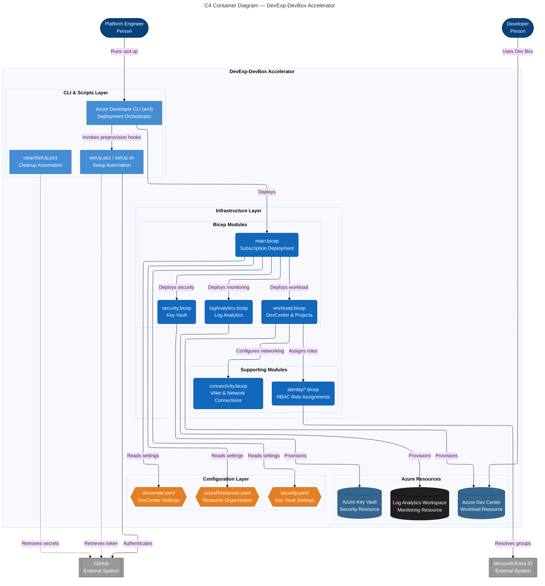

# DevExp-DevBox

<!-- Section 2: Badges -->


> [!NOTE] The badges above are static placeholders. **Replace them with dynamic
> badges** from your CI/CD pipeline once configured.

<!-- Section 3: Description -->

## Description

**DevExp-DevBox automates the provisioning and configuration of Microsoft Dev
Center environments on Azure**, solving the complexity of manually setting up
developer workstations with consistent security, networking, and identity
controls. The accelerator **deploys a complete Dev Box platform** using Azure
Bicep infrastructure-as-code and the Azure Developer CLI (`azd`).

**Organizations adopting Microsoft Dev Box face challenges** coordinating
resource groups, Key Vault secrets, Log Analytics monitoring, virtual network
connectivity, RBAC role assignments, and Dev Center project configurations
across teams. **This repository addresses those challenges** by encoding the
entire infrastructure lifecycle into declarative YAML configuration files and
modular Bicep templates that `azd` orchestrates through a single command.
(source: azure.yaml)

**The technology stack centers on Azure Bicep** for infrastructure definitions,
**YAML for configuration management**, PowerShell and Bash for cross-platform
setup automation, and JSON Schema for configuration validation. **The Azure
Developer CLI (`azd`) serves as the deployment orchestrator**, invoking
preprovision hooks that handle authentication, environment initialization, and
source control integration. (source: azure.yaml)

<!-- Section 4: Table of Contents -->

## Table of Contents

- [Description](#description)
- [Features](#features)
- [Architecture](#architecture)
- [Technologies Used](#technologies-used)
- [Quick Start](#quick-start)
- [Configuration](#configuration)
- [Deployment](#deployment)
- [Usage](#usage)
- [Contributing](#contributing)
- [License](#license)

<!-- Section 5: Features -->

## Features

| Feature                    | Description                                                                                                                                                                                                              |
| -------------------------- | ------------------------------------------------------------------------------------------------------------------------------------------------------------------------------------------------------------------------ |
| 🏗️ Dev Center Provisioning | **Deploys a fully configured Azure Dev Center** with catalog sync, Microsoft-hosted networking, and Azure Monitor agent installation enabled by default. (source: infra/settings/workload/devcenter.yaml)                |
| 📁 Project Management      | **Creates Dev Center projects** with role-specific Dev Box pools (backend-engineer, frontend-engineer), each configured with appropriate VM SKUs and image definitions. (source: infra/settings/workload/devcenter.yaml) |
| 🔐 Key Vault Integration   | **Provisions Azure Key Vault** with purge protection, soft delete, and RBAC authorization for secure storage of GitHub access tokens and other secrets. (source: infra/settings/security/security.yaml)                  |
| 📊 Centralized Monitoring  | **Deploys a Log Analytics workspace** with diagnostic settings applied to Key Vault and DevCenter resources for unified observability. (source: src/management/logAnalytics.bicep)                                       |
| 🌐 Network Connectivity    | **Configures virtual networks and subnets** with support for both managed and unmanaged network types, including DevCenter network connection attachments. (source: src/connectivity/connectivity.bicep)                 |
| 🔑 RBAC & Managed Identity | **Assigns Azure RBAC roles** using SystemAssigned managed identities at subscription, resource group, and project scopes following the principle of least privilege. (source: infra/settings/workload/devcenter.yaml)    |
| 📦 Catalog Integration     | **Connects Git-based catalogs** (GitHub) for Dev Box image definitions, environment definitions, and custom tasks with branch and path configuration. (source: infra/settings/workload/devcenter.yaml)                   |
| 🌍 Environment Types       | **Defines lifecycle environments** (dev, staging, UAT) with optional deployment target IDs for each Dev Center project. (source: infra/settings/workload/devcenter.yaml)                                                 |
| ⚙️ Cross-Platform Setup    | **Provides setup scripts** for both PowerShell (`setUp.ps1`) and Bash (`setUp.sh`) that handle `azd` environment initialization, authentication, and source control integration. (source: setUp.ps1)                     |
| 🧹 Cleanup Automation      | **Includes a cleanup script** (`cleanSetUp.ps1`) that removes subscription deployments, role assignments, service principals, GitHub secrets, and resource groups. (source: cleanSetUp.ps1)                              |

<!-- Section 6: Architecture -->

## Architecture

**The solution follows Azure Landing Zone principles**, organizing resources
into three functional resource groups: workload (Dev Center and projects),
security (Key Vault), and monitoring (Log Analytics). **The main Bicep
deployment targets the subscription scope** and orchestrates modular deployments
into each resource group. **Each Dev Center project encapsulates** its own
network connectivity, identity configuration, catalog references, environment
types, and Dev Box pools. (source: infra/main.bicep)


```mermaid
---
title: C4 Container Diagram — DevExp-DevBox Accelerator
config:
  theme: base
  layout: elk
  flowchart:
    htmlLabels: true
    rankSpacing: 60
    nodeSpacing: 40
  themeVariables:
    fontSize: 16px
---
flowchart TB
    accTitle: C4 Container Diagram — DevExp-DevBox Accelerator
    accDescr: High-level architecture showing platform engineers deploying Dev Center infrastructure via azd, with modular Bicep templates organized into workload, security, monitoring, connectivity, and identity layers.

    platformEngineer(["Platform Engineer<br/>Person"]):::person
    developer(["Developer<br/>Person"]):::person

    gitHub[["GitHub<br/>External System"]]:::external
    azureAD[["Microsoft Entra ID<br/>External System"]]:::external

    subgraph systemBoundary["<b>DevExp-DevBox Accelerator</b>"]
      direction TB

      subgraph presentation["<b>CLI & Scripts Layer</b>"]
        direction TB
        azdCli["Azure Developer CLI (azd)<br/>Deployment Orchestrator"]:::clientSide
        setupScripts["setUp.ps1 / setUp.sh<br/>Setup Automation"]:::clientSide
        cleanupScript["cleanSetUp.ps1<br/>Cleanup Automation"]:::clientSide
      end

      subgraph application["<b>Infrastructure Layer</b>"]
        direction TB

        subgraph syncServices["<b>Bicep Modules</b>"]
          direction TB
          mainBicep("main.bicep<br/>Subscription Deployment"):::serverSide
          workloadModule("workload.bicep<br/>DevCenter & Projects"):::serverSide
          securityModule("security.bicep<br/>Key Vault"):::serverSide
          monitoringModule("logAnalytics.bicep<br/>Log Analytics"):::serverSide
        end

        subgraph asyncWorkers["<b>Supporting Modules</b>"]
          direction TB
          connectivityModule("connectivity.bicep<br/>VNet & Network Connections"):::serverSide
          identityModule("identity/*.bicep<br/>RBAC Role Assignments"):::serverSide
        end
      end

      subgraph crossCutting["<b>Configuration Layer</b>"]
        direction TB
        devCenterConfig{{"devcenter.yaml<br/>DevCenter Settings"}}:::crossCutting
        securityConfig{{"security.yaml<br/>Key Vault Settings"}}:::crossCutting
        resourceOrgConfig{{"azureResources.yaml<br/>Resource Organization"}}:::crossCutting
      end

      subgraph dataLayer["<b>Azure Resources</b>"]
        direction TB
        devCenter[("Azure Dev Center<br/>Workload Resource")]:::dataOperational
        keyVault[("Azure Key Vault<br/>Security Resource")]:::dataOperational
        logAnalytics[("Log Analytics Workspace<br/>Monitoring Resource")]:::dataQueue
      end
    end

    platformEngineer -->|"Runs azd up"| azdCli
    developer -->|"Uses Dev Box"| devCenter
    azdCli -->|"Invokes preprovision hooks"| setupScripts
    azdCli -->|"Deploys"| mainBicep
    mainBicep -->|"Deploys workload"| workloadModule
    mainBicep -->|"Deploys security"| securityModule
    mainBicep -->|"Deploys monitoring"| monitoringModule
    workloadModule -->|"Provisions"| devCenter
    workloadModule -->|"Configures networking"| connectivityModule
    workloadModule -->|"Assigns roles"| identityModule
    securityModule -->|"Provisions"| keyVault
    monitoringModule -->|"Provisions"| logAnalytics
    mainBicep -->|"Reads settings"| devCenterConfig
    mainBicep -->|"Reads settings"| securityConfig
    mainBicep -->|"Reads settings"| resourceOrgConfig
    setupScripts -->|"Authenticates"| gitHub
    identityModule -->|"Resolves groups"| azureAD
    setupScripts -.->|"Retrieves token"| gitHub
    cleanupScript -.->|"Removes secrets"| gitHub

    classDef person fill:#08427b,stroke:#052e57,color:#ffffff
    classDef external fill:#999999,stroke:#666666,color:#ffffff
    classDef clientSide fill:#438dd5,stroke:#2e6a9b,color:#ffffff
    classDef serverSide fill:#1168bd,stroke:#0b4884,color:#ffffff
    classDef crossCutting fill:#e67e22,stroke:#b35900,color:#ffffff
    classDef dataOperational fill:#336791,stroke:#1f3f57,color:#ffffff
    classDef dataQueue fill:#231F20,stroke:#000000,color:#ffffff
```

<!-- Section 7: Technologies Used -->

## Technologies Used

| Technology                  | Type                    | Purpose                                                                                                                                   |
| --------------------------- | ----------------------- | ----------------------------------------------------------------------------------------------------------------------------------------- |
| Azure Bicep                 | Infrastructure as Code  | **Defines all Azure resource deployments** using declarative templates with type safety and modular composition.                          |
| Azure Developer CLI (`azd`) | Deployment Orchestrator | **Orchestrates the full deployment lifecycle** including environment management, preprovision hooks, and parameterized Bicep deployments. |
| PowerShell                  | Scripting               | **Automates environment setup and cleanup** on Windows, handling `azd` initialization, authentication, and resource teardown.             |
| Bash                        | Scripting               | **Automates environment setup** on Linux and macOS with equivalent functionality to the PowerShell scripts.                               |
| YAML                        | Configuration           | **Stores declarative configuration** for Dev Center, security, and resource organization settings consumed by Bicep at deploy time.       |
| JSON Schema                 | Validation              | **Validates YAML configuration files** against defined schemas to enforce structure and prevent misconfigurations.                        |
| Azure CLI (`az`)            | CLI Dependency          | **Provides Azure authentication and resource management** commands used by setup scripts.                                                 |
| GitHub CLI (`gh`)           | CLI Dependency          | **Handles GitHub authentication and secret management** for source control integration.                                                   |
| `jq`                        | CLI Dependency          | **Processes JSON output** from Azure CLI commands in Bash scripts.                                                                        |

<!-- Section 8: Quick Start -->

## Quick Start

### Prerequisites

| Prerequisite                | Version | Purpose                                                                                                                     |
| --------------------------- | ------- | --------------------------------------------------------------------------------------------------------------------------- |
| Azure CLI (`az`)            | Latest  | **Required for Azure authentication** and resource management.                                                              |
| Azure Developer CLI (`azd`) | Latest  | **Required for deployment orchestration**.                                                                                  |
| GitHub CLI (`gh`)           | Latest  | **Required for GitHub authentication** and secret management when using GitHub as source control.                           |
| `jq`                        | Latest  | **Required for JSON processing** in Bash scripts (Linux/macOS only).                                                        |
| Azure Subscription          | —       | **An active Azure subscription** with permissions to create resource groups, Dev Centers, Key Vaults, and role assignments. |

### Installation Steps

1. **Clone the repository:**

   ```bash
   git clone https://github.com/Evilazaro/DevExp-DevBox.git
   cd DevExp-DevBox
   ```

2. **Authenticate with Azure:**

   ```bash
   az login
   azd auth login
   ```

3. **Initialize the `azd` environment:**

   ```bash
   azd init -e <your-environment-name>
   ```

4. **Set required environment variables:**

   ```bash
   azd env set AZURE_LOCATION "eastus2"
   azd env set KEY_VAULT_SECRET "<your-github-pat>"
   azd env set SOURCE_CONTROL_PLATFORM "github"
   ```

5. **Deploy the infrastructure:**

   ```bash
   azd up
   ```

   > [!IMPORTANT] **The `azd up` command runs preprovision hooks** that execute
   > `setUp.sh` (or `setUp.ps1` on Windows) before deploying the Bicep
   > templates. Ensure all CLI prerequisites are installed before running this
   > command.

6. **Verify the deployment:**

   ```bash
   az devcenter admin devcenter list --query "[].name" --output table
   ```

   Expected output:

   ```text
   Name
   ------
   devexp
   ```

<!-- Section 9: Configuration -->

## Configuration

**The repository uses a runtime configuration surface** with `azd` environment
variables and YAML settings files that control deployment behavior. (source:
infra/main.parameters.json)

| Option                    | Default  | Description                                                                                                                                                                                 |
| ------------------------- | -------- | ------------------------------------------------------------------------------------------------------------------------------------------------------------------------------------------- |
| `AZURE_ENV_NAME`          | —        | **Environment name** used for resource naming and tagging across all deployed resources. Maps to the `environmentName` Bicep parameter. (source: infra/main.parameters.json)                |
| `AZURE_LOCATION`          | —        | **Azure region** where all resources deploy. Constrained to a validated set of regions in `main.bicep`. (source: infra/main.bicep)                                                          |
| `KEY_VAULT_SECRET`        | —        | **GitHub personal access token** stored as a Key Vault secret for catalog authentication. (source: infra/main.parameters.json)                                                              |
| `SOURCE_CONTROL_PLATFORM` | `github` | **Source control platform** selection (`github` or `adogit`) that determines authentication flow in setup scripts. (source: azure.yaml)                                                     |
| `devcenter.yaml`          | See file | **Dev Center configuration** defining the center name, identity, role assignments, catalogs, environment types, projects, pools, and tags. (source: infra/settings/workload/devcenter.yaml) |
| `security.yaml`           | See file | **Key Vault configuration** defining vault name, purge protection, soft delete, RBAC authorization, and secret naming. (source: infra/settings/security/security.yaml)                      |
| `azureResources.yaml`     | See file | **Resource organization** defining workload, security, and monitoring resource group names, creation flags, and tags. (source: infra/settings/resourceOrganization/azureResources.yaml)     |

**Example override** — change the Dev Center name in
`infra/settings/workload/devcenter.yaml`:

```yaml
name: 'my-custom-devcenter'
```

<!-- Section 10: Deployment -->

## Deployment

1. **Ensure all prerequisites are installed** (see [Quick Start](#quick-start)).

2. **Configure the `azd` environment** with the required variables:

   ```bash
   azd env set AZURE_LOCATION "eastus2"
   azd env set KEY_VAULT_SECRET "<your-github-pat>"
   ```

3. **Run the full deployment:**

   ```bash
   azd up
   ```

   > [!TIP] **The deployment creates resource groups, Key Vault, Log Analytics,
   > Dev Center, projects, network connectivity, and RBAC assignments** in a
   > single orchestrated operation. The preprovision hook handles authentication
   > and environment setup automatically. (source: azure.yaml)

4. **Verify resource group creation:**

   ```bash
   az group list --query "[?contains(name, 'devexp')]" --output table
   ```

5. **To tear down all resources**, run the cleanup script:

   ```powershell
   .\cleanSetUp.ps1 -EnvName "<your-env-name>" -Location "eastus2"
   ```

   > [!CAUTION] **The cleanup script permanently deletes** subscription
   > deployments, role assignments, service principals, GitHub secrets, and
   > resource groups. This action cannot be undone.

<!-- Section 11: Usage -->

## Usage

### Customize Dev Box Pools

**Edit `infra/settings/workload/devcenter.yaml`** to add or modify Dev Box pools
for a project:

```yaml
pools:
  - name: 'data-engineer'
    imageDefinitionName: 'data-dev-image'
    vmSku: general_i_16c64gb256ssd_v2
```

Then redeploy:

```bash
azd up
```

### Add a New Project

**Add a new project entry** to the `projects` array in
`infra/settings/workload/devcenter.yaml`:

```yaml
projects:
  - name: 'newProject'
    description: 'New project for the team.'
    network:
      name: newProject
      create: true
      resourceGroupName: 'newProject-connectivity-RG'
      virtualNetworkType: Managed
      addressPrefixes:
        - 10.1.0.0/16
      subnets:
        - name: newProject-subnet
          properties:
            addressPrefix: 10.1.1.0/24
      tags:
        environment: dev
        project: newProject
    identity:
      type: SystemAssigned
      roleAssignments:
        - azureADGroupId: '<your-aad-group-id>'
          azureADGroupName: 'New Project Engineers'
          azureRBACRoles:
            - name: 'Dev Box User'
              id: '45d50f46-0b78-4001-a660-4198cbe8cd05'
              scope: Project
    pools:
      - name: 'general-engineer'
        imageDefinitionName: 'general-dev'
        vmSku: general_i_16c64gb256ssd_v2
    environmentTypes:
      - name: 'dev'
        deploymentTargetId: ''
    catalogs: []
    tags:
      environment: dev
      project: newProject
```

Expected output after `azd up`:

```text
Deploying services (azd deploy)

  (✓) Done: Resource group created
  (✓) Done: DevCenter project 'newProject' provisioned
```

### Add a New Environment Type

**Extend the `environmentTypes` array** in `devcenter.yaml`:

```yaml
environmentTypes:
  - name: 'dev'
    deploymentTargetId: ''
  - name: 'production'
    deploymentTargetId: '<subscription-id>'
```

<!-- Section 12: Contributing -->

## Contributing

Contributions are welcome. **Submit issues and pull requests** through the
[GitHub repository](https://github.com/Evilazaro/DevExp-DevBox).

> [!NOTE] **No `CONTRIBUTING.md` or `CODE_OF_CONDUCT.md` files exist** in this
> repository. Consider adding these files to establish contribution guidelines
> and community standards.

1. **Fork the repository** and create a feature branch.
2. **Make changes** and test locally using `azd up` in a non-production
   environment.
3. **Submit a pull request** with a clear description of the changes.

<!-- Section 13: License -->

## License

**This project is licensed under the MIT License.** See the [LICENSE](LICENSE)
file for details.
