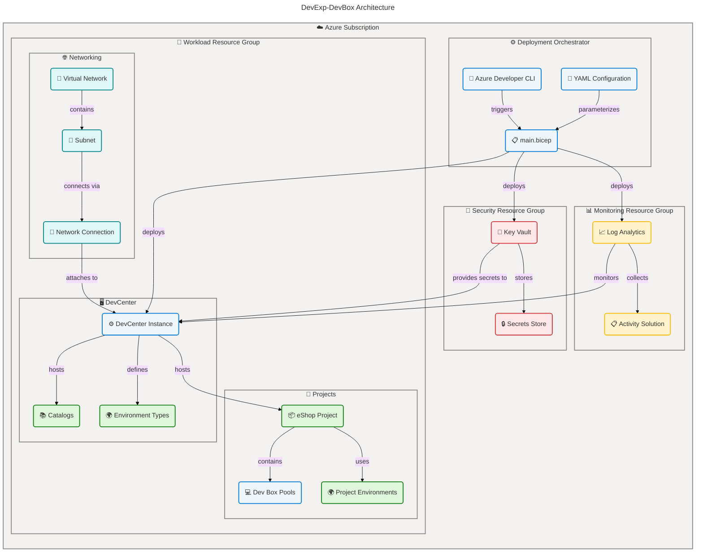

# DevExp-DevBox

[](LICENSE)
[](https://azure.microsoft.com)
[](https://learn.microsoft.com/azure/azure-resource-manager/bicep/)
[](#overview)

## Overview

**DevExp-DevBox** is a **Microsoft Dev Box** adoption and deployment accelerator
that provisions enterprise-grade developer environments on Azure. It enables
platform engineering teams to deliver self-service, cloud-powered workstations
to developers through **Azure DevCenter** and Dev Box, reducing onboarding time
from **days to minutes**.

> [IMPORTANT]
> Developer environment inconsistency and lengthy onboarding are
> top productivity killers in enterprise teams. DevExp-DevBox eliminates these
> issues by codifying your entire developer platform — from networking and
> security to Dev Box pools and environment types — as **Infrastructure as
> Code**, deployable with a single command.

<!-- -->

> [NOTE]
> The accelerator uses **Azure Bicep** templates with YAML-driven
> configuration to deploy a complete DevCenter ecosystem. It creates three
> resource groups (security, monitoring, workload), provisions Key Vault, Log
> Analytics, and Virtual Networks, then deploys DevCenter with projects, pools,
> catalogs, and environment types — all parameterized through human-readable
> YAML files and deployable via the Azure Developer CLI (`azd`).

## Table of Contents

- [Overview](#overview)
- [Architecture](#architecture)
- [Features](#features)
- [Requirements](#requirements)
- [Configuration](#configuration)
- [Quick Start](#quick-start)
- [Usage](#usage)
- [Project Structure](#project-structure)
- [Contributing](#contributing)
- [License](#license)

## Architecture

The accelerator follows an **Azure Landing Zone** pattern with
**subscription-scoped** Bicep deployments organized into three resource groups:
security, monitoring, and workload. The orchestrator module (`infra/main.bicep`)
manages dependency chaining across these layers to ensure resources are
provisioned in the correct order.


```mermaid
---
title: "DevExp-DevBox Architecture"
config:
  theme: base
  look: classic
  layout: dagre
  themeVariables:
    fontSize: '16px'
  flowchart:
    htmlLabels: true
---
flowchart TB
    accTitle: DevExp-DevBox Architecture
    accDescr: Shows Azure landing zone architecture with security, monitoring, and workload resource groups for DevCenter, Dev Box pools, and networking

    %% ═══════════════════════════════════════════════════════════════════════════
    %% AZURE / FLUENT ARCHITECTURE PATTERN v1.1
    %% (Semantic + Structural + Font + Accessibility Governance)
    %% ═══════════════════════════════════════════════════════════════════════════
    %% PHASE 1 - FLUENT UI: All styling uses approved Fluent UI palette only
    %% PHASE 2 - GROUPS: Every subgraph has semantic color via style directive
    %% PHASE 3 - COMPONENTS: Every node has semantic classDef + icon prefix
    %% PHASE 4 - ACCESSIBILITY: accTitle/accDescr present, WCAG AA contrast
    %% PHASE 5 - STANDARD: Governance block present, classDefs centralized
    %% ═══════════════════════════════════════════════════════════════════════════

    subgraph subscription ["☁️ Azure Subscription"]
        direction TB

        subgraph orchestrator ["⚙️ Deployment Orchestrator"]
            direction LR
            azd("🚀 Azure Developer CLI"):::core
            main("📋 main.bicep"):::core
            yaml("📁 YAML Configuration"):::core
            azd -->|"triggers"| main
            yaml -->|"parameterizes"| main
        end

        subgraph securityRG ["🔐 Security Resource Group"]
            direction LR
            kv("🔑 Key Vault"):::danger
            secrets("🔒 Secrets Store"):::danger
            kv -->|"stores"| secrets
        end

        subgraph monitoringRG ["📊 Monitoring Resource Group"]
            direction LR
            la("📈 Log Analytics"):::warning
            activity("📋 Activity Solution"):::warning
            la -->|"collects"| activity
        end

        subgraph workloadRG ["🏢 Workload Resource Group"]
            direction TB

            subgraph devCenter ["🖥️ DevCenter"]
                direction LR
                dc("⚙️ DevCenter Instance"):::core
                catalog("📚 Catalogs"):::success
                envTypes("🌍 Environment Types"):::success
                dc -->|"hosts"| catalog
                dc -->|"defines"| envTypes
            end

            subgraph projects ["📂 Projects"]
                direction LR
                project("📦 eShop Project"):::success
                pools("💻 Dev Box Pools"):::core
                envType("🌍 Project Environments"):::success
                project -->|"contains"| pools
                project -->|"uses"| envType
            end

            subgraph networking ["🌐 Networking"]
                direction LR
                vnet("🔗 Virtual Network"):::external
                subnet("📍 Subnet"):::external
                nc("🔌 Network Connection"):::external
                vnet -->|"contains"| subnet
                subnet -->|"connects via"| nc
            end

            dc -->|"hosts"| project
            nc -->|"attaches to"| dc
        end

        main -->|"deploys"| kv
        main -->|"deploys"| la
        main -->|"deploys"| dc
        kv -->|"provides secrets to"| dc
        la -->|"monitors"| dc
    end

    style subscription fill:#F3F2F1,stroke:#8A8886,stroke-width:2px,color:#323130
    style orchestrator fill:#F3F2F1,stroke:#8A8886,stroke-width:2px,color:#323130
    style securityRG fill:#F3F2F1,stroke:#8A8886,stroke-width:2px,color:#323130
    style monitoringRG fill:#F3F2F1,stroke:#8A8886,stroke-width:2px,color:#323130
    style workloadRG fill:#F3F2F1,stroke:#8A8886,stroke-width:2px,color:#323130
    style devCenter fill:#F3F2F1,stroke:#8A8886,stroke-width:2px,color:#323130
    style projects fill:#F3F2F1,stroke:#8A8886,stroke-width:2px,color:#323130
    style networking fill:#F3F2F1,stroke:#8A8886,stroke-width:2px,color:#323130

    %% Centralized semantic classDefs (Phase 5 compliant)
    classDef core fill:#EFF6FC,stroke:#0078D4,stroke-width:2px,color:#323130
    classDef success fill:#DFF6DD,stroke:#107C10,stroke-width:2px,color:#323130
    classDef warning fill:#FFF4CE,stroke:#FFB900,stroke-width:2px,color:#323130
    classDef danger fill:#FDE7E9,stroke:#D13438,stroke-width:2px,color:#323130
    classDef external fill:#E0F7F7,stroke:#038387,stroke-width:2px,color:#323130
```

**Component Roles:**

| Component              | Role                                                        | Source                                    |
| ---------------------- | ----------------------------------------------------------- | ----------------------------------------- |
| 🚀 Azure Developer CLI | Orchestrates deployment lifecycle                           | `azure.yaml`                              |
| 📋 main.bicep          | Subscription-scoped deployment orchestrator                 | `infra/main.bicep`                        |
| 🔑 Key Vault           | Stores secrets with RBAC, soft delete, and purge protection | `src/security/keyVault.bicep`             |
| 📈 Log Analytics       | Centralized monitoring with AzureActivity solution          | `src/management/logAnalytics.bicep`       |
| ⚙️ DevCenter           | Core developer platform service with managed identity       | `src/workload/core/devCenter.bicep`       |
| 📚 Catalogs            | GitHub-hosted task and image definition catalogs            | `src/workload/core/catalog.bicep`         |
| 💻 Dev Box Pools       | Pre-configured developer workstation pools                  | `src/workload/project/projectPool.bicep`  |
| 🌍 Environment Types   | Deployment targets (dev, staging, UAT)                      | `src/workload/core/environmentType.bicep` |
| 🔗 Virtual Network     | Network isolation for Dev Box pools                         | `src/connectivity/connectivity.bicep`     |

## Features

**DevExp-DevBox** provides a complete platform engineering toolkit for
provisioning and managing developer environments at scale. It addresses the core
challenges of developer onboarding, environment consistency, and infrastructure
governance that enterprise teams face when adopting cloud-powered workstations.

> [IMPORTANT]
> Manual environment setup wastes engineering hours and introduces
> **configuration drift**. This accelerator automates the entire developer
> platform lifecycle, letting platform teams define environments declaratively
> and developers self-serve instantly.

<!-- -->

> [NOTE]
> Each feature maps to a modular Bicep template, configured through YAML
> files under `infra/settings/`, and deployed as a cohesive unit through the
> Azure Developer CLI.

| Feature                   | Description                                                                                 | Status    |
| ------------------------- | ------------------------------------------------------------------------------------------- | --------- |
| 🏢 DevCenter Provisioning | Deploys Azure DevCenter with managed identity, catalogs, and environment types              | ✅ Stable |
| 💻 Dev Box Pools          | Configures VM-backed developer workstation pools with custom SKUs (e.g., 32c128gb, 16c64gb) | ✅ Stable |
| 🔐 Security Layer         | Key Vault with RBAC authorization, soft delete, and purge protection                        | ✅ Stable |
| 📊 Centralized Monitoring | Log Analytics workspace with Azure Activity diagnostic solution                             | ✅ Stable |
| 🌐 Network Connectivity   | Virtual Network provisioning with DevCenter network connections (Managed or Unmanaged)      | ✅ Stable |
| 🔑 RBAC Management        | Role assignments for DevCenter, projects, and Key Vault access via Azure AD groups          | ✅ Stable |
| 📁 YAML-Driven Config     | Human-readable YAML files with JSON Schema validation for all infrastructure parameters     | ✅ Stable |

## Requirements

Before deploying DevExp-DevBox, ensure your environment meets the prerequisites
below. The accelerator requires Azure CLI tooling and appropriate
subscription-level permissions to create resource groups and assign roles.

> [IMPORTANT]
> **Subscription-scoped** Bicep deployments require **elevated
> permissions** compared to resource-group-scoped deployments. Verifying
> prerequisites upfront prevents partial deployments and permission-related
> failures.

<!-- -->

> [NOTE]
> The setup scripts (`setUp.ps1` and `setUp.sh`) validate prerequisites,
> configure the Azure Developer CLI environment, and authenticate before
> provisioning begins.

| Requirement            | Details                                                                         | Required    |
| ---------------------- | ------------------------------------------------------------------------------- | ----------- |
| ☁️ Azure Subscription  | Active subscription with Owner or Contributor + User Access Administrator roles | ✅ Yes      |
| 🛠️ Azure CLI           | Version 2.x or later (`az`)                                                     | ✅ Yes      |
| 🚀 Azure Developer CLI | `azd` installed and authenticated                                               | ✅ Yes      |
| 💻 PowerShell          | Version 5.1+ (Windows) or PowerShell Core 7+ (cross-platform)                   | ✅ Yes      |
| 🐧 Bash                | Required for `setUp.sh` (called by preprovision hooks on all platforms)         | ⚡ Optional |
| 🔑 GitHub CLI          | `gh` for GitHub authentication token provisioning                               | ⚡ Optional |
| 📦 jq                  | JSON processor required by `setUp.sh`                                           | ⚡ Optional |

## Configuration

All infrastructure parameters are defined in YAML configuration files under
`infra/settings/` and deployment parameters in `infra/main.bicep`. This
**declarative approach** separates configuration from deployment logic, making
it straightforward to customize environments without modifying Bicep templates
directly.

> [IMPORTANT]
> **YAML-driven configuration** enables platform teams to manage
> environments through version-controlled file edits rather than requiring Bicep
> expertise for every modification.

<!-- -->

> [NOTE]
> The Bicep orchestrator (`infra/main.bicep`) loads YAML files at
> deployment time using the `loadYamlContent()` function, converting
> human-readable settings into typed Bicep parameters automatically. Deployment
> parameters are mapped from `azd` environment variables through
> `infra/main.parameters.json`.

### Deployment Parameters

The Bicep orchestrator (`infra/main.bicep`) accepts three parameters, mapped
from `azd` environment variables via `infra/main.parameters.json`:

| Parameter            | Source Variable       | Description                                      | Constraints                          |
| -------------------- | --------------------- | ------------------------------------------------ | ------------------------------------ |
| ⚙️ `environmentName` | `${AZURE_ENV_NAME}`   | Environment name used for resource naming        | 2–10 characters                      |
| 🌍 `location`        | `${AZURE_LOCATION}`   | Azure region for resource deployment             | 16 allowed regions (see table below) |
| 🔐 `secretValue`     | `${KEY_VAULT_SECRET}` | GitHub or Azure DevOps token stored in Key Vault | `@secure()` — never logged           |

**Supported Azure Regions:**

| Region             | Region             | Region                | Region                  |
| ------------------ | ------------------ | --------------------- | ----------------------- |
| 🌍 `eastus`        | 🌍 `eastus2`       | 🌍 `westus`           | 🌍 `westus2`            |
| 🌍 `westus3`       | 🌍 `centralus`     | 🌍 `northeurope`      | 🌍 `westeurope`         |
| 🌍 `southeastasia` | 🌍 `australiaeast` | 🌍 `japaneast`        | 🌍 `uksouth`            |
| 🌍 `canadacentral` | 🌍 `swedencentral` | 🌍 `switzerlandnorth` | 🌍 `germanywestcentral` |

Resource groups are named using the convention
`{yaml-name}-{environmentName}-{location}-RG`. For example, with
`environmentName=dev` and `location=eastus2`, the workload resource group
becomes `devexp-workload-dev-eastus2-RG`.

### Environment Variables

The setup scripts create a `.azure/{envName}/.env` file with the following
variables consumed by `azd provision`:

| Variable                     | Set By                           | Description                                 |
| ---------------------------- | -------------------------------- | ------------------------------------------- |
| 🔐 `KEY_VAULT_SECRET`        | Setup script (from `gh`/prompt)  | Source control PAT stored in Key Vault      |
| ⚙️ `SOURCE_CONTROL_PLATFORM` | Setup script (from parameter)    | Selected platform (`github` or `adogit`)    |
| ⚙️ `AZURE_ENV_NAME`          | `azd env new`                    | Environment name passed to Bicep parameters |
| 🌍 `AZURE_LOCATION`          | `azd env set` or `azd provision` | Azure region passed to Bicep parameters     |

### Resource Organization

Configure resource groups and tagging in
`infra/settings/resourceOrganization/azureResources.yaml`. Three resource groups
are created following Azure Landing Zone principles:

```yaml
workload:
  create: true
  name: devexp-workload
  description: prodExp
  tags:
    environment: dev
    division: Platforms
    team: DevExP
    project: Contoso-DevExp-DevBox
    costCenter: IT
    owner: Contoso
    landingZone: Workload
    resources: ResourceGroup

security:
  create: true
  name: devexp-security
  tags:
    environment: dev
    division: Platforms

monitoring:
  create: true
  name: devexp-monitoring
  tags:
    environment: dev
    division: Platforms
```

### DevCenter Configuration

Define DevCenter, projects, pools, catalogs, and RBAC in
`infra/settings/workload/devcenter.yaml`:

```yaml
name: 'devexp-devcenter'
catalogItemSyncEnableStatus: 'Enabled'
microsoftHostedNetworkEnableStatus: 'Enabled'
installAzureMonitorAgentEnableStatus: 'Enabled'

identity:
  type: 'SystemAssigned'
  roleAssignments:
    devCenter:
      - id: 'b24988ac-6180-42a0-ab88-20f7382dd24c'
        name: 'Contributor'
        scope: 'Subscription'
      - id: '18d7d88d-d35e-4fb5-a5c3-7773c20a72d9'
        name: 'User Access Administrator'
        scope: 'Subscription'
      - id: '4633458b-17de-408a-b874-0445c86b69e6'
        name: 'Key Vault Secrets User'
        scope: 'ResourceGroup'

catalogs:
  - name: 'customTasks'
    type: gitHub
    visibility: public
    uri: 'https://github.com/microsoft/devcenter-catalog.git'
    branch: 'main'
    path: './Tasks'

environmentTypes:
  - name: 'dev'
  - name: 'staging'
  - name: 'UAT'

projects:
  - name: 'eShop'
    description: 'eShop project.'
    network:
      name: eShop
      create: true
      virtualNetworkType: Managed
      addressPrefixes:
        - 10.0.0.0/16
      subnets:
        - name: eShop-subnet
          properties:
            addressPrefix: 10.0.1.0/24
    pools:
      - name: 'backend-engineer'
        imageDefinitionName: 'eShop-backend-engineer'
        vmSku: general_i_32c128gb512ssd_v2
      - name: 'frontend-engineer'
        imageDefinitionName: 'eShop-frontend-engineer'
        vmSku: general_i_16c64gb256ssd_v2
```

### Security Configuration

Configure Key Vault settings in `infra/settings/security/security.yaml`:

```yaml
create: true

keyVault:
  name: contoso
  description: Development Environment Key Vault
  secretName: gha-token
  enablePurgeProtection: true
  enableSoftDelete: true
  softDeleteRetentionInDays: 7
  enableRbacAuthorization: true
```

> [NOTE]
> All YAML configuration files have corresponding **JSON Schema** files
> (`.schema.json`) in the same directory for validation and editor
> auto-completion support.

## Quick Start

**DevExp-DevBox** deploys entirely through the **Azure Developer CLI** (`azd`).
A single `azd provision` command handles everything — the `azure.yaml`
`preprovision` hook automatically runs the setup script to validate
prerequisites, authenticate with your source control platform, retrieve access
tokens, and configure environment variables before Bicep deployment begins.

> [IMPORTANT]
> A **single-command deployment** via `azd provision` avoids manual
> multi-step provisioning that is error-prone and inconsistent across team
> members.

<!-- -->

> [NOTE]
> The `preprovision` hook in `azure.yaml` (Linux/macOS) or
> `azure-pwh.yaml` (Windows) calls the setup script automatically. The script
> validates that required CLIs are installed, verifies Azure authentication,
> retrieves a **PAT token**, and writes environment configuration to
> `.azure/{envName}/.env` — all before `azd` deploys the Bicep templates.

### 1. Clone the Repository

```bash
git clone https://github.com/Evilazaro/DevExp-DevBox.git
cd DevExp-DevBox
```

### 2. Authenticate

```bash
az login
azd auth login
gh auth login    # Required if using GitHub as source control
```

### 3. Customize Configuration (Optional)

Before your first deployment, review and customize the YAML configuration files
under `infra/settings/` to match your organization's requirements. See the
[Configuration](#configuration) section for details on each file:

- **Resource Organization** —
  `infra/settings/resourceOrganization/azureResources.yaml` (resource group
  names, tags)
- **DevCenter** — `infra/settings/workload/devcenter.yaml` (projects, pools,
  catalogs, environment types, RBAC)
- **Security** — `infra/settings/security/security.yaml` (Key Vault settings)

> [TIP]
> The default configuration provides a working starting point. You can
> deploy with defaults first and customize later, or tailor the YAML files to
> your needs before the first deployment — either approach works because Bicep
> deployments are **idempotent**.

### 4. Provision

```bash
# Create a new azd environment (name must be 2–10 characters)
azd env new dev

# Provision all infrastructure (preprovision hook runs setup automatically)
azd provision -e dev
```

The `preprovision` hook will prompt for source control platform selection if
`SOURCE_CONTROL_PLATFORM` is not already set (defaults to `github`).

To skip interactive prompts, pre-set the environment variables before
provisioning:

```bash
azd env new dev
azd env set SOURCE_CONTROL_PLATFORM github   # or adogit
azd env set KEY_VAULT_SECRET "<your-github-or-ado-pat>"
azd provision -e dev
```

**`azd` Environment Variables:**

| Variable                     | Set By                                   | Description                                 |
| ---------------------------- | ---------------------------------------- | ------------------------------------------- |
| ⚙️ `SOURCE_CONTROL_PLATFORM` | Preprovision hook (defaults to `github`) | Platform: `github` or `adogit`              |
| 🔐 `KEY_VAULT_SECRET`        | Setup script (from `gh`/prompt)          | Source control PAT stored in Key Vault      |
| ⚙️ `AZURE_ENV_NAME`          | `azd env new`                            | Environment name passed to Bicep parameters |
| 🌍 `AZURE_LOCATION`          | `azd provision` prompt                   | Azure region passed to Bicep parameters     |

**Deployed Resources:**

| Resource Group                           | Resources Deployed                                         |
| ---------------------------------------- | ---------------------------------------------------------- |
| 🔐 `devexp-security-{env}-{region}-RG`   | Key Vault with RBAC, soft delete, and purge protection     |
| 📊 `devexp-monitoring-{env}-{region}-RG` | Log Analytics workspace with AzureActivity solution        |
| 🏢 `devexp-workload-{env}-{region}-RG`   | DevCenter, projects, pools, catalogs, environment types    |
| 🌐 `{project}-connectivity-RG`           | Virtual Network, subnets, and DevCenter network connection |

**Preprovision Hook Workflow:**

When `azd provision` runs, the `preprovision` hook in `azure.yaml` triggers the
setup script, which executes these steps automatically:

1. **Validate prerequisites** — checks that `az`, `azd`, and `jq` are installed
   (plus `gh` when using GitHub as the source control platform)
2. **Verify Azure authentication** — confirms `az account show` returns an
   enabled subscription
3. **Select source control platform** — uses `SOURCE_CONTROL_PLATFORM` env var
   or presents an interactive menu:

   ```text
   ℹ️ [2025-01-22 10:30:00] Please select your source control platform:
     1. Azure DevOps Git (adogit)
     2. GitHub (github)
   Enter your choice (1 or 2):
   ```

4. **Authenticate with platform** — verifies `gh auth status` (GitHub) or
   `az devops configure` (Azure DevOps)
5. **Retrieve access token** — obtains PAT via `gh auth token` (GitHub) or
   secure prompt (Azure DevOps)
6. **Configure `azd` environment** — creates `.azure/{envName}/.env` with
   `KEY_VAULT_SECRET` and `SOURCE_CONTROL_PLATFORM`

After the hook completes, `azd` proceeds to deploy the Bicep templates.

**Expected output:**

```text
ℹ️ [2025-01-22 10:30:00] Verifying Azure authentication...
ℹ️ [2025-01-22 10:30:01] Using Azure subscription: Contoso-Dev (ID: xxxxxxxx-xxxx-xxxx-xxxx-xxxxxxxxxxxx)
✅ [2025-01-22 10:30:01] GitHub authentication verified successfully
✅ [2025-01-22 10:30:02] GitHub token retrieved and stored securely
ℹ️ [2025-01-22 10:30:02] Using Azure Developer CLI environment: 'dev'
ℹ️ [2025-01-22 10:30:02] Configuring environment variables in .\.azure\dev\.env
✅ [2025-01-22 10:30:03] Azure Developer CLI environment 'dev' initialized successfully.
```

> [TIP]
> The setup scripts validate all prerequisites before making any changes.
> If a required tool is missing or authentication fails, the script exits with a
> descriptive error message before any resources are created.

### Updating a Deployed Environment

After modifying any YAML configuration file under `infra/settings/`, apply the
changes to an existing deployment by re-running provisioning:

```bash
azd provision -e dev
```

Bicep deployments are **idempotent** — unchanged resources are skipped while
only modified or new resources are created or updated.

### Cleanup

Remove all deployed resources, role assignments, and credentials using the
cleanup script:

```powershell
# Default cleanup (environment: gitHub, region: eastus2)
.\cleanSetUp.ps1

# Cleanup a specific environment and region
.\cleanSetUp.ps1 -EnvName "prod" -Location "westus2"

# Full parameter example
.\cleanSetUp.ps1 -EnvName "dev" -Location "eastus2" -AppDisplayName "ContosoDevEx GitHub Actions Enterprise App" -GhSecretName "AZURE_CREDENTIALS"
```

**Cleanup Parameters:**

| Parameter            | Default                                      | Description                                                                       |
| -------------------- | -------------------------------------------- | --------------------------------------------------------------------------------- |
| ⚙️ `-EnvName`        | `gitHub`                                     | Environment name used in resource group naming                                    |
| 🌍 `-Location`       | `eastus2`                                    | Azure region (eastus, eastus2, westus, westus2, westus3, northeurope, westeurope) |
| 🏢 `-AppDisplayName` | `ContosoDevEx GitHub Actions Enterprise App` | Display name of the Azure AD app registration to delete                           |
| 🔑 `-GhSecretName`   | `AZURE_CREDENTIALS`                          | Name of the GitHub Actions secret to remove                                       |

**The cleanup script removes the following resources:**

1. 🗑️ All subscription-level ARM deployments
2. 🔑 Role assignments created during provisioning
3. 🏢 Service principals and Azure AD app registrations
4. 🔐 GitHub Actions secrets (e.g., `AZURE_CREDENTIALS`)
5. 📦 All resource groups matching the `{name}-{envName}-{location}-RG` pattern

> [WARNING]
> The cleanup script (`cleanSetUp.ps1`) **permanently deletes** all
> resource groups, role assignments, service principals, app registrations, and
> GitHub secrets created by this accelerator. Run with `-WhatIf` to preview
> changes before execution. **This action is irreversible**.

## Usage

### Customizing Projects

Add a new project by extending the projects array in
`infra/settings/workload/devcenter.yaml`:

```yaml
projects:
  - name: eShop
    description: 'eShop developer project'
    pools:
      - name: backend-engineer
        vmSku: sku_v5_32c128gb
  - name: my-new-project
    description: 'Custom developer project'
    pools:
      - name: dev-pool
        vmSku: sku_v5_16c64gb
```

### Adding Environment Types

Define additional environment types for your DevCenter in
`infra/settings/workload/devcenter.yaml`:

```yaml
environmentTypes:
  - name: dev
  - name: staging
  - name: UAT
  - name: production
```

### Modifying Network Configuration

Customize virtual network settings per project in the project network
configuration:

```yaml
network:
  virtualNetworkType: Managed
  addressPrefixes:
    - '10.0.0.0/16'
  subnets:
    - name: default
      properties:
        addressPrefix: '10.0.0.0/24'
```

After modifying any configuration file, redeploy with `azd provision` to apply
changes.

## Project Structure

| Path                                      | Description                                                                              |
| ----------------------------------------- | ---------------------------------------------------------------------------------------- |
| 📋 `infra/main.bicep`                     | Subscription-scoped deployment orchestrator                                              |
| 📁 `infra/settings/resourceOrganization/` | Resource group and tagging configuration                                                 |
| 📁 `infra/settings/workload/`             | DevCenter, projects, pools, and catalog configuration                                    |
| 📁 `infra/settings/security/`             | Key Vault and security configuration                                                     |
| 🏢 `src/workload/core/`                   | DevCenter, catalog, and environment type modules                                         |
| 📂 `src/workload/project/`                | Project, pool, catalog, and environment type modules                                     |
| 🔐 `src/security/`                        | Key Vault provisioning and secret management                                             |
| 🌐 `src/connectivity/`                    | Virtual network and network connection modules                                           |
| 📊 `src/management/`                      | Log Analytics workspace and monitoring solution                                          |
| 🔑 `src/identity/`                        | RBAC role assignment modules for DevCenter and projects                                  |
| ⚙️ `azure.yaml`                           | `azd` configuration with preprovision hook (Linux/macOS)                                 |
| ⚙️ `azure-pwh.yaml`                       | `azd` configuration with preprovision hook (Windows)                                     |
| 🛠️ `setUp.ps1`                            | PowerShell setup script (standalone alternative to `setUp.sh`)                           |
| 🐧 `setUp.sh`                             | Bash setup script called by preprovision hooks in both `azure.yaml` and `azure-pwh.yaml` |
| 🧹 `cleanSetUp.ps1`                       | Infrastructure cleanup and teardown script                                               |

## Contributing

This project follows a product-oriented delivery model organized around Epics,
Features, and Tasks. Contributions are welcome from the community, and the
development workflow uses structured branching and standardized engineering
practices to maintain infrastructure quality.

> [IMPORTANT]
> A consistent contribution workflow ensures code quality, reduces
> review friction, and maintains the reliability of infrastructure templates
> that teams depend on for **production developer environments**.

<!-- -->

> [NOTE]
> Contributors create feature branches following naming conventions,
> adhere to Bicep and PowerShell coding standards, and submit pull requests for
> review. See `CONTRIBUTING.md` for the complete contribution guide including
> branching conventions and engineering standards.

### Branch Naming Convention

| Branch Type | Pattern                  | Example                |
| ----------- | ------------------------ | ---------------------- |
| ✨ Feature  | `feature/<feature-name>` | `feature/add-gpu-pool` |
| 🔧 Task     | `task/<task-name>`       | `task/update-docs`     |
| 🐛 Fix      | `fix/<fix-name>`         | `fix/keyvault-access`  |
| 📝 Docs     | `docs/<doc-name>`        | `docs/setup-guide`     |

### Engineering Standards

- 🏗️ Bicep templates must be parameterized and idempotent
- 💻 PowerShell scripts target version 7+
- 📄 Documentation follows docs-as-code principles
- ✅ All changes require pull request review

## License

This project is licensed under the **MIT License**. See [LICENSE](LICENSE) for
details.

Copyright (c) 2025 Evilazaro Alves
