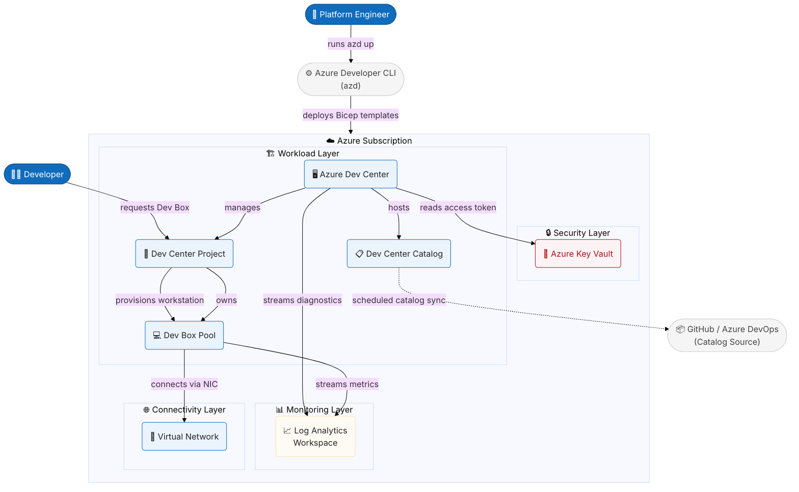

# DevExp-DevBox


**DevExp-DevBox** is a configuration-driven accelerator for deploying
[Microsoft Dev Box](https://learn.microsoft.com/en-us/azure/dev-box/overview-what-is-microsoft-dev-box)
environments on Azure using Infrastructure as Code. It provisions a full
developer workstation platform — including an Azure Dev Center, team projects,
Dev Box pools, virtual networks, secret management, and monitoring — from a
single `azd up` command.

Platform engineering teams face significant overhead when onboarding developers
to cloud-native workstations: manually creating Dev Centers, configuring network
connections, managing secrets, and wiring up catalogs across multiple projects
is error-prone and time-consuming. This accelerator eliminates that burden by
encoding every resource and its configuration in version-controlled YAML and
Bicep, enabling repeatable, auditable, and team-specific Dev Box deployments.

The technology foundation consists of **Azure Bicep** for declarative
infrastructure definitions, the **Azure Developer CLI (azd)** for end-to-end
deployment orchestration, **PowerShell** and **Bash** setup scripts for
pre-provision automation, and **YAML** configuration files for all workload,
security, and resource organization settings. Integration with **GitHub** or
**Azure DevOps** provides the catalog source for Dev Box image and environment
definitions.

## Table of Contents

- [Features](#features)
- [Architecture](#architecture)
- [Technologies Used](#technologies-used)
- [Quick Start](#quick-start)
- [Configuration](#configuration)
- [Deployment](#deployment)
- [Usage](#usage)
- [Contributing](#contributing)
- [License](#license)

## Features

- 🖥️ **Azure Dev Center provisioning** — deploys a fully configured Dev Center
  with system-assigned managed identity and Azure Monitor agent enabled
- 📁 **Multi-project support** — defines multiple team projects (for example,
  `eShop`) each with independent pools, catalogs, and environment types
- 💻 **Dev Box pool management** — creates Dev Box pools backed by image
  definition catalogs for role-specific developer workstations
- 🔑 **Integrated secret management** — stores source control access tokens in
  Azure Key Vault with RBAC authorization and soft-delete protection
- 📊 **Built-in monitoring** — provisions a Log Analytics Workspace with Azure
  Activity solution for centralized diagnostics
- 🌐 **Flexible networking** — supports both Microsoft-hosted (Managed) and
  customer-owned (Unmanaged) virtual network configurations per project
- 📋 **Catalog-as-code** — syncs Dev Center and project-level catalogs from
  GitHub or Azure DevOps repositories on a scheduled basis
- 🔒 **Least-privilege RBAC** — assigns `Contributor`,
  `User Access Administrator`, `Key Vault Secrets User`, and
  `DevCenter Project Admin` roles following the principle of least privilege
- ⚙️ **Cross-platform automation** — pre-provision hooks run on both Linux/macOS
  (`setUp.sh`) and Windows (`setUp.ps1`) via `azd` lifecycle hooks
- 🧹 **Clean teardown** — `cleanSetUp.ps1` removes all role assignments, service
  principals, GitHub secrets, and Azure resource groups

## Architecture

The diagram below shows the primary actors, components, and data flows for the
DevExp-DevBox platform.


```mermaid
---
config:
  description: "High-level architecture diagram showing actors, primary flows, and major components."
  theme: base
  align: center
  fontFamily: "-apple-system, BlinkMacSystemFont, Segoe UI, system-ui, Apple Color Emoji, Segoe UI Emoji, sans-serif"
  fontSize: 16
  textColor: "#242424"
  primaryColor: "#d6d6d6"
  primaryTextColor: "#FFFFFF"
  primaryBorderColor: "#0f548c"
  secondaryColor: "#ebf3fc"
  secondaryTextColor: "#242424"
  secondaryBorderColor: "#0f6cbd"
  tertiaryColor: "#f5f5f5"
  tertiaryTextColor: "#424242"
  tertiaryBorderColor: "#d1d1d1"
  noteBkgColor: "#fefbf4"
  noteTextColor: "#242424"
  noteBorderColor: "#f9e2ae"
  lineColor: "#616161"
  background: "#FFFFFF"
  edgeLabelBackground: "#FFFFFF"
  clusterBkg: "#fafafa"
  clusterBorder: "#e0e0e0"
  titleColor: "#242424"
  errorBkgColor: "#fdf3f4"
  errorTextColor: "#b10e1c"
---
flowchart TB

  %% ── Actors ─────────────────────────────────────────────────────────────────
  platformEng(["👷 Platform Engineer"])
  developer(["🧑‍💻 Developer"])

  %% ── External Systems ────────────────────────────────────────────────────────
  azdCLI(["⚙️ Azure Developer CLI<br/>(azd)"])
  catalogSource(["📦 GitHub / Azure DevOps<br/>(Catalog Source)"])

  %% ── Azure Infrastructure ────────────────────────────────────────────────────
  subgraph azure ["☁️ Azure Subscription"]
    direction TB

    subgraph secLayer ["🔒 Security Layer"]
      keyVault("🔑 Azure Key Vault")
    end

    subgraph monLayer ["📊 Monitoring Layer"]
      logAnalytics("📈 Log Analytics<br/>Workspace")
    end

    subgraph netLayer ["🌐 Connectivity Layer"]
      vnet("🔗 Virtual Network")
    end

    subgraph wkLayer ["🏗️ Workload Layer"]
      devCenter("🖥️ Azure Dev Center")
      devBoxProject("📁 Dev Center Project")
      devBoxPool("💻 Dev Box Pool")
      catalog("📋 Dev Center Catalog")
    end
  end

  %% ── Interactions ────────────────────────────────────────────────────────────
  platformEng --> |"runs azd up"| azdCLI
  azdCLI --> |"deploys Bicep templates"| azure
  developer --> |"requests Dev Box"| devBoxProject
  devBoxProject --> |"provisions workstation"| devBoxPool
  devBoxPool --> |"connects via NIC"| vnet
  devCenter --> |"reads access token"| keyVault
  catalog -.-> |"scheduled catalog sync"| catalogSource
  devCenter --> |"streams diagnostics"| logAnalytics
  devBoxPool --> |"streams metrics"| logAnalytics
  devCenter --> |"manages"| devBoxProject
  devBoxProject --> |"owns"| devBoxPool
  devCenter --> |"hosts"| catalog

  %% ── Class Definitions ───────────────────────────────────────────────────────
  classDef actor fill:#0f6cbd,color:#FFFFFF,stroke:#0f548c
  classDef component fill:#ebf3fc,color:#242424,stroke:#0f6cbd
  classDef external fill:#f5f5f5,color:#424242,stroke:#d1d1d1
  classDef securityNode fill:#fdf3f4,color:#b10e1c,stroke:#b10e1c
  classDef monitoringNode fill:#fefbf4,color:#242424,stroke:#f9e2ae

  class platformEng,developer actor
  class devCenter,devBoxProject,devBoxPool,catalog,vnet component
  class azdCLI,catalogSource external
  class keyVault securityNode
  class logAnalytics monitoringNode
```

## Technologies Used

| Technology                                                                                                  | Type                   | Purpose                                                          |
| ----------------------------------------------------------------------------------------------------------- | ---------------------- | ---------------------------------------------------------------- |
| [Azure Bicep](https://learn.microsoft.com/en-us/azure/azure-resource-manager/bicep/overview)                | Infrastructure as Code | Declarative resource definitions for all Azure components        |
| [Azure Developer CLI (azd)](https://learn.microsoft.com/en-us/azure/developer/azure-developer-cli/overview) | Deployment tool        | End-to-end provisioning and environment lifecycle management     |
| [Microsoft Dev Box](https://learn.microsoft.com/en-us/azure/dev-box/overview-what-is-microsoft-dev-box)     | Azure service          | Cloud-based developer workstation platform                       |
| [Azure Key Vault](https://learn.microsoft.com/en-us/azure/key-vault/general/overview)                       | Azure service          | Secure storage of source control access tokens and secrets       |
| [Azure Log Analytics](https://learn.microsoft.com/en-us/azure/azure-monitor/logs/log-analytics-overview)    | Azure service          | Centralized diagnostics and metrics collection                   |
| [Azure Virtual Network](https://learn.microsoft.com/en-us/azure/virtual-network/virtual-networks-overview)  | Azure service          | Network isolation for unmanaged Dev Box pool connectivity        |
| [PowerShell 5.1+](https://learn.microsoft.com/en-us/powershell/scripting/overview)                          | Scripting language     | Windows pre-provision and teardown automation                    |
| [Bash](https://www.gnu.org/software/bash/)                                                                  | Scripting language     | Linux/macOS pre-provision automation                             |
| [YAML](https://yaml.org/)                                                                                   | Configuration          | Workload, security, and resource organization settings           |
| GitHub / Azure DevOps                                                                                       | Source control         | Catalog repository hosting for image and environment definitions |

## Quick Start

### Prerequisites

| Requirement                                                                                                    | Version | Notes                                               |
| -------------------------------------------------------------------------------------------------------------- | ------- | --------------------------------------------------- |
| [Azure CLI](https://learn.microsoft.com/en-us/cli/azure/install-azure-cli)                                     | Latest  | Required for authentication and resource management |
| [Azure Developer CLI (azd)](https://learn.microsoft.com/en-us/azure/developer/azure-developer-cli/install-azd) | Latest  | Primary deployment tool                             |
| [GitHub CLI (gh)](https://cli.github.com/)                                                                     | Latest  | Required when `SOURCE_CONTROL_PLATFORM=github`      |
| PowerShell                                                                                                     | 5.1+    | Required on Windows for pre-provision hooks         |
| Active Azure subscription                                                                                      | —       | Contributor access at subscription scope required   |

### Installation steps

1. Clone the repository.

   ```bash
   git clone https://github.com/Evilazaro/DevExp-DevBox.git
   cd DevExp-DevBox
   ```

2. Authenticate with Azure and GitHub.

   ```bash
   az login
   azd auth login
   gh auth login   # required if using GitHub as the catalog source
   ```

3. Initialize the `azd` environment.

   ```bash
   azd env new <your-environment-name>
   ```

4. Set the required environment variables.

   ```bash
   azd env set AZURE_LOCATION eastus2
   azd env set KEY_VAULT_SECRET <your-github-or-ado-access-token>
   azd env set SOURCE_CONTROL_PLATFORM github   # or adogit
   ```

5. Deploy all resources.

   ```bash
   azd up
   ```

> [!NOTE] The `azd up` command automatically executes the pre-provision hook
> (`setUp.sh` on Linux/macOS or the equivalent PowerShell path on Windows)
> before deploying Bicep templates.

### Minimal working example

```bash
# Full deployment with a single command after completing steps 1–4
azd up
# Expected output (abbreviated):
#   Provisioning Azure resources (azd provision)
#   SUCCESS: Your up workflow to provision and deploy to Azure completed in 8 minutes 43 seconds.
#   AZURE_DEV_CENTER_NAME: devexp
#   AZURE_DEV_CENTER_PROJECTS: ["eShop"]
```

## Configuration

All configuration is stored as **YAML files** under `infra/settings/`. The table
below lists the primary options available across those files.

| Option                                           | Default           | Description                                                                           |
| ------------------------------------------------ | ----------------- | ------------------------------------------------------------------------------------- |
| `workload.create`                                | `true`            | Whether to create the workload resource group                                         |
| `workload.name`                                  | `devexp-workload` | Base name for the workload resource group                                             |
| `security.create`                                | `false`           | Whether to create a dedicated security resource group (uses workload RG when `false`) |
| `monitoring.create`                              | `true`            | Whether to create a dedicated monitoring resource group                               |
| `devcenter.name`                                 | `devexp`          | Name of the Azure Dev Center instance                                                 |
| `devcenter.catalogItemSyncEnableStatus`          | `Enabled`         | Enables automatic catalog synchronization                                             |
| `devcenter.microsoftHostedNetworkEnableStatus`   | `Enabled`         | Enables Microsoft-hosted network option                                               |
| `devcenter.installAzureMonitorAgentEnableStatus` | `Enabled`         | Installs the Azure Monitor agent on Dev Boxes                                         |
| `keyVault.enablePurgeProtection`                 | `true`            | Prevents permanent deletion of Key Vault secrets                                      |
| `keyVault.softDeleteRetentionInDays`             | `7`               | Days to retain deleted secrets before permanent removal                               |
| `keyVault.enableRbacAuthorization`               | `true`            | Enforces RBAC-based Key Vault access control                                          |
| `SOURCE_CONTROL_PLATFORM`                        | `github`          | Source control platform for catalog syncing (`github` or `adogit`)                    |
| `AZURE_LOCATION`                                 | —                 | Azure region for all resources (for example, `eastus2`)                               |
| `AZURE_ENV_NAME`                                 | —                 | Environment name used for resource group naming                                       |
| `KEY_VAULT_SECRET`                               | —                 | Access token stored as a Key Vault secret for catalog authentication                  |

### Example override

To target `westeurope` and use Azure DevOps as the catalog source:

```bash
azd env set AZURE_LOCATION westeurope
azd env set SOURCE_CONTROL_PLATFORM adogit
azd env set KEY_VAULT_SECRET <your-ado-personal-access-token>
```

> [!IMPORTANT] `KEY_VAULT_SECRET` is passed as a secure parameter and is never
> stored in plain text. Rotate this token following your organization's secret
> lifecycle policy.

## Deployment

Follow these steps to deploy DevExp-DevBox to a production or staging Azure
subscription.

1. Verify all prerequisites listed in the [Quick Start](#quick-start) section
   are installed.

2. Authenticate with Azure using an account with **Contributor** access at the
   subscription scope.

   ```bash
   az login
   azd auth login
   ```

3. Create and configure the `azd` environment.

   ```bash
   azd env new <environment-name>
   azd env set AZURE_LOCATION <region>
   azd env set KEY_VAULT_SECRET <access-token>
   azd env set SOURCE_CONTROL_PLATFORM <github|adogit>
   ```

4. Review the resource organization settings in
   `infra/settings/resourceOrganization/azureResources.yaml` and adjust resource
   group names and tags to match your organization's naming conventions.

5. Review the workload configuration in `infra/settings/workload/devcenter.yaml`
   and update project names, network settings, and catalog URIs as needed.

6. Run the deployment.

   ```bash
   azd up
   ```

7. Confirm the outputs to verify the deployed resources.

   ```bash
   azd env get-values
   # AZURE_DEV_CENTER_NAME=devexp
   # AZURE_DEV_CENTER_PROJECTS=["eShop"]
   # AZURE_KEY_VAULT_NAME=contoso-<unique>-kv
   # AZURE_LOG_ANALYTICS_WORKSPACE_NAME=logAnalytics-<unique>
   ```

8. To remove all deployed resources and clean up service principals and GitHub
   secrets, run the teardown script.

   ```powershell
   # Windows
   .\cleanSetUp.ps1 -EnvName <environment-name> -Location <region>
   ```

> [!WARNING] The `cleanSetUp.ps1` script deletes Azure resource groups, role
> assignments, service principals, and GitHub secrets. This action is
> irreversible. Review the script parameters carefully before executing.

## Usage

### Deploying to a specific Azure region

```bash
azd env set AZURE_LOCATION swedencentral
azd up
```

### Using Azure DevOps as the catalog source

```bash
azd env set SOURCE_CONTROL_PLATFORM adogit
azd env set KEY_VAULT_SECRET <ado-personal-access-token>
azd up
```

### Running setup scripts directly

```bash
# Linux / macOS
./setUp.sh -e myenv -s github

# Windows (PowerShell)
.\setUp.ps1 -EnvName myenv -SourceControl github
```

Expected output:

```text
ℹ️  SOURCE_CONTROL_PLATFORM is not set. Setting it to 'github' by default.
✅  Environment 'myenv' configured successfully.
✅  Azure Dev Center provisioning initiated.
```

### Cleaning up the environment

```powershell
.\cleanSetUp.ps1 -EnvName myenv -Location eastus2
# Expected output:
#   Removing subscription deployments...
#   Removing role assignments...
#   Deleting service principal: ContosoDevEx GitHub Actions Enterprise App
#   Removing GitHub secret: AZURE_CREDENTIALS
#   Deleting resource groups...
```

> [!TIP] Run `azd down` first to remove Azure resources managed by `azd`, then
> run `cleanSetUp.ps1` to clean up identity and credential artifacts not managed
> by `azd`.

## Contributing

Contributions are welcome. To get started:

1. Open an issue on [GitHub](https://github.com/Evilazaro/DevExp-DevBox/issues)
   to report a bug or request a feature.
2. Fork the repository and create a feature branch from `main`.
3. Commit changes with clear, descriptive messages.
4. Submit a pull request targeting the `main` branch and describe the motivation
   and changes in the pull request body.

> [!NOTE] There is no `CONTRIBUTING.md` or `CODE_OF_CONDUCT.md` in the
> repository at this time. Refer to the GitHub issue tracker for contribution
> discussions.

## License

This project is licensed under the **MIT License**. See the [LICENSE](LICENSE)
file for the full license text.
