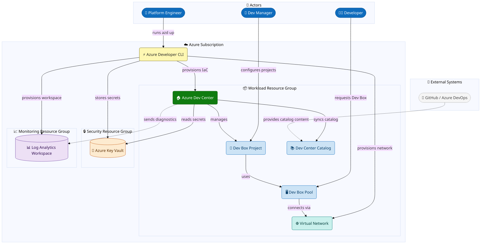

# DevExp — Microsoft Dev Box Accelerator

[](LICENSE)
[](https://learn.microsoft.com/en-us/azure/developer/azure-developer-cli/)
[](https://learn.microsoft.com/en-us/azure/azure-resource-manager/bicep/)
[](https://azure.microsoft.com/)

**DevExp** is an Infrastructure as Code accelerator that automates the
end-to-end provisioning and configuration of
[Microsoft Dev Box](https://learn.microsoft.com/en-us/azure/dev-box/overview-what-is-microsoft-dev-box)
environments on Azure using Bicep templates and the Azure Developer CLI.

The accelerator solves the challenge of consistently deploying ready-to-use
cloud developer workstations across teams and projects. It removes manual
configuration steps, enforces security and governance best practices, and
enables platform engineering teams to deliver repeatable Dev Box environments
through a single `azd up` command.

The core technology stack includes **Azure Bicep** for declarative
infrastructure templates, **Azure Developer CLI (azd)** for deployment
orchestration, **Azure Key Vault** for secret management, and **YAML** for all
resource configuration. Setup scripts are provided in both Bash (Linux/macOS)
and PowerShell (Windows) to support cross-platform workflows.

## Table of Contents

- [Features](#features)
- [Architecture](#architecture)
- [Technologies Used](#technologies-used)
- [Quick Start](#quick-start)
- [Configuration](#configuration)
- [Deployment](#deployment)
- [Usage](#usage)
- [Contributing](#contributing)
- [License](#license)

## Features

| Feature                          | Description                                                                                                                                |
| -------------------------------- | ------------------------------------------------------------------------------------------------------------------------------------------ |
| 🏗️ Infrastructure as Code        | Bicep templates define all Azure resources declaratively, enabling version-controlled and repeatable deployments.                          |
| ⚡ One-command deployment        | Azure Developer CLI integration provisions the entire environment with a single `azd up` command.                                          |
| 🏠 Azure Dev Center provisioning | Automates the creation of an Azure Dev Center with catalog sync, Azure Monitor agent, and Microsoft-hosted network support.                |
| 📁 Multi-project support         | Supports multiple Dev Box projects per Dev Center, each with dedicated pools, environment types, and role-based access.                    |
| 🖥️ Dev Box pool management       | Creates role-specific Dev Box pools (for example, backend-engineer and frontend-engineer) with configurable VM SKUs and image definitions. |
| 🔐 Secure secrets management     | Integrates Azure Key Vault to store and retrieve GitHub or Azure DevOps tokens used by catalog synchronization.                            |
| 📊 Centralized monitoring        | Provisions a Log Analytics Workspace with diagnostics forwarded from all major resources.                                                  |
| 🌐 Network connectivity          | Provisions or references Azure Virtual Networks for Dev Box pool connectivity, supporting both managed and unmanaged network types.        |
| 📚 Catalog integration           | Attaches GitHub or Azure DevOps Git repositories as catalogs to provide image definitions and task scripts.                                |
| ⚙️ YAML-driven configuration     | All resource settings — Dev Center, projects, pools, Key Vault, and network — are controlled through YAML configuration files.             |
| 🔄 Multi-platform setup          | Provides setup and cleanup scripts in both Bash (`setUp.sh`) and PowerShell (`setUp.ps1` / `cleanSetUp.ps1`).                              |
| 🏷️ Consistent resource tagging   | All resources receive standardized tags (environment, team, project, costCenter, owner, landingZone) for governance and cost tracking.     |

## Architecture

The diagram below shows the primary actors, major Azure components, and the
interactions between them during provisioning and daily developer usage.


```mermaid
---
config:
  theme: base
  fontFamily: "Segoe UI, Verdana, sans-serif"
  fontSize: 14
  primaryColor: "#EBF3FC"
  primaryTextColor: "#242424"
  primaryBorderColor: "#0F6CBD"
  secondaryColor: "#F5F5F5"
  secondaryTextColor: "#242424"
  secondaryBorderColor: "#D1D1D1"
  tertiaryColor: "#FAFAFA"
  tertiaryTextColor: "#242424"
  tertiaryBorderColor: "#C8C8C8"
  edgeLabelBackground: "#FFFFFF"
  lineColor: "#616161"
---
flowchart TB

  %% ── Actors ──────────────────────────────────────────────────────────────────
  subgraph ActorsZone["👥 Actors"]
    PlatformEng(["👷 Platform Engineer"])
    DevManager(["👔 Dev Manager"])
    Developer(["👩‍💻 Developer"])
  end

  %% ── External Systems ─────────────────────────────────────────────────────────
  subgraph ExternalZone["🔗 External Systems"]
    GitHubADO(["🔗 GitHub / Azure DevOps"])
  end

  %% ── Azure Subscription ───────────────────────────────────────────────────────
  subgraph AzureSub["☁️ Azure Subscription"]
    azd("⚡ Azure Developer CLI")

    subgraph WorkloadRG["📦 Workload Resource Group"]
      DevCenter("🏠 Azure Dev Center")
      Project("📁 Dev Box Project")
      DevBoxPool("🖥️ Dev Box Pool")
      Catalog("📚 Dev Center Catalog")
      VNet("🌐 Virtual Network")
    end

    subgraph SecurityRG["🔒 Security Resource Group"]
      KeyVault[("🔐 Azure Key Vault")]
    end

    subgraph MonitoringRG["📈 Monitoring Resource Group"]
      LogAnalytics[("📊 Log Analytics Workspace")]
    end
  end

  %% ── Interactions: Actors ─────────────────────────────────────────────────────
  PlatformEng -->|"runs azd up"| azd
  DevManager -->|"configures projects"| Project
  Developer -->|"requests Dev Box"| DevBoxPool

  %% ── Interactions: azd provisions resources ───────────────────────────────────
  azd -->|"provisions IaC"| DevCenter
  azd -->|"stores secrets"| KeyVault
  azd -->|"provisions workspace"| LogAnalytics
  azd -->|"provisions network"| VNet

  %% ── Interactions: Dev Center operations ─────────────────────────────────────
  DevCenter -->|"manages"| Project
  DevCenter -->|"syncs catalog"| Catalog
  DevCenter -->|"reads secrets"| KeyVault
  DevCenter -.->|"sends diagnostics"| LogAnalytics

  %% ── Interactions: Project and Pool ──────────────────────────────────────────
  Project -->|"uses"| DevBoxPool
  DevBoxPool -->|"connects via"| VNet

  %% ── Interactions: External catalog content ───────────────────────────────────
  GitHubADO -.->|"provides catalog content"| Catalog

  %% ── Class Definitions (Fluent UI React v9 tokens) ────────────────────────────
  classDef actorStyle fill:#0F6CBD,stroke:#115EA3,color:#FFFFFF
  classDef externalStyle fill:#F5F5F5,stroke:#D1D1D1,color:#424242
  classDef azdStyle fill:#FEF7B2,stroke:#6C6200,color:#242424
  classDef devCenterStyle fill:#107C10,stroke:#054F01,color:#FFFFFF
  classDef projectStyle fill:#CCE3F5,stroke:#0F6CBD,color:#003966
  classDef keyVaultStyle fill:#FDEBD0,stroke:#C55A11,color:#5C2D00
  classDef monitoringStyle fill:#EDE0F5,stroke:#6B3FA0,color:#2D0A4E
  classDef networkStyle fill:#C9F0EC,stroke:#007A78,color:#003D3B

  %% ── Class Assignments ────────────────────────────────────────────────────────
  class PlatformEng,DevManager,Developer actorStyle
  class GitHubADO externalStyle
  class azd azdStyle
  class DevCenter devCenterStyle
  class Project,Catalog,DevBoxPool projectStyle
  class KeyVault keyVaultStyle
  class LogAnalytics monitoringStyle
  class VNet networkStyle
```

**Color legend (Fluent UI React v9 tokens):**

| Color     | Token                               | Used For                       |
| --------- | ----------------------------------- | ------------------------------ |
| `#0F6CBD` | `colorBrandBackground`              | Actor nodes                    |
| `#107C10` | `colorPaletteGreenBackground3`      | Azure Dev Center               |
| `#FDE300` | `colorPaletteYellowBackground3`     | Azure Developer CLI            |
| `#F7D9B5` | `colorPaletteDarkOrangeBackground2` | Azure Key Vault                |
| `#E6BFDE` | `colorPaletteBerryBackground2`      | Log Analytics                  |
| `#A9E9E2` | `colorPaletteLightTealBackground2`  | Virtual Network                |
| `#EBF3FC` | `colorBrandBackground2`             | Dev Box Project, Pool, Catalog |
| `#F0F0F0` | `colorNeutralBackground3`           | External systems               |

## Technologies Used

| Technology                                                                                               | Type                   | Purpose                                                                              |
| -------------------------------------------------------------------------------------------------------- | ---------------------- | ------------------------------------------------------------------------------------ |
| [Azure Bicep](https://learn.microsoft.com/en-us/azure/azure-resource-manager/bicep/)                     | Infrastructure as Code | Declares all Azure resources (Dev Center, Key Vault, VNet, Log Analytics)            |
| [Azure Developer CLI (azd)](https://learn.microsoft.com/en-us/azure/developer/azure-developer-cli/)      | CLI Tool               | Orchestrates environment provisioning, deployment hooks, and parameter injection     |
| [Azure CLI (az)](https://learn.microsoft.com/en-us/cli/azure/)                                           | CLI Tool               | Azure resource management, authentication, and role assignment                       |
| [GitHub CLI (gh)](https://cli.github.com/)                                                               | CLI Tool               | GitHub authentication, secret creation, and repository management                    |
| [PowerShell](https://learn.microsoft.com/en-us/powershell/)                                              | Scripting              | Windows-compatible setup (`setUp.ps1`) and cleanup (`cleanSetUp.ps1`) automation     |
| [Bash](https://www.gnu.org/software/bash/)                                                               | Scripting              | Linux/macOS setup (`setUp.sh`) and deployment automation                             |
| [YAML](https://yaml.org/)                                                                                | Configuration          | Declarative settings for Dev Center, projects, pools, Key Vault, and resource groups |
| [Azure Dev Center](https://learn.microsoft.com/en-us/azure/dev-box/overview-what-is-microsoft-dev-box)   | Azure Service          | Central platform for Dev Box definitions, catalogs, and project management           |
| [Azure Key Vault](https://learn.microsoft.com/en-us/azure/key-vault/)                                    | Azure Service          | Secure storage and retrieval of source control tokens and secrets                    |
| [Azure Log Analytics](https://learn.microsoft.com/en-us/azure/azure-monitor/logs/log-analytics-overview) | Azure Service          | Centralized monitoring, diagnostics, and operational insights                        |
| [Azure Virtual Network](https://learn.microsoft.com/en-us/azure/virtual-network/)                        | Azure Service          | Network connectivity for Dev Box pools (managed and unmanaged types)                 |
| [Hugo](https://gohugo.io/)                                                                               | Static Site Generator  | Powers the project documentation site using the Docsy theme                          |
| [Node.js / npm](https://nodejs.org/)                                                                     | Build Tool             | Manages documentation dependencies (autoprefixer, postcss-cli, hugo-extended)        |

## Quick Start

### Prerequisites

| Prerequisite                                                                                             | Notes                                                            |
| -------------------------------------------------------------------------------------------------------- | ---------------------------------------------------------------- |
| [Azure CLI](https://learn.microsoft.com/en-us/cli/azure/install-azure-cli)                               | Run `az login` before deploying                                  |
| [Azure Developer CLI](https://learn.microsoft.com/en-us/azure/developer/azure-developer-cli/install-azd) | Run `azd auth login` before deploying                            |
| [GitHub CLI](https://cli.github.com/)                                                                    | Required only when using `github` as the source control platform |
| Bash or PowerShell                                                                                       | Bash for Linux/macOS; PowerShell 5.1+ for Windows                |
| Azure subscription                                                                                       | Owner or Contributor access required for resource provisioning   |

> [!IMPORTANT] The deploying identity requires **Owner** or **Contributor**
> access at the subscription scope, because the accelerator creates resource
> groups and assigns RBAC roles.

### Installation

1. Clone the repository:

   ```bash
   git clone https://github.com/Evilazaro/DevExp-DevBox.git
   cd DevExp-DevBox
   ```

2. Log in to Azure CLI:

   ```bash
   az login
   ```

3. Log in to Azure Developer CLI:

   ```bash
   azd auth login
   ```

4. Set the required environment variables:

   ```bash
   # Linux/macOS
   export AZURE_ENV_NAME="dev"
   export AZURE_LOCATION="eastus2"
   export SOURCE_CONTROL_PLATFORM="github"
   export KEY_VAULT_SECRET="<your-github-or-ado-token>"
   ```

   ```powershell
   # Windows PowerShell
   $env:AZURE_ENV_NAME = "dev"
   $env:AZURE_LOCATION = "eastus2"
   $env:SOURCE_CONTROL_PLATFORM = "github"
   $env:KEY_VAULT_SECRET = "<your-github-or-ado-token>"
   ```

5. Run the accelerator:

   ```bash
   azd up
   ```

### Minimal working example

```bash
# Clone, authenticate, and deploy a 'dev' environment to eastus2 using GitHub
git clone https://github.com/Evilazaro/DevExp-DevBox.git
cd DevExp-DevBox
az login
azd auth login
export AZURE_ENV_NAME="dev"
export AZURE_LOCATION="eastus2"
export SOURCE_CONTROL_PLATFORM="github"
export KEY_VAULT_SECRET="<your-github-token>"
azd up
```

> [!NOTE] `azd up` invokes the `preprovision` hook, which runs `setUp.sh`
> (Linux/macOS) or `setUp.ps1` (Windows) before provisioning the Bicep
> templates.

## Configuration

All resource configuration is managed through YAML files under
`infra/settings/`. Edit these files before running `azd up` to customize the
deployment.

### Environment variables

| Variable                  | Default    | Description                                                                    |
| ------------------------- | ---------- | ------------------------------------------------------------------------------ |
| `AZURE_ENV_NAME`          | (required) | Environment name appended to resource group names (for example, `dev`, `prod`) |
| `AZURE_LOCATION`          | (required) | Azure region for all resources (for example, `eastus2`, `westeurope`)          |
| `KEY_VAULT_SECRET`        | (required) | GitHub or Azure DevOps personal access token stored in Key Vault               |
| `SOURCE_CONTROL_PLATFORM` | `github`   | Source control platform for setup scripts: `github` or `adogit`                |

### Configuration files

| File                                                      | Description                                                                |
| --------------------------------------------------------- | -------------------------------------------------------------------------- |
| `infra/settings/workload/devcenter.yaml`                  | Dev Center name, identity, catalogs, environment types, and projects       |
| `infra/settings/resourceOrganization/azureResources.yaml` | Resource group names and tags for workload, security, and monitoring zones |
| `infra/settings/security/security.yaml`                   | Key Vault name, soft-delete settings, and purge protection                 |
| `infra/main.parameters.json`                              | Deployment parameter bindings for `azd` environment variables              |

### Example: override the Dev Center name

Open `infra/settings/workload/devcenter.yaml` and update the `name` field:

```yaml
# infra/settings/workload/devcenter.yaml
name: 'my-devcenter'
catalogItemSyncEnableStatus: 'Enabled'
microsoftHostedNetworkEnableStatus: 'Enabled'
installAzureMonitorAgentEnableStatus: 'Enabled'
```

### Example: add a new project pool

Add a pool entry under the `pools` key of a project in `devcenter.yaml`:

```yaml
pools:
  - name: 'fullstack-engineer'
    imageDefinitionName: 'fullstack-dev'
    vmSku: general_i_32c128gb512ssd_v2
```

> [!TIP] Valid `vmSku` values are listed in the
> [Dev Box SKU documentation](https://learn.microsoft.com/en-us/azure/dev-box/concept-dev-box-skus).

## Deployment

Follow these steps to deploy the accelerator to an Azure subscription.

1. Confirm you have **Owner** or **Contributor** access on the target
   subscription.

2. Authenticate with Azure CLI and Azure Developer CLI:

   ```bash
   az login
   azd auth login
   ```

3. Set the required environment variables (see the
   [Configuration](#configuration) section for details).

4. Run `azd up` to provision infrastructure and configure all resources:

   ```bash
   azd up
   ```

   `azd up` performs the following actions in order:
   - Executes the `preprovision` hook (`setUp.sh` or `setUp.ps1`).
   - Deploys `infra/main.bicep` to the Azure subscription scope.
   - Creates the workload, security, and monitoring resource groups.
   - Provisions the Log Analytics Workspace, Key Vault, Dev Center, Virtual
     Networks, and Dev Box projects.

5. Verify the deployment by listing the resource groups:

   ```bash
   az group list --output table
   ```

> [!WARNING] Running `azd up` creates Azure resources that incur costs. Review
> the
> [Azure Dev Box pricing](https://azure.microsoft.com/en-us/pricing/details/dev-box/)
> before deploying to a production subscription.

### Clean up the environment

To remove all resources and credentials created by the accelerator, run the
cleanup script:

```powershell
# Windows
.\cleanSetUp.ps1 -EnvName "dev" -Location "eastus2"
```

```bash
# Linux/macOS — use Azure Developer CLI to delete all provisioned resources
azd down
```

## Usage

### Deploy using the setup script directly

```bash
# Linux/macOS — deploy a 'prod' environment backed by GitHub
./setUp.sh -e "prod" -s "github"

# Linux/macOS — deploy using Azure DevOps
./setUp.sh -e "dev" -s "adogit"
```

```powershell
# Windows — deploy a 'prod' environment backed by GitHub
.\setUp.ps1 -EnvName "prod" -SourceControl "github"

# Windows — deploy using Azure DevOps
.\setUp.ps1 -EnvName "dev" -SourceControl "adogit"
```

### Deploy using Azure Developer CLI

```bash
# Provision and deploy all resources
azd up

# Re-deploy after changing YAML configuration files
azd provision

# Tear down all provisioned resources
azd down
```

### View deployment outputs

After a successful `azd up`, retrieve key output values:

```bash
# Display all azd environment outputs
azd env get-values

# Example expected output:
# AZURE_DEV_CENTER_NAME=devexp
# AZURE_KEY_VAULT_NAME=contoso-<unique>-kv
# AZURE_LOG_ANALYTICS_WORKSPACE_NAME=logAnalytics-<unique>
# WORKLOAD_AZURE_RESOURCE_GROUP_NAME=devexp-workload-dev-eastus2-RG
```

### Clean up a specific environment

```powershell
# Remove all resources for the 'dev' environment in eastus2
.\cleanSetUp.ps1 -EnvName "dev" -Location "eastus2"
# Expected output: resources deleted, role assignments removed, GitHub secrets cleaned up
```

## Contributing

Contributions are welcome. To report a bug or request a feature, open an
[issue on GitHub](https://github.com/Evilazaro/DevExp-DevBox/issues).

To submit a code change:

1. Fork the repository.
2. Create a feature branch from `main`:

   ```bash
   git checkout -b feature/my-improvement
   ```

3. Commit your changes with a descriptive message.
4. Push the branch and open a pull request against `main`:

   ```bash
   git push origin feature/my-improvement
   ```

5. Describe the problem solved and link any related issues in the pull request
   description.

> [!NOTE] Please follow existing code conventions: use Bicep for all
> infrastructure resources, YAML for all configuration, and include
> `@description` decorators on all Bicep parameters, types, and outputs.

## License

This project is licensed under the **MIT License**. See the [LICENSE](LICENSE)
file for full terms.
