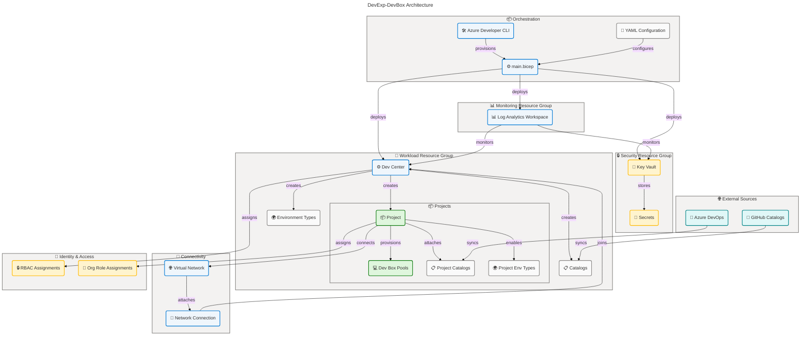

# DevExp-DevBox


## 📖 Overview

**Overview**

DevExp-DevBox is a production-ready **Azure Dev Box Adoption & Deployment
Accelerator** that provisions and configures a complete Azure Dev Center landing
zone through modular, configuration-driven Infrastructure-as-Code. It enables
platform engineering teams to deliver self-service developer workstations at
enterprise scale with built-in security, monitoring, and network isolation.

The accelerator uses a declarative YAML configuration model validated by JSON
Schemas, deploys through the Azure Developer CLI (`azd`), and implements Azure
Landing Zone principles with resource group segmentation across workload,
security, and monitoring boundaries. Cross-platform setup scripts for PowerShell
and Bash automate authentication, token management, and environment
initialization so that teams can go from zero to a fully provisioned Dev Center
in a single command.

## 📑 Table of Contents

- [📖 Overview](#-overview)
- [🏗️ Architecture](#️-architecture)
- [✨ Features](#-features)
- [📋 Requirements](#-requirements)
- [🚀 Quick Start](#-quick-start)
- [📦 Deployment](#-deployment)
- [💻 Usage](#-usage)
- [⚙️ Configuration](#️-configuration)
- [🤝 Contributing](#-contributing)
- [📄 License](#-license)

## 🏗️ Architecture

**Overview**

The system follows a modular, layered architecture orchestrated by a root Bicep
template (`infra/main.bicep`) that deploys resources across three dedicated
resource groups aligned with Azure Landing Zone principles. Each layer —
monitoring, security, and workload — is encapsulated in its own Bicep module
with clear input/output contracts, while YAML configuration files drive all
business-level settings.

The workload layer provisions the Azure Dev Center and iterates over project
definitions to create project-scoped resources including Dev Box pools,
catalogs, environment types, network connections, and RBAC assignments. Identity
and connectivity modules are shared across projects, ensuring consistent
governance without duplication.


```mermaid
---
title: "DevExp-DevBox Architecture"
config:
  theme: base
  look: classic
  layout: dagre
  themeVariables:
    fontSize: '16px'
  flowchart:
    htmlLabels: true
---
flowchart TB
    accTitle: DevExp-DevBox Architecture
    accDescr: Shows the layered infrastructure architecture with orchestration, monitoring, security, workload, connectivity, and identity modules deployed across dedicated resource groups

    %% ═══════════════════════════════════════════════════════════════════════════
    %% AZURE / FLUENT ARCHITECTURE PATTERN v1.1
    %% (Semantic + Structural + Font + Accessibility Governance)
    %% ═══════════════════════════════════════════════════════════════════════════
    %% PHASE 1 - FLUENT UI: All styling uses approved Fluent UI palette only
    %% PHASE 2 - GROUPS: Every subgraph has semantic color via style directive
    %% PHASE 3 - COMPONENTS: Every node has semantic classDef + icon prefix
    %% PHASE 4 - ACCESSIBILITY: accTitle/accDescr present, WCAG AA contrast
    %% PHASE 5 - STANDARD: Governance block present, classDefs centralized
    %% ═══════════════════════════════════════════════════════════════════════════

    subgraph orchestration["📦 Orchestration"]
        direction TB
        main("⚙️ main.bicep"):::core
        config("📁 YAML Configuration"):::neutral
        azd("🛠️ Azure Developer CLI"):::core
    end

    subgraph monitoringRG["📊 Monitoring Resource Group"]
        direction TB
        logAnalytics("📊 Log Analytics Workspace"):::core
    end

    subgraph securityRG["🔒 Security Resource Group"]
        direction TB
        keyVault("🔐 Key Vault"):::warning
        secrets("🔑 Secrets"):::warning
    end

    subgraph workloadRG["🏢 Workload Resource Group"]
        direction TB
        devCenter("⚙️ Dev Center"):::core
        catalog("📋 Catalogs"):::neutral
        envTypes("🌍 Environment Types"):::neutral

        subgraph projects["📦 Projects"]
            direction TB
            project("📦 Project"):::success
            pools("💻 Dev Box Pools"):::success
            projCatalog("📋 Project Catalogs"):::neutral
            projEnvType("🌍 Project Env Types"):::neutral
        end
    end

    subgraph connectivity["🔌 Connectivity"]
        direction TB
        vnet("🌐 Virtual Network"):::core
        netConn("🔌 Network Connection"):::core
    end

    subgraph identity["🔑 Identity & Access"]
        direction TB
        rbac("🔒 RBAC Assignments"):::warning
        orgRoles("👥 Org Role Assignments"):::warning
    end

    subgraph external["🌐 External Sources"]
        direction TB
        github("🐙 GitHub Catalogs"):::external
        ado("🔗 Azure DevOps"):::external
    end

    azd -->|"provisions"| main
    config -->|"configures"| main
    main -->|"deploys"| logAnalytics
    main -->|"deploys"| keyVault
    main -->|"deploys"| devCenter
    keyVault -->|"stores"| secrets
    devCenter -->|"creates"| catalog
    devCenter -->|"creates"| envTypes
    devCenter -->|"creates"| project
    project -->|"provisions"| pools
    project -->|"attaches"| projCatalog
    project -->|"enables"| projEnvType
    project -->|"connects"| vnet
    vnet -->|"attaches"| netConn
    netConn -->|"joins"| devCenter
    devCenter -->|"assigns"| rbac
    project -->|"assigns"| orgRoles
    github -->|"syncs"| catalog
    ado -->|"syncs"| projCatalog
    logAnalytics -->|"monitors"| devCenter
    logAnalytics -->|"monitors"| keyVault

    style orchestration fill:#F3F2F1,stroke:#8A8886,stroke-width:2px,color:#323130
    style monitoringRG fill:#F3F2F1,stroke:#8A8886,stroke-width:2px,color:#323130
    style securityRG fill:#F3F2F1,stroke:#8A8886,stroke-width:2px,color:#323130
    style workloadRG fill:#F3F2F1,stroke:#8A8886,stroke-width:2px,color:#323130
    style projects fill:#F3F2F1,stroke:#8A8886,stroke-width:2px,color:#323130
    style connectivity fill:#F3F2F1,stroke:#8A8886,stroke-width:2px,color:#323130
    style identity fill:#F3F2F1,stroke:#8A8886,stroke-width:2px,color:#323130
    style external fill:#F3F2F1,stroke:#8A8886,stroke-width:2px,color:#323130

    classDef core fill:#EFF6FC,stroke:#0078D4,stroke-width:2px,color:#323130
    classDef success fill:#DFF6DD,stroke:#107C10,stroke-width:2px,color:#323130
    classDef warning fill:#FFF4CE,stroke:#FFB900,stroke-width:2px,color:#323130
    classDef data fill:#F0E6FA,stroke:#8764B8,stroke-width:2px,color:#323130
    classDef external fill:#E0F7F7,stroke:#038387,stroke-width:2px,color:#323130
    classDef neutral fill:#FAFAFA,stroke:#8A8886,stroke-width:2px,color:#323130
```

**Component Roles:**

| Component                  | Description                                                                           |
| -------------------------- | ------------------------------------------------------------------------------------- |
| ⚙️ **main.bicep**          | Root orchestrator that deploys all resource groups and modules at subscription scope  |
| 📁 **YAML Configuration**  | Declarative settings for resource organization, security, and workload definitions    |
| 🛠️ **Azure Developer CLI** | Deployment tool that runs preprovision hooks and provisions infrastructure            |
| 📊 **Log Analytics**       | Centralized monitoring workspace with diagnostic settings for all resources           |
| 🔐 **Key Vault**           | Secrets management with RBAC authorization, soft delete, and purge protection         |
| ⚙️ **Dev Center**          | Core workload resource managing catalogs, environment types, and projects             |
| 📦 **Projects**            | Dev Center projects with pools, catalogs, environment types, and network connectivity |
| 💻 **Dev Box Pools**       | VM-backed developer workstations with configurable SKUs and image definitions         |
| 🔌 **Network Connection**  | Azure AD-joined network connections attaching VNets to Dev Center                     |
| 🔒 **RBAC Assignments**    | Role assignments at subscription, resource group, and project scopes                  |

## ✨ Features

**Overview**

DevExp-DevBox provides a comprehensive set of capabilities designed for platform
engineering teams that need to automate developer workstation provisioning at
scale. The accelerator handles the full lifecycle from infrastructure deployment
through project configuration, with governance built into every layer.

Each feature is implemented through modular Bicep templates and validated YAML
configuration, enabling teams to customize behavior without modifying
infrastructure code. The architecture supports multiple projects, each with
independent networking, identity, and catalog configurations.

| Feature                   | Description                                                                                                              |
| ------------------------- | ------------------------------------------------------------------------------------------------------------------------ |
| 🚀 One-Command Deployment | Deploy the entire landing zone with a single `azd provision` command using preprovision hooks                            |
| 🔒 Enterprise Security    | Key Vault with RBAC authorization, soft delete, purge protection, and managed identities                                 |
| 📊 Centralized Monitoring | Log Analytics workspace with diagnostic settings across all deployed resources                                           |
| 🌐 Network Isolation      | Per-project virtual networks with subnet segmentation and Azure AD-joined network connections                            |
| ⚙️ Configuration-Driven   | YAML-based configuration with JSON Schema validation for resource organization, security, and workload                   |
| 📦 Multi-Project Support  | Deploy multiple Dev Center projects, each with independent pools, catalogs, and environment types                        |
| 🔑 Identity & RBAC        | Comprehensive role assignments at subscription, resource group, and project scopes with Azure AD group support           |
| 📋 Catalog Integration    | GitHub and Azure DevOps Git catalog support with scheduled sync for tasks, environments, and image definitions           |
| 💻 Cross-Platform Scripts | PowerShell and Bash setup scripts with secure token management, authentication validation, and interactive configuration |

## 📋 Requirements

**Overview**

Before deploying DevExp-DevBox, ensure your environment meets the following
prerequisites. The accelerator requires Azure CLI, Azure Developer CLI, and a
source control CLI (GitHub CLI or Azure DevOps CLI) for authentication and
provisioning. An active Azure subscription with sufficient permissions to create
resources at the subscription scope is required.

The setup scripts validate all prerequisites automatically and provide clear
error messages when dependencies are missing. Platform-specific instructions are
available for both Windows (PowerShell) and Linux/macOS (Bash) environments.

> [!IMPORTANT] You must have **Owner** or **Contributor + User Access
> Administrator** permissions on your Azure subscription to deploy this
> accelerator, as it creates resource groups and role assignments at the
> subscription scope.

| Requirement                    | Version | Purpose                                                     |
| ------------------------------ | ------- | ----------------------------------------------------------- |
| ☁️ Azure Subscription          | Active  | Target subscription for resource deployment                 |
| 🛠️ Azure CLI                   | >= 2.50 | Azure authentication and resource management                |
| 🛠️ Azure Developer CLI (`azd`) | >= 1.0  | Infrastructure provisioning and environment management      |
| 🐙 GitHub CLI (`gh`)           | >= 2.0  | GitHub authentication and token retrieval (if using GitHub) |
| 🔗 Azure DevOps CLI            | >= 0.26 | Azure DevOps authentication (if using Azure DevOps)         |
| 💻 PowerShell                  | >= 5.1  | Setup script execution on Windows                           |
| 🐧 Bash                        | >= 4.0  | Setup script execution on Linux/macOS                       |
| 📦 Bicep CLI                   | >= 0.22 | Infrastructure-as-Code template compilation                 |

## 🚀 Quick Start

**Overview**

Get a Dev Center landing zone running in your Azure subscription with these
steps. The setup script handles authentication, environment configuration, and
provisioning automatically.

> [!TIP] On Windows, use `setUp.ps1` with PowerShell. On Linux/macOS, use
> `setUp.sh` with Bash. Both scripts perform the same operations with
> platform-appropriate commands.

**1. Clone the repository**

```bash
git clone https://github.com/Evilazaro/DevExp-DevBox.git
cd DevExp-DevBox
```

**Expected output:**

```text
Cloning into 'DevExp-DevBox'...
remote: Enumerating objects: done.
remote: Counting objects: 100% done.
remote: Compressing objects: 100% done.
Receiving objects: 100% done.
Resolving deltas: 100% done.
```

**2. Authenticate with Azure**

```bash
az login
azd auth login
```

**Expected output:**

```text
A web browser has been opened at https://login.microsoftonline.com/...
You have logged in. Now let us find all the subscriptions...
Logged in to Azure.
```

**3. Run the setup script (Linux/macOS)**

```bash
chmod +x setUp.sh
./setUp.sh
```

**Expected output:**

```text
✅ Prerequisites validated
✅ Azure authentication confirmed
✅ GitHub CLI authenticated
ℹ️ Select source control platform:
  1. GitHub
  2. Azure DevOps
Enter selection: 1
✅ Environment initialized
✅ Provisioning started
```

**3. Run the setup script (Windows)**

```powershell
.\setUp.ps1
```

**Expected output:**

```text
✅ Prerequisites validated
✅ Azure authentication confirmed
✅ GitHub CLI authenticated
ℹ️ Select source control platform:
  1. GitHub
  2. Azure DevOps
Enter selection: 1
✅ Environment initialized
✅ Provisioning started
```

## 📦 Deployment

**Overview**

The deployment process uses the Azure Developer CLI (`azd`) to provision all
infrastructure resources. The setup scripts automate the full workflow including
authentication validation, environment initialization, secure token storage, and
infrastructure provisioning. Resources are deployed at the subscription scope
and organized into three dedicated resource groups.

> [!WARNING] Deployment creates Azure resources that incur costs. Review the
> resource configuration in `infra/settings/` before provisioning. Use
> `cleanSetUp.ps1` to remove all resources when they are no longer needed.

**1. Initialize the environment**

```bash
azd init -e dev
```

**Expected output:**

```text
Initializing an app to run on Azure (azd init)

  (✓) Done: Initialized app

SUCCESS: Your app is ready for the cloud!
```

**2. Configure environment variables**

```bash
azd env set AZURE_LOCATION eastus2
azd env set KEY_VAULT_SECRET <your-github-token>
```

**Expected output:** _(no output on success)_

**3. Provision infrastructure**

```bash
azd provision
```

**Expected output:**

```json
{
  "AZURE_DEV_CENTER_NAME": "devexp-devcenter-dev-eastus2",
  "AZURE_KEY_VAULT_NAME": "contoso-xxxxxxx-kv",
  "AZURE_KEY_VAULT_ENDPOINT": "https://contoso-xxxxxxx-kv.vault.azure.net/",
  "AZURE_LOG_ANALYTICS_WORKSPACE_NAME": "devexp-monitoring-xxxxxxx",
  "AZURE_DEV_CENTER_PROJECTS": ["eShop"]
}
```

**4. Verify deployment**

```bash
az resource list --resource-group devexp-workload-dev-eastus2-RG --output table
```

**Expected output:**

```text
Name                              ResourceGroup                      Location    Type
--------------------------------  ---------------------------------  ----------  ----------------------------------------
devexp-devcenter-dev-eastus2      devexp-workload-dev-eastus2-RG     eastus2     Microsoft.DevCenter/devcenters
eShop                             devexp-workload-dev-eastus2-RG     eastus2     Microsoft.DevCenter/projects
```

**5. Clean up resources (when no longer needed)**

```powershell
.\cleanSetUp.ps1 -EnvName "dev" -Location "eastus2"
```

**Expected output:**

```text
✅ Removing subscription deployments...
✅ Cleaning up role assignments...
✅ Removing GitHub secrets...
✅ Deleting resource groups...
✅ Cleanup complete
```

## 💻 Usage

**Overview**

Once deployed, the Dev Center landing zone provides self-service developer
workstations through Azure Dev Box. Platform engineers manage the infrastructure
through YAML configuration files and Bicep templates, while developers access
their workstations through the Azure Developer Portal or Azure CLI.

**Add a new project**

To add a new project, extend the `projects` array in
`infra/settings/workload/devcenter.yaml`:

```yaml
projects:
  - name: 'myNewProject'
    description: 'My new development project'
    network:
      name: 'myNewProject'
      type: 'Managed'
      resourceGroupName: 'myNewProject-connectivity-RG'
    identity:
      roles:
        - id: 'b24988ac-6180-42a0-ab88-20f7382dd24c'
          name: 'Contributor'
          scope: 'ResourceGroup'
    pools:
      - name: 'developer-pool'
        vmSku: 'general_i_16c64gb256ssd_v2'
        imageDefinitionName: 'default-image'
```

**Expected output:** _(configuration file updated, redeploy with `azd provision`
to apply)_

**Deploy changes after configuration update**

```bash
azd provision
```

**Expected output:**

```text
Provisioning Azure resources (azd provision)
(✓) Done: Resource group: myNewProject-connectivity-RG
(✓) Done: Project: myNewProject
(✓) Done: Pool: developer-pool

SUCCESS: Your application was provisioned in Azure.
```

**List deployed Dev Center projects**

```bash
az devcenter admin project list --dev-center-name devexp-devcenter-dev-eastus2 --output table
```

**Expected output:**

```text
Name        Location    DevCenterId
----------  ----------  -------------------------------------------------
eShop       eastus2     /subscriptions/.../devcenters/devexp-devcenter-dev-eastus2
myNewProject eastus2    /subscriptions/.../devcenters/devexp-devcenter-dev-eastus2
```

> [!NOTE] Dev Box pools may take several minutes to become available after
> provisioning as image synchronization and network attachment complete in the
> background.

## ⚙️ Configuration

**Overview**

All infrastructure behavior is driven by three YAML configuration files located
under `infra/settings/`. Each file has a corresponding JSON Schema that
validates structure and values before deployment. This configuration-as-code
approach allows teams to customize the landing zone without modifying Bicep
templates directly.

Changes to configuration files take effect on the next `azd provision` run. The
Bicep templates use the `loadYamlContent()` function to read these files at
deployment time, ensuring configuration and infrastructure remain in sync.

> [!TIP] Validate your YAML files against their schemas before deploying. The
> schemas enforce naming conventions, value ranges, and required fields to
> prevent deployment failures.

| File                                                         | Description                                                                                   | Schema                       |
| ------------------------------------------------------------ | --------------------------------------------------------------------------------------------- | ---------------------------- |
| 📁 `infra/settings/resourceOrganization/azureResources.yaml` | Resource group names, descriptions, creation flags, and governance tags                       | `azureResources.schema.json` |
| 🔒 `infra/settings/security/security.yaml`                   | Key Vault name, purge protection, soft delete, RBAC authorization, and secret configuration   | `security.schema.json`       |
| ⚙️ `infra/settings/workload/devcenter.yaml`                  | Dev Center name, identity, catalogs, environment types, projects, pools, and network settings | `devcenter.schema.json`      |

**Resource Organization Parameters:**

| Parameter                           | Description                                | Default                   |
| ----------------------------------- | ------------------------------------------ | ------------------------- |
| 📦 `resourceGroups.workload.name`   | Workload resource group name prefix        | `devexp-workload`         |
| 🔒 `resourceGroups.security.name`   | Security resource group name prefix        | `devexp-security`         |
| 📊 `resourceGroups.monitoring.name` | Monitoring resource group name prefix      | `devexp-monitoring`       |
| 🏷️ `resourceGroups.*.tags`          | Governance tags applied to resource groups | See `azureResources.yaml` |

**Security Parameters:**

| Parameter                               | Description                             | Default   |
| --------------------------------------- | --------------------------------------- | --------- |
| 🔐 `keyVault.name`                      | Key Vault name prefix                   | `contoso` |
| 🔒 `keyVault.enablePurgeProtection`     | Prevent permanent deletion of vault     | `true`    |
| 🗑️ `keyVault.enableSoftDelete`          | Enable soft delete for recovery         | `true`    |
| 📅 `keyVault.softDeleteRetentionInDays` | Retention period for soft-deleted items | `7`       |
| 🔑 `keyVault.enableRbacAuthorization`   | Use RBAC instead of access policies     | `true`    |

**Dev Center Parameters:**

| Parameter                                           | Description                           | Default            |
| --------------------------------------------------- | ------------------------------------- | ------------------ |
| ⚙️ `devCenter.name`                                 | Dev Center resource name              | `devexp-devcenter` |
| 🔄 `devCenter.catalogItemSyncEnableStatus`          | Enable catalog sync                   | `Enabled`          |
| 🌐 `devCenter.microsoftHostedNetworkEnableStatus`   | Enable Microsoft-hosted networking    | `Enabled`          |
| 📊 `devCenter.installAzureMonitorAgentEnableStatus` | Install monitoring agent on Dev Boxes | `Enabled`          |
| 🔑 `devCenter.identity.type`                        | Managed identity type                 | `SystemAssigned`   |

## 🤝 Contributing

**Overview**

Contributions to DevExp-DevBox follow a product-oriented delivery model
organized around Epics, Features, and Tasks. The project uses GitHub issue forms
for structured issue creation and enforces engineering standards for Bicep
templates, PowerShell scripts, and Markdown documentation.

All contributions must meet the project's Definition of Done criteria, which
include passing validation checks, maintaining code quality standards, and
following the branching conventions defined in the contribution guidelines.

> [!CAUTION] All Bicep templates must use `@secure()` decorators for sensitive
> parameters and follow the existing modular patterns. Breaking changes to YAML
> configuration schemas require corresponding schema updates.

Please read [CONTRIBUTING.md](CONTRIBUTING.md) for detailed guidelines on:

- Issue management and required labels
- Branch naming conventions (`feature/*`, `task/*`, `fix/*`, `docs/*`)
- Engineering standards for Bicep, PowerShell, and documentation
- Definition of Done criteria for tasks, features, and epics
- Validation and smoke test requirements

## 📄 License

This project is licensed under the [MIT License](LICENSE).

Copyright (c) 2025 Evilázaro Alves.
