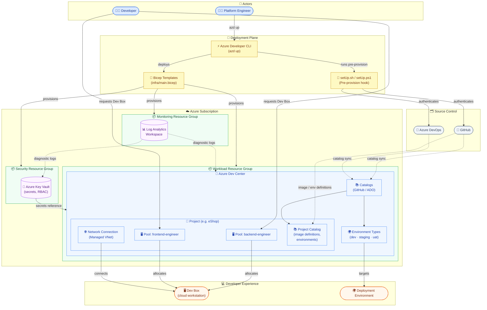

# ContosoDevExp — Azure Dev Box Accelerator

[](LICENSE)
[](https://learn.microsoft.com/en-us/azure/developer/azure-developer-cli/)
[](https://learn.microsoft.com/en-us/azure/azure-resource-manager/bicep/)
[](https://azure.microsoft.com/)

**ContosoDevExp** is an opinionated, production-ready accelerator for provisioning cloud-based developer environments on [Microsoft Dev Box](https://learn.microsoft.com/en-us/azure/dev-box/overview-what-is-microsoft-dev-box). It eliminates weeks of manual configuration by encoding platform-engineering best practices into a single `azd up` command, delivering role-specific developer workstations — complete with networking, security, and observability — in minutes.

The accelerator follows Azure Landing Zone principles, separating concerns across dedicated resource groups for workload, security, and monitoring. It uses YAML-driven configuration so platform engineers can define Dev Centers, projects, pools, catalogs, and environment types without touching Bicep, and supports both GitHub and Azure DevOps as source-control providers.

Built for platform teams that need to scale developer onboarding across multiple application teams, the project provides a repeatable, auditable, and policy-compliant path from zero to a fully operational Dev Box environment — with Key Vault-secured secrets, Log Analytics diagnostics, and least-privilege RBAC built in from the start.

---

## Table of Contents

- [Features](#features)
- [Architecture](#architecture)
- [Technologies Used](#technologies-used)
- [Quick Start](#quick-start)
- [Configuration](#configuration)
- [Deployment](#deployment)
- [Usage](#usage)
- [Contributing](#contributing)
- [License](#license)

---

## Features

- 🖥️ **Role-specific Dev Box pools** — Provision separate pools for backend engineers, frontend engineers, or any custom role with dedicated VM SKUs and image definitions.
- 🔐 **Key Vault-secured secrets** — GitHub and Azure DevOps access tokens are stored in Azure Key Vault with RBAC authorization and soft-delete protection.
- 📊 **Built-in observability** — Log Analytics Workspace wired to every resource for centralized diagnostics and metrics.
- 🌐 **Flexible networking** — Deploy managed or unmanaged virtual networks per project, or connect to existing VNets, using a single YAML setting.
- 🗂️ **Multi-project Dev Center** — Define multiple application team projects under one Dev Center, each with its own catalogs, environment types, and RBAC assignments.
- ⚙️ **YAML-driven configuration** — All Dev Center settings, resource-group layout, and security options live in human-readable YAML files — no Bicep changes required for day-to-day customization.
- 🔑 **Least-privilege RBAC** — System-assigned managed identity for the Dev Center with scoped role assignments following the [Microsoft Dev Box deployment guide](https://learn.microsoft.com/en-us/azure/dev-box/concept-dev-box-deployment-guide).
- 🔄 **Dual source-control support** — Works with both GitHub (`gh` CLI) and Azure DevOps (`adogit`) out of the box.
- 🚀 **One-command deployment** — Full environment provisioning via `azd up` with cross-platform pre-provision hooks for Linux/macOS and Windows.
- 🏗️ **Azure Landing Zone aligned** — Workload, security, and monitoring concerns are segmented into dedicated resource groups following Cloud Adoption Framework principles.

---

## Architecture

The diagram below shows the high-level architecture: who interacts with the system, the Azure services provisioned, and how they relate to each other.


```mermaid
flowchart TB
    %% ── Actors ──────────────────────────────────────────────────────────────
    subgraph Actors["👤 Actors"]
        PE(["🧑‍💼 Platform Engineer"])
        DEV(["👩‍💻 Developer"])
    end

    %% ── Deployment Plane ─────────────────────────────────────────────────────
    subgraph Deployment["🚀 Deployment Plane"]
        AZD["⚡ Azure Developer CLI<br/>(azd up)"]
        SETUP["📜 setUp.sh / setUp.ps1<br/>(Pre-provision hook)"]
        BICEP["🔧 Bicep Templates<br/>(infra/main.bicep)"]
    end

    %% ── Azure Subscription ───────────────────────────────────────────────────
    subgraph AzureSub["☁️ Azure Subscription"]

        subgraph MonitoringRG["📦 Monitoring Resource Group"]
            LA[("📊 Log Analytics<br/>Workspace")]
        end

        subgraph SecurityRG["📦 Security Resource Group"]
            KV[("🔐 Azure Key Vault<br/>(secrets, RBAC)")]
        end

        subgraph WorkloadRG["📦 Workload Resource Group"]

            subgraph DevCenter["🏢 Azure Dev Center"]
                CATALOG["📚 Catalogs<br/>(GitHub / ADO)"]
                ENVTYPE["🌍 Environment Types<br/>(dev · staging · uat)"]

                subgraph Project["📁 Project (e.g. eShop)"]
                    POOL_BE["🖥️ Pool: backend-engineer"]
                    POOL_FE["🖥️ Pool: frontend-engineer"]
                    NET["🌐 Network Connection<br/>(Managed VNet)"]
                    PROJ_CAT["📚 Project Catalog<br/>(image definitions,<br/>environments)"]
                end
            end

        end
    end

    %% ── Source Control ───────────────────────────────────────────────────────
    subgraph SCM["🗂️ Source Control"]
        GH(["🐙 GitHub"])
        ADO(["🔵 Azure DevOps"])
    end

    %% ── Developer Experience ─────────────────────────────────────────────────
    subgraph DevExperience["💻 Developer Experience"]
        DEVBOX(["🖥️ Dev Box<br/>(cloud workstation)"])
        DEPLOYENV(["🌍 Deployment Environment"])
    end

    %% ── Edges ────────────────────────────────────────────────────────────────
    PE -->|"azd up"| AZD
    AZD -->|"runs pre-provision"| SETUP
    SETUP -->|"authenticates"| GH
    SETUP -->|"authenticates"| ADO
    AZD -->|"deploys"| BICEP
    BICEP -->|"provisions"| MonitoringRG
    BICEP -->|"provisions"| SecurityRG
    BICEP -->|"provisions"| WorkloadRG

    LA -.->|"diagnostic logs"| KV
    LA -.->|"diagnostic logs"| DevCenter
    KV -->|"secrets reference"| DevCenter

    GH -.->|"catalog sync"| CATALOG
    ADO -.->|"catalog sync"| CATALOG
    GH -.->|"image / env definitions"| PROJ_CAT
    CATALOG --> ENVTYPE
    CATALOG --> PROJ_CAT

    DEV -->|"requests Dev Box"| POOL_BE
    DEV -->|"requests Dev Box"| POOL_FE
    POOL_BE -->|"allocates"| DEVBOX
    POOL_FE -->|"allocates"| DEVBOX
    ENVTYPE -->|"targets"| DEPLOYENV
    NET -->|"connects"| DEVBOX

    %% ── Styles ───────────────────────────────────────────────────────────────
    classDef actor       fill:#dbeafe,stroke:#2563eb,color:#1e3a8a
    classDef deployment  fill:#fef9c3,stroke:#ca8a04,color:#78350f
    classDef rg          fill:#f0fdf4,stroke:#16a34a,color:#14532d
    classDef service     fill:#eff6ff,stroke:#3b82f6,color:#1e40af
    classDef datastore   fill:#fdf4ff,stroke:#9333ea,color:#581c87
    classDef external    fill:#f1f5f9,stroke:#64748b,color:#334155
    classDef devexp      fill:#fff7ed,stroke:#ea580c,color:#7c2d12

    class PE,DEV actor
    class AZD,SETUP,BICEP deployment
    class MonitoringRG,SecurityRG,WorkloadRG rg
    class DevCenter,Project,CATALOG,ENVTYPE,PROJ_CAT,POOL_BE,POOL_FE,NET service
    class LA,KV datastore
    class GH,ADO external
    class DEVBOX,DEPLOYENV devexp
```

---

## Technologies Used

| Category | Technology |
|---|---|
| Infrastructure as Code | [Azure Bicep](https://learn.microsoft.com/en-us/azure/azure-resource-manager/bicep/) |
| Configuration | YAML (schema-validated) |
| Deployment Orchestration | [Azure Developer CLI (azd)](https://learn.microsoft.com/en-us/azure/developer/azure-developer-cli/) |
| Setup Scripts | PowerShell 5.1+, Bash |
| Cloud Platform | Microsoft Azure |
| Developer Environment | [Microsoft Dev Box](https://learn.microsoft.com/en-us/azure/dev-box/overview-what-is-microsoft-dev-box) |
| Secret Management | [Azure Key Vault](https://learn.microsoft.com/en-us/azure/key-vault/) |
| Observability | [Azure Log Analytics Workspace](https://learn.microsoft.com/en-us/azure/azure-monitor/logs/log-analytics-workspace-overview) |
| Networking | [Azure Virtual Network](https://learn.microsoft.com/en-us/azure/virtual-network/) |
| Identity & Access | [Azure RBAC](https://learn.microsoft.com/en-us/azure/role-based-access-control/) · System-assigned Managed Identity |
| Source Control | GitHub · Azure DevOps |
| Documentation | [Hugo](https://gohugo.io/) · [Docsy](https://www.docsy.dev/) |

---

## Quick Start

### Prerequisites

| Requirement | Version | Notes |
|---|---|---|
| Azure CLI | Latest | `az --version` |
| Azure Developer CLI (`azd`) | Latest | `azd version` |
| GitHub CLI (`gh`) | Latest | Required when using GitHub as source control |
| PowerShell | 5.1+ | Windows only; for `setUp.ps1` |
| Bash | 4.0+ | Linux/macOS; for `setUp.sh` |
| Azure Subscription | — | Contributor + User Access Administrator on subscription |

### Installation

1. **Clone the repository**

   ```bash
   git clone https://github.com/Evilazaro/DevExp-DevBox.git
   cd DevExp-DevBox
   ```

2. **Authenticate with Azure**

   ```bash
   az login
   azd auth login
   ```

3. **Authenticate with your source-control provider**

   - GitHub:
     ```bash
     gh auth login
     ```
   - Azure DevOps:
     ```bash
     az devops login
     ```

4. **Set your source control platform** *(optional — defaults to `github`)*

   ```bash
   # bash/zsh
   export SOURCE_CONTROL_PLATFORM=github   # or: adogit

   # PowerShell
   $env:SOURCE_CONTROL_PLATFORM = "github"
   ```

5. **Deploy everything**

   ```bash
   azd up
   ```

   You will be prompted for:
   - `environmentName` — a short identifier (e.g. `dev`, `test`) used in resource naming
   - `location` — Azure region (e.g. `eastus`)
   - `secretValue` — the GitHub or Azure DevOps personal access token to store in Key Vault

---

## Configuration

All configurable settings are stored under `infra/settings/`. No Bicep changes are needed for the most common customizations.

### Resource Organization — `infra/settings/resourceOrganization/azureResources.yaml`

Controls which resource groups are created and their tagging strategy. Setting `create: false` for `security` or `monitoring` co-locates those resources in the workload resource group.

```yaml
workload:
  create: true
  name: devexp-workload
  tags:
    environment: dev
    team: DevExP
    project: Contoso-DevExp-DevBox

security:
  create: false          # Set true to create a dedicated security RG
  name: devexp-workload  # Falls back to workload RG when create: false

monitoring:
  create: false          # Set true to create a dedicated monitoring RG
  name: devexp-workload
```

### Dev Center — `infra/settings/workload/devcenter.yaml`

The primary configuration file. Controls the Dev Center instance, projects, pools, catalogs, environment types, and RBAC assignments.

| Setting | Description | Default |
|---|---|---|
| `name` | Dev Center resource name | `devexp` |
| `catalogItemSyncEnableStatus` | Enable catalog sync | `Enabled` |
| `microsoftHostedNetworkEnableStatus` | Use Microsoft-hosted network | `Enabled` |
| `installAzureMonitorAgentEnableStatus` | Install Azure Monitor agent | `Enabled` |

**Adding a new project:**

```yaml
projects:
  - name: 'MyNewProject'
    description: 'Description of the project.'
    network:
      create: true
      virtualNetworkType: Managed
    pools:
      - name: 'backend-engineer'
        imageDefinitionName: 'my-backend-image'
        vmSku: general_i_32c128gb512ssd_v2
    environmentTypes:
      - name: 'dev'
        deploymentTargetId: ''
    catalogs:
      - name: 'environments'
        type: environmentDefinition
        sourceControl: gitHub
        uri: 'https://github.com/MyOrg/MyRepo.git'
        branch: 'main'
        path: '/.devcenter/environments'
```

**Changing a pool VM SKU:**

```yaml
pools:
  - name: 'backend-engineer'
    vmSku: general_i_8c32gb256ssd_v2   # Smaller SKU for cost savings
```

### Security — `infra/settings/security/security.yaml`

Controls Key Vault creation and soft-delete behavior.

```yaml
create: true
keyVault:
  name: contoso               # Must be globally unique (3–24 chars)
  secretName: gha-token       # Name of the secret stored at provision time
  enablePurgeProtection: true
  enableSoftDelete: true
  softDeleteRetentionInDays: 7
  enableRbacAuthorization: true
```

### Environment Variables

| Variable | Required | Description |
|---|---|---|
| `AZURE_ENV_NAME` | Yes | Environment name set by `azd` |
| `SOURCE_CONTROL_PLATFORM` | No | `github` (default) or `adogit` |

---

## Deployment

### One-command deployment (recommended)

```bash
azd up
```

`azd up` runs the full lifecycle:
1. **Pre-provision hook** — executes `setUp.sh` (Linux/macOS) or `setUp.ps1` (Windows) to authenticate with the source-control provider and prepare the `azd` environment.
2. **Provision** — deploys the Bicep templates at subscription scope, creating resource groups and all Azure resources.
3. **Deploy** — (no application artifact to push; all workload is infrastructure).

### Provision only (no deploy phase)

```bash
azd provision
```

### Tear down

```bash
azd down
```

> ⚠️ `azd down` will delete all provisioned resource groups. Key Vault has soft-delete enabled — purge manually if needed.

### Manual provisioning via Azure CLI

```bash
az deployment sub create \
  --location eastus \
  --template-file infra/main.bicep \
  --parameters infra/main.parameters.json \
               environmentName=dev \
               secretValue="<your-token>"
```

### Supported Regions

The following Azure regions are validated in the Bicep template:

`eastus` · `eastus2` · `westus` · `westus2` · `westus3` · `centralus` · `northeurope` · `westeurope` · `southeastasia` · `australiaeast` · `japaneast` · `uksouth` · `canadacentral` · `swedencentral` · `switzerlandnorth` · `germanywestcentral`

---

## Usage

### Create a Dev Box

Once the environment is provisioned, developers can request a Dev Box through the [Microsoft Dev Box portal](https://devbox.microsoft.com) or the Azure portal:

1. Navigate to **Dev Box** → select your project (e.g. `eShop`)
2. Choose a pool (`backend-engineer` or `frontend-engineer`)
3. Create a Dev Box — it provisions with the configured image definition and VM SKU

### Access environment deployments

Deployment environments are available through the **Dev Portal** at [https://devportal.microsoft.com](https://devportal.microsoft.com).

### Common `azd` commands

```bash
# Full deploy (provision + deploy)
azd up

# Provision infrastructure only
azd provision

# View current environment values
azd env get-values

# List environments
azd env list

# Tear down all resources
azd down
```

### Common `setUp.sh` / `setUp.ps1` flags

```bash
# Linux/macOS
./setUp.sh -e <env-name> -s <github|adogit>

# Windows (PowerShell)
.\setUp.ps1 -EnvName <env-name> -SourceControl <github|adogit>
```

| Flag | Description |
|---|---|
| `-e` / `-EnvName` | Azure environment name (e.g. `dev`, `prod`) |
| `-s` / `-SourceControl` | Source control platform: `github` or `adogit` |
| `-h` / `-Help` | Print usage information |

---

## Contributing

Contributions are welcome. Please follow these steps:

1. Fork the repository and create a feature branch: `git checkout -b feat/my-feature`
2. Make your changes, following the existing coding conventions (Bicep lint rules, YAML schema validation, PowerShell best practices).
3. Validate your Bicep changes: `az bicep build --file infra/main.bicep`
4. Open a Pull Request with a clear description of the change and its motivation.

Please open an issue first for significant architectural changes or new features so the approach can be discussed before implementation.

---

## License

This project is licensed under the [MIT License](LICENSE).  
Copyright © 2025 Evilázaro Alves
