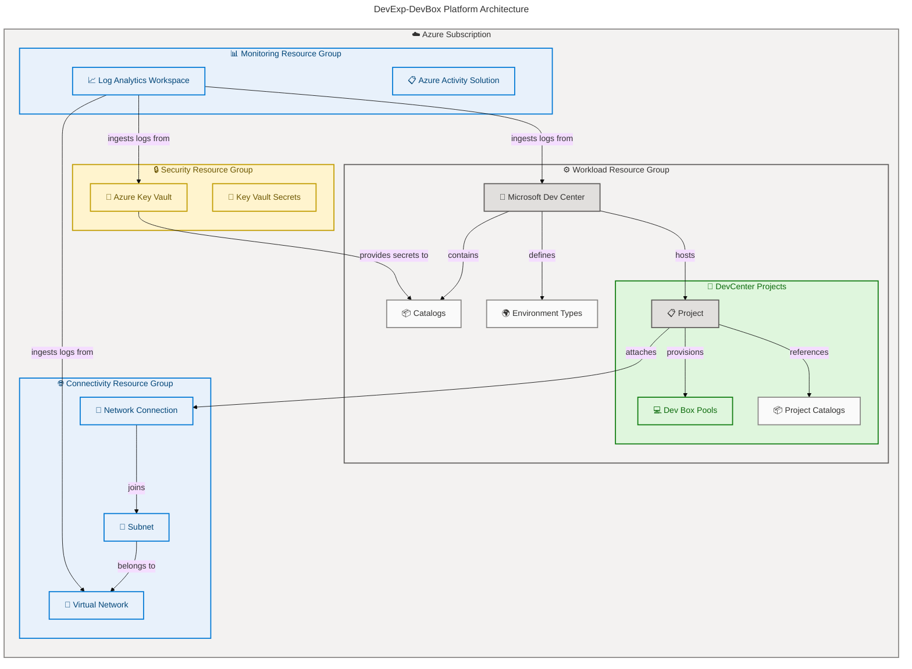

# DevExp-DevBox — Dev Box Adoption & Deployment Accelerator

[](https://learn.microsoft.com/azure/dev-box/)
[](https://learn.microsoft.com/azure/azure-resource-manager/bicep/)
[](LICENSE)
[](https://learn.microsoft.com/azure/developer/azure-developer-cli/)


An Infrastructure-as-Code accelerator that automates the end-to-end provisioning
of a
[Microsoft Dev Box](https://learn.microsoft.com/azure/dev-box/overview-what-is-microsoft-dev-box)
platform on Azure, enabling organizations to deliver secure, role-specific
developer workstations at scale.

Built on Azure Landing Zone principles and the Cloud Adoption Framework, this
accelerator deploys centralized developer environments with RBAC, networking,
security, and monitoring — entirely driven by YAML configuration files.

## Overview

**Overview**

This accelerator eliminates the hours-long, error-prone manual setup of
developer environments by providing a turnkey deployment pipeline for Microsoft
Dev Box. Platform engineering teams can onboard new projects and developer
personas in minutes by editing YAML configuration files, without writing any
Bicep or ARM templates directly.

The solution uses a modular Bicep architecture deployed via the Azure Developer
CLI (`azd`). Each concern — security, networking, identity, monitoring, and the
DevCenter workload — lives in its own module with well-defined inputs and
outputs. Configuration is fully externalized into schema-validated YAML files,
enabling a GitOps-friendly, repeatable deployment model across environments.

> [!TIP] If you are new to Microsoft Dev Box, review the
> [official overview](https://learn.microsoft.com/azure/dev-box/overview-what-is-microsoft-dev-box)
> before getting started. Dev Box provides self-service access to
> high-performance, cloud-based workstations pre-configured for specific
> projects and roles.

## Table of Contents

- [Architecture](#architecture)
- [Features](#features)
- [Requirements](#requirements)
- [Quick Start](#quick-start)
- [Configuration](#configuration)
- [Deployment](#deployment)
- [Project Structure](#project-structure)
- [Security](#security)
- [Networking](#networking)
- [Identity and RBAC](#identity-and-rbac)
- [Cleanup](#cleanup)
- [Troubleshooting](#troubleshooting)
- [Contributing](#contributing)
- [License](#license)

## Architecture

**Overview**

The accelerator deploys resources across three Azure resource groups aligned
with Azure Landing Zone segregation. A subscription-scoped Bicep orchestrator
(`main.bicep`) provisions monitoring, security, and workload layers in
dependency order. Each DevCenter project can optionally create its own
connectivity resource group for customer-managed networking.

The deployment follows a layered dependency model: Monitoring provisions first
(Log Analytics), Security provisions second (Key Vault), and the Workload layer
provisions last (DevCenter, Projects, Pools, Catalogs, Identities, and Network
Connections), consuming outputs from the prior layers.


```mermaid
---
title: "DevExp-DevBox Platform Architecture"
config:
  theme: base
  look: classic
  layout: dagre
  flowchart:
    htmlLabels: true
---
flowchart TB
    accTitle: DevExp-DevBox Platform Architecture
    accDescr: Shows the three-tier landing zone architecture with monitoring, security, and workload resource groups and their component relationships

    subgraph subscription["☁️ Azure Subscription"]
        direction TB

        subgraph monitoring["📊 Monitoring Resource Group"]
            direction LR
            logAnalytics["📈 Log Analytics Workspace"]:::data
            activitySolution["📋 Azure Activity Solution"]:::data
        end

        subgraph security["🔒 Security Resource Group"]
            direction LR
            keyVault["🔑 Azure Key Vault"]:::warning
            secrets["🔐 Key Vault Secrets"]:::warning
        end

        subgraph workload["⚙️ Workload Resource Group"]
            direction TB
            devCenter["🏢 Microsoft Dev Center"]:::core
            catalogs["📦 Catalogs"]:::neutral
            envTypes["🌍 Environment Types"]:::neutral

            subgraph projects["📂 DevCenter Projects"]
                direction LR
                project["📋 Project"]:::core
                pools["💻 Dev Box Pools"]:::success
                projectCatalogs["📦 Project Catalogs"]:::neutral
            end
        end

        subgraph connectivity["🌐 Connectivity Resource Group"]
            direction LR
            vnet["🔗 Virtual Network"]:::data
            subnet["📍 Subnet"]:::data
            networkConn["🔌 Network Connection"]:::data
        end
    end

    logAnalytics -->|"ingests logs from"| keyVault
    logAnalytics -->|"ingests logs from"| devCenter
    logAnalytics -->|"ingests logs from"| vnet
    keyVault -->|"provides secrets to"| catalogs
    devCenter -->|"contains"| catalogs
    devCenter -->|"defines"| envTypes
    devCenter -->|"hosts"| project
    project -->|"provisions"| pools
    project -->|"references"| projectCatalogs
    project -->|"attaches"| networkConn
    networkConn -->|"joins"| subnet
    subnet -->|"belongs to"| vnet

    style subscription fill:#F3F2F1,stroke:#8A8886,stroke-width:2px,color:#323130
    style monitoring fill:#E8F1FB,stroke:#0078D4,stroke-width:2px,color:#004578
    style security fill:#FFF4CE,stroke:#C19C00,stroke-width:2px,color:#6D5700
    style workload fill:#F3F2F1,stroke:#605E5C,stroke-width:2px,color:#323130
    style projects fill:#DFF6DD,stroke:#107C10,stroke-width:2px,color:#0B6A0B
    style connectivity fill:#E8F1FB,stroke:#0078D4,stroke-width:2px,color:#004578

    classDef core fill:#E1DFDD,stroke:#605E5C,stroke-width:2px,color:#323130
    classDef success fill:#DFF6DD,stroke:#107C10,stroke-width:2px,color:#0B6A0B
    classDef warning fill:#FFF4CE,stroke:#C19C00,stroke-width:2px,color:#6D5700
    classDef data fill:#E8F1FB,stroke:#0078D4,stroke-width:2px,color:#004578
    classDef neutral fill:#FAFAFA,stroke:#8A8886,stroke-width:2px,color:#323130
```

**Component Roles:**

| Component                  | Purpose                                                              | Module                                     |
| -------------------------- | -------------------------------------------------------------------- | ------------------------------------------ |
| 📈 Log Analytics Workspace | Centralized monitoring, log ingestion, and diagnostics               | `src/management/logAnalytics.bicep`        |
| 📋 Azure Activity Solution | Azure activity log analytics integration                             | `src/management/logAnalytics.bicep`        |
| 🔑 Azure Key Vault         | Secrets management for catalog authentication tokens                 | `src/security/keyVault.bicep`              |
| 🏢 Microsoft Dev Center    | Central hub for developer workstation management                     | `src/workload/core/devCenter.bicep`        |
| 📦 Catalogs                | Git-hosted repositories for custom tasks and environment definitions | `src/workload/core/catalog.bicep`          |
| 🌍 Environment Types       | SDLC stages (dev, staging, UAT) for deployment environments          | `src/workload/core/environmentType.bicep`  |
| 📋 Projects                | Team-specific Dev Box configurations with their own RBAC and pools   | `src/workload/project/project.bicep`       |
| 💻 Dev Box Pools           | Role-specific VM pool definitions with image and SKU configurations  | `src/workload/project/projectPool.bicep`   |
| 🔗 Virtual Network         | Customer-managed networking for unmanaged network mode               | `src/connectivity/vnet.bicep`              |
| 🔌 Network Connection      | Links Dev Box pools to VNet subnets with Azure AD Join               | `src/connectivity/networkConnection.bicep` |

## Features

**Overview**

This accelerator provides a complete platform engineering toolkit for Microsoft
Dev Box adoption. It abstracts the complexity of multi-resource Azure
deployments into a configuration-driven workflow, allowing teams to focus on
defining developer personas rather than writing infrastructure code.

The modular Bicep architecture ensures each component can be independently
tested, versioned, and reused. Schema-validated YAML configuration files catch
errors before deployment, and the multi-layer RBAC model enforces
least-privilege access at every scope.

| Feature                      | Description                                                                          | Status    |
| ---------------------------- | ------------------------------------------------------------------------------------ | --------- |
| 🏗️ Infrastructure as Code    | Modular Azure Bicep templates with subscription-scoped orchestration                 | ✅ Stable |
| 📝 YAML-Driven Configuration | Schema-validated YAML files for all resource settings — no Bicep editing required    | ✅ Stable |
| 🔐 Multi-Layer RBAC          | Four-layer role-based access from DevCenter identity to project-level AD groups      | ✅ Stable |
| 🌐 Flexible Networking       | Toggle between Microsoft-managed and customer-managed VNet per project               | ✅ Stable |
| 📊 Centralized Monitoring    | Log Analytics with diagnostic settings on all key resources                          | ✅ Stable |
| 🔑 Secrets Management        | Key Vault with RBAC authorization, purge protection, and soft delete                 | ✅ Stable |
| 🚀 One-Command Deployment    | Deploy via `azd up` with automated setup scripts for Windows, Linux, and macOS       | ✅ Stable |
| 📦 Catalog Integration       | Git-hosted catalogs for custom tasks, environment definitions, and image definitions | ✅ Stable |
| 👥 Multi-Project Support     | Define multiple projects with independent pools, catalogs, RBAC, and networking      | ✅ Stable |
| 🧹 Automated Cleanup         | Full teardown script removing resources, role assignments, and service principals    | ✅ Stable |

## Requirements

**Overview**

Before deploying the accelerator, ensure your workstation has the required CLIs
installed and your Azure subscription has sufficient permissions. The deployment
creates resource groups, role assignments, and service principals, so elevated
access is necessary.

All prerequisites can be validated by running the setup script, which checks for
missing tools and insufficient permissions before proceeding.

| Requirement                    | Minimum Version | Purpose                                                                           |
| ------------------------------ | --------------- | --------------------------------------------------------------------------------- |
| ☁️ Azure Subscription          | N/A             | Target subscription with Owner or User Access Administrator + Contributor         |
| 🔧 Azure CLI (`az`)            | 2.50+           | Azure resource management and authentication                                      |
| 🚀 Azure Developer CLI (`azd`) | 1.0+            | Deployment orchestration and environment management                               |
| 🐙 GitHub CLI (`gh`)           | 2.0+            | GitHub authentication and PAT token generation (if using GitHub)                  |
| 🔍 jq                          | 1.6+            | JSON processing (required by Bash setup script)                                   |
| 💻 PowerShell                  | 5.1+            | Windows setup and cleanup scripts                                                 |
| 🐧 Bash                        | 4.0+            | Linux/macOS setup script                                                          |
| 👥 Azure AD Groups             | N/A             | Pre-created groups matching IDs in `devcenter.yaml` configuration                 |
| 📂 Git Repository              | N/A             | Source repository accessible for catalog syncing (PAT required for private repos) |

> [!IMPORTANT] Your Azure subscription must allow creating resource groups,
> registering resource providers (DevCenter, KeyVault, Network,
> OperationalInsights), and creating role assignments. An **Owner** role on the
> subscription is recommended for initial deployment.

## Quick Start

**Overview**

Get the Dev Box platform running in your Azure subscription with a single
command. The setup script handles authentication, environment initialization,
and resource provisioning automatically.

**1. Clone the repository:**

```bash
git clone https://github.com/Evilazaro/DevExp-DevBox.git
cd DevExp-DevBox
```

**2. Deploy on Linux/macOS:**

```bash
azd up
```

This triggers the `preprovision` hook, which runs `setUp.sh` to:

- Validate tool dependencies (`az`, `azd`, `gh`, `jq`)
- Authenticate to GitHub and generate a PAT token
- Initialize the `azd` environment with required variables
- Provision all Azure resources via `infra/main.bicep`

**3. Deploy on Windows (PowerShell):**

```powershell
# Run the PowerShell setup script directly
.\setUp.ps1 -EnvName "dev" -SourceControl "github"
```

Or use the `azd` workflow with the PowerShell-compatible configuration:

```powershell
# Copy the PowerShell-compatible azd config
Copy-Item azure-pwh.yaml azure.yaml
azd up
```

**4. Verify the deployment:**

```bash
# Check deployed resource groups
az group list --query "[?contains(name,'devexp')]" --output table

# Verify DevCenter was created
az devcenter admin devcenter list --output table
```

> [!NOTE] The first deployment typically takes 15-25 minutes. Subsequent
> deployments are faster due to incremental provisioning. All Bicep modules are
> idempotent — you can safely re-run `azd up` at any time.

## Configuration

**Overview**

All deployment settings are externalized into three YAML configuration files
under `infra/settings/`. Each file has a companion JSON Schema for IDE
autocompletion and validation. This design enables a GitOps workflow where
infrastructure changes are reviewed and merged like application code.

Modify these files to customize resource names, add projects, change VM SKUs,
toggle networking modes, or adjust RBAC assignments — no Bicep code changes
required.

### Configuration Files

| File                                                         | Purpose                                                             | Schema                       |
| ------------------------------------------------------------ | ------------------------------------------------------------------- | ---------------------------- |
| 📁 `infra/settings/resourceOrganization/azureResources.yaml` | Resource group names, creation toggles, and tagging                 | `azureResources.schema.json` |
| 🔒 `infra/settings/security/security.yaml`                   | Key Vault name, purge protection, soft delete, secret configuration | `security.schema.json`       |
| ⚙️ `infra/settings/workload/devcenter.yaml`                  | DevCenter, projects, pools, catalogs, environment types, RBAC       | `devcenter.schema.json`      |

### Resource Organization (`azureResources.yaml`)

Defines the three landing-zone resource groups:

```yaml
workload:
  create: true
  name: 'devexp-workload'
  tags:
    environment: 'dev'
    division: 'Platforms'
    team: 'DevExP'

security:
  create: true
  name: 'devexp-security'

monitoring:
  create: true
  name: 'devexp-monitoring'
```

> [!TIP] Set `create: false` to use existing resource groups instead of creating
> new ones. This is useful when integrating with an existing Azure Landing Zone.

### DevCenter Configuration (`devcenter.yaml`)

The primary configuration file defines the DevCenter and its projects:

```yaml
name: 'devexp-devcenter'
catalogItemSyncEnableStatus: 'Enabled'
microsoftHostedNetworkEnableStatus: 'Enabled'

catalogs:
  - name: 'customTasks'
    type: gitHub
    visibility: public
    uri: 'https://github.com/microsoft/devcenter-catalog.git'
    branch: 'main'
    path: './Tasks'

environmentTypes:
  - name: 'dev'
  - name: 'staging'
  - name: 'UAT'

projects:
  - name: 'eShop'
    description: 'eShop project.'
    network:
      virtualNetworkType: Managed
    pools:
      - name: 'backend-engineer'
        imageDefinitionName: 'eShop-backend-engineer'
        skuName: 'general_i_32c128gb512ssd_v2'
      - name: 'frontend-engineer'
        imageDefinitionName: 'eShop-frontend-engineer'
        skuName: 'general_i_16c64gb256ssd_v2'
```

### Adding a New Project

To add a new project, append an entry to the `projects` array in
`devcenter.yaml`:

```yaml
projects:
  - name: 'myNewProject'
    description: 'My new team project.'
    network:
      virtualNetworkType: Managed
    pools:
      - name: 'developer'
        imageDefinitionName: 'myProject-developer'
        skuName: 'general_i_16c64gb256ssd_v2'
```

## Deployment

**Overview**

The deployment pipeline uses the Azure Developer CLI (`azd`) as the
orchestration layer. A `preprovision` hook runs a platform-specific setup script
that handles authentication, environment creation, and variable injection before
`azd provision` deploys the Bicep templates.

### Deployment Sequence

1. **`azd up`** triggers the `preprovision` hook
2. The setup script (`setUp.sh` or `setUp.ps1`) validates dependencies and
   authenticates
3. Environment variables are configured: `AZURE_ENV_NAME`, `AZURE_LOCATION`,
   `KEY_VAULT_SECRET`, `SOURCE_CONTROL_PLATFORM`
4. `azd provision` deploys `infra/main.bicep` with parameters from
   `main.parameters.json`
5. Bicep orchestration creates resources in dependency order:
   - **Monitoring** → Log Analytics Workspace
   - **Security** → Key Vault + Secrets
   - **Workload** → DevCenter, Projects, Pools, Catalogs, Network Connections,
     RBAC

### Supported Platforms

| Platform                | Entry Point      | Setup Script          |
| ----------------------- | ---------------- | --------------------- |
| 🐧 Linux/macOS          | `azure.yaml`     | `setUp.sh`            |
| 💻 Windows (Bash)       | `azure-pwh.yaml` | `setUp.sh` (via Bash) |
| 💻 Windows (PowerShell) | Direct execution | `setUp.ps1`           |

### Parameters

The deployment accepts the following parameters via `azd` environment variables:

| Parameter            | Source             | Description                                                |
| -------------------- | ------------------ | ---------------------------------------------------------- |
| ☁️ `location`        | `AZURE_LOCATION`   | Azure region for all resources (from validated allow-list) |
| 🏷️ `environmentName` | `AZURE_ENV_NAME`   | Environment name suffix for resource naming                |
| 🔑 `secretValue`     | `KEY_VAULT_SECRET` | GitHub/ADO PAT token stored in Key Vault                   |

## Project Structure

**Overview**

The repository follows a modular organization where infrastructure code,
configuration, and automation are clearly separated. The `infra/` directory
contains the deployment orchestrator and settings, while `src/` contains
reusable Bicep modules grouped by Azure Landing Zone domain.

```text
DevExp-DevBox/
├── azure.yaml                      # azd config (Linux/macOS)
├── azure-pwh.yaml                  # azd config (Windows)
├── setUp.ps1                       # PowerShell setup script
├── setUp.sh                        # Bash setup script
├── cleanSetUp.ps1                  # Cleanup/teardown script
├── infra/
│   ├── main.bicep                  # Subscription-scoped orchestrator
│   ├── main.parameters.json        # Deployment parameters
│   └── settings/
│       ├── resourceOrganization/   # Resource group configuration
│       ├── security/               # Key Vault configuration
│       └── workload/               # DevCenter configuration
└── src/
    ├── connectivity/               # VNet, subnet, network connection
    ├── identity/                   # RBAC role assignments
    ├── management/                 # Log Analytics workspace
    ├── security/                   # Key Vault and secrets
    └── workload/
        ├── core/                   # DevCenter, catalogs, env types
        └── project/                # Projects, pools, project catalogs
```

## Security

**Overview**

Security is enforced through multiple layers: Azure Key Vault with RBAC
authorization stores all secrets, managed identities eliminate credential
management, and the multi-layer RBAC model follows the principle of least
privilege. No secrets are hard-coded — all sensitive values flow through
`@secure()` Bicep parameters and Key Vault references.

Key security features:

- **Key Vault** with Standard SKU, purge protection enabled, soft delete with
  7-day retention
- **RBAC authorization** for Key Vault data plane (not access policies)
- **SystemAssigned managed identities** for DevCenter and each project
- **Secret references** via Key Vault `secretIdentifier` URI for private catalog
  authentication
- **Deployer access policies** grant the authenticated user secret and key
  management permissions

> [!WARNING] The GitHub/Azure DevOps PAT token is stored as a Key Vault secret.
> Ensure you rotate this token according to your organization's security
> policies. The secret name defaults to `gha-token` and is configurable in
> `security.yaml`.

## Networking

The accelerator supports two networking modes per project, configured via the
`virtualNetworkType` property:

| Mode             | Behavior                                                                           | When to Use                                                         |
| ---------------- | ---------------------------------------------------------------------------------- | ------------------------------------------------------------------- |
| 🌐 **Managed**   | Microsoft-hosted network — no VNet created; Dev Box uses Azure-managed networking  | Default for simplicity; no custom network requirements              |
| 🔗 **Unmanaged** | Customer-managed VNet with dedicated subnet, Network Connection, and Azure AD Join | Custom DNS, private endpoints, or on-premises connectivity required |

For Unmanaged networking, the accelerator creates a dedicated resource group,
VNet, subnet, and Network Connection per project. All VNet resources include
diagnostic settings forwarding logs and metrics to the central Log Analytics
Workspace.

## Identity and RBAC

The accelerator implements a four-layer RBAC model following the principle of
least privilege:

| Layer                       | Scope                         | Roles Assigned                                          |
| --------------------------- | ----------------------------- | ------------------------------------------------------- |
| 🏢 **DevCenter Identity**   | Subscription                  | Contributor, User Access Administrator                  |
| 🏢 **DevCenter Identity**   | Security Resource Group       | Key Vault Secrets User, Key Vault Secrets Officer       |
| 👥 **Organizational Roles** | Resource Group                | DevCenter Project Admin (for Platform Engineering Team) |
| 📋 **Project Identity**     | Subscription + Resource Group | Contributor, Key Vault Secrets User/Officer             |
| 👥 **Project AD Groups**    | Project scope                 | Contributor, Dev Box User, Deployment Environment User  |

Each project's Azure AD group is mapped in `devcenter.yaml` and receives the
permissions needed for developers to create, manage, and connect to Dev Boxes.

## Cleanup

To remove all deployed resources, role assignments, and service principals:

```powershell
.\cleanSetUp.ps1
```

This script:

- Deletes Azure deployments at the subscription level
- Removes role assignments created by the accelerator
- Cleans up service principals and app registrations
- Removes GitHub secrets (if applicable)
- Deletes all created resource groups

> [!CAUTION] The cleanup script permanently deletes all resources. Key Vault
> soft delete provides a 7-day recovery window, but all other resources are
> immediately removed. Always verify you are targeting the correct subscription
> before running cleanup.

## Troubleshooting

| Issue                             | Cause                                         | Resolution                                                           |
| --------------------------------- | --------------------------------------------- | -------------------------------------------------------------------- |
| ❌ `azd up` fails on preprovision | Missing CLI tool (`az`, `azd`, `gh`, or `jq`) | Install the missing tool and re-run                                  |
| ❌ Role assignment failure        | Insufficient subscription permissions         | Ensure you have Owner or User Access Administrator role              |
| ❌ Key Vault conflict             | Soft-deleted vault with same name exists      | Purge the deleted vault: `az keyvault purge --name <name>`           |
| ❌ DevCenter not found            | Resource provider not registered              | Register: `az provider register --namespace Microsoft.DevCenter`     |
| ❌ GitHub auth failure            | `gh` CLI not authenticated                    | Run `gh auth login` before deployment                                |
| ⚠️ Slow first deployment          | Resource provider registration                | First deployment in a subscription may take 20-30 minutes            |
| ⚠️ Pool creation failure          | Invalid image definition name                 | Ensure catalog sync completed and image definition exists in catalog |

## Contributing

**Overview**

This project uses a product-oriented delivery model with Epics, Features, and
Tasks tracked as GitHub Issues. All changes go through pull requests with
required reviews, test evidence, and documentation updates.

Contributions follow established branching conventions and engineering standards
for Bicep, PowerShell, and Markdown. See the full contributing guide for issue
templates, labeling requirements, and coding standards.

For complete guidelines, see [CONTRIBUTING.md](CONTRIBUTING.md).

### Quick Contributing Steps

1. Fork the repository and create a feature branch (`feature/<short-name>`)
2. Make changes following the
   [engineering standards](CONTRIBUTING.md#engineering-standards)
3. Submit a pull request referencing the issue it closes
4. Include a summary, test evidence, and documentation updates

## License

This project is licensed under the **MIT License**. See [LICENSE](LICENSE) for
details.

Copyright (c) 2025 Evilázaro Alves.
