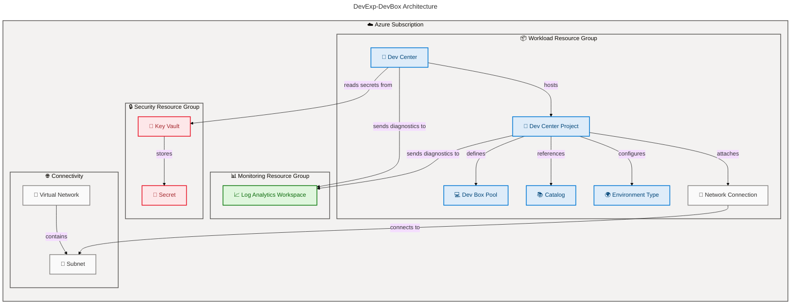

# DevExp-DevBox


Azure Dev Box Deployment Accelerator that provisions a complete developer
workstation platform using Infrastructure as Code. This project deploys
Dev Center, Dev Box pools, Key Vault secrets management, and Log Analytics
monitoring through declarative YAML configuration and Bicep modules.

**Overview**

DevExp-DevBox eliminates the manual effort of configuring Azure Dev Center
resources through the Azure portal. Platform engineering teams use this
accelerator to define their entire Dev Box environment — including projects,
pools, catalogs, networking, and security — in version-controlled YAML files
and deploy everything with a single `azd provision` command.

The accelerator follows Azure Landing Zone principles by separating resources
into dedicated resource groups for workload, security, and monitoring concerns.
Bicep modules handle each domain (identity, connectivity, management, security,
workload) independently, enabling teams to customize individual layers without
affecting others. Setup scripts for both Windows (PowerShell) and Linux/macOS
(Bash) validate prerequisites, authenticate against Azure and source control
providers, and prepare the `azd` environment before deployment.

## Table of Contents

- [Architecture](#-architecture)
- [Features](#-features)
- [Requirements](#-requirements)
- [Quick Start](#-quick-start)
- [Deployment](#-deployment)
- [Usage](#-usage)
- [Configuration](#-configuration)
- [Project Structure](#-project-structure)
- [Contributing](#-contributing)
- [License](#-license)

## 🏗️ Architecture

**Overview**

DevExp-DevBox uses a three-tier Azure Landing Zone architecture that separates
workload, security, and monitoring concerns into dedicated resource groups. This
separation enforces least-privilege access boundaries and aligns with Microsoft's
Cloud Adoption Framework for enterprise-scale deployments.

The `infra/main.bicep` entry point deploys all three resource groups at the
subscription scope, then delegates resource creation to domain-specific Bicep
modules under `src/`. Each module loads its configuration from YAML files in
`infra/settings/`, enabling teams to modify Dev Center projects, Key Vault
policies, or monitoring settings without touching infrastructure code.


```mermaid
---
title: "DevExp-DevBox Architecture"
config:
  theme: base
  look: classic
  layout: dagre
  flowchart:
    htmlLabels: true
---
flowchart TB
    accTitle: DevExp-DevBox Architecture
    accDescr: Shows the three-tier Azure Landing Zone architecture with workload, security, and monitoring resource groups and their component relationships

    %% ═══════════════════════════════════════════════════════════════════════════
    %% AZURE / FLUENT ARCHITECTURE PATTERN v1.1
    %% PHASE 1 - STRUCTURAL: Direction explicit, flat topology, nesting ≤ 3
    %% PHASE 2 - SEMANTIC: Colors justified, max 5 semantic classes, neutral-first
    %% PHASE 3 - FONT: Dark text on light backgrounds, contrast ≥ 4.5:1
    %% PHASE 4 - ACCESSIBILITY: accTitle/accDescr present, icons on all nodes
    %% PHASE 5 - STANDARD: Governance block present, classDefs centralized
    %% ═══════════════════════════════════════════════════════════════════════════

    subgraph subscription["☁️ Azure Subscription"]
        direction TB

        subgraph workloadRG["📦 Workload Resource Group"]
            direction TB
            devCenter["🏢 Dev Center"]:::core
            project["📁 Dev Center Project"]:::core
            pool["💻 Dev Box Pool"]:::core
            catalog["📚 Catalog"]:::core
            envType["🌍 Environment Type"]:::core
            netConn["🔗 Network Connection"]:::neutral

            devCenter -->|"hosts"| project
            project -->|"defines"| pool
            project -->|"references"| catalog
            project -->|"configures"| envType
            project -->|"attaches"| netConn
        end

        subgraph securityRG["🔒 Security Resource Group"]
            direction TB
            keyVault["🔐 Key Vault"]:::danger
            secret["🔑 Secret"]:::danger

            keyVault -->|"stores"| secret
        end

        subgraph monitoringRG["📊 Monitoring Resource Group"]
            direction TB
            logAnalytics["📈 Log Analytics Workspace"]:::success
        end

        subgraph connectivityRG["🌐 Connectivity"]
            direction TB
            vnet["🔗 Virtual Network"]:::neutral
            subnet["📍 Subnet"]:::neutral

            vnet -->|"contains"| subnet
        end

        devCenter -->|"reads secrets from"| keyVault
        devCenter -->|"sends diagnostics to"| logAnalytics
        project -->|"sends diagnostics to"| logAnalytics
        netConn -->|"connects to"| subnet
    end

    style subscription fill:#F3F2F1,stroke:#605E5C,stroke-width:2px
    style workloadRG fill:#F3F2F1,stroke:#605E5C,stroke-width:2px
    style securityRG fill:#F3F2F1,stroke:#605E5C,stroke-width:2px
    style monitoringRG fill:#F3F2F1,stroke:#605E5C,stroke-width:2px
    style connectivityRG fill:#F3F2F1,stroke:#605E5C,stroke-width:2px

    %% Centralized semantic classDefs (Phase 5 compliant)
    classDef core fill:#DEECF9,stroke:#0078D4,stroke-width:2px,color:#004578
    classDef success fill:#DFF6DD,stroke:#107C10,stroke-width:2px,color:#0B6A0B
    classDef danger fill:#FDE7E9,stroke:#E81123,stroke-width:2px,color:#A4262C
    classDef neutral fill:#FAFAFA,stroke:#8A8886,stroke-width:2px,color:#323130
```

**Component Roles:**

| Component            | Purpose                                                                      | Resource Group |
| -------------------- | ---------------------------------------------------------------------------- | -------------- |
| 🏢 Dev Center        | Central management plane for developer workstations and environments         | Workload       |
| 📁 Project           | Scoped unit grouping pools, catalogs, and environment types per team         | Workload       |
| 💻 Dev Box Pool      | Collection of Dev Box definitions with specific VM SKUs and images           | Workload       |
| 📚 Catalog           | Git-backed repository of Dev Box image definitions and environment templates | Workload       |
| 🌍 Environment Type  | Deployment stage definitions (dev, staging, UAT)                             | Workload       |
| 🔐 Key Vault         | Secrets management with RBAC authorization and purge protection              | Security       |
| 📈 Log Analytics     | Centralized diagnostics and monitoring workspace                             | Monitoring     |
| 🔗 Virtual Network   | Network isolation for managed and unmanaged connectivity scenarios           | Connectivity   |

## ✨ Features

**Overview**

This accelerator provides a comprehensive set of capabilities designed to reduce
the time and effort required to adopt Microsoft Dev Box at enterprise scale.
Teams define their entire Dev Box platform in declarative YAML and Bicep instead
of configuring resources manually through the Azure portal, enabling repeatable
and auditable deployments.

The modular architecture means each component — identity, security, networking,
monitoring — can be customized independently without affecting other layers.
YAML configuration files with JSON Schema validation ensure correctness before
deployment, while cross-platform setup scripts automate authentication and
environment preparation.

| Feature                       | Description                                                                                                     | Status    |
| ----------------------------- | --------------------------------------------------------------------------------------------------------------- | --------- |
| 🏢 Dev Center Provisioning    | Automated deployment of Azure Dev Center with managed identity and diagnostic settings                          | ✅ Stable |
| 📁 Multi-Project Support      | Configure multiple Dev Center projects with independent pools, catalogs, and permissions                        | ✅ Stable |
| 🔐 Key Vault Integration      | Secure secrets management with RBAC authorization, soft delete, and purge protection                            | ✅ Stable |
| 📈 Centralized Monitoring     | Log Analytics workspace with diagnostic settings forwarded from all deployed resources                          | ✅ Stable |
| 🔗 Network Connectivity       | Support for both managed Microsoft-hosted and unmanaged virtual network configurations                          | ✅ Stable |
| 🛡️ RBAC Automation            | Least-privilege role assignments at subscription, resource group, and project scopes                            | ✅ Stable |
| ⚙️ YAML-Driven Configuration  | Declarative configuration files with JSON Schema validation for Dev Center, security, and resource organization | ✅ Stable |
| 🚀 Cross-Platform Setup       | Automated setup scripts for Windows (PowerShell) and Linux/macOS (Bash) with GitHub and Azure DevOps support    | ✅ Stable |

## 📋 Requirements

**Overview**

Before deploying the accelerator, ensure your environment meets the following
prerequisites. The setup scripts (`setUp.ps1` and `setUp.sh`) validate tool
availability automatically and exit with descriptive errors if any required CLI
is missing or not authenticated.

Azure permissions and Microsoft Entra ID configuration must be prepared in
advance by a platform administrator. The GitHub CLI is only required when using
GitHub as the source control platform; Azure DevOps users authenticate through
the Azure CLI instead.

> [!IMPORTANT]
> You must have Contributor and User Access Administrator permissions on the
> target Azure subscription. The deployment creates resource groups, role
> assignments, and a Key Vault with RBAC authorization at the subscription scope.

| Requirement                   | Details                                                                                                           | Required       |
| ----------------------------- | ----------------------------------------------------------------------------------------------------------------- | -------------- |
| ☁️ Azure Subscription         | Active subscription with Contributor and User Access Administrator permissions                                    | ✅ Yes         |
| 🔑 Azure CLI                  | Version 2.x or later — [Install Azure CLI](https://learn.microsoft.com/en-us/cli/azure/install-azure-cli)         | ✅ Yes         |
| 🛠️ Azure Developer CLI (azd)  | Latest version — [Install azd](https://learn.microsoft.com/en-us/azure/developer/azure-developer-cli/install-azd) | ✅ Yes         |
| 🐙 GitHub CLI (gh)            | Required when using GitHub as source control — [Install GitHub CLI](https://cli.github.com/)                      | ⚡ Conditional |
| 📦 PowerShell 5.1+            | Required for Windows setup via `setUp.ps1`                                                                        | ⚡ Conditional |
| 🐧 Bash + jq                  | Required for Linux/macOS setup via `setUp.sh` — [Install jq](https://jqlang.github.io/jq/download/)               | ⚡ Conditional |
| 🏢 Microsoft Entra ID         | Tenant with permissions to create groups for Dev Manager and Developer roles                                      | ✅ Yes         |

## 🚀 Quick Start

**Overview**

Getting a Dev Box environment running involves two stages: preparing the `azd`
environment with the setup script, then provisioning Azure resources with
`azd provision`. The setup script validates prerequisites, authenticates against
Azure and your source control provider, retrieves a personal access token, and
writes it to `.azure/{envName}/.env` as `KEY_VAULT_SECRET`. It does **not**
deploy any Azure resources — provisioning is a separate step.

On Linux/macOS, the `azure.yaml` preprovision hook calls `setUp.sh`
automatically when you run `azd provision`, so you can skip the manual setup
step. On Windows, run `setUp.ps1` first because the `azure.yaml` hook requires
Bash.

### 1. Clone the Repository

```bash
git clone https://github.com/Evilazaro/DevExp-DevBox.git
cd DevExp-DevBox
```

### 2. Authenticate

Sign into all required CLIs before running setup. The scripts validate
authentication and exit with an error if any session is missing.

```bash
az login
azd auth login
gh auth login          # only required when using GitHub as source control
```

### 3. Prepare the Environment and Provision

The setup flow differs by operating system. Choose your platform below.

**Windows (PowerShell):**

Run `setUp.ps1` to validate tools, authenticate, retrieve your source control
token, and write the `azd` environment file. Then provision infrastructure
separately with `azd`:

```powershell
.\setUp.ps1 -EnvName "dev" -SourceControl "github"
```

Expected output:

```text
[2025-06-01 10:00:00] Starting Dev Box environment setup
[2025-06-01 10:00:00] Environment name: dev
[2025-06-01 10:00:01] All required tools are available
[2025-06-01 10:00:02] GitHub authentication verified successfully
[2025-06-01 10:00:03] GitHub token retrieved and stored securely
[2025-06-01 10:00:04] Azure Developer CLI environment 'dev' initialized successfully.
[2025-06-01 10:00:04] Dev Box environment 'dev' setup successfully
```

Then deploy the infrastructure:

```powershell
azd provision -e dev
```

Expected output:

```text
Provisioning Azure resources can take some time.

  (✓) Done: Resource group: devexp-security-dev-eastus2-RG
  (✓) Done: Resource group: devexp-monitoring-dev-eastus2-RG
  (✓) Done: Resource group: devexp-workload-dev-eastus2-RG

SUCCESS: Your application was provisioned in Azure in 8 minutes 42 seconds.
```

**Linux/macOS (Bash):**

On Linux and macOS, `azd provision` triggers the preprovision hook defined in
`azure.yaml`, which automatically runs `setUp.sh` to validate tools,
authenticate, and write the environment file. Run a single command:

```bash
azd provision
```

`azd` prompts for the environment name and Azure region if not already set,
then the preprovision hook defaults `SOURCE_CONTROL_PLATFORM` to `github` and
runs `setUp.sh` before deploying the Bicep templates.

Expected output:

```text
SOURCE_CONTROL_PLATFORM is not set. Setting it to 'github' by default.
Starting Dev Box environment setup
Environment name: dev
All required tools are available
GitHub authentication verified successfully
GitHub token retrieved and stored securely
Azure Developer CLI environment 'dev' initialized successfully.
Dev Box environment 'dev' setup successfully

Provisioning Azure resources can take some time.

  (✓) Done: Resource group: devexp-security-dev-eastus2-RG
  (✓) Done: Resource group: devexp-monitoring-dev-eastus2-RG
  (✓) Done: Resource group: devexp-workload-dev-eastus2-RG

SUCCESS: Your application was provisioned in Azure in 8 minutes 42 seconds.
```

> [!TIP]
> If you omit the `-SourceControl` parameter on Windows, `setUp.ps1` prompts
> you to select between GitHub and Azure DevOps interactively. On Linux/macOS,
> the preprovision hook defaults to `github` automatically.

## 📦 Deployment

**Overview**

Deployment is orchestrated through Azure Developer CLI (`azd`), which reads
`azure.yaml` for hook definitions and `infra/main.bicep` as the primary
deployment entry point. The Bicep template deploys at the subscription scope,
creating three resource groups and all child resources including Dev Center,
Key Vault, and Log Analytics.

Parameter values are resolved through `infra/main.parameters.json`, which maps
`azd` environment variables (`AZURE_ENV_NAME`, `AZURE_LOCATION`,
`KEY_VAULT_SECRET`) to Bicep parameters. The setup scripts write
`KEY_VAULT_SECRET` and `SOURCE_CONTROL_PLATFORM` to `.azure/{env}/.env`, and
`azd` injects them at deployment time.

### Deployment Parameters

| Parameter             | Description                                                          | Required |
| --------------------- | -------------------------------------------------------------------- | -------- |
| ⚙️ `environmentName`  | Environment identifier used in resource naming (2-10 characters)     | ✅ Yes   |
| 🌍 `location`         | Azure region for all resources (e.g., `eastus2`, `westeurope`)       | ✅ Yes   |
| 🔑 `secretValue`      | Source control personal access token stored in Key Vault             | ✅ Yes   |

### Supported Regions

The deployment supports the following Azure regions as defined in
`infra/main.bicep`:

`eastus`, `eastus2`, `westus`, `westus2`, `westus3`, `centralus`,
`northcentralus`, `southcentralus`, `northeurope`, `westeurope`, `uksouth`,
`ukwest`, `eastasia`, `southeastasia`, `japaneast`, `japanwest`,
`australiaeast`

### Manual Deployment

If you prefer to configure the `azd` environment manually instead of using
the setup scripts:

```bash
azd env new dev
azd env set AZURE_LOCATION "eastus2"
azd env set KEY_VAULT_SECRET "ghp_your_github_token"
azd env set SOURCE_CONTROL_PLATFORM "github"
azd provision -e dev
```

Expected output:

```text
Provisioning Azure resources can take some time.

  (✓) Done: Resource group: devexp-security-dev-eastus2-RG
  (✓) Done: Resource group: devexp-monitoring-dev-eastus2-RG
  (✓) Done: Resource group: devexp-workload-dev-eastus2-RG

SUCCESS: Your application was provisioned in Azure in 8 minutes 42 seconds.
```

### Cleanup

To remove all provisioned resources, role assignments, service principals, and
GitHub secrets:

```powershell
.\cleanSetUp.ps1 -EnvName "dev" -Location "eastus2"
```

Expected output:

```text
Starting cleanup for environment: dev in region: eastus2
Deleting subscription deployments...
Removing role assignments...
Deleting resource groups...
Cleanup completed successfully.
```

> [!WARNING]
> The cleanup script deletes Azure resource groups, service principals, and
> GitHub secrets. This action is irreversible for resources without soft delete
> enabled. Review the parameters before executing.

## 💻 Usage

**Overview**

After provisioning completes, the deployed Dev Center and its projects are ready
for use. Platform engineers manage resources through the Azure CLI and Azure
portal, while developers access Dev Box workstations through the Microsoft Dev
Box portal or the Dev Center CLI.

This section covers common operational tasks for managing the deployed
infrastructure. To onboard new teams, add project definitions to
`infra/settings/workload/devcenter.yaml` and re-run `azd provision` to apply
changes incrementally.

### Verify Deployed Resources

Confirm that all resource groups and resources were created:

```bash
az group list --query "[?starts_with(name, 'devexp-')]" --output table
```

Expected output:

```text
Name                                Location    Status
----------------------------------  ----------  ---------
devexp-security-dev-eastus2-RG      eastus2     Succeeded
devexp-monitoring-dev-eastus2-RG    eastus2     Succeeded
devexp-workload-dev-eastus2-RG      eastus2     Succeeded
```

### View Dev Center Projects

List all projects configured under the Dev Center:

```bash
az devcenter admin project list \
  --resource-group "devexp-workload-dev-eastus2-RG" \
  --output table
```

Expected output:

```text
Name    Location    ProvisioningState
------  ----------  ------------------
eShop   eastus2     Succeeded
```

### View Environment Settings

Check the `azd` environment values that were configured during setup:

```bash
azd env get-values -e dev
```

Expected output:

```text
AZURE_ENV_NAME="dev"
AZURE_LOCATION="eastus2"
KEY_VAULT_SECRET="ghp_***"
SOURCE_CONTROL_PLATFORM="github"
```

### Add a New Project

To onboard a new team, add a project entry to the `projects` array in
`infra/settings/workload/devcenter.yaml`, then re-run provisioning:

```bash
azd provision -e dev
```

Expected output:

```text
Provisioning Azure resources can take some time.

  (✓) Done: Resource group: devexp-workload-dev-eastus2-RG (updated)

SUCCESS: Your application was provisioned in Azure in 4 minutes 12 seconds.
```

## 🔧 Configuration

**Overview**

All infrastructure settings are defined in YAML configuration files located
under `infra/settings/`. These files control every aspect of the deployment,
from resource group naming and tags to Dev Center projects, Dev Box pools, and
Key Vault security settings. Each YAML file has a companion JSON Schema that
editors use for inline validation and autocompletion.

This approach enables teams to customize deployments by editing configuration
files rather than modifying Bicep modules, reducing the risk of breaking
infrastructure logic while maintaining full flexibility over resource attributes.

> [!NOTE]
> All YAML configuration files include a `$schema` reference that points to a
> local JSON Schema file. Editors such as VS Code with the YAML extension
> provide real-time validation and autocompletion based on these schemas.

### Configuration Files

| File                                                          | Purpose                                                                 |
| ------------------------------------------------------------- | ----------------------------------------------------------------------- |
| ⚙️ `infra/settings/workload/devcenter.yaml`                   | Dev Center name, identity, catalogs, environment types, projects, pools |
| 🔐 `infra/settings/security/security.yaml`                    | Key Vault name, soft delete, purge protection, RBAC settings            |
| 📦 `infra/settings/resourceOrganization/azureResources.yaml`  | Resource group names, tags, and Landing Zone structure                  |
| 🌍 `azure.yaml`                                               | Azure Developer CLI hooks and project name                              |

### Dev Center Configuration

The `devcenter.yaml` file defines the core Dev Center resource and its projects:

```yaml
name: 'devexp-devcenter'
catalogItemSyncEnableStatus: 'Enabled'
microsoftHostedNetworkEnableStatus: 'Enabled'
installAzureMonitorAgentEnableStatus: 'Enabled'

identity:
  type: 'SystemAssigned'
  roleAssignments:
    devCenter:
      - id: 'b24988ac-6180-42a0-ab88-20f7382dd24c'
        name: 'Contributor'
        scope: 'Subscription'

projects:
  - name: 'eShop'
    description: 'eShop project.'
    pools:
      - name: 'backend-engineer'
        imageDefinitionName: 'eShop-backend-engineer'
        vmSku: general_i_32c128gb512ssd_v2
      - name: 'frontend-engineer'
        imageDefinitionName: 'eShop-frontend-engineer'
        vmSku: general_i_16c64gb256ssd_v2
```

### Key Vault Configuration

```yaml
create: true
keyVault:
  name: contoso
  secretName: gha-token
  enablePurgeProtection: true
  enableSoftDelete: true
  softDeleteRetentionInDays: 7
  enableRbacAuthorization: true
```

### Resource Organization

Resource groups follow Azure Landing Zone principles for separation of concerns:

| Resource Group                           | Purpose                          | Created By         |
| ---------------------------------------- | -------------------------------- | ------------------ |
| 📦 `devexp-workload-{env}-{region}-RG`   | Dev Center and project resources | `infra/main.bicep` |
| 🔐 `devexp-security-{env}-{region}-RG`   | Key Vault and secret storage     | `infra/main.bicep` |
| 📊 `devexp-monitoring-{env}-{region}-RG` | Log Analytics Workspace          | `infra/main.bicep` |

## 📁 Project Structure

**Overview**

The repository organizes infrastructure code into three top-level directories:
`infra/` for deployment orchestration and settings, `src/` for reusable Bicep
modules grouped by domain, and root-level scripts for setup and teardown.

```text
DevExp-DevBox/
├── azure.yaml                    # azd configuration (Linux/macOS hooks)
├── azure-pwh.yaml                # azd configuration (Windows hooks)
├── setUp.ps1                     # Windows setup script (PowerShell)
├── setUp.sh                      # Linux/macOS setup script (Bash)
├── cleanSetUp.ps1                # Cleanup script
├── infra/
│   ├── main.bicep                # Main deployment entry point (subscription scope)
│   ├── main.parameters.json      # Parameter mappings for azd
│   └── settings/
│       ├── resourceOrganization/ # Resource group names, tags, schemas
│       ├── security/             # Key Vault configuration and schema
│       └── workload/             # Dev Center, projects, pools, and schema
└── src/
    ├── connectivity/             # VNet, subnet, network connection modules
    ├── identity/                 # RBAC role assignment modules
    ├── management/               # Log Analytics workspace module
    ├── security/                 # Key Vault and secret modules
    └── workload/
        ├── core/                 # Dev Center, catalog, environment type modules
        └── project/              # Project, pool, environment type modules
```

## 🤝 Contributing

**Overview**

Contributions are welcome and follow a structured workflow using GitHub Issues
and Pull Requests. The project uses a product-oriented delivery model organized
around Epics, Features, and Tasks, ensuring every change maps to a documented
requirement and moves through a clear review process.

All infrastructure code must be parameterized, idempotent, and reusable across
environments. Documentation changes should be included in the same pull request
as code changes. Review the full guidelines in
[CONTRIBUTING.md](CONTRIBUTING.md) before submitting.

### Workflow

1. Fork the repository and create a branch using the naming convention
   `feature/<short-name>`, `task/<short-name>`, or `fix/<short-name>`
2. Make changes with validation evidence (use `az deployment what-if` for Bicep)
3. Reference the related issue in the PR description (e.g., `Closes #123`)
4. Submit a pull request targeting `main` for review

### Engineering Standards

| Area              | Standard                                                     |
| ----------------- | ------------------------------------------------------------ |
| 🛠️ Bicep          | Parameterized, idempotent modules with no embedded secrets   |
| ⚙️ PowerShell     | PowerShell 5.1+ compatible with fail-fast error handling     |
| 📝 Documentation  | Every module must document purpose, inputs, and outputs      |
| 🔍 Validation     | `what-if` validation required for all deployment PRs         |

## 📝 License

This project is licensed under the MIT License. See [LICENSE](LICENSE) for
details.

Copyright (c) 2025 Evilazaro Alves
