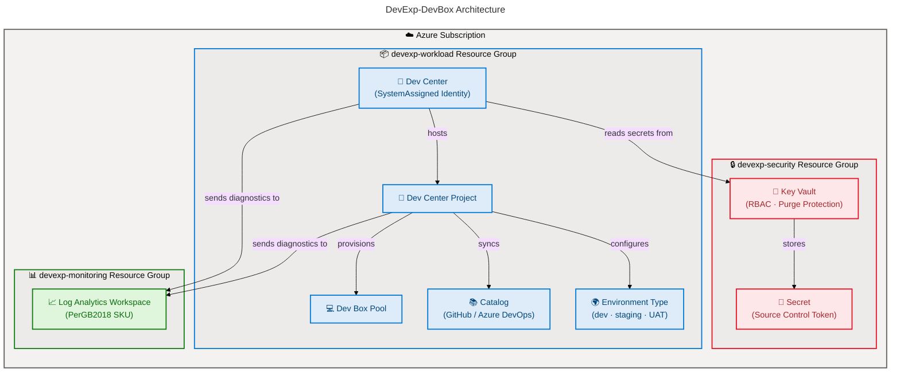

# DevExp-DevBox


Azure Dev Box Deployment Accelerator that provisions a complete developer
workstation platform using Infrastructure as Code. This project deploys Dev
Center, Dev Box pools, Key Vault secrets management, and Log Analytics
monitoring through declarative YAML configuration and Bicep modules.

**Overview**

DevExp-DevBox eliminates the manual effort of configuring Azure Dev Center
resources through the Azure portal. Platform engineering teams use this
accelerator to define their entire Dev Box environment — including projects,
pools, catalogs, networking, and security — in version-controlled YAML files and
deploy everything with a single `azd provision` command.

The accelerator follows Azure Landing Zone principles by separating resources
into dedicated resource groups for workload, security, and monitoring concerns.
Bicep modules handle each domain (identity, connectivity, management, security,
workload) independently, enabling teams to customize individual layers without
affecting others. Setup scripts for both Windows (PowerShell) and Linux/macOS
(Bash) validate prerequisites, authenticate against Azure and source control
providers, and prepare the `azd` environment before deployment.

## Table of Contents

- [Architecture](#-architecture)
- [Features](#-features)
- [Requirements](#-requirements)
- [Quick Start](#-quick-start)
- [Deployment](#-deployment)
- [Usage](#-usage)
- [Configuration](#-configuration)
- [Project Structure](#-project-structure)
- [Contributing](#-contributing)
- [License](#-license)

## 🏗️ Architecture

**Overview**

DevExp-DevBox deploys infrastructure at the Azure subscription scope using
`infra/main.bicep` as the entry point. The template creates three dedicated
resource groups following Azure Landing Zone separation of concerns, then
delegates resource creation to domain-specific Bicep modules under `src/`.

Each Bicep module loads its configuration from YAML files in `infra/settings/`
using `loadYamlContent()`, so teams modify Dev Center projects, Key Vault
policies, or resource group tags by editing configuration instead of
infrastructure code. The Dev Center uses a SystemAssigned managed identity with
Contributor and User Access Administrator roles at subscription scope and Key
Vault Secrets User/Officer roles at the security resource group scope.

Per-project networking supports two modes: **Managed** (Microsoft-hosted,
default) where Microsoft handles all connectivity, and **Unmanaged** where the
deployment creates a dedicated resource group with a custom VNet, subnet, and
Dev Center network connection.


```mermaid
---
title: "DevExp-DevBox Architecture"
config:
  theme: base
  look: classic
  layout: dagre
  flowchart:
    htmlLabels: true
---
flowchart TB
    accTitle: DevExp-DevBox Architecture
    accDescr: Three-tier Azure Landing Zone with workload, security, and monitoring resource groups deployed at subscription scope via Bicep modules

    %% ═══════════════════════════════════════════════════════════════════════════
    %% AZURE / FLUENT ARCHITECTURE PATTERN v1.1
    %% PHASE 1 - STRUCTURAL: Direction explicit, flat topology, nesting ≤ 3
    %% PHASE 2 - SEMANTIC: Colors justified, max 5 semantic classes, neutral-first
    %% PHASE 3 - FONT: Dark text on light backgrounds, contrast ≥ 4.5:1
    %% PHASE 4 - ACCESSIBILITY: accTitle/accDescr present, icons on all nodes
    %% PHASE 5 - STANDARD: Governance block present, classDefs centralized
    %% ═══════════════════════════════════════════════════════════════════════════

    subgraph subscription["☁️ Azure Subscription"]
        direction TB

        subgraph workloadRG["📦 devexp-workload Resource Group"]
            direction TB
            devCenter["🏢 Dev Center<br/>(SystemAssigned Identity)"]:::core
            project["📁 Dev Center Project"]:::core
            pool["💻 Dev Box Pool"]:::core
            catalog["📚 Catalog<br/>(GitHub / Azure DevOps)"]:::core
            envType["🌍 Environment Type<br/>(dev · staging · UAT)"]:::core

            devCenter -->|"hosts"| project
            project -->|"provisions"| pool
            project -->|"syncs"| catalog
            project -->|"configures"| envType
        end

        subgraph securityRG["🔒 devexp-security Resource Group"]
            direction TB
            keyVault["🔐 Key Vault<br/>(RBAC · Purge Protection)"]:::danger
            secret["🔑 Secret<br/>(Source Control Token)"]:::danger

            keyVault -->|"stores"| secret
        end

        subgraph monitoringRG["📊 devexp-monitoring Resource Group"]
            direction TB
            logAnalytics["📈 Log Analytics Workspace<br/>(PerGB2018 SKU)"]:::success
        end

        devCenter -->|"reads secrets from"| keyVault
        devCenter -->|"sends diagnostics to"| logAnalytics
        project -->|"sends diagnostics to"| logAnalytics
    end

    %% SUBGRAPH STYLING (4 subgraphs = 4 style directives)
    style subscription fill:#F3F2F1,stroke:#605E5C,stroke-width:2px
    style workloadRG fill:#EDEBE9,stroke:#0078D4,stroke-width:2px
    style securityRG fill:#EDEBE9,stroke:#E81123,stroke-width:2px
    style monitoringRG fill:#EDEBE9,stroke:#107C10,stroke-width:2px

    %% Centralized semantic classDefs (Phase 5 compliant)
    classDef core fill:#DEECF9,stroke:#0078D4,stroke-width:2px,color:#004578
    classDef success fill:#DFF6DD,stroke:#107C10,stroke-width:2px,color:#0B6A0B
    classDef danger fill:#FDE7E9,stroke:#E81123,stroke-width:2px,color:#A4262C

    %% Accessibility: WCAG AA verified (4.5:1 contrast ratio)
```

**Component Roles:**

| Component           | Purpose                                                                                     | Resource Group |
| ------------------- | ------------------------------------------------------------------------------------------- | -------------- |
| 🏢 Dev Center       | Central management plane with SystemAssigned identity, RBAC roles, and diagnostic settings  | Workload       |
| 📁 Project          | Scoped unit grouping pools, catalogs, environment types, and per-project identity with RBAC | Workload       |
| 💻 Dev Box Pool     | VM pool definitions with specific SKUs and image definitions per developer role             | Workload       |
| 📚 Catalog          | Git-backed repository of environment definitions and Dev Box image definitions              | Workload       |
| 🌍 Environment Type | Deployment stage definitions (dev, staging, UAT) with optional subscription targets         | Workload       |
| 🔐 Key Vault        | Secrets management with RBAC authorization, soft delete, and purge protection               | Security       |
| 📈 Log Analytics    | Centralized diagnostics workspace receiving logs and metrics from Dev Center resources      | Monitoring     |

## ✨ Features

**Overview**

This accelerator provides a comprehensive set of capabilities designed to reduce
the time and effort required to adopt Microsoft Dev Box at enterprise scale.
Teams define their entire Dev Box platform in declarative YAML and Bicep instead
of configuring resources manually through the Azure portal, enabling repeatable
and auditable deployments.

The modular architecture means each component — identity, security, networking,
monitoring — can be customized independently without affecting other layers.
YAML configuration files with JSON Schema validation ensure correctness before
deployment, while cross-platform setup scripts automate authentication and
environment preparation.

| Feature                      | Description                                                                                                     | Status    |
| ---------------------------- | --------------------------------------------------------------------------------------------------------------- | --------- |
| 🏢 Dev Center Provisioning   | Automated deployment of Azure Dev Center with managed identity and diagnostic settings                          | ✅ Stable |
| 📁 Multi-Project Support     | Configure multiple Dev Center projects with independent pools, catalogs, and permissions                        | ✅ Stable |
| 🔐 Key Vault Integration     | Secure secrets management with RBAC authorization, soft delete, and purge protection                            | ✅ Stable |
| 📈 Centralized Monitoring    | Log Analytics workspace with diagnostic settings forwarded from all deployed resources                          | ✅ Stable |
| 🔗 Network Connectivity      | Support for both managed Microsoft-hosted and unmanaged virtual network configurations                          | ✅ Stable |
| 🛡️ RBAC Automation           | Least-privilege role assignments at subscription, resource group, and project scopes                            | ✅ Stable |
| ⚙️ YAML-Driven Configuration | Declarative configuration files with JSON Schema validation for Dev Center, security, and resource organization | ✅ Stable |
| 🚀 Cross-Platform Setup      | Automated setup scripts for Windows (PowerShell) and Linux/macOS (Bash) with GitHub and Azure DevOps support    | ✅ Stable |

## 📋 Requirements

**Overview**

Before deploying the accelerator, ensure your environment meets the following
prerequisites. The setup scripts (`setUp.ps1` and `setUp.sh`) validate tool
availability automatically and exit with descriptive errors if any required CLI
is missing or not authenticated.

Azure permissions and Microsoft Entra ID configuration must be prepared in
advance by a platform administrator. The GitHub CLI is only required when using
GitHub as the source control platform; Azure DevOps users authenticate through
the Azure CLI instead.

> [!IMPORTANT] You must have Contributor and User Access Administrator
> permissions on the target Azure subscription. The deployment creates resource
> groups, role assignments, and a Key Vault with RBAC authorization at the
> subscription scope.

| Requirement                  | Details                                                                                                           | Required       |
| ---------------------------- | ----------------------------------------------------------------------------------------------------------------- | -------------- |
| ☁️ Azure Subscription        | Active subscription with Contributor and User Access Administrator permissions                                    | ✅ Yes         |
| 🔑 Azure CLI                 | Version 2.x or later — [Install Azure CLI](https://learn.microsoft.com/en-us/cli/azure/install-azure-cli)         | ✅ Yes         |
| 🛠️ Azure Developer CLI (azd) | Latest version — [Install azd](https://learn.microsoft.com/en-us/azure/developer/azure-developer-cli/install-azd) | ✅ Yes         |
| 🐙 GitHub CLI (gh)           | Required when using GitHub as source control — [Install GitHub CLI](https://cli.github.com/)                      | ⚡ Conditional |
| 📦 PowerShell 5.1+           | Required for Windows setup via `setUp.ps1`                                                                        | ⚡ Conditional |
| 🐧 Bash + jq                 | Required for Linux/macOS setup via `setUp.sh` — [Install jq](https://jqlang.github.io/jq/download/)               | ⚡ Conditional |
| 🏢 Microsoft Entra ID        | Tenant with permissions to create groups for Dev Manager and Developer roles                                      | ✅ Yes         |

## 🚀 Quick Start

**Overview**

Deploy a complete Dev Box environment by cloning the repository, signing into
the required CLIs, and running the platform-specific deployment commands. The
setup scripts validate prerequisites, retrieve your source control token, and
write the `azd` environment file. They do **not** deploy Azure resources —
provisioning is a separate `azd provision` step.

> [!TIP] On Linux/macOS, `azd provision` runs `setUp.sh` automatically through
> the preprovision hook defined in `azure.yaml`. On Windows, run `setUp.ps1`
> separately because the hook requires Bash.

**Windows (PowerShell):**

```powershell
git clone https://github.com/Evilazaro/DevExp-DevBox.git
cd DevExp-DevBox
az login ; azd auth login ; gh auth login
.\setUp.ps1 -EnvName "dev" -SourceControl "github"
azd provision -e dev
```

**Linux/macOS (Bash):**

```bash
git clone https://github.com/Evilazaro/DevExp-DevBox.git
cd DevExp-DevBox
az login && azd auth login && gh auth login
azd provision
```

See [Deployment](#-deployment) for supported regions, parameter options, manual
configuration, and cleanup instructions.

## 📦 Deployment

**Overview**

Deployment is orchestrated through Azure Developer CLI (`azd`), which reads
`azure.yaml` for hook definitions and `infra/main.bicep` as the primary
deployment entry point. The Bicep template deploys at the subscription scope,
creating three resource groups and all child resources including Dev Center, Key
Vault, and Log Analytics.

Parameter values are resolved through `infra/main.parameters.json`, which maps
`azd` environment variables (`AZURE_ENV_NAME`, `AZURE_LOCATION`,
`KEY_VAULT_SECRET`) to Bicep parameters. The setup scripts write
`KEY_VAULT_SECRET` and `SOURCE_CONTROL_PLATFORM` to `.azure/{env}/.env`, and
`azd` injects them at deployment time.

### Deployment Parameters

| Parameter            | Description                                                      | Required |
| -------------------- | ---------------------------------------------------------------- | -------- |
| ⚙️ `environmentName` | Environment identifier used in resource naming (2-10 characters) | ✅ Yes   |
| 🌍 `location`        | Azure region for all resources (e.g., `eastus2`, `westeurope`)   | ✅ Yes   |
| 🔑 `secretValue`     | Source control personal access token stored in Key Vault         | ✅ Yes   |

### Supported Regions

The deployment supports the following Azure regions as defined in
`infra/main.bicep`:

`eastus`, `eastus2`, `westus`, `westus2`, `westus3`, `centralus`, `northeurope`,
`westeurope`, `southeastasia`, `australiaeast`, `japaneast`, `uksouth`,
`canadacentral`, `swedencentral`, `switzerlandnorth`, `germanywestcentral`

### Manual Deployment

If you prefer to configure the `azd` environment manually instead of using the
setup scripts:

```bash
azd env new dev
azd env set AZURE_LOCATION "eastus2"
azd env set KEY_VAULT_SECRET "ghp_your_github_token"
azd env set SOURCE_CONTROL_PLATFORM "github"
azd provision -e dev
```

Expected output:

```text
Provisioning Azure resources can take some time.

  (✓) Done: Resource group: devexp-security-dev-eastus2-RG
  (✓) Done: Resource group: devexp-monitoring-dev-eastus2-RG
  (✓) Done: Resource group: devexp-workload-dev-eastus2-RG

SUCCESS: Your application was provisioned in Azure in 8 minutes 42 seconds.
```

### Cleanup

To remove all provisioned resources, role assignments, service principals, and
GitHub secrets:

```powershell
.\cleanSetUp.ps1 -EnvName "dev" -Location "eastus2"
```

Expected output:

```text
Starting cleanup for environment: dev in region: eastus2
Deleting subscription deployments...
Removing role assignments...
Deleting resource groups...
Cleanup completed successfully.
```

> [!WARNING] The cleanup script deletes Azure resource groups, service
> principals, and GitHub secrets. This action is irreversible for resources
> without soft delete enabled. Review the parameters before executing.

## 💻 Usage

**Overview**

After provisioning completes, the deployed Dev Center and its projects are ready
for use. Platform engineers manage resources through the Azure CLI and Azure
portal, while developers access Dev Box workstations through the Microsoft Dev
Box portal or the Dev Center CLI.

This section covers common operational tasks for managing the deployed
infrastructure. To onboard new teams, add project definitions to
`infra/settings/workload/devcenter.yaml` and re-run `azd provision` to apply
changes incrementally.

### Verify Deployed Resources

Confirm that all resource groups and resources were created:

```bash
az group list --query "[?starts_with(name, 'devexp-')]" --output table
```

Expected output:

```text
Name                                Location    Status
----------------------------------  ----------  ---------
devexp-security-dev-eastus2-RG      eastus2     Succeeded
devexp-monitoring-dev-eastus2-RG    eastus2     Succeeded
devexp-workload-dev-eastus2-RG      eastus2     Succeeded
```

### View Dev Center Projects

List all projects configured under the Dev Center:

```bash
az devcenter admin project list \
  --resource-group "devexp-workload-dev-eastus2-RG" \
  --output table
```

Expected output:

```text
Name    Location    ProvisioningState
------  ----------  ------------------
eShop   eastus2     Succeeded
```

### View Environment Settings

Check the `azd` environment values that were configured during setup:

```bash
azd env get-values -e dev
```

Expected output:

```text
AZURE_ENV_NAME="dev"
AZURE_LOCATION="eastus2"
KEY_VAULT_SECRET="ghp_***"
SOURCE_CONTROL_PLATFORM="github"
```

### Add a New Project

To onboard a new team, add a project entry to the `projects` array in
`infra/settings/workload/devcenter.yaml`, then re-run provisioning:

```bash
azd provision -e dev
```

Expected output:

```text
Provisioning Azure resources can take some time.

  (✓) Done: Resource group: devexp-workload-dev-eastus2-RG (updated)

SUCCESS: Your application was provisioned in Azure in 4 minutes 12 seconds.
```

## 🔧 Configuration

**Overview**

All infrastructure settings are defined in YAML files under `infra/settings/`.
Each YAML file has a companion JSON Schema (`*.schema.json`) that provides
real-time validation and autocompletion in editors like VS Code. Bicep modules
load these files at deployment time using `loadYamlContent()`, so teams
customize deployments by editing configuration instead of modifying
infrastructure code.

This configuration-driven approach separates infrastructure logic from
environment-specific values. Teams can onboard new projects, change VM SKUs, add
environment types, or update security policies without touching any Bicep module
— only the YAML files change.

> [!NOTE] Install the
> [YAML extension](https://marketplace.visualstudio.com/items?itemName=redhat.vscode-yaml)
> in VS Code for schema-driven autocompletion and inline validation powered by
> the `$schema` references in each YAML file.

### Configuration Files

| File                                                         | Purpose                                                                                       |
| ------------------------------------------------------------ | --------------------------------------------------------------------------------------------- |
| ⚙️ `infra/settings/workload/devcenter.yaml`                  | Dev Center name, identity, RBAC, catalogs, environment types, projects, pools, and networking |
| 🔐 `infra/settings/security/security.yaml`                   | Key Vault name, secret, RBAC authorization, purge protection, soft delete, and tags           |
| 📦 `infra/settings/resourceOrganization/azureResources.yaml` | Resource group names, descriptions, Landing Zone tags, and create/reference flags             |
| 🌍 `azure.yaml`                                              | Azure Developer CLI project name (`ContosoDevExp`) and preprovision hooks                     |

### Dev Center Configuration

`infra/settings/workload/devcenter.yaml` defines the core Dev Center resource,
its managed identity with RBAC roles, global catalogs, environment types, and
all projects with their pools, networking, and per-project identity:

```yaml
name: 'devexp-devcenter'
catalogItemSyncEnableStatus: 'Enabled'
microsoftHostedNetworkEnableStatus: 'Enabled'
installAzureMonitorAgentEnableStatus: 'Enabled'

identity:
  type: 'SystemAssigned'
  roleAssignments:
    devCenter:
      - id: 'b24988ac-6180-42a0-ab88-20f7382dd24c'
        name: 'Contributor'
        scope: 'Subscription'
      - id: '18d7d88d-d35e-4fb5-a5c3-7773c20a72d9'
        name: 'User Access Administrator'
        scope: 'Subscription'
      - id: '4633458b-17de-408a-b874-0445c86b69e6'
        name: 'Key Vault Secrets User'
        scope: 'ResourceGroup'
      - id: 'b86a8fe4-44ce-4948-aee5-eccb2c155cd7'
        name: 'Key Vault Secrets Officer'
        scope: 'ResourceGroup'
    orgRoleTypes:
      - type: DevManager
        azureADGroupId: '<Azure AD Group ID>'
        azureADGroupName: 'Platform Engineering Team'
        azureRBACRoles:
          - name: 'DevCenter Project Admin'
            id: '331c37c6-af14-46d9-b9f4-e1909e1b95a0'
            scope: ResourceGroup

catalogs:
  - name: 'customTasks'
    type: gitHub
    visibility: public
    uri: 'https://github.com/microsoft/devcenter-catalog.git'
    branch: 'main'
    path: './Tasks'

environmentTypes:
  - name: 'dev'
    deploymentTargetId: ''
  - name: 'staging'
    deploymentTargetId: ''
  - name: 'UAT'
    deploymentTargetId: ''
```

### Project Configuration

Each entry in the `projects` array defines a Dev Center project with its own
pools, catalogs, network, identity, environment types, and tags:

```yaml
projects:
  - name: 'eShop'
    description: 'eShop project.'

    network:
      name: eShop
      create: true
      resourceGroupName: 'eShop-connectivity-RG'
      virtualNetworkType: Managed
      addressPrefixes:
        - 10.0.0.0/16
      subnets:
        - name: eShop-subnet
          properties:
            addressPrefix: 10.0.1.0/24

    identity:
      type: SystemAssigned
      roleAssignments:
        - azureADGroupId: '<Azure AD Group ID>'
          azureADGroupName: 'eShop Developers'
          azureRBACRoles:
            - name: 'Contributor'
              id: 'b24988ac-6180-42a0-ab88-20f7382dd24c'
              scope: Project
            - name: 'Dev Box User'
              id: '45d50f46-0b78-4001-a660-4198cbe8cd05'
              scope: Project
            - name: 'Deployment Environment User'
              id: '18e40d4e-8d2e-438d-97e1-9528336e149c'
              scope: Project
            - name: 'Key Vault Secrets User'
              id: '4633458b-17de-408a-b874-0445c86b69e6'
              scope: ResourceGroup
            - name: 'Key Vault Secrets Officer'
              id: 'b86a8fe4-44ce-4948-aee5-eccb2c155cd7'
              scope: ResourceGroup

    pools:
      - name: 'backend-engineer'
        imageDefinitionName: 'eShop-backend-engineer'
        vmSku: general_i_32c128gb512ssd_v2 # 32 vCPUs, 128 GB RAM, 512 GB SSD
      - name: 'frontend-engineer'
        imageDefinitionName: 'eShop-frontend-engineer'
        vmSku: general_i_16c64gb256ssd_v2 # 16 vCPUs, 64 GB RAM, 256 GB SSD

    catalogs:
      - name: 'environments'
        type: environmentDefinition
        sourceControl: gitHub
        visibility: private
        uri: 'https://github.com/Evilazaro/eShop.git'
        branch: 'main'
        path: '/.devcenter/environments'
      - name: 'devboxImages'
        type: imageDefinition
        sourceControl: gitHub
        visibility: private
        uri: 'https://github.com/Evilazaro/eShop.git'
        branch: 'main'
        path: '/.devcenter/imageDefinitions'

    environmentTypes:
      - name: 'dev'
        deploymentTargetId: ''
      - name: 'staging'
        deploymentTargetId: ''
      - name: 'UAT'
        deploymentTargetId: ''

    tags:
      environment: 'dev'
      division: 'Platforms'
      team: 'DevExP'
      project: 'DevExP-DevBox'
      costCenter: 'IT'
      owner: 'Contoso'
```

### Network Configuration

Each project specifies its network connectivity mode. The deployment evaluates
`virtualNetworkType` in `connectivity.bicep` to determine whether to create
network resources:

| Mode           | Behavior                                                                                         | Use Case                          |
| -------------- | ------------------------------------------------------------------------------------------------ | --------------------------------- |
| 🌐 `Managed`   | Microsoft-hosted network — no user VNet, subnet, or network connection created                   | Default, simplest setup           |
| 🔗 `Unmanaged` | Creates a dedicated resource group with a custom VNet, subnet, and Dev Center network connection | Required for private connectivity |

When `virtualNetworkType` is `Unmanaged`, the deployment creates the resource
group specified in `resourceGroupName`, provisions the VNet with the configured
`addressPrefixes` and `subnets`, and attaches a network connection to the Dev
Center. For `Managed` networks, Microsoft handles all connectivity and the
`addressPrefixes` and `subnets` fields are ignored.

### Security Configuration

`infra/settings/security/security.yaml` controls Key Vault creation and security
policies:

```yaml
create: true
keyVault:
  name: contoso
  description: Development Environment Key Vault
  secretName: gha-token
  enablePurgeProtection: true
  enableSoftDelete: true
  softDeleteRetentionInDays: 7
  enableRbacAuthorization: true
  tags:
    environment: dev
    division: Platforms
    team: DevExP
    project: Contoso-DevExp-DevBox
    costCenter: IT
    owner: Contoso
    landingZone: security
```

| Setting                        | Purpose                                                               | Default |
| ------------------------------ | --------------------------------------------------------------------- | ------- |
| ⚙️ `create`                    | Creates a new Key Vault when `true`, references existing when `false` | `true`  |
| 🔐 `enableRbacAuthorization`   | Uses Azure RBAC instead of vault access policies                      | `true`  |
| 🛡️ `enablePurgeProtection`     | Prevents permanent deletion of secrets during retention period        | `true`  |
| 📅 `softDeleteRetentionInDays` | Recovery window for deleted secrets (7-90 days)                       | `7`     |

### Resource Organization

`infra/settings/resourceOrganization/azureResources.yaml` defines the three
Landing Zone resource groups. Resource group names follow the pattern
`{name}-{env}-{region}-RG`:

```yaml
workload:
  create: true
  name: devexp-workload
  description: prodExp
  tags:
    environment: dev
    division: Platforms
    team: DevExP
    project: Contoso-DevExp-DevBox
    costCenter: IT
    owner: Contoso
    landingZone: Workload

security:
  create: true
  name: devexp-security
  tags:
    landingZone: Workload
    project: Contoso-DevExp-DevBox

monitoring:
  create: true
  name: devexp-monitoring
  tags:
    landingZone: Workload
    project: Contoso-DevExp-DevBox
```

Set `create: false` to reference an existing resource group by name instead of
creating a new one. All tags are merged with component-specific tags at
deployment time.

## 📁 Project Structure

**Overview**

The repository organizes infrastructure code into three top-level directories:
`infra/` for deployment orchestration and settings, `src/` for reusable Bicep
modules grouped by domain, and root-level scripts for setup and teardown.

```text
DevExp-DevBox/
├── azure.yaml                    # azd configuration (Linux/macOS hooks)
├── azure-pwh.yaml                # azd configuration (Windows hooks)
├── setUp.ps1                     # Windows setup script (PowerShell)
├── setUp.sh                      # Linux/macOS setup script (Bash)
├── cleanSetUp.ps1                # Cleanup script
├── infra/
│   ├── main.bicep                # Main deployment entry point (subscription scope)
│   ├── main.parameters.json      # Parameter mappings for azd
│   └── settings/
│       ├── resourceOrganization/ # Resource group names, tags, schemas
│       ├── security/             # Key Vault configuration and schema
│       └── workload/             # Dev Center, projects, pools, and schema
└── src/
    ├── connectivity/             # VNet, subnet, network connection modules
    ├── identity/                 # RBAC role assignment modules
    ├── management/               # Log Analytics workspace module
    ├── security/                 # Key Vault and secret modules
    └── workload/
        ├── core/                 # Dev Center, catalog, environment type modules
        └── project/              # Project, pool, environment type modules
```

## 🤝 Contributing

**Overview**

Contributions are welcome and follow a structured workflow using GitHub Issues
and Pull Requests. The project uses a product-oriented delivery model organized
around Epics, Features, and Tasks, ensuring every change maps to a documented
requirement and moves through a clear review process.

All infrastructure code must be parameterized, idempotent, and reusable across
environments. Documentation changes should be included in the same pull request
as code changes. Review the full guidelines in
[CONTRIBUTING.md](CONTRIBUTING.md) before submitting.

### Workflow

1. Fork the repository and create a branch using the naming convention
   `feature/<short-name>`, `task/<short-name>`, or `fix/<short-name>`
2. Make changes with validation evidence (use `az deployment what-if` for Bicep)
3. Reference the related issue in the PR description (e.g., `Closes #123`)
4. Submit a pull request targeting `main` for review

### Engineering Standards

| Area             | Standard                                                   |
| ---------------- | ---------------------------------------------------------- |
| 🛠️ Bicep         | Parameterized, idempotent modules with no embedded secrets |
| ⚙️ PowerShell    | PowerShell 5.1+ compatible with fail-fast error handling   |
| 📝 Documentation | Every module must document purpose, inputs, and outputs    |
| 🔍 Validation    | `what-if` validation required for all deployment PRs       |

## 📝 License

This project is licensed under the MIT License. See [LICENSE](LICENSE) for
details.

Copyright (c) 2025 Evilazaro Alves
