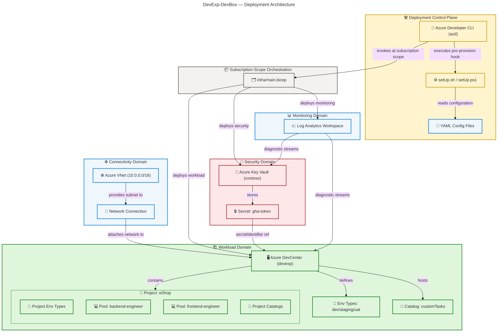

# DevExp-DevBox — Azure Dev Box Adoption & Deployment Accelerator

[](./LICENSE)
[](https://learn.microsoft.com/en-us/azure/azure-resource-manager/bicep/overview)
[](https://learn.microsoft.com/en-us/azure/developer/azure-developer-cli/)
[](https://azure.microsoft.com)

Configuration-driven Azure Dev Box Deployment Accelerator that provisions
role-specific cloud developer workstations for enterprise engineering teams
using Azure Bicep IaC, YAML-driven configuration models, and Azure Developer CLI
(`azd`) automation.

---

## 📖 Table of Contents

- [Overview](#-overview)
- [Features](#-features)
- [Quick Start](#-quick-start)
- [Deployment](#-deployment)
- [Requirements](#-requirements)
- [Usage](#-usage)
- [Configuration](#-configuration)
- [Architecture](#-architecture)
- [Contributing](#-contributing)
- [License](#-license)

---

## 📖 Overview

**Overview**

DevExp-DevBox is an open-source Infrastructure as Code accelerator that enables
Platform Engineering teams to deploy and manage
[Azure Dev Box](https://learn.microsoft.com/en-us/azure/dev-box/overview-what-is-microsoft-dev-box)
environments at enterprise scale. It provides a fully parameterized, idempotent,
and schema-validated deployment surface built on Azure Bicep and the Azure
Developer CLI (`azd`), eliminating manual configuration drift and reducing
developer onboarding time.

The accelerator serves two primary personas: **Platform Engineering teams** who
deploy and govern the Azure DevCenter infrastructure, and **engineering teams**
(such as eShop Engineers) who self-serve role-specific Dev Box workstations
through project-scoped pools and catalog-driven image definitions. The solution
aligns with Azure Landing Zone principles by segregating workload, security, and
monitoring concerns into dedicated resource groups with consistent tagging
taxonomies.

At its core the accelerator deploys an Azure DevCenter (`devexp`) that
orchestrates Dev Box pools, environment lifecycle abstractions (dev, staging,
UAT), scheduled GitHub catalog synchronization, and Log Analytics–backed
observability — all driven by three YAML configuration models validated at
authoring time by JSON Schema 2020-12.

> [!NOTE]  
> This accelerator is scoped to infrastructure provisioning only. All
> application interactions occur at deployment time through IaC modules; no
> runtime REST API or event-driven microservices layer is included.

> [!TIP]  
> Start with `infra/settings/workload/devcenter.yaml` to customize the Dev
> Center name, projects, Dev Box pools, and catalogs before running `azd up`.

---

## ✨ Features

**Overview**

DevExp-DevBox bundles eight enterprise-grade capabilities that address the full
lifecycle of cloud developer workstation governance. Each capability is
implemented through composable Bicep modules and YAML-driven configuration,
giving Platform Engineering teams repeatable control over provisioning,
security, and observability without bespoke scripting.

> [!TIP]  
> All capabilities below are active by default and configurable through the YAML
> files in `infra/settings/`. No code changes are required for standard
> deployments.

| Feature                         | Description                                                                                                                                                                                                                        | Status    |
| ------------------------------- | ---------------------------------------------------------------------------------------------------------------------------------------------------------------------------------------------------------------------------------- | --------- |
| 🏗️ Azure DevCenter Provisioning | Deploys a centralized Azure DevCenter (`devexp`) with system-assigned managed identity, catalog item sync, Microsoft-hosted network, and Azure Monitor agent features                                                              | ✅ Stable |
| 👥 Role-Based Dev Box Pools     | Creates project-scoped Dev Box pools aligned to engineering personas (e.g., `backend-engineer`, `frontend-engineer`) with configurable VM SKUs and catalog-driven image definitions                                                | ✅ Stable |
| 🔐 Key Vault Secrets Management | Provisions Azure Key Vault with RBAC authorization, soft-delete, and purge protection; stores the GitHub Access Token (`gha-token`) using the secret identifier pattern to avoid credential exposure in IaC templates              | ✅ Stable |
| 📊 Centralized Observability    | Deploys a Log Analytics Workspace (PerGB2018 SKU) and streams `allLogs` + `AllMetrics` diagnostic data from DevCenter, Key Vault, and Virtual Network resources                                                                    | ✅ Stable |
| 🌐 Network Connectivity         | Provisions Azure Virtual Networks and Network Connections with `AzureADJoin` domain-join type, enabling cloud-native identity for Dev Box pools with optional Managed or Unmanaged virtual network types                           | ✅ Stable |
| 📂 Catalog Synchronization      | Attaches GitHub and Azure DevOps catalogs to DevCenter and projects for scheduled sync of task definitions, image definitions, and environment configurations                                                                      | ✅ Stable |
| 🔁 Multi-Environment Lifecycle  | Defines dev, staging, and UAT environment types within each project, aligned to SDLC stages and configurable with per-environment deployment target subscriptions                                                                  | ✅ Stable |
| 🏷️ Governance & Cost Tagging    | Applies a consistent eight-key tagging taxonomy (`environment`, `division`, `team`, `project`, `costCenter`, `owner`, `landingZone`, `resources`) across all deployed Azure resources for cost allocation and governance reporting | ✅ Stable |

---

## 🚀 Quick Start

**Overview**

The fastest path to a running Dev Box environment is three commands:
authenticate, configure, and deploy. The Azure Developer CLI (`azd`) handles
environment initialization, pre-provisioning hooks, and Bicep deployment in a
single workflow.

**Prerequisites**:

- Azure CLI (`az`) — authenticated with a subscription
- Azure Developer CLI (`azd`) — version 1.x or later
- GitHub CLI (`gh`) — required when `SOURCE_CONTROL_PLATFORM=github`

**Clone and initialize the environment**:

```bash
git clone https://github.com/Evilazaro/DevExp-DevBox.git
cd DevExp-DevBox
azd init
```

**Expected output**:

```
Initializing a new project (azd init)
  (?) Enter a new environment name: dev
SUCCESS: New project initialized!
```

**Deploy the accelerator**:

```bash
azd up
```

When prompted, provide:

- `environmentName` — environment label (e.g., `dev`, `test`, `prod`)
- `location` — Azure region (e.g., `eastus2`)
- `secretValue` — GitHub Access Token for private catalog authentication

**Expected output**:

```
Provisioning Azure resources (azd provision)
  Creating resource group: devexp-workload-dev-eastus2-RG
  Deploying Log Analytics Workspace: logAnalytics
  Deploying Key Vault: contoso
  Deploying DevCenter: devexp
  Deploying Project: eShop
SUCCESS: Your application was provisioned in Azure in 8 minutes.
```

Access the Dev Center in the [Azure Portal](https://portal.azure.com) under
**Dev centers** → `devexp`.

---

## 📦 Deployment

**Overview**

The accelerator uses the Azure Developer CLI (`azd`) as its deployment control
plane, which invokes platform-specific pre-provisioning scripts before executing
the `infra/main.bicep` module at Azure subscription scope. The deployment
creates up to three resource groups (workload, security, monitoring) depending
on the `azureResources.yaml` configuration, then deploys all modules in
dependency order.

> [!WARNING] > The `azd up` command will create Azure resources that incur
> costs. Review `infra/settings/resourceOrganization/azureResources.yaml` and
> `infra/settings/workload/devcenter.yaml` before deploying to validate resource
> group names, VM SKUs, and project configuration.

### Step 1 — Set Required Environment Variables

```bash
export AZURE_ENV_NAME="dev"
export AZURE_LOCATION="eastus2"
export SOURCE_CONTROL_PLATFORM="github"
export KEY_VAULT_SECRET="<your-github-access-token>"
```

On Windows (PowerShell):

```powershell
$env:AZURE_ENV_NAME = "dev"
$env:AZURE_LOCATION = "eastus2"
$env:SOURCE_CONTROL_PLATFORM = "github"
$env:KEY_VAULT_SECRET = "<your-github-access-token>"
```

### Step 2 — Run the Setup Script (Optional — Manual Pre-Provisioning)

Linux/macOS:

```bash
./setUp.sh -e "$AZURE_ENV_NAME" -s "$SOURCE_CONTROL_PLATFORM"
```

Windows:

```powershell
.\setUp.ps1 -EnvName $env:AZURE_ENV_NAME -SourceControl $env:SOURCE_CONTROL_PLATFORM
```

**Expected output**:

```
✅ [2026-04-15 10:00:00] Environment 'dev' initialized successfully.
✅ [2026-04-15 10:00:05] GitHub CLI authenticated.
✅ [2026-04-15 10:00:10] Azure CLI authenticated.
```

### Step 3 — Provision All Azure Resources

```bash
azd provision
```

**Expected output**:

```
Provisioning Azure resources (azd provision)
  (✓) Done: Resource group: devexp-workload-dev-eastus2-RG
  (✓) Done: Log Analytics Workspace
  (✓) Done: Key Vault: contoso
  (✓) Done: DevCenter: devexp
  (✓) Done: Project: eShop
SUCCESS: Your application was provisioned in Azure.
```

### Step 4 — Tear Down (Optional)

```powershell
.\cleanSetUp.ps1 -EnvName "dev" -Location "eastus2"
```

**Expected output**:

```
✅ Cleanup of environment 'dev' completed successfully.
```

---

## 📋 Requirements

**Overview**

The accelerator requires a standard Azure developer toolchain consisting of
Azure CLI, Azure Developer CLI, and (for GitHub integration) the GitHub CLI. All
tools must be authenticated against your Azure tenant and subscription before
running `azd up`. No application runtime dependencies (Node.js, Python, Docker)
are required for infrastructure deployment.

| Requirement                    | Version | Purpose                                                                                 | Required        |
| ------------------------------ | ------- | --------------------------------------------------------------------------------------- | --------------- |
| 🔧 Azure CLI (`az`)            | 2.60+   | Azure resource management and authentication                                            | ✅ Yes          |
| 🚀 Azure Developer CLI (`azd`) | 1.x+    | Environment initialization and deployment orchestration                                 | ✅ Yes          |
| 🐙 GitHub CLI (`gh`)           | 2.x+    | GitHub authentication and secret management (GitHub platform only)                      | ⚠️ Conditional  |
| 🔵 PowerShell                  | 7+      | Windows pre-provisioning script execution (`setUp.ps1`, `cleanSetUp.ps1`)               | ⚠️ Windows only |
| 🐧 Bash                        | 5+      | Linux/macOS pre-provisioning script execution (`setUp.sh`)                              | ⚠️ POSIX only   |
| 📦 Azure Subscription          | —       | Target subscription for resource deployment; Contributor access required                | ✅ Yes          |
| 🔑 Azure AD Permissions        | —       | Ability to create role assignments (User Access Administrator or Owner on subscription) | ✅ Yes          |

> [!NOTE]  
> The Hugo v0.136.2 documentation site (`package.json`) is for accelerator
> documentation hosting only and is not required for infrastructure deployment.

---

## 💻 Usage

**Overview**

After provisioning, Platform Engineering teams configure Dev Box pools and
catalogs through YAML files, while engineering teams use the Azure Portal or Dev
Box client to claim and connect to their workstations. The `azd` CLI manages the
full lifecycle: initial provisioning, configuration updates (re-run
`azd provision`), and environment teardown.

### Provision a New Environment

```bash
azd up --environment prod
```

**Expected output**:

```
SUCCESS: Your application was provisioned in Azure in ~10 minutes.

Outputs:
  AZURE_DEV_CENTER_NAME: devexp
  AZURE_DEV_CENTER_PROJECTS: ["eShop"]
  AZURE_KEY_VAULT_NAME: contoso
  AZURE_LOG_ANALYTICS_WORKSPACE_NAME: logAnalytics
```

### Update an Existing Deployment

After modifying any YAML configuration file, re-run `azd provision` to apply
changes:

```bash
azd provision
```

### Add a New Project to the DevCenter

Edit `infra/settings/workload/devcenter.yaml` and add a new entry to the
`projects` array:

```yaml
projects:
  - name: 'my-new-project'
    description: 'My new Dev Box project.'
    network:
      name: my-new-project
      create: true
      resourceGroupName: 'my-new-project-connectivity-RG'
      virtualNetworkType: Managed
      addressPrefixes:
        - 10.1.0.0/16
      subnets:
        - name: my-new-project-subnet
          properties:
            addressPrefix: 10.1.1.0/24
      tags:
        environment: dev
        team: DevExP
```

Then re-provision:

```bash
azd provision
```

### Clean Up All Resources

```powershell
.\cleanSetUp.ps1 -EnvName "dev" -Location "eastus2"
```

---

## ⚙️ Configuration

**Overview**

The accelerator uses three YAML configuration files, each validated at authoring
time by a companion JSON Schema. All deployment-time behavior — resource group
names, Dev Center settings, Key Vault settings, and project definitions — is
controlled exclusively through these files. No Bicep source changes are required
for standard customizations.

| Parameter                | File                   | Description                                              | Default             | Required    |
| ------------------------ | ---------------------- | -------------------------------------------------------- | ------------------- | ----------- |
| 🏷️ `workload.name`       | `azureResources.yaml`  | Name of the workload resource group                      | `devexp-workload`   | ✅ Yes      |
| 🏷️ `workload.create`     | `azureResources.yaml`  | Whether to create the workload resource group            | `true`              | ✅ Yes      |
| 🏗️ `name` (DevCenter)    | `devcenter.yaml`       | Name of the Azure DevCenter instance                     | `devexp`            | ✅ Yes      |
| 🔐 `keyVault.name`       | `security.yaml`        | Globally unique Key Vault name                           | `contoso`           | ✅ Yes      |
| 🔐 `keyVault.secretName` | `security.yaml`        | Name of the GitHub token secret in Key Vault             | `gha-token`         | ✅ Yes      |
| 🌍 `location`            | `main.parameters.json` | Azure region for all resources                           | `${AZURE_LOCATION}` | ✅ Yes      |
| 🔑 `environmentName`     | `main.parameters.json` | Environment name used in resource group naming           | `${AZURE_ENV_NAME}` | ✅ Yes      |
| 📂 Catalogs (`catalogs`) | `devcenter.yaml`       | Array of GitHub/ADO catalog configurations for task sync | Microsoft catalog   | ⚠️ Optional |
| 🌐 Project Network       | `devcenter.yaml`       | Per-project VNet name, address prefix, and subnet config | eShop defaults      | ⚠️ Optional |
| 🖥️ Pool VM SKU (`vmSku`) | `devcenter.yaml`       | Dev Box pool VM SKU per engineering persona              | See pools config    | ⚠️ Optional |
| 🔁 Environment Types     | `devcenter.yaml`       | Array of environment lifecycle stages (dev/staging/uat)  | Three stages        | ⚠️ Optional |

### Configuration File Locations

| File                     | Path                                                      | Schema                       |
| ------------------------ | --------------------------------------------------------- | ---------------------------- |
| 📁 Resource Organization | `infra/settings/resourceOrganization/azureResources.yaml` | `azureResources.schema.json` |
| 🏗️ Dev Center Workload   | `infra/settings/workload/devcenter.yaml`                  | `devcenter.schema.json`      |
| 🔐 Security              | `infra/settings/security/security.yaml`                   | `security.schema.json`       |

> [!NOTE]  
> The `security.create` flag in `azureResources.yaml` controls whether a
> separate security resource group is created. When set to `false` (default),
> Key Vault is deployed into the workload resource group.

---

## 🏗️ Architecture

**Overview**

The accelerator follows an IaC-first, configuration-driven deployment pattern.
The Azure Developer CLI (`azd`) acts as the top-level deployment controller,
executing platform-specific pre-provisioning scripts before invoking
`infra/main.bicep` at Azure subscription scope. The main module delegates
responsibility to three domain-scoped orchestrators — Log Analytics Workspace
(monitoring), Key Vault (security), and DevCenter workload — connected through
explicit `dependsOn` chains and output parameter propagation.


```mermaid
---
title: "DevExp-DevBox — Deployment Architecture"
config:
  theme: base
  look: classic
  layout: dagre
  flowchart:
    htmlLabels: true
---
flowchart TB
    accTitle: DevExp-DevBox Deployment Architecture
    accDescr: Deployment flow from azd CLI control plane through infra/main.bicep subscription-scope orchestration to three domain modules — Log Analytics monitoring, Key Vault security, and DevCenter workload — including project-level resources, Dev Box pools, network connections, and catalog sync. WCAG AA compliant.

    %% ═══════════════════════════════════════════════════════════════════════════
    %% AZURE / FLUENT ARCHITECTURE PATTERN v2.0
    %% (Semantic + Structural + Font + Accessibility Governance)
    %% ═══════════════════════════════════════════════════════════════════════════
    %% PHASE 1 - FLUENT UI: All styling uses approved Fluent UI palette only
    %% PHASE 2 - GROUPS: Every subgraph has semantic color via style directive
    %% PHASE 3 - COMPONENTS: Every node has semantic classDef + icon prefix
    %% PHASE 4 - ACCESSIBILITY: accTitle/accDescr present, WCAG AA contrast
    %% PHASE 5 - STANDARD: Governance block present, classDefs centralized
    %% ═══════════════════════════════════════════════════════════════════════════

    subgraph CTL["🛠️ Deployment Control Plane"]
        direction TB
        AZD["🚀 Azure Developer CLI (azd)"]:::tooling
        SETUP["⚙️ setUp.sh / setUp.ps1"]:::tooling
        YAML["📄 YAML Config Files"]:::data
        AZD -->|"executes pre-provision hook"| SETUP
        SETUP -->|"reads configuration"| YAML
    end

    subgraph ORCH["📦 Subscription-Scope Orchestration"]
        direction TB
        MAIN["🗂️ infra/main.bicep"]:::iac
    end

    subgraph MON["📊 Monitoring Domain"]
        direction TB
        LAW["📈 Log Analytics Workspace"]:::monitor
    end

    subgraph SEC["🔐 Security Domain"]
        direction TB
        KV["🔑 Azure Key Vault (contoso)"]:::security
        SECRET["🔒 Secret: gha-token"]:::security
        KV -->|"stores"| SECRET
    end

    subgraph WRK["🏗️ Workload Domain"]
        direction TB
        DC["🖥️ Azure DevCenter (devexp)"]:::core
        CAT["📂 Catalog: customTasks"]:::core
        ENV["🔁 Env Types: dev/staging/uat"]:::core

        subgraph PROJ["📁 Project: eShop"]
            direction TB
            PENV["🌿 Project Env Types"]:::app
            POOL1["💻 Pool: backend-engineer"]:::app
            POOL2["💻 Pool: frontend-engineer"]:::app
            PCAT["📂 Project Catalogs"]:::app
        end

        DC -->|"hosts"| CAT
        DC -->|"defines"| ENV
        DC -->|"contains"| PROJ
    end

    subgraph NET["🌐 Connectivity Domain"]
        direction TB
        VNET["🌐 Azure VNet (10.0.0.0/16)"]:::network
        NC["🔗 Network Connection"]:::network
        VNET -->|"provides subnet to"| NC
    end

    AZD -->|"invokes at subscription scope"| MAIN
    MAIN -->|"deploys monitoring"| LAW
    MAIN -->|"deploys security"| KV
    MAIN -->|"deploys workload"| DC
    LAW -->|"diagnostic streams"| DC
    LAW -->|"diagnostic streams"| KV
    SECRET -->|"secretIdentifier ref"| DC
    NC -->|"attaches network to"| DC

    style CTL fill:#FFF4CE,stroke:#C19C00,stroke-width:2px,color:#323130
    style ORCH fill:#F3F2F1,stroke:#605E5C,stroke-width:2px,color:#323130
    style MON fill:#EFF6FC,stroke:#0078D4,stroke-width:2px,color:#323130
    style SEC fill:#FDE7E9,stroke:#A4262C,stroke-width:2px,color:#323130
    style WRK fill:#DFF6DD,stroke:#107C10,stroke-width:2px,color:#323130
    style PROJ fill:#DFF6DD,stroke:#107C10,stroke-width:1px,color:#323130
    style NET fill:#EFF6FC,stroke:#0078D4,stroke-width:2px,color:#323130

    classDef tooling fill:#FFF4CE,stroke:#C19C00,stroke-width:2px,color:#323130
    classDef iac fill:#F3F2F1,stroke:#605E5C,stroke-width:2px,color:#323130
    classDef data fill:#EFF6FC,stroke:#0078D4,stroke-width:2px,color:#323130
    classDef monitor fill:#EFF6FC,stroke:#0078D4,stroke-width:2px,color:#323130
    classDef security fill:#FDE7E9,stroke:#A4262C,stroke-width:2px,color:#323130
    classDef core fill:#DFF6DD,stroke:#107C10,stroke-width:2px,color:#323130
    classDef app fill:#DFF6DD,stroke:#107C10,stroke-width:2px,color:#323130
    classDef network fill:#EFF6FC,stroke:#0078D4,stroke-width:2px,color:#323130
    classDef neutral fill:#FAFAFA,stroke:#8A8886,stroke-width:2px,color:#323130
```

### Component Roles

| Component                      | Role                                                                                                 | Source                               |
| ------------------------------ | ---------------------------------------------------------------------------------------------------- | ------------------------------------ |
| 🚀 Azure Developer CLI (`azd`) | Top-level deployment controller; triggers pre-provision hooks and invokes `infra/main.bicep`         | `azure.yaml`                         |
| 🗂️ `infra/main.bicep`          | Subscription-scope orchestration module; creates resource groups and coordinates domain modules      | `infra/main.bicep`                   |
| 📈 Log Analytics Workspace     | Centralized observability; ingests `allLogs` + `AllMetrics` from all Azure PaaS services             | `src/management/logAnalytics.bicep`  |
| 🔑 Azure Key Vault             | RBAC-authorized secrets store; holds GitHub Access Token via secret identifier pattern               | `src/security/keyVault.bicep`        |
| 🖥️ Azure DevCenter             | Central platform for Dev Box workstations; manages catalogs, environment types, and projects         | `src/workload/core/devCenter.bicep`  |
| 📁 eShop Project               | Project-scoped resource unit; contains Dev Box pools, catalogs, and environment types for eShop team | `src/workload/project/project.bicep` |
| 🌐 Azure VNet                  | Provides network isolation (10.0.0.0/16) for Dev Box pool connectivity                               | `src/connectivity/vnet.bicep`        |

---

## 🤝 Contributing

**Overview**

Contributions follow a product-oriented delivery model using GitHub Issues
(Epics, Features, Tasks) and a branch-per-feature workflow. All Bicep modules
must be parameterized, idempotent, and reusable; all PowerShell scripts must be
PowerShell 7+ compatible with clear error handling. Documentation is maintained
as code and updated in the same PR as any implementation change.

### Branch Naming

Use the following prefixes:

```
feature/<short-name>
task/<short-name>
fix/<short-name>
docs/<short-name>
```

Include the issue number when possible: `feature/123-dev-center-baseline`

### Pull Request Requirements

Each PR must:

- Reference the issue it closes (e.g., `Closes #123`)
- Include a summary of changes and test/validation evidence
- Include documentation updates if applicable

### Engineering Standards

| Area             | Standard                                                                                        |
| ---------------- | ----------------------------------------------------------------------------------------------- |
| 🔧 Bicep Modules | Parameterized, idempotent, reusable across environments — no hard-coded values                  |
| 📜 PowerShell    | PowerShell 7+ compatible; fail-fast error handling; idempotent re-runs                          |
| 📖 Documentation | Every module/script must have Purpose, Inputs/Outputs, Example Usage, and Troubleshooting notes |
| 🏷️ Tagging       | Apply the eight-key tagging taxonomy to all deployed Azure resources                            |

For the full contribution guidelines, see [CONTRIBUTING.md](./CONTRIBUTING.md).

> [!NOTE] Every **Feature** must link its **Parent Epic**, and every **Task**
> must link its **Parent Feature**. Use the GitHub Issue Forms in
> `.github/ISSUE_TEMPLATE/` for structured issue creation.

---

## 📄 License

[MIT](./LICENSE) — Copyright © 2025 Evilázaro Alves
