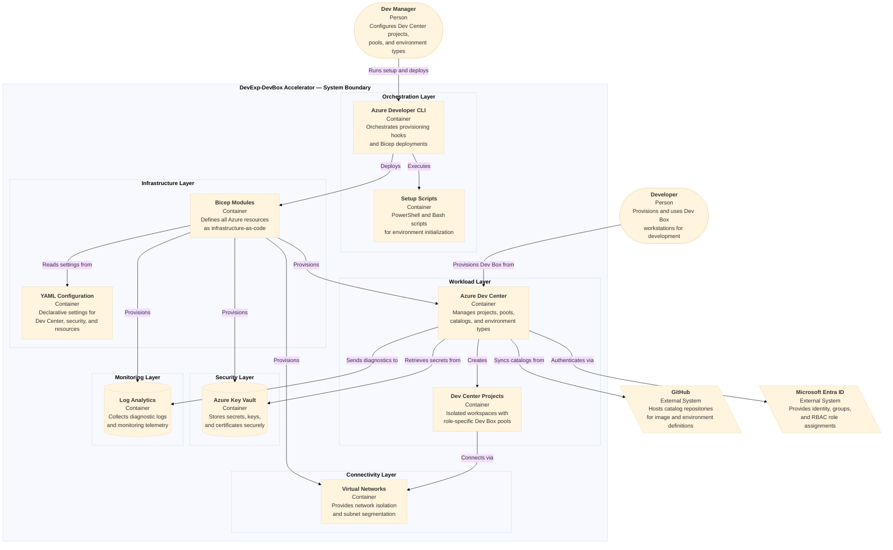

# DevExp-DevBox


> [!NOTE] Replace the badge URLs above with actual CI/CD pipeline and coverage
> service endpoints once configured.

**DevExp-DevBox** is an Azure Dev Box accelerator that automates the
provisioning and configuration of Microsoft Dev Box environments using
infrastructure-as-code principles, enabling development teams to rapidly deploy
standardized, role-specific developer workstations.

This project solves the challenge of consistently provisioning secure, governed
developer environments at scale by codifying **Azure Dev Center** resources,
network connectivity, security controls, and monitoring into a repeatable,
version-controlled deployment pipeline.

The accelerator leverages **Bicep** for infrastructure-as-code, **YAML** for
declarative configuration, **Azure Developer CLI** (azd) for orchestration, and
**PowerShell**/Bash scripts for cross-platform automation.

## Table of Contents

- [Features](#features)
- [Architecture](#architecture)
- [Technologies Used](#technologies-used)
- [Quick Start](#quick-start)
- [Configuration](#configuration)
- [Deployment](#deployment)
- [Usage](#usage)
- [Contributing](#contributing)
- [License](#license)

## Features

| Feature                      | Description                                                                                                                              |
| ---------------------------- | ---------------------------------------------------------------------------------------------------------------------------------------- |
| 🏗️ Infrastructure-as-Code    | Deploy all Dev Box resources using **Bicep** modules with subscription-scoped orchestration.                                             |
| ⚙️ YAML-Driven Configuration | Define Dev Center settings, projects, pools, catalogs, and environment types through declarative YAML files with JSON Schema validation. |
| 🔐 Security Integration      | Provision **Azure Key Vault** with RBAC authorization, soft-delete, and purge protection for secrets management.                         |
| 📊 Centralized Monitoring    | Deploy **Log Analytics** workspaces with diagnostic settings for all resources.                                                          |
| 🌐 Network Connectivity      | Configure managed or unmanaged virtual networks with subnet isolation per project.                                                       |
| 👥 Role-Based Access Control | Assign Azure RBAC roles using system-assigned managed identities following least-privilege principles.                                   |
| 🚀 Cross-Platform Setup      | Automate environment provisioning with both PowerShell and Bash setup scripts.                                                           |
| 🔄 Multi-Environment Support | Define dev, staging, and UAT environment types with independent deployment targets.                                                      |
| 📦 Catalog Integration       | Connect **GitHub** and Azure DevOps repositories as Dev Box image definition and environment definition catalogs.                        |
| 🧹 Cleanup Automation        | Tear down all provisioned resources, role assignments, and GitHub secrets with a single cleanup script.                                  |

## Architecture

The **DevExp-DevBox** accelerator follows Azure Landing Zone principles,
organizing resources into functional groups (workload, security, monitoring)
under a subscription-scoped deployment. The system uses a layered architecture
where the **Azure Developer CLI** orchestrates Bicep modules that provision
resource groups, deploy core infrastructure services, and configure Dev Center
projects with their associated pools, catalogs, and network connections.


```mermaid
---
config:
  theme: base
  flowchart:
    htmlLabels: true
  themeVariables:
    fontSize: 16px
---
flowchart TB
    %% C4 Container Diagram — DevExp-DevBox Accelerator

    %% PERSONS / ACTORS
    DevManager([<b>Dev Manager</b><br>Person<br>Configures Dev Center projects,<br>pools, and environment types])
    Developer([<b>Developer</b><br>Person<br>Provisions and uses Dev Box<br>workstations for development])

    %% EXTERNAL SYSTEMS
    GitHub[\<b>GitHub</b><br>External System<br>Hosts catalog repositories<br>for image and environment definitions\]
    AzureAD[\<b>Microsoft Entra ID</b><br>External System<br>Provides identity, groups,<br>and RBAC role assignments\]

    %% SYSTEM BOUNDARY
    subgraph SystemBoundary [<b>DevExp-DevBox Accelerator — System Boundary</b>]
        direction TB

        %% ORCHESTRATION LAYER
        subgraph Orchestration [<b>Orchestration Layer</b>]
            direction LR
            AZD[<b>Azure Developer CLI</b><br>Container<br>Orchestrates provisioning hooks<br>and Bicep deployments]
            SetupScripts[<b>Setup Scripts</b><br>Container<br>PowerShell and Bash scripts<br>for environment initialization]
        end

        %% INFRASTRUCTURE LAYER
        subgraph Infrastructure [<b>Infrastructure Layer</b>]
            direction LR
            BicepModules[<b>Bicep Modules</b><br>Container<br>Defines all Azure resources<br>as infrastructure-as-code]
            YAMLConfig[<b>YAML Configuration</b><br>Container<br>Declarative settings for<br>Dev Center, security, and resources]
        end

        %% WORKLOAD LAYER
        subgraph Workload [<b>Workload Layer</b>]
            direction LR
            DevCenter[<b>Azure Dev Center</b><br>Container<br>Manages projects, pools,<br>catalogs, and environment types]
            Projects[<b>Dev Center Projects</b><br>Container<br>Isolated workspaces with<br>role-specific Dev Box pools]
        end

        %% SECURITY LAYER
        subgraph Security [<b>Security Layer</b>]
            direction LR
            KeyVault[(<b>Azure Key Vault</b><br>Container<br>Stores secrets, keys,<br>and certificates securely)]
        end

        %% MONITORING LAYER
        subgraph Monitoring [<b>Monitoring Layer</b>]
            direction LR
            LogAnalytics[(<b>Log Analytics</b><br>Container<br>Collects diagnostic logs<br>and monitoring telemetry)]
        end

        %% CONNECTIVITY LAYER
        subgraph Connectivity [<b>Connectivity Layer</b>]
            direction LR
            VNet[<b>Virtual Networks</b><br>Container<br>Provides network isolation<br>and subnet segmentation]
        end
    end

    %% RELATIONSHIPS
    DevManager -- "Runs setup and deploys" --> AZD
    Developer -- "Provisions Dev Box from" --> DevCenter

    AZD -- "Executes" --> SetupScripts
    AZD -- "Deploys" --> BicepModules
    BicepModules -- "Reads settings from" --> YAMLConfig
    BicepModules -- "Provisions" --> DevCenter
    BicepModules -- "Provisions" --> KeyVault
    BicepModules -- "Provisions" --> LogAnalytics
    BicepModules -- "Provisions" --> VNet

    DevCenter -- "Creates" --> Projects
    Projects -- "Connects via" --> VNet
    DevCenter -- "Retrieves secrets from" --> KeyVault
    DevCenter -- "Sends diagnostics to" --> LogAnalytics

    DevCenter -- "Syncs catalogs from" --> GitHub
    DevCenter -- "Authenticates via" --> AzureAD
```

## Technologies Used

| Technology                | Type                   | Purpose                                                                  |
| ------------------------- | ---------------------- | ------------------------------------------------------------------------ |
| Bicep                     | Infrastructure-as-Code | Define and deploy all Azure resources declaratively                      |
| Azure Developer CLI (azd) | CLI Tool               | Orchestrate provisioning workflows with deployment hooks                 |
| PowerShell                | Scripting              | Cross-platform setup and cleanup automation (Windows)                    |
| Bash                      | Scripting              | Cross-platform setup automation (Linux/macOS)                            |
| YAML                      | Configuration          | Declarative settings for Dev Center, security, and resource organization |
| JSON Schema               | Validation             | Validate YAML configuration files against defined schemas                |
| Azure Dev Center          | Azure Service          | Centralized management of developer workstations and environments        |
| Microsoft Dev Box         | Azure Service          | Cloud-hosted developer workstations with role-specific configurations    |
| Azure Key Vault           | Azure Service          | Secure storage of secrets, keys, and certificates                        |
| Azure Log Analytics       | Azure Service          | Centralized monitoring, diagnostics, and log collection                  |
| Azure Virtual Networks    | Azure Service          | Network isolation and connectivity for Dev Box resources                 |
| Azure RBAC                | Security               | Role-based access control with managed identities                        |
| GitHub CLI (gh)           | CLI Tool               | GitHub authentication and secrets management                             |
| Azure CLI (az)            | CLI Tool               | Azure resource management and authentication                             |

## Quick Start

### Prerequisites

| Prerequisite              | Version | Description                                                              |
| ------------------------- | ------- | ------------------------------------------------------------------------ |
| Azure CLI                 | Latest  | Authenticate and manage Azure resources                                  |
| Azure Developer CLI (azd) | Latest  | Orchestrate infrastructure deployment                                    |
| GitHub CLI (gh)           | Latest  | GitHub authentication (if using GitHub source control)                   |
| jq                        | Latest  | JSON processor (required for Bash setup script)                          |
| PowerShell                | 5.1+    | Run setup scripts on Windows                                             |
| Azure Subscription        | —       | Active subscription with Contributor and User Access Administrator roles |

> [!IMPORTANT] Ensure your Azure account has **Contributor** and **User Access
> Administrator** roles at the subscription level before running any deployment.

### Setup and Deployment

1. Clone the repository:

```bash
git clone https://github.com/Evilazaro/DevExp-DevBox.git
cd DevExp-DevBox
```

2. Authenticate with Azure and GitHub:

```bash
az login
azd auth login
gh auth login
```

3. Initialize and deploy (the `preprovision` hook in `azure.yaml` automatically
   runs the setup scripts to configure environment variables and
   authentication):

```bash
azd init
azd up
```

4. Verify the deployment outputs:

```bash
azd env get-values
```

> [!TIP] The `azd up` command triggers a `preprovision` hook that automatically
> executes the setup scripts, handling environment variable configuration
> (`AZURE_LOCATION`, `KEY_VAULT_SECRET`, `SOURCE_CONTROL_PLATFORM`) and platform
> authentication before provisioning resources.

### Cleanup

To tear down all provisioned resources, role assignments, service principals,
and GitHub secrets:

```powershell
.\cleanSetUp.ps1 -EnvName "dev" -Location "eastus2"
```

> [!WARNING] Running `cleanSetUp.ps1` deletes all subscription deployments,
> resource groups, role assignments, service principals, and GitHub secrets. Use
> with caution in shared environments.

## Configuration

The accelerator uses three YAML configuration files in `infra/settings/`, each
validated by a companion JSON Schema.

### Dev Center Configuration (`infra/settings/workload/devcenter.yaml`)

| Option                                  | Default                                                                | Description                                         |
| --------------------------------------- | ---------------------------------------------------------------------- | --------------------------------------------------- |
| `name`                                  | `devexp`                                                               | Name of the Dev Center instance                     |
| `catalogItemSyncEnableStatus`           | `Enabled`                                                              | Enable automatic catalog synchronization            |
| `microsoftHostedNetworkEnableStatus`    | `Enabled`                                                              | Enable Microsoft-hosted networking for Dev Boxes    |
| `installAzureMonitorAgentEnableStatus`  | `Enabled`                                                              | Install Azure Monitor agent on Dev Boxes            |
| `identity.type`                         | `SystemAssigned`                                                       | Managed identity type for Dev Center authentication |
| `identity.roleAssignments.devCenter`    | Contributor, User Access Administrator, Key Vault Secrets User/Officer | RBAC roles assigned to the Dev Center identity      |
| `identity.roleAssignments.orgRoleTypes` | DevManager → DevCenter Project Admin                                   | Organizational role types mapped to Azure AD groups |

### Project Configuration (`devcenter.yaml` → `projects[]`)

| Option                                       | Example                                                | Description                                                             |
| -------------------------------------------- | ------------------------------------------------------ | ----------------------------------------------------------------------- |
| `name`                                       | `eShop`                                                | Project name within the Dev Center                                      |
| `description`                                | `eShop project.`                                       | Description of the project purpose                                      |
| `network.virtualNetworkType`                 | `Managed`                                              | Network type: `Managed` (Microsoft-hosted) or `Unmanaged` (custom VNet) |
| `network.addressPrefixes`                    | `10.0.0.0/16`                                          | VNet address space (required for `Unmanaged` networks)                  |
| `network.subnets[].properties.addressPrefix` | `10.0.1.0/24`                                          | Subnet address range for Dev Box connectivity                           |
| `identity.type`                              | `SystemAssigned`                                       | Managed identity for project-level security                             |
| `identity.roleAssignments[].azureRBACRoles`  | Contributor, Dev Box User, Deployment Environment User | RBAC roles assigned to project team Azure AD groups                     |

### Pool Configuration (`devcenter.yaml` → `projects[].pools[]`)

| Option                | Example                       | Description                                           |
| --------------------- | ----------------------------- | ----------------------------------------------------- |
| `name`                | `backend-engineer`            | Pool name identifying the role-specific configuration |
| `imageDefinitionName` | `eshop-backend-dev`           | Dev Box image definition from a catalog               |
| `vmSku`               | `general_i_32c128gb512ssd_v2` | VM SKU determining compute, memory, and storage       |

### Catalog Configuration (`devcenter.yaml` → `catalogs[]` and `projects[].catalogs[]`)

| Option          | Example                                                | Description                                                 |
| --------------- | ------------------------------------------------------ | ----------------------------------------------------------- |
| `name`          | `customTasks`                                          | Catalog display name                                        |
| `type`          | `gitHub` / `imageDefinition` / `environmentDefinition` | Catalog source type                                         |
| `sourceControl` | `gitHub` / `adoGit`                                    | Source control platform hosting the catalog                 |
| `visibility`    | `public` / `private`                                   | Repository visibility (private requires token in Key Vault) |
| `uri`           | `https://github.com/microsoft/devcenter-catalog.git`   | Repository URL                                              |
| `branch`        | `main`                                                 | Branch to sync from                                         |
| `path`          | `./Tasks`                                              | Path within the repository to sync                          |

### Environment Types (`devcenter.yaml` → `environmentTypes[]`)

| Option               | Example                               | Description                                             |
| -------------------- | ------------------------------------- | ------------------------------------------------------- |
| `name`               | `dev`, `staging`, `uat`               | Lifecycle stage name                                    |
| `deploymentTargetId` | `""` (empty for default subscription) | Target subscription or management group for deployments |

### Security Configuration (`infra/settings/security/security.yaml`)

| Option                               | Default     | Description                                                 |
| ------------------------------------ | ----------- | ----------------------------------------------------------- |
| `create`                             | `true`      | Create a new Key Vault (set `false` to use an existing one) |
| `keyVault.name`                      | `contoso`   | Globally unique Key Vault name                              |
| `keyVault.secretName`                | `gha-token` | Name of the secret storing the source control token         |
| `keyVault.enablePurgeProtection`     | `true`      | Prevent permanent deletion of secrets                       |
| `keyVault.enableSoftDelete`          | `true`      | Allow recovery of deleted secrets                           |
| `keyVault.softDeleteRetentionInDays` | `7`         | Retention period for soft-deleted secrets (7–90 days)       |
| `keyVault.enableRbacAuthorization`   | `true`      | Use Azure RBAC instead of vault access policies             |

### Resource Organization (`infra/settings/resourceOrganization/azureResources.yaml`)

| Option              | Default           | Description                                                                |
| ------------------- | ----------------- | -------------------------------------------------------------------------- |
| `workload.create`   | `true`            | Create the workload resource group                                         |
| `workload.name`     | `devexp-workload` | Name prefix for the workload resource group                                |
| `security.create`   | `false`           | Create a separate security resource group (if `false`, uses workload RG)   |
| `monitoring.create` | `false`           | Create a separate monitoring resource group (if `false`, uses workload RG) |

### Example Override

```yaml
# infra/settings/workload/devcenter.yaml
name: 'my-custom-devcenter'
catalogItemSyncEnableStatus: 'Enabled'
microsoftHostedNetworkEnableStatus: 'Enabled'
installAzureMonitorAgentEnableStatus: 'Enabled'
projects:
  - name: 'myTeam'
    description: 'Custom team project.'
    network:
      virtualNetworkType: Managed
    pools:
      - name: 'fullstack'
        imageDefinitionName: 'team-dev-image'
        vmSku: general_i_16c64gb256ssd_v2
    environmentTypes:
      - name: 'dev'
        deploymentTargetId: ''
```

> [!TIP] Use JSON Schema validation in your editor by referencing the schema
> files (e.g., `devcenter.schema.json`) at the top of each YAML configuration
> file.

## Deployment

All provisioning is handled through **Azure Developer CLI**. The `preprovision`
hook in `azure.yaml` automatically runs the setup scripts before deployment.

```bash
azd up
```

To target a specific environment:

```bash
azd env new prod
azd up -e prod
```

Verify deployment:

```bash
azd env get-values
```

Confirm resource provisioning in the Azure Portal by navigating to the workload
resource group.

## Usage

### Define a New Project

Add a project entry to `infra/settings/workload/devcenter.yaml`:

```yaml
projects:
  - name: 'myProject'
    description: 'My team project.'
    network:
      name: myProject
      create: true
      resourceGroupName: 'myProject-connectivity-RG'
      virtualNetworkType: Managed
      addressPrefixes:
        - 10.1.0.0/16
      subnets:
        - name: myProject-subnet
          properties:
            addressPrefix: 10.1.1.0/24
    pools:
      - name: 'developer'
        imageDefinitionName: 'my-dev-image'
        vmSku: general_i_16c64gb256ssd_v2
    environmentTypes:
      - name: 'dev'
        deploymentTargetId: ''
```

### Add a Catalog Source

Configure a GitHub repository as a catalog in the project configuration:

```yaml
catalogs:
  - name: 'devboxImages'
    type: imageDefinition
    sourceControl: gitHub
    visibility: private
    uri: 'https://github.com/myOrg/myRepo.git'
    branch: 'main'
    path: '/.devcenter/imageDefinitions'
```

### Deploy Changes

After modifying configuration, redeploy:

```bash
azd up
```

Expected output:

```text
Provisioning Azure resources (azd provision)
  (✓) Done: Resource group: devexp-workload-prod-eastus2-RG
  (✓) Done: Log Analytics Workspace
  (✓) Done: Key Vault
  (✓) Done: Dev Center
  (✓) Done: Project: myProject

SUCCESS: Your application was provisioned in Azure.
```

## Contributing

Contributions are welcome and encouraged. To contribute to **DevExp-DevBox**:

1. Fork the repository.
2. Create a feature branch from `main`.
3. Commit your changes with descriptive messages.
4. Open a Pull Request against `main` with a clear description of the changes.

To report bugs or request features, open an issue in the
[GitHub Issues](https://github.com/Evilazaro/DevExp-DevBox/issues) tracker.

> [!NOTE] This project does not currently have a `CONTRIBUTING.md` or
> `CODE-OF-CONDUCT.md`. Consider adding these files as the community grows.

## License

This project is licensed under the **MIT License**. See the [LICENSE](LICENSE)
file for details.
