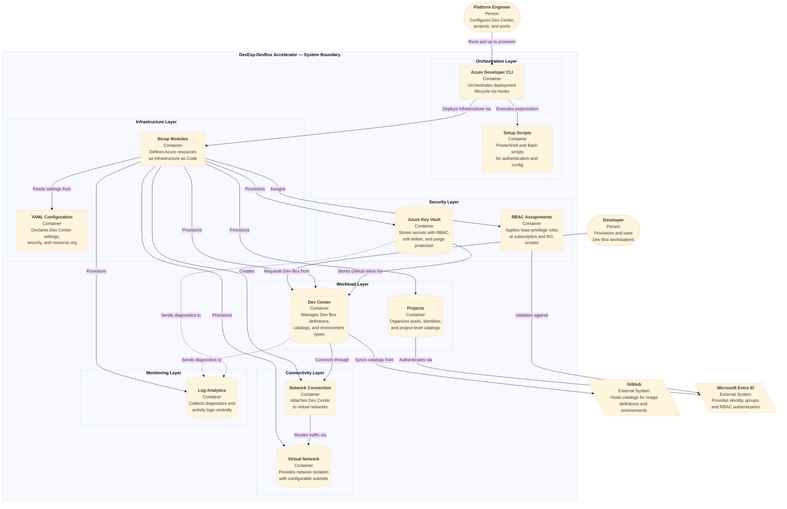

# DevExp-DevBox — Azure Dev Box Accelerator


> [!NOTE] Replace the badge URLs above with actual CI/CD pipeline endpoints once
> a build workflow is configured.

**DevExp-DevBox** is an Infrastructure as Code accelerator that automates the
provisioning, configuration, and management of **Microsoft Dev Box**
environments on Azure. It enables platform engineering teams to deliver
self-service, role-specific developer workstations at scale using a declarative,
configuration-driven approach.

Organizations adopting Dev Box face complexity in orchestrating Dev Centers,
projects, network connectivity, security, and RBAC at scale. This accelerator
eliminates that friction by providing a fully automated deployment pipeline
powered by **Azure Developer CLI** (`azd`), **Bicep** modules, and
**YAML**-based settings — reducing setup time from days to minutes.

The solution leverages **Bicep** for infrastructure definitions, **YAML** for
human-readable configuration, **PowerShell** and **Bash** scripts for
cross-platform automation, and **Azure Key Vault** for secure secrets management
— all orchestrated through the Azure Developer CLI lifecycle hooks.

## Table of Contents

- [Features](#features)
- [Architecture](#architecture)
- [Technologies Used](#technologies-used)
- [Quick Start](#quick-start)
- [Configuration](#configuration)
- [Deployment](#deployment)
- [Usage](#usage)
- [Contributing](#contributing)
- [License](#license)

## Features

| Feature                      | Description                                                                                                                      |
| ---------------------------- | -------------------------------------------------------------------------------------------------------------------------------- |
| 🏗️ Infrastructure as Code    | Deploys Dev Center, projects, pools, networking, and security using modular **Bicep** templates.                                 |
| 📝 YAML-Driven Configuration | Defines Dev Center settings, resource organization, and security through validated YAML files with JSON schemas.                 |
| 🔐 Secrets Management        | Integrates **Azure Key Vault** with RBAC authorization, soft-delete, and purge protection for secure credential storage.         |
| 🌐 Network Connectivity      | Supports both Managed and Unmanaged virtual networks with configurable subnets and Dev Center network connections.               |
| 👥 Role-Based Access Control | Assigns least-privilege RBAC roles at subscription, resource group, and project scopes using system-assigned managed identities. |
| 📊 Centralized Monitoring    | Provisions **Log Analytics** workspaces with diagnostic settings for all deployed resources.                                     |
| 🖥️ Multi-Project Support     | Configures multiple projects with independent pools, catalogs, environment types, and network settings.                          |
| 🔄 Environment Types         | Defines lifecycle stages (dev, staging, UAT) as deployment targets for applications.                                             |
| 🛠️ Cross-Platform Setup      | Provides automated setup scripts in both PowerShell and Bash with GitHub and Azure DevOps integration.                           |
| 📦 Catalog Integration       | Connects GitHub repositories as catalogs for Dev Box image definitions and environment definitions.                              |

## Architecture

The **DevExp-DevBox** accelerator follows Azure Landing Zone principles,
organizing resources into functional layers: workload (Dev Center and projects),
security (Key Vault), monitoring (Log Analytics), and connectivity (virtual
networks). The **Azure Developer CLI** orchestrates the deployment through
preprovision hooks that authenticate, configure, and provision all resources in
the correct dependency order.


```mermaid
---
config:
  theme: base
  flowchart:
    htmlLabels: true
  themeVariables:
    fontSize: 16px
---
flowchart TB
    %% C4 Container Diagram — DevExp-DevBox Accelerator

    %% PERSONS / ACTORS
    PlatformEngineer([<b>Platform Engineer</b><br>Person<br>Configures Dev Center,<br>projects, and pools])
    Developer([<b>Developer</b><br>Person<br>Provisions and uses<br>Dev Box workstations])

    %% EXTERNAL SYSTEMS
    GitHub[\<b>GitHub</b><br>External System<br>Hosts catalogs for image<br>definitions and environments\]
    AzureAD[\<b>Microsoft Entra ID</b><br>External System<br>Provides identity, groups,<br>and RBAC authentication\]

    %% SYSTEM BOUNDARY
    subgraph SystemBoundary [<b>DevExp-DevBox Accelerator — System Boundary</b>]
        direction TB

        %% ORCHESTRATION LAYER
        subgraph Orchestration [<b>Orchestration Layer</b>]
            direction LR
            AZD[<b>Azure Developer CLI</b><br>Container<br>Orchestrates deployment<br>lifecycle via hooks]
            SetupScripts[<b>Setup Scripts</b><br>Container<br>PowerShell and Bash scripts<br>for authentication and config]
        end

        %% INFRASTRUCTURE LAYER
        subgraph Infrastructure [<b>Infrastructure Layer</b>]
            direction LR
            BicepModules[<b>Bicep Modules</b><br>Container<br>Defines Azure resources<br>as Infrastructure as Code]
            YAMLConfig[<b>YAML Configuration</b><br>Container<br>Declares Dev Center settings,<br>security, and resource org]
        end

        %% WORKLOAD LAYER
        subgraph Workload [<b>Workload Layer</b>]
            direction LR
            DevCenter[(<b>Dev Center</b><br>Container<br>Manages Dev Box definitions,<br>catalogs, and environment types)]
            Projects[(<b>Projects</b><br>Container<br>Organizes pools, identities,<br>and project-level catalogs)]
        end

        %% SECURITY LAYER
        subgraph Security [<b>Security Layer</b>]
            direction LR
            KeyVault[(<b>Azure Key Vault</b><br>Container<br>Stores secrets with RBAC,<br>soft-delete, and purge protection)]
            RBAC(<b>RBAC Assignments</b><br>Container<br>Applies least-privilege roles<br>at subscription and RG scopes)
        end

        %% CONNECTIVITY LAYER
        subgraph Connectivity [<b>Connectivity Layer</b>]
            direction LR
            VNet[(<b>Virtual Network</b><br>Container<br>Provides network isolation<br>with configurable subnets)]
            NetworkConn(<b>Network Connection</b><br>Container<br>Attaches Dev Center<br>to virtual networks)
        end

        %% MONITORING LAYER
        subgraph Monitoring [<b>Monitoring Layer</b>]
            direction LR
            LogAnalytics[(<b>Log Analytics</b><br>Container<br>Collects diagnostics and<br>activity logs centrally)]
        end
    end

    %% RELATIONSHIPS
    PlatformEngineer -- "Runs azd up to provision" --> AZD
    Developer -- "Requests Dev Box from" --> DevCenter

    AZD -- "Executes preprovision" --> SetupScripts
    AZD -- "Deploys infrastructure via" --> BicepModules
    BicepModules -- "Reads settings from" --> YAMLConfig

    BicepModules -- "Provisions" --> DevCenter
    BicepModules -- "Provisions" --> Projects
    BicepModules -- "Provisions" --> KeyVault
    BicepModules -- "Assigns" --> RBAC
    BicepModules -- "Provisions" --> VNet
    BicepModules -- "Creates" --> NetworkConn
    BicepModules -- "Provisions" --> LogAnalytics

    DevCenter -- "Syncs catalogs from" --> GitHub
    Projects -- "Authenticates via" --> AzureAD
    RBAC -- "Validates against" --> AzureAD
    KeyVault -- "Stores GitHub token for" --> DevCenter
    DevCenter -- "Connects through" --> NetworkConn
    NetworkConn -- "Routes traffic via" --> VNet
    DevCenter -. "Sends diagnostics to" .-> LogAnalytics
    KeyVault -. "Sends diagnostics to" .-> LogAnalytics
```

## Technologies Used

| Technology                | Type                   | Purpose                                                           |
| ------------------------- | ---------------------- | ----------------------------------------------------------------- |
| Bicep                     | Infrastructure as Code | Defines and deploys Azure resources declaratively                 |
| Azure Developer CLI (azd) | CLI Tool               | Orchestrates environment provisioning and deployment lifecycle    |
| PowerShell                | Scripting Language     | Cross-platform setup automation on Windows                        |
| Bash                      | Scripting Language     | Cross-platform setup automation on Linux/macOS                    |
| YAML                      | Configuration Format   | Declares Dev Center, security, and resource organization settings |
| Azure Dev Center          | Azure Service          | Manages Dev Box definitions, catalogs, and projects               |
| Azure Key Vault           | Azure Service          | Secures secrets, keys, and certificates with RBAC authorization   |
| Azure Log Analytics       | Azure Service          | Provides centralized monitoring and diagnostics collection        |
| Azure Virtual Networks    | Azure Service          | Delivers network isolation and connectivity for Dev Boxes         |
| Azure RBAC                | Azure Service          | Enforces least-privilege access control across resources          |
| GitHub CLI (gh)           | CLI Tool               | Authenticates and retrieves tokens for GitHub integration         |
| JSON Schema               | Validation             | Validates YAML configuration files against defined schemas        |

## Quick Start

### Prerequisites

| Prerequisite                | Minimum Version | Purpose                                                                  |
| --------------------------- | --------------- | ------------------------------------------------------------------------ |
| Azure CLI (`az`)            | 2.50+           | Authenticates and manages Azure resources                                |
| Azure Developer CLI (`azd`) | 1.0+            | Orchestrates the deployment lifecycle                                    |
| GitHub CLI (`gh`)           | 2.0+            | Authenticates with GitHub for catalog access                             |
| `jq`                        | 1.6+            | Parses JSON responses in Bash scripts (Linux/macOS only)                 |
| Azure Subscription          | —               | Target subscription with Contributor and User Access Administrator roles |

> [!IMPORTANT] Ensure you have **Contributor** and **User Access Administrator**
> roles on the target Azure subscription before proceeding.

### Installation Steps

1. **Clone** the repository:

```bash
git clone https://github.com/Evilazaro/DevExp-DevBox.git
cd DevExp-DevBox
```

2. **Log in** to Azure and GitHub:

```bash
az login
azd auth login
gh auth login
```

3. **Initialize** the azd environment:

```bash
azd init -e <your-environment-name>
```

4. **Set** the required environment variables:

```bash
azd env set AZURE_LOCATION "eastus2"
azd env set KEY_VAULT_SECRET "$(gh auth token)"
azd env set SOURCE_CONTROL_PLATFORM "github"
```

5. **Deploy** all resources:

```bash
azd up
```

> [!TIP] The `azd up` command triggers the preprovision hooks defined in
> `azure.yaml`, which execute the setup scripts automatically before deploying
> infrastructure.

### Minimal Working Example

```bash
# Full deployment in one session
az login && azd auth login && gh auth login
azd init -e dev
azd env set AZURE_LOCATION "eastus2"
azd env set KEY_VAULT_SECRET "$(gh auth token)"
azd up
# Expected output: SUCCESS: Your application was provisioned in Azure
```

## Configuration

The accelerator uses three YAML configuration files located in
`infra/settings/`:

| Option                                 | File                                       | Default          | Description                                                    |
| -------------------------------------- | ------------------------------------------ | ---------------- | -------------------------------------------------------------- |
| `name`                                 | `workload/devcenter.yaml`                  | `devexp`         | Dev Center instance name                                       |
| `catalogItemSyncEnableStatus`          | `workload/devcenter.yaml`                  | `Enabled`        | Enables automatic catalog synchronization                      |
| `microsoftHostedNetworkEnableStatus`   | `workload/devcenter.yaml`                  | `Enabled`        | Enables Microsoft-hosted networking for Dev Boxes              |
| `installAzureMonitorAgentEnableStatus` | `workload/devcenter.yaml`                  | `Enabled`        | Installs Azure Monitor agent on Dev Boxes                      |
| `identity.type`                        | `workload/devcenter.yaml`                  | `SystemAssigned` | Managed identity type for the Dev Center                       |
| `keyVault.name`                        | `security/security.yaml`                   | `contoso`        | Globally unique Key Vault name                                 |
| `keyVault.enablePurgeProtection`       | `security/security.yaml`                   | `true`           | Prevents permanent deletion of secrets                         |
| `keyVault.softDeleteRetentionInDays`   | `security/security.yaml`                   | `7`              | Retention period for deleted secrets (7–90 days)               |
| `keyVault.enableRbacAuthorization`     | `security/security.yaml`                   | `true`           | Uses Azure RBAC for Key Vault access control                   |
| `workload.create`                      | `resourceOrganization/azureResources.yaml` | `true`           | Controls whether the workload resource group is created        |
| `security.create`                      | `resourceOrganization/azureResources.yaml` | `false`          | Controls whether a separate security resource group is created |

> [!WARNING] Change `keyVault.name` in `security/security.yaml` to a globally
> unique value before deployment. Azure Key Vault names must be unique across
> all of Azure.

### Example Override

Edit `infra/settings/workload/devcenter.yaml` to add a new project:

```yaml
projects:
  - name: 'myNewProject'
    description: 'My new team project'
    network:
      name: myNewProject
      create: true
      resourceGroupName: 'myNewProject-connectivity-RG'
      virtualNetworkType: Managed
      addressPrefixes:
        - 10.1.0.0/16
      subnets:
        - name: myNewProject-subnet
          properties:
            addressPrefix: 10.1.1.0/24
    identity:
      type: SystemAssigned
      roleAssignments:
        - azureADGroupId: '<your-azure-ad-group-id>'
          azureADGroupName: 'My Team'
          azureRBACRoles:
            - name: 'Dev Box User'
              id: '45d50f46-0b78-4001-a660-4198cbe8cd05'
              scope: Project
    pools:
      - name: 'developer'
        imageDefinitionName: 'my-dev-image'
        vmSku: general_i_16c64gb256ssd_v2
    environmentTypes:
      - name: 'dev'
        deploymentTargetId: ''
    catalogs:
      - name: 'devboxImages'
        type: imageDefinition
        sourceControl: gitHub
        visibility: private
        uri: 'https://github.com/your-org/your-repo.git'
        branch: 'main'
        path: '/.devcenter/imageDefinitions'
    tags:
      environment: 'dev'
      team: 'MyTeam'
```

## Deployment

Follow these steps to deploy the accelerator to a production or staging Azure
environment:

1. **Authenticate** with Azure and configure the target subscription:

```bash
az login
az account set --subscription "<subscription-id>"
azd auth login
```

2. **Initialize** the azd environment with your target environment name:

```bash
azd init -e prod
```

3. **Configure** deployment parameters:

```bash
azd env set AZURE_LOCATION "westeurope"
azd env set KEY_VAULT_SECRET "<your-github-personal-access-token>"
azd env set SOURCE_CONTROL_PLATFORM "github"
```

4. **Customize** the YAML settings files in `infra/settings/` to match your
   organization's requirements (Dev Center name, projects, pools, network
   ranges, RBAC groups).

5. **Provision** the infrastructure:

```bash
azd up
```

6. **Verify** the deployment by checking the Azure portal for the Dev Center
   resource and associated projects, pools, and network connections.

7. **Clean up** resources when decommissioning (use with caution):

```powershell
.\cleanSetUp.ps1 -EnvName "prod" -Location "westeurope"
```

> [!CAUTION] The `cleanSetUp.ps1` script permanently deletes all deployed
> resources, role assignments, service principals, and GitHub secrets. Run only
> when you intend to fully decommission the environment.

## Usage

### Provision a Dev Box Environment with GitHub Integration

```bash
# Set up a development environment named "dev" with GitHub as source control
./setUp.sh -e "dev" -s "github"

# Expected output:
# ✅ [2026-05-04 10:00:00] Azure CLI authenticated successfully
# ✅ [2026-05-04 10:00:01] GitHub CLI authenticated successfully
# ✅ [2026-05-04 10:00:02] Environment 'dev' initialized
```

### Provision with Azure DevOps Integration

```bash
# Set up using Azure DevOps as the source control platform
./setUp.sh -e "staging" -s "adogit"

# Expected output:
# ✅ [2026-05-04 10:00:00] Azure CLI authenticated successfully
# ✅ [2026-05-04 10:00:01] Azure DevOps authentication configured
# ✅ [2026-05-04 10:00:02] Environment 'staging' initialized
```

### Use the PowerShell Setup Script on Windows

```powershell
# Run setup with named parameters
.\setUp.ps1 -EnvName "prod" -SourceControl "github"

# Expected output:
# ✅ [2026-05-04 10:00:00] Azure CLI authenticated successfully
# ✅ [2026-05-04 10:00:01] GitHub CLI authenticated successfully
# ✅ [2026-05-04 10:00:02] Environment 'prod' initialized
```

### Deploy Using Azure Developer CLI Directly

```bash
# Full lifecycle deployment (provision + deploy)
azd up

# Provision infrastructure only
azd provision

# View deployed resources
azd show
```

## Contributing

Contributions are welcome and encouraged. To contribute to this project:

1. **Fork** the repository and create a feature branch from `main`.
2. **Make** your changes following the existing code style and conventions.
3. **Test** your changes by running `azd provision` in a development
   environment.
4. **Submit** a pull request with a clear description of the changes and their
   motivation.

> [!TIP] When adding new Bicep modules, include `@description` decorators on all
> parameters and outputs. Follow the existing pattern of loading settings from
> YAML files in `infra/settings/`.

For bug reports and feature requests, open an issue on the
[GitHub Issues](https://github.com/Evilazaro/DevExp-DevBox/issues) page with a
detailed description and reproduction steps.

## License

This project is licensed under the **MIT License**. See the [LICENSE](LICENSE)
file for full terms.
