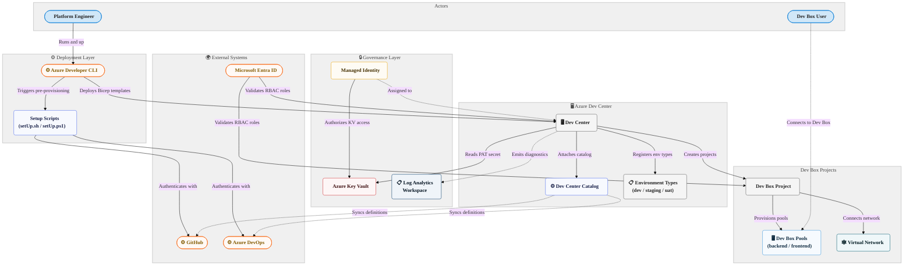

## Section 1 — Architecture Summary

The ContosoDevExp Dev Box Accelerator is an Infrastructure-as-Code platform that enables Platform Engineers and Dev Box Users to provision and manage Microsoft Dev Box cloud workstations on Azure. Platform Engineers invoke the system through the Azure Developer CLI (`azd`), which triggers cross-platform Setup Scripts (`setUp.sh` / `setUp.ps1`) that authenticate against GitHub or Azure DevOps before deploying Bicep templates. Those templates provision an Azure Dev Center as the central hub, which reads source-control Personal Access Tokens from Azure Key Vault via a Managed Identity and emits diagnostics to a Log Analytics Workspace. Within the Dev Center, a Dev Center Catalog synchronizes task definitions from GitHub or Azure DevOps; Environment Types (`dev`, `staging`, `uat`) are registered; and one or more Dev Box Projects are created — each with its own Virtual Network and role-specific Dev Box Pools (`backend-engineer`, `frontend-engineer`). Microsoft Entra ID enforces RBAC policies at both the Dev Center and Project scopes. Dev Box Users connect directly to their assigned Dev Box Pool to access their cloud workstation.

## Section 2 — High-Level Architecture Diagram

```mermaid
---
config:
  description: "High-level architecture of the ContosoDevExp Dev Box Accelerator — actors, primary flows, and major components."
  theme: base
  themeVariables:
    htmlLabels: true
    fontFamily: "-apple-system, BlinkMacSystemFont, \"Segoe UI\", system-ui, \"Apple Color Emoji\", \"Segoe UI Emoji\", sans-serif"
    fontSize: 16
---
flowchart TB

  %% ── Class Definitions ─────────────────────────────────────────────────────
  classDef actor        fill:#d0e7f8,stroke:#0078d4,color:#242424,font-weight:bold
  classDef service      fill:#f5f5f5,stroke:#616161,color:#242424,font-weight:bold
  classDef gateway      fill:#a6e9ed,stroke:#00b7c3,color:#001d1f,font-weight:bold
  classDef datastore    fill:#f1faf1,stroke:#107c10,color:#0e700e,font-weight:bold
  classDef external     fill:#fff9f5,stroke:#f7630c,color:#835b00,font-weight:bold
  classDef ai           fill:#f7f4fb,stroke:#5c2e91,color:#46236e,font-weight:bold
  classDef analytics    fill:#f0fafa,stroke:#038387,color:#012728,font-weight:bold
  classDef compute      fill:#f6fafe,stroke:#3a96dd,color:#112d42,font-weight:bold
  classDef containers   fill:#f2fafc,stroke:#0099bc,color:#002e38,font-weight:bold
  classDef devops       fill:#f7f9fe,stroke:#4f6bed,color:#182047,font-weight:bold
  classDef identity     fill:#fefbf4,stroke:#eaa300,color:#463100,font-weight:bold
  classDef integration  fill:#f2fcfd,stroke:#00b7c3,color:#00373a,font-weight:bold
  classDef iot          fill:#f9f8fc,stroke:#8764b8,color:#281e37,font-weight:bold
  classDef monitor      fill:#eff4f9,stroke:#003966,color:#00111f,font-weight:bold
  classDef networking   fill:#eff7f9,stroke:#005b70,color:#001b22,font-weight:bold
  classDef security     fill:#fdf6f6,stroke:#d13438,color:#3f1011,font-weight:bold
  classDef storage      fill:#f3fdf8,stroke:#00cc6a,color:#003d20,font-weight:bold
  classDef web          fill:#f3f9fd,stroke:#0078d4,color:#002440,font-weight:bold

  %% ── Actors ─────────────────────────────────────────────────────────────────
  subgraph ACTORS["👥 Actors"]
    PLATENG(["👤 Platform Engineer"])
    DEVUSER(["👤 Dev Box User"])
  end

  %% ── Deployment Layer ────────────────────────────────────────────────────────
  subgraph DEPLOY["⚙️ Deployment Layer"]
    AZD(["⚙️ Azure Developer CLI"])
    SCRIPTS("📜 Setup Scripts<br/>(setUp.sh / setUp.ps1)")
  end

  %% ── External Systems ────────────────────────────────────────────────────────
  subgraph EXT["🌍 External Systems"]
    GITHUB(["⚙️ GitHub"])
    ADO(["⚙️ Azure DevOps"])
    ENTRAID(["🔐 Microsoft Entra ID"])
  end

  %% ── Governance Layer ─────────────────────────────────────────────────────────
  subgraph GOVLAYER["🔒 Governance Layer"]
    KV("🔑 Azure Key Vault")
    MI("🪪 Managed Identity")
    LAW("📋 Log Analytics<br/>Workspace")
  end

  %% ── Dev Center Core ─────────────────────────────────────────────────────────
  subgraph DEVCENTER["🖥️ Azure Dev Center"]
    DC("🖥️ Dev Center")
    CATALOG("⚙️ Dev Center Catalog")
    ENVTYPE("📋 Environment Types<br/>(dev / staging / uat)")
  end

  %% ── Project Layer ───────────────────────────────────────────────────────────
  subgraph PROJECT_LAYER["📁 Dev Box Projects"]
    PROJECT("📁 Dev Box Project")
    POOL("🖥️ Dev Box Pools<br/>(backend / frontend)")
    VNET("🕸️ Virtual Network")
  end

  %% ── Primary Flows ───────────────────────────────────────────────────────────
  PLATENG   -- "Runs azd up"                --> AZD
  AZD       -- "Triggers pre-provisioning"  --> SCRIPTS
  SCRIPTS   -- "Authenticates with"         --> GITHUB
  SCRIPTS   -- "Authenticates with"         --> ADO
  AZD       -- "Deploys Bicep templates"    --> DC
  DC        -- "Reads PAT secret"           --> KV
  DC        -. "Emits diagnostics" .->       LAW
  DC        -- "Attaches catalog"           --> CATALOG
  CATALOG   -. "Syncs definitions" .->       GITHUB
  CATALOG   -. "Syncs definitions" .->       ADO
  DC        -- "Registers env types"        --> ENVTYPE
  DC        -- "Creates projects"           --> PROJECT
  PROJECT   -- "Provisions pools"           --> POOL
  PROJECT   -- "Connects network"           --> VNET
  MI        -- "Authorizes KV access"       --> KV
  MI        -. "Assigned to" .->             DC
  ENTRAID   -- "Validates RBAC roles"       --> DC
  ENTRAID   -- "Validates RBAC roles"       --> PROJECT
  DEVUSER   -. "Connects to Dev Box" .->     POOL

  %% ── Class Assignments ───────────────────────────────────────────────────────
  class PLATENG,DEVUSER actor
  class AZD,GITHUB,ADO,ENTRAID external
  class SCRIPTS devops
  class KV security
  class MI identity
  class LAW monitor
  class DC,ENVTYPE service
  class CATALOG devops
  class PROJECT service
  class POOL compute
  class VNET networking

  %% ── Subgraph Styles ─────────────────────────────────────────────────────────
  style ACTORS        fill:#f0f0f0,stroke:#d1d1d1,color:#424242,stroke-width:2px
  style DEPLOY        fill:#f0f0f0,stroke:#d1d1d1,color:#424242,stroke-width:2px
  style EXT           fill:#f0f0f0,stroke:#d1d1d1,color:#424242,stroke-width:2px
  style GOVLAYER      fill:#f0f0f0,stroke:#d1d1d1,color:#424242,stroke-width:2px
  style DEVCENTER     fill:#f0f0f0,stroke:#d1d1d1,color:#424242,stroke-width:2px
  style PROJECT_LAYER fill:#f0f0f0,stroke:#d1d1d1,color:#424242,stroke-width:2px
```

## Section 3 — Gate Results

| Gate                           | Result | Notes |
| ------------------------------ | ------ | ----- |
| Gate 0 — Architecture Intent   | PASSED | (a) Platform Engineer and Dev Box User identified from repository input. (b) Primary flow traces Platform Engineer → azd → DC → PROJECT → POOL to a concrete provisioned cloud workstation outcome. |
| Gate 1 — Constraint Compliance | PASSED | All 18 Positive Constraints satisfied. All 10 Negative Constraints satisfied. ADO emoji corrected to ⚙️ per quick-reference table (DevOps / Azure DevOps). |
| Gate 2 — Evaluation Criteria   | PASSED | All 8 criteria pass: actors present with labeled edges, goal traceable end-to-end, all major components represented, all edges carry descriptive labels, shapes encode semantics, colors accessible at 100% zoom, syntax valid, 16 nodes under the 50-node limit. |
| Gate 3 — Styling Compliance    | PASSED | `config` block contains non-empty `description` and `theme: base`. |
| Gate 4 — Emoji Consistency     | PASSED | All Azure-service nodes use emoji from the prompt's quick-reference table. GitHub and Azure DevOps → ⚙️; Entra ID → 🔐; Key Vault → 🔑; Managed Identity → 🪪; Log Analytics Workspace → 📋. No general-purpose emoji used where an Azure-specific match exists. |
| Gate 5 — Output Completeness   | PASSED | (a) Section 1 names all actors and all major components. (b) Section 2 contains exactly one fenced Mermaid code block. (c) Section 3 contains all six gate rows with real PASSED/FAILED results. (d) Response contains no content outside the three specified sections — no preamble, badges, table of contents, feature lists, or documentation. |
