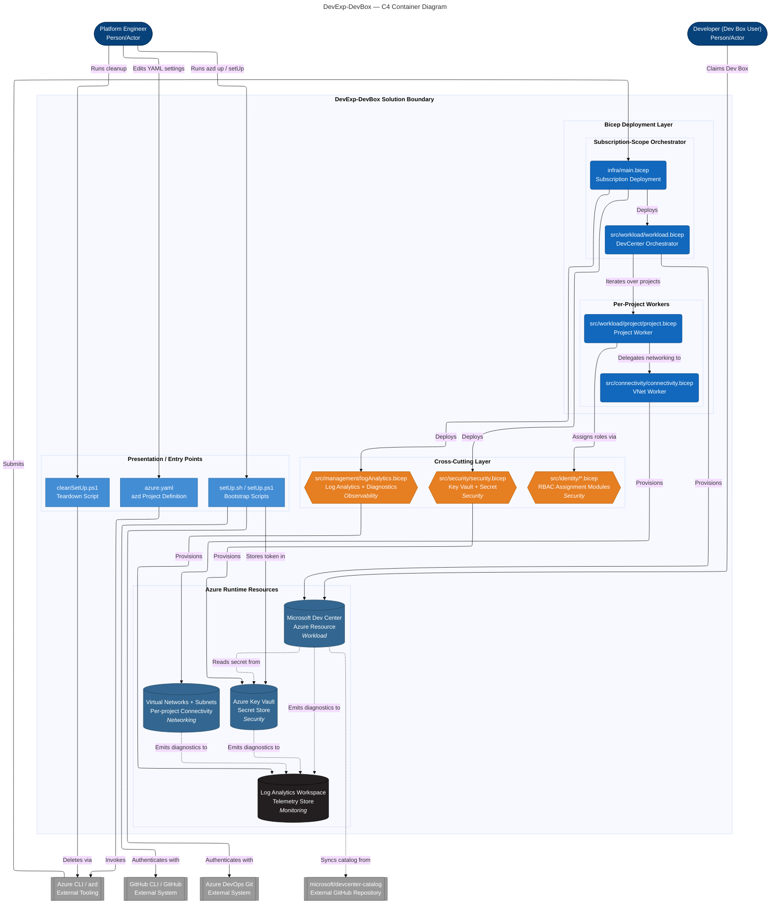

# DevExp-DevBox — Microsoft Dev Box Accelerator

[](https://example.com/replace-with-real-ci-url)
[](./LICENSE)
[](./package.json)
[](https://example.com/replace-with-real-coverage-url)

> [!NOTE] The **Build Status** and **Coverage** badges are shields.io
> placeholders because the repository does not declare a CI/CD pipeline or a
> coverage report under `${workspaceFolder}` (source: `.github/`, `azure.yaml`).
> **Replace** the placeholder URLs once a pipeline is wired up.

## Description

**DevExp-DevBox provisions a production-ready Microsoft Dev Box platform on
Azure — Dev Center, projects, pools, networking, secrets, and observability —
through a single `azd up` invocation driven by declarative YAML and modular
Bicep** (source: `azure.yaml`, `infra/main.bicep`,
`infra/settings/workload/devcenter.yaml`). The accelerator follows Azure Landing
Zone principles and segregates workload, security, and monitoring resources into
independently toggleable resource groups (source:
`infra/settings/resourceOrganization/azureResources.yaml`).

The repository solves the operational toil of standing up Microsoft Dev Box for
an engineering organization. **Manual portal clicking, ad-hoc role assignments,
and hand-written networking are replaced with declarative YAML files, reusable
Bicep modules, and idempotent setup scripts** (source: `setUp.ps1`, `setUp.sh`,
`src/`). The pre-provision hook bootstraps GitHub or Azure DevOps
authentication, stores the resulting token in Key Vault, and seeds the Dev
Center catalog (source: `azure.yaml`, `setUp.sh`).

**The stack is built on Bicep, the Azure Developer CLI (`azd`), YAML
configuration files, and cross-platform PowerShell and Bash scripts.** Microsoft
Dev Center, Azure Key Vault, Azure Log Analytics, and Azure Virtual Network are
the primary Azure services touched (source: `infra/main.bicep`,
`src/security/keyVault.bicep`, `src/management/logAnalytics.bicep`,
`src/connectivity/vnet.bicep`).

## Table of Contents

- [Features](#features)
- [Architecture](#architecture)
- [Technologies Used](#technologies-used)
- [Quick Start](#quick-start)
- [Configuration](#configuration)
- [Deployment](#deployment)
- [Usage](#usage)
- [Contributing](#contributing)
- [License](#license)

## Features

| Feature                           | Description                                                                                                                                                                                                                                                                   |
| --------------------------------- | ----------------------------------------------------------------------------------------------------------------------------------------------------------------------------------------------------------------------------------------------------------------------------- | -------------------------------------------------------------------------------------------------------- |
| 🚀 One-command provisioning       | **`azd up` deploys the full Dev Center, projects, pools, and supporting services** at subscription scope (source: `azure.yaml`, `infra/main.bicep`).                                                                                                                          |
| 🧩 Modular Bicep                  | **Bicep is split into `connectivity/`, `identity/`, `management/`, `security/`, and `workload/` modules** so consumers can disable a landing zone without forking (source: `src/`).                                                                                           |
| 📝 YAML-driven configuration      | **Dev Center, projects, pools, environment types, catalogs, security, and resource organization are declared in human-readable YAML with JSON schemas** for validation (source: `infra/settings/**`).                                                                         |
| 🏗️ Landing-zone segregation       | \*\*Workload, security, and monitoring resource groups are independently toggleable via `create: true                                                                                                                                                                         | false`flags** in`azureResources.yaml`(source:`infra/settings/resourceOrganization/azureResources.yaml`). |
| 🔐 Key Vault secret integration   | **The pre-provision hook stores a GitHub/ADO token in Azure Key Vault** with purge protection, soft delete, and RBAC authorization enabled (source: `infra/settings/security/security.yaml`, `src/security/keyVault.bicep`).                                                  |
| 📊 Log Analytics + diagnostics    | **A Log Analytics workspace plus `AzureActivity` solution and diagnostic settings are wired into every module** (source: `src/management/logAnalytics.bicep`).                                                                                                                |
| 👥 Role-based access control      | **Dev Center, project, and resource-group role assignments are templated via dedicated identity modules** (source: `src/identity/devCenterRoleAssignment.bicep`, `src/identity/projectIdentityRoleAssignment.bicep`, `src/identity/orgRoleAssignment.bicep`).                 |
| 🌐 Managed VNet connectivity      | **Per-project virtual networks, subnets, and Dev Center network connections are generated from declarative `network` blocks** in `devcenter.yaml` (source: `src/connectivity/connectivity.bicep`, `src/connectivity/vnet.bicep`, `src/connectivity/networkConnection.bicep`). |
| 💼 Project-specific Dev Box pools | **Each project declares one or more pools that map an image definition to a VM SKU** (source: `infra/settings/workload/devcenter.yaml`, `src/workload/project/projectPool.bicep`).                                                                                            |
| 🧹 Idempotent cleanup             | **`cleanSetUp.ps1` orchestrates subscription-deployment, role-assignment, credential, and GitHub-secret deletion** to revert the environment (source: `cleanSetUp.ps1`).                                                                                                      |
| 🔁 Cross-platform setup           | **Bash (`setUp.sh`) and PowerShell (`setUp.ps1`) scripts are kept in sync** so Linux, macOS, and Windows engineers share the same workflow (source: `setUp.sh`, `setUp.ps1`, `azure.yaml`).                                                                                   |
| 🔌 Source-control choice          | **GitHub and Azure DevOps Git (`adogit`) are both supported** via the `SOURCE_CONTROL_PLATFORM` environment variable (source: `setUp.sh`, `setUp.ps1`, `azure.yaml`).                                                                                                         |

## Architecture

The solution is a **layered, modular Bicep deployment targeting a subscription
scope**, with three logical landing zones — Workload (Dev Center), Security (Key
Vault), and Monitoring (Log Analytics) — wired into a Dev Center that owns
projects, pools, catalogs, environment types, and VNet attachments (source:
`infra/main.bicep`, `infra/settings/resourceOrganization/azureResources.yaml`,
`src/workload/workload.bicep`). **The `azd` CLI orchestrates the deployment and
runs a pre-provision hook that authenticates with GitHub or Azure DevOps and
stores the access token in Key Vault** before the Bicep deployment reads the
secret identifier downstream (source: `azure.yaml`, `setUp.sh`,
`src/security/security.bicep`).


```mermaid
---
title: DevExp-DevBox — C4 Container Diagram
config:
  theme: base
  layout: elk
  flowchart:
    htmlLabels: true
    rankSpacing: 60
    nodeSpacing: 40
  themeVariables:
    fontSize: 16px
---
flowchart TB
    accTitle: DevExp-DevBox C4 Container Diagram
    accDescr: Subscription-scope Bicep deployment provisioning Microsoft Dev Center, projects, pools, networking, Key Vault, and Log Analytics, orchestrated by azd and driven by YAML configuration files.

    %% Persons / actors
    platformEngineer(["Platform Engineer<br/>Person/Actor"]):::person
    devBoxUser(["Developer (Dev Box User)<br/>Person/Actor"]):::person

    %% External systems
    azCli[["Azure CLI / azd<br/>External Tooling"]]:::external
    ghCli[["GitHub CLI / GitHub<br/>External System"]]:::external
    adoGit[["Azure DevOps Git<br/>External System"]]:::external
    catalogRepo[["microsoft/devcenter-catalog<br/>External GitHub Repository"]]:::external

    subgraph systemBoundary["<b>DevExp-DevBox Solution Boundary</b>"]
      direction TB

      subgraph presentation["<b>Presentation / Entry Points</b>"]
        direction TB
        azureYaml["azure.yaml<br/>azd Project Definition"]:::clientSide
        setupScripts["setUp.sh / setUp.ps1<br/>Bootstrap Scripts"]:::clientSide
        cleanupScript["cleanSetUp.ps1<br/>Teardown Script"]:::clientSide
      end

      subgraph application["<b>Bicep Deployment Layer</b>"]
        direction TB

        subgraph syncServices["<b>Subscription-Scope Orchestrator</b>"]
          direction TB
          mainBicep("infra/main.bicep<br/>Subscription Deployment"):::serverSide
          workloadModule("src/workload/workload.bicep<br/>DevCenter Orchestrator"):::serverSide
        end

        subgraph asyncWorkers["<b>Per-Project Workers</b>"]
          direction TB
          projectModule("src/workload/project/project.bicep<br/>Project Worker"):::serverSide
          connectivityModule("src/connectivity/connectivity.bicep<br/>VNet Worker"):::serverSide
        end
      end

      subgraph crossCutting["<b>Cross-Cutting Layer</b>"]
        direction TB
        identityModule{{"src/identity/*.bicep<br/>RBAC Assignment Modules<br/><i>Security</i>"}}:::crossCutting
        logAnalytics{{"src/management/logAnalytics.bicep<br/>Log Analytics + Diagnostics<br/><i>Observability</i>"}}:::crossCutting
        keyVaultModule{{"src/security/security.bicep<br/>Key Vault + Secret<br/><i>Security</i>"}}:::crossCutting
      end

      subgraph dataLayer["<b>Azure Runtime Resources</b>"]
        direction TB
        devCenter[("Microsoft Dev Center<br/>Azure Resource<br/><i>Workload</i>")]:::dataOperational
        keyVault[("Azure Key Vault<br/>Secret Store<br/><i>Security</i>")]:::dataOperational
        logWorkspace[("Log Analytics Workspace<br/>Telemetry Store<br/><i>Monitoring</i>")]:::dataQueue
        vnet[("Virtual Networks + Subnets<br/>Per-project Connectivity<br/><i>Networking</i>")]:::dataOperational
      end
    end

    %% Relationships
    platformEngineer -->|"Runs azd up / setUp"| setupScripts
    platformEngineer -->|"Edits YAML settings"| azureYaml
    platformEngineer -->|"Runs cleanup"| cleanupScript
    devBoxUser -->|"Claims Dev Box"| devCenter
    setupScripts -->|"Authenticates with"| ghCli
    setupScripts -->|"Authenticates with"| adoGit
    setupScripts -->|"Stores token in"| keyVault
    azureYaml -->|"Invokes"| azCli
    azCli -->|"Submits"| mainBicep
    mainBicep -->|"Deploys"| keyVaultModule
    mainBicep -->|"Deploys"| logAnalytics
    mainBicep -->|"Deploys"| workloadModule
    workloadModule -->|"Provisions"| devCenter
    workloadModule -->|"Iterates over projects"| projectModule
    projectModule -->|"Delegates networking to"| connectivityModule
    projectModule -->|"Assigns roles via"| identityModule
    connectivityModule -->|"Provisions"| vnet
    keyVaultModule -->|"Provisions"| keyVault
    logAnalytics -->|"Provisions"| logWorkspace
    devCenter -.->|"Syncs catalog from"| catalogRepo
    devCenter -.->|"Reads secret from"| keyVault
    devCenter -.->|"Emits diagnostics to"| logWorkspace
    vnet -.->|"Emits diagnostics to"| logWorkspace
    keyVault -.->|"Emits diagnostics to"| logWorkspace
    cleanupScript -->|"Deletes via"| azCli

    %% Reusable styles
    classDef person fill:#08427b,stroke:#052e57,color:#ffffff
    classDef external fill:#999999,stroke:#666666,color:#ffffff
    classDef clientSide fill:#438dd5,stroke:#2e6a9b,color:#ffffff
    classDef serverSide fill:#1168bd,stroke:#0b4884,color:#ffffff
    classDef crossCutting fill:#e67e22,stroke:#b35900,color:#ffffff
    classDef dataOperational fill:#336791,stroke:#1f3f57,color:#ffffff
    classDef dataQueue fill:#231F20,stroke:#000000,color:#ffffff
```

## Technologies Used

| Technology                    | Type                       | Purpose                                                                                                                                                                |
| ----------------------------- | -------------------------- | ---------------------------------------------------------------------------------------------------------------------------------------------------------------------- |
| Bicep                         | Infrastructure-as-Code DSL | Declarative ARM template authoring for every Azure resource in `infra/` and `src/` (source: `infra/main.bicep`, `src/**/*.bicep`).                                     |
| Azure Developer CLI (`azd`)   | Deployment orchestrator    | Runs the pre-provision hook and submits the subscription-scope deployment (source: `azure.yaml`).                                                                      |
| Azure CLI (`az`)              | CLI tooling                | Invoked by setup and cleanup scripts for deployments, role assignments, and resource-group deletion (source: `setUp.sh`, `setUp.ps1`, `cleanSetUp.ps1`).               |
| GitHub CLI (`gh`)             | CLI tooling                | Authenticates the user and writes the GitHub Actions secret used by the accelerator (source: `setUp.sh`, `setUp.ps1`).                                                 |
| `jq`                          | JSON processor             | Parses Azure CLI output inside `setUp.sh` (source: `setUp.sh` requirements block).                                                                                     |
| PowerShell 5.1+               | Scripting runtime          | Powers `setUp.ps1` and `cleanSetUp.ps1` for Windows engineers (source: `setUp.ps1`, `cleanSetUp.ps1`).                                                                 |
| Bash                          | Scripting runtime          | Powers `setUp.sh` for Linux/macOS engineers (source: `setUp.sh`).                                                                                                      |
| YAML                          | Declarative configuration  | Drives Dev Center, project, pool, network, security, and resource-organization settings (source: `infra/settings/**`).                                                 |
| JSON Schema                   | Configuration validation   | `*.schema.json` files validate each YAML configuration file (source: `infra/settings/**/azureResources.schema.json`, `devcenter.schema.json`, `security.schema.json`). |
| Microsoft Dev Center          | Azure service (workload)   | Hosts the projects, pools, catalogs, and environment types provisioned by the accelerator (source: `src/workload/core/devCenter.bicep`).                               |
| Azure Key Vault               | Azure service (security)   | Stores the source-control access token consumed by Dev Center catalogs (source: `src/security/keyVault.bicep`, `src/security/secret.bicep`).                           |
| Azure Log Analytics           | Azure service (monitoring) | Central telemetry sink with `allLogs` diagnostic settings on each resource (source: `src/management/logAnalytics.bicep`).                                              |
| Azure Virtual Network         | Azure service (networking) | Per-project VNets, subnets, and Dev Center network connections (source: `src/connectivity/vnet.bicep`, `src/connectivity/networkConnection.bicep`).                    |
| `microsoft/devcenter-catalog` | External GitHub catalog    | Public catalog of customization tasks consumed by Dev Center (source: `infra/settings/workload/devcenter.yaml`).                                                       |

> [!NOTE] The top-level `package.json` declares a Hugo / Docsy theme example
> site (`name: "docsy-example-site"`) and is **not** wired into the Bicep
> accelerator deployment path (source: `package.json`, `azure.yaml`). **Treat**
> that file as an unrelated documentation-site scaffold rather than a runtime
> dependency of this accelerator.

## Quick Start

### Prerequisites

| Tool                        | Minimum version              | Purpose                                                                                                                                                                                        |
| --------------------------- | ---------------------------- | ---------------------------------------------------------------------------------------------------------------------------------------------------------------------------------------------- |
| Azure subscription          | Owner / Contributor + UAA    | Subscription-scope deployment requires elevated rights (source: `infra/main.bicep` `targetScope = 'subscription'`, `infra/settings/workload/devcenter.yaml` `User Access Administrator` role). |
| Azure CLI (`az`)            | Current GA                   | Authentication, deployment listing, cleanup (source: `setUp.sh`, `setUp.ps1`, `cleanSetUp.ps1`).                                                                                               |
| Azure Developer CLI (`azd`) | Current GA                   | Orchestrates `azure.yaml` hooks and deployment (source: `azure.yaml`).                                                                                                                         |
| GitHub CLI (`gh`)           | Current GA (if using GitHub) | Authentication + secret upload (source: `setUp.sh` requirements block).                                                                                                                        |
| `jq`                        | Current GA (Linux/macOS)     | JSON parsing inside `setUp.sh` (source: `setUp.sh` requirements block).                                                                                                                        |
| PowerShell                  | 5.1+ (Windows)               | Required by `setUp.ps1` and `cleanSetUp.ps1` (source: `setUp.ps1`, `cleanSetUp.ps1` `#Requires -Version 5.1`).                                                                                 |
| Bash                        | 4+ (Linux/macOS)             | Required by `setUp.sh` (source: `setUp.sh` shebang and `set -euo pipefail`).                                                                                                                   |

### Installation Steps

1. **Clone** the repository and `cd` into it:

   ```bash
   git clone https://github.com/Evilazaro/DevExp-DevBox.git
   cd DevExp-DevBox
   ```

2. **Sign in** to Azure with `az` and `azd`:

   ```bash
   az login
   azd auth login
   ```

3. **Initialize** an `azd` environment (the name becomes `AZURE_ENV_NAME`
   consumed by `infra/main.parameters.json`):

   ```bash
   azd env new dev
   azd env set AZURE_LOCATION eastus2
   azd env set SOURCE_CONTROL_PLATFORM github
   ```

4. **Provision** every resource with a single command:

   ```bash
   azd up
   ```

   > [!TIP] `azd up` runs the `preprovision` hook from `azure.yaml`, which
   > invokes `setUp.sh` (Linux/macOS) or `setUp.ps1` (Windows) to authenticate
   > with GitHub or Azure DevOps and seed the Key Vault secret before the Bicep
   > deployment begins (source: `azure.yaml`).

5. **Verify** the deployment by listing Dev Center projects (the expected output
   includes the `eShop` project declared in `devcenter.yaml`):

   ```bash
   # Verify step — expected output: a JSON array containing at least { "name": "eShop" }
   az devcenter admin project list \
     --query "[?contains(devCenterId, '$(azd env get-values | grep AZURE_DEV_CENTER_NAME | cut -d'=' -f2 | tr -d '\"')')].{name:name, location:location}" \
     --output table
   ```

   > [!IMPORTANT] If the verify step returns an empty list, **rerun**
   > `azd provision` after confirming `AZURE_ENV_NAME`, `AZURE_LOCATION`, and
   > `SOURCE_CONTROL_PLATFORM` are set (source: `azure.yaml`,
   > `infra/main.parameters.json`).

## Configuration

The repository is classified as **`runtime`** configuration — a mix of
environment variables consumed by `azd`/`setUp.sh` and declarative YAML files
consumed by Bicep `loadYamlContent()` calls (source: `infra/main.bicep`,
`infra/main.parameters.json`, `src/workload/workload.bicep`).

| Option                                                    | Default    | Description                                                                                                                                                                               |
| --------------------------------------------------------- | ---------- | ----------------------------------------------------------------------------------------------------------------------------------------------------------------------------------------- | -------------------------------------------------- |
| `AZURE_ENV_NAME` (env var)                                | _required_ | Bound to the `environmentName` parameter of `infra/main.bicep`; controls resource-group naming suffix `${env}-${location}-RG` (source: `infra/main.parameters.json`, `infra/main.bicep`). |
| `AZURE_LOCATION` (env var)                                | _required_ | Bound to the `location` parameter; restricted to the allowed regions list (source: `infra/main.parameters.json`, `infra/main.bicep`).                                                     |
| `KEY_VAULT_SECRET` (env var)                              | _required_ | Bound to the `secretValue` parameter; the GitHub/ADO token stored in Key Vault under `gha-token` (source: `infra/main.parameters.json`, `infra/settings/security/security.yaml`).         |
| `SOURCE_CONTROL_PLATFORM` (env var)                       | `github`   | Selects the source-control bootstrap path; valid values are `github` or `adogit` (source: `azure.yaml`, `setUp.ps1`, `setUp.sh`).                                                         |
| `infra/settings/resourceOrganization/azureResources.yaml` | _n/a_      | **Toggles** `workload`, `security`, and `monitoring` landing zones via `create: true                                                                                                      | false` and applies governance tags (source: file). |
| `infra/settings/security/security.yaml`                   | _n/a_      | **Declares** Key Vault name, secret name, purge protection, soft delete, RBAC authorization, and tags (source: file).                                                                     |
| `infra/settings/workload/devcenter.yaml`                  | _n/a_      | **Declares** Dev Center identity, role assignments, catalogs, environment types, projects, pools, networks, and tags (source: file).                                                      |
| `*.schema.json`                                           | _n/a_      | Author-time validation schemas applied to the corresponding YAML files (source: `infra/settings/**/azureResources.schema.json`, `devcenter.schema.json`, `security.schema.json`).         |

### Example Override Snippet

```yaml
# infra/settings/resourceOrganization/azureResources.yaml — override to deploy
# every landing zone into its own resource group instead of consolidating them.
workload:
  create: true
  name: devexp-workload
security:
  create: true
  name: devexp-security
monitoring:
  create: true
  name: devexp-monitoring
```

## Deployment

1. **Plan** the deployment by setting environment values in the active `azd`
   environment:

   ```bash
   azd env set AZURE_ENV_NAME prod
   azd env set AZURE_LOCATION eastus2
   azd env set SOURCE_CONTROL_PLATFORM github
   azd env set KEY_VAULT_SECRET "$(gh auth token)"
   ```

2. **Provision** infrastructure (runs the `preprovision` hook +
   `infra/main.bicep`):

   ```bash
   azd up
   ```

3. **Confirm** the outputs declared by `infra/main.bicep` —
   `AZURE_DEV_CENTER_NAME`, `AZURE_DEV_CENTER_PROJECTS`, `AZURE_KEY_VAULT_NAME`,
   `AZURE_KEY_VAULT_ENDPOINT`, `AZURE_LOG_ANALYTICS_WORKSPACE_NAME` — appear in
   the `azd` output stream (source: `infra/main.bicep`).

4. **Promote** to additional environments by repeating Steps 1–3 with a new
   `AZURE_ENV_NAME` value; the resource-group suffix `${env}-${location}-RG`
   keeps environments isolated (source: `infra/main.bicep`).

5. **Tear down** when finished:

   ```powershell
   ./cleanSetUp.ps1 -EnvName prod -Location eastus2
   ```

   > [!WARNING] `cleanSetUp.ps1` deletes subscription deployments, role
   > assignments, the Azure AD application, the GitHub `AZURE_CREDENTIALS`
   > secret, and the resource groups (source: `cleanSetUp.ps1`). **Do not** run
   > it against an environment you intend to keep.

## Usage

### Onboard a new project

**Append** a project block to `infra/settings/workload/devcenter.yaml` and rerun
`azd provision`:

```yaml
projects:
  - name: 'eShop'
    description: 'eShop project.'
    # ... existing eShop config ...
  - name: 'platformAPI'
    description: 'Platform API team Dev Box project.'
    network:
      name: platformAPI
      create: true
      resourceGroupName: 'platformAPI-connectivity-RG'
      virtualNetworkType: Managed
      addressPrefixes:
        - 10.1.0.0/16
      subnets:
        - name: platformAPI-subnet
          properties:
            addressPrefix: 10.1.1.0/24
      tags:
        environment: dev
    identity:
      type: SystemAssigned
      roleAssignments: []
    pools:
      - name: 'api-engineer'
        imageDefinitionName: 'platformapi-dev'
        vmSku: general_i_16c64gb256ssd_v2
    environmentTypes:
      - name: 'dev'
        deploymentTargetId: ''
    catalogs: []
    tags:
      project: 'platformAPI'
```

```bash
# Apply the change.
azd provision
# Expected: the project list now contains both "eShop" and "platformAPI".
```

### Toggle a landing zone off

**Set** `create: false` on the `security` or `monitoring` block in
`azureResources.yaml`; Bicep reroutes those resources into the workload resource
group via the `securityRgName` / `monitoringRgName` selectors in
`infra/main.bicep`:

```yaml
# infra/settings/resourceOrganization/azureResources.yaml
security:
  create: false
  name: devexp-workload
monitoring:
  create: false
  name: devexp-workload
```

```bash
azd provision
# Expected: only the workload resource group is created; Key Vault and Log
# Analytics are deployed inside it.
```

### Rotate the Key Vault secret

```bash
azd env set KEY_VAULT_SECRET "$(gh auth token)"
azd provision
# Expected: the `gha-token` secret in Key Vault is updated to the new value.
```

## Contributing

Issues and pull requests are welcome.

1. **Fork** the repository at
   [`Evilazaro/DevExp-DevBox`](https://github.com/Evilazaro/DevExp-DevBox).
2. **Create** a feature branch (`git checkout -b feature/<short-description>`).
3. **Run** `azd provision` against a disposable environment to validate Bicep
   changes end-to-end.
4. **Open** a pull request describing the change, the validation environment,
   and any updated YAML schemas.

> [!NOTE] A `CONTRIBUTING.md` and `CODE-OF-CONDUCT.md` are not present in the
> workspace (source: workspace root listing). **Submit** issues and pull
> requests through the GitHub repository UI in the meantime.

## License

This project is distributed under the **MIT License**. See the
[`LICENSE`](./LICENSE) file for the full text (source: `LICENSE`).
