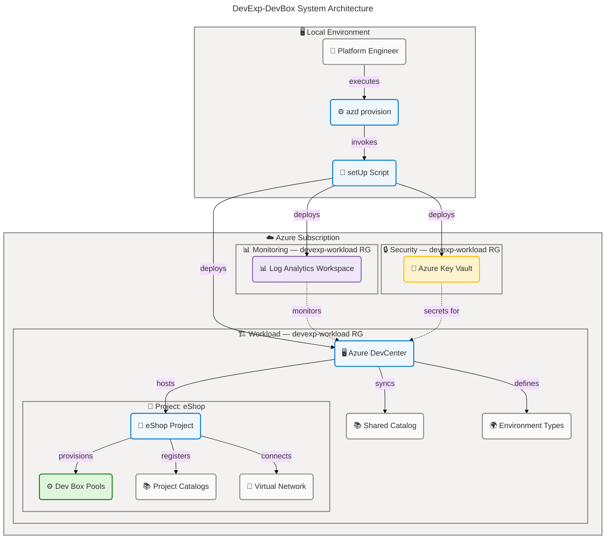

# DevExp-DevBox

[](https://opensource.org/licenses/MIT)
[](https://learn.microsoft.com/en-us/azure/dev-box/)
[](https://learn.microsoft.com/en-us/azure/developer/azure-developer-cli/)
[](https://learn.microsoft.com/en-us/azure/azure-resource-manager/bicep/)
[](https://github.com/Evilazaro/DevExp-DevBox)

A production-grade **Microsoft Dev Box Accelerator** that provisions
cloud-hosted, role-optimized developer workstations on Azure — driven by
configuration-as-code YAML and deployed via the Azure Developer CLI
(`azd provision`).

## Overview

**Overview**

Platform engineering teams face mounting pressure to onboard developers quickly
while enforcing security, governance, and consistent tooling across multiple
teams and projects. DevExp-DevBox delivers an opinionated, policy-compliant
Azure Dev Box deployment accelerator that eliminates manual portal configuration
and applies **Azure Landing Zone principles**, **least-privilege RBAC**, and
**full observability** from day one.

Deploying DevExp-DevBox provisions an Azure DevCenter with role-specific Dev Box
pools, catalog-backed image and task definitions sourced from GitHub or Azure
DevOps, **Azure Key Vault** for secure token management, **Log Analytics** for
diagnostics, and optional virtual network connectivity — all orchestrated
through the Azure Developer CLI (`azd`) and declarative YAML configuration
files.

## Table of Contents

- [Architecture](#architecture)
- [Features](#features)
- [Requirements](#requirements)
- [Getting Started](#getting-started)
- [Configuration](#configuration)
- [Contributing](#contributing)
- [License](#license)

## Architecture

The accelerator follows a layered Infrastructure as Code architecture: a
platform engineer runs `azd provision`, which triggers the `preprovision` hook
in `azure.yaml` (running `setUp.sh` on Linux/macOS or `setUp.ps1` on Windows to
validate tools, authenticate, and write secrets), then deploys Bicep modules at
subscription scope to create resource groups, security services, monitoring
infrastructure, and the Azure DevCenter with its projects.


```mermaid
---
title: "DevExp-DevBox System Architecture"
config:
  theme: base
  look: classic
  layout: dagre
  flowchart:
    htmlLabels: true
  themeVariables:
    fontSize: '16px'
---
flowchart TB
    accTitle: DevExp-DevBox System Architecture
    accDescr: Deployment workflow from platform engineer to Azure DevCenter, with Key Vault, Log Analytics, Dev Box pools, and virtual network connectivity

    %% ═══════════════════════════════════════════════════════════════════════════
    %% AZURE / FLUENT ARCHITECTURE PATTERN v1.1
    %% (Semantic + Structural + Font + Accessibility Governance)
    %% ═══════════════════════════════════════════════════════════════════════════
    %% PHASE 1 - FLUENT UI: All styling uses approved Fluent UI palette only
    %% PHASE 2 - GROUPS: Every subgraph has semantic color via style directive
    %% PHASE 3 - COMPONENTS: Every node has semantic classDef + icon prefix
    %% PHASE 4 - ACCESSIBILITY: accTitle/accDescr present, WCAG AA contrast
    %% PHASE 5 - STANDARD: Governance block present, classDefs centralized
    %% ═══════════════════════════════════════════════════════════════════════════

    subgraph devEnv["🖥️ Local Environment"]
        dev("👤 Platform Engineer"):::neutral
        azdUp("⚙️ azd provision"):::core
        setScript("📜 setUp Script"):::core
    end

    subgraph azureSub["☁️ Azure Subscription"]
        subgraph monitoringLayer["📊 Monitoring — devexp-workload RG"]
            la("📊 Log Analytics Workspace"):::data
        end
        subgraph securityLayer["🔒 Security — devexp-workload RG"]
            kv("🔑 Azure Key Vault"):::warning
        end
        subgraph workloadLayer["🏗️ Workload — devexp-workload RG"]
            dc("🖥️ Azure DevCenter"):::core
            catalog("📚 Shared Catalog"):::neutral
            envTypes("🌍 Environment Types"):::neutral
            subgraph eShopProject["📁 Project: eShop"]
                proj("📁 eShop Project"):::core
                pools("⚙️ Dev Box Pools"):::success
                projCatalog("📚 Project Catalogs"):::neutral
                vnet("🔌 Virtual Network"):::neutral
            end
        end
    end

    dev -->|"executes"| azdUp
    azdUp -->|"invokes"| setScript
    setScript -->|"deploys"| la
    setScript -->|"deploys"| kv
    setScript -->|"deploys"| dc
    dc -->|"syncs"| catalog
    dc -->|"defines"| envTypes
    dc -->|"hosts"| proj
    proj -->|"provisions"| pools
    proj -->|"registers"| projCatalog
    proj -->|"connects"| vnet
    la -.->|"monitors"| dc
    kv -.->|"secrets for"| dc

    style devEnv fill:#F3F2F1,stroke:#8A8886,stroke-width:2px,color:#323130
    style azureSub fill:#F3F2F1,stroke:#8A8886,stroke-width:2px,color:#323130
    style monitoringLayer fill:#F3F2F1,stroke:#8A8886,stroke-width:2px,color:#323130
    style securityLayer fill:#F3F2F1,stroke:#8A8886,stroke-width:2px,color:#323130
    style workloadLayer fill:#F3F2F1,stroke:#8A8886,stroke-width:2px,color:#323130
    style eShopProject fill:#F3F2F1,stroke:#8A8886,stroke-width:2px,color:#323130

    %% Centralized semantic classDefs (Phase 5 compliant)
    classDef neutral fill:#FAFAFA,stroke:#8A8886,stroke-width:2px,color:#323130
    classDef core fill:#EFF6FC,stroke:#0078D4,stroke-width:2px,color:#323130
    classDef success fill:#DFF6DD,stroke:#107C10,stroke-width:2px,color:#323130
    classDef warning fill:#FFF4CE,stroke:#FFB900,stroke-width:2px,color:#323130
    classDef data fill:#F0E6FA,stroke:#8764B8,stroke-width:2px,color:#323130
```

**Component Roles:**

| Component            | Role                                                                      | Source File                               |
| -------------------- | ------------------------------------------------------------------------- | ----------------------------------------- |
| 🖥️ Azure DevCenter   | Central hub managing Dev Box definitions, catalogs, and environment types | `src/workload/core/devCenter.bicep`       |
| 📁 DevCenter Project | Team-scoped workspace grouping Dev Box pools and catalogs (e.g., eShop)   | `src/workload/project/project.bicep`      |
| ⚙️ Dev Box Pools     | Role-specific VM configurations (`backend-engineer`, `frontend-engineer`) | `infra/settings/workload/devcenter.yaml`  |
| 📚 Catalogs          | GitHub-backed repositories for image definitions and custom tasks         | `src/workload/core/catalog.bicep`         |
| 🌍 Environment Types | Pre-configured deployment targets: `dev`, `staging`, `UAT`                | `src/workload/core/environmentType.bicep` |
| 🔑 Azure Key Vault   | Centralized storage for the GitHub Actions token used by catalogs         | `src/security/keyVault.bicep`             |
| 📊 Log Analytics     | Workspace receiving diagnostics from DevCenter, Key Vault, and VNets      | `src/management/logAnalytics.bicep`       |
| 🔌 Virtual Network   | Optional unmanaged VNet for Dev Box network connectivity                  | `src/connectivity/vnet.bicep`             |

## Features

**Overview**

DevExp-DevBox targets platform engineering teams who need to provision
standardized developer workstations without managing individual portal
configurations or writing infrastructure code from scratch. The accelerator
codifies Azure Landing Zone resource organization, pre-wires RBAC for common
roles, and integrates catalog-backed image definitions to deliver a repeatable,
auditable onboarding path.

Every component is controlled through YAML configuration files that live
alongside the Bicep modules. Changes to Dev Box pool sizes, image definitions,
environment types, and RBAC assignments require only a YAML edit and a
re-deployment — no portal access, no manual steps.

| Feature                        | Description                                                                                  | Status    |
| ------------------------------ | -------------------------------------------------------------------------------------------- | --------- |
| 🚀 Automated Provisioning      | Entire Dev Box environment provisioned via `azd provision` with pre-provision hooks          | ✅ Stable |
| 📋 Config-as-Code              | All resources defined in YAML (`azureResources.yaml`, `devcenter.yaml`, `security.yaml`)     | ✅ Stable |
| 🔒 Key Vault Integration       | Automated Key Vault provisioning with RBAC authorization and soft-delete protection          | ✅ Stable |
| 🏢 Landing Zone Aligned        | Workload, security, and monitoring resource groups follow Azure Landing Zone principles      | ✅ Stable |
| ⚙️ Role-Specific Dev Box Pools | Pre-configured pools for `backend-engineer` and `frontend-engineer` personas                 | ✅ Stable |
| 🌍 Multi-Environment Support   | Dev, Staging, and UAT environment types provisioned per DevCenter project                    | ✅ Stable |
| 📊 Built-in Observability      | Log Analytics Workspace with AzureActivity solution and diagnostic settings on all resources | ✅ Stable |

> [!NOTE]  
> The security and monitoring resource groups are **shared with the workload
> resource group by default** (`create: false` in
> `infra/settings/resourceOrganization/azureResources.yaml`). Set `create: true`
> for either to deploy them into dedicated resource groups for stricter
> isolation.

## Requirements

**Overview**

DevExp-DevBox deploys infrastructure at Azure subscription scope, which requires
specific CLI tools and Azure permissions before running `azd provision`. All
required tools must be authenticated and configured on the machine that executes
the deployment.

The platform engineer running the deployment needs **Owner or Contributor**
access on the target Azure subscription. Azure AD (Entra ID) groups for the
DevManager role (`Platform Engineering Team`) and project teams
(`eShop Engineers`) **must exist before deployment**, as the Bicep modules
reference their group object IDs for RBAC assignments.

| Requirement            | Description                                                                     | Minimum Version |
| ---------------------- | ------------------------------------------------------------------------------- | --------------- |
| ☁️ Azure Subscription  | Active subscription with Owner or Contributor role grant                        | Any             |
| ⚙️ Azure Developer CLI | `azd` for environment initialization and `azd provision` deployment             | ≥ 1.10.0        |
| 🔧 Azure CLI           | `az` for authentication and subscription-scoped operations                      | ≥ 2.60.0        |
| 🐱 GitHub CLI          | `gh` for GitHub authentication when `SOURCE_CONTROL_PLATFORM=github`            | ≥ 2.0.0         |
| 🔑 GitHub PAT          | Personal access token with `repo` scope for catalog access and Key Vault secret | N/A             |
| 🏢 Azure AD Groups     | Pre-created Entra ID groups for DevManager and project team RBAC assignments    | N/A             |
| 🌐 PowerShell          | PowerShell for Windows deployment via `setUp.ps1`                               | ≥ 7.0           |
| 📦 Bash                | Bash for Linux/macOS deployment via `setUp.sh`                                  | ≥ 5.0           |

> [!WARNING]  
> The `KEY_VAULT_SECRET` environment variable must be set to a valid GitHub
> Personal Access Token (PAT) with `repo` scope before running `azd provision`.
> If not set, `setUp.sh` / `setUp.ps1` will attempt to retrieve it automatically
> via `gh auth token`. This token is stored in Azure Key Vault and used by the
> DevCenter catalog to authenticate to GitHub repositories.

## Getting Started

**Overview**

The provisioning flow is driven by the Azure Developer CLI (`azd`). Running
`azd provision` triggers the `preprovision` hook in `azure.yaml`, which
automatically invokes `setUp.sh` (Linux/macOS) or `setUp.ps1` (Windows) to
validate dependencies, authenticate against the chosen source control platform,
and write the required secrets into the azd environment file. After the hook
completes, `azd` deploys the Bicep infrastructure at subscription scope.

Before provisioning, **update the Azure AD group object IDs** in
`infra/settings/workload/devcenter.yaml` to match real groups in your tenant.
See [Azure AD Group Configuration](#azure-ad-group-configuration) for details.

### Step 1 — Authenticate

```bash
az login
azd auth login
gh auth login        # Only required when SOURCE_CONTROL_PLATFORM=github (default)
```

For Azure DevOps, authenticate the `az devops` extension instead:

```bash
az extension add --name azure-devops
az devops login      # Prompts for PAT
```

### Step 2 — Create the azd Environment

```bash
azd env new my-devbox-env
azd env set AZURE_LOCATION eastus
```

Supported `AZURE_LOCATION` values (from `infra/main.bicep`):

```text
eastus  eastus2  westus  westus2  westus3  centralus
northeurope  westeurope  southeastasia  australiaeast
japaneast  uksouth  canadacentral  swedencentral
switzerlandnorth  germanywestcentral
```

To use Azure DevOps as the source control provider instead of GitHub:

```bash
azd env set SOURCE_CONTROL_PLATFORM adogit
```

The full set of azd environment variables consumed by
`infra/main.parameters.json` and the `preprovision` hook:

| Variable                     | Description                                                       | How to Set                                                                   |
| ---------------------------- | ----------------------------------------------------------------- | ---------------------------------------------------------------------------- |
| 🌍 `AZURE_ENV_NAME`          | Environment name used in resource group naming                    | `azd env new <name>`                                                         |
| 📍 `AZURE_LOCATION`          | Azure region for all deployed resources                           | `azd env set AZURE_LOCATION <region>`                                        |
| 🔑 `KEY_VAULT_SECRET`        | GitHub PAT or Azure DevOps PAT stored as `gha-token` in Key Vault | `azd env set KEY_VAULT_SECRET <token>` or auto-retrieved via `gh auth token` |
| 🔌 `SOURCE_CONTROL_PLATFORM` | Source control provider: `github` (default) or `adogit`           | `azd env set SOURCE_CONTROL_PLATFORM adogit`                                 |

> [!NOTE]  
> `KEY_VAULT_SECRET` is optional at this stage. If not set, the `preprovision`
> hook calls `gh auth token` automatically to retrieve it from the authenticated
> GitHub CLI session, then writes it to `.azure/<env-name>/.env`.

### Step 3 — Update Configuration Files

Edit the three YAML configuration files before provisioning. At minimum,
**replace the placeholder Azure AD group IDs** in
`infra/settings/workload/devcenter.yaml`. See the
[Configuration](#configuration) section for all available settings.

### Step 4 — Provision

```bash
azd provision
```

The `preprovision` hook in `azure.yaml` first runs `setUp.sh`/`setUp.ps1` to
validate tools (`az`, `azd`, `gh`/`jq`), verify authentication, and write
secrets to the env file. `azd` then deploys the Bicep modules at subscription
scope.

**Expected output:**

```text
Running preprovision hook...
  ✅ Azure authentication verified
  ✅ GitHub authentication verified
  ✅ GitHub token stored in .azure/my-devbox-env/.env

Provisioning Azure resources...
  (✓) Done: Resource group: devexp-workload-my-devbox-env-eastus-RG
  (✓) Done: Log Analytics Workspace
  (✓) Done: Key Vault: contoso-<unique>-kv
  (✓) Done: Azure DevCenter: devexp-devcenter
  (✓) Done: Project: eShop

SUCCESS: Your up-to-date infrastructure is now provisioned.
```

### Step 5 — Verify and Access

After provisioning, retrieve deployed resource names:

```bash
azd env get-values
```

Key output variables emitted by `infra/main.bicep`:

| Output Variable                         | Description                                                                    |
| --------------------------------------- | ------------------------------------------------------------------------------ |
| 🖥️ `AZURE_DEV_CENTER_NAME`              | Name of the deployed Azure DevCenter (`devexp-devcenter`)                      |
| 📁 `AZURE_DEV_CENTER_PROJECTS`          | Array of deployed project names (e.g., `["eShop"]`)                            |
| 🔑 `AZURE_KEY_VAULT_NAME`               | Full name of the provisioned Key Vault (`contoso-<unique>-kv`)                 |
| 🔗 `AZURE_KEY_VAULT_ENDPOINT`           | URI endpoint of the Key Vault (`https://contoso-<unique>-kv.vault.azure.net/`) |
| 🔐 `AZURE_KEY_VAULT_SECRET_IDENTIFIER`  | Full URI of the stored secret (`gha-token`)                                    |
| 📊 `AZURE_LOG_ANALYTICS_WORKSPACE_NAME` | Name of the Log Analytics Workspace                                            |
| 🆔 `AZURE_LOG_ANALYTICS_WORKSPACE_ID`   | Resource ID of the Log Analytics Workspace                                     |

Confirm the DevCenter and projects provisioned successfully:

```bash
az devcenter admin devcenter show \
  --name devexp-devcenter \
  --resource-group devexp-workload-my-devbox-env-eastus-RG \
  --query provisioningState -o tsv

az devcenter admin project list \
  --query "[].{Name:name, State:provisioningState}" -o table
```

Members of the `eShop Engineers` Azure AD group can now access their Dev Boxes
through the [Microsoft Dev Box portal](https://devbox.microsoft.com):

| Pool                   | Image Definition     | VM SKU                                                          | Persona                |
| ---------------------- | -------------------- | --------------------------------------------------------------- | ---------------------- |
| ⚙️ `backend-engineer`  | `eshop-backend-dev`  | `general_i_32c128gb512ssd_v2` (32 vCPU, 128 GB RAM, 512 GB SSD) | 🧑‍💻 Backend developers  |
| 🖥️ `frontend-engineer` | `eshop-frontend-dev` | `general_i_16c64gb256ssd_v2` (16 vCPU, 64 GB RAM, 256 GB SSD)   | 🎨 Frontend developers |

### Running Setup Scripts Directly

`setUp.sh` and `setUp.ps1` are called automatically by `azd provision` via the
`preprovision` hook. They can also be run standalone — for example, to
re-initialize credentials without re-provisioning:

**Linux / macOS:**

```bash
./setUp.sh -e "my-devbox-env" -s "github"
# or interactively (prompts for platform selection):
./setUp.sh -e "my-devbox-env"
```

**Windows (PowerShell):**

```powershell
.\setUp.ps1 -EnvName "my-devbox-env" -SourceControl "github"
```

| Parameter                               | Short Flag | Description                                    | Default            |
| --------------------------------------- | ---------- | ---------------------------------------------- | ------------------ |
| 🌍 `EnvName` / `--env-name`             | `-e`       | Name of the azd environment                    | Required           |
| 🔌 `SourceControl` / `--source-control` | `-s`       | Source control platform (`github` or `adogit`) | Interactive prompt |

### Cleanup

To remove all provisioned Azure resources, role assignments, the Azure AD app
registration, and the `AZURE_CREDENTIALS` GitHub secret:

```powershell
.\cleanSetUp.ps1 -EnvName "my-devbox-env" -Location "eastus"
```

| Parameter            | Description                                      | Default                                      |
| -------------------- | ------------------------------------------------ | -------------------------------------------- |
| 🌍 `-EnvName`        | Environment name used during provisioning        | `gitHub`                                     |
| 📍 `-Location`       | Azure region where resources were deployed       | `eastus2`                                    |
| 🏢 `-AppDisplayName` | Azure AD app registration display name to delete | `ContosoDevEx GitHub Actions Enterprise App` |
| 🔑 `-GhSecretName`   | GitHub secret name to remove                     | `AZURE_CREDENTIALS`                          |

## Configuration

All DevExp-DevBox configuration lives in three YAML files under
`infra/settings/`. They are loaded at deployment time by `infra/main.bicep`
using `loadYamlContent()` — **no code changes are required** to adjust DevCenter
topology, project layout, or Key Vault settings. Edit a YAML file and run
`azd provision` to apply changes; Bicep deployments are **idempotent**.

```text
infra/settings/
├── resourceOrganization/
│   └── azureResources.yaml   # Resource group creation flags and names
├── security/
│   └── security.yaml         # Key Vault settings
└── workload/
    └── devcenter.yaml        # DevCenter, identity, catalogs, environment types, projects
```

---

### Resource Group Organization — `azureResources.yaml`

Controls whether each resource group tier is created independently or reuses the
workload resource group. Set `create: false` for `security` and/or `monitoring`
to co-locate those resources in the workload RG (the default).

```yaml
workload:
  create: true
  name: devexp-workload # Actual RG = devexp-workload-<env>-<region>-RG
  description: prodExp
  tags:
    environment: dev
    division: Platforms
    team: DevExP
    project: Contoso-DevExp-DevBox
    costCenter: IT
    owner: Contoso
    landingZone: Workload # Azure Landing Zone classification
    resources: ResourceGroup

security:
  create: false # true = separate <name>-<env>-<region>-RG
  name: devexp-workload
  description: prodExp
  tags:
    environment: dev
    division: Platforms
    team: DevExP
    project: Contoso-DevExp-DevBox
    costCenter: IT
    owner: Contoso
    landingZone: Workload
    resources: ResourceGroup

monitoring:
  create: false # true = separate <name>-<env>-<region>-RG
  name: devexp-workload
  description: prodExp
  tags:
    environment: dev
    division: Platforms
    team: DevExP
    project: Contoso-DevExp-DevBox
    costCenter: IT
    owner: Contoso
    landingZone: Workload
    resources: ResourceGroup
```

| Field                   | Type   | Description                                                                                  |
| ----------------------- | ------ | -------------------------------------------------------------------------------------------- |
| 🏗️ `workload.create`    | bool   | Always `true` — main workload RG is always provisioned                                       |
| 🔒 `security.create`    | bool   | `false` deploys Key Vault into the workload RG; `true` creates a dedicated security RG       |
| 📊 `monitoring.create`  | bool   | `false` deploys Log Analytics into the workload RG; `true` creates a dedicated monitoring RG |
| 🏷️ `*.name`             | string | RG base name; actual name appends `-<ENV>-<region>-RG`                                       |
| 📝 `*.description`      | string | Human-readable description stored as an RG tag                                               |
| 🗂️ `*.tags.landingZone` | string | Azure Landing Zone classification (e.g., `Workload`, `Security`, `Monitoring`)               |

---

### Key Vault Configuration — `security.yaml`

Configures the Key Vault that stores the GitHub PAT (or ADO PAT). The `name`
field is a prefix — deployed name is `<name>-<unique>-kv` for global uniqueness.

```yaml
create: true
keyVault:
  name: contoso # Deployed as contoso-<unique>-kv
  description: Development Environment Key Vault
  secretName: gha-token # Secret name (matches KEY_VAULT_SECRET azd variable)
  enablePurgeProtection: true
  enableSoftDelete: true
  softDeleteRetentionInDays: 7 # Minimum 7 days per Azure policy
  enableRbacAuthorization: true # RBAC access control (not legacy access policies)
  tags:
    environment: dev
    division: Platforms
    team: DevExP
    project: Contoso-DevExp-DevBox
    costCenter: IT
    owner: Contoso
    landingZone: security # Distinguishes this RG in the landing zone topology
    resources: ResourceGroup
```

| Field                          | Type   | Description                                                                                |
| ------------------------------ | ------ | ------------------------------------------------------------------------------------------ |
| 🏷️ `name`                      | string | Key Vault name prefix; globally unique suffix is appended automatically                    |
| 🔑 `secretName`                | string | Name of the secret holding the PAT (`gha-token`)                                           |
| 🔒 `enablePurgeProtection`     | bool   | Block permanent deletion; required for many compliance frameworks                          |
| 🗑️ `softDeleteRetentionInDays` | int    | Days before soft-deleted vault/secrets are purged (min: 7, max: 90)                        |
| 🛡️ `enableRbacAuthorization`   | bool   | `true` = Azure RBAC controls access; `false` = legacy Key Vault access policies            |
| 🗺️ `tags.landingZone`          | string | Azure Landing Zone classification; `security` distinguishes this tier from the workload RG |

---

### DevCenter Configuration — `devcenter.yaml`

Primary configuration file. Controls the DevCenter resource and all nested
resources: identity, catalogs, environment types, and projects.

#### Core DevCenter Settings

```yaml
name: devexp-devcenter
catalogItemSyncEnableStatus: Enabled # Auto-sync catalog items when repos update
microsoftHostedNetworkEnableStatus: Enabled
installAzureMonitorAgentEnableStatus: Enabled
```

| Field                                     | Values                 | Description                                                         |
| ----------------------------------------- | ---------------------- | ------------------------------------------------------------------- |
| 🏷️ `name`                                 | string                 | DevCenter resource name                                             |
| 🔄 `catalogItemSyncEnableStatus`          | `Enabled` / `Disabled` | Auto-synchronize catalog items when the backing repo branch changes |
| 🌐 `microsoftHostedNetworkEnableStatus`   | `Enabled` / `Disabled` | Allow Dev Boxes on Microsoft-hosted network alongside custom VNets  |
| 📊 `installAzureMonitorAgentEnableStatus` | `Enabled` / `Disabled` | Install Azure Monitor Agent on all Dev Boxes at creation time       |

#### DevCenter Identity and Role Assignments

The DevCenter uses a **system-assigned managed identity** —
`type: SystemAssigned` means Azure manages the identity lifecycle. The schema
also supports `UserAssigned` (bring your own managed identity),
`SystemAssignedUserAssigned` (both), and `None` (no managed identity). Roles are
split into `devCenter` (roles for the managed identity itself) and
`orgRoleTypes` (roles granted to Azure AD groups for managing the DevCenter).

| `identity.type`              | Description                                                                   |
| ---------------------------- | ----------------------------------------------------------------------------- |
| `SystemAssigned`             | Azure creates and manages the identity; deleted when the DevCenter is deleted |
| `UserAssigned`               | Bring your own pre-existing managed identity; survives DevCenter deletion     |
| `SystemAssignedUserAssigned` | Both a system-assigned and one or more user-assigned identities               |
| `None`                       | No managed identity; catalog sync and role delegation will not function       |

```yaml
identity:
  type: SystemAssigned
  roleAssignments:
    devCenter:
      - name: Contributor
        id: b24988ac-6180-42a0-ab88-20f7382dd24c
        scope: Subscription # Create project resources
      - name: User Access Administrator
        id: 18d7d88d-d35e-4fb5-a5c3-7773c20a72d9
        scope: Subscription # Delegate roles to project identities
      - name: Key Vault Secrets User
        id: 4633458b-17de-408a-b874-0445c86b69e6
        scope: ResourceGroup # Read catalog PAT secrets
      - name: Key Vault Secrets Officer
        id: b86a8fe4-44ce-4948-aee5-eccb2c155cd7
        scope: ResourceGroup # Rotate catalog PAT secrets
    orgRoleTypes:
      - type: DevManager
        azureADGroupId: 5a1d1455-XXXX-XXXX-XXXX-XXXXXXXXXXXX # ← Replace
        azureADGroupName: Platform Engineering Team
        azureRBACRoles:
          - name: DevCenter Project Admin
            id: 331c37c6-af14-46d9-b9f4-e1909e1b95a0
            scope: ResourceGroup
```

> [!IMPORTANT]  
> Replace all `azureADGroupId` values with real Entra ID group object IDs from
> your tenant. See
> [Azure AD Group Configuration](#azure-ad-group-configuration).

The `DevManager` org role type grants the `Platform Engineering Team` group the
`DevCenter Project Admin` role at resource group scope — members can create and
manage projects without subscription-level permissions.

To add a `ProjectAdmin` org role type, which grants direct project
administration rights to a specific group, append another entry:

```yaml
orgRoleTypes:
  - type: DevManager
    azureADGroupId: 5a1d1455-XXXX-XXXX-XXXX-XXXXXXXXXXXX
    azureADGroupName: Platform Engineering Team
    azureRBACRoles:
      - name: DevCenter Project Admin
        id: 331c37c6-af14-46d9-b9f4-e1909e1b95a0
        scope: ResourceGroup
  - type: ProjectAdmin
    azureADGroupId: aabbccdd-XXXX-XXXX-XXXX-XXXXXXXXXXXX
    azureADGroupName: DevCenter Admins
    azureRBACRoles:
      - name: DevCenter Project Admin
        id: 331c37c6-af14-46d9-b9f4-e1909e1b95a0
        scope: ResourceGroup
```

Valid role assignment scopes for `devCenter` role assignments: `Subscription`,
`ResourceGroup`, `ManagementGroup`, `Tenant`, `Project`.

#### Shared DevCenter Catalog

A DevCenter-level catalog provides task definitions shared by all projects:

```yaml
catalogs:
  - name: customTasks
    type: gitHub
    visibility: public # No PAT required for public repos
    uri: https://github.com/microsoft/devcenter-catalog.git
    branch: main
    path: ./Tasks
```

| Field           | Values               | Description                                   |
| --------------- | -------------------- | --------------------------------------------- |
| 🔗 `type`       | `gitHub` / `adoGit`  | Source control provider                       |
| 👁️ `visibility` | `public` / `private` | `private` = reads PAT from Key Vault secret   |
| 📂 `path`       | string               | Path within the repo containing catalog items |

#### Environment Types

Environment types map logical names (`dev`, `staging`, `UAT`) to deployment
target subscription IDs. An empty `deploymentTargetId` uses the DevCenter's own
subscription; a full subscription resource ID cross-deploys resources to a
different subscription (e.g., a dedicated staging or production subscription):

```yaml
environmentTypes:
  - name: dev
    deploymentTargetId: '' # empty = same subscription as DevCenter
  - name: staging
    deploymentTargetId: '/subscriptions/11111111-2222-3333-4444-555555555555'
  - name: UAT
    deploymentTargetId: '/subscriptions/aaaaaaaa-bbbb-cccc-dddd-eeeeeeeeeeee'
```

The target subscription **must** have the Dev Center resource provider
registered and the DevCenter managed identity **must** have `Contributor` rights
in that subscription.

#### DevCenter Top-Level Tags

The DevCenter resource itself accepts a `tags` block that is applied to the
DevCenter ARM resource (separate from project-level or RG-level tags):

```yaml
tags:
  environment: dev
  division: Platforms
  team: DevExP
  project: Contoso-DevExp-DevBox
  costCenter: IT
  owner: Contoso
  resources: DevCenter
```

Modify these values to match your organization's tagging policy. The same `tags`
schema (`environment`, `division`, `team`, `project`, `costCenter`, `owner`,
`resources`) applies uniformly across the DevCenter, all projects, all networks,
and all resource groups.

---

### Project Configuration

Each entry in `projects` is a fully self-contained DevCenter project with its
own network, identity, pools, catalogs, and environment types.

#### Project Network

**Managed VNet (default)** — Azure creates and manages the VNet lifecycle:

```yaml
network:
  name: eShop
  create: true
  resourceGroupName: eShop-connectivity-RG
  virtualNetworkType: Managed
  addressPrefixes:
    - 10.0.0.0/16
  subnets:
    - name: eShop-subnet
      properties:
        addressPrefix: 10.0.1.0/24
  tags:
    environment: dev
    team: DevExP
```

**Unmanaged VNet (bring your own)** — reference an existing VNet instead of
creating one. Set `virtualNetworkType: Unmanaged` and `create: false`;
`addressPrefixes` and `subnets` are ignored (the existing VNet's configuration
applies):

```yaml
network:
  name: existing-devbox-vnet # Must match the existing VNet name
  create: false
  resourceGroupName: network-hub-RG
  virtualNetworkType: Unmanaged
```

| Field                   | Values                  | Description                                                                    |
| ----------------------- | ----------------------- | ------------------------------------------------------------------------------ |
| 🌐 `virtualNetworkType` | `Managed` / `Unmanaged` | `Managed` = Azure creates/manages the VNet; `Unmanaged` = use an existing VNet |
| 🏗️ `create`             | bool                    | `true` = provision the VNet; `false` = attach to an existing VNet              |
| 📋 `addressPrefixes`    | CIDR list               | Required when `create: true`; ignored when `create: false`                     |
| 🔀 `subnets`            | array                   | Required when `create: true`; ignored when `create: false`                     |

#### Project Identity and RBAC

Each project has a system-assigned managed identity plus Azure AD group roles
that grant team members access to Dev Boxes and deployment environments:

```yaml
identity:
  type: SystemAssigned
  roleAssignments:
    - azureADGroupId: 9d42a792-XXXX-XXXX-XXXX-XXXXXXXXXXXX # ← Replace
      azureADGroupName: eShop Engineers
      azureRBACRoles:
        - name: Contributor
          id: b24988ac-6180-42a0-ab88-20f7382dd24c
          scope: Project
        - name: Dev Box User
          id: 45d50f46-0b78-4001-a660-4198cbe8cd05
          scope: Project
        - name: Deployment Environment User
          id: 18e40d4e-8d2e-438d-97e1-9528336e149c
          scope: Project
        - name: Key Vault Secrets User
          id: 4633458b-17de-408a-b874-0445c86b69e6
          scope: ResourceGroup
        - name: Key Vault Secrets Officer
          id: b86a8fe4-44ce-4948-aee5-eccb2c155cd7
          scope: ResourceGroup
```

| Role                             | Scope         | Purpose                                                     |
| -------------------------------- | ------------- | ----------------------------------------------------------- |
| 🔧 `Contributor`                 | Project       | Create and manage project-level resources                   |
| 🖥️ `Dev Box User`                | Project       | Request and connect to Dev Boxes in the project's pools     |
| 🚀 `Deployment Environment User` | Project       | Create deployment environments from environment definitions |
| 🔑 `Key Vault Secrets User`      | ResourceGroup | Read catalog secrets from Key Vault                         |
| 🔐 `Key Vault Secrets Officer`   | ResourceGroup | Read and rotate catalog secrets                             |

The `roleAssignments` array accepts **multiple groups**. To grant a second group
read-only access (e.g., a QA team that only needs Dev Box User rights):

```yaml
identity:
  type: SystemAssigned
  roleAssignments:
    - azureADGroupId: 9d42a792-XXXX-XXXX-XXXX-XXXXXXXXXXXX
      azureADGroupName: eShop Engineers
      azureRBACRoles:
        - name: Contributor
          id: b24988ac-6180-42a0-ab88-20f7382dd24c
          scope: Project
        - name: Dev Box User
          id: 45d50f46-0b78-4001-a660-4198cbe8cd05
          scope: Project
        - name: Deployment Environment User
          id: 18e40d4e-8d2e-438d-97e1-9528336e149c
          scope: Project
    - azureADGroupId: ccccdddd-XXXX-XXXX-XXXX-XXXXXXXXXXXX # second group
      azureADGroupName: eShop QA Team
      azureRBACRoles:
        - name: Dev Box User
          id: 45d50f46-0b78-4001-a660-4198cbe8cd05
          scope: Project
```

The `identity.type` field supports the same values as the DevCenter identity:
`SystemAssigned` (default), `UserAssigned`, `SystemAssignedUserAssigned`, or
`None`. Use `UserAssigned` when you need the project's managed identity to
survive project deletion or to share an identity across multiple projects.

#### Dev Box Pools

Pools bind an image definition (from the project's `devboxImages` catalog) to a
VM SKU. Add or modify pool entries to change available Dev Box configurations:

```yaml
pools:
  - name: backend-engineer
    imageDefinitionName: eshop-backend-dev # Must match image in devboxImages catalog
    vmSku: general_i_32c128gb512ssd_v2 # 32 vCPU · 128 GB RAM · 512 GB SSD
  - name: frontend-engineer
    imageDefinitionName: eshop-frontend-dev
    vmSku: general_i_16c64gb256ssd_v2 # 16 vCPU · 64 GB RAM · 256 GB SSD
```

Common `vmSku` values supported by Azure Dev Box:

| SKU                              | vCPU | RAM    | SSD    |
| -------------------------------- | ---- | ------ | ------ |
| ⚡ `general_i_8c32gb256ssd_v2`   | 8    | 32 GB  | 256 GB |
| ⚙️ `general_i_16c64gb256ssd_v2`  | 16   | 64 GB  | 256 GB |
| 🖥️ `general_i_32c128gb512ssd_v2` | 32   | 128 GB | 512 GB |

#### Project Catalogs

Each project uses two catalogs backed by the same source repository, each
serving a different catalog item type:

```yaml
catalogs:
  - name: environments
    type: environmentDefinition # ARM/Bicep templates users deploy as named environments
    sourceControl: gitHub
    visibility: private # Reads PAT from DevCenter Key Vault secret
    uri: https://github.com/Evilazaro/eShop.git
    branch: main
    path: /.devcenter/environments
  - name: devboxImages
    type: imageDefinition # Custom Dev Box image pipeline definitions
    sourceControl: gitHub
    visibility: private
    uri: https://github.com/Evilazaro/eShop.git
    branch: main
    path: /.devcenter/imageDefinitions
```

| Catalog Type           | `type` value            | `sourceControl`     | Purpose                                                       |
| ---------------------- | ----------------------- | ------------------- | ------------------------------------------------------------- |
| 🚀 Environment catalog | `environmentDefinition` | `gitHub` / `adoGit` | ARM/Bicep templates users deploy as named environments        |
| 🖼️ Image catalog       | `imageDefinition`       | `gitHub` / `adoGit` | Image builder pipelines that produce custom Dev Box OS images |

> [!NOTE] **DevCenter-level catalogs** (the `catalogs` block directly under the
> DevCenter root in `devcenter.yaml`) use `type: gitHub` or `type: adoGit` to
> identify the source control platform. **Project-level catalogs** use
> `type: environmentDefinition` or `type: imageDefinition` to identify the
> _catalog content type_, and use the separate `sourceControl` field (`gitHub` /
> `adoGit`) to identify the source control platform.

To add a project catalog pointing to a **private Azure DevOps** repository:

```yaml
catalogs:
  - name: ado-environments
    type: environmentDefinition
    sourceControl: adoGit
    visibility: private # Reads PAT (AZURE_DEVOPS_EXT_PAT) from Key Vault
    uri: https://dev.azure.com/contososa2/DevExp-DevBox/_git/devcenter-catalog
    branch: main
    path: /environments
```

To add a **private DevCenter-level** shared task catalog (backed by a private
ADO repo):

```yaml
catalogs:
  - name: customTasks
    type: adoGit # DevCenter catalog uses type for the source control
    visibility: private # Reads PAT from Key Vault secret
    uri: https://dev.azure.com/contososa2/DevExp-DevBox/_git/devcenter-catalog
    branch: main
    path: ./Tasks
```

#### Project Environment Types

Each project independently enables a subset of the DevCenter-level environment
types defined at the DevCenter root. The project-level `deploymentTargetId`
overrides the DevCenter-level value for that environment type within this
project:

```yaml
environmentTypes:
  - name: dev
    deploymentTargetId: '' # inherits DevCenter default (same subscription)
  - name: staging
    deploymentTargetId: '/subscriptions/11111111-2222-3333-4444-555555555555'
  - name: UAT
    deploymentTargetId: ''
```

Only list the environment types you want enabled for this project. Omitting
`staging` here does not remove it from other projects or from the DevCenter.

#### Resource Tags

Tags applied at the project level propagate to all project child resources:

```yaml
tags:
  environment: dev
  division: Platforms
  team: DevExP
  project: Contoso-DevExp-DevBox # Must match the project tag in azureResources.yaml
  costCenter: IT
  owner: Contoso
  resources: Project # Use 'Project' here; DevCenter root uses 'DevCenter'
```

---

### Azure AD Group Configuration

DevExp-DevBox requires two categories of Azure AD groups. Replace the
placeholder `azureADGroupId` values in `devcenter.yaml` with real object IDs
before provisioning.

| Group                        | YAML Key                                                  | Role Granted                                             | Scope         |
| ---------------------------- | --------------------------------------------------------- | -------------------------------------------------------- | ------------- |
| 🏗️ Platform Engineering Team | `identity.roleAssignments.orgRoleTypes[0].azureADGroupId` | DevCenter Project Admin                                  | ResourceGroup |
| 👨‍💻 eShop Engineers           | `projects[0].identity.roleAssignments[0].azureADGroupId`  | Dev Box User + Deployment Environment User + Contributor | Project       |

Retrieve existing group object IDs:

```bash
az ad group show --group "Platform Engineering Team" --query id -o tsv
az ad group show --group "eShop Engineers" --query id -o tsv
```

Create groups if they don't exist:

```bash
az ad group create \
  --display-name "Platform Engineering Team" \
  --mail-nickname "PlatformEngineeringTeam"

az ad group create \
  --display-name "eShop Engineers" \
  --mail-nickname "eShopEngineers"
```

After retrieving the IDs, update `devcenter.yaml`:

```yaml
identity:
  roleAssignments:
    orgRoleTypes:
      - azureADGroupId: <platform-engineering-team-object-id>
        azureADGroupName: Platform Engineering Team

projects:
  - name: eShop
    identity:
      roleAssignments:
        - azureADGroupId: <eshop-engineers-object-id>
          azureADGroupName: eShop Engineers
```

> [!NOTE]  
> Group IDs are tenant-specific. The placeholder values in the shipped
> `devcenter.yaml` must be replaced with real object IDs from your Entra ID
> tenant before running `azd provision`.

---

### Adding a New Project

To add a project alongside `eShop`, append a new entry to the `projects` array
in `infra/settings/workload/devcenter.yaml`. Below is a complete example for a
hypothetical `payments` project:

```yaml
projects:
  - name: eShop # existing project — leave untouched
    # ...

  - name: payments
    description: Payments microservice platform.

    # --- Network ---
    network:
      name: payments
      create: true
      resourceGroupName: payments-connectivity-RG
      virtualNetworkType: Managed
      addressPrefixes:
        - 10.1.0.0/16 # must not overlap with eShop (10.0.0.0/16)
      subnets:
        - name: payments-subnet
          properties:
            addressPrefix: 10.1.1.0/24
      tags:
        environment: dev
        division: Platforms
        team: Payments
        project: Contoso-DevExp-DevBox
        costCenter: IT
        owner: Contoso
        resources: Network

    # --- Identity & RBAC ---
    identity:
      type: SystemAssigned
      roleAssignments:
        - azureADGroupId: <payments-engineers-group-object-id> # ← Replace
          azureADGroupName: Payments Engineers
          azureRBACRoles:
            - name: Contributor
              id: b24988ac-6180-42a0-ab88-20f7382dd24c
              scope: Project
            - name: Dev Box User
              id: 45d50f46-0b78-4001-a660-4198cbe8cd05
              scope: Project
            - name: Deployment Environment User
              id: 18e40d4e-8d2e-438d-97e1-9528336e149c
              scope: Project
            - name: Key Vault Secrets User
              id: 4633458b-17de-408a-b874-0445c86b69e6
              scope: ResourceGroup
            - name: Key Vault Secrets Officer
              id: b86a8fe4-44ce-4948-aee5-eccb2c155cd7
              scope: ResourceGroup

    # --- Dev Box Pools ---
    pools:
      - name: payments-engineer
        imageDefinitionName: payments-dev # must exist in the devboxImages catalog below
        vmSku: general_i_16c64gb256ssd_v2

    # --- Environment Types (subset of the DevCenter-level types) ---
    environmentTypes:
      - name: dev
        deploymentTargetId: ''
      - name: staging
        deploymentTargetId: ''

    # --- Catalogs ---
    catalogs:
      - name: environments
        type: environmentDefinition
        sourceControl: gitHub
        visibility: private
        uri: https://github.com/Evilazaro/payments.git
        branch: main
        path: /.devcenter/environments
      - name: devboxImages
        type: imageDefinition
        sourceControl: gitHub
        visibility: private
        uri: https://github.com/Evilazaro/payments.git
        branch: main
        path: /.devcenter/imageDefinitions

    # --- Tags ---
    tags:
      environment: dev
      division: Platforms
      team: Payments
      project: Contoso-DevExp-DevBox
      costCenter: IT
      owner: Contoso
      resources: Project
```

Create the required Azure AD group before provisioning:

```bash
az ad group create \
  --display-name "Payments Engineers" \
  --mail-nickname "PaymentsEngineers"

az ad group show --group "Payments Engineers" --query id -o tsv
# ↑ paste this ID into azureADGroupId above
```

Then provision:

```bash
azd provision
```

Bicep's idempotent deployment model ensures the existing `eShop` project and all
other resources are not affected. Only the new `payments` project and its child
resources are created.

## Contributing

**Overview**

DevExp-DevBox follows a product-oriented delivery model with Epics, Features,
and Tasks as the three-tier issue hierarchy. All contributions must follow the
branch naming conventions, link to a parent issue, and provide validation
evidence before merge. This ensures every change is traceable and testable.

Infrastructure changes **must be idempotent, parameterized**, and free of
hard-coded environment specifics. PowerShell scripts **must** be compatible with
**PowerShell 7+** and provide clear, actionable error messages. Documentation
changes **must** accompany infrastructure changes in the **same pull request**.

### Issue and Branch Conventions

Use GitHub Issue Forms for creating issues (`.github/ISSUE_TEMPLATE/` contains
`epic.yml`, `feature.yml`, `task.yml`).

Branch naming follows the pattern `<type>/<issue-number>-<short-name>`:

```text
feature/123-dev-center-baseline
task/456-add-backend-pool
fix/789-vnet-address-prefix
docs/101-update-deployment-guide
```

### Pull Request Requirements

Every pull request **must**:

- Reference the issue it closes (e.g., `Closes #123`)
- Include a summary of changes and test/validation evidence
- Pass `what-if` or equivalent **validation** for Bicep changes
- Update documentation in the **same PR** as code changes

### Engineering Standards

| Standard          | Requirement                                                                                    |
| ----------------- | ---------------------------------------------------------------------------------------------- |
| 🏗️ Bicep Modules  | Must be parameterized, idempotent, and reusable across environments                            |
| 🔒 Secrets        | Must never be embedded in code or parameters — always use Key Vault references                 |
| 🐞 Error Handling | PowerShell scripts must fail fast with actionable messages (`$ErrorActionPreference = 'Stop'`) |
| 📋 Documentation  | Every module must document purpose, inputs, outputs, and troubleshooting notes                 |
| ✅ Validation     | Feature PRs must include successful deployment evidence from a sandbox subscription            |

### Definition of Done

A Feature PR is considered **complete** when:

1. **All acceptance criteria** in the linked issue are met
2. Bicep changes **validated** with `az deployment sub what-if`
3. **Successful deployment** confirmed in a sandbox subscription
4. Documentation **updated in the same PR**
5. **All child tasks closed**

## License

This project is licensed under the **MIT License**. See the [`LICENSE`](LICENSE)
file for full terms.

```text
MIT License
Copyright (c) 2025 Evilázaro Alves
```

This accelerator is provided as-is for adoption and customization by platform
engineering teams. Contributions are welcome under the same license terms.
