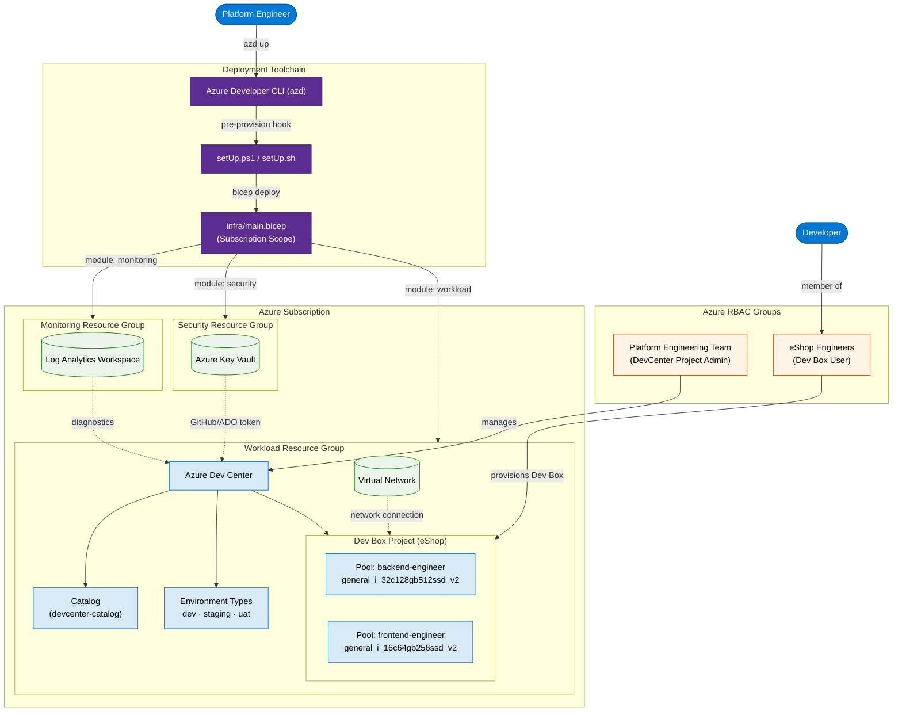

# ContosoDevExp — Microsoft Dev Box Accelerator

[](./LICENSE)
[](https://learn.microsoft.com/en-us/azure/developer/azure-developer-cli/)
[](https://learn.microsoft.com/en-us/azure/azure-resource-manager/bicep/overview)
[](https://azure.microsoft.com)
[](./package.json)

**ContosoDevExp** is a production-ready **Microsoft Dev Box accelerator** that
automates the end-to-end provisioning of cloud-hosted developer workstations on
Azure. A single `azd up` command deploys a fully configured Dev Center with
role-specific Dev Box pools, project catalogs, environment types, and GitHub or
Azure DevOps integration — eliminating manual environment setup and reducing
developer onboarding time from days to minutes.

The accelerator follows **Azure Landing Zone** principles to segregate resources
across dedicated workload, security, and monitoring resource groups. It
integrates Azure Key Vault for secrets management (GitHub/ADO personal access
tokens), Log Analytics for centralized observability, and Azure RBAC to enforce
least-privilege access patterns across platform teams and development projects.

It is designed for **platform engineering teams and Developer Experience (DevEx)
organizations** that need a repeatable, configuration-driven approach to onboard
developers with pre-configured, cloud-managed workstations — removing local
environment inconsistencies and ensuring compliance through
infrastructure-as-code.

---

## Table of Contents

- [Features](#features)
- [Architecture](#architecture)
- [Technologies Used](#technologies-used)
- [Quick Start](#quick-start)
  - [Prerequisites](#prerequisites)
  - [Installation](#installation)
  - [Run Locally](#run-locally)
- [Configuration](#configuration)
  - [Environment Variables](#environment-variables)
  - [Dev Center Settings (`devcenter.yaml`)](#dev-center-settings-devcenteryaml)
  - [Resource Organization (`azureResources.yaml`)](#resource-organization-azureresourcesyaml)
  - [Security Settings (`security.yaml`)](#security-settings-securityyaml)
- [Deployment](#deployment)
  - [Deploy with Azure Developer CLI](#deploy-with-azure-developer-cli)
  - [Deploy with PowerShell](#deploy-with-powershell)
  - [Deploy with Bash](#deploy-with-bash)
- [Usage](#usage)
- [Contributing](#contributing)
- [License](#license)

---

## Features

- 🚀 **One-command deployment** — deploy the full Dev Box platform with `azd up`
- 🏗️ **Infrastructure as Code** — all resources defined in modular Azure Bicep
  templates
- 🔒 **Secrets management** — GitHub and Azure DevOps tokens stored in Azure Key
  Vault
- 📊 **Centralized observability** — Log Analytics Workspace integrated with Dev
  Center diagnostics
- 👥 **Role-based access** — Azure RBAC enforces least-privilege for Dev
  Managers and developers
- 🖥️ **Role-specific Dev Box pools** — separate pools for backend and frontend
  engineers with appropriate VM SKUs
- 🗂️ **Multi-project support** — multiple Dev Box projects per Dev Center, each
  with its own pools and catalogs
- 🌐 **Flexible networking** — managed or custom virtual networks per project
- ⚙️ **Configuration-driven** — YAML files control all resource settings with no
  code changes required
- 🔄 **Multi-platform source control** — supports both GitHub and Azure DevOps
  (ADO) integrations
- 🌍 **Multi-environment** — built-in support for `dev`, `staging`, and `uat`
  environment types
- 🏷️ **Consistent tagging** — all resources tagged for cost allocation,
  compliance, and ownership tracking

---

## Architecture


```mermaid
flowchart TB
    %% ── External actors ──────────────────────────────────────────────────────
    devOps(["Platform Engineer"])
    developer(["Developer"])

    %% ── Deployment toolchain ─────────────────────────────────────────────────
    subgraph Toolchain["Deployment Toolchain"]
        azdCLI["Azure Developer CLI (azd)"]
        setupScript["setUp.ps1 / setUp.sh"]
        mainBicep["infra/main.bicep\n(Subscription Scope)"]
    end

    %% ── Azure infrastructure ─────────────────────────────────────────────────
    subgraph AzureInfra["Azure Subscription"]
        subgraph MonRG["Monitoring Resource Group"]
            logAnalytics[("Log Analytics Workspace")]
        end

        subgraph SecRG["Security Resource Group"]
            keyVault[("Azure Key Vault")]
        end

        subgraph WrkRG["Workload Resource Group"]
            devCenter["Azure Dev Center"]
            catalog["Catalog\n(devcenter-catalog)"]
            envType["Environment Types\ndev · staging · uat"]

            subgraph Proj["Dev Box Project (eShop)"]
                pool1["Pool: backend-engineer\ngeneral_i_32c128gb512ssd_v2"]
                pool2["Pool: frontend-engineer\ngeneral_i_16c64gb256ssd_v2"]
            end

            vnet[("Virtual Network")]
        end
    end

    %% ── Identity & RBAC ──────────────────────────────────────────────────────
    subgraph RBAC["Azure RBAC Groups"]
        devMgr["Platform Engineering Team\n(DevCenter Project Admin)"]
        devTeam["eShop Engineers\n(Dev Box User)"]
    end

    %% ── Deployment flow ──────────────────────────────────────────────────────
    devOps -->|"azd up"| azdCLI
    azdCLI -->|"pre-provision hook"| setupScript
    setupScript -->|"bicep deploy"| mainBicep
    mainBicep -->|"module: monitoring"| MonRG
    mainBicep -->|"module: security"| SecRG
    mainBicep -->|"module: workload"| WrkRG

    %% ── Resource relationships ───────────────────────────────────────────────
    devCenter --> catalog
    devCenter --> envType
    devCenter --> Proj
    logAnalytics -.->|"diagnostics"| devCenter
    keyVault -.->|"GitHub/ADO token"| devCenter
    vnet -.->|"network connection"| Proj

    %% ── Access model ─────────────────────────────────────────────────────────
    devMgr -->|"manages"| devCenter
    devTeam -->|"provisions Dev Box"| Proj
    developer -->|"member of"| devTeam

    %% ── Styles ───────────────────────────────────────────────────────────────
    classDef actor fill:#0078D4,stroke:#005A9E,color:#fff
    classDef tooling fill:#5C2D91,stroke:#3E1F69,color:#fff
    classDef infra fill:#D9EAF7,stroke:#0078D4,color:#000
    classDef datastore fill:#EAF4E8,stroke:#107C10,color:#000
    classDef identity fill:#FFF4E5,stroke:#CA5010,color:#000

    class devOps,developer actor
    class azdCLI,setupScript,mainBicep tooling
    class devCenter,catalog,envType,pool1,pool2 infra
    class logAnalytics,keyVault,vnet datastore
    class devMgr,devTeam identity
```

> [!NOTE] The diagram shows the default configuration with one project
> (`eShop`). Additional projects can be added by extending
> `infra/settings/workload/devcenter.yaml` — no Bicep code changes are needed.

### Component Overview

| Component                   | Type                                       | Purpose                                                                   |
| --------------------------- | ------------------------------------------ | ------------------------------------------------------------------------- |
| **Azure Dev Center**        | `Microsoft.DevCenter/devcenters`           | Central hub managing Dev Box definitions, catalogs, and environment types |
| **Dev Box Project**         | `Microsoft.DevCenter/projects`             | Scoped unit of organization for a team; owns pools and RBAC assignments   |
| **Dev Box Pool**            | `Microsoft.DevCenter/projects/pools`       | Collection of Dev Boxes sharing a VM image, SKU, and network config       |
| **Azure Key Vault**         | `Microsoft.KeyVault/vaults`                | Stores GitHub or ADO personal access tokens used by the Dev Center        |
| **Log Analytics Workspace** | `Microsoft.OperationalInsights/workspaces` | Centralizes diagnostic logs and metrics from the Dev Center               |
| **Virtual Network**         | `Microsoft.Network/virtualNetworks`        | Provides isolated network connectivity for Dev Box instances              |

---

## Technologies Used

| Category                | Technology                                                                                                  | Version / Notes                                       |
| ----------------------- | ----------------------------------------------------------------------------------------------------------- | ----------------------------------------------------- |
| **IaC**                 | [Azure Bicep](https://learn.microsoft.com/en-us/azure/azure-resource-manager/bicep/overview)                | Latest stable; subscription-scope deployment          |
| **Deployment CLI**      | [Azure Developer CLI (azd)](https://learn.microsoft.com/en-us/azure/developer/azure-developer-cli/)         | Handles environment lifecycle and pre-provision hooks |
| **Shell (Windows)**     | [PowerShell 5.1+](https://learn.microsoft.com/en-us/powershell/)                                            | `setUp.ps1`, `cleanSetUp.ps1`                         |
| **Shell (Linux/macOS)** | [Bash](https://www.gnu.org/software/bash/)                                                                  | `setUp.sh`                                            |
| **Configuration**       | [YAML](https://yaml.org/)                                                                                   | All resource settings declared in `infra/settings/`   |
| **Platform**            | [Microsoft Dev Box](https://learn.microsoft.com/en-us/azure/dev-box/overview-what-is-microsoft-dev-box)     | Cloud-hosted developer workstations                   |
| **Security**            | [Azure Key Vault](https://learn.microsoft.com/en-us/azure/key-vault/general/overview)                       | Secrets, RBAC authorization                           |
| **Observability**       | [Azure Log Analytics](https://learn.microsoft.com/en-us/azure/azure-monitor/logs/log-analytics-overview)    | Diagnostic logging                                    |
| **Identity**            | [Azure RBAC + Managed Identity](https://learn.microsoft.com/en-us/azure/role-based-access-control/overview) | System-assigned identity, least-privilege roles       |
| **Networking**          | [Azure Virtual Networks](https://learn.microsoft.com/en-us/azure/virtual-network/virtual-networks-overview) | Managed or custom VNet per project                    |
| **Source Control**      | GitHub / Azure DevOps                                                                                       | Catalog hosting; PAT token integration                |

---

## Quick Start

### Prerequisites

Ensure the following tools are installed and authenticated before deploying:

| Tool                                                                                                             | Minimum Version                       | Required For                                                                       |
| ---------------------------------------------------------------------------------------------------------------- | ------------------------------------- | ---------------------------------------------------------------------------------- |
| [Azure CLI (`az`)](https://learn.microsoft.com/en-us/cli/azure/install-azure-cli)                                | 2.60+                                 | Azure authentication and resource management                                       |
| [Azure Developer CLI (`azd`)](https://learn.microsoft.com/en-us/azure/developer/azure-developer-cli/install-azd) | 1.9+                                  | Environment provisioning and lifecycle management                                  |
| [PowerShell](https://learn.microsoft.com/en-us/powershell/scripting/install/installing-powershell)               | 5.1+ (Windows) or 7+ (cross-platform) | Setup scripts on Windows                                                           |
| [Bash + `jq`](https://jqlang.github.io/jq/)                                                                      | Any current version                   | Setup scripts on Linux/macOS                                                       |
| [GitHub CLI (`gh`)](https://cli.github.com/)                                                                     | 2.x                                   | GitHub integration (optional; required only when `SOURCE_CONTROL_PLATFORM=github`) |

> [!IMPORTANT] You must have **Owner** or **User Access Administrator** rights
> on the target Azure subscription. The deployment assigns RBAC roles at
> subscription scope.

### Installation

1. **Clone the repository:**

   ```bash
   git clone https://github.com/Evilazaro/DevExp-DevBox.git
   cd DevExp-DevBox
   ```

2. **Authenticate with Azure:**

   ```bash
   az login
   azd auth login
   ```

3. **Initialize the `azd` environment:**

   ```bash
   azd env new <your-environment-name>
   ```

4. **Set required environment variables:**

   ```bash
   azd env set AZURE_LOCATION eastus
   azd env set KEY_VAULT_SECRET <your-github-or-ado-pat-token>
   # Optional: defaults to "github"
   azd env set SOURCE_CONTROL_PLATFORM github
   ```

### Run Locally

Validate the configuration and preview resources before deploying:

```bash
# Preview what will be deployed (dry run)
az deployment sub what-if \
  --location eastus \
  --template-file infra/main.bicep \
  --parameters environmentName=dev location=eastus secretValue=<your-pat>
```

> [!TIP] Use `azd provision --preview` to see the full resource plan in your
> current `azd` environment context.

---

## Configuration

All configurable settings are stored as YAML files under `infra/settings/`. No
Bicep code changes are required for common customizations.

### Environment Variables

These variables must be set in your `azd` environment (`.azure/<env-name>/.env`)
before provisioning:

| Variable                  | Required | Default  | Description                                                               |
| ------------------------- | -------- | -------- | ------------------------------------------------------------------------- |
| `AZURE_ENV_NAME`          | ✅       | —        | Short environment identifier used in resource names (e.g., `dev`, `prod`) |
| `AZURE_LOCATION`          | ✅       | —        | Azure region for all resources (e.g., `eastus`, `westeurope`)             |
| `KEY_VAULT_SECRET`        | ✅       | —        | Personal access token for GitHub or Azure DevOps stored in Key Vault      |
| `SOURCE_CONTROL_PLATFORM` | ❌       | `github` | Source control integration; accepted values: `github`, `adogit`           |

> [!WARNING] Never commit `KEY_VAULT_SECRET` to source control. Always inject it
> as a secret via `azd env set` or a CI/CD pipeline secret store.

### Dev Center Settings (`devcenter.yaml`)

**File:** `infra/settings/workload/devcenter.yaml`

Controls the Dev Center resource, projects, catalogs, environment types, and
RBAC group assignments.

```yaml
# Dev Center name
name: 'devexp'

# Identity (system-assigned managed identity)
identity:
  type: 'SystemAssigned'
  roleAssignments:
    devCenter:
      - id: 'b24988ac-6180-42a0-ab88-20f7382dd24c'
        name: 'Contributor'
        scope: 'Subscription'

# Catalogs — Git repositories with Dev Box task definitions
catalogs:
  - name: 'customTasks'
    type: gitHub
    uri: 'https://github.com/microsoft/devcenter-catalog.git'
    branch: 'main'
    path: './Tasks'

# Shared environment types
environmentTypes:
  - name: 'dev'
  - name: 'staging'
  - name: 'uat'

# Projects with pools, networks, and RBAC
projects:
  - name: 'eShop'
    pools:
      - name: 'backend-engineer'
        imageDefinitionName: 'eshop-backend-dev'
        vmSku: general_i_32c128gb512ssd_v2
      - name: 'frontend-engineer'
        imageDefinitionName: 'eshop-frontend-dev'
        vmSku: general_i_16c64gb256ssd_v2
```

**To add a new project**, append an entry under `projects:` following the same
structure. See [devcenter.yaml](infra/settings/workload/devcenter.yaml) for the
full schema.

### Resource Organization (`azureResources.yaml`)

**File:** `infra/settings/resourceOrganization/azureResources.yaml`

Controls which resource groups are created and how they are named and tagged.

```yaml
workload:
  create: true
  name: devexp-workload

security:
  create: false # Set to true to deploy Key Vault in a separate RG
  name: devexp-workload # Inherits workload RG when create: false

monitoring:
  create: false # Set to true to deploy Log Analytics in a separate RG
  name: devexp-workload
```

> [!NOTE] Setting `create: false` for `security` or `monitoring` causes those
> resources to be deployed into the workload resource group instead of a
> dedicated one. This is the default for cost efficiency in non-production
> environments.

### Security Settings (`security.yaml`)

**File:** `infra/settings/security/security.yaml`

Controls Key Vault configuration.

```yaml
create: true

keyVault:
  name: contoso # Globally unique prefix; a unique suffix is appended automatically
  secretName: gha-token # Name of the secret storing the GitHub/ADO PAT
  enablePurgeProtection: true
  enableSoftDelete: true
  softDeleteRetentionInDays: 7
  enableRbacAuthorization: true
```

> [!CAUTION] `enablePurgeProtection: true` prevents the Key Vault from being
> permanently deleted. Set to `false` only in ephemeral dev environments where
> you need the ability to fully remove the Key Vault.

---

## Deployment

### Deploy with Azure Developer CLI

The recommended approach for full lifecycle management:

```bash
# Full deployment (provision infrastructure + deploy)
azd up
```

```bash
# Provision only (no application code deployment)
azd provision
```

```bash
# Tear down all resources
azd down
```

> [!IMPORTANT] `azd up` automatically runs the pre-provision hook (`setUp.ps1`
> on Windows, `setUp.sh` on Linux/macOS) to authenticate with your chosen source
> control platform before provisioning begins.

The deployment creates resources in this order:

1. Resource groups (workload, security, monitoring)
2. Log Analytics Workspace
3. Azure Key Vault + secret
4. Azure Dev Center
5. Dev Box Projects, Pools, Catalogs, and Environment Types
6. RBAC role assignments

### Deploy with PowerShell

For Windows environments without `azd`:

```powershell
# Authenticate first
az login
az account set --subscription "<your-subscription-id>"

# Run the setup and deployment
.\setUp.ps1 -EnvName "dev" -SourceControl "github"
```

```powershell
# Clean up resources
.\cleanSetUp.ps1
```

### Deploy with Bash

For Linux and macOS environments:

```bash
# Authenticate first
az login
az account set --subscription "<your-subscription-id>"

# Run the setup and deployment
./setUp.sh -e "dev" -s "github"
```

**Supported `-s` / `-SourceControl` values:**

| Value    | Description                                                        |
| -------- | ------------------------------------------------------------------ |
| `github` | Authenticates with GitHub CLI and stores a GitHub PAT in Key Vault |
| `adogit` | Authenticates with Azure DevOps and stores an ADO PAT in Key Vault |

---

## Usage

### List deployed Dev Centers

```bash
az devcenter admin devcenter list \
  --resource-group devexp-workload-dev-eastus-RG \
  --output table
```

### List Dev Box pools in a project

```bash
az devcenter admin pool list \
  --resource-group devexp-workload-dev-eastus-RG \
  --dev-center-name devexp \
  --project-name eShop \
  --output table
```

### Provision a Dev Box (as a developer)

```bash
az devcenter dev dev-box create \
  --dev-center-name devexp \
  --project-name eShop \
  --pool-name backend-engineer \
  --name my-dev-box \
  --user-id me
```

### Check provisioned Dev Box status

```bash
az devcenter dev dev-box show \
  --dev-center-name devexp \
  --project-name eShop \
  --name my-dev-box \
  --user-id me
```

### Retrieve Key Vault outputs after deployment

```bash
azd env get-values
# AZURE_KEY_VAULT_NAME=...
# AZURE_DEV_CENTER_NAME=...
# AZURE_LOG_ANALYTICS_WORKSPACE_NAME=...
```

---

## Contributing

Contributions are welcome! To contribute:

1. **Fork** the repository and create a feature branch from `main`.
2. **Follow** existing conventions:
   - Bicep modules in `src/` with descriptive `@description` decorators
   - Configuration changes via YAML files in `infra/settings/`, not hardcoded
     Bicep values
   - Use consistent resource tagging (see `azureResources.yaml` for the tag
     schema)
3. **Test** your changes with `az deployment sub what-if` before opening a pull
   request.
4. **Open a pull request** against `main` with a clear description of the
   changes and their motivation.

> [!NOTE] Please open an issue before starting work on significant features or
> breaking changes so the approach can be discussed first.

**Useful references:**

- [Microsoft Dev Box documentation](https://learn.microsoft.com/en-us/azure/dev-box/)
- [Azure Developer CLI documentation](https://learn.microsoft.com/en-us/azure/developer/azure-developer-cli/)
- [Azure Bicep documentation](https://learn.microsoft.com/en-us/azure/azure-resource-manager/bicep/overview)
- [DevExp-DevBox project site](https://evilazaro.github.io/DevExp-DevBox/)

---

## License

This project is licensed under the **MIT License**. See [LICENSE](./LICENSE) for
full details.

Copyright © 2025 Evilázaro Alves
