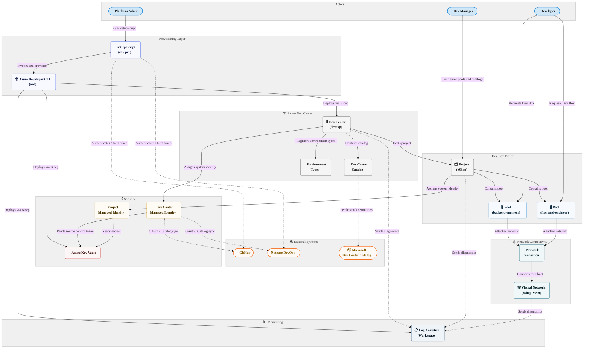

# DevExp-DevBox

[](LICENSE)
[](https://azure.microsoft.com/en-us/products/dev-box/)
[](https://learn.microsoft.com/azure/developer/azure-developer-cli/)
[](https://learn.microsoft.com/azure/azure-resource-manager/bicep/)

**DevExp-DevBox** is an Azure Developer CLI (`azd`) accelerator that provisions
a production-ready
[Microsoft Dev Box](https://learn.microsoft.com/azure/dev-box/overview-what-is-microsoft-dev-box)
environment on Azure, enabling organizations to deliver consistent, cloud-based
developer workstations at scale.

The accelerator eliminates the manual effort required to configure Azure Dev
Center, Dev Box projects, environment types, network connectivity, role-based
access controls, and catalog integrations. It follows **Azure Landing Zone**
principles by separating workload, security, and monitoring concerns into
dedicated resource groups, and supports both GitHub and Azure DevOps as source
control platforms.

The solution uses Azure Bicep for infrastructure as code, YAML configuration
files that declaratively define every aspect of the Dev Center — including
projects, pools, catalogs, and RBAC assignments — and cross-platform setup
scripts (`setUp.sh` for Linux/macOS and `setUp.ps1` for Windows) that automate
environment bootstrapping end-to-end.

## Table of Contents

- [Features](#features)
- [Architecture](#architecture)
- [Technologies Used](#technologies-used)
- [Quick Start](#quick-start)
- [Configuration](#configuration)
- [Deployment](#deployment)
- [Usage](#usage)
- [Contributing](#contributing)
- [License](#license)

## Features

| Feature                           | Description                                                                                                                                                       |
| --------------------------------- | ----------------------------------------------------------------------------------------------------------------------------------------------------------------- |
| 🏗️ Dev Center Provisioning        | Automates deployment of Azure Dev Center with system-assigned managed identity, catalog item sync, and Azure Monitor agent enabled.                               |
| 🖥️ Role-Specific Dev Box Pools    | Creates role-tailored pools (for example, `backend-engineer` and `frontend-engineer`) with distinct VM SKUs and image definitions per project.                    |
| 🔑 Secure Secret Management       | Stores source control access tokens in Azure Key Vault with RBAC authorization, soft-delete protection, and purge-protection enabled.                             |
| 🕸️ Flexible Network Connectivity  | Supports both Microsoft-managed and custom Azure Virtual Networks, attaching Dev Box pools to project-specific subnets via a Network Connection resource.         |
| 📁 Catalog Integration            | Syncs Dev Box task definitions from the Microsoft Dev Center Catalog and project-specific GitHub or Azure DevOps repositories on a scheduled basis.               |
| 👥 Granular RBAC Role Assignments | Configures least-privilege role assignments for Platform Engineers, Dev Managers, developers, and managed identities at subscription and resource group scopes.   |
| 📝 Multi-Environment Support      | Provisions `dev`, `staging`, and `UAT` environment types per project so teams can deploy application environments directly from their Dev Box.                    |
| ⚙️ Cross-Platform Automation      | Provides equivalent setup and cleanup scripts for Linux/macOS (`setUp.sh`, `cleanSetUp.ps1`) and Windows (`setUp.ps1`, `cleanSetUp.ps1`) with identical behavior. |
| 📊 Centralized Observability      | Deploys a Log Analytics Workspace and connects Dev Center, projects, and virtual networks for unified diagnostic telemetry.                                       |

## Architecture

### Architecture Summary

DevExp-DevBox provisions a cloud developer workstation platform centered on
**Azure Dev Center**. Platform admins run the `setUp.sh` or `setUp.ps1` setup
script, which authenticates against GitHub or Azure DevOps, then invokes
`azd provision` to deploy the Bicep infrastructure. The Bicep templates create a
workload resource group containing the Dev Center with a system-assigned managed
identity, an Azure Key Vault that secures the source control access token, and a
Log Analytics Workspace for centralized monitoring. The Dev Center managed
identity reads the stored token from Key Vault to authenticate with the external
source control platform and syncs catalog task definitions from the Microsoft
Dev Center Catalog. The Dev Center hosts one or more Dev Box projects — for
example, `eShop` — each with role-specific pools (`backend-engineer`,
`frontend-engineer`) whose workstations optionally attach to a dedicated Azure
Virtual Network through a Network Connection resource. Dev Managers configure
pool definitions and catalogs per project, and developers request Dev Boxes
directly from their assigned pool.


```mermaid
---
config:
  description: "High-level architecture diagram for DevExp-DevBox: an Azure Dev Center accelerator that provisions cloud developer workstations with GitHub or Azure DevOps integration."
  theme: base
  themeVariables:
    htmlLabels: true
    fontFamily: "-apple-system, BlinkMacSystemFont, \"Segoe UI\", system-ui, \"Apple Color Emoji\", \"Segoe UI Emoji\", sans-serif"
    fontSize: 16
---
flowchart TB

  %% ── Class Definitions ─────────────────────────────────────────────────────
  %% All hex values are Fluent UI React v9 global color tokens (Light theme).
  %% actor:     blue tint50  — developer/admin/manager actors
  %% external:  orange       — GitHub, Azure DevOps, Microsoft Catalog
  %% devops:    cornflower   — setup scripts and Azure Developer CLI
  %% security:  red          — Key Vault
  %% identity:  marigold     — managed identities
  %% monitor:   darkBlue     — Log Analytics Workspace
  %% service:   grey         — Dev Center core components and projects
  %% compute:   lightBlue    — Dev Box pools (VM-based workstations)
  %% networking: steel       — Virtual Network and Network Connection
  classDef actor      fill:#d0e7f8,stroke:#0078d4,color:#242424,font-weight:bold
  classDef external   fill:#fff9f5,stroke:#f7630c,color:#835b00,font-weight:bold
  classDef devops     fill:#f7f9fe,stroke:#4f6bed,color:#182047,font-weight:bold
  classDef security   fill:#fdf6f6,stroke:#d13438,color:#3f1011,font-weight:bold
  classDef identity   fill:#fefbf4,stroke:#eaa300,color:#463100,font-weight:bold
  classDef monitor    fill:#eff4f9,stroke:#003966,color:#00111f,font-weight:bold
  classDef service    fill:#f5f5f5,stroke:#616161,color:#242424,font-weight:bold
  classDef compute    fill:#f6fafe,stroke:#3a96dd,color:#112d42,font-weight:bold
  classDef networking fill:#eff7f9,stroke:#005b70,color:#001b22,font-weight:bold

  %% ── Actors ─────────────────────────────────────────────────────────────────
  subgraph ACTORS["👥 Actors"]
    ADMIN(["👤 Platform Admin"])
    DEVMGR(["👤 Dev Manager"])
    DEV(["👤 Developer"])
  end

  %% ── External Systems ────────────────────────────────────────────────────────
  subgraph EXT["🌍 External Systems"]
    GITHUB(["🐙 GitHub"])
    ADO(["⚙️ Azure DevOps"])
    MS_CATALOG(["📦 Microsoft<br/>Dev Center Catalog"])
  end

  %% ── Provisioning Layer ──────────────────────────────────────────────────────
  subgraph PROVISION["🚀 Provisioning Layer"]
    SETUP("📜 setUp Script<br/>(sh / ps1)")
    AZD("🛠️ Azure Developer CLI<br/>(azd)")
  end

  %% ── Security ───────────────────────────────────────────────────────────────
  subgraph SEC_LAYER["🔒 Security"]
    KEYVAULT("🔑 Azure Key Vault")
    DC_IDENTITY("🪪 Dev Center<br/>Managed Identity")
    PROJ_IDENTITY("🪪 Project<br/>Managed Identity")
  end

  %% ── Monitoring ─────────────────────────────────────────────────────────────
  subgraph MON_LAYER["📊 Monitoring"]
    LOG_ANALYTICS("📋 Log Analytics<br/>Workspace")
  end

  %% ── Azure Dev Center ────────────────────────────────────────────────────────
  subgraph DC_CORE["🏗️ Azure Dev Center"]
    DEVCENTER("🖥️ Dev Center<br/>(devexp)")
    CATALOG("📁 Dev Center<br/>Catalog")
    ENV_TYPES("📝 Environment<br/>Types")
  end

  %% ── Dev Box Project ─────────────────────────────────────────────────────────
  subgraph DC_PROJECT["📂 Dev Box Project"]
    PROJECT("🗂️ Project<br/>(eShop)")
    POOL_BACKEND("🖥️ Pool<br/>(backend-engineer)")
    POOL_FRONTEND("🖥️ Pool<br/>(frontend-engineer)")
  end

  %% ── Network Connectivity ─────────────────────────────────────────────────────
  subgraph CONN_LAYER["🕸️ Network Connectivity"]
    VNET("🕸️ Virtual Network<br/>(eShop-VNet)")
    NET_CONN("🔗 Network<br/>Connection")
  end

  %% ── Provisioning Flows ──────────────────────────────────────────────────────
  ADMIN         -- "Runs setup script"                 --> SETUP
  SETUP         -. "Authenticates / Gets token"       .-> GITHUB
  SETUP         -. "Authenticates / Gets token"       .-> ADO
  SETUP         -- "Invokes azd provision"             --> AZD
  AZD           -- "Deploys via Bicep"                 --> KEYVAULT
  AZD           -- "Deploys via Bicep"                 --> LOG_ANALYTICS
  AZD           -- "Deploys via Bicep"                 --> DEVCENTER

  %% ── Dev Center Core Flows ───────────────────────────────────────────────────
  DEVCENTER     -- "Assigns system identity"           --> DC_IDENTITY
  DC_IDENTITY   -- "Reads source control token"        --> KEYVAULT
  DC_IDENTITY   -. "OAuth / Catalog sync"             .-> GITHUB
  DC_IDENTITY   -. "OAuth / Catalog sync"             .-> ADO
  DEVCENTER     -- "Contains catalog"                  --> CATALOG
  CATALOG       -. "Fetches task definitions"         .-> MS_CATALOG
  DEVCENTER     -- "Registers environment types"       --> ENV_TYPES
  DEVCENTER     -. "Sends diagnostics"                .-> LOG_ANALYTICS

  %% ── Project Flows ───────────────────────────────────────────────────────────
  DEVCENTER     -- "Hosts project"                     --> PROJECT
  PROJECT       -- "Assigns system identity"           --> PROJ_IDENTITY
  PROJ_IDENTITY -- "Reads secrets"                     --> KEYVAULT
  PROJECT       -- "Contains pool"                     --> POOL_BACKEND
  PROJECT       -- "Contains pool"                     --> POOL_FRONTEND
  PROJECT       -. "Sends diagnostics"                .-> LOG_ANALYTICS

  %% ── Network Flows ───────────────────────────────────────────────────────────
  POOL_BACKEND  -- "Attaches network"                  --> NET_CONN
  POOL_FRONTEND -- "Attaches network"                  --> NET_CONN
  NET_CONN      -- "Connects to subnet"                --> VNET
  VNET          -. "Sends diagnostics"                .-> LOG_ANALYTICS

  %% ── User Flows ──────────────────────────────────────────────────────────────
  DEVMGR        -- "Configures pools and catalogs"     --> PROJECT
  DEV           -- "Requests Dev Box"                  --> POOL_BACKEND
  DEV           -- "Requests Dev Box"                  --> POOL_FRONTEND

  %% ── Class Assignments ───────────────────────────────────────────────────────
  class ADMIN,DEVMGR,DEV actor
  class GITHUB,ADO,MS_CATALOG external
  class SETUP,AZD devops
  class KEYVAULT security
  class DC_IDENTITY,PROJ_IDENTITY identity
  class LOG_ANALYTICS monitor
  class DEVCENTER,CATALOG,ENV_TYPES,PROJECT service
  class POOL_BACKEND,POOL_FRONTEND compute
  class VNET,NET_CONN networking

  %% ── Subgraph Styles ─────────────────────────────────────────────────────────
  style ACTORS     fill:#f0f0f0,stroke:#d1d1d1,color:#424242,stroke-width:2px
  style EXT        fill:#f0f0f0,stroke:#d1d1d1,color:#424242,stroke-width:2px
  style PROVISION  fill:#f0f0f0,stroke:#d1d1d1,color:#424242,stroke-width:2px
  style SEC_LAYER  fill:#f0f0f0,stroke:#d1d1d1,color:#424242,stroke-width:2px
  style MON_LAYER  fill:#f0f0f0,stroke:#d1d1d1,color:#424242,stroke-width:2px
  style DC_CORE    fill:#f0f0f0,stroke:#d1d1d1,color:#424242,stroke-width:2px
  style DC_PROJECT fill:#f0f0f0,stroke:#d1d1d1,color:#424242,stroke-width:2px
  style CONN_LAYER fill:#f0f0f0,stroke:#d1d1d1,color:#424242,stroke-width:2px
```

## Technologies Used

| Technology                  | Type                 | Purpose                                                                                        |
| --------------------------- | -------------------- | ---------------------------------------------------------------------------------------------- |
| Azure Bicep                 | IaC Language         | Declares and deploys all Azure infrastructure in a type-safe, modular structure                |
| Azure Developer CLI (`azd`) | CLI Tool             | Bootstraps environments, manages deployment hooks, and orchestrates `azd up` / `azd provision` |
| Azure Dev Center            | Azure Service        | Centralizes management of developer workstations, catalogs, and deployment environment targets |
| Azure Dev Box               | Azure Service        | Provides cloud-hosted, pre-configured virtual machine workstations for developers              |
| Azure Key Vault             | Azure Service        | Secures source control access tokens and project secrets with RBAC-based authorization         |
| Azure Log Analytics         | Azure Service        | Collects and stores diagnostic telemetry from Dev Center, projects, and network resources      |
| Azure Virtual Network       | Azure Service        | Provides private subnet connectivity for Dev Box pools when `virtualNetworkType: Unmanaged`    |
| Azure Managed Identity      | Azure Service        | Grants Dev Center and project identities token-less, credential-free access to Key Vault       |
| PowerShell                  | Scripting Language   | Drives Windows environment setup (`setUp.ps1`) and teardown (`cleanSetUp.ps1`) automation      |
| Bash                        | Scripting Language   | Drives Linux/macOS environment setup (`setUp.sh`) automation                                   |
| YAML                        | Configuration Format | Declaratively defines Dev Center, project, pool, catalog, and security settings                |
| GitHub CLI (`gh`)           | CLI Tool             | Authenticates GitHub sessions and manages repository secrets during setup                      |

## Quick Start

### Prerequisites

| Prerequisite                | Notes                                                                                                           |
| --------------------------- | --------------------------------------------------------------------------------------------------------------- |
| Azure CLI (`az`)            | Install from [aka.ms/installazurecliwindows](https://aka.ms/installazurecliwindows) or `brew install azure-cli` |
| Azure Developer CLI (`azd`) | Install from [aka.ms/azd-install](https://learn.microsoft.com/azure/developer/azure-developer-cli/install-azd)  |
| GitHub CLI (`gh`)           | Required when `SOURCE_CONTROL_PLATFORM=github`. Install from [cli.github.com](https://cli.github.com)           |
| `jq`                        | JSON processing used in `setUp.sh`. Install via your OS package manager                                         |
| PowerShell ≥ 5.1            | Required on Windows for `setUp.ps1` and `cleanSetUp.ps1`                                                        |
| Azure subscription          | **Contributor** role or higher on the target subscription                                                       |

> [!IMPORTANT] The deployment requires at least **Contributor** and **User
> Access Administrator** roles on the Azure subscription, because the setup
> assigns RBAC roles to managed identities.

### Installation Steps

1. Clone the repository:

   ```bash
   git clone https://github.com/Evilazaro/DevExp-DevBox.git
   cd DevExp-DevBox
   ```

2. Sign in to Azure:

   ```bash
   azd auth login
   az login
   ```

3. Create and configure a new `azd` environment:

   ```bash
   azd env new <your-environment-name>
   azd env set AZURE_LOCATION eastus2
   azd env set KEY_VAULT_SECRET <your-github-or-ado-pat>
   azd env set SOURCE_CONTROL_PLATFORM github
   ```

4. Provision all Azure resources:

   ```bash
   azd up
   ```

> [!NOTE] On Windows, you can run `setUp.ps1` directly with
> `.\setUp.ps1 -EnvName "dev" -SourceControl "github"` as an alternative to
> `azd up`.

### Minimal Working Example

```bash
# Clone, authenticate, and deploy with a single environment named "dev"
git clone https://github.com/Evilazaro/DevExp-DevBox.git
cd DevExp-DevBox

azd auth login
az login

azd env new dev
azd env set AZURE_LOCATION eastus2
azd env set KEY_VAULT_SECRET ghp_YourGitHubPersonalAccessToken
azd env set SOURCE_CONTROL_PLATFORM github

azd up
# Expected output:
# (✓) Done: Resource group: devexp-workload-dev-eastus2-RG
# (✓) Done: Key Vault: contoso-<suffix>
# (✓) Done: Log Analytics Workspace: logAnalytics-<suffix>
# (✓) Done: Dev Center: devexp
# (✓) Done: Project: eShop
```

## Configuration

The following environment variables control the deployment. Set them with
`azd env set <OPTION> <VALUE>` before running `azd up`.

| Option                    | Default      | Description                                                                    |
| ------------------------- | ------------ | ------------------------------------------------------------------------------ |
| `AZURE_ENV_NAME`          | _(required)_ | Environment name used in resource group naming (2–10 characters)               |
| `AZURE_LOCATION`          | _(required)_ | Azure region for resource deployment. See [supported regions](#deployment)     |
| `KEY_VAULT_SECRET`        | _(required)_ | Personal access token for GitHub or Azure DevOps; stored as a Key Vault secret |
| `SOURCE_CONTROL_PLATFORM` | `github`     | Source control platform: `github` or `adogit`                                  |

The YAML files in `infra/settings/` control advanced configuration:

| File                                                      | Purpose                                                          |
| --------------------------------------------------------- | ---------------------------------------------------------------- |
| `infra/settings/resourceOrganization/azureResources.yaml` | Resource group names and landing zone structure                  |
| `infra/settings/security/security.yaml`                   | Key Vault name, secret name, and protection settings             |
| `infra/settings/workload/devcenter.yaml`                  | Dev Center name, projects, pools, catalogs, and RBAC assignments |

**Example:** Override the Key Vault secret name in
`infra/settings/security/security.yaml`:

```yaml
keyVault:
  name: my-keyvault # Must be globally unique
  secretName: my-ado-token # Name used to retrieve the token
  enablePurgeProtection: true
  softDeleteRetentionInDays: 7
```

> [!TIP] Use the `infra/settings/workload/devcenter.yaml` file to add new
> projects, define additional Dev Box pools, configure environment types, and
> assign Azure AD groups to roles without modifying any Bicep files.

## Deployment

> [!NOTE] Supported Azure regions: `eastus`, `eastus2`, `westus`, `westus2`,
> `westus3`, `centralus`, `northeurope`, `westeurope`, `southeastasia`,
> `australiaeast`, `japaneast`, `uksouth`, `canadacentral`, `swedencentral`,
> `switzerlandnorth`, `germanywestcentral`.

1. Ensure all prerequisites are installed and you are signed in to both `az` and
   `azd`.

2. Set the required environment variables:

   ```bash
   azd env set AZURE_LOCATION eastus2
   azd env set KEY_VAULT_SECRET <your-pat>
   azd env set SOURCE_CONTROL_PLATFORM github
   ```

3. Run the full provisioning command:

   ```bash
   azd up
   ```

   The `preprovision` hook in `azure.yaml` automatically runs the setup script
   (`setUp.sh` on Linux/macOS or the PowerShell equivalent on Windows) before
   invoking the Bicep deployment.

4. Verify deployment outputs printed by `azd`:

   ```text
   AZURE_DEV_CENTER_NAME        = devexp
   AZURE_DEV_CENTER_PROJECTS    = ["eShop"]
   AZURE_KEY_VAULT_NAME         = contoso-<suffix>
   AZURE_KEY_VAULT_ENDPOINT     = https://contoso-<suffix>.vault.azure.net/
   AZURE_LOG_ANALYTICS_WORKSPACE_NAME = logAnalytics-<suffix>
   ```

5. To tear down all provisioned resources, run the cleanup script:

   ```powershell
   .\cleanSetUp.ps1 -EnvName "dev" -Location "eastus2"
   ```

> [!WARNING] `cleanSetUp.ps1` deletes resource groups, removes role assignments,
> and deletes app registrations. Run it only when you intend to remove the
> entire environment.

## Usage

### Access the Dev Center in the Azure Portal

After a successful deployment, navigate to the **devexp** Dev Center in the
[Azure Portal](https://portal.azure.com) to view projects, pools, and catalog
sync status.

### Request a Dev Box

Developers request a Dev Box from the
[developer portal](https://devportal.microsoft.com):

1. Sign in with your organizational account.
2. Select the **eShop** project.
3. Choose the pool that matches your role (`backend-engineer` or
   `frontend-engineer`).
4. Select **Create** and wait for provisioning to complete (typically 20–30
   minutes for first-time image builds).

### Add a New Dev Box Project

Edit `infra/settings/workload/devcenter.yaml` to define a new project and re-run
`azd up`:

```yaml
projects:
  - name: 'myNewProject'
    description: 'My new project description.'
    network:
      name: myNewProject
      create: true
      resourceGroupName: 'myNewProject-connectivity-RG'
      virtualNetworkType: Managed
      addressPrefixes:
        - 10.1.0.0/16
      subnets:
        - name: myNewProject-subnet
          properties:
            addressPrefix: 10.1.1.0/24
      tags:
        environment: dev
    identity:
      type: SystemAssigned
      roleAssignments:
        - azureADGroupId: '<your-aad-group-id>'
          azureADGroupName: 'My Project Engineers'
          azureRBACRoles:
            - name: 'Dev Box User'
              id: '45d50f46-0b78-4001-a660-4198cbe8cd05'
              scope: Project
    pools:
      - name: 'full-stack-engineer'
        imageDefinitionName: 'myproject-fullstack-dev'
        vmSku: general_i_16c64gb256ssd_v2
    environmentTypes:
      - name: 'dev'
        deploymentTargetId: ''
    catalogs: []
    tags:
      environment: 'dev'
      team: 'MyTeam'
      project: 'myNewProject'
```

Then run:

```bash
azd up
# Expected: new resource group and project created under the devexp Dev Center
```

### Clean Up the Environment

```powershell
# Windows — remove all provisioned resources for the "dev" environment
.\cleanSetUp.ps1 -EnvName "dev" -Location "eastus2"
```

```bash
# Linux/macOS — use azd to deprovision
azd down
```

## Contributing

Contributions are welcome. To submit a bug report or feature request, open an
issue on the [GitHub Issues](https://github.com/Evilazaro/DevExp-DevBox/issues)
page and include the environment name, Azure region, and relevant error output.

To contribute a code change:

1. Fork the repository and create a feature branch from `main`.
2. Make your changes, following the existing Bicep module structure and YAML
   configuration patterns.
3. Validate your Bicep changes with `az bicep build --file infra/main.bicep`
   before opening a pull request.
4. Open a pull request against `main` with a clear description of the change and
   the problem it solves.
5. Ensure the pull request title follows the format `[type]: short description`
   (for example, `feat: add Azure Container Apps environment type`).

> [!NOTE] By contributing to this repository you agree that your contributions
> will be licensed under the [MIT License](LICENSE).

## License

This project is licensed under the **MIT License**. See the [LICENSE](LICENSE)
file for full terms.
