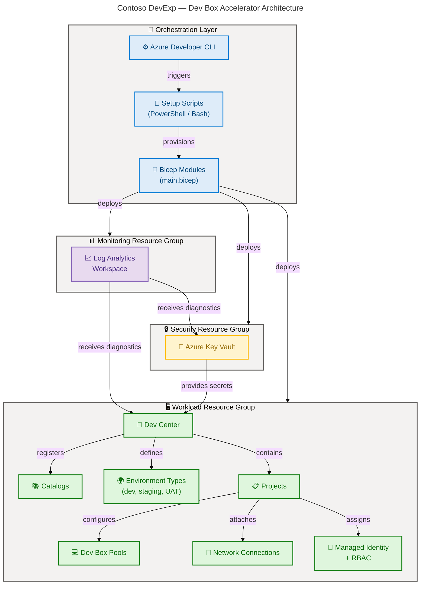

# Contoso DevExp — Dev Box Accelerator


## 📖 Overview

**Overview**

The Contoso DevExp Dev Box Accelerator is an Infrastructure as Code (IaC)
solution that automates the provisioning and configuration of Microsoft Dev Box
environments on Azure. It enables platform engineering teams to deploy fully
configured, developer-ready workstations with a single command, reducing
environment setup time from days to minutes.

This accelerator follows Azure Landing Zone principles to organize resources
into security, monitoring, and workload resource groups. It uses Azure Developer
CLI (`azd`) for orchestration, Bicep modules for infrastructure definitions, and
YAML-driven configuration for Dev Center settings — enabling repeatable,
auditable, and customizable deployments across development, staging, and UAT
environments.

> [!NOTE] This project uses the Azure Developer CLI (`azd`) for provisioning.
> All infrastructure is defined as Bicep modules with YAML-based configuration,
> following the configuration-as-code approach.

## 📑 Table of Contents

- [Architecture](#-architecture)
- [Features](#-features)
- [Requirements](#-requirements)
- [Quick Start](#-quick-start)
- [Deployment](#-deployment)
- [Usage](#-usage)
- [Configuration](#-configuration)
- [Contributing](#-contributing)
- [License](#-license)

## 🏗️ Architecture

**Overview**

The accelerator deploys resources across three Azure resource groups following
Azure Landing Zone segregation principles. The orchestration layer (`azd`) runs
setup scripts that authenticate against Azure and the chosen source control
platform, then provisions all infrastructure through Bicep modules with
dependency ordering: monitoring first, then security, then workload resources.

The Bicep module hierarchy flows from a subscription-scoped entry point
(`main.bicep`) that creates resource groups and delegates to domain-specific
modules for Log Analytics, Key Vault, and Dev Center resources including
projects, pools, catalogs, and network connections.


```mermaid
---
title: "Contoso DevExp — Dev Box Accelerator Architecture"
config:
  theme: base
  look: classic
  layout: dagre
  flowchart:
    htmlLabels: true
---
flowchart TB
    accTitle: Dev Box Accelerator Architecture
    accDescr: Shows the three-tier resource group architecture with orchestration layer, security, monitoring, and workload components

    subgraph orchestration["🔄 Orchestration Layer"]
        direction LR
        azd["⚙️ Azure Developer CLI"]:::core
        setup["📜 Setup Scripts<br/>(PowerShell / Bash)"]:::core
        bicep["📐 Bicep Modules<br/>(main.bicep)"]:::core

        azd -->|"triggers"| setup
        setup -->|"provisions"| bicep
    end

    subgraph monitoring["📊 Monitoring Resource Group"]
        direction LR
        logAnalytics["📈 Log Analytics<br/>Workspace"]:::data
    end

    subgraph security["🔒 Security Resource Group"]
        direction LR
        keyVault["🔑 Azure Key Vault"]:::warning
    end

    subgraph workload["🖥️ Workload Resource Group"]
        direction TB
        devCenter["🏢 Dev Center"]:::success
        catalog["📚 Catalogs"]:::success
        envTypes["🌍 Environment Types<br/>(dev, staging, UAT)"]:::success
        project["📋 Projects"]:::success
        pools["💻 Dev Box Pools"]:::success
        netConn["🔌 Network Connections"]:::success
        identity["🔐 Managed Identity<br/>+ RBAC"]:::success

        devCenter -->|"registers"| catalog
        devCenter -->|"defines"| envTypes
        devCenter -->|"contains"| project
        project -->|"configures"| pools
        project -->|"attaches"| netConn
        project -->|"assigns"| identity
    end

    bicep -->|"deploys"| monitoring
    bicep -->|"deploys"| security
    bicep -->|"deploys"| workload
    logAnalytics -->|"receives diagnostics"| devCenter
    logAnalytics -->|"receives diagnostics"| keyVault
    keyVault -->|"provides secrets"| devCenter

    style orchestration fill:#F3F2F1,stroke:#605E5C,stroke-width:2px
    style monitoring fill:#F3F2F1,stroke:#605E5C,stroke-width:2px
    style security fill:#F3F2F1,stroke:#605E5C,stroke-width:2px
    style workload fill:#F3F2F1,stroke:#605E5C,stroke-width:2px

    classDef core fill:#DEECF9,stroke:#0078D4,stroke-width:2px,color:#004578
    classDef success fill:#DFF6DD,stroke:#107C10,stroke-width:2px,color:#0B6A0B
    classDef warning fill:#FFF4CE,stroke:#FFB900,stroke-width:2px,color:#986F0B
    classDef data fill:#E8DAEF,stroke:#8764B8,stroke-width:2px,color:#4B2D83
    classDef neutral fill:#FAFAFA,stroke:#8A8886,stroke-width:2px,color:#323130
```

**Component Roles:**

| Component              | Purpose                                                            | Module                                       |
| ---------------------- | ------------------------------------------------------------------ | -------------------------------------------- |
| 🔄 Azure Developer CLI | Orchestrates provisioning lifecycle                                | `azure.yaml`                                 |
| 📜 Setup Scripts       | Authenticate and initialize environments                           | `setUp.ps1` / `setUp.sh`                     |
| 📐 Bicep Entry Point   | Subscription-scoped resource group creation and module delegation  | `infra/main.bicep`                           |
| 📈 Log Analytics       | Centralized monitoring and diagnostics collection                  | `src/management/logAnalytics.bicep`          |
| 🔑 Key Vault           | Secrets management with RBAC authorization and purge protection    | `src/security/keyVault.bicep`                |
| 🏢 Dev Center          | Developer workstation platform with catalogs and environment types | `src/workload/core/devCenter.bicep`          |
| 📋 Projects            | Team-scoped Dev Box configurations with pools and networking       | `src/workload/project/project.bicep`         |
| 🔌 Networking          | VNet and network connections for Dev Box connectivity              | `src/connectivity/connectivity.bicep`        |
| 🔐 Identity            | Managed identity and RBAC role assignments                         | `src/identity/devCenterRoleAssignment.bicep` |

## ✨ Features

**Overview**

The accelerator provides a complete platform engineering toolkit for
provisioning Microsoft Dev Box environments. It combines one-command deployment
with enterprise-grade security, modular Bicep infrastructure, and flexible YAML
configuration to support teams of any size across multiple environments.

> [!TIP] All features are configurable through YAML files in `infra/settings/`.
> No Bicep code changes are needed for standard customizations like adding
> projects, pools, or environment types.

| Feature                      | Description                                                                                          |
| ---------------------------- | ---------------------------------------------------------------------------------------------------- |
| 🚀 One-Command Deployment    | Deploy the entire Dev Box landing zone with a single `azd up` command                                |
| 🔒 Enterprise Security       | Key Vault with RBAC authorization, purge protection, soft delete, and managed identities             |
| 📊 Centralized Monitoring    | Log Analytics workspace with diagnostic settings for all deployed resources                          |
| ⚙️ YAML-Driven Configuration | Define Dev Centers, projects, pools, catalogs, and environment types in YAML without modifying Bicep |
| 🌐 Network Isolation         | Managed or unmanaged VNet support with configurable subnets for Dev Box connectivity                 |
| 🏢 Multi-Project Support     | Deploy multiple projects with role-specific Dev Box pools under a single Dev Center                  |
| 🔐 Least-Privilege RBAC      | Pre-configured role assignments following Microsoft security guidance for Dev Center operations      |
| 📚 Catalog Integration       | GitHub and Azure DevOps Git catalog support for environment definitions and Dev Box images           |
| 🌍 Multi-Environment         | Built-in support for dev, staging, and UAT environment types with per-project configuration          |

## 📋 Requirements

**Overview**

Before deploying the accelerator, ensure you have the required CLI tools
installed and authenticated. The setup scripts validate all prerequisites
automatically and provide actionable error messages if any tool is missing or
not authenticated.

> [!IMPORTANT] You must have an active Azure subscription with Contributor and
> User Access Administrator permissions at the subscription level to deploy all
> resources.

| Requirement                    | Minimum Version | Purpose                                                       |
| ------------------------------ | --------------- | ------------------------------------------------------------- |
| ☁️ Azure Subscription          | N/A             | Target subscription for resource deployment                   |
| 🛠️ Azure CLI                   | >= 2.50         | Azure authentication and resource management                  |
| 📦 Azure Developer CLI (`azd`) | >= 1.0          | Infrastructure provisioning orchestration                     |
| 🐧 Bash                        | >= 4.0          | Setup script execution (Linux / macOS)                        |
| 💻 PowerShell                  | >= 5.1          | Setup script execution (Windows)                              |
| 🔑 GitHub CLI (`gh`)           | >= 2.0          | GitHub authentication and token retrieval (when using GitHub) |
| 📍 Git                         | >= 2.0          | Source control operations                                     |

## 🚀 Quick Start

**Overview**

Get a Dev Box environment running in under 10 minutes. The accelerator supports
two deployment paths: automated via `azd up` (recommended), or manual setup
using the included scripts. The setup scripts handle tool validation,
authentication, and environment initialization — then `azd` provisions all Azure
infrastructure through Bicep.

> [!IMPORTANT] The setup scripts (`setUp.sh` / `setUp.ps1`) handle
> authentication and environment initialization only. They do **not** provision
> Azure resources. Use `azd up` or `azd provision` after running the scripts.

**Step 1 — Clone the repository:**

```bash
git clone https://github.com/Evilazaro/DevExp-DevBox.git
cd DevExp-DevBox
```

**Expected output:**

```text
Cloning into 'DevExp-DevBox'...
remote: Enumerating objects: 350, done.
remote: Counting objects: 100% (350/350), done.
Receiving objects: 100% (350/350), 125.00 KiB | 1.25 MiB/s, done.
```

**Step 2 — Authenticate with Azure and source control:**

```bash
az login
azd auth login
gh auth login
```

> [!NOTE] `gh auth login` is required when using GitHub as the source control
> platform. For Azure DevOps Git, authenticate with `az devops login` instead.

**Expected output:**

```text
A web browser has been opened at https://login.microsoftonline.com/...
You have logged in. Now let us find all the subscriptions to which you have access...
✓ Logged in to github.com account
```

**Step 3 — Initialize and deploy (Linux / macOS):**

```bash
azd init -e "dev"
azd up
```

The `azd up` command triggers the `setUp.sh` preprovision hook defined in
`azure.yaml`. The hook validates prerequisites (`az`, `azd`, `jq`, `gh`),
verifies authentication, retrieves the source control token, and stores it in
the azd environment. After the hook completes, `azd` provisions all Azure
infrastructure through `infra/main.bicep`.

**Expected output:**

```text
Initializing a new environment (dev)...
SUCCESS: Environment initialized.

ℹ️ Starting Dev Box environment setup
ℹ️ Environment name: dev
ℹ️ Source control platform: github
ℹ️ Checking required tools...
✅ All required tools are available
✅ Using Azure subscription: Contoso-Dev (ID: xxxxxxxx-xxxx-xxxx-xxxx-xxxxxxxxxxxx)
✅ GitHub authentication verified successfully
✅ GitHub token retrieved and stored securely
✅ Azure Developer CLI environment 'dev' initialized successfully.
✅ Dev Box environment 'dev' setup successfully

Provisioning Azure resources (azd provision)
(✓) Done: Resource group: devexp-workload-dev-RG
(✓) Done: Resource group: devexp-security-dev-RG
(✓) Done: Resource group: devexp-monitoring-dev-RG
(✓) Done: Log Analytics Workspace
(✓) Done: Key Vault
(✓) Done: Dev Center

SUCCESS: Your application was provisioned in Azure.
```

**Step 3 (alt) — Initialize and deploy (Windows):**

On Windows, if Bash is not available, rename `azure-pwh.yaml` to `azure.yaml` to
use the PowerShell-based preprovision hook, then run:

```powershell
azd init -e "dev"
azd up
```

Alternatively, run the setup and provisioning steps manually:

```powershell
.\setUp.ps1 -EnvName "dev" -SourceControl "github"
azd provision -e "dev"
```

> [!NOTE] The PowerShell setup script (`setUp.ps1`) requires `az`, `azd`, and
> `gh` (no `jq` dependency). Parameters use PowerShell naming: `-EnvName` and
> `-SourceControl` (accepts `github` or `adogit`).

## 📦 Deployment

**Overview**

The deployment process uses Azure Developer CLI (`azd`) to provision all
infrastructure through Bicep. The setup scripts orchestrate authentication,
environment initialization, and the `azd provision` command. Two deployment
paths are available: a guided setup via scripts, or direct `azd` commands for
advanced users.

### Option A — Guided Deployment (Recommended)

**Step 1 — Authenticate and provision (Linux / macOS):**

```bash
./setUp.sh -e "dev" -s "github"
```

**Expected output:**

```text
✅ Prerequisites validated
✅ Azure authentication confirmed
✅ GitHub CLI authenticated
✅ Environment 'dev' initialized
✅ Provisioning complete
```

**Step 2 — Authenticate and provision (Windows):**

```powershell
.\setUp.ps1 -EnvName "dev" -SourceControl "github"
```

**Expected output:**

```text
✅ Prerequisites validated
✅ Azure authentication confirmed
✅ GitHub CLI authenticated
✅ Environment 'dev' initialized
✅ Provisioning complete
```

### Option B — Direct azd Deployment

**Step 1 — Initialize the environment:**

```bash
azd init -e "dev"
```

**Expected output:**

```text
Initializing a new environment (dev)...
SUCCESS: Environment initialized.
```

**Step 2 — Provision resources:**

```bash
azd provision -e "dev"
```

**Expected output:**

```text
Provisioning Azure resources (azd provision)
(✓) Done: Resource group: devexp-workload-dev-eastus-RG
(✓) Done: Resource group: devexp-security-dev-eastus-RG
(✓) Done: Resource group: devexp-monitoring-dev-eastus-RG
(✓) Done: Log Analytics Workspace
(✓) Done: Key Vault
(✓) Done: Dev Center

SUCCESS: Your application was provisioned in Azure.
```

### Cleanup

To remove all deployed resources and clean up the environment:

```powershell
.\cleanSetUp.ps1 -EnvName "dev" -Location "eastus2"
```

**Expected output:**

```text
Removing subscription deployments...
Deleting resource groups...
Cleaning up service principals...
✅ Cleanup complete
```

## 💻 Usage

**Overview**

After deployment, platform administrators manage Dev Box environments by editing
the YAML configuration files in `infra/settings/` and re-provisioning with
`azd provision`. Developers access their Dev Boxes through the
[Microsoft Dev Box portal](https://devbox.microsoft.com). All changes follow a
configuration-as-code workflow — edit YAML, commit, re-provision.

### Adding a New Project

Edit `infra/settings/workload/devcenter.yaml` to add a project under the
`projects` array. Each project requires network, identity, pool, environment
type, catalog, and tag configuration. Below is a complete project definition
based on the existing `eShop` project structure:

```yaml
projects:
  - name: 'myNewProject'
    description: 'New team project for backend services.'

    network:
      name: myNewProject
      create: true
      resourceGroupName: 'myNewProject-connectivity-RG'
      virtualNetworkType: Managed
      addressPrefixes:
        - 10.1.0.0/16
      subnets:
        - name: myNewProject-subnet
          properties:
            addressPrefix: 10.1.1.0/24
      tags:
        environment: dev
        division: Platforms
        team: DevExP
        project: DevExP-DevBox
        costCenter: IT
        owner: Contoso
        resources: Network

    identity:
      type: SystemAssigned
      roleAssignments:
        - azureADGroupId: '<azure-ad-group-id>'
          azureADGroupName: 'MyNewProject Developers'
          azureRBACRoles:
            - name: 'Contributor'
              id: 'b24988ac-6180-42a0-ab88-20f7382dd24c'
              scope: Project
            - name: 'Dev Box User'
              id: '45d50f46-0b78-4001-a660-4198cbe8cd05'
              scope: Project
            - name: 'Deployment Environment User'
              id: '18e40d4e-8d2e-438d-97e1-9528336e149c'
              scope: Project

    pools:
      - name: 'developer'
        imageDefinitionName: 'myNewProject-developer'
        vmSku: general_i_16c64gb256ssd_v2

    environmentTypes:
      - name: 'dev'
        deploymentTargetId: ''
      - name: 'staging'
        deploymentTargetId: ''

    catalogs:
      - name: 'environments'
        type: environmentDefinition
        sourceControl: gitHub
        visibility: private
        uri: 'https://github.com/org/myNewProject.git'
        branch: 'main'
        path: '/.devcenter/environments'

    tags:
      environment: dev
      division: Platforms
      team: DevExP
      project: DevExP-DevBox
      costCenter: IT
      owner: Contoso
      resources: Project
```

Then re-provision to deploy the new project:

```bash
azd provision -e "dev"
```

**Expected output:**

```text
Provisioning Azure resources (azd provision)
(✓) Done: Resource group: myNewProject-connectivity-RG
(✓) Done: Virtual Network: myNewProject
(✓) Done: Project: myNewProject
(✓) Done: Dev Box Pool: developer
(✓) Done: Environment Types: dev, staging

SUCCESS: Your application was provisioned in Azure.
```

### Adding a Dev Box Pool to an Existing Project

Add a new pool entry under the target project's `pools` array in
`infra/settings/workload/devcenter.yaml`:

```yaml
pools:
  - name: 'backend-engineer'
    imageDefinitionName: 'eShop-backend-engineer'
    vmSku: general_i_32c128gb512ssd_v2
  - name: 'data-engineer' # New pool
    imageDefinitionName: 'eShop-data-engineer'
    vmSku: general_i_16c64gb256ssd_v2
```

Then re-provision:

```bash
azd provision -e "dev"
```

**Expected output:**

```text
Provisioning Azure resources (azd provision)
(✓) Done: Dev Box Pool: data-engineer

SUCCESS: Your application was provisioned in Azure.
```

### Modifying Security Settings

Edit `infra/settings/security/security.yaml` to change Key Vault parameters. The
full configuration structure includes the top-level `create` flag and the nested
`keyVault` block with its tags:

```yaml
create: true
keyVault:
  name: contoso
  description: Development Environment Key Vault
  secretName: gha-token
  enablePurgeProtection: true
  enableSoftDelete: true
  softDeleteRetentionInDays: 90 # Changed from default 7
  enableRbacAuthorization: true
  tags:
    environment: dev
    division: Platforms
    team: DevExP
    project: Contoso-DevExp-DevBox
    costCenter: IT
    owner: Contoso
    landingZone: security
    resources: ResourceGroup
```

Then re-provision:

```bash
azd provision -e "dev"
```

**Expected output:**

```text
Provisioning Azure resources (azd provision)
(✓) Done: Key Vault: contoso

SUCCESS: Your application was provisioned in Azure.
```

### Cleanup

Remove all deployed resources and clean up the environment using the cleanup
script. The script removes subscription deployments, users, role assignments,
service principals, GitHub secrets, and resource groups:

```powershell
.\cleanSetUp.ps1 -EnvName "dev" -Location "eastus2"
```

**Expected output:**

```text
DevExp-DevBox Full Cleanup
==========================

Retrieving subscription deployments...
Deleting users and assigned roles...
Deleting deployment credentials...
Deleting GitHub secret for Azure credentials...
Cleaning up resource groups...

All cleanup operations completed successfully.
```

| Parameter         | Default                                      | Description                             |
| ----------------- | -------------------------------------------- | --------------------------------------- |
| `-EnvName`        | `gitHub`                                     | Environment name to clean up            |
| `-Location`       | `eastus2`                                    | Azure region of deployed resources      |
| `-AppDisplayName` | `ContosoDevEx GitHub Actions Enterprise App` | Azure AD application display name       |
| `-GhSecretName`   | `AZURE_CREDENTIALS`                          | GitHub repository secret name to remove |

## ⚙️ Configuration

**Overview**

All deployment parameters are driven by three YAML configuration files in
`infra/settings/`, plus a Bicep parameters file for environment-specific values.
Each YAML file has a corresponding JSON Schema for validation. The YAML-driven
approach allows teams to customize environments without modifying any Bicep
module code, and schemas provide IDE autocomplete and validation support.

> [!TIP] All YAML configuration files include JSON Schema references (via
> `yaml-language-server: $schema=...`) for editor validation and autocomplete
> support in VS Code with the YAML extension.

### Resource Organization (`infra/settings/resourceOrganization/azureResources.yaml`)

| Parameter           | Description                                       | Default             |
| ------------------- | ------------------------------------------------- | ------------------- |
| `workload.name`     | Workload resource group name                      | `devexp-workload`   |
| `workload.create`   | Whether to create the workload resource group     | `true`              |
| `security.name`     | Security resource group name                      | `devexp-security`   |
| `security.create`   | Whether to create the security resource group     | `true`              |
| `monitoring.name`   | Monitoring resource group name                    | `devexp-monitoring` |
| `monitoring.create` | Whether to create the monitoring resource group   | `true`              |
| `*.tags`            | Resource tags (environment, division, team, etc.) | `environment: dev`  |

### Security (`infra/settings/security/security.yaml`)

| Parameter                            | Description                                       | Default     |
| ------------------------------------ | ------------------------------------------------- | ----------- |
| `create`                             | Whether to create the Key Vault resource          | `true`      |
| `keyVault.name`                      | Globally unique Key Vault name                    | `contoso`   |
| `keyVault.secretName`                | Name of the secret storing the source control PAT | `gha-token` |
| `keyVault.enablePurgeProtection`     | Prevent permanent deletion of secrets             | `true`      |
| `keyVault.enableSoftDelete`          | Enable recovery of deleted secrets                | `true`      |
| `keyVault.softDeleteRetentionInDays` | Retention period for soft-deleted secrets (7–90)  | `7`         |
| `keyVault.enableRbacAuthorization`   | Use Azure RBAC instead of access policies         | `true`      |

### Dev Center (`infra/settings/workload/devcenter.yaml`)

| Parameter                               | Description                                              | Default                                |
| --------------------------------------- | -------------------------------------------------------- | -------------------------------------- |
| `name`                                  | Dev Center resource name                                 | `devexp-devcenter`                     |
| `catalogItemSyncEnableStatus`           | Enable catalog item synchronization                      | `Enabled`                              |
| `microsoftHostedNetworkEnableStatus`    | Enable Microsoft-hosted network for Dev Boxes            | `Enabled`                              |
| `installAzureMonitorAgentEnableStatus`  | Install Azure Monitor agent on Dev Boxes                 | `Enabled`                              |
| `identity.type`                         | Managed identity type for the Dev Center                 | `SystemAssigned`                       |
| `identity.roleAssignments.devCenter`    | Subscription and RG-scoped RBAC roles for the Dev Center | Contributor, User Access Administrator |
| `identity.roleAssignments.orgRoleTypes` | Organization-level role types (e.g., DevManager)         | Platform Engineering Team              |
| `catalogs[].name`                       | Catalog name and Git repository configuration            | `customTasks`                          |
| `catalogs[].uri`                        | Git repository URI for catalog source                    | Microsoft devcenter-catalog            |
| `environmentTypes[].name`               | Environment type name                                    | `dev`, `staging`, `UAT`                |
| `projects[].name`                       | Project name                                             | `eShop`                                |
| `projects[].network`                    | VNet type, address prefixes, and subnet configuration    | Managed, `10.0.0.0/16`                 |
| `projects[].pools[].vmSku`              | VM SKU for Dev Box pool                                  | `general_i_32c128gb512ssd_v2`          |
| `projects[].identity`                   | Project-level managed identity and RBAC assignments      | SystemAssigned                         |
| `projects[].catalogs[]`                 | Project-scoped catalogs for environments and images      | GitHub private repos                   |
| `projects[].environmentTypes[]`         | Project-level environment types                          | `dev`, `staging`, `UAT`                |

### Deployment Parameters (`infra/main.parameters.json`)

| Parameter         | Environment Variable | Description                                 |
| ----------------- | -------------------- | ------------------------------------------- |
| `environmentName` | `AZURE_ENV_NAME`     | Environment name suffix for resource naming |
| `location`        | `AZURE_LOCATION`     | Azure region for deployment                 |
| `secretValue`     | `KEY_VAULT_SECRET`   | Source control PAT stored in Key Vault      |

### Project Structure

```text
.
├── azure.yaml                          # azd configuration (Linux/macOS)
├── azure-pwh.yaml                      # azd configuration (Windows)
├── setUp.sh                            # Setup script (Bash)
├── setUp.ps1                           # Setup script (PowerShell)
├── cleanSetUp.ps1                      # Cleanup script (PowerShell)
├── infra/
│   ├── main.bicep                      # Entry point (subscription scope)
│   ├── main.parameters.json            # Deployment parameters
│   └── settings/
│       ├── resourceOrganization/
│       │   └── azureResources.yaml     # Resource group definitions
│       ├── security/
│       │   └── security.yaml           # Key Vault configuration
│       └── workload/
│           └── devcenter.yaml          # Dev Center, projects, pools
└── src/
    ├── connectivity/
    │   ├── connectivity.bicep          # VNet + network connection orchestration
    │   ├── networkConnection.bicep     # Dev Center network connection
    │   ├── resourceGroup.bicep         # Connectivity resource group
    │   └── vnet.bicep                  # Virtual network
    ├── identity/
    │   ├── devCenterRoleAssignment.bicep          # Subscription-scoped RBAC
    │   ├── devCenterRoleAssignmentRG.bicep        # Resource group-scoped RBAC
    │   ├── keyVaultAccess.bicep                   # Key Vault access policies
    │   ├── orgRoleAssignment.bicep                # Organization role assignments
    │   ├── projectIdentityRoleAssignment.bicep    # Project identity RBAC
    │   └── projectIdentityRoleAssignmentRG.bicep  # Project identity RG RBAC
    ├── management/
    │   └── logAnalytics.bicep          # Log Analytics workspace
    ├── security/
    │   ├── keyVault.bicep              # Key Vault resource
    │   ├── secret.bicep                # Key Vault secret
    │   └── security.bicep              # Security orchestration
    └── workload/
        ├── workload.bicep              # Workload orchestration
        ├── core/
        │   ├── catalog.bicep           # Dev Center catalogs
        │   ├── devCenter.bicep         # Dev Center resource
        │   └── environmentType.bicep   # Environment type definitions
        └── project/
            ├── project.bicep           # Project resource
            ├── projectCatalog.bicep    # Project-scoped catalogs
            ├── projectEnvironmentType.bicep  # Project environment types
            └── projectPool.bicep       # Dev Box pool definitions
```

## 🤝 Contributing

**Overview**

Contributions are welcome and follow a product-oriented delivery model organized
into Epics, Features, and Tasks. The project enforces engineering standards for
Bicep (parameterized, idempotent modules), PowerShell (7+ compatible, fail-fast
error handling), and documentation (docs-as-code in every PR).

Please read [CONTRIBUTING.md](CONTRIBUTING.md) for detailed guidelines on:

- Issue management and labeling conventions
- Branch naming (`feature/`, `fix/`, `docs/`, `task/`)
- Pull request requirements and review process
- Infrastructure as Code standards for Bicep modules
- Definition of Done for Tasks, Features, and Epics

## 📄 License

This project is licensed under the [MIT License](LICENSE).

Copyright (c) 2025 Evilázaro Alves.
