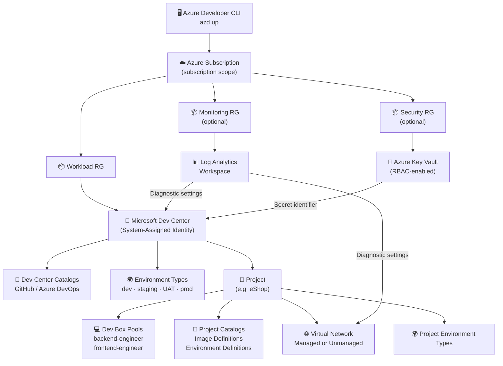

# Microsoft Dev Box Accelerator

[](./LICENSE)
[](https://learn.microsoft.com/en-us/azure/developer/azure-developer-cli/)
[](https://learn.microsoft.com/en-us/azure/azure-resource-manager/bicep/overview)
[](https://learn.microsoft.com/en-us/powershell/)

**DevExp-DevBox** is an Infrastructure-as-Code accelerator that provisions a
production-ready
[Microsoft Dev Box](https://learn.microsoft.com/en-us/azure/dev-box/overview-what-is-microsoft-dev-box)
platform on Azure using the Azure Developer CLI (`azd`). It automates the
end-to-end deployment of Dev Centers, projects, Dev Box pools, and all
supporting Azure infrastructure through declarative YAML configuration files and
Bicep templates.

The accelerator follows Azure Landing Zone principles, separating concerns
across dedicated resource groups for workload, security, and monitoring. It
integrates with GitHub or Azure DevOps as a catalog source, enabling teams to
version-control their Dev Box image definitions and environment configurations
alongside their application code.

By encoding every infrastructure decision as configuration, the accelerator
allows platform engineering teams to onboard new projects and developer personas
with minimal manual effort while enforcing consistent governance, RBAC, tagging,
and observability across all deployed Dev Box resources.

---

## Table of Contents

- [Features](#features)
- [Architecture](#architecture)
- [Technologies Used](#technologies-used)
- [Quick Start](#quick-start)
- [Configuration](#configuration)
- [Deployment](#deployment)
- [Usage](#usage)
- [Contributing](#contributing)
- [License](#license)

---

## Features

- 🚀 **One-command deployment** — provision the entire Dev Box platform with
  `azd up`
- 🏗️ **Landing Zone–aligned** — dedicated resource groups for workload,
  security, and monitoring
- 🔑 **Secrets management** — Azure Key Vault stores the source control token
  used by Dev Center catalogs; access is granted exclusively via Azure RBAC
- 📊 **Built-in observability** — Log Analytics workspace with diagnostic
  settings wired to every deployed resource
- 🔄 **Dual source control support** — integrate with **GitHub** or **Azure
  DevOps** catalogs
- 👤 **Role-specific Dev Box pools** — define separate pools per developer
  persona (e.g., backend engineer, frontend engineer) with tailored VM SKUs and
  image definitions
- 🌐 **Flexible networking** — deploy a new Unmanaged VNet per project or use
  the Microsoft-Hosted Managed Network
- 🔒 **Least-privilege RBAC** — automated role assignments at subscription,
  resource group, and project scopes following the
  [Dev Box deployment guide](https://learn.microsoft.com/en-us/azure/dev-box/concept-dev-box-deployment-guide)
- ⚙️ **Schema-validated YAML configuration** — all settings are backed by JSON
  schemas, giving IDE-level validation and auto-complete
- 🧹 **Clean-up automation** — `cleanSetUp.ps1` removes all deployed resources,
  role assignments, and service principal credentials

---

## Architecture

The following diagram shows the high-level structure of resources deployed by
this accelerator.


```mermaid
graph TD
    azd["🖥️ Azure Developer CLI\nazd up"]

    azd --> sub["☁️ Azure Subscription\n(subscription scope)"]

    sub --> monRG["📦 Monitoring RG\n(optional)"]
    sub --> secRG["📦 Security RG\n(optional)"]
    sub --> wkRG["📦 Workload RG"]

    monRG --> law["📊 Log Analytics\nWorkspace"]
    secRG --> kv["🔑 Azure Key Vault\n(RBAC-enabled)"]

    wkRG --> dc["🏢 Microsoft Dev Center\n(System-Assigned Identity)"]

    dc --> catalogs["📂 Dev Center Catalogs\nGitHub / Azure DevOps"]
    dc --> envTypes["🌍 Environment Types\ndev · staging · UAT · prod"]
    dc --> project["📁 Project\n(e.g. eShop)"]

    project --> pools["💻 Dev Box Pools\nbackend-engineer\nfrontend-engineer"]
    project --> projCat["📂 Project Catalogs\nImage Definitions\nEnvironment Definitions"]
    project --> vnet["🌐 Virtual Network\nManaged or Unmanaged"]
    project --> projEnv["🌍 Project Environment Types"]

    law -->|"Diagnostic settings"| dc
    law -->|"Diagnostic settings"| vnet
    kv -->|"Secret identifier"| dc
```

### Resource group strategy

| Resource Group | Resources                          | Created by default               |
| -------------- | ---------------------------------- | -------------------------------- |
| **Workload**   | Dev Center, projects, pools, VNets | ✅ Always                        |
| **Security**   | Azure Key Vault                    | Optional (can reuse Workload RG) |
| **Monitoring** | Log Analytics Workspace            | Optional (can reuse Workload RG) |

---

## Technologies Used

| Technology                                                                                                 | Purpose                                        |
| ---------------------------------------------------------------------------------------------------------- | ---------------------------------------------- |
| [Azure Developer CLI (azd)](https://learn.microsoft.com/en-us/azure/developer/azure-developer-cli/)        | Orchestrates the full provisioning lifecycle   |
| [Bicep](https://learn.microsoft.com/en-us/azure/azure-resource-manager/bicep/overview)                     | Infrastructure-as-Code for all Azure resources |
| [PowerShell 5.1+](https://learn.microsoft.com/en-us/powershell/)                                           | Windows setup and clean-up automation          |
| [Bash](https://www.gnu.org/software/bash/)                                                                 | Linux/macOS setup automation                   |
| [YAML + JSON Schema](https://json-schema.org/)                                                             | Schema-validated declarative configuration     |
| [Microsoft Dev Box](https://learn.microsoft.com/en-us/azure/dev-box/overview-what-is-microsoft-dev-box)    | Managed developer workstations                 |
| [Azure Key Vault](https://learn.microsoft.com/en-us/azure/key-vault/general/basic-concepts)                | Secret storage for catalog access tokens       |
| [Azure Log Analytics](https://learn.microsoft.com/en-us/azure/azure-monitor/logs/log-analytics-overview)   | Centralized logging and diagnostics            |
| [Azure Virtual Network](https://learn.microsoft.com/en-us/azure/virtual-network/virtual-networks-overview) | Project-scoped network isolation               |
| [Azure RBAC](https://learn.microsoft.com/en-us/azure/role-based-access-control/overview)                   | Least-privilege access control                 |

---

## Quick Start

### Prerequisites

| Tool                                                                                                     | Minimum version | Install                                                 |
| -------------------------------------------------------------------------------------------------------- | --------------- | ------------------------------------------------------- |
| [Azure CLI](https://learn.microsoft.com/en-us/cli/azure/install-azure-cli)                               | 2.60+           | `winget install Microsoft.AzureCLI`                     |
| [Azure Developer CLI](https://learn.microsoft.com/en-us/azure/developer/azure-developer-cli/install-azd) | 1.9+            | `winget install Microsoft.Azd`                          |
| [GitHub CLI](https://cli.github.com/) _(GitHub only)_                                                    | 2.40+           | `winget install GitHub.cli`                             |
| PowerShell                                                                                               | 5.1+            | Included in Windows; `brew install powershell` on macOS |
| Bash                                                                                                     | Any             | Included on Linux/macOS; Git Bash on Windows            |

You also need:

- An **Azure subscription** with the ability to create resource groups at the
  subscription scope.
- **Owner** or **User Access Administrator** permissions on the subscription
  (required for RBAC role assignments).
- A **GitHub personal access token** or **Azure DevOps personal access token**
  that has read access to your catalog repositories.

### Installation

```bash
# 1. Clone the repository
git clone https://github.com/Evilazaro/DevExp-DevBox.git
cd DevExp-DevBox

# 2. Authenticate with Azure
az login
azd auth login

# 3. Authenticate with GitHub (if using GitHub catalogs)
gh auth login

# 4. Initialize the azd environment
azd env new <your-environment-name>

# 5. Set required environment variables
azd env set AZURE_LOCATION eastus2
azd env set KEY_VAULT_SECRET <your-github-or-ado-pat>

# Optional: set source control platform (defaults to 'github')
azd env set SOURCE_CONTROL_PLATFORM github   # or adogit

# 6. Provision all resources
azd provision
```

> **Note:** `azd provision` automatically runs the pre-provision hook
> (`setUp.sh` / `setUp.ps1`) which validates dependencies and configures the
> environment before deploying Bicep templates.

---

## Configuration

All configuration lives under `infra/settings/`. Each file is backed by a JSON
schema for IDE-level validation.

### Resource organization — `infra/settings/resourceOrganization/azureResources.yaml`

Controls which resource groups are created and how they are named and tagged.

```yaml
workload:
  create: true # create the workload resource group
  name: devexp-workload # base name (suffixed with env + location)
  tags:
    environment: dev
    team: DevExP
    project: Contoso-DevExp-DevBox

security:
  create: false # set to true to use a dedicated security RG
  name: devexp-workload # reuses workload RG when create: false

monitoring:
  create: false # set to true to use a dedicated monitoring RG
  name: devexp-workload
```

| Field      | Default           | Description                               |
| ---------- | ----------------- | ----------------------------------------- |
| `*.create` | `true` / `false`  | Whether to provision a new resource group |
| `*.name`   | `devexp-workload` | Base name for the resource group          |
| `*.tags.*` | see file          | Azure resource tags applied to the group  |

### Security — `infra/settings/security/security.yaml`

Configures the Azure Key Vault instance used to store the source control token.

```yaml
create: true
keyVault:
  name: contoso # globally unique prefix (a unique suffix is appended automatically)
  secretName: gha-token # name of the secret that holds the PAT
  enablePurgeProtection: true
  enableSoftDelete: true
  softDeleteRetentionInDays: 7
  enableRbacAuthorization: true
```

| Field                                | Default     | Description                                             |
| ------------------------------------ | ----------- | ------------------------------------------------------- |
| `create`                             | `true`      | Set to `false` to skip Key Vault deployment             |
| `keyVault.name`                      | `contoso`   | Name prefix; a unique string is appended at deploy time |
| `keyVault.secretName`                | `gha-token` | Secret name that stores the PAT value                   |
| `keyVault.softDeleteRetentionInDays` | `7`         | Retention period (7–90 days)                            |
| `keyVault.enableRbacAuthorization`   | `true`      | Use Azure RBAC (recommended)                            |

### Dev Center & projects — `infra/settings/workload/devcenter.yaml`

The primary configuration file. Controls the Dev Center, catalogs, environment
types, and projects.

#### Dev Center settings

```yaml
name: devexp
catalogItemSyncEnableStatus: Enabled
microsoftHostedNetworkEnableStatus: Enabled
installAzureMonitorAgentEnableStatus: Enabled

identity:
  type: SystemAssigned
  roleAssignments:
    devCenter:
      - id: b24988ac-6180-42a0-ab88-20f7382dd24c
        name: Contributor
        scope: Subscription
```

#### Catalogs

```yaml
catalogs:
  - name: customTasks
    type: gitHub
    visibility: public
    uri: https://github.com/microsoft/devcenter-catalog.git
    branch: main
    path: ./Tasks
```

Set `type: adoGit` and update `uri` to point to an Azure DevOps repository when
using ADO.

#### Environment types

```yaml
environmentTypes:
  - name: dev
    deploymentTargetId: '' # empty = default subscription
  - name: staging
    deploymentTargetId: ''
  - name: uat
    deploymentTargetId: ''
```

#### Projects

Each entry under `projects:` provisions a full Dev Center project with its own
identity, VNet, catalogs, Dev Box pools, and RBAC assignments.

```yaml
projects:
  - name: eShop
    description: eShop project.
    network:
      name: eShop
      create: true
      virtualNetworkType: Managed # or Unmanaged
      addressPrefixes:
        - 10.0.0.0/16
      subnets:
        - name: eShop-subnet
          properties:
            addressPrefix: 10.0.1.0/24
    pools:
      - name: backend-engineer
        imageDefinitionName: eshop-backend-dev
        vmSku: general_i_32c128gb512ssd_v2
      - name: frontend-engineer
        imageDefinitionName: eshop-frontend-dev
        vmSku: general_i_16c64gb256ssd_v2
    environmentTypes:
      - name: dev
      - name: staging
      - name: UAT
    catalogs:
      - name: environments
        type: environmentDefinition
        sourceControl: gitHub
        visibility: private
        uri: https://github.com/Evilazaro/eShop.git
        branch: main
        path: /.devcenter/environments
      - name: devboxImages
        type: imageDefinition
        sourceControl: gitHub
        visibility: private
        uri: https://github.com/Evilazaro/eShop.git
        branch: main
        path: /.devcenter/imageDefinitions
```

### Environment variables

| Variable                  | Required | Description                                             |
| ------------------------- | -------- | ------------------------------------------------------- |
| `AZURE_ENV_NAME`          | ✅       | Environment name (2–10 characters; e.g., `dev`, `prod`) |
| `AZURE_LOCATION`          | ✅       | Azure region (e.g., `eastus2`)                          |
| `KEY_VAULT_SECRET`        | ✅       | GitHub PAT or Azure DevOps PAT stored in Key Vault      |
| `SOURCE_CONTROL_PLATFORM` | —        | `github` (default) or `adogit`                          |

Set variables with:

```bash
azd env set <VARIABLE_NAME> <value>
```

---

## Deployment

### Provision infrastructure

```bash
# Provision all Azure resources
azd provision
```

The pre-provision hook executes `setUp.sh` (Linux/macOS) or `setUp.ps1`
(Windows), which:

1. Validates required CLI tools are installed and authenticated.
2. Resolves the `SOURCE_CONTROL_PLATFORM` value.
3. Generates service principal credentials and stores them as a GitHub secret
   (`AZURE_CREDENTIALS`) or Azure DevOps variable, enabling CI/CD pipelines to
   authenticate with Azure.

### Supported regions

The following Azure regions are supported by the Bicep templates:

`eastus` · `eastus2` · `westus` · `westus2` · `westus3` · `centralus` ·
`northeurope` · `westeurope` · `southeastasia` · `australiaeast` · `japaneast` ·
`uksouth` · `canadacentral` · `swedencentral` · `switzerlandnorth` ·
`germanywestcentral`

### Clean up

To delete all deployed resources, role assignments, and service principal
credentials:

```powershell
# Windows
.\cleanSetUp.ps1 -EnvName "dev" -Location "eastus2"
```

| Parameter         | Default                                      | Description                              |
| ----------------- | -------------------------------------------- | ---------------------------------------- |
| `-EnvName`        | `gitHub`                                     | Environment name used in resource naming |
| `-Location`       | `eastus2`                                    | Azure region of deployed resources       |
| `-AppDisplayName` | `ContosoDevEx GitHub Actions Enterprise App` | Service principal display name           |
| `-GhSecretName`   | `AZURE_CREDENTIALS`                          | GitHub secret name to remove             |

---

## Usage

### Check deployment outputs

After `azd provision` completes, key outputs are printed to the console and
stored in the azd environment:

```text
WORKLOAD_AZURE_RESOURCE_GROUP_NAME   = devexp-workload-dev-eastus2-RG
SECURITY_AZURE_RESOURCE_GROUP_NAME   = devexp-workload-dev-eastus2-RG
MONITORING_AZURE_RESOURCE_GROUP_NAME = devexp-workload-dev-eastus2-RG
AZURE_LOG_ANALYTICS_WORKSPACE_NAME   = <workspace-name>
AZURE_KEY_VAULT_NAME                 = contoso-<unique>-kv
AZURE_KEY_VAULT_ENDPOINT             = https://contoso-<unique>-kv.vault.azure.net/
AZURE_DEV_CENTER_NAME                = devexp
AZURE_DEV_CENTER_PROJECTS            = ["eShop"]
```

Retrieve any output value with:

```bash
azd env get-value AZURE_DEV_CENTER_NAME
```

### Add a new project

1. Open `infra/settings/workload/devcenter.yaml`.
2. Append a new entry under the `projects:` list following the existing `eShop`
   example.
3. Run `azd provision` to apply the changes.

### Add a new Dev Box pool

Locate your project entry in `devcenter.yaml` and add an item to its `pools:`
list:

```yaml
pools:
  - name: data-engineer
    imageDefinitionName: eshop-data-dev
    vmSku: general_i_16c64gb512ssd_v2
```

### Connect a private catalog

Update the `catalogs:` section of your project (or the Dev Center) with the
repository details and ensure the PAT stored in Key Vault has read access to
that repository.

---

## Contributing

Contributions are welcome. Please follow these steps:

1. Fork the repository and create a feature branch from `main`.
2. Make your changes, ensuring all Bicep files compile without errors
   (`az bicep build`).
3. Validate configuration YAML files against their schemas.
4. Submit a pull request with a clear description of the change and its
   motivation.

---

## License

This project is licensed under the [MIT License](./LICENSE).
