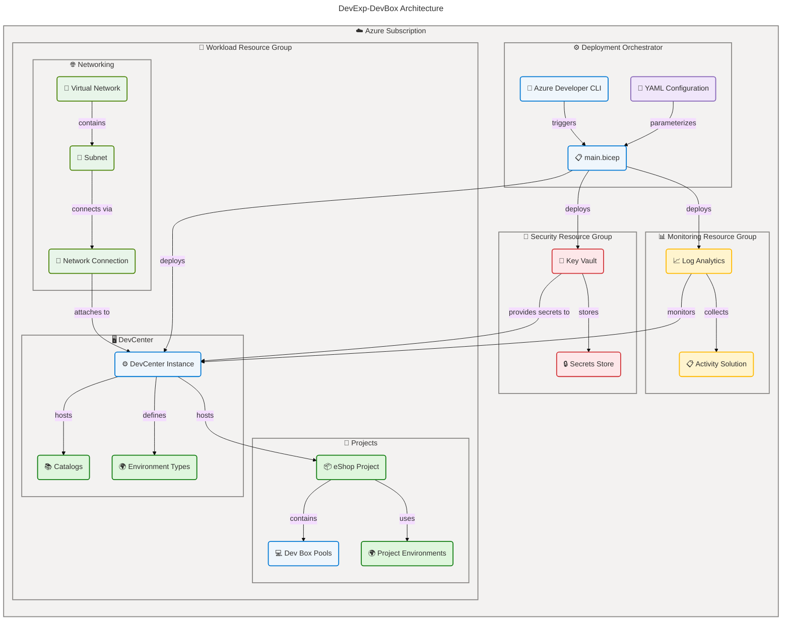

# DevExp-DevBox

[](LICENSE)
[](https://azure.microsoft.com)
[](https://learn.microsoft.com/azure/azure-resource-manager/bicep/)
[]()

## Overview

**Overview**

DevExp-DevBox is a Microsoft Dev Box adoption and deployment accelerator that
provisions enterprise-grade developer environments on Azure. It enables platform
engineering teams to deliver self-service, cloud-powered workstations to
developers through Azure DevCenter and Dev Box, reducing onboarding time from
days to minutes.

> 💡 **Why This Matters**: Developer environment inconsistency and lengthy
> onboarding are top productivity killers in enterprise teams. DevExp-DevBox
> eliminates these issues by codifying your entire developer platform — from
> networking and security to Dev Box pools and environment types — as
> Infrastructure as Code, deployable with a single command.

> 📌 **How It Works**: The accelerator uses Azure Bicep templates with
> YAML-driven configuration to deploy a complete DevCenter ecosystem. It creates
> three resource groups (security, monitoring, workload), provisions Key Vault,
> Log Analytics, and Virtual Networks, then deploys DevCenter with projects,
> pools, catalogs, and environment types — all parameterized through
> human-readable YAML files and deployable via the Azure Developer CLI (`azd`).

## Table of Contents

- [Overview](#overview)
- [Architecture](#architecture)
- [Features](#features)
- [Requirements](#requirements)
- [Configuration](#configuration)
- [Quick Start](#quick-start)
- [Deployment](#deployment)
- [Usage](#usage)
- [Project Structure](#project-structure)
- [Contributing](#contributing)
- [License](#license)

## Architecture

**Overview**

The accelerator follows an Azure Landing Zone pattern with subscription-scoped
Bicep deployments organized into three resource groups: security, monitoring,
and workload. The orchestrator module (`infra/main.bicep`) manages dependency
chaining across these layers to ensure resources are provisioned in the correct
order.


```mermaid
---
title: "DevExp-DevBox Architecture"
config:
  theme: base
  look: classic
  layout: dagre
  flowchart:
    htmlLabels: true
---
flowchart TB
    accTitle: DevExp-DevBox Architecture
    accDescr: Shows the Azure infrastructure architecture with three resource group layers for security, monitoring, and workload including DevCenter, Dev Box pools, Key Vault, Log Analytics, and networking components

    %% ═══════════════════════════════════════════════════════════════════════════
    %% AZURE / FLUENT ARCHITECTURE PATTERN v1.1
    %% (Semantic + Structural + Font + Accessibility Governance)
    %% ═══════════════════════════════════════════════════════════════════════════
    %% PHASE 1 - FLUENT UI: All styling uses approved Fluent UI palette only
    %% PHASE 2 - GROUPS: Every subgraph has semantic color via style directive
    %% PHASE 3 - COMPONENTS: Every node has semantic classDef + icon prefix
    %% PHASE 4 - ACCESSIBILITY: accTitle/accDescr present, WCAG AA contrast
    %% PHASE 5 - STANDARD: Governance block present, classDefs centralized
    %% ═══════════════════════════════════════════════════════════════════════════

    subgraph subscription ["☁️ Azure Subscription"]
        direction TB

        subgraph orchestrator ["⚙️ Deployment Orchestrator"]
            direction LR
            azd("🚀 Azure Developer CLI"):::core
            main("📋 main.bicep"):::core
            yaml("📁 YAML Configuration"):::data
            azd -->|"triggers"| main
            yaml -->|"parameterizes"| main
        end

        subgraph securityRG ["🔐 Security Resource Group"]
            direction LR
            kv("🔑 Key Vault"):::danger
            secrets("🔒 Secrets Store"):::danger
            kv -->|"stores"| secrets
        end

        subgraph monitoringRG ["📊 Monitoring Resource Group"]
            direction LR
            la("📈 Log Analytics"):::warning
            activity("📋 Activity Solution"):::warning
            la -->|"collects"| activity
        end

        subgraph workloadRG ["🏢 Workload Resource Group"]
            direction TB

            subgraph devCenter ["🖥️ DevCenter"]
                direction LR
                dc("⚙️ DevCenter Instance"):::core
                catalog("📚 Catalogs"):::success
                envTypes("🌍 Environment Types"):::success
                dc -->|"hosts"| catalog
                dc -->|"defines"| envTypes
            end

            subgraph projects ["📂 Projects"]
                direction LR
                project("📦 eShop Project"):::success
                pools("💻 Dev Box Pools"):::core
                envType("🌍 Project Environments"):::success
                project -->|"contains"| pools
                project -->|"uses"| envType
            end

            subgraph networking ["🌐 Networking"]
                direction LR
                vnet("🔗 Virtual Network"):::external
                subnet("📍 Subnet"):::external
                nc("🔌 Network Connection"):::external
                vnet -->|"contains"| subnet
                subnet -->|"connects via"| nc
            end

            dc -->|"hosts"| project
            nc -->|"attaches to"| dc
        end

        main -->|"deploys"| kv
        main -->|"deploys"| la
        main -->|"deploys"| dc
        kv -->|"provides secrets to"| dc
        la -->|"monitors"| dc
    end

    style subscription fill:#F3F2F1,stroke:#8A8886,stroke-width:2px,color:#323130
    style orchestrator fill:#F3F2F1,stroke:#8A8886,stroke-width:2px,color:#323130
    style securityRG fill:#F3F2F1,stroke:#8A8886,stroke-width:2px,color:#323130
    style monitoringRG fill:#F3F2F1,stroke:#8A8886,stroke-width:2px,color:#323130
    style workloadRG fill:#F3F2F1,stroke:#8A8886,stroke-width:2px,color:#323130
    style devCenter fill:#F3F2F1,stroke:#8A8886,stroke-width:2px,color:#323130
    style projects fill:#F3F2F1,stroke:#8A8886,stroke-width:2px,color:#323130
    style networking fill:#F3F2F1,stroke:#8A8886,stroke-width:2px,color:#323130

    %% Centralized semantic classDefs (Phase 5 compliant)
    classDef neutral fill:#FAFAFA,stroke:#8A8886,stroke-width:2px,color:#323130
    classDef core fill:#EFF6FC,stroke:#0078D4,stroke-width:2px,color:#323130
    classDef success fill:#DFF6DD,stroke:#107C10,stroke-width:2px,color:#323130
    classDef warning fill:#FFF4CE,stroke:#FFB900,stroke-width:2px,color:#323130
    classDef danger fill:#FDE7E9,stroke:#D13438,stroke-width:2px,color:#323130
    classDef data fill:#F0E6FA,stroke:#8764B8,stroke-width:2px,color:#323130
    classDef external fill:#E8F5E9,stroke:#498205,stroke-width:2px,color:#323130
```

**Component Roles:**

| Component              | Role                                                        | Source                                    |
| ---------------------- | ----------------------------------------------------------- | ----------------------------------------- |
| 🚀 Azure Developer CLI | Orchestrates deployment lifecycle                           | `azure.yaml`                              |
| 📋 main.bicep          | Subscription-scoped deployment orchestrator                 | `infra/main.bicep`                        |
| 🔑 Key Vault           | Stores secrets with RBAC, soft delete, and purge protection | `src/security/keyVault.bicep`             |
| 📈 Log Analytics       | Centralized monitoring with AzureActivity solution          | `src/management/logAnalytics.bicep`       |
| ⚙️ DevCenter           | Core developer platform service with managed identity       | `src/workload/core/devCenter.bicep`       |
| 📚 Catalogs            | GitHub-hosted task and image definition catalogs            | `src/workload/core/catalog.bicep`         |
| 💻 Dev Box Pools       | Pre-configured developer workstation pools                  | `src/workload/project/projectPool.bicep`  |
| 🌍 Environment Types   | Deployment targets (dev, staging, UAT)                      | `src/workload/core/environmentType.bicep` |
| 🔗 Virtual Network     | Network isolation for Dev Box pools                         | `src/connectivity/connectivity.bicep`     |

## Features

**Overview**

DevExp-DevBox provides a complete platform engineering toolkit for provisioning
and managing developer environments at scale. It addresses the core challenges
of developer onboarding, environment consistency, and infrastructure governance
that enterprise teams face when adopting cloud-powered workstations.

> 💡 **Why This Matters**: Manual environment setup wastes engineering hours and
> introduces configuration drift. This accelerator automates the entire
> developer platform lifecycle, letting platform teams define environments
> declaratively and developers self-serve instantly.

> 📌 **How It Works**: Each feature maps to a modular Bicep template, configured
> through YAML files under `infra/settings/`, and deployed as a cohesive unit
> through the Azure Developer CLI.

| Feature                   | Description                                                                                 | Status    |
| ------------------------- | ------------------------------------------------------------------------------------------- | --------- |
| 🏢 DevCenter Provisioning | Deploys Azure DevCenter with managed identity, catalogs, and environment types              | ✅ Stable |
| 💻 Dev Box Pools          | Configures VM-backed developer workstation pools with custom SKUs (e.g., 32c128gb, 16c64gb) | ✅ Stable |
| 🔐 Security Layer         | Key Vault with RBAC authorization, soft delete, and purge protection                        | ✅ Stable |
| 📊 Centralized Monitoring | Log Analytics workspace with Azure Activity diagnostic solution                             | ✅ Stable |
| 🌐 Network Connectivity   | Virtual Network provisioning with DevCenter network connections (Managed or Unmanaged)      | ✅ Stable |
| 🔑 RBAC Management        | Role assignments for DevCenter, projects, and Key Vault access via Azure AD groups          | ✅ Stable |
| 📁 YAML-Driven Config     | Human-readable YAML files with JSON Schema validation for all infrastructure parameters     | ✅ Stable |

## Requirements

**Overview**

Before deploying DevExp-DevBox, ensure your environment meets the prerequisites
below. The accelerator requires Azure CLI tooling and appropriate
subscription-level permissions to create resource groups and assign roles.

> 💡 **Why This Matters**: Subscription-scoped Bicep deployments require
> elevated permissions compared to resource-group-scoped deployments. Verifying
> prerequisites upfront prevents partial deployments and permission-related
> failures.

> 📌 **How It Works**: The setup scripts (`setUp.ps1` and `setUp.sh`) validate
> prerequisites, configure the Azure Developer CLI environment, and authenticate
> before provisioning begins.

| Requirement            | Details                                                                         | Required    |
| ---------------------- | ------------------------------------------------------------------------------- | ----------- |
| ☁️ Azure Subscription  | Active subscription with Owner or Contributor + User Access Administrator roles | ✅ Yes      |
| 🛠️ Azure CLI           | Version 2.x or later (`az`)                                                     | ✅ Yes      |
| 🚀 Azure Developer CLI | `azd` installed and authenticated                                               | ✅ Yes      |
| 💻 PowerShell          | Version 5.1+ (Windows) or PowerShell Core 7+ (cross-platform)                   | ✅ Yes      |
| 🐧 Bash                | Required for `setUp.sh` on Linux/macOS                                          | ⚡ Optional |
| 🔑 GitHub CLI          | `gh` for GitHub authentication token provisioning                               | ⚡ Optional |
| 📦 jq                  | JSON processor required by `setUp.sh`                                           | ⚡ Optional |

## Configuration

**Overview**

All infrastructure parameters are defined in YAML configuration files under
`infra/settings/`. This declarative approach separates configuration from
deployment logic, making it straightforward to customize environments without
modifying Bicep templates directly.

> 💡 **Why This Matters**: YAML-driven configuration enables platform teams to
> manage environments through version-controlled file edits rather than
> requiring Bicep expertise for every modification.

> 📌 **How It Works**: The Bicep orchestrator (`infra/main.bicep`) loads YAML
> files at deployment time using the `loadYamlContent()` function, converting
> human-readable settings into typed Bicep parameters automatically.

### Resource Organization

Configure resource groups and tagging in
`infra/settings/resourceOrganization/azureResources.yaml`:

```yaml
resourceGroups:
  - name: devexp-workload
    suffix: workload
    tags:
      environment: dev
      division: Platforms
      team: DevExP
      project: Contoso-DevExp-DevBox
      costCenter: IT
      owner: Contoso
  - name: devexp-security
    suffix: security
  - name: devexp-monitoring
    suffix: monitoring
```

### DevCenter Configuration

Define DevCenter, projects, pools, and catalogs in
`infra/settings/workload/devcenter.yaml`:

```yaml
name: devexp-devcenter
identity:
  type: SystemAssigned
catalogs:
  - name: Tasks
    type: gitHub
    uri: https://github.com/microsoft/devcenter-catalog.git
    branch: main
    path: Tasks
environmentTypes:
  - name: dev
  - name: staging
  - name: UAT
projects:
  - name: eShop
    pools:
      - name: backend-engineer
        vmSku: sku_v5_32c128gb
      - name: frontend-engineer
        vmSku: sku_v5_16c64gb
```

### Security Configuration

Configure Key Vault settings in `infra/settings/security/security.yaml`:

```yaml
name: contoso
enableRbacAuthorization: true
enableSoftDelete: true
softDeleteRetentionInDays: 7
enablePurgeProtection: true
```

> [!NOTE] All YAML configuration files have corresponding JSON Schema files
> (`.schema.json`) in the same directory for validation and editor
> auto-completion support.

## Quick Start

**1. Clone the repository:**

```bash
git clone https://github.com/Evilazaro/DevExp-DevBox.git
cd DevExp-DevBox
```

**2. Authenticate with Azure:**

```bash
az login
azd auth login
```

**3. Run the setup script:**

On Windows (PowerShell):

```powershell
.\setUp.ps1
```

On Linux/macOS (Bash):

```bash
chmod +x setUp.sh
./setUp.sh
```

**Expected output:**

```text
Setting environment name...
Environment name set to: ContosoDevExp
Logging in to Azure...
Successfully logged in to Azure
Provisioning Azure resources...
SUCCESS: Azure resources provisioned
```

> [!TIP] The setup scripts handle `azd` environment initialization,
> authentication, and resource provisioning in a single step. Review `setUp.ps1`
> or `setUp.sh` to inspect the full workflow before running.

## Deployment

### Automated Deployment (Recommended)

The setup scripts automate the entire deployment lifecycle including environment
creation, authentication, and provisioning:

```powershell
# Windows
.\setUp.ps1
```

```bash
# Linux/macOS
./setUp.sh
```

### Manual Deployment

For granular control, use Azure Developer CLI commands directly:

```bash
# Initialize environment
azd env new ContosoDevExp

# Set Azure location
azd env set AZURE_LOCATION eastus2

# Provision infrastructure
azd provision
```

### Cleanup

Remove all deployed resources, role assignments, and credentials:

```powershell
.\cleanSetUp.ps1
```

> [!WARNING] The cleanup script (`cleanSetUp.ps1`) deletes all resource groups,
> role assignments, service principals, and GitHub secrets created by this
> accelerator. This action is irreversible.

## Usage

### Customizing Projects

Add a new project by extending the projects array in
`infra/settings/workload/devcenter.yaml`:

```yaml
projects:
  - name: eShop
    description: 'eShop developer project'
    pools:
      - name: backend-engineer
        vmSku: sku_v5_32c128gb
  - name: my-new-project
    description: 'Custom developer project'
    pools:
      - name: dev-pool
        vmSku: sku_v5_16c64gb
```

### Adding Environment Types

Define additional environment types for your DevCenter in
`infra/settings/workload/devcenter.yaml`:

```yaml
environmentTypes:
  - name: dev
  - name: staging
  - name: UAT
  - name: production
```

### Modifying Network Configuration

Customize virtual network settings per project in the project network
configuration:

```yaml
network:
  virtualNetworkType: Managed
  addressPrefixes:
    - '10.0.0.0/16'
  subnets:
    - name: default
      properties:
        addressPrefix: '10.0.0.0/24'
```

After modifying any configuration file, redeploy with `azd provision` to apply
changes.

## Project Structure

| Path                                      | Description                                             |
| ----------------------------------------- | ------------------------------------------------------- |
| 📋 `infra/main.bicep`                     | Subscription-scoped deployment orchestrator             |
| 📁 `infra/settings/resourceOrganization/` | Resource group and tagging configuration                |
| 📁 `infra/settings/workload/`             | DevCenter, projects, pools, and catalog configuration   |
| 📁 `infra/settings/security/`             | Key Vault and security configuration                    |
| 🏢 `src/workload/core/`                   | DevCenter, catalog, and environment type modules        |
| 📂 `src/workload/project/`                | Project, pool, catalog, and environment type modules    |
| 🔐 `src/security/`                        | Key Vault provisioning and secret management            |
| 🌐 `src/connectivity/`                    | Virtual network and network connection modules          |
| 📊 `src/management/`                      | Log Analytics workspace and monitoring solution         |
| 🔑 `src/identity/`                        | RBAC role assignment modules for DevCenter and projects |
| ⚙️ `azure.yaml`                           | Azure Developer CLI project configuration               |
| 🛠️ `setUp.ps1`                            | Windows PowerShell setup and provisioning script        |
| 🐧 `setUp.sh`                             | Linux/macOS Bash setup and provisioning script          |
| 🧹 `cleanSetUp.ps1`                       | Infrastructure cleanup and teardown script              |

## Contributing

**Overview**

This project follows a product-oriented delivery model organized around Epics,
Features, and Tasks. Contributions are welcome from the community, and the
development workflow uses structured branching and standardized engineering
practices to maintain infrastructure quality.

> 💡 **Why This Matters**: A consistent contribution workflow ensures code
> quality, reduces review friction, and maintains the reliability of
> infrastructure templates that teams depend on for production developer
> environments.

> 📌 **How It Works**: Contributors create feature branches following naming
> conventions, adhere to Bicep and PowerShell coding standards, and submit pull
> requests for review. See `CONTRIBUTING.md` for the complete contribution guide
> including branching conventions and engineering standards.

### Branch Naming Convention

| Branch Type | Pattern                  | Example                |
| ----------- | ------------------------ | ---------------------- |
| ✨ Feature  | `feature/<feature-name>` | `feature/add-gpu-pool` |
| 🔧 Task     | `task/<task-name>`       | `task/update-docs`     |
| 🐛 Fix      | `fix/<fix-name>`         | `fix/keyvault-access`  |
| 📝 Docs     | `docs/<doc-name>`        | `docs/setup-guide`     |

### Engineering Standards

- 🏗️ Bicep templates must be parameterized and idempotent
- 💻 PowerShell scripts target version 7+
- 📄 Documentation follows docs-as-code principles
- ✅ All changes require pull request review

## License

This project is licensed under the **MIT License**. See [LICENSE](LICENSE) for
details.

Copyright (c) 2025 Evilazaro Alves
