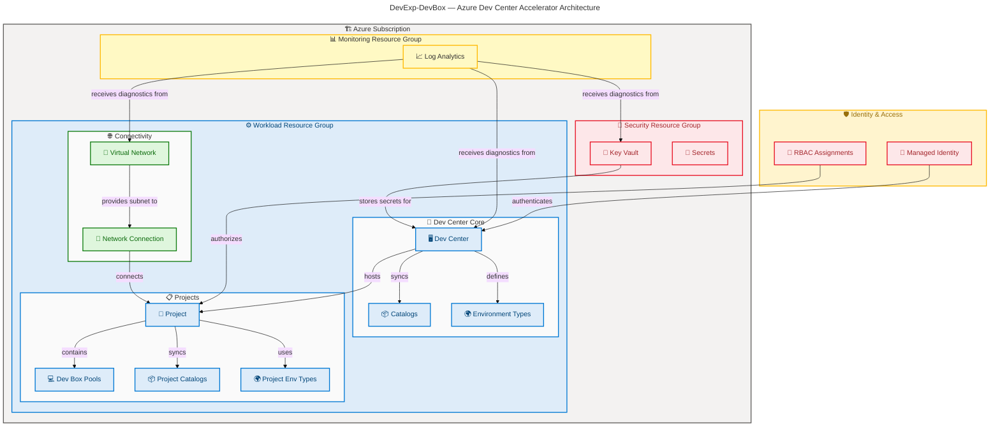

# DevExp-DevBox

[](LICENSE)
[](https://learn.microsoft.com/en-us/azure/dev-box/overview-what-is-microsoft-dev-box)
[](https://learn.microsoft.com/en-us/azure/azure-resource-manager/bicep/overview)
[](https://learn.microsoft.com/en-us/azure/developer/azure-developer-cli/overview)
[](#)

A production-ready Infrastructure as Code (IaC) accelerator that automates the
provisioning of Microsoft Dev Box environments using Azure Bicep and Azure
Developer CLI (`azd`). It deploys a fully configured Azure Dev Center with
project workspaces, Dev Box pools, networking, identity, security, and
monitoring — enabling platform engineering teams to deliver self-service
developer workstations in minutes.

## Overview

**Overview**

DevExp-DevBox eliminates the complexity of manually configuring Azure Dev Center
infrastructure by providing a modular, declarative Bicep template suite that
follows Azure Landing Zone principles. Platform engineers and DevOps teams can
use this accelerator to stand up enterprise-grade developer environments with
consistent governance, security, and observability from day one.

The accelerator uses a YAML-driven configuration model that separates resource
organization, security policies, and workload definitions into independently
manageable files. Deployment is orchestrated through Azure Developer CLI
(`azd`), with cross-platform setup scripts for both Windows (PowerShell) and
Linux/macOS (Bash) that handle authentication, environment initialization, and
resource provisioning in a single workflow.

> [!TIP] If you are new to Microsoft Dev Box, start with the
> [official documentation](https://learn.microsoft.com/en-us/azure/dev-box/overview-what-is-microsoft-dev-box)
> to understand the core concepts before deploying this accelerator.

## Table of Contents

- [DevExp-DevBox](#devexp-devbox)
  - [Overview](#overview)
  - [Architecture](#architecture)
  - [Features](#features)
  - [Requirements](#requirements)
  - [Quick Start](#quick-start)
  - [Deployment](#deployment)
  - [Configuration](#configuration)
  - [Usage](#usage)
  - [Contributing](#contributing)
  - [License](#license)

## Architecture

**Overview**

The system follows a modular, layered architecture aligned with Azure Landing
Zone principles. Resources are organized into three functional resource groups —
Security, Monitoring, and Workload — each with dedicated Bicep modules and clear
dependency chains. The Workload layer contains the Dev Center core and
project-level resources, including pools, catalogs, environment types, and
network connectivity.


```mermaid
---
title: "DevExp-DevBox — Azure Dev Center Accelerator Architecture"
config:
  theme: base
  look: classic
  layout: dagre
  themeVariables:
    fontSize: '16px'
  flowchart:
    htmlLabels: true
---
flowchart TB
    accTitle: DevExp-DevBox Architecture
    accDescr: Shows the modular architecture with Security, Monitoring, and Workload resource groups and their components

    %% ═══════════════════════════════════════════════════════════════════════════
    %% AZURE / FLUENT ARCHITECTURE PATTERN v1.1
    %% PHASE 1 - STRUCTURAL: Direction explicit, flat topology, nesting ≤ 3
    %% PHASE 2 - SEMANTIC: Colors justified, max 5 semantic classes, neutral-first
    %% PHASE 3 - FONT: Dark text on light backgrounds, contrast ≥ 4.5:1
    %% PHASE 4 - ACCESSIBILITY: accTitle/accDescr present, icons on all nodes
    %% PHASE 5 - STANDARD: Governance block present, classDefs centralized
    %% ═══════════════════════════════════════════════════════════════════════════
    %% SEMANTIC COLOR LEGEND:
    %%   core       (#DEECF9) — Dev Center & project resources
    %%   security   (#FDE7E9) — Key Vault, secrets, RBAC, identity
    %%   monitoring (#FFF9C4) — Log Analytics, diagnostics
    %%   network    (#DFF6DD) — VNet, network connections
    %% ═══════════════════════════════════════════════════════════════════════════

    subgraph platform["🏗️ Azure Subscription"]
        direction TB

        subgraph securityRG["🔐 Security Resource Group"]
            direction LR
            kv["🔑 Key Vault"]:::security
            secret["📝 Secrets"]:::security
        end

        subgraph monitoringRG["📊 Monitoring Resource Group"]
            direction LR
            la["📈 Log Analytics"]:::monitoring
        end

        subgraph workloadRG["⚙️ Workload Resource Group"]
            direction TB

            subgraph core["🏢 Dev Center Core"]
                direction LR
                dc["🖥️ Dev Center"]:::core
                cat["📦 Catalogs"]:::core
                env["🌍 Environment Types"]:::core
            end

            subgraph projects["📋 Projects"]
                direction LR
                proj["📁 Project"]:::core
                pool["💻 Dev Box Pools"]:::core
                pcat["📦 Project Catalogs"]:::core
                penv["🌍 Project Env Types"]:::core
            end

            subgraph connectivity["🌐 Connectivity"]
                direction LR
                vnet["🔗 Virtual Network"]:::network
                nc["🔌 Network Connection"]:::network
            end
        end
    end

    subgraph identity["🛡️ Identity & Access"]
        direction LR
        rbac["👤 RBAC Assignments"]:::security
        mi["🪪 Managed Identity"]:::security
    end

    kv -->|"stores secrets for"| dc
    la -->|"receives diagnostics from"| dc
    la -->|"receives diagnostics from"| kv
    la -->|"receives diagnostics from"| vnet
    dc -->|"hosts"| proj
    dc -->|"syncs"| cat
    dc -->|"defines"| env
    proj -->|"contains"| pool
    proj -->|"syncs"| pcat
    proj -->|"uses"| penv
    nc -->|"connects"| proj
    vnet -->|"provides subnet to"| nc
    mi -->|"authenticates"| dc
    rbac -->|"authorizes"| proj

    %% ============================================
    %% SUBGRAPH STYLING (8 subgraphs = 8 directives)
    %% ============================================
    style platform fill:#F3F2F1,stroke:#605E5C,stroke-width:2px,color:#323130
    style securityRG fill:#FDE7E9,stroke:#E81123,stroke-width:2px,color:#A4262C
    style monitoringRG fill:#FFF9C4,stroke:#FFB900,stroke-width:2px,color:#323130
    style workloadRG fill:#DEECF9,stroke:#0078D4,stroke-width:2px,color:#004578
    style core fill:#FAFAFA,stroke:#0078D4,stroke-width:2px,color:#323130
    style projects fill:#FAFAFA,stroke:#0078D4,stroke-width:2px,color:#323130
    style connectivity fill:#FAFAFA,stroke:#107C10,stroke-width:2px,color:#323130
    style identity fill:#FFF4CE,stroke:#FFB900,stroke-width:2px,color:#986F0B

    %% classDef declarations (centralized, 4 semantic classes ≤ 5 max)
    classDef core fill:#DEECF9,stroke:#0078D4,stroke-width:2px,color:#004578
    classDef security fill:#FDE7E9,stroke:#E81123,stroke-width:2px,color:#A4262C
    classDef monitoring fill:#FFF9C4,stroke:#FFB900,stroke-width:2px,color:#323130
    classDef network fill:#DFF6DD,stroke:#107C10,stroke-width:2px,color:#0B6A0B
```

**Component Roles:**

| Component             | Purpose                                                              | Module Path                                |
| --------------------- | -------------------------------------------------------------------- | ------------------------------------------ |
| 🔑 Key Vault          | Stores secrets (e.g., GitHub PAT) with RBAC authorization            | `src/security/keyVault.bicep`              |
| 📝 Secrets            | Manages individual secret entries in Key Vault                       | `src/security/secret.bicep`                |
| 📈 Log Analytics      | Centralized monitoring workspace for all resources                   | `src/management/logAnalytics.bicep`        |
| 🖥️ Dev Center         | Core platform for Dev Box and environment management                 | `src/workload/core/devCenter.bicep`        |
| 📦 Catalogs           | Git-synced repos with Dev Box images and environment definitions     | `src/workload/core/catalog.bicep`          |
| 🌍 Environment Types  | SDLC stages (dev, staging, UAT) for deployment environments          | `src/workload/core/environmentType.bicep`  |
| 📁 Project            | Isolated workspace per team with its own pools, catalogs, and access | `src/workload/project/project.bicep`       |
| 💻 Dev Box Pools      | VM-backed developer workstation pools with role-specific SKUs        | `src/workload/project/projectPool.bicep`   |
| 🔗 Virtual Network    | Unmanaged VNet with customizable subnets for project connectivity    | `src/connectivity/vnet.bicep`              |
| 🔌 Network Connection | Attaches VNet subnets to Dev Center for Dev Box networking           | `src/connectivity/networkConnection.bicep` |
| 👤 RBAC               | Role assignments at subscription, resource group, and project scopes | `src/identity/`                            |
| 🪪 Managed Identity   | System-assigned identities for Dev Center and projects               | `src/workload/core/devCenter.bicep`        |

## Features

**Overview**

This accelerator provides a comprehensive suite of capabilities that cover the
entire lifecycle of Dev Box environment provisioning — from infrastructure setup
through security hardening to day-2 operations. Each feature is designed to be
modular and independently configurable through YAML settings files.

> [!NOTE] All features follow the principle of least privilege for identity and
> access management, and every deployed resource sends diagnostic data to a
> centralized Log Analytics workspace.

| Feature                    | Description                                                                                              | Status    |
| -------------------------- | -------------------------------------------------------------------------------------------------------- | --------- |
| 🖥️ Dev Center Provisioning | Deploys a fully configured Azure Dev Center with managed identity, catalog sync, and Azure Monitor agent | ✅ Stable |
| 💻 Dev Box Pool Management | Creates role-specific Dev Box pools with configurable VM SKUs and image definitions from Git catalogs    | ✅ Stable |
| 🌍 Environment Types       | Defines SDLC environments (dev, staging, UAT) with subscription-scoped deployment targets                | ✅ Stable |
| 📦 Git Catalog Integration | Syncs Dev Box image definitions and environment definitions from GitHub or Azure DevOps repositories     | ✅ Stable |
| 🔗 Network Connectivity    | Provisions managed or unmanaged VNets with subnet configuration and Dev Center network attachments       | ✅ Stable |
| 🔐 Security & Secrets      | Deploys Azure Key Vault with RBAC authorization, purge protection, soft delete, and secret management    | ✅ Stable |
| 📈 Centralized Monitoring  | Configures Log Analytics with diagnostic settings on all resources (Key Vault, VNet, Dev Center)         | ✅ Stable |

## Requirements

**Overview**

Before deploying DevExp-DevBox, you need an Azure subscription with sufficient
permissions and a set of CLI tools installed on your workstation. The
accelerator supports both Windows and Linux/macOS environments through dedicated
setup scripts that validate prerequisites automatically.

The setup scripts check for required tools at runtime and provide actionable
error messages if any dependency is missing. Administrator-level Azure
permissions are required because the accelerator creates resource groups,
assigns RBAC roles at the subscription scope, and deploys Key Vault with access
policies.

| Requirement                    | Minimum Version       | Purpose                                                                          |
| ------------------------------ | --------------------- | -------------------------------------------------------------------------------- |
| ☁️ Azure Subscription          | N/A                   | Target subscription with Owner or Contributor + User Access Administrator roles  |
| 🔧 Azure CLI                   | 2.50+                 | Azure resource management and authentication                                     |
| 🚀 Azure Developer CLI (`azd`) | 1.0+                  | Deployment orchestration and environment management                              |
| 🐙 GitHub CLI (`gh`)           | 2.0+                  | GitHub authentication and PAT token retrieval (when using GitHub source control) |
| 💻 PowerShell                  | 5.1+ (7+ recommended) | Windows setup and cleanup automation                                             |
| 🐧 Bash                        | 4.0+                  | Linux/macOS setup automation                                                     |
| 📋 jq                          | 1.6+                  | JSON processing in Bash scripts                                                  |

> [!IMPORTANT] You must be authenticated with both Azure CLI (`az login`) and
> GitHub CLI (`gh auth login`) before running the setup scripts. The scripts
> will validate authentication status and fail fast with clear messages if not
> authenticated.

## Quick Start

Deploy a Dev Box environment in three steps:

**1. Clone the repository**

```bash
git clone https://github.com/Evilazaro/DevExp-DevBox.git
cd DevExp-DevBox
```

**2. Run the setup script**

On Linux/macOS:

```bash
chmod +x setUp.sh
./setUp.sh -e "dev" -s "github"
```

On Windows (PowerShell):

```powershell
.\setUp.ps1 -EnvName "dev" -SourceControl "github"
```

**3. Verify deployment**

```bash
azd env list
az resource list --resource-group "devexp-workload-dev-eastus-RG" --output table
```

The setup script handles Azure authentication, environment initialization,
GitHub token retrieval, and `azd provision` in a single workflow.

## Deployment

**Overview**

Deployment is orchestrated through Azure Developer CLI (`azd`), which reads the
`azure.yaml` configuration and executes pre-provision hooks to prepare the
environment before deploying the Bicep templates. The accelerator provides two
`azure.yaml` variants: one for Linux/macOS (Bash) and one for Windows
(PowerShell).

### Deployment Workflow

1. **Pre-provision hook** validates prerequisites, authenticates with Azure and
   GitHub, retrieves the GitHub PAT token, and initializes the `azd` environment
2. **Bicep deployment** creates three resource groups (Security, Monitoring,
   Workload) and deploys all modules with dependency ordering
3. **Outputs** surface resource names and IDs (Dev Center, Key Vault, Log
   Analytics, projects) as `azd` environment variables

### Step-by-Step Deployment

**Initialize the environment:**

```bash
azd init --environment "dev"
```

**Set required parameters:**

```bash
azd env set AZURE_LOCATION "eastus2"
azd env set SOURCE_CONTROL_PLATFORM "github"
```

**Provision all resources:**

```bash
azd up
```

> [!NOTE] The `azd up` command runs both the pre-provision hook and the Bicep
> deployment. If you need to re-run only the infrastructure deployment without
> re-executing the setup script, use `azd provision` instead.

### Windows Deployment

For Windows environments, rename `azure-pwh.yaml` to `azure.yaml` (backup the
original first):

```powershell
Copy-Item azure.yaml azure-bash.yaml
Copy-Item azure-pwh.yaml azure.yaml
azd up
```

### Cleanup

To remove all deployed resources, role assignments, and GitHub secrets:

```powershell
.\cleanSetUp.ps1 -EnvName "dev" -Location "eastus2"
```

The cleanup script removes subscription deployments, user role assignments,
service principals, GitHub secrets, and resource groups.

## Configuration

**Overview**

All infrastructure settings are defined in YAML configuration files under
`infra/settings/`. This declarative approach separates configuration from
infrastructure code, making it easy to customize environments without modifying
Bicep templates. Each configuration file has an associated JSON Schema for
validation.

The configuration is organized into three domains: resource organization
(resource groups and tagging), security (Key Vault settings), and workload (Dev
Center, projects, pools, catalogs). Changes to these files take effect on the
next `azd provision` run.

### Configuration Files

| File                                                         | Purpose                                                            | Schema                       |
| ------------------------------------------------------------ | ------------------------------------------------------------------ | ---------------------------- |
| 📁 `infra/settings/resourceOrganization/azureResources.yaml` | Resource group names, creation flags, and tagging                  | `azureResources.schema.json` |
| 🔒 `infra/settings/security/security.yaml`                   | Key Vault name, purge protection, soft delete, RBAC settings       | `security.schema.json`       |
| ⚙️ `infra/settings/workload/devcenter.yaml`                  | Dev Center, projects, pools, catalogs, environment types, identity | `devcenter.schema.json`      |

### Resource Organization

Define resource groups and tagging strategy in
`infra/settings/resourceOrganization/azureResources.yaml`:

```yaml
workload:
  create: true
  name: devexp-workload
  tags:
    environment: dev
    division: Platforms
    team: DevExP
    project: Contoso-DevExp-DevBox
    costCenter: IT
    owner: Contoso
```

### Dev Center Configuration

Configure projects, pools, and catalogs in
`infra/settings/workload/devcenter.yaml`:

```yaml
name: 'devexp-devcenter'
catalogItemSyncEnableStatus: 'Enabled'
microsoftHostedNetworkEnableStatus: 'Enabled'
installAzureMonitorAgentEnableStatus: 'Enabled'

projects:
  - name: 'eShop'
    description: 'eShop project.'
    pools:
      - name: 'backend-engineer'
        imageDefinitionName: 'eShop-backend-engineer'
        vmSku: general_i_32c128gb512ssd_v2
      - name: 'frontend-engineer'
        imageDefinitionName: 'eShop-frontend-engineer'
        vmSku: general_i_16c64gb256ssd_v2
```

### Security Configuration

Configure Key Vault settings in `infra/settings/security/security.yaml`:

```yaml
create: true
keyVault:
  name: contoso
  secretName: gha-token
  enablePurgeProtection: true
  enableSoftDelete: true
  softDeleteRetentionInDays: 7
  enableRbacAuthorization: true
```

## Usage

### Adding a New Project

Add a new project entry to the `projects` array in
`infra/settings/workload/devcenter.yaml`:

```yaml
projects:
  - name: 'my-new-project'
    description: 'My new team project.'
    network:
      name: my-new-project
      create: true
      resourceGroupName: 'my-new-project-connectivity-RG'
      virtualNetworkType: Managed
      addressPrefixes:
        - 10.1.0.0/16
      subnets:
        - name: my-new-project-subnet
          properties:
            addressPrefix: 10.1.1.0/24
    pools:
      - name: 'developer'
        imageDefinitionName: 'my-project-developer'
        vmSku: general_i_16c64gb256ssd_v2
    environmentTypes:
      - name: 'dev'
        deploymentTargetId: ''
    catalogs:
      - name: 'devboxImages'
        type: imageDefinition
        sourceControl: gitHub
        visibility: private
        uri: 'https://github.com/your-org/your-repo.git'
        branch: 'main'
        path: '/.devcenter/imageDefinitions'
    identity:
      type: SystemAssigned
      roleAssignments:
        - azureADGroupId: '<your-azure-ad-group-id>'
          azureADGroupName: 'My Team Developers'
          azureRBACRoles:
            - name: 'Dev Box User'
              id: '45d50f46-0b78-4001-a660-4198cbe8cd05'
              scope: Project
    tags:
      environment: 'dev'
      team: 'MyTeam'
```

Then re-provision:

```bash
azd provision
```

### Adding a New Catalog

Add a catalog entry to either the top-level `catalogs` array (Dev Center scope)
or a project's `catalogs` array:

```yaml
catalogs:
  - name: 'customTasks'
    type: gitHub
    visibility: public
    uri: 'https://github.com/microsoft/devcenter-catalog.git'
    branch: 'main'
    path: './Tasks'
```

### Switching Source Control Platform

The accelerator supports both GitHub and Azure DevOps Git for catalog sources:

```bash
# GitHub (default)
./setUp.sh -e "dev" -s "github"

# Azure DevOps
./setUp.sh -e "dev" -s "adogit"
```

### Project Structure

```text
DevExp-DevBox/
├── azure.yaml                 # azd configuration (Linux/macOS)
├── azure-pwh.yaml             # azd configuration (Windows/PowerShell)
├── setUp.sh                   # Linux/macOS setup script
├── setUp.ps1                  # Windows setup script
├── cleanSetUp.ps1             # Resource cleanup script
├── infra/
│   ├── main.bicep             # Entry point — creates resource groups, orchestrates modules
│   ├── main.parameters.json   # Bicep parameter file
│   └── settings/
│       ├── resourceOrganization/
│       │   └── azureResources.yaml   # Resource group configuration
│       ├── security/
│       │   └── security.yaml         # Key Vault configuration
│       └── workload/
│           └── devcenter.yaml        # Dev Center, projects, pools, catalogs
└── src/
    ├── connectivity/          # VNet, subnet, network connection modules
    ├── identity/              # RBAC role assignment modules
    ├── management/            # Log Analytics module
    ├── security/              # Key Vault and secrets modules
    └── workload/
        ├── core/              # Dev Center, catalog, environment type modules
        └── project/           # Project, pool, catalog, environment type modules
```

## Contributing

**Overview**

Contributions are welcome and follow a structured, product-oriented delivery
model with Epics, Features, and Tasks tracked through GitHub Issues. All
infrastructure code must be parameterized, idempotent, and reusable across
environments. Documentation updates are expected in the same pull request as
code changes.

Please read [CONTRIBUTING.md](CONTRIBUTING.md) for the full guide covering issue
management, branching conventions, pull request requirements, and engineering
standards for Bicep, PowerShell, and Markdown.

### Quick Contribution Steps

1. Fork the repository
2. Create a feature branch: `git checkout -b feature/your-feature-name`
3. Make changes following the
   [engineering standards](CONTRIBUTING.md#engineering-standards)
4. Submit a pull request referencing the related issue (e.g., `Closes #123`)

## License

This project is licensed under the [MIT License](LICENSE).

Copyright (c) 2025 Evilázaro Alves.
