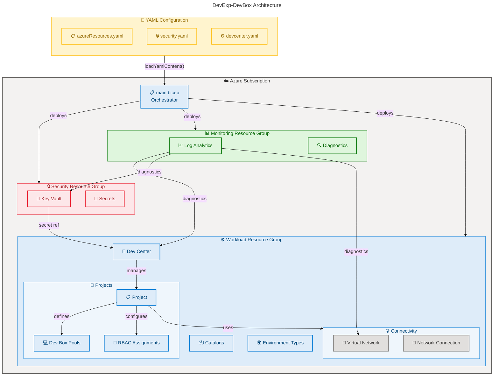

# DevExp-DevBox

[](https://opensource.org/licenses/MIT)
[](https://learn.microsoft.com/en-us/azure/dev-box/)
[](https://learn.microsoft.com/en-us/azure/azure-resource-manager/bicep/)
[]()

## Overview

**Overview**

DevExp-DevBox is a **Developer Experience Accelerator** for
[Microsoft Dev Box](https://learn.microsoft.com/en-us/azure/dev-box/overview-what-is-microsoft-dev-box)
that automates the provisioning and configuration of enterprise-grade developer
workstation environments on Azure. It enables platform engineering teams to
deliver self-service, cloud-powered development environments with consistent
tooling, security, and governance — reducing onboarding time from days to
minutes.

The accelerator uses a **configuration-driven** approach powered by Azure Bicep
and YAML settings files. Infrastructure modules for networking, identity,
security, monitoring, and workload orchestration are composed declaratively,
enabling teams to define Dev Center projects, Dev Box pools, environment types,
and RBAC policies through simple configuration changes rather than manual portal
operations.

> 💡 **Why This Matters**: Instead of manually configuring Dev Centers,
> projects, networking, Key Vaults, and role assignments through the Azure
> portal, teams define their entire developer platform in version-controlled
> configuration files and deploy it with a single command using the Azure
> Developer CLI (`azd`).

## Table of Contents

- [DevExp-DevBox](#devexp-devbox)
  - [Overview](#overview)
  - [Table of Contents](#table-of-contents)
  - [Architecture](#architecture)
  - [Features](#features)
  - [Requirements](#requirements)
  - [Quick Start](#quick-start)
  - [Deployment](#deployment)
  - [Configuration](#configuration)
  - [Usage](#usage)
  - [Project Structure](#project-structure)
  - [Contributing](#contributing)
  - [License](#license)

## Architecture

**Overview**

The solution follows a **modular, layered architecture** aligned with
[Azure Landing Zone](https://learn.microsoft.com/en-us/azure/cloud-adoption-framework/ready/landing-zone/)
principles. Resources are organized into functional resource groups (Security,
Monitoring, Workload) with clear separation of concerns between infrastructure
layers.

> 📌 **How It Works**: The `main.bicep` orchestrator deploys subscription-level
> resource groups, then delegates to domain-specific modules (security,
> monitoring, workload) that load their configuration from YAML settings files.
> Each workload project further composes connectivity, identity, and pool
> modules.


```mermaid
---
title: "DevExp-DevBox Architecture"
config:
  theme: base
  look: classic
  layout: dagre
  flowchart:
    htmlLabels: true
---
flowchart TB
    accTitle: DevExp-DevBox Architecture
    accDescr: Shows the modular infrastructure architecture with subscription-level orchestration deploying security, monitoring, and workload resource groups containing Azure services

    subgraph subscription["☁️ Azure Subscription"]
        direction TB

        orchestrator["📋 main.bicep<br/>Orchestrator"]:::core

        subgraph securityRG["🔒 Security Resource Group"]
            direction TB
            kv["🔑 Key Vault"]:::security
            secrets["📝 Secrets"]:::security
        end

        subgraph monitoringRG["📊 Monitoring Resource Group"]
            direction TB
            la["📈 Log Analytics"]:::monitoring
            diag["🔍 Diagnostics"]:::monitoring
        end

        subgraph workloadRG["⚙️ Workload Resource Group"]
            direction TB
            dc["🏢 Dev Center"]:::workload
            catalog["📦 Catalogs"]:::workload
            envType["🌍 Environment Types"]:::workload

            subgraph projects["📁 Projects"]
                direction TB
                proj["📋 Project"]:::workload
                pools["💻 Dev Box Pools"]:::workload
                identity["🔐 RBAC Assignments"]:::workload
            end

            subgraph connectivity["🌐 Connectivity"]
                direction TB
                vnet["🔗 Virtual Network"]:::network
                netconn["🔗 Network Connection"]:::network
            end
        end

        orchestrator -->|"deploys"| securityRG
        orchestrator -->|"deploys"| monitoringRG
        orchestrator -->|"deploys"| workloadRG
        kv -->|"secret ref"| dc
        la -->|"diagnostics"| dc
        la -->|"diagnostics"| kv
        la -->|"diagnostics"| vnet
        dc -->|"manages"| proj
        proj -->|"defines"| pools
        proj -->|"configures"| identity
        proj -->|"uses"| connectivity
    end

    subgraph config["📄 YAML Configuration"]
        direction TB
        azRes["📋 azureResources.yaml"]:::config
        secYaml["🔒 security.yaml"]:::config
        dcYaml["⚙️ devcenter.yaml"]:::config
    end

    config -->|"loadYamlContent()"| orchestrator

    style subscription fill:#F3F2F1,stroke:#605E5C,stroke-width:2px,color:#323130
    style securityRG fill:#FDE7E9,stroke:#E81123,stroke-width:1px,color:#A4262C
    style monitoringRG fill:#DFF6DD,stroke:#107C10,stroke-width:1px,color:#0B6A0B
    style workloadRG fill:#DEECF9,stroke:#0078D4,stroke-width:1px,color:#004578
    style projects fill:#EFF6FC,stroke:#0078D4,stroke-width:1px,color:#004578
    style connectivity fill:#EFF6FC,stroke:#0078D4,stroke-width:1px,color:#004578
    style config fill:#FFF4CE,stroke:#FFB900,stroke-width:1px,color:#986F0B

    classDef core fill:#DEECF9,stroke:#0078D4,stroke-width:2px,color:#004578
    classDef security fill:#FDE7E9,stroke:#E81123,stroke-width:2px,color:#A4262C
    classDef monitoring fill:#DFF6DD,stroke:#107C10,stroke-width:2px,color:#0B6A0B
    classDef workload fill:#DEECF9,stroke:#0078D4,stroke-width:2px,color:#004578
    classDef network fill:#E1DFDD,stroke:#8A8886,stroke-width:2px,color:#323130
    classDef config fill:#FFF4CE,stroke:#FFB900,stroke-width:2px,color:#986F0B
```

**Component Roles:**

| Component               | Purpose                                               | Module                                   |
| ----------------------- | ----------------------------------------------------- | ---------------------------------------- |
| 📋 **Orchestrator**     | Subscription-level deployment entry point             | `infra/main.bicep`                       |
| 🔑 **Key Vault**        | Stores secrets (e.g., GitHub PAT for catalog access)  | `src/security/keyVault.bicep`            |
| 📈 **Log Analytics**    | Centralized monitoring and diagnostics                | `src/management/logAnalytics.bicep`      |
| 🏢 **Dev Center**       | Core platform resource managing projects and catalogs | `src/workload/core/devCenter.bicep`      |
| 📋 **Projects**         | Team-scoped Dev Box configurations and environments   | `src/workload/project/project.bicep`     |
| 💻 **Dev Box Pools**    | Role-specific VM pools with custom images             | `src/workload/project/projectPool.bicep` |
| 🔐 **RBAC Assignments** | Least-privilege identity and access management        | `src/identity/`                          |
| 🔗 **Connectivity**     | VNet and network connections for Dev Box networking   | `src/connectivity/`                      |
| 📄 **YAML Config**      | Declarative settings for all resources                | `infra/settings/`                        |

## Features

**Overview**

DevExp-DevBox provides a comprehensive set of capabilities for platform
engineering teams to stand up and manage Microsoft Dev Box environments at
scale. Each feature is designed to reduce manual effort, enforce organizational
standards, and accelerate developer onboarding.

> 💡 **Why This Matters**: Platform teams can deliver production-ready Dev Box
> environments in minutes instead of days, with built-in security, monitoring,
> and governance — all managed as version-controlled configuration.

| Feature                                | Description                                                                                                     | Status    |
| -------------------------------------- | --------------------------------------------------------------------------------------------------------------- | --------- |
| 🏢 **Dev Center Provisioning**         | Automated creation and configuration of Azure Dev Center with catalogs, environment types, and managed identity | ✅ Stable |
| 📋 **Multi-Project Support**           | Deploy multiple team-scoped projects with independent pools, catalogs, and RBAC policies                        | ✅ Stable |
| 💻 **Role-Specific Dev Box Pools**     | Define VM pools per role (e.g., backend engineer, frontend engineer) with tailored SKUs and images              | ✅ Stable |
| 🔒 **Integrated Security**             | Azure Key Vault with RBAC authorization, purge protection, soft delete, and secret management                   | ✅ Stable |
| 📈 **Centralized Monitoring**          | Log Analytics workspace with diagnostic settings across all resources (VNets, Key Vault, Dev Center)            | ✅ Stable |
| 🔐 **Least-Privilege RBAC**            | System-assigned managed identities with scoped role assignments following Azure best practices                  | ✅ Stable |
| 🌐 **Network Connectivity**            | Managed and unmanaged VNet support with subnet configuration and Dev Center network attachments                 | ✅ Stable |
| 📄 **Configuration-as-Code**           | YAML-based settings with JSON Schema validation for Dev Center, security, and resource organization             | ✅ Stable |
| 🚀 **Azure Developer CLI Integration** | One-command deployment via `azd provision` with environment-aware configuration                                 | ✅ Stable |
| 🌍 **Multi-Environment Support**       | Environment types for dev, staging, and UAT with independent deployment targets                                 | ✅ Stable |
| 🔗 **Source Control Integration**      | GitHub and Azure DevOps Git catalog support with secure token management                                        | ✅ Stable |
| 🧹 **Automated Cleanup**               | PowerShell script to tear down deployments, credentials, role assignments, and resource groups                  | ✅ Stable |

## Requirements

**Overview**

Before deploying the accelerator, ensure the following tools and permissions are
available. The setup scripts validate tool availability automatically at
runtime, but Azure permissions must be configured in advance by a subscription
administrator.

> ⚠️ **Important**: The deploying identity requires **Contributor** and **User
> Access Administrator** roles at the subscription level to create resource
> groups, deploy resources, and assign RBAC roles.

| Requirement                        | Minimum Version                         | Purpose                                                              |
| ---------------------------------- | --------------------------------------- | -------------------------------------------------------------------- |
| ☁️ **Azure Subscription**          | Active, Enabled state                   | Target for all resource deployments                                  |
| 🛠️ **Azure CLI** (`az`)            | 2.50+                                   | Azure authentication and resource management                         |
| 🚀 **Azure Developer CLI** (`azd`) | 1.0+                                    | Environment management and provisioning orchestration                |
| 🐙 **GitHub CLI** (`gh`)           | 2.0+                                    | GitHub authentication and token retrieval (if using GitHub catalogs) |
| 📦 **jq**                          | 1.6+                                    | JSON processing in Bash setup script (Linux/macOS only)              |
| 🔑 **Azure RBAC Permissions**      | Contributor + User Access Administrator | Subscription-level roles for resource and identity management        |
| 🌐 **Azure AD Group(s)**           | —                                       | Pre-created groups for Dev Manager and Developer role assignments    |

## Quick Start

Get up and running with DevExp-DevBox in under 10 minutes.

**1. Clone the repository**

```bash
git clone https://github.com/Evilazaro/DevExp-DevBox.git
cd DevExp-DevBox
```

**2. Authenticate with Azure and GitHub**

```bash
az login
gh auth login
```

**3. Run the setup script**

On **Linux/macOS**:

```bash
chmod +x setUp.sh
./setUp.sh -e "dev" -s "github"
```

On **Windows** (PowerShell):

```powershell
.\setUp.ps1 -EnvName "dev" -SourceControl "github"
```

**4. Provision Azure resources**

```bash
azd provision -e dev
```

> 💡 **Tip**: The setup script initializes the `azd` environment and stores the
> GitHub token securely. After setup, `azd provision` deploys all infrastructure
> defined in `infra/main.bicep`.

**Expected output:**

```text
✅ [2026-03-02 10:00:00] All required tools are available
✅ [2026-03-02 10:00:01] GitHub authentication verified successfully
✅ [2026-03-02 10:00:02] GitHub token retrieved and stored securely
✅ [2026-03-02 10:00:03] Azure Developer CLI environment 'dev' initialized successfully.
✅ [2026-03-02 10:00:04] Dev Box environment 'dev' setup successfully
```

## Deployment

**Overview**

The deployment process follows a two-phase approach: environment initialization
(handled by the setup scripts) and infrastructure provisioning (handled by
`azd`). The Bicep modules deploy resources at the subscription scope, creating
isolated resource groups for security, monitoring, and workload concerns.

**Step 1: Configure environment settings**

Edit the YAML configuration files in `infra/settings/` to match your
organization:

```yaml
# infra/settings/workload/devcenter.yaml
name: 'devexp-devcenter'
catalogItemSyncEnableStatus: 'Enabled'
microsoftHostedNetworkEnableStatus: 'Enabled'
installAzureMonitorAgentEnableStatus: 'Enabled'
```

**Step 2: Set deployment parameters**

The `infra/main.parameters.json` file references environment variables set by
the setup scripts:

```json
{
  "parameters": {
    "environmentName": { "value": "${AZURE_ENV_NAME}" },
    "location": { "value": "${AZURE_LOCATION}" },
    "secretValue": { "value": "${KEY_VAULT_SECRET}" }
  }
}
```

**Step 3: Provision resources**

```bash
azd provision -e dev
```

This deploys the following resource groups and their contents:

| Resource Group                           | Resources                                        | Purpose                          |
| ---------------------------------------- | ------------------------------------------------ | -------------------------------- |
| 🔒 `devexp-security-{env}-{region}-RG`   | Key Vault, Secrets                               | Credential and secret management |
| 📊 `devexp-monitoring-{env}-{region}-RG` | Log Analytics Workspace, Solutions               | Centralized monitoring           |
| ⚙️ `devexp-workload-{env}-{region}-RG`   | Dev Center, Projects, Pools, Network Connections | Developer workstation platform   |

**Step 4: Verify deployment**

```bash
azd env get-values -e dev
```

> ⚠️ **Note**: Deployment requires an active Azure subscription with sufficient
> quota for the selected VM SKUs. Check
> [Azure subscription limits](https://learn.microsoft.com/en-us/azure/azure-resource-manager/management/azure-subscription-service-limits)
> if provisioning fails.

## Configuration

**Overview**

All infrastructure settings are managed through YAML configuration files stored
in `infra/settings/`. Each file has a corresponding JSON Schema for validation,
enabling IDE autocompletion and ensuring configuration correctness before
deployment. This configuration-as-code approach lets teams version, review, and
audit infrastructure changes through standard Git workflows.

> 📌 **How It Works**: Bicep modules use the `loadYamlContent()` function to
> read configuration at deployment time. Changes to YAML files take effect on
> the next `azd provision` run without modifying any Bicep code.

### Resource Organization

File: `infra/settings/resourceOrganization/azureResources.yaml`

Defines the resource group structure following Azure Landing Zone principles:

```yaml
workload:
  create: true
  name: devexp-workload
  tags:
    environment: dev
    division: Platforms
    team: DevExP
    project: Contoso-DevExp-DevBox

security:
  create: true
  name: devexp-security

monitoring:
  create: true
  name: devexp-monitoring
```

### Security Settings

File: `infra/settings/security/security.yaml`

Configures Azure Key Vault with security best practices:

```yaml
keyVault:
  name: contoso
  enablePurgeProtection: true
  enableSoftDelete: true
  softDeleteRetentionInDays: 7
  enableRbacAuthorization: true
```

### Dev Center Configuration

File: `infra/settings/workload/devcenter.yaml`

Defines the complete Dev Center topology — projects, catalogs, pools,
environment types, and RBAC assignments:

```yaml
projects:
  - name: 'eShop'
    description: 'eShop project.'
    pools:
      - name: 'backend-engineer'
        imageDefinitionName: 'eShop-backend-engineer'
        vmSku: general_i_32c128gb512ssd_v2
      - name: 'frontend-engineer'
        imageDefinitionName: 'eShop-frontend-engineer'
        vmSku: general_i_16c64gb256ssd_v2
    environmentTypes:
      - name: 'dev'
      - name: 'staging'
      - name: 'UAT'
```

### Configuration Files Reference

| File                     | Purpose                                         | Schema                                                                                                       |
| ------------------------ | ----------------------------------------------- | ------------------------------------------------------------------------------------------------------------ |
| 📄 `azureResources.yaml` | Resource group organization and tagging         | `azureResources.schema.json`                                                                                 |
| 🔒 `security.yaml`       | Key Vault settings and security policies        | `security.schema.json`                                                                                       |
| ⚙️ `devcenter.yaml`      | Dev Center, projects, pools, catalogs, and RBAC | `devcenter.schema.json`                                                                                      |
| 🚀 `azure.yaml`          | Azure Developer CLI hooks and project name      | [azd schema](https://raw.githubusercontent.com/Azure/azure-dev/refs/heads/main/schemas/v1.0/azure.yaml.json) |

## Usage

### Adding a New Project

Add a new project block to `infra/settings/workload/devcenter.yaml`:

```yaml
projects:
  - name: 'myNewProject'
    description: 'My new team project.'
    network:
      name: myNewProject
      create: true
      resourceGroupName: 'myNewProject-connectivity-RG'
      virtualNetworkType: Managed
      addressPrefixes:
        - 10.1.0.0/16
      subnets:
        - name: myNewProject-subnet
          properties:
            addressPrefix: 10.1.1.0/24
    identity:
      type: SystemAssigned
      roleAssignments:
        - azureADGroupId: '<your-azure-ad-group-id>'
          azureADGroupName: 'My Team Developers'
          azureRBACRoles:
            - name: 'Dev Box User'
              id: '45d50f46-0b78-4001-a660-4198cbe8cd05'
              scope: Project
    pools:
      - name: 'developer'
        imageDefinitionName: 'myNewProject-developer'
        vmSku: general_i_16c64gb256ssd_v2
    environmentTypes:
      - name: 'dev'
        deploymentTargetId: ''
    catalogs:
      - name: 'environments'
        type: environmentDefinition
        sourceControl: gitHub
        visibility: private
        uri: 'https://github.com/your-org/your-repo.git'
        branch: 'main'
        path: '/.devcenter/environments'
```

Then redeploy:

```bash
azd provision -e dev
```

### Supported VM SKUs

Dev Box pools reference VM SKUs for workstation sizing:

| SKU                              | vCPUs | RAM    | Storage    | Use Case                              |
| -------------------------------- | ----- | ------ | ---------- | ------------------------------------- |
| 💻 `general_i_16c64gb256ssd_v2`  | 16    | 64 GB  | 256 GB SSD | Frontend development, light workloads |
| 🖥️ `general_i_32c128gb512ssd_v2` | 32    | 128 GB | 512 GB SSD | Backend development, heavy workloads  |

### Cleanup

To tear down all deployed resources, credentials, and role assignments:

```powershell
.\cleanSetUp.ps1 -EnvName "dev" -Location "eastus2"
```

> ⚠️ **Warning**: This operation is destructive and removes all resources,
> service principals, and GitHub secrets associated with the environment.

## Project Structure

```text
DevExp-DevBox/
├── azure.yaml                          # Azure Developer CLI configuration (Linux/macOS)
├── azure-pwh.yaml                      # Azure Developer CLI configuration (Windows)
├── setUp.ps1                           # PowerShell setup script
├── setUp.sh                            # Bash setup script
├── cleanSetUp.ps1                      # Cleanup script
├── package.json                        # Documentation tooling (Hugo/Docsy)
├── LICENSE                             # MIT License
├── CONTRIBUTING.md                     # Contribution guidelines
├── infra/
│   ├── main.bicep                      # Subscription-level orchestrator
│   ├── main.parameters.json            # Deployment parameters
│   └── settings/
│       ├── resourceOrganization/
│       │   ├── azureResources.yaml     # Resource group configuration
│       │   └── azureResources.schema.json
│       ├── security/
│       │   ├── security.yaml           # Key Vault configuration
│       │   └── security.schema.json
│       └── workload/
│           ├── devcenter.yaml          # Dev Center configuration
│           └── devcenter.schema.json
└── src/
    ├── connectivity/                   # VNet and network connection modules
    │   ├── connectivity.bicep
    │   ├── vnet.bicep
    │   ├── networkConnection.bicep
    │   └── resourceGroup.bicep
    ├── identity/                       # RBAC role assignment modules
    │   ├── devCenterRoleAssignment.bicep
    │   ├── devCenterRoleAssignmentRG.bicep
    │   ├── orgRoleAssignment.bicep
    │   ├── projectIdentityRoleAssignment.bicep
    │   ├── projectIdentityRoleAssignmentRG.bicep
    │   └── keyVaultAccess.bicep
    ├── management/                     # Monitoring modules
    │   └── logAnalytics.bicep
    ├── security/                       # Key Vault and secret modules
    │   ├── security.bicep
    │   ├── keyVault.bicep
    │   └── secret.bicep
    └── workload/                       # Dev Center workload modules
        ├── workload.bicep
        ├── core/
        │   ├── devCenter.bicep
        │   ├── catalog.bicep
        │   └── environmentType.bicep
        └── project/
            ├── project.bicep
            ├── projectCatalog.bicep
            ├── projectEnvironmentType.bicep
            └── projectPool.bicep
```

## Contributing

**Overview**

Contributions are welcome and follow a structured process to maintain quality
and consistency. The project uses a product-oriented delivery model with Epics,
Features, and Tasks tracked through GitHub Issues and managed via pull requests.

> 💡 **Getting Started**: Review the [CONTRIBUTING.md](CONTRIBUTING.md) file for
> the complete contribution guide, including issue management, branching
> conventions, engineering standards, and definition of done for each work item
> type.

Key guidelines:

- **Bicep modules** must be parameterized, idempotent, and reusable across
  environments
- **PowerShell scripts** must support PowerShell 7+, include error handling, and
  be safe for re-runs
- **Documentation** follows docs-as-code and must be updated in the same PR as
  code changes
- **Pull requests** must reference the issue they close and include validation
  evidence

Branch naming convention:

```text
feature/<short-name>
task/<short-name>
fix/<short-name>
docs/<short-name>
```

## License

This project is licensed under the **MIT License** — see the [LICENSE](LICENSE)
file for details.

Copyright (c) 2025 Evilázaro Alves.
