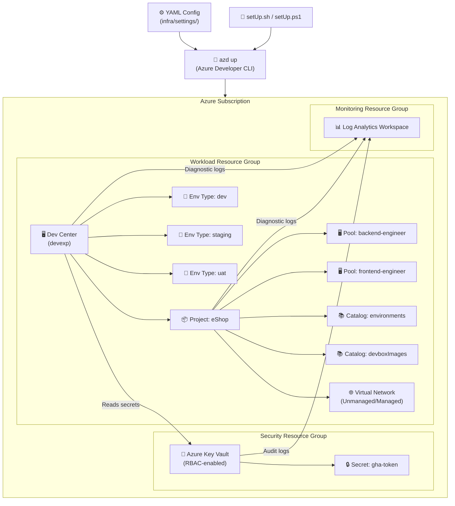

# DevExp-DevBox — Microsoft Dev Box Accelerator

[](LICENSE)
[](https://learn.microsoft.com/en-us/azure/developer/azure-developer-cli/)
[](https://learn.microsoft.com/en-us/azure/azure-resource-manager/bicep/)
[](https://azure.microsoft.com)

**DevExp-DevBox** is a production-ready Azure Developer CLI (`azd`) accelerator
that provisions a complete
[Microsoft Dev Box](https://learn.microsoft.com/en-us/azure/dev-box/overview-what-is-microsoft-dev-box)
platform on Azure. It delivers pre-configured, role-specific cloud developer
workstations backed by a fully automated infrastructure pipeline, following
Azure Landing Zone principles for governance, security, and scalability.

The accelerator follows a **configuration-as-code** model: all resource settings
are expressed in human-readable YAML files, separated by concern (workload,
security, monitoring). A single `azd up` command reads these files and
provisions the complete platform — Dev Centers, Dev Box pools, Key Vault
secrets, Log Analytics, managed identities, and network connectivity — without
manual portal interaction.

Built for platform engineering teams that need to onboard developers quickly and
consistently, the solution supports multiple projects per Dev Center,
role-specific Dev Box pools (e.g., backend engineer, frontend engineer), and
integrates natively with both **GitHub** and **Azure DevOps** as source control
platforms.

---

## Table of Contents

- [Features](#features)
- [Architecture](#architecture)
- [Technologies Used](#technologies-used)
- [Quick Start](#quick-start)
- [Configuration](#configuration)
- [Deployment](#deployment)
- [Usage](#usage)
- [Contributing](#contributing)
- [License](#license)

---

## Features

- ⚡ **One-command deployment** — `azd up` provisions the entire platform
  end-to-end
- 🏗️ **Azure Landing Zone alignment** — Workload, Security, and Monitoring
  resource groups with consistent tagging
- 🖥️ **Microsoft Dev Box** — Centralized Dev Center with role-specific pools
  (backend, frontend, and more)
- 🔐 **Zero-trust security** — Azure Key Vault for secrets, RBAC with
  least-privilege managed identities
- 📊 **Built-in observability** — Log Analytics workspace connected to every
  deployed resource
- 🔗 **Multi-platform source control** — GitHub and Azure DevOps (ADO)
  integration out of the box
- 📁 **Configuration-as-code** — All settings in versioned YAML files; no portal
  required
- 🌐 **Flexible networking** — Managed or unmanaged virtual networks per
  project, configurable address spaces
- 🔄 **Multi-project support** — Multiple Dev Box projects per Dev Center, each
  with isolated identity and pools
- 🏷️ **Consistent governance** — Tag policies applied at resource group creation
  via YAML configuration

---

## Architecture

The accelerator deploys at the **Azure subscription** scope and organises
resources across three logical landing zones.


```mermaid
graph TD
    subgraph Subscription["Azure Subscription"]
        subgraph WorkloadRG["Workload Resource Group"]
            DC["🖥️ Dev Center\n(devexp)"]
            DC --> P1["📦 Project: eShop"]
            P1 --> Pool1["🖥️ Pool: backend-engineer"]
            P1 --> Pool2["🖥️ Pool: frontend-engineer"]
            P1 --> Cat1["📚 Catalog: environments"]
            P1 --> Cat2["📚 Catalog: devboxImages"]
            P1 --> VNet["🌐 Virtual Network\n(Unmanaged/Managed)"]
            DC --> ET1["🧪 Env Type: dev"]
            DC --> ET2["🧪 Env Type: staging"]
            DC --> ET3["🧪 Env Type: uat"]
        end

        subgraph SecurityRG["Security Resource Group"]
            KV["🔑 Azure Key Vault\n(RBAC-enabled)"]
            KV --> Secret["🔒 Secret: gha-token"]
        end

        subgraph MonitoringRG["Monitoring Resource Group"]
            LA["📊 Log Analytics Workspace"]
        end

        DC -->|"Diagnostic logs"| LA
        KV -->|"Audit logs"| LA
        P1 -->|"Diagnostic logs"| LA
        DC -->|"Reads secrets"| KV
    end

    azd["🚀 azd up\n(Azure Developer CLI)"] --> Subscription
    YAML["⚙️ YAML Config\n(infra/settings/)"] --> azd
    Script["📜 setUp.sh / setUp.ps1"] --> azd
```

### Component Interactions

| Component            | Role                                       | Scope                      |
| -------------------- | ------------------------------------------ | -------------------------- |
| **Dev Center**       | Central hub for Dev Box management         | Workload Resource Group    |
| **Dev Box Projects** | Isolated environments per team/product     | Workload Resource Group    |
| **Dev Box Pools**    | Role-specific VM collections               | Per Project                |
| **Key Vault**        | Stores secrets (e.g., GitHub Access Token) | Security Resource Group    |
| **Log Analytics**    | Centralised monitoring and diagnostics     | Monitoring Resource Group  |
| **Virtual Networks** | Network isolation per project              | Per Project (Connectivity) |
| **Managed Identity** | Service-to-service authentication          | Dev Center + Projects      |

> [!IMPORTANT] The accelerator uses **System-Assigned Managed Identities** for
> both the Dev Center and each project, following the principle of least
> privilege. No credentials are stored in code.

---

## Technologies Used

| Technology                                                                                               | Purpose                        | Version         |
| -------------------------------------------------------------------------------------------------------- | ------------------------------ | --------------- |
| [Azure Bicep](https://learn.microsoft.com/en-us/azure/azure-resource-manager/bicep/)                     | Infrastructure as Code         | Latest          |
| [Azure Developer CLI (`azd`)](https://learn.microsoft.com/en-us/azure/developer/azure-developer-cli/)    | Deployment orchestration       | ≥ 1.0           |
| [Microsoft Dev Box](https://learn.microsoft.com/en-us/azure/dev-box/overview-what-is-microsoft-dev-box)  | Cloud developer workstations   | GA              |
| [Azure Key Vault](https://learn.microsoft.com/en-us/azure/key-vault/)                                    | Secrets management             | GA              |
| [Azure Log Analytics](https://learn.microsoft.com/en-us/azure/azure-monitor/logs/log-analytics-overview) | Monitoring and observability   | GA              |
| [Azure Virtual Network](https://learn.microsoft.com/en-us/azure/virtual-network/)                        | Network isolation              | GA              |
| PowerShell / Bash                                                                                        | Setup and provisioning scripts | PS 7+ / Bash 5+ |
| YAML                                                                                                     | Configuration files            | —               |
| GitHub / Azure DevOps                                                                                    | Source control integration     | —               |

---

## Quick Start

### Prerequisites

Ensure the following tools are installed and authenticated before proceeding:

| Tool                                                                                                             | Minimum Version | Install Guide                                     |
| ---------------------------------------------------------------------------------------------------------------- | --------------- | ------------------------------------------------- |
| [Azure CLI (`az`)](https://learn.microsoft.com/en-us/cli/azure/install-azure-cli)                                | 2.60+           | `winget install Microsoft.AzureCLI`               |
| [Azure Developer CLI (`azd`)](https://learn.microsoft.com/en-us/azure/developer/azure-developer-cli/install-azd) | 1.0+            | `winget install Microsoft.Azd`                    |
| [GitHub CLI (`gh`)](https://cli.github.com/)                                                                     | 2.0+            | `winget install GitHub.cli` _(if using GitHub)_   |
| [PowerShell](https://github.com/PowerShell/PowerShell)                                                           | 7.0+            | `winget install Microsoft.PowerShell` _(Windows)_ |
| [jq](https://jqlang.github.io/jq/)                                                                               | 1.6+            | `winget install jqlang.jq`                        |

> [!NOTE] You need an **active Azure subscription** with permissions to create
> resource groups and assign RBAC roles at the subscription scope.

### Installation

1. **Clone the repository**

   ```bash
   git clone https://github.com/Evilazaro/DevExp-DevBox.git
   cd DevExp-DevBox
   ```

2. **Authenticate with Azure**

   ```bash
   az login
   azd auth login
   ```

3. **Authenticate with GitHub** _(skip if using Azure DevOps)_

   ```bash
   gh auth login
   ```

4. **Review and customise configuration** _(optional — defaults are ready to
   use)_

   ```bash
   # Edit the Dev Center workload settings
   code infra/settings/workload/devcenter.yaml

   # Edit resource group organisation
   code infra/settings/resourceOrganization/azureResources.yaml

   # Edit Key Vault settings
   code infra/settings/security/security.yaml
   ```

5. **Deploy the platform**

   ```bash
   azd up
   ```

   `azd` will prompt for:
   - `AZURE_ENV_NAME` — a short environment name (e.g., `dev`, `prod`)
   - `AZURE_LOCATION` — target Azure region (e.g., `eastus2`)
   - `KEY_VAULT_SECRET` — the secret value to store in Key Vault (e.g., a GitHub
     personal access token)

> [!TIP] For a fast hello-world deployment, accept all YAML defaults and run
> `azd up`. The entire platform is provisioned in a single step.

---

## Configuration

All configuration lives under `infra/settings/` and is read at deploy time by
the Bicep templates. Modify these files to customise your environment — no code
changes are required.

### Resource Organisation — `infra/settings/resourceOrganization/azureResources.yaml`

Controls whether resource groups are created and how they are named and tagged.

```yaml
workload:
  create: true # Set false to use an existing resource group
  name: devexp-workload # Base name; suffix added automatically
  tags:
    environment: dev
    division: Platforms
    team: DevExP
    project: Contoso-DevExp-DevBox
    costCenter: IT
    owner: Contoso

security:
  create: false # When false, uses the workload resource group
  name: devexp-workload

monitoring:
  create: false # When false, uses the workload resource group
  name: devexp-workload
```

> [!NOTE] When `security.create` or `monitoring.create` is `false`, the
> corresponding resources are deployed into the **workload** resource group.

### Dev Center — `infra/settings/workload/devcenter.yaml`

The primary configuration file. Controls the Dev Center, projects, catalogs,
environment types, and Dev Box pools.

**Key top-level settings:**

| Property                               | Default   | Description                              |
| -------------------------------------- | --------- | ---------------------------------------- |
| `name`                                 | `devexp`  | Name of the Dev Center resource          |
| `catalogItemSyncEnableStatus`          | `Enabled` | Auto-sync catalog items                  |
| `microsoftHostedNetworkEnableStatus`   | `Enabled` | Use Microsoft-hosted networks            |
| `installAzureMonitorAgentEnableStatus` | `Enabled` | Install Azure Monitor agent on Dev Boxes |

**Adding a new project:**

```yaml
projects:
  - name: 'MyTeam'
    description: 'My Team Dev Box project'
    network:
      name: myteam-vnet
      create: true
      resourceGroupName: 'myteam-connectivity-RG'
      virtualNetworkType: Managed
      addressPrefixes:
        - 10.1.0.0/16
      subnets:
        - name: myteam-subnet
          properties:
            addressPrefix: 10.1.1.0/24
    pools:
      - name: 'developer'
        imageDefinitionName: 'myteam-dev'
        vmSku: general_i_16c64gb256ssd_v2
    environmentTypes:
      - name: 'dev'
        deploymentTargetId: ''
    catalogs:
      - name: 'environments'
        type: environmentDefinition
        sourceControl: gitHub
        visibility: private
        uri: 'https://github.com/MyOrg/MyRepo.git'
        branch: 'main'
        path: '/.devcenter/environments'
```

**Available VM SKUs for Dev Box pools:**

| SKU                           | vCPUs | RAM    | Storage    |
| ----------------------------- | ----- | ------ | ---------- |
| `general_i_8c32gb256ssd_v2`   | 8     | 32 GB  | 256 GB SSD |
| `general_i_16c64gb256ssd_v2`  | 16    | 64 GB  | 256 GB SSD |
| `general_i_32c128gb512ssd_v2` | 32    | 128 GB | 512 GB SSD |

### Security — `infra/settings/security/security.yaml`

Controls Azure Key Vault provisioning.

```yaml
create: true
keyVault:
  name: contoso # Must be globally unique; 3–24 alphanumeric characters
  secretName: gha-token # Name of the secret stored in Key Vault
  enablePurgeProtection: true
  enableSoftDelete: true
  softDeleteRetentionInDays: 7
  enableRbacAuthorization: true
```

> [!WARNING] `enablePurgeProtection: true` prevents permanent deletion of the
> Key Vault. Disable only in non-production environments where rapid teardown is
> required.

### Environment Variables

The following environment variables are consumed by `azd` and the setup scripts:

| Variable                  | Required | Description                                          |
| ------------------------- | -------- | ---------------------------------------------------- |
| `AZURE_ENV_NAME`          | ✅       | Short name for the environment (e.g., `dev`, `prod`) |
| `AZURE_LOCATION`          | ✅       | Azure region for resource deployment                 |
| `KEY_VAULT_SECRET`        | ✅       | Secret value stored in Key Vault (e.g., GitHub PAT)  |
| `SOURCE_CONTROL_PLATFORM` | ❌       | `github` (default) or `adogit`                       |

Set them manually or let `azd up` prompt for them interactively.

```bash
# Set environment variables manually (Linux/macOS)
export AZURE_ENV_NAME="dev"
export AZURE_LOCATION="eastus2"
export KEY_VAULT_SECRET="<your-github-pat>"
export SOURCE_CONTROL_PLATFORM="github"
```

```powershell
# Set environment variables manually (Windows PowerShell)
$env:AZURE_ENV_NAME = "dev"
$env:AZURE_LOCATION = "eastus2"
$env:KEY_VAULT_SECRET = "<your-github-pat>"
$env:SOURCE_CONTROL_PLATFORM = "github"
```

### Supported Azure Regions

The deployment is validated in the following regions:

`eastus` · `eastus2` · `westus` · `westus2` · `westus3` · `centralus` ·
`northeurope` · `westeurope` · `southeastasia` · `australiaeast` · `japaneast` ·
`uksouth` · `canadacentral` · `swedencentral` · `switzerlandnorth` ·
`germanywestcentral`

---

## Deployment

### Deploy with Azure Developer CLI (recommended)

```bash
# Full deployment: provision infrastructure and configure environment
azd up
```

This single command:

1. Runs `setUp.sh` (Linux/macOS) or `setUp.ps1` (Windows) as a pre-provision
   hook
2. Provisions all Azure resource groups, Key Vault, Log Analytics, Dev Center,
   projects, and pools
3. Stores the required secret in Key Vault
4. Outputs resource names and IDs for downstream use

### Provision infrastructure only

```bash
azd provision
```

### Tear down the environment

```bash
azd down
```

> [!CAUTION] `azd down` deletes all provisioned resources. If
> `enablePurgeProtection` is set to `true` in `security.yaml`, the Key Vault
> cannot be permanently purged for the configured retention period.

### Manual setup script (advanced)

```bash
# Linux / macOS
./setUp.sh -e "dev" -s "github"

# Windows (PowerShell 7+)
./setUp.ps1 -e "dev" -s "github"
```

| Parameter                 | Values                | Description             |
| ------------------------- | --------------------- | ----------------------- |
| `-e` / `--env-name`       | Any string 2–10 chars | Environment name        |
| `-s` / `--source-control` | `github`, `adogit`    | Source control platform |

### Deployment outputs

After a successful deployment, `azd` exposes the following outputs:

| Output                                 | Description                     |
| -------------------------------------- | ------------------------------- |
| `AZURE_DEV_CENTER_NAME`                | Name of the deployed Dev Center |
| `AZURE_DEV_CENTER_PROJECTS`            | Array of deployed project names |
| `AZURE_KEY_VAULT_NAME`                 | Name of the Key Vault           |
| `AZURE_KEY_VAULT_ENDPOINT`             | URI endpoint of the Key Vault   |
| `AZURE_LOG_ANALYTICS_WORKSPACE_NAME`   | Log Analytics workspace name    |
| `WORKLOAD_AZURE_RESOURCE_GROUP_NAME`   | Workload resource group name    |
| `SECURITY_AZURE_RESOURCE_GROUP_NAME`   | Security resource group name    |
| `MONITORING_AZURE_RESOURCE_GROUP_NAME` | Monitoring resource group name  |

---

## Usage

### Accessing the Dev Center

After deployment, navigate to the
[Microsoft Dev Box portal](https://devbox.microsoft.com) or the Azure portal to
manage Dev Boxes.

```bash
# Get the Dev Center name from azd outputs
azd env get-values | grep AZURE_DEV_CENTER_NAME
```

### Create a Dev Box (end user)

1. Open the [Microsoft Dev Box portal](https://devbox.microsoft.com)
2. Select the project assigned to your team
3. Choose a pool (e.g., `backend-engineer` or `frontend-engineer`)
4. Click **Create** — the Dev Box provisions automatically using the pool's
   image definition

### View deployed resource names

```bash
azd env get-values
```

Example output:

```
AZURE_DEV_CENTER_NAME=devexp-dev-eastus2
AZURE_KEY_VAULT_NAME=contoso-dev-eastus2
AZURE_LOG_ANALYTICS_WORKSPACE_NAME=logAnalytics-dev-eastus2
WORKLOAD_AZURE_RESOURCE_GROUP_NAME=devexp-workload-dev-eastus2-RG
```

### Modify configuration and redeploy

1. Edit the relevant YAML file under `infra/settings/`
2. Run `azd provision` to apply the changes

```bash
# Example: add a new project pool, then redeploy
vim infra/settings/workload/devcenter.yaml
azd provision
```

> [!TIP] Use `azd env set <KEY> <VALUE>` to update environment variable values
> without re-running the full interactive prompt.

---

## Contributing

Contributions are welcome. To contribute:

1. **Fork** the repository on GitHub
2. **Create** a feature branch: `git checkout -b feature/my-feature`
3. **Make** your changes following the existing code style
4. **Test** your changes with `azd provision` against a non-production
   subscription
5. **Submit** a pull request with a clear description of the change

> [!NOTE] All infrastructure changes must be validated against at least one
> supported Azure region before submitting a pull request.

---

## License

This project is licensed under the **MIT License**. See [LICENSE](LICENSE) for
full details.

Copyright (c) 2025 Evilázaro Alves
